# AI - Landscape - Abril 2025

# Landscape de Inteligência Artificial - Abril 2025

## Introdução

O cenário de Inteligência Artificial continua em acelerada evolução, com avanços significativos em diversas áreas. Este documento apresenta um panorama abrangente e atualizado das principais categorias, ferramentas, aplicações e frameworks de IA disponíveis atualmente (abril de 2025), oferecendo uma visão clara do estado da arte neste campo dinâmico.

## Categorias Principais de IA

```mermaid
graph TD
    IA[Inteligência Artificial] --> MLA[Modelos de Linguagem]
    IA --> CV[Visão Computacional]
    IA --> ML[Machine Learning]
    IA --> RL[Reinforcement Learning]
    IA --> AG[IA Generativa]
    IA --> AIE[IA Embarcada/Edge AI]
    IA --> MLOPS[MLOps]

    MLA --> LLM[Large Language Models]
    MLA --> MT[Modelos de Tradução]
    
    CV --> OR[Reconhecimento de Objetos]
    CV --> FR[Reconhecimento Facial]
    CV --> IS[Segmentação de Imagens]
    CV --> VG[IA Generativa Visual]
    
    ML --> SUP[Aprendizado Supervisionado]
    ML --> UNS[Aprendizado Não-Supervisionado]
    ML --> SL[Aprendizado Semi-Supervisionado]
    ML --> DL[Deep Learning]
    ML --> FL[Federated Learning]
    
    RL --> DRL[Deep Reinforcement Learning]
    RL --> MRL[Multi-Agent RL]
    
    AG --> TTI[Text-to-Image]
    AG --> TTS[Text-to-Speech]
    AG --> STT[Speech-to-Text]
    AG --> TTM[Text-to-Music]
    AG --> TTV[Text-to-Video]
    AG --> TTX[Text-to-X]
    
    MLOPS --> CD[Continuous Deployment]
    MLOPS --> MT[Monitoring]
    MLOPS --> VER[Versioning]
    MLOPS --> ORC[Orchestration]
```

## 1. Modelos de Linguagem (LLMs)

Os Grandes Modelos de Linguagem representam um dos avanços mais significativos na IA recente, com capacidade de compreender contexto, gerar texto natural e resolver problemas complexos.

### Principais Modelos e Plataformas

|Modelo/Plataforma|Empresa|Características Principais|
|---|---|---|
|[GPT-4.5](https://openai.com/gpt-4)|OpenAI|Foco em aprendizado não-supervisionado, melhorias em processamento contextual e multimodal|
|[GPT-4o](https://openai.com/gpt-4o)|OpenAI|Omni-modal, processamento em tempo real de voz, texto e imagem|
|[Claude 3.7 Sonnet](https://www.anthropic.com/claude)|Anthropic|Capacidade avançada de raciocínio, análise de documentos, segurança avançada|
|[Gemini 2.5 Pro](https://gemini.google.com/)|Google|Multimodal, janela de contexto de 1M tokens, capacidades avançadas de raciocínio|
|[Gemini 2.5 Flash](https://gemini.google.com/)|Google|Otimizado para latência baixa e processamento em alta velocidade|
|[Llama 4 Scout](https://ai.meta.com/llama/)|Meta|Janela de contexto de 10M tokens, otimizado para velocidade (2600 tokens/s)|
|[Llama 4 Maverick](https://ai.meta.com/llama/)|Meta|Janela de contexto de 10M tokens, capacidades avançadas de raciocínio|
|[OpenAI o3](https://openai.com/)|OpenAI|Modelo especializado em raciocínio e solução de problemas complexos|
|[DeepSeek R1](https://www.deepseek.com/)|DeepSeek|Modelo open-weight de 671B parâmetros com foco em raciocínio avançado|
|[Grok 3](https://x.ai/)|xAI|Acesso a dados em tempo real, capacidade de raciocínio explícito|
|[Mistral 3](https://mistral.ai/)|Mistral AI|Alta eficiência, desempenho em tarefas de baixa latência|
|[Nemotron Ultra](https://www.nvidia.com/en-us/ai-data-science/)|NVIDIA|Modelo especializado em raciocínio adaptativo|

### Frameworks para Fine-tuning e Implementação de LLMs

- [LangChain](https://www.langchain.com/) - Framework para desenvolvimento de aplicações baseadas em LLMs
- [LlamaIndex](https://www.llamaindex.ai/) - Especializado em recuperação e indexação para LLMs
- [PEFT](https://huggingface.co/docs/peft/en/index) - Parameter-Efficient Fine-Tuning techniques
- [LORA](https://huggingface.co/docs/peft/en/conceptual_guides/lora) - Low-Rank Adaptation para fine-tuning eficiente
- [DSPy](https://github.com/stanfordnlp/dspy) - Framework declarativo para programação com LLMs
- [Hugging Face Transformers](https://huggingface.co/docs/transformers/index) - Biblioteca abrangente para modelos transformers
- [GGUF, GGML](https://github.com/ggerganov/ggml) - Formatos otimizados para execução local de LLMs
- [MLX](https://ml-explore.github.io/mlx/build/html/index.html) - Framework da Apple para treinamento em dispositivos Apple
- [JAX](https://jax.readthedocs.io/) - Framework do Google para computação numérica com diferenciação automática
- [Ludwig](https://ludwig.ai/) - Framework declarativo para modelos de ML sem código

## 2. Visão Computacional

A visão computacional continua evoluindo rapidamente, integrando-se com modelos multimodais e oferecendo novas possibilidades de aplicação.

### Principais Ferramentas e Frameworks

- [YOLOv12](https://blog.roboflow.com/guide-to-yolo-models/) - Estado da arte para detecção de objetos em tempo real, lançado em fevereiro de 2025
- [YOLO11](https://www.ultralytics.com/yolo) - Suporte para detecção de objetos, segmentação, classificação e detecção de keypoints
- [SAM 2](https://segment-anything.com/) - Segmentação universal de imagens e vídeos da Meta
- [Segment Anything](https://segment-anything.com/) - Modelo zero-shot para segmentação de imagens
- [Detic](https://github.com/facebookresearch/Detic) - Detecção com categorias de texto
- [OpenCV](https://opencv.org/) - Biblioteca clássica e abrangente para visão computacional
- [Detectron2](https://github.com/facebookresearch/detectron2) - Framework da Meta para detecção e segmentação de objetos
- [MMDetection](https://github.com/open-mmlab/mmdetection) - Toolbox de detecção de objetos do OpenMMLab
- [CLIP](https://github.com/openai/CLIP) - Conexão entre texto e imagem da OpenAI
- [DINOv2](https://github.com/facebookresearch/dinov2) - Representações visuais self-supervised da Meta
- [TorchVision](https://pytorch.org/vision/stable/index.html) - Biblioteca de visão computacional do PyTorch
- [Roboflow](https://roboflow.com/) - Plataforma para gestão de datasets e treinamento
- [ByteTrack](https://github.com/ifzhang/ByteTrack) - Algoritmo de rastreamento múltiplo de objetos
- [MediaPipe](https://mediapipe.dev/) - Framework do Google para soluções cross-platform de ML em tempo real

## 3. IA Generativa

A IA generativa representa um dos campos mais dinâmicos, com avanços constantes em geração de múltiplos tipos de conteúdo.

### Text-to-Image

- [Midjourney V7](https://www.midjourney.com/) - Nova arquitetura lançada em abril de 2025, com modo Draft e coerência aprimorada
- [DALL-E 3](https://openai.com/dall-e-3) - Modelo avançado de geração de imagens da OpenAI
- [FLUX.1](https://www.bentoml.com/blog/a-guide-to-open-source-image-generation-models) - Modelo state-of-the-art para geração de imagens, superando concorrentes em qualidade visual
- [Stable Diffusion 3.5](https://stability.ai/) - Versão mais avançada do modelo open-source
- [Firefly](https://www.adobe.com/sensei/generative-ai/firefly.html) - Solução da Adobe para geração de imagens
- [Imagen 3](https://imagen.research.google/) - Gerador de imagens do Google
- [Emu](https://ai.meta.com/) - Modelo da Meta para geração de imagens fotorrealistas
- [ComfyUI](https://github.com/comfyanonymous/ComfyUI) - Interface gráfica para personalização de fluxos de geração
- [Leonardo.ai](https://leonardo.ai/) - Plataforma focada em criação para games e design
- [Krea.ai](https://www.krea.ai/) - Foco em ilustração e arte conceitual
- [Civitai](https://civitai.com/) - Comunidade para modelos personalizados de Stable Diffusion

### Text-to-Video

- [Sora](https://openai.com/sora) - Gerador avançado de vídeos da OpenAI, disponível para ChatGPT Pro e Plus
- [Pika Labs](https://www.pika.art/) - Plataforma para criação rápida de vídeos a partir de texto
- [Runway Gen-3](https://runwayml.com/) - Criação de vídeos curtos com alta qualidade
- [Luma Dream Machine](https://lumalabs.ai/) - Especializado em clipes de alta qualidade
- [Google Veo 2](https://www.synthesia.io/post/best-ai-video-generators) - Gerador de vídeos do Google com controles cinematográficos avançados
- [Lumiere](https://lumiere-video.github.io/) - Gerador de vídeos do Google
- [Make-A-Video](https://makeavideo.studio/) - Solução da Meta para geração de vídeos
- [Stable Video Diffusion](https://stability.ai/) - Variante para vídeo do Stable Diffusion
- [Morph Studio](https://www.morphstudio.ai/) - Especializado em transformações visuais fluidas
- [Genmo](https://www.genmo.ai/) - Plataforma para criação de vídeos com personagens consistentes
- [HeyGen](https://www.heygen.com/) - Foco em vídeos para marketing e comunicação

### Text-to-Audio/Music

- [Suno](https://suno.ai/) - Geração de músicas completas com vocais
- [AudioCraft](https://audiocraft.metademolab.com/) - Framework da Meta para geração de áudio
- [Udio](https://www.udio.com/) - Ferramenta para criação de sons e músicas
- [Stable Audio](https://stability.ai/stable-audio) - Geração de áudio com controle avançado
- [MusicLM](https://google-research.github.io/seanet/musiclm/examples/) - Gerador de música do Google
- [AudioGen](https://audiocraft.metademolab.com/) - Geração de sons ambientes e efeitos
- [XTTS](https://coqui.ai/blog/tts/what-is-xtts/) - Text-to-speech avançado com clonagem de voz
- [Voicebox](https://ai.meta.com/blog/voicebox-generative-ai-model-speech/) - Síntese vocal versátil da Meta
- [Eleven Labs](https://elevenlabs.io/) - Plataforma para vozes sintéticas ultra-realistas
- [Play.ht](https://play.ht/) - Geração de vozes para diversos contextos

## 4. MLOps e Infraestrutura

### Plataformas de MLOps

- [MLflow](https://mlflow.org/) - Gestão do ciclo de vida de modelos de ML
- [Kubeflow](https://www.kubeflow.org/) - Orquestração de fluxos de ML em Kubernetes
- [Weights & Biases](https://wandb.ai/site) - Monitoramento e experimentação
- [Neptune.ai](https://neptune.ai/) - Tracking e organização de experimentos
- [DVC](https://dvc.org/) - Data Version Control para versionamento de dados e experimentos
- [BentoML](https://www.bentoml.com/) - Empacotamento e deploy de modelos de ML
- [Seldon Core](https://www.seldon.io/solutions/open-source-projects/core) - Serving de modelos em Kubernetes
- [Evidently AI](https://www.evidentlyai.com/) - Monitoramento de qualidade de dados e modelos
- [ZenML](https://www.zenml.io/) - Framework MLOps para pipelines agnósticos de infraestrutura
- [Determined AI](https://www.determined.ai/) - Treinamento distribuído de modelos
- [Vertex AI](https://cloud.google.com/vertex-ai) - Plataforma end-to-end do Google para fluxos de trabalho ML
- [Arize AI](https://arize.com/) - Monitoramento de modelos em tempo real
- [Baseten](https://www.baseten.co/) - Backend serverless para aplicações com ML
- [Featureform](https://www.featureform.com/) - Plataforma de feature store para ML

### Vector Databases e Infraestrutura

- [Pinecone](https://www.pinecone.io/) - Database vetorial totalmente gerenciada para buscas de similaridade
- [Milvus](https://milvus.io/) - Database vetorial open-source para dados em grande escala
- [Qdrant](https://qdrant.tech/) - Motor de busca vetorial e banco de dados otimizado para RAG
- [Weaviate](https://weaviate.io/) - Database vetorial para aplicações IA
- [Chroma](https://www.trychroma.com/) - Database vetorial para embeddings
- [pgvector](https://github.com/pgvector/pgvector) - Extensão PostgreSQL para tipos de dados vetoriais
- [NVIDIA NIM](https://developer.nvidia.com/nim) - Microserviços para inferência de IA
- [vLLM](https://github.com/vllm-project/vllm) - Inference de LLMs de alta performance
- [TensorRT-LLM](https://github.com/NVIDIA/TensorRT-LLM) - Otimização de LLMs para hardware NVIDIA
- [Triton Inference Server](https://github.com/triton-inference-server/server) - Serving de modelos de alto desempenho
- [Ray](https://www.ray.io/) - Computação distribuída para ML
- [DeepSpeed](https://www.deepspeed.ai/) - Otimização de treinamento de modelos grandes
- [Megatron-LM](https://github.com/NVIDIA/Megatron-LM) - Framework para treinamento de LLMs
- [Hugging Face Inference Endpoints](https://huggingface.co/inference-endpoints) - Deploy de modelos para inferência

## 5. Aplicações Específicas e Verticais

### IA para Design e Criatividade

- [Figma AI](https://www.figma.com/ai) - Assistência de design na plataforma Figma
- [Adobe Firefly](https://www.adobe.com/sensei/generative-ai/firefly.html) - Suite de ferramentas generativas da Adobe
- [Canva Magic Studio](https://www.canva.com/magic/) - Recursos de IA para design gráfico
- [Framer AI](https://www.framer.com/ai) - Geração de sites e interfaces
- [Diagram](https://diagram.com/) - Criação automatizada de interfaces e designs
- [Galileo AI](https://www.usegalileo.ai/) - Design de UI/UX assistido por IA
- [Mokker](https://mokker.ai/) - Geração de mockups e assets para marketing
- [Wombo Dream](https://www.wombo.art/) - Criação artística para não-artistas
- [Scenario](https://www.scenario.com/) - Geração de artes conceituais para jogos
- [UIzard](https://uizard.io/) - Transformação de esboços em designs funcionais

### IA para Produtividade e Negócios

- [Copilot for Microsoft 365](https://www.microsoft.com/en-us/microsoft-copilot) - Assistente integrado ao ecossistema Microsoft
- [Notion AI](https://www.notion.so/product/ai) - Recursos de IA integrados ao Notion
- [Jasper](https://www.jasper.ai/) - Plataforma para criação de conteúdo de marketing
- [Mem](https://mem.ai/) - Sistema de notas potencializado por IA
- [Tome](https://tome.app/) - Criação de apresentações com IA
- [Coda AI](https://coda.io/product/ai-alpha) - Assistência para documentos e fluxos de trabalho
- [Gamma](https://gamma.app/) - Slides e apresentações gerados por IA
- [Clerk](https://clerk.com/) - Automação de atendimento e suporte
- [Writer](https://writer.com/) - Plataforma para criação e gestão de conteúdo empresarial
- [Adept](https://www.adept.ai/) - Assistente de IA para profissionais

### IA para Código e Desenvolvimento

- [GitHub Copilot](https://github.com/features/copilot) - Assistente de codificação baseado em IA
- [Amazon CodeWhisperer](https://aws.amazon.com/codewhisperer/) - Solução da AWS para assistência de código
- [Cursor](https://cursor.sh/) - Editor de código com assistência de IA integrada
- [Tabnine](https://www.tabnine.com/) - Autocompletar de código contextual
- [Mintlify Writer](https://writer.mintlify.com/) - Documentação automática de código
- [Replit Ghostwriter](https://replit.com/ghostwriter) - Assistente de programação na plataforma Replit
- [Codeium](https://codeium.com/) - Alternativa open-source para assistência de código
- [CodeGPT](https://codegpt.co/) - Plugin VSCode para assistência via LLMs
- [Sourcegraph Cody](https://sourcegraph.com/cody) - Busca e compreensão de codebases
- [Devin](https://www.cognition.dev/) - Agente autônomo para desenvolvimento de software

## 6. IA Responsável e Ética

### Ferramentas para IA Responsável

- [TruEra](https://truera.com/) - Avaliação de qualidade e explicabilidade de modelos
- [Robust Intelligence](https://www.robustintelligence.com/) - Testes de segurança e robustez para IA
- [Credo AI](https://www.credo.ai/) - Governança e compliance para IA
- [HolisticAI](https://holisticai.com/) - Plataforma para avaliação de riscos em IA
- [IBM AI Fairness 360](https://aif360.mybluemix.net/) - Toolkit para detecção e mitigação de vieses
- [Fiddler AI](https://www.fiddler.ai/) - Explicabilidade e monitoramento de modelos
- [Arthur](https://www.arthur.ai/) - Monitoramento de performance e viés
- [Giskard](https://www.giskard.ai/) - Testes de robustez para modelos de ML
- [Calypso AI](https://calypsoai.com/) - Segurança para modelos de linguagem
- [OpenAI Evals](https://github.com/openai/evals) - Framework para avaliação de modelos

## 7. Tendências Emergentes

### IA Multiagente e Autônoma

- [AutoGPT](https://github.com/Significant-Gravitas/AutoGPT) - Sistema experimental de agentes autônomos baseados em LLMs
- [BabyAGI](https://github.com/yoheinakajima/babyagi) - Framework para tarefas autônomas sequenciais
- [Crew AI](https://www.crewai.com/) - Orquestração de múltiplos agentes com especialidades
- [AgentGPT](https://agentgpt.reworkd.ai/) - Plataforma para criação de agentes customizados
- [LangGraph](https://github.com/langchain-ai/langgraph) - Framework para fluxos de agentes baseado em LangChain
- [XAgent](https://github.com/OpenBMB/XAgent) - Framework para agentes com raciocínio complexo
- [Autogen](https://microsoft.github.io/autogen/) - Biblioteca da Microsoft para agentes conversacionais
- [Devin](https://www.cognition.dev/) - Agente especializado em desenvolvimento de software
- [Claude Haiku Agents](https://www.anthropic.com/) - Agentes específicos da Anthropic
- [Multi-Agent Debate](https://github.com/huggingface/auto-collections/tree/main/multi_agent_debate) - Técnicas de debate entre múltiplos agentes para melhorar respostas

### RAG (Retrieval Augmented Generation)

- [LlamaIndex](https://www.llamaindex.ai/) - Framework para construção de aplicações RAG
- [Pinecone](https://www.pinecone.io/) - Vector database otimizada para RAG
- [Weaviate](https://weaviate.io/) - Vector database open-source
- [Vespa](https://vespa.ai/) - Engine de busca e IA para RAG em larga escala
- [Milvus](https://milvus.io/) - Sistema distribuído de busca vetorial
- [ChromaDB](https://www.trychroma.com/) - Database vetorial para IA embarcada
- [Qdrant](https://qdrant.tech/) - Vector database de alta performance
- [Marqo](https://www.marqo.ai/) - Engine de busca multimodal para RAG
- [Langchain RAG](https://python.langchain.com/v0.1/docs/modules/data_connection/retrievers/) - Componentes de RAG do Langchain
- [Haystack](https://haystack.deepset.ai/) - Framework para criação de pipelines de RAG

## Conclusão

O landscape de IA em abril de 2025 é marcado por uma aceleração sem precedentes no desenvolvimento e aplicação de tecnologias inteligentes. Os avanços em modelos de linguagem, visão computacional e geração de conteúdo estão transformando indústrias e criando novas oportunidades.

O surgimento de modelos especializados em raciocínio como OpenAI o3, DeepSeek R1 e Gemini 2.5 Pro evidencia uma nova era de IA focada na solução de problemas complexos. Simultaneamente, sistemas de IA generativa como Midjourney V7, Sora e Stable Diffusion 3.5 revolucionam a criação de conteúdo visual, enquanto ferramentas MLOps como ZenML e plataformas de vector databases como Pinecone demonstram a crescente maturidade do campo.

Com o fortalecimento dos sistemas multiagente e técnicas avançadas de RAG, estamos testemunhando apenas o começo de uma nova era de aplicações de IA cada vez mais sofisticadas e impactantes, que prometem transformar fundamentalmente a maneira como interagimos com a tecnologia e resolvemos problemas em diversas áreas do conhecimento.****

