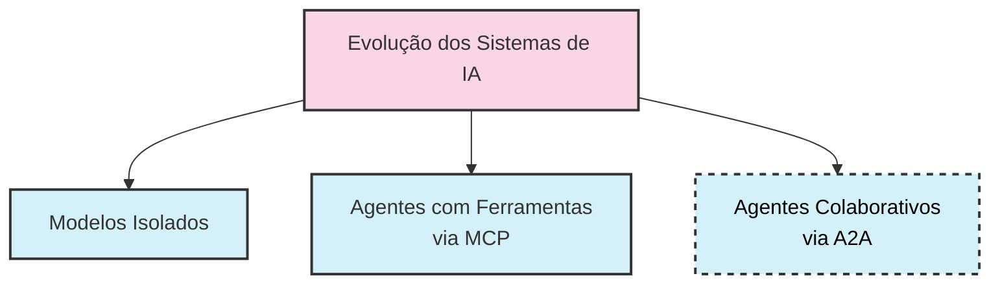
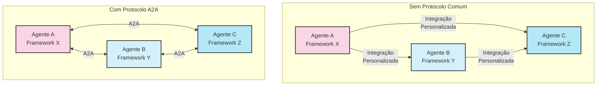
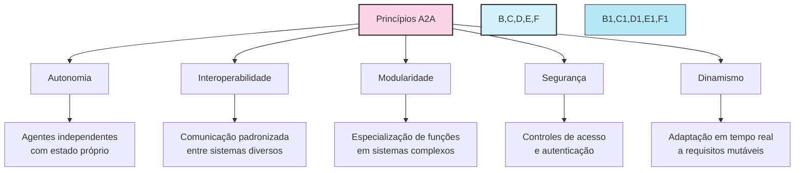
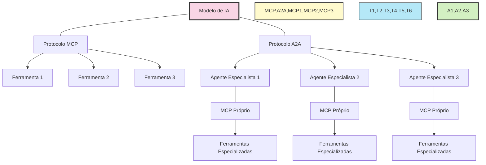
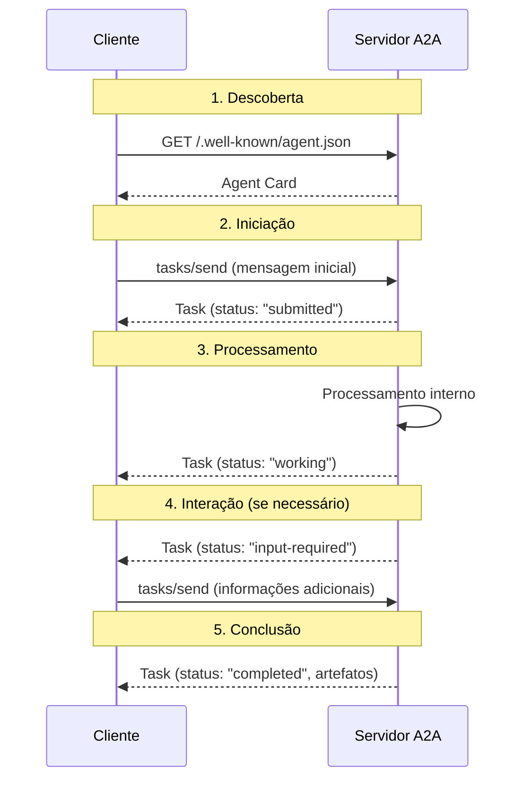
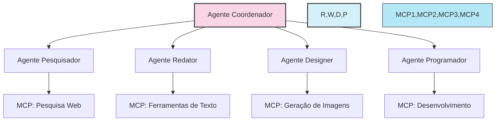
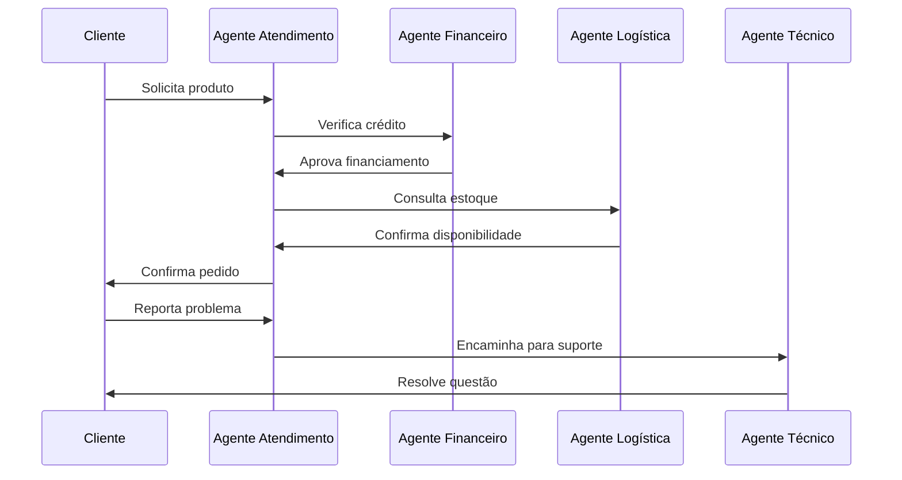
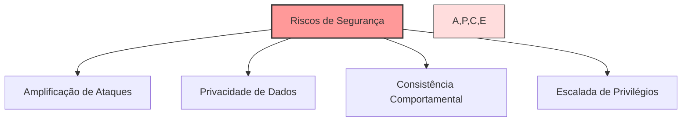
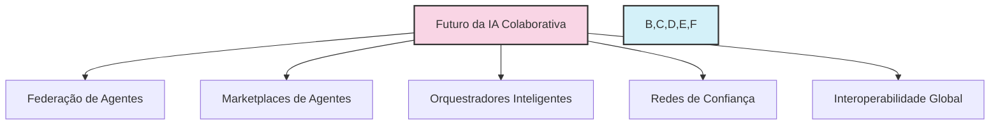
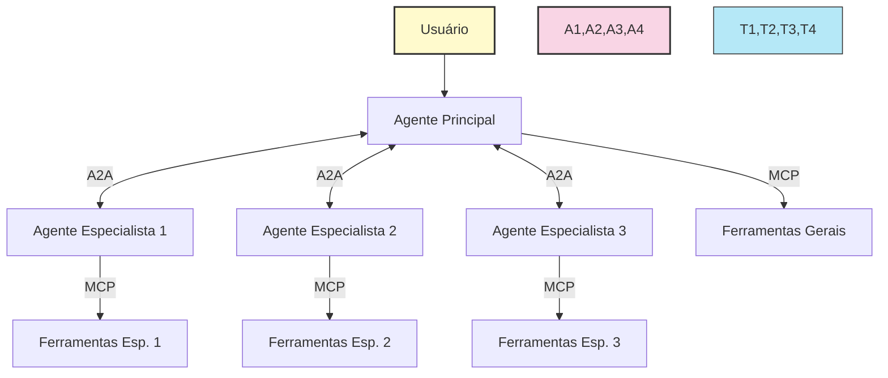

# 🤝 A2A: O Protocolo Que Revoluciona a Comunicação Entre Agentes De IA

> _"O verdadeiro poder da IA não virá de agentes individuais cada vez mais poderosos, mas de ecossistemas de agentes especializados que podem colaborar de forma eficaz para resolver problemas complexos."_


## 📘 Introdução: Por Que Precisamos Do A2A?

O mundo da IA está evoluindo rapidamente. Passamos dos modelos isolados para agentes interativos que usam ferramentas externas através do **Model Context Protocol (MCP)**. Agora, chegamos à próxima fronteira evolutiva: a colaboração direta entre agentes inteligentes através do **Agent2Agent Protocol (A2A)**.



O A2A é um protocolo aberto liderado pelo Google, com apoio de mais de 50 parceiros de tecnologia, que estabelece um padrão comum para comunicação entre agentes de IA, independentemente dos frameworks ou fornecedores que os criaram.

### 🔍 O Problema Que O A2A Resolve

Imagine um mundo onde:

- Um agente especialista em finanças precisa colaborar com um agente especialista em marketing
- Um agente de atendimento ao cliente precisa consultar um agente técnico para resolver um problema
- Um agente pessoal precisa coordenar múltiplos agentes especializados para planejar uma viagem

Sem um protocolo comum, cada integração exigiria desenvolvimento personalizado e complexo. O A2A estabelece uma linguagem universal para que esses agentes conversem entre si.



## 🧩 Fundamentos Do Protocolo A2A

### 📐 Princípios Arquiteturais

O A2A foi projetado com base em cinco princípios fundamentais:

1. **Autonomia**: Cada agente opera de forma independente, com seu próprio estado e capacidades
2. **Interoperabilidade**: Agentes diversos podem se comunicar através de um protocolo comum
3. **Modularidade**: Sistemas complexos são construídos a partir de agentes especializados
4. **Segurança**: O protocolo inclui mecanismos robustos para autenticação e controle de acesso
5. **Dinamismo**: As interações adaptam-se conforme o contexto e as necessidades mudam



### 🧠 Conceitos-chave Do A2A

O A2A define quatro componentes essenciais:

#### 1. 💳 Agent Card (Cartão Do Agente)

O "cartão de visita digital" do agente. Um documento JSON publicado em `/.well-known/agent.json` que descreve:

- Nome e descrição do agente
- URL do endpoint
- Capacidades suportadas
- Habilidades específicas oferecidas
- Requisitos de autenticação

```json
{
  "name": "Agente Financeiro",
  "description": "Especialista em análises financeiras",
  "url": "https://exemplo.com/agentes/financeiro",
  "version": "1.0.0",
  "capabilities": {
    "streaming": true,
    "pushNotifications": true
  },
  "skills": [
    {
      "id": "analise_investimentos",
      "name": "Análise de Investimentos",
      "description": "Avalia opções de investimento com base no perfil de risco"
    }
  ]
}
```

#### 2. 📋 Task (Tarefa)

A unidade central de trabalho que:

- Possui identificador único
- Passa por estados definidos (submitted, working, input-required, completed, etc.)
- Contém histórico de mensagens entre cliente e agente
- Produz artefatos como resultado

```mermaid
stateDiagram-v2
    [*] --> submitted: Tarefa criada
    submitted --> working: Processamento iniciado
    working --> input-required: Agente precisa de mais informações
    input-required --> working: Cliente fornece informações
    working --> completed: Tarefa concluída com sucesso
    working --> failed: Erro ocorreu
    working --> canceled: Cliente cancelou
    completed --> [*]
    failed --> [*]
    canceled --> [*]
```

#### 3. 💌 Message & Parts (Mensagem E Partes)

Mensagens trocadas entre agentes, com:

- Papel: "user" ou "agent"
- Conteúdo: uma ou mais "Parts"
    - **TextPart**: Para texto simples ou formatado
    - **FilePart**: Para arquivos (documentos, imagens)
    - **DataPart**: Para dados estruturados JSON

#### 4. 🎁 Artifact (Artefato)

Resultados produzidos por um agente durante uma tarefa:

- Nome e descrição
- Conteúdo em formato de "Parts"
- Metadados para controle e organização

## 🔄 A2A Vs. MCP: Complementares, Não Competidores

É crucial entender que o A2A e o MCP não competem entre si. Cada um resolve um problema distinto e se complementam perfeitamente.

|Aspecto|MCP|A2A|
|---|---|---|
|**Foco primário**|Conectar IA com ferramentas e recursos|Conectar múltiplos agentes de IA entre si|
|**Tipo de interação**|Vertical (IA ↔ ferramentas)|Horizontal (IA ↔ IA)|
|**Casos de uso**|Acesso a dados, execução de ações|Colaboração, delegação de tarefas|
|**Estrutura**|Cliente-Servidor|Peer-to-Peer|



## 🛠️ A Mecânica Do Protocolo A2A

### 🔧 Como Funciona Na Prática

O A2A utiliza JSON-RPC 2.0 sobre HTTP(S) para todas as comunicações, com suporte para requisição/resposta síncrona e streaming assíncrono via Server-Sent Events (SSE).

#### Fluxo De Comunicação Típico



#### Principais Métodos Do Protocolo

- **tasks/send**: Envia mensagem para iniciar ou continuar uma tarefa
- **tasks/sendSubscribe**: Envia mensagem e recebe atualizações via streaming
- **tasks/get**: Verifica o estado atual de uma tarefa
- **tasks/cancel**: Solicita cancelamento de tarefa em andamento
- **tasks/pushNotification/set**: Configura webhook para notificações push

### ⚡ Recursos Avançados

#### 📡 Streaming Em Tempo Real

Para tarefas longas, o A2A oferece streaming via SSE:

- Atualizações de status incrementais
- Entrega progressiva de artefatos
- Feedback contínuo ao usuário

#### 📲 Notificações Push

Para sistemas assíncronos:

- Webhooks para notificações de progresso
- Autenticação segura via tokens JWT
- Ideal para processos em segundo plano e sistemas distribuídos

#### 🔐 Segurança E Autenticação

O A2A foi projetado priorizando segurança:

- Autenticação via API keys, OAuth, JWT
- Comunicação segura via HTTPS
- Controle de acesso granular
- Auditoria para rastreabilidade

## 💼 Casos De Uso Do A2A

### 👥 Equipes De Agentes Especializados



Agentes especializados colaborando em:

- **Desenvolvimento de software**: Agentes de arquitetura, desenvolvimento, teste
- **Criação de conteúdo**: Agentes para pesquisa, redação, design, revisão
- **Análise de dados**: Agentes para coleta, processamento, visualização, interpretação

### 🏢 Automação De Processos Empresariais



Processos de negócio gerenciados por equipes de agentes:

- **Atendimento ao cliente**: Triagem, soluções, escalação
- **RH**: Recrutamento, onboarding, treinamento
- **Finanças**: Análise, previsão, relatórios

### 🤖 Assistentes Pessoais Integrados

Um agente central que coordena agentes especializados:

- **Planejamento de viagem**: Agentes para voos, hotéis, atrações, transporte
- **Assistente de produtividade**: Agentes para e-mail, calendário, tarefas
- **Gerente de bem-estar**: Agentes de nutrição, exercícios, sono, meditação

## ⚠️ Desafios E Limitações

O A2A ainda enfrenta diversos desafios significativos:

### 💻 Desafios Técnicos

- **Padronização em evolução**: O protocolo ainda está sendo definido
- **Complexidade de implementação**: Coordenar múltiplos agentes é intrinsecamente complexo
- **Latência de comunicação**: Trocas de mensagens introduzem overhead
- **Heterogeneidade**: Diferentes agentes têm capacidades distintas

### 🔒 Desafios De Segurança



- **Confiança entre agentes**: Difícil verificar se um agente é confiável
- **Propagação de falhas**: Um agente comprometido afeta o sistema todo
- **Atribuição de responsabilidade**: Quem é responsável quando múltiplos agentes colaboram?
- **Vazamento de dados**: Informações sensíveis podem fluir entre agentes

### 📜 Desafios De Governança

- **Padrões em desenvolvimento**: Potencial para fragmentação e incompatibilidade
- **Monetização**: Modelos de negócio ainda não estabelecidos
- **Regulação**: Como aplicar normas em sistemas distribuídos de agentes?

## 🔮 O Futuro Do A2A E Da IA Colaborativa

### Tendências Emergentes



1. **Federação de agentes**: Descoberta dinâmica de agentes em toda a web
2. **Marketplaces de agentes**: Plataformas para publicação e monetização
3. **Orquestradores inteligentes**: Sistemas que coordenam equipes de agentes
4. **Redes de confiança**: Mecanismos para estabelecer confiabilidade entre agentes
5. **Convergência de protocolos**: Harmonização entre A2A, MCP e outros padrões

### Próximos Passos Para O A2A

O Google e parceiros planejam:

- **Expansão de capacidades**: Suporte a mais modalidades e interações
- **Ferramentas de desenvolvimento**: SDKs, frameworks e ambientes de teste
- **Especificações formais**: Padrões rigorosos para implementação
- **Ecossistema comunitário**: Maior envolvimento de desenvolvedores

## 🚀 Como Começar Com A2A Hoje

### 📋 Recursos Disponíveis

- [Documentação oficial do A2A](https://google.github.io/A2A/#/documentation)
- [Repositório GitHub](https://github.com/google/A2A)
- [Exemplos de implementação](https://github.com/google/A2A/tree/main/samples/)

### 💡 Dicas Para Implementação

1. **Explore o repositório de exemplos**: O A2A inclui amostras com LangGraph, CrewAI, Google ADK e mais
2. **Comece com casos simples**: Implemente primeiro a descoberta de agentes e tarefas simples
3. **Adote gradualmente**: Integre A2A em sistemas existentes incrementalmente
4. **Contribua**: O A2A é um esforço comunitário que se beneficia de feedback e contribuições

### 🧪 Exemplo Prático Simplificado

```python
from a2a.common.server import A2AServer
from a2a.common.task_manager import InMemoryTaskManager
from a2a.common.types import AgentCard, Message, TextPart

# Definir o cartão do agente
agent_card = AgentCard(
    name="Agente Demo",
    description="Demonstração simples do A2A",
    url="http://localhost:8000",
    version="1.0.0"
)

# Processar mensagens
async def process_message(task_id, message):
    # Lógica do agente aqui
    response = "Processado com sucesso: " + message.parts[0].text
    # Retornar resposta
    return create_response(task_id, response)

# Configurar servidor A2A
server = A2AServer(
    agent_card=agent_card,
    task_manager=InMemoryTaskManager(),
    message_processor=process_message
)

# Iniciar servidor
app = server.create_app()
```

## 🔄 Integração A2A E MCP: O Ecossistema Completo

O futuro pertence a sistemas que integram perfeitamente ambos os protocolos:



Neste ecossistema:

- **MCP** conecta cada agente a ferramentas e dados relevantes
- **A2A** permite que os agentes colaborem eficientemente
- Cada agente pode se especializar em seu domínio específico
- O sistema como um todo se torna mais que a soma das partes

## 📝 Conclusão: O Próximo Capítulo Da IA

O A2A representa uma mudança de paradigma fundamental: da IA como ferramenta isolada para a IA como ecossistema colaborativo. Este protocolo, junto com o MCP, está construindo a infraestrutura para a próxima geração de sistemas inteligentes.

Estamos apenas no início desta jornada, mas o potencial é imenso. À medida que o A2A amadurece, veremos uma explosão de novos casos de uso, modelos de negócio e experiências de usuário que seriam impossíveis com agentes isolados.

A verdadeira revolução da IA não será um único modelo cada vez mais poderoso, mas um ecossistema diversificado de agentes especializados que, juntos, podem realizar muito mais do que qualquer agente individual jamais poderia.

---

> "Em sistemas complexos, a colaboração supera a centralização. Não precisamos de um único agente superinteligente, mas de muitos agentes especializados trabalhando juntos com propósito comum."

---