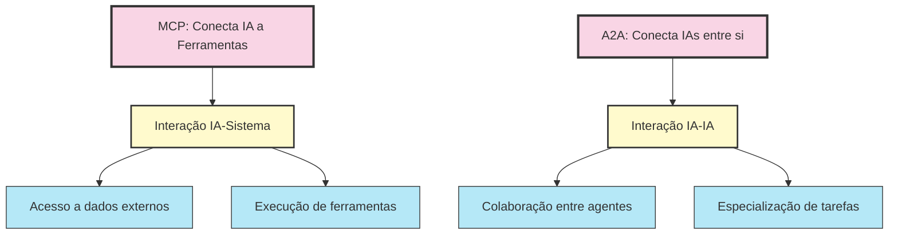
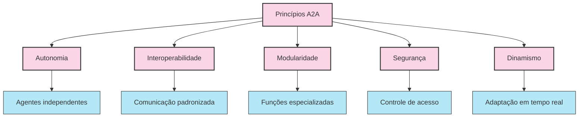
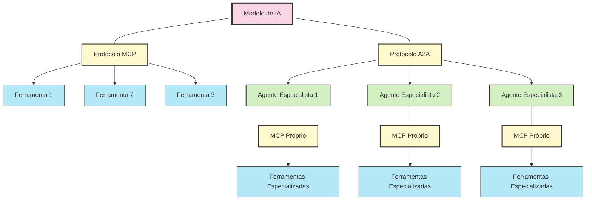
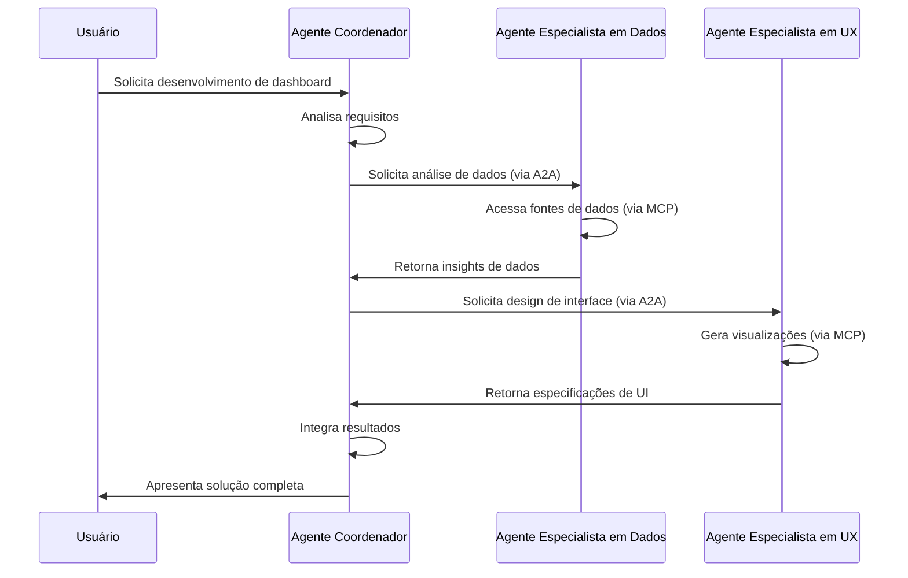
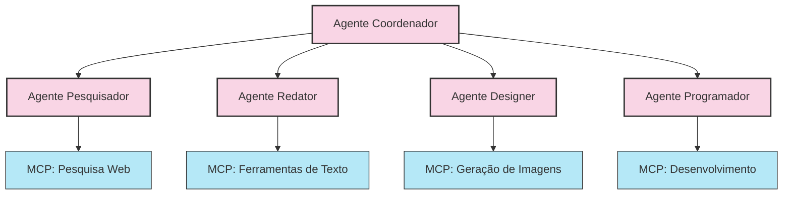
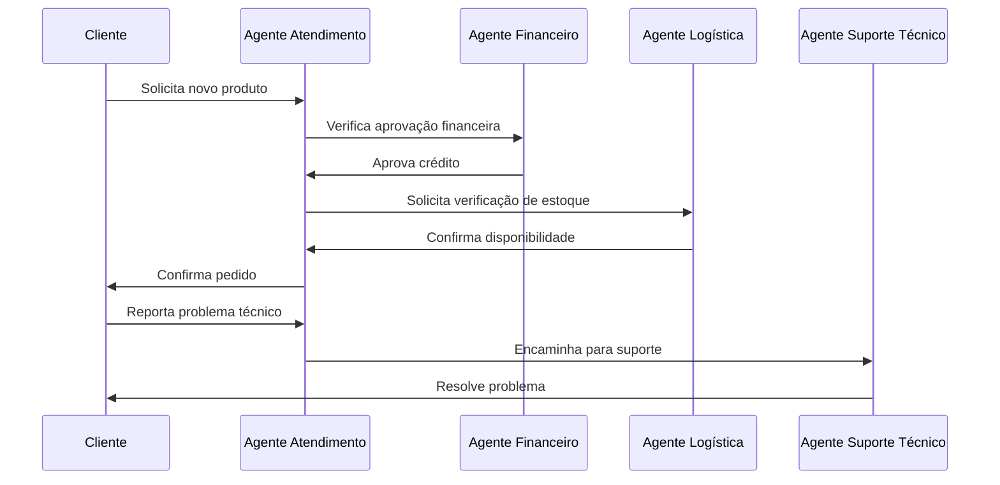
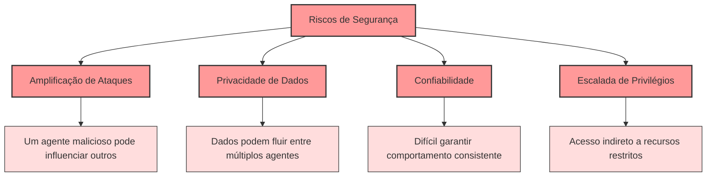
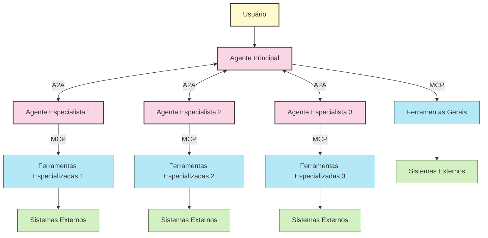
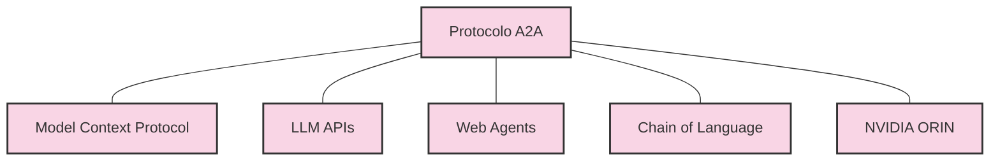

# A2A: O Próximo Passo Na Evolução Dos Agentes De IA# A2A: O Próximo Passo Na Evolução Dos Agentes De IA

  
O Model Context Protocol (MCP) representou um avanço significativo ao conectar modelos de linguagem a ferramentas e sistemas externos. Agora, um novo protocolo está emergindo para complementar o MCP e expandir ainda mais as capacidades dos sistemas de IA: o **Agent to Agent Protocol (A2A)**.

## Introdução Ao A2A: Ampliando O Horizonte Da Colaboração

  

  

Enquanto o MCP focou em resolver o problema do "agente isolado" permitindo acesso a ferramentas e dados externos, o A2A aborda uma nova fronteira: **como permitir que diferentes agentes de IA colaborem entre si de maneira eficaz, mesmo quando construídos sobre frameworks distintos e por diferentes fornecedores.**

  

O A2A é um protocolo aberto que estabelece padrões para comunicação e colaboração entre agentes autônomos, permitindo:

  

- **Interoperabilidade entre agentes heterogêneos**: Agentes baseados em diferentes modelos (Claude, GPT, PaLM, etc.) ou frameworks (LangChain, Crew.AI, LangGraph) podem trabalhar juntos
- **Colaboração dinâmica e multimodal**: Os agentes podem trocar não apenas texto, mas também imagens, áudio, e estruturas de dados complexas
- **Especialização de funções**: Diferentes agentes podem assumir papéis especializados em um sistema maior

  

## Fundamentos Do A2A

  

### Princípios Arquiteturais

  

  

O A2A foi projetado com base em cinco princípios fundamentais:

  

1. **Autonomia**: Cada agente opera de forma independente, com seu próprio estado e capacidades
2. **Interoperabilidade**: Agentes diversos podem se comunicar através de um protocolo comum
3. **Modularidade**: Sistemas complexos podem ser construídos a partir de agentes especializados
4. **Segurança**: O protocolo inclui mecanismos para autenticação e controle de acesso
5. **Dinamismo**: As interações podem se adaptar conforme o contexto e as necessidades mudam

  

### Componentes Essenciais

  

O A2A define quatro tipos principais de interações entre agentes:

  

1. **Discovery (Descoberta)**: Mecanismos para que agentes descubram outros agentes e suas capacidades
2. **Negotiation (Negociação)**: Protocolos para definir como os agentes concordarão com termos de cooperação
3. **Task Management (Gestão de Tarefas)**: Estruturas para delegação, monitoramento e conclusão de tarefas
4. **Secure Collaboration (Colaboração Segura)**: Padrões para troca segura de informações e recursos

  

## A2A Vs. MCP: Complementares, Não Competidores

  

  

É importante entender que o A2A e o MCP não são concorrentes, mas sim **protocolos complementares** que resolvem problemas distintos:

  

| Aspecto               | MCP                                    | A2A                                       |
| --------------------- | -------------------------------------- | ----------------------------------------- |
| **Foco primário**     | Conectar IA com ferramentas e recursos | Conectar múltiplos agentes de IA entre si |
| **Tipo de interação** | Vertical (IA ↔ ferramentas)            | Horizontal (IA ↔ IA)                      |
| **Casos de uso**      | Acesso a dados, execução de ações      | Colaboração, delegação de tarefas         |
| **Estrutura**         | Cliente-Servidor                       | Peer-to-Peer                              |
| **Estado**            | Protocolo estabelecido                 | Protocolo emergente                       |

  

Como destacado pela própria documentação do Google sobre o A2A:

  

> **"MCP (Model Context Protocol) para ferramentas e recursos"** - Conecta agentes a ferramentas, APIs e recursos com entradas/saídas estruturadas.

>

> **"A2A (Agent2Agent Protocol) para colaboração entre agentes"** - Comunicação dinâmica e multimodal entre diferentes agentes sem compartilhar memória, recursos e ferramentas.

  

## A Arquitetura Do A2A

  

  

O A2A define um fluxo de comunicação com componentes chave:

  

### 1. Message Format (Formato De Mensagem)

  

O A2A utiliza um formato de mensagem estruturado e extensível, que inclui:

  

- **Message ID**: Identificador único para cada mensagem
- **Sender/Receiver**: Identificadores dos agentes envolvidos
- **Content**: O conteúdo principal da mensagem (pode ser multimodal)
- **Metadata**: Informações adicionais sobre contexto, prioridade, etc.
- **State**: Informações sobre o estado da comunicação

  

### 2. Protocol Flow (Fluxo Do Protocolo)

  

O protocolo define fluxos para diferentes tipos de interações:

  

- **Capability Discovery**: Como os agentes descobrem as capacidades uns dos outros
- **Task Delegation**: Como tarefas são atribuídas e monitoradas
- **Collaborative Problem Solving**: Como múltiplos agentes resolvem problemas complexos
- **Error Handling**: Como falhas são comunicadas e tratadas

  

### 3. Security Model (Modelo De Segurança)

  

O A2A implementa um modelo de segurança robusto:

  

- **Authentication**: Verificação da identidade dos agentes
- **Authorization**: Controle de acesso a recursos e capacidades
- **Encryption**: Proteção das comunicações
- **Audit Logging**: Registro das interações para rastreabilidade

  

## Casos De Uso Do A2A

  

### 1. Equipes De Agentes Especializados

  

  

Uma equipe de agentes especializados pode trabalhar em conjunto para criar conteúdo complexo como:

  

- **Relatórios de pesquisa**: Um agente pesquisador coleta informações, um redator as organiza, e um designer cria visualizações
- **Desenvolvimento de software**: Um agente arquiteto projeta, um programador implementa, e um testador verifica
- **Criação de conteúdo multimídia**: Diferentes agentes especializados em texto, imagem, áudio e vídeo colaboram

  

### 2. Workflows Empresariais Complexos

  

  

Processos empresariais podem ser automatizados por equipes de agentes:

  

- **Atendimento ao cliente**: Diferentes agentes especialistas em produtos, financeiro, logística, etc.
- **Desenvolvimento de produtos**: Agentes para design, engenharia, marketing, compliance, etc.
- **Processos de RH**: Agentes para recrutamento, onboarding, treinamento, avaliação, etc.

  

### 3. Agentes Pessoais Integrados

  

Um "agente principal" do usuário pode delegrar tarefas a agentes especializados:

  

- **Assistente pessoal**: Coordena agentes financeiros, agenda, viagens, entretenimento, etc.
- **Gerenciador de produtividade**: Distribui tarefas para agentes de pesquisa, escrita, design, código, etc.
- **Copiloto profissional**: Colabora com agentes específicos do domínio (médico, jurídico, etc.)

  

## Desafios E Limitações Do A2A

  

Como qualquer tecnologia emergente, o A2A enfrenta vários desafios:

  

### 1. Desafios Técnicos

  

- **Padronização em desenvolvimento**: O protocolo ainda está sendo definido e refinado
- **Complexidade de implementação**: Sistemas multi-agente são intrinsecamente complexos
- **Overhead de comunicação**: A troca de mensagens entre agentes pode introduzir latência
- **Heterogeneidade de capacidades**: Diferentes agentes têm diferentes habilidades e limitações

  

### 2. Desafios De Segurança

  

  

- **Confiança entre agentes**: Como verificar se um agente é confiável?
- **Propagação de vulnerabilidades**: Um agente comprometido pode afetar todo o sistema
- **Responsabilidade compartilhada**: Quem é responsável quando múltiplos agentes colaboram?
- **Atribuição de erros**: Difícil determinar qual agente falhou em um sistema complexo

  

### 3. Desafios De Governança

  

- **Padrões em evolução**: O A2A ainda está em desenvolvimento inicial
- **Fragmentação potencial**: Risco de implementações incompatíveis
- **Modelo de negócios incerto**: Como monetizar ecossistemas multi-agente?
- **Questões regulatórias**: Como aplicar regulações em sistemas distribuídos de agentes?

  

## Comparação Com Outras Abordagens

  

| Abordagem | Descrição | Prós | Contras |

|-----------|-----------|------|---------|

| **A2A** | Protocolo para comunicação entre agentes autônomos | Flexibilidade, interoperabilidade, especialização | Complexidade, protocolo emergente |

| **MCP** | Protocolo para agentes acessarem ferramentas | Estabelecido, suporte de grandes empresas | Limitado a interações agente-ferramenta |

| **Multi-agentes em framework único** | Múltiplos agentes no mesmo framework (ex: LangChain) | Simplicidade, controle centralizado | Dependência de fornecedor, limitações do framework |

| **Sistemas monolíticos** | Um único agente com múltiplas capacidades | Simplicidade, menor overhead | Menos especialização, escalabilidade limitada |

  

## Integração De A2A E MCP no Ecossistema De IA

  

  

O futuro dos sistemas de IA envolve a integração harmoniosa de A2A e MCP:

  

1. **Agentes utilizando ambos os protocolos**:

- A2A para colaboração com outros agentes
- MCP para acesso a ferramentas e recursos

  

2. **Ecossistemas hierárquicos**:

- Agentes coordenadores delegando a agentes especialistas
- Cada agente especialista com seu próprio conjunto de ferramentas MCP

  

3. **Federação de agentes**:

- Descoberta dinâmica de agentes especializados
- Negociação automática de capacidades e responsabilidades

  

## Evoluções Futuras E Tendências

  

O ecossistema A2A está apenas começando a se desenvolver, com várias tendências emergentes:

  

### 1. Padronização E Maturidade

  

- Desenvolvimento de especificações formais
- Implementações de referência em várias linguagens
- Ferramentas de teste e validação
- Certificação de conformidade

  

### 2. Expansão De Capacidades

  

- Suporte a modalidades adicionais (3D, realidade aumentada, etc.)
- Protocolos para transferência de conhecimento entre agentes
- Mecanismos para aprendizado coletivo
- Sistemas de reputação e confiança entre agentes

  

### 3. Integração Com Outros Padrões

  

  

- Integração com protocolos específicos de domínio
- Compatibilidade com padrões de IA corporativa
- Adaptação para diferentes verticais (saúde, finanças, etc.)
- Harmonização com regulações emergentes de IA

  

## Começando Com A2A

  

O protocolo A2A ainda está em desenvolvimento ativo, mas já existem recursos para quem quer começar a explorar:

  

### Recursos Disponíveis

  

- **Documentação oficial**: [Google A2A](https://google.github.io/A2A/)
- **Repositório GitHub**: [github.com/google/A2A](https://github.com/google/A2A)
- **Exemplos e amostras**: Diversos exemplos usando Google ADK, LangGraph, Crew.AI

  

### Implementação Básica

  

Para começar a implementar sistemas usando A2A, considere:

  

1. **Explorar implementações existentes**: Vários frameworks já estão adotando conceitos A2A
2. **Definir interfaces claras**: Mesmo sem o protocolo formal, você pode projetar sistemas multi-agente
3. **Acompanhar o desenvolvimento**: O protocolo está evoluindo rapidamente com feedback da comunidade

  

## Conclusão: A2A E MCP Como Base Para a Nova Geração De IA

  

O futuro da IA não está em agentes isolados, mas em ecossistemas de agentes especializados que colaboram de forma eficaz. Juntos, A2A e MCP fornecem a base para essa nova era:

  

- **MCP** resolve o problema de conectar IA com sistemas e dados externos
- **A2A** resolve o problema de conectar diferentes IAs entre si

  

À medida que esses protocolos amadurecem, estamos vendo o surgimento de uma nova arquitetura para sistemas de IA distribuídos, especializados e colaborativos - uma mudança fundamental no paradigma de como construímos e utilizamos a inteligência artificial.

  

---

  

> "O verdadeiro poder da IA não virá de agentes individuais cada vez mais poderosos, mas de ecossistemas de agentes especializados que podem colaborar de forma eficaz para resolver problemas complexos." — Tendência emergente em IA, 2023-2024

  

---

