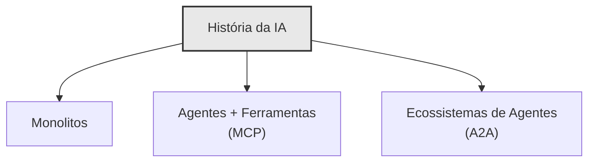
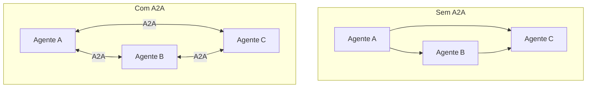
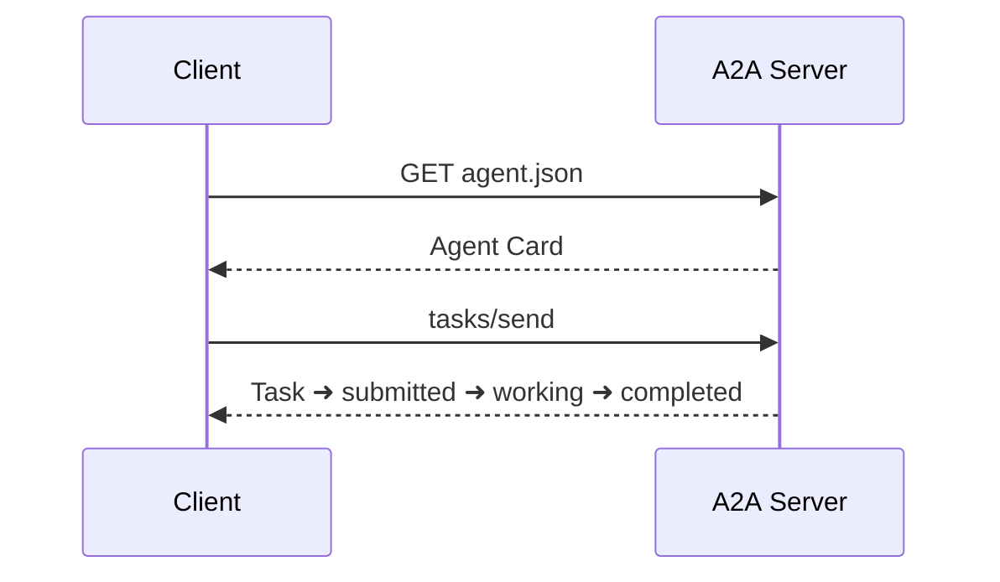
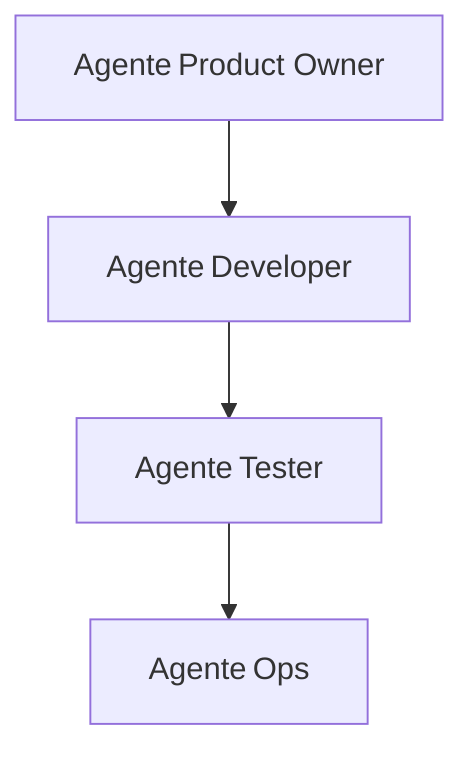
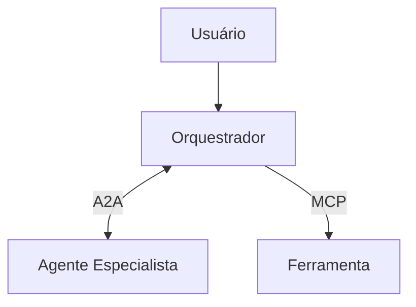

# 🤝 A2A — Do Zero ao Hero: conversas entre agentes como se Martin Fowler estivesse rabiscando no quadro

> _“Não precisamos de um único agente omnisciente; precisamos de uma liga inteira de agentes especialistas que cooperam como uma orquestra bem ensaiada.”_


---

## 1 · Onde Estamos & Para Onde Vamos

- **Modelos isolados** eram como _programas monolíticos_: geniais, mas sem portas nem janelas.
    
- **MCP** abriu as primeiras janelas — agentes com acesso a ferramentas.
    
- **A2A** derruba as paredes: agentes falando entre si, cada um dono de um micro‑domínio.
    



> **Pense nisso**: A2A é para agentes o que REST foi para serviços web — um protocolo simples que destrava inovação distribuída.

---

## 2 · O Problema da Cola

Sem A2A:

- Integração **N × N** – cada nova combinação exige mais cola de código.
    
- Pouco reaproveitamento, acoplamento alto, dores de manutenção.
    

Com A2A:

- Integração **N × 1** – qualquer agente fala _A2A_ e pronto.
    
- Evolução independente, _plug‑and‑play_ de especialistas.
    



> **Regra de ouro**: elimine integrações específicas; invista em protocolos genéricos.

---

## 3 · Princípios Arquiteturais

1. **Autonomia** – cada agente gerencia seu estado.
    
2. **Interoperabilidade** – qualquer stack, mesma língua.
    
3. **Modularidade** – _divide‑and‑conquer_ aplicado à IA.
    
4. **Segurança by design** – autenticação, autorização & auditoria.
    
5. **Dinamismo** – negociações em tempo real (streaming + SSE).
    

---

## 4 · Os Quatro Pilares do A2A

|Pilar|O que é|Por quê importa|
|---|---|---|
|**Agent Card**|`/.well-known/agent.json`|_Discovery_ automático|
|**Task**|Ciclo de vida de trabalho|Orquestração previsível|
|**Message & Parts**|Texto, arquivos, dados estruturados|Payloads flexíveis|
|**Artifact**|Resultado persistente|Compartilhamento & auditoria|

### Exemplo de Agent Card

```json
{
  "name": "Finance Agent",
  "description": "Performs financial analysis",
  "url": "https://example.com/agents/finance",
  "version": "1.0.0",
  "capabilities": { "streaming": true },
  "skills": [{
    "id": "investment_analysis",
    "name": "Investment Analysis",
    "description": "Evaluates options by risk profile"
  }]
}
```

---

## 5 · Ciclo de Vida de uma Task

```mermaid
stateDiagram-v2
    [*] --> submitted
    submitted --> working
    working --> input-required
    input-required --> working
    working --> completed
    working --> failed
    working --> canceled
```

> **Insight**: Estados claros = debug claro = menos noites mal dormidas.

---

## 6 · Under the Hood – JSON‑RPC 2.0 + HTTP(S)

- `tasks/send` – inicia ou continua trabalho
    
- `tasks/sendSubscribe` – streaming via SSE
    
- `tasks/get` – _poll_ sem culpa
    
- `tasks/cancel` – _fail‑fast_ consciente
    



---

## 7 · Casos de Uso que Brilham

### 7.1 Equipe de Software



- De backlog → código → teste → deploy sem humanos no caminho crítico.
    

### 7.2 Automação Empresarial

- Atendimento, logística, finanças – cada qual seu agente, todos falam A2A.
    

### 7.3 Assistente Pessoal

- Um maestro coordena voo, hotel, agenda & saúde.
    

---

## 8 · Desafios & Armadilhas

- **Padrão em movimento** – verifique _changelogs_.
    
- **Confiança** – reputação de agente é a nova chave pública.
    
- **Latência** – pipelines chatos? Use streaming.
    
- **Governança** – quem paga a conta do erro coletivo?
    

---

## 9 · Do Zero ➡ Hello World

```python
from a2a.common.server import A2AServer
from a2a.common.task_manager import InMemoryTaskManager
from a2a.common.types import AgentCard

agent_card = AgentCard(
    name="Demo Agent",
    description="Hello‑world A2A agent",
    url="http://localhost:8000",
    version="1.0.0"
)

async def handle_message(task_id, message):
    reply = f"Processed: {message.parts[0].text}"
    return create_response(task_id, reply)

server = A2AServer(
    agent_card=agent_card,
    task_manager=InMemoryTaskManager(),
    message_processor=handle_message
)

app = server.create_app()
```

> **Pro tip**: faça o _curl_ primeiro, GUI depois.

---

## 10 · A2A ❤ MCP – Dê a Mão que Falta



- **MCP** liga cada agente a dados & ferramentas.
    
- **A2A** costura a conversa entre agentes.
    

---

## 11 · Roadmap Pessoal: seu caminho Hero

1. **Explorar exemplos oficiais** – entender _happy path_.
    
2. **Publicar seu Agent Card** – _discovery_ first.
    
3. **Orquestrar dois agentes** – mínimo viável colaborativo.
    
4. **Adicionar streaming** – UX em tempo real.
    
5. **Contribuir** – PR + RFC deixam o padrão melhor.
    

---

## 12 · Conclusão

> _“Em sistemas complexos, colaboração > centralização. Protocolos vencem pipelines manuais.”_

A2A transforma a IA de ferramenta solitária em sociedade de especialistas. O próximo passo está na sua IDE – coloque dois agentes para conversar e veja a mágica surgir.

---

### Recursos

- Documentação → [https://google.github.io/A2A](https://google.github.io/A2A)
    
- GitHub → [https://github.com/google/A2A](https://github.com/google/A2A)
    
- Comunidade → Discord & fóruns (link na doc)