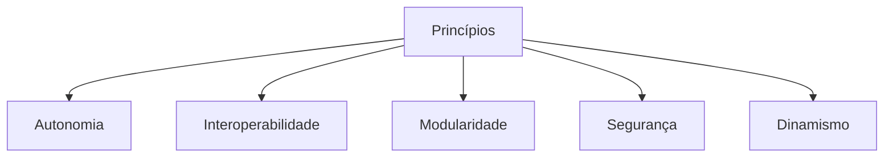
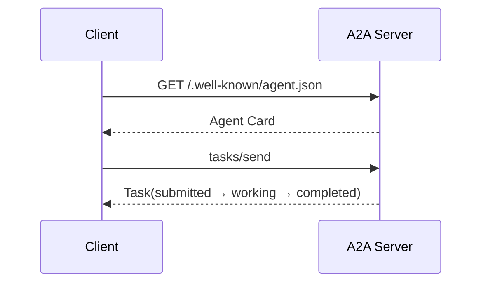
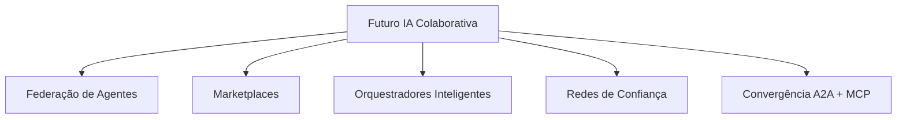
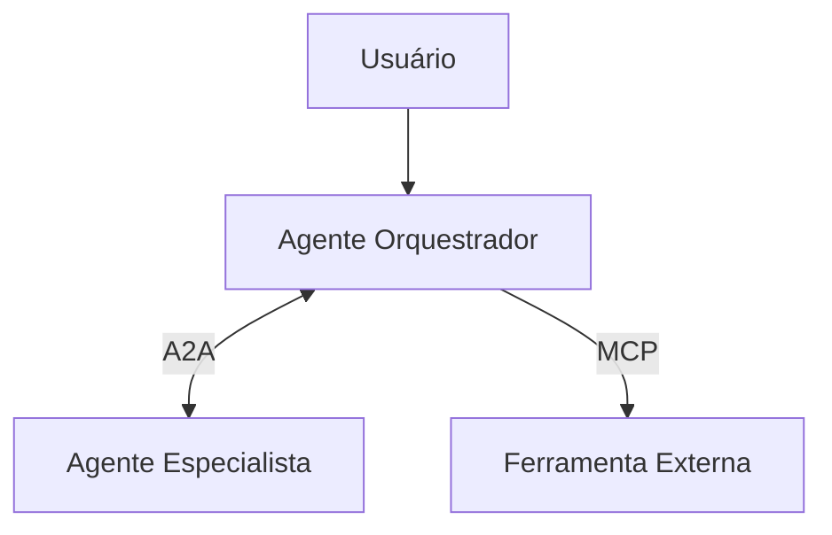

**Preparando apresentação de A2A**

O pedido está claro: criar uma apresentação sobre o protocolo A2A (Agent2Agent) usando markdown no Obsidian. Vou considerar o conteúdo fornecido e adicionar qualquer outro tema relevante. Como o usuário mencionou usar markdown para apresentações com a sintaxe específica do Obsidian, preciso lembrar de usar os separadores '---' para dividir os slides e adicionar tópicos chave como possíveis headings, tópicos e diagramas de Mermaid, como nas apresentações anteriores. Vou começar organizando os slides.

Pensou por 8 segundos

````markdown
---
# 🤝 **A2A — O Protocolo Que Revoluciona a Comunicação Entre Agentes de IA**

> _“O verdadeiro poder da IA não virá de agentes individuais cada vez mais poderosos,  
> mas de ecossistemas de agentes especializados que colaboram para resolver problemas complexos.”_


---

## 📘 Por Que Precisamos do A2A?

- Evolução: **Modelos → Agentes (MCP) → Ecossistemas de Agentes (A2A)**
- Integra experiências multiespecialistas sem integrações ponto-a-ponto
- Padronização aberta liderada pelo Google (50+ parceiros)

```mermaid
graph TD
    A[Evolução dos Sistemas de IA] --> B[Modelos Isolados]
    A --> C[Agentes + Ferramentas<br>via MCP]
    A --> D[Agentes Colaborativos<br>via A2A]
    style A fill:#f9d5e5,stroke:#333,stroke-width:2px
````

---

## 🔍 O Problema que o A2A Resolve

- Integrações N×N → **Integração N×1**
    
- Agentes de domínios distintos precisam dialogar em linguagem comum
    
- Reduz tempo de desenvolvimento e frações de código “cola”
    

```mermaid
graph TD
    subgraph "Sem A2A"
        A1[Agente A] --> B1[Agente B]
        A1 --> C1[Agente C]
        B1 --> C1
    end
    subgraph "Com A2A"
        A2[Agente A] <-->|A2A| B2[Agente B]
        A2 <-->|A2A| C2[Agente C]
        B2 <-->|A2A| C2
    end
```

---

## 🧩 Fundamentos Arquiteturais

1. **Autonomia** – cada agente mantém estado próprio
    
2. **Interoperabilidade** – protocolo comum a qualquer framework
    
3. **Modularidade** – sistemas compostos por agentes especializados
    
4. **Segurança** – autenticação, autorização, auditoria embutidas
    
5. **Dinamismo** – adaptação em tempo-real às necessidades
    



---

## 🧠 Componentes-chave

|Componente|Função|
|---|---|
|**Agent Card**|_/.well-known/agent.json_ descreve agente|
|**Task**|Unidade de trabalho com ciclo de vida|
|**Message & Parts**|Troca de texto, arquivos, dados|
|**Artifact**|Resultado material produzido|

---

### 💳 Agent Card (exemplo)

```json
{
  "name": "Finance Agent",
  "description": "Performs financial analysis",
  "url": "https://example.com/agents/finance",
  "version": "1.0.0",
  "capabilities": { "streaming": true },
  "skills": [
    { "id": "investment_analysis",
      "name": "Investment Analysis",
      "description": "Evaluates options by risk profile" }
  ]
}
```

---

### 📋 Ciclo de Vida de uma Task

```mermaid
stateDiagram-v2
    [*] --> submitted
    submitted --> working
    working --> input-required
    input-required --> working
    working --> completed
    working --> failed
    working --> canceled
```

---

## 🔧 Mecânica do Protocolo

- **JSON-RPC 2.0** sobre HTTP(S)
    
- Métodos principais: `tasks/send`, `tasks/sendSubscribe`, `tasks/get`, `tasks/cancel`
    
- Streaming assíncrono via **Server-Sent Events (SSE)**
    



---

## ⚡ Recursos Avançados

- **Streaming em tempo real** de progresso e artefatos
    
- **Push notifications** (webhooks + JWT)
    
- Segurança: HTTPS, API keys/OAuth/JWT, RBAC, auditoria
    

---

## 💼 Casos de Uso

### Equipes de Agentes Especializados

- Desenvolvimento de software (arquitetura → código → QA)
    
- Criação de conteúdo (pesquisa → redação → design)
    
- Análise de dados (coleta → modelagem → visualização)
    

### Automação Empresarial

- Atendimento ao cliente, RH, finanças, logística
    

### Assistentes Pessoais

- Planejamento de viagens, produtividade, saúde digital
    

---

## ⚠️ Desafios em Aberto

- **Padronização em evolução**
    
- **Governança e confiança** entre agentes
    
- **Latência** e sobrecarga de mensagens
    
- **Segurança**: amplificação de ataques e vazamento de dados
    

---

## 🔮 Tendências Futuras



- Federação e descoberta global
    
- Marketplaces de agentes monetizáveis
    
- Orquestradores multimodais (LangGraph, CrewAI…)
    
- Trust graphs e reputação descentralizada
    

---

## 🔄 Integração A2A + MCP



> **MCP** liga cada agente a ferramentas e dados.  
> **A2A** habilita cooperação horizontal entre agentes.

---

## 🧪 Exemplo Prático (Python)

> **Todas as strings e comentários estão em inglês para cumprir guidelines.**

```python
from a2a.common.server import A2AServer
from a2a.common.task_manager import InMemoryTaskManager
from a2a.common.types import AgentCard

agent_card = AgentCard(
    name="Demo Agent",
    description="Simple A2A demonstration",
    url="http://localhost:8000",
    version="1.0.0"
)

async def handle_message(task_id, message):
    response_text = f"Success: {message.parts[0].text}"
    return create_response(task_id, response_text)

server = A2AServer(
    agent_card=agent_card,
    task_manager=InMemoryTaskManager(),
    message_processor=handle_message
)

app = server.create_app()
```

---

## 🚀 Comece Hoje

1. Clone o **repo oficial** e explore os exemplos
    
2. Implemente **Agent Card** + `tasks/send` em piloto simples
    
3. Evolua para streaming e push notifications
    
4. Contribua com feedback & PRs — o protocolo é comunitário!
    

---

# 📝 Conclusão

> A2A + MCP ► **IA como Ecossistema Colaborativo**

- **Escalabilidade** via agentes especializados
    
- **Interoperabilidade** sem lock-in de fornecedor
    
- **Inovação** em novos modelos de negócio e UX
    

## Prepare-se: o próximo capítulo da IA será escrito por **equipes de agentes**, não por modelos isolados.