# MCP - Protocolo De Contexto Para Modelos

## O Adaptador Universal Para IAs

---

# O Que É O MCP?

O Model Context Protocol (MCP) é um padrão que permite que aplicações de IA se conectem com fontes de dados e ferramentas externas. Ele possibilita a integração perfeita entre modelos de linguagem e sistemas externos.

Pense no MCP como um adaptador universal para aplicações de IA, similar ao que o USB-C é para dispositivos físicos:

- **Um protocolo universal** para conectar IAs a diferentes fontes de dados e ferramentas
- **Elimina integrações personalizadas** para cada combinação de IA e dados/ferramentas
- **Padroniza a comunicação** entre todos os componentes
- **Permite interoperabilidade** em todo o ecossistema de IA

---

# O Desafio Das IAs Isoladas

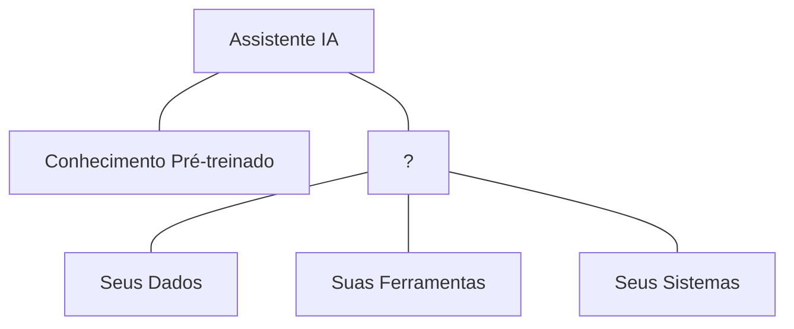

- LLMs não têm acesso nativo aos seus sistemas e dados específicos
- Respostas baseadas em dados de treinamento podem estar desatualizadas ou ser genéricas
- Sem capacidade de executar ações em sistemas externos
- Compreensão contextual limitada do seu ambiente específico

---

# A Torre De Babel Digital

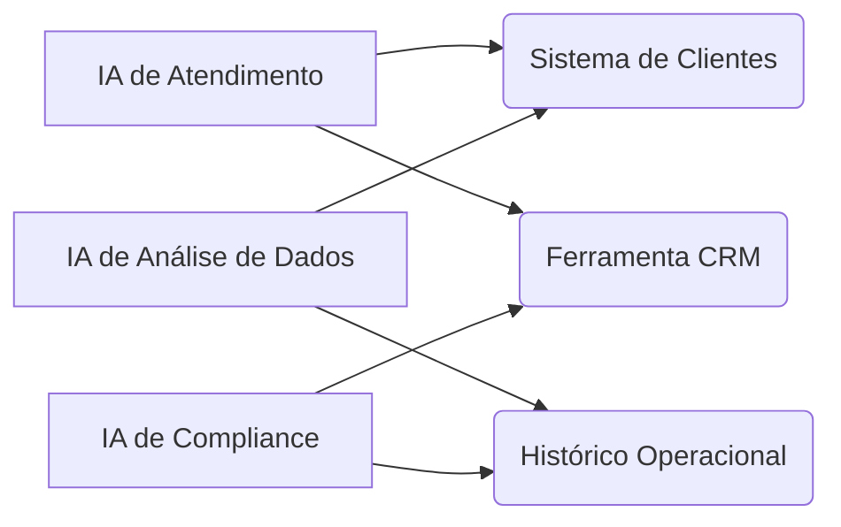

- **Duplicação de esforços:** A mesma conexão recriada múltiplas vezes
- **Inconsistência:** Diferentes padrões para cada integração
- **Custos elevados:** Mudanças em um sistema exigem múltiplas atualizações
- **Escalabilidade limitada:** Adicionar novos assistentes de IA se torna cada vez mais complexo

---

# MCP Como Solução Universal

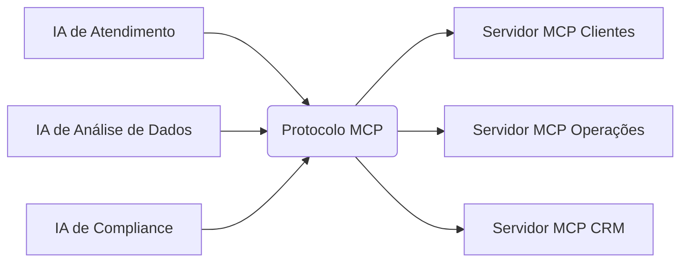

- Todas as IAs falam a mesma "língua"
- Reutilização de servidores entre aplicações
- Interoperabilidade entre diferentes LLMs
- Facilidade para adicionar novas fontes de dados e ferramentas

---

# Analogia USB

O MCP é para a IA o que os padrões USB são para dispositivos eletrônicos:

- **Um conector universal**
- **Elimina adaptadores específicos**
- **Simplifica integrações**
- **Padroniza comunicações**

Assim como o USB tornou a conexão de dispositivos mais simples e consistente, o MCP faz o mesmo para aplicações de IA, permitindo que se conectem facilmente a qualquer fonte de dados ou ferramenta compatível.

---

# Arquitetura MCP: Cliente-Servidor

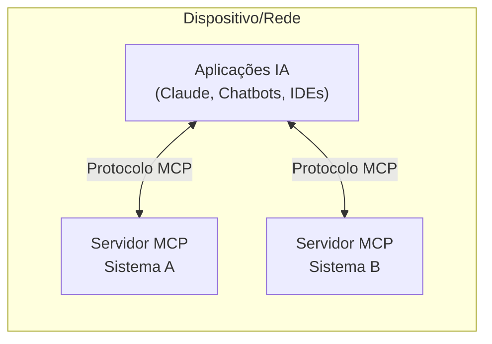

- Arquitetura modular
- Servidores independentes para diferentes sistemas
- Comunicação padronizada entre componentes
- Interface única para acesso a múltiplos recursos

---

# Os Três Pilares Do MCP

1. **MCP Hosts (Clientes):**
    
    - Aplicações que incorporam LLMs (Claude, chatbots, IDEs)
    - Coordenam comunicação entre LLMs e servidores
2. **MCP Servers (Servidores):**
    
    - Fornecem acesso a sistemas específicos
    - Cada servidor é especializado em um sistema/fonte
3. **O Protocolo MCP:**
    
    - A "língua comum" entre hosts e servidores
    - Define formato de mensagens padronizado

---

# Como Funciona Na Prática

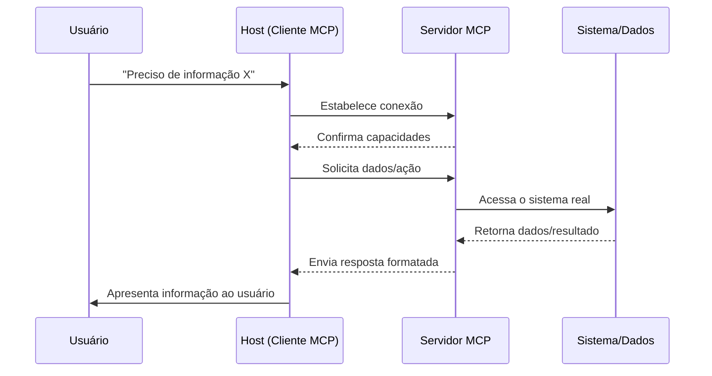

- Fluxo bidirecional de informações
- Interação transparente para o usuário final
- Processamento contextual em tempo real
- Resposta personalizada e relevante

---

# Conceitos Fundamentais: Roots

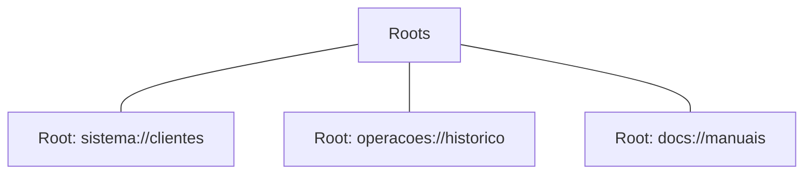

- **Territórios de acesso** que delimitam onde um servidor pode operar
- Funcionam como "crachás de segurança" para diferentes áreas
- Permitem controle granular de permissões
- Definem os limites de atuação de cada servidor

---

# Conceitos Fundamentais: Resources

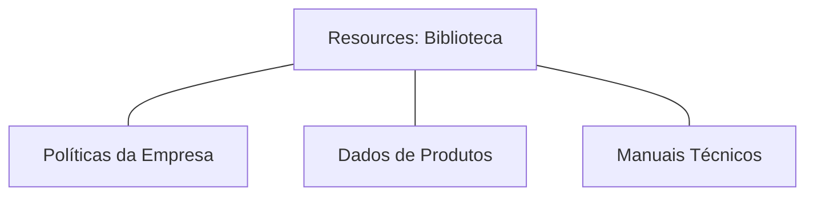

- "Fontes de conhecimento" que o LLM pode consultar
- Documentos, dados ou conteúdos disponibilizados pelo servidor MCP
- Permitem acesso a dados que não estão no treinamento do LLM
- Fornecem contexto atualizado e específico para o ambiente

---

# Conceitos Fundamentais: Tools

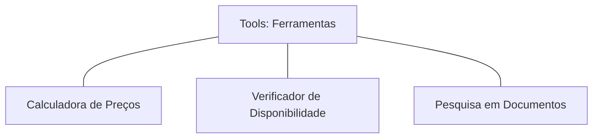

- Funções que o LLM pode invocar para realizar ações
- Permitem que a IA faça algo além de gerar texto
- Conectam o LLM a funcionalidades de sistemas existentes
- Habilitam a execução de operações em nome do usuário (com autorização)

---

# Conceitos Fundamentais: Prompts

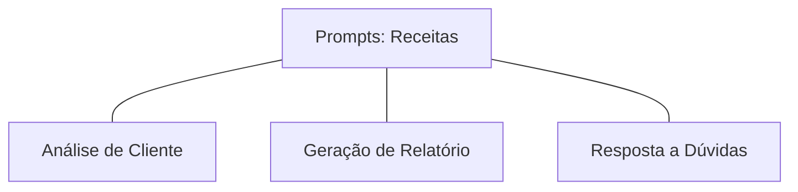

- Instruções padronizadas que guiam o LLM em tarefas específicas
- "Receitas testadas" para garantir respostas consistentes
- Asseguram que todas as etapas de um processo sejam seguidas
- Facilitam a execução de fluxos de trabalho complexos

---

# Conceitos Fundamentais: Sampling

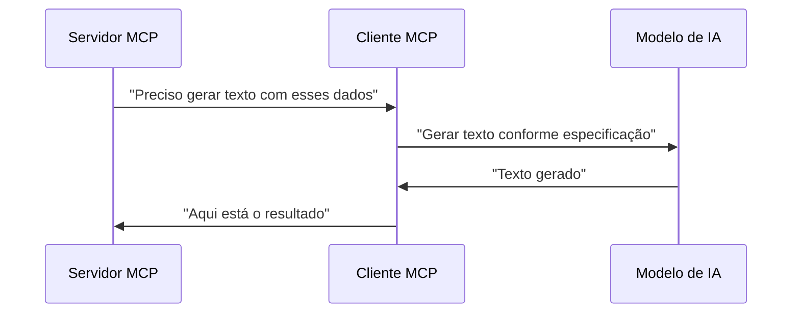

- Permite que o servidor solicite geração de conteúdo do LLM
- Fluxo reverso: servidor pede ajuda ao cliente/LLM
- Habilita comportamentos "agênticos" complexos
- Mantém controle sobre recursos do modelo

---

# MCP Na Prática: Setor Financeiro

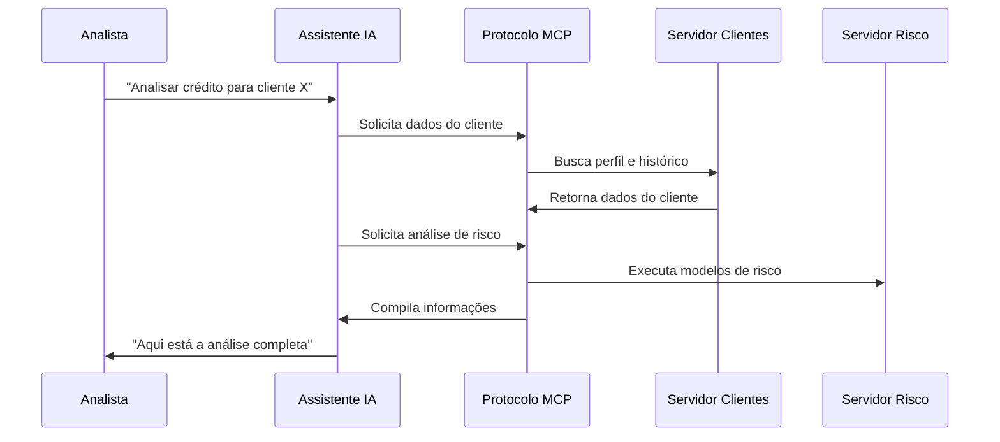

- Análise de crédito mais precisa e contextualizada
- Acesso a dados atualizados do cliente
- Aplicação consistente de políticas de risco
- Explicabilidade das decisões baseada em dados reais

---

# Roadmap Do MCP: O Que Está Por Vir

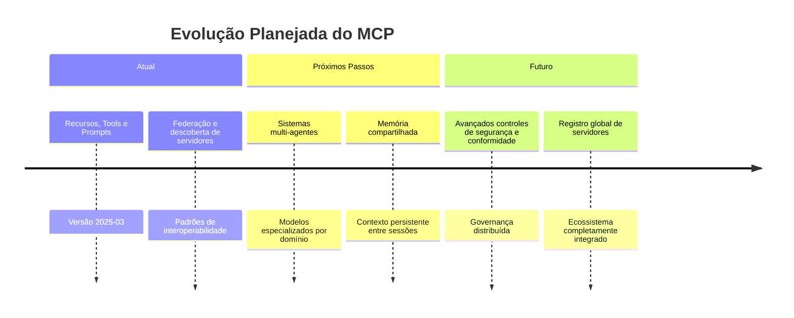

### Próximas Funcionalidades

- **Validação e Conformidade:** Ferramentas de teste automático para implementações MCP
- **Registro Central:** Sistema para distribuição e descoberta de servidores MCP
- **Suporte a Agentes:** Melhorias na coordenação entre múltiplos agentes de IA
- **Workflows Interativos:** Experiências humano-no-ciclo mais granulares
- **Suporte Multimodal Avançado:** Video e outros tipos de mídia
- **Streaming Bidirecional:** Comunicação interativa em tempo real

---

# O Futuro Do MCP

### 1. Federação E Descoberta De Servidores

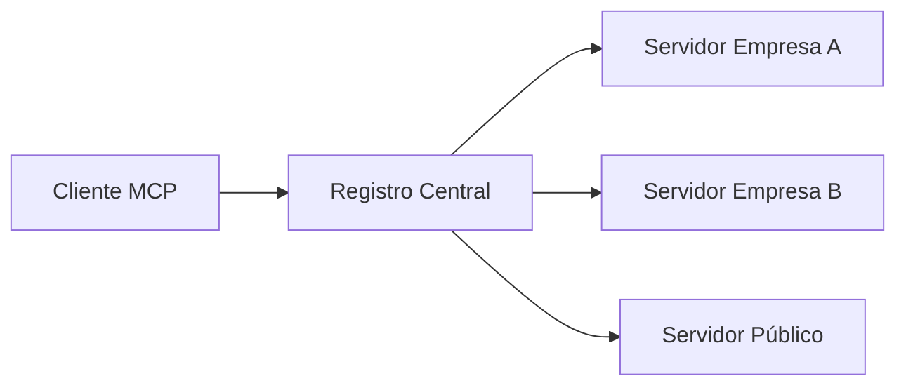

### 2. Modelos Especializados Por Domínio

### 3. Segurança E Conformidade Avançadas

### 4. Governança Comunitária

- Processos transparentes de padronização
- Desenvolvimento liderado pela comunidade
- Evolução orientada pelas necessidades do ecossistema

---

# Recursos Para Aprofundamento

- **Documentação Oficial:** [modelcontextprotocol.io](https://modelcontextprotocol.io/)
- **GitHub:** [github.com/modelcontextprotocol](https://github.com/modelcontextprotocol)
- **Anúncio Anthropic:** [anthropic.com/news/model-context-protocol](https://www.anthropic.com/news/model-context-protocol)
- **Especificação:** [spec.modelcontextprotocol.io](https://spec.modelcontextprotocol.io/)

---

# Obrigado!!!