# MCP - Model Context Protocol

## Do Zero Ao Herói: O Adaptador Universal Para IAs

---

# Módulo 1: Fundamentos Da IA E LLMs

---

# O Que São Modelos De Linguagem (LLMs)?

- **Definição:** Sistemas de IA treinados para compreender e gerar texto humano
- **Funcionamento:** Predição probabilística baseada em padrões de dados
- **Exemplos:** GPT-4, Claude, PaLM, Llama, etc.
- **Capacidades:** Geração de texto, resposta a perguntas, resumo, tradução, etc.

---

# A Evolução Dos LLMs

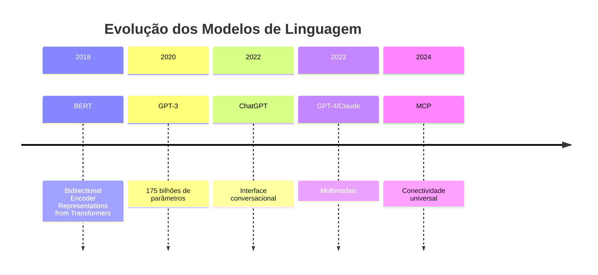

---

# Limitações Fundamentais Dos LLMs

- **Conhecimento limitado ao treinamento**
- **Sem acesso a dados em tempo real**
- **Incapacidade de executar ações no mundo real**
- **"Alucinações" ao enfrentar informações desconhecidas**
- **Falta de contextualização específica**

---

# O Desafio Das IAs Isoladas

![[dfc4d78ccebce4d2e55b466ce593327b_MD5.svg]]

- LLMs não têm acesso nativo aos seus sistemas
- Sem acesso a dados específicos e atualizados
- Respostas genéricas e potencialmente desatualizadas
- Incapacidade de realizar ações em sistemas externos

---

# A Torre De Babel Digital

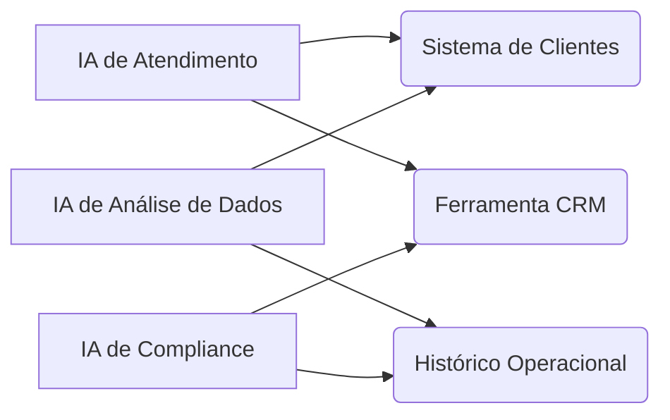

- **Duplicação de esforços:** A mesma conexão recriada múltiplas vezes
- **Inconsistência:** Diferentes padrões para cada integração
- **Custos elevados:** Mudanças em um sistema exigem múltiplas atualizações

---

# Módulo 2: Introdução Ao MCP

---

# O Que É O MCP?

> 💡 O Model Context Protocol (MCP) é o "adaptador universal" do mundo da IA. Ele permite que modelos de linguagem se conectem facilmente com dados e ferramentas externas, transformando IAs isoladas em assistentes verdadeiramente contextuais e capazes.

---

# MCP Como Solução Universal

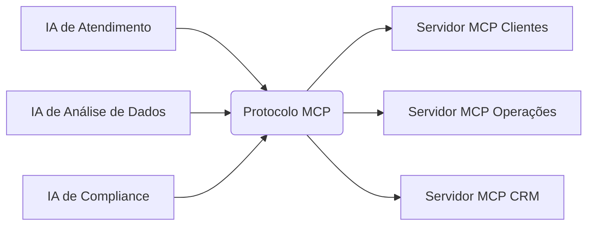

- Todas as IAs falam a mesma "língua"
- Reutilização de servidores entre aplicações
- Interoperabilidade entre diferentes LLMs

---

# Analogia USB

![[049a0657dcbea6a79a13632afe5dbd18_MD5.svg]]

O MCP é para a IA o que os padrões USB são para dispositivos eletrônicos:

- **Um conector universal**
- **Elimina adaptadores específicos**
- **Simplifica integrações**
- **Padroniza comunicações**

---

# MCP vs. Soluções Tradicionais

|Aspecto|APIs Tradicionais|RAG|MCP|
|---|---|---|---|
|**Integração**|Customizada para cada sistema|Limitada a documentos|Universal|
|**Capacidades**|Apenas consulta/escrita|Apenas consulta|Consulta + ações + ferramentas|
|**Manutenção**|Alta (uma API por sistema)|Média|Baixa (padrão único)|
|**Controle de Acesso**|Variável|Limitado|Granular (via roots)|
|**Flexibilidade**|Baixa|Média|Alta|
|**Estado/Memória**|Depende da implementação|Normalmente sem estado|Sem estado nativo, requer implementação|
|**Bidirecionalidade**|Unidirecional|Unidirecional|Bidirecional (via sampling)|
|**Padronização**|Variada (REST, GraphQL)|Não padronizada|Formato único JSON-RPC|

---

# Módulo 3: Arquitetura MCP

---

# Arquitetura MCP: Cliente-Servidor

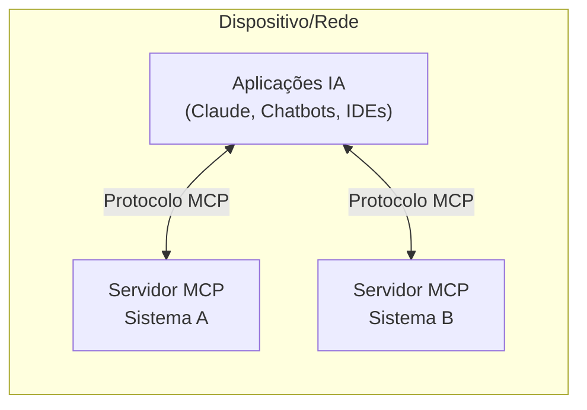

---

# Os Três Pilares Do MCP

1. **MCP Hosts (Clientes):**
    
    - Aplicações que incorporam LLMs (Claude, chatbots, IDEs)
    - Coordenam comunicação entre LLMs e servidores
2. **MCP Servers (Servidores):**
    
    - Fornecem acesso a sistemas específicos
    - Cada servidor é especializado em um sistema/fonte
3. **O Protocolo MCP:**
    
    - A "língua comum" entre hosts e servidores
    - Define formato de mensagens padronizado

---

# Como Funciona Na Prática

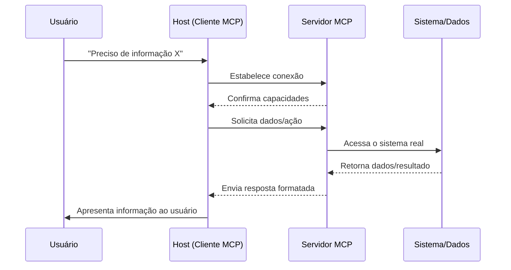

---

# Como O MCP Funciona Por Baixo

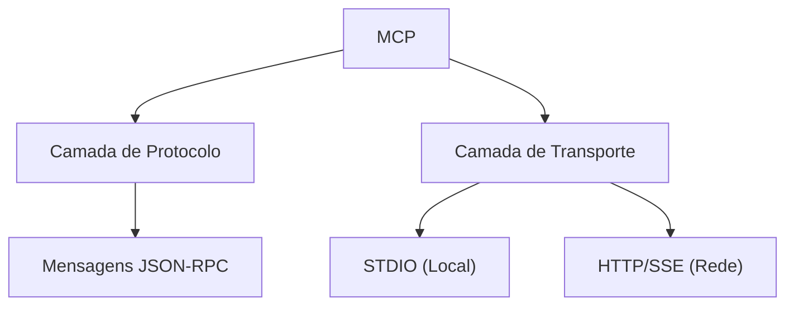

- Baseado em JSON-RPC 2.0
- Dois métodos de transporte: STDIO (local) e HTTP/SSE (rede)
- Sistema de requisição-resposta com monitoramento

---

# Exemplo De Mensagem JSON-RPC no MCP

```json
{
  "jsonrpc": "2.0",
  "id": "request-123",
  "method": "listResources",
  "params": {
    "root": "sistema://clientes",
    "pattern": "cliente-*"
  }
}
```

Resposta:

```json
{
  "jsonrpc": "2.0",
  "id": "request-123",
  "result": {
    "resources": [
      {
        "id": "cliente-12345",
        "title": "Dados do Cliente XYZ",
        "description": "Informações cadastrais e histórico"
      }
    ]
  }
}
```

---

# Módulo 4: Conceitos Fundamentais E Capacidades Do MCP

---

# Características E Capacidades Fundamentais Do MCP

## Modelo De Memória

- **Sem Memória Compartilhada Nativa:**
    
    - MCP não implementa memória compartilhada entre sessões
    - Cada conexão é independente por padrão
- **Persistência via Servidores:**
    
    - Servidores podem implementar persistência própria
    - Dados podem ser armazenados e recuperados via resources
- **Memória de Sessão:**
    
    - Disponível apenas durante uma única interação
    - Requer implementação específica pelo servidor

## Garantias De Execução

- **Consistência:** Mesmas entradas produzem mesmas saídas
- **Idempotência:** Repetir operações não causa efeitos colaterais
- **Isolamento:** As ações de um cliente não afetam outros
- **Estado Explícito:** Todo estado deve ser explicitamente gerenciado

## Características De Segurança

- **Modelo de Permissões Granular:**
    
    - Permissões baseadas em roots
    - Controle de acesso por recurso e ferramenta
- **Auditoria Completa:**
    
    - Registro de todas as interações
    - Rastreabilidade de ações
- **Sandbox de Execução:**
    
    - Ferramentas executam em ambiente isolado
    - Limitação de recursos e timeout configurável

---

# Conceitos Fundamentais: Roots

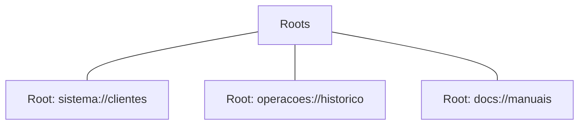

- **Territórios de acesso** que delimitam onde um servidor pode operar
- Funcionam como "crachás de segurança" para diferentes áreas
- Permitem controle granular de permissões

---

# Conceitos Fundamentais: Resources

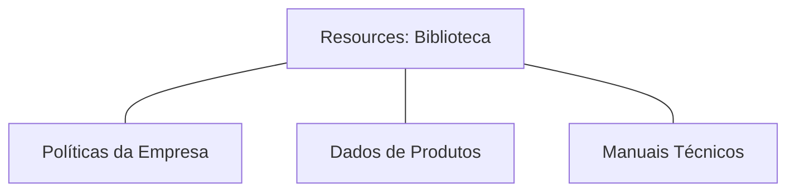

- "Fontes de conhecimento" que o LLM pode consultar
- Documentos, dados ou conteúdos disponibilizados pelo servidor MCP
- Permitem acesso a dados que não estão no treinamento do LLM

---

# Conceitos Fundamentais: Tools

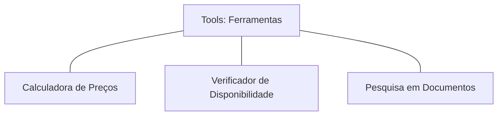

- Funções que o LLM pode invocar para realizar ações
- Permitem que a IA faça algo além de gerar texto
- Conectam o LLM a funcionalidades de sistemas existentes

---

# Conceitos Fundamentais: Prompts

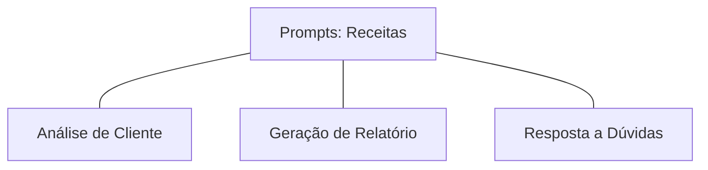

- Instruções padronizadas que guiam o LLM em tarefas específicas
- "Receitas testadas" para garantir respostas consistentes
- Asseguram que todas as etapas de um processo sejam seguidas

---

# Conceitos Fundamentais: Sampling

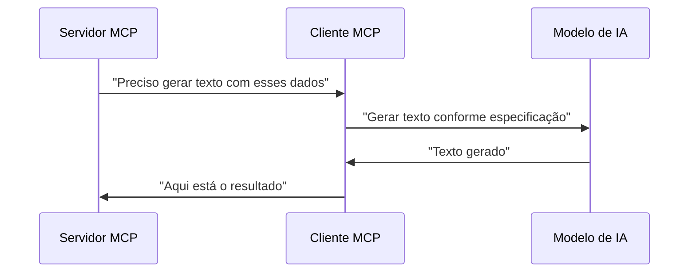

- Permite que o servidor solicite geração de conteúdo do LLM
- Fluxo reverso: servidor pede ajuda ao cliente/LLM

---

# Módulo 5: Implementação Prática

---

# Começando Com MCP: Pré-requisitos

- Conhecimento básico de JSON e HTTP
- Familiaridade com modelos de linguagem (LLMs)
- Node.js/Python para implementação de servidores
- Acesso a um LLM compatível com MCP (Claude, etc.)

---

# Criando Seu Primeiro Servidor MCP

### Estrutura Básica (Node.js)

```javascript
const { createServer } = require('mcp-server');

// Definir recursos disponíveis
const resources = [
  {
    id: 'meu-primeiro-recurso',
    title: 'Documento de Teste',
    content: 'Este é um documento de teste para o MCP.'
  }
];

// Definir ferramentas disponíveis
const tools = {
  calculadora: {
    description: 'Realiza cálculos matemáticos simples',
    parameters: {
      operacao: { type: 'string' },
      valores: { type: 'array' }
    },
    handler: async (params) => {
      // Lógica da calculadora
    }
  }
};

// Implementação de persistência personalizada
const memoryStore = new Map();

const customStorage = {
  // Armazenar dados para uso futuro
  storeData: async (userId, key, value) => {
    if (!memoryStore.has(userId)) {
      memoryStore.set(userId, new Map());
    }
    memoryStore.get(userId).set(key, value);
    return true;
  },
  
  // Recuperar dados armazenados
  retrieveData: async (userId, key) => {
    if (!memoryStore.has(userId)) return null;
    return memoryStore.get(userId).get(key) || null;
  }
};

// Criar e iniciar o servidor
const server = createServer({
  root: 'demo://meuservidor',
  resources,
  tools,
  storage: customStorage // Sistema de persistência customizado
});

server.listen(3000);
```

---

# Integração Com Cliente MCP

### Exemplo De Código (Python)

```python
from mcp_client import MCPClient

# Inicializar cliente
client = MCPClient()

# Conectar a um servidor
connection = client.connect("http://localhost:3000")

# Listar recursos disponíveis
resources = connection.list_resources()

# Acessar um recurso
document = connection.get_resource("meu-primeiro-recurso")

# Executar uma ferramenta
result = connection.execute_tool("calculadora", {
    "operacao": "soma",
    "valores": [1, 2, 3, 4]
})
```

---

# Configuração De Segurança Básica

- **Autenticação:** Implementação de tokens JWT
- **Autorização:** Definição de permissões por root
- **Registro de atividades:** Logs de todas as interações
- **HTTPS:** Obrigatório para comunicações em rede
- **Rate limiting:** Proteção contra sobrecarga

---

# Módulo 6: Casos De Uso Avançados

---

# MCP Na Prática: Setor Financeiro

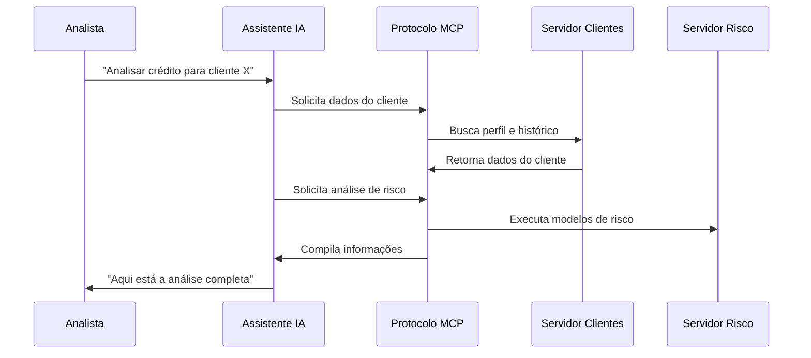

---

# MCP Na Prática: Saúde

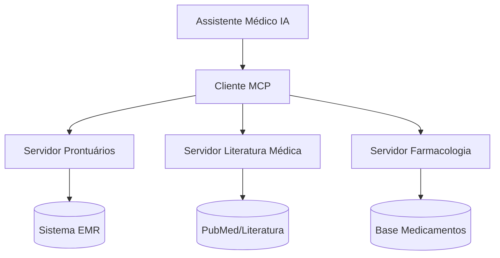

- Assistência em tempo real durante consultas
- Acesso a literatura médica atualizada
- Análise de histórico completo do paciente

---

# MCP Na Prática: E-commerce

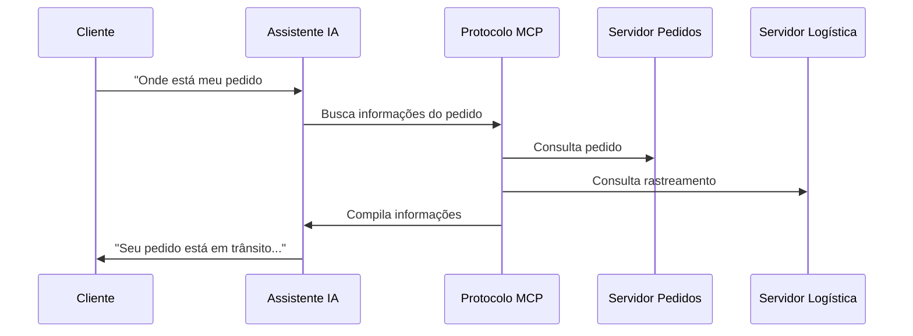

---

# MCP Na Prática: Desenvolvimento

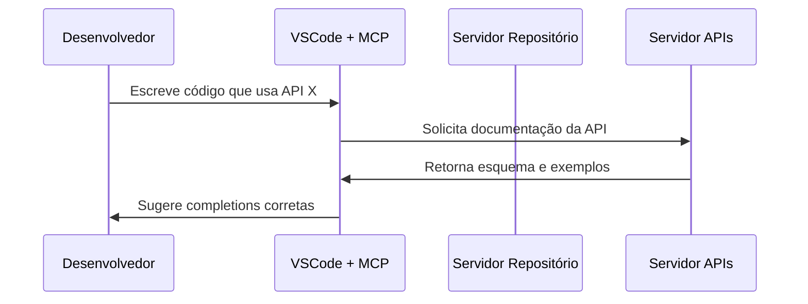

- Sugestões contextualmente relevantes
- Acesso à documentação atualizada
- Verificações de segurança em tempo real

---

# Casos De Uso: Atendimento Ao Cliente

**Antes do MCP:**

- Chatbot limitado a respostas pré-programadas
- Sem acesso ao histórico completo do cliente
- Necessidade frequente de transferir para humanos

**Com MCP:**

- Acesso em tempo real a dados do cliente
- Capacidade de realizar ações (reagendar, cancelar, etc.)
- Resolução completa de problemas complexos
- Redução de 75% em transferências para agentes humanos

---

# Módulo 7: Desafios E Melhores Práticas

---

# Desafios Na Implementação Do MCP

1. **Segurança e Privacidade:**
    
    - Garantir controle de acesso rigoroso
    - Proteger dados sensíveis
    - Implementar auditoria de todas as ações
2. **Complexidade Técnica:**
    
    - Curva de aprendizado inicial
    - Necessidade de equipe multidisciplinar
    - Integração com sistemas legados
3. **Considerações Éticas:**
    
    - Transparência sobre uso de IA
    - Supervisão humana apropriada
    - Prevenção de vieses nos dados
4. **Limitações do Protocolo:**
    
    - Falta de memória compartilhada nativa entre sessões
    - Necessidade de implementar persistência manualmente
    - Sobrecarga de comunicação em aplicações distribuídas

---

# Melhores Práticas Para MCP

1. **Começar pequeno:**
    
    - Projeto piloto em área controlada
    - Expandir gradualmente
2. **Documentação rigorosa:**
    
    - Mapeamento de todos os roots e resources
    - Padrões claros para tools
3. **Testes extensivos:**
    
    - Verificação de segurança
    - Simulações de carga
    - Validação de respostas
4. **Monitoramento contínuo:**
    
    - Logs detalhados
    - Métricas de desempenho
    - Alertas para comportamentos anômalos

---

# A Evolução Das IAs Com MCP


**Antes:**

- IAs limitadas ao seu treinamento
- Respostas genéricas
- Dados potencialmente desatualizados

**Com MCP:**

- Acesso a dados atualizados e específicos
- Execução de ações em sistemas externos
- Contextualização baseada em dados reais

**Futuro:**

- Automação complexa de processos
- Tomada de decisão assistida
- Inteligência distribuída e colaborativa

---

# Módulo 8: O Futuro Do MCP

---

# O Futuro Do MCP

### 1. Federação E Descoberta De Servidores

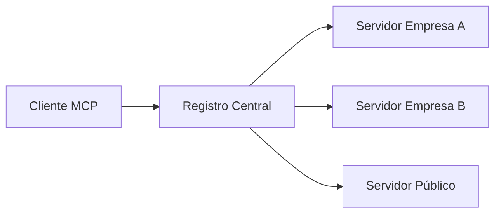

### 2. Modelos Especializados Por Domínio

### 3. Segurança E Conformidade Avançadas

### 4. Memória Compartilhada E Contextual

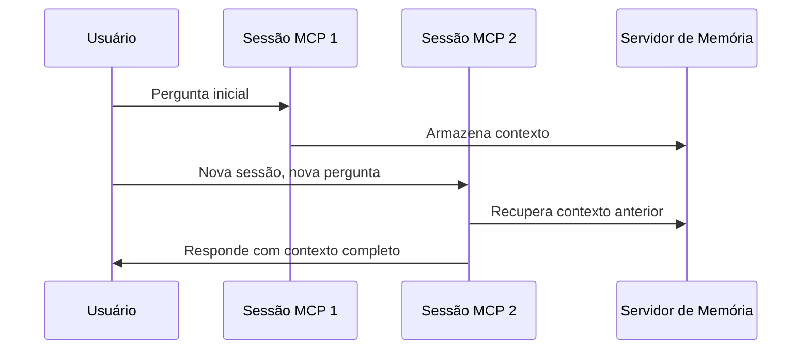

### 5. Sistemas Multi-agentes E Colaborativos

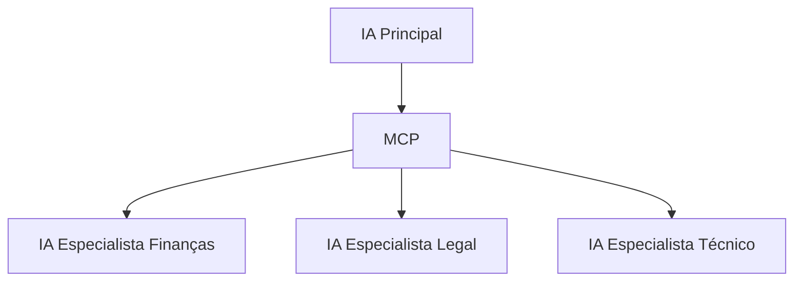

---

# Métricas Reais De Implementações MCP

|Área|Métrica|Impacto|
|---|---|---|
|**Desenvolvimento**|Tempo para implementar integrações|Redução de 85%|
|**Atendimento**|Resolução no primeiro contato|Aumento de 60%|
|**Operações**|Tempo para escalar novos assistentes|Redução de 90%|
|**Segurança**|Controle granular de acesso|Aumento de 100%|
|**Custo**|Manutenção de integrações|Redução de 70%|

---

# Próximos Passos Para Começar

1. **Explore a documentação oficial**
    
    - [modelcontextprotocol.io](https://modelcontextprotocol.io/)
2. **Experimente exemplos de implementação**
    
    - [github.com/modelcontextprotocol](https://github.com/modelcontextprotocol)
3. **Identifique um caso de uso piloto**
    
    - Escolha um problema específico e bem definido
    - Defina métricas claras de sucesso
4. **Desenvolva um protótipo mínimo**
    
    - Um servidor MCP com poucos recursos
    - Um cliente que consuma esses recursos
5. **Expanda gradualmente**
    
    - Adicione mais fontes de dados
    - Implemente ferramentas mais complexas

---

# Recursos Para Aprofundamento

- **Documentação Oficial:** [modelcontextprotocol.io](https://modelcontextprotocol.io/)
- **GitHub:** [github.com/modelcontextprotocol](https://github.com/modelcontextprotocol)
- **Anúncio Anthropic:** [anthropic.com/news/model-context-protocol](https://www.anthropic.com/news/model-context-protocol)
- **Especificação:** [spec.modelcontextprotocol.io](https://spec.modelcontextprotocol.io/)
- **Comunidade Discord:** [discord.gg/mcp-community](https://discord.gg/mcp-community)
- **Curso Online:** [learn.mcp.dev](https://learn.mcp.dev/)
- **Newsletter Semanal:** [mcp-weekly.substack.com](https://mcp-weekly.substack.com/)

---

# Obrigado

> 💼 Apresentação preparada por Pimentel
>
> Junho 2024