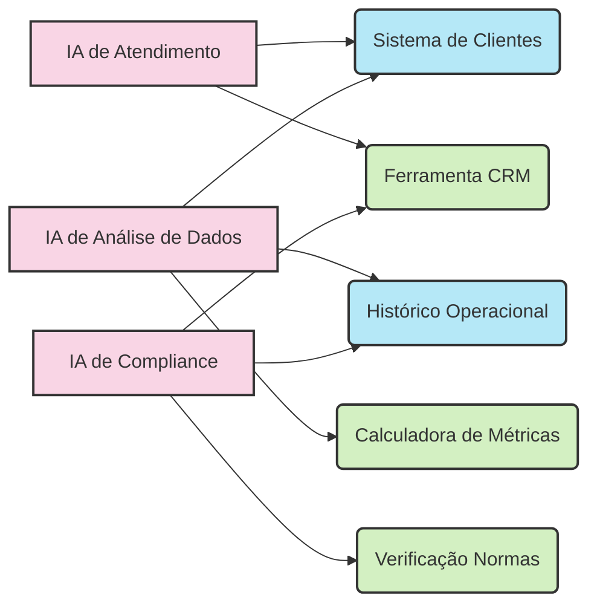

# O Desafio das IAs Isoladas

Imagine um consultor brilhante trancado em uma sala isolada, sem acesso aos sistemas, dados ou documentos da sua empresa. Não importa quão inteligente seja, suas recomendações serão limitadas porque ele não pode ver as informações essenciais para o contexto.

É exatamente assim que funcionam os modelos de linguagem (LLMs) quando não têm acesso contextual aos seus sistemas. Como a Anthropic destacou ao lançar o MCP:

> "Mesmo os modelos mais sofisticados são constrangidos por seu isolamento dos dados—presos atrás de silos de informação e sistemas legados."

**O Desafio Atual:** Nas organizações modernas, essa limitação é especialmente problemática. Os LLMs poderiam revolucionar inúmeros processos, mas como conectá-los com:

- Sistemas legados desenvolvidos décadas atrás?
- Bancos de dados corporativos com informações críticas?
- Documentos internos que mudam constantemente?
- Ferramentas e aplicações específicas da empresa?

Este é o problema fundamental que o Model Context Protocol foi criado para resolver.

## O Problema da Fragmentação

**A Torre de Babel Digital**

Antes do MCP, conectar LLMs a sistemas externos era uma tarefa árdua e fragmentada. Cada aplicação de IA precisava construir suas próprias conexões para cada sistema:

Este modelo causava vários problemas críticos:

- **Duplicação de esforços:** A mesma conexão era recriada múltiplas vezes
- **Inconsistência:** Diferentes padrões para cada integração
- **Custos elevados:** Mudanças em um sistema exigiam atualizações em todas as integrações
- **Desenvolvimento lento:** Meses para construir cada conexão
- **Segurança comprometida:** Cada integração com sua própria implementação de segurança
- **Dependência de fornecedor:** Difícil migrar entre diferentes modelos de IA

Para as organizações, isso significava projetos de IA caros, lentos e difíceis de manter.

---

[Anterior: Introdução ao MCP](00-mcp-introducao.md) | [Próximo: O MCP Como Solução Universal](02-mcp-solucao-universal.md) 