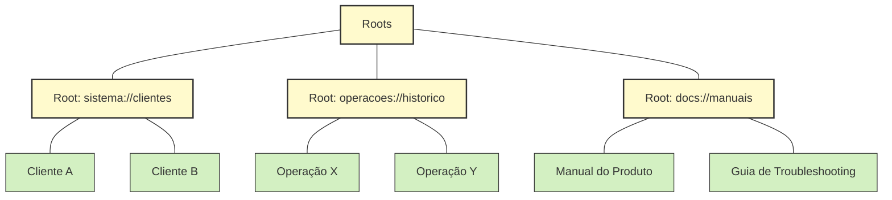
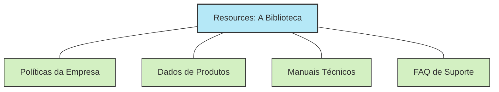
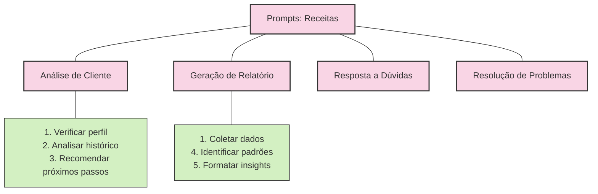
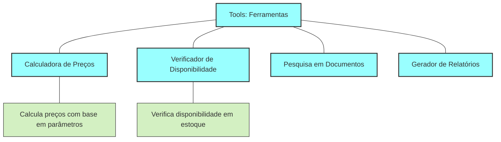
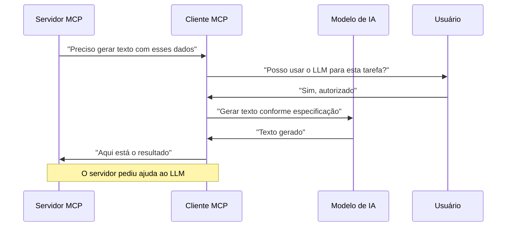

# Conceitos Fundamentais

O MCP se estrutura em torno de alguns conceitos fundamentais que determinam como os modelos interagem com dados e sistemas externos. Esta seção explora cada um desses componentes essenciais.

## Roots: Territórios de Acesso

**O que são:** Roots (raízes) são como os territórios ou zonas que delimitam onde um servidor MCP pode operar. São o equivalente a crachás de segurança que controlam o acesso a diferentes áreas de um prédio.

**Analogia:** Se o MCP fosse um sistema de arquivos, os Roots seriam as pastas principais. Se fosse um shopping, seriam as diferentes lojas e áreas.

**Função na prática:**

- **Segurança:** Limitam o escopo de atuação de cada servidor
- **Organização:** Agrupam recursos relacionados
- **Controle:** Permitem gerenciar permissões de forma granular

Um servidor MCP para recursos humanos, por exemplo, poderia ter acesso ao root `rh://políticas` mas não ao root `financeiro://orçamentos`.

## Resources: A Biblioteca de Conhecimento

**O que são:** Resources são as "fontes de conhecimento" que o LLM pode consultar. São os documentos, dados ou conteúdos que o servidor MCP disponibiliza para o LLM.

**Analogia:** Pense nos Resources como livros em uma biblioteca ou artigos em uma enciclopédia. O LLM pode solicitá-los, lê-los e usar as informações para responder perguntas ou tomar decisões.

**Função na prática:**

- **Contextualização:** Fornecem informações atualizadas e específicas
- **Conhecimento:** Permitem que o LLM acesse dados que não estão em seu treinamento
- **Precisão:** Garantem respostas baseadas em informações oficiais e atuais

Por exemplo, um LLM conectado via MCP poderia acessar o resource `empresa://produtos/catalogo-atual` para fornecer informações precisas sobre os produtos disponíveis no momento.

## Prompts: As Receitas Prontas

**O que são:** Prompts são instruções padronizadas que guiam o LLM em tarefas específicas. São como receitas ou templates para interações comuns.

**Analogia:** Se o LLM fosse um chef, os Prompts seriam receitas testadas e aprovadas. Garantem que cada "prato" (resposta) siga um padrão consistente e inclua todos os ingredientes necessários.

**Função na prática:**

- **Padronização:** Garantem consistência nas interações repetitivas
- **Completude:** Asseguram que todas as etapas de um processo sejam seguidas
- **Eficiência:** Eliminam a necessidade de reinventar instruções comuns

Empresas podem criar prompts específicos como "Análise de Cliente" ou "Diagnóstico de Problema" que seguem seus procedimentos internos.

## Tools: A Caixa de Ferramentas

**O que são:** Tools são funções ou capacidades que o LLM pode invocar para realizar ações no mundo real. São como botões ou controles que permitem que a IA faça algo além de gerar texto.

**Analogia:** Se o LLM fosse um piloto em um cockpit, as Tools seriam os diversos controles e botões que permitem operar a aeronave.

**Função na prática:**

- **Ação:** Permitem que o LLM execute operações em sistemas externos
- **Automação:** Habilitam tarefas que antes exigiam intervenção humana
- **Integração:** Conectam o LLM a funcionalidades de sistemas existentes

Uma Tool pode permitir que o LLM consulte um banco de dados, agende uma reunião, reserve um produto ou calcule métricas complexas.

## Sampling: Consultando o Oráculo

**O que é:** Sampling é quando um servidor MCP precisa da inteligência do LLM para gerar conteúdo. É um fluxo inverso onde o servidor pede ao cliente LLM para resolver um problema.

**Analogia:** Imagine um assistente (servidor) que, ao se deparar com uma tarefa criativa, pede ajuda a um especialista (LLM) via o gerente (cliente MCP).

**Função na prática:**

- **Geração de conteúdo:** Permite que servidores utilizem o poder dos LLMs
- **Controle:** Mantém o usuário no comando, podendo aprovar ou rejeitar
- **Flexibilidade:** Possibilita criar conteúdo dinâmico sem reescrever servidores

Um exemplo seria um servidor MCP de gestão de documentos que solicita ao LLM para gerar um resumo de um relatório extenso.

---

[Anterior: Arquitetura MCP](04-mcp-arquitetura-mcp.md) | [Próximo: Como o MCP Funciona Por Baixo dos Panos](05-mcp-funcionamento-interno.md) 