# MCP em Ação: Aplicações em Diversos Setores

O Model Context Protocol está transformando como as organizações de diversos setores utilizam IA. Esta seção explora aplicações concretas em diferentes indústrias, demonstrando o potencial transformador do MCP em contextos do mundo real.

## Setor Financeiro

### Assistente de Análise de Crédito

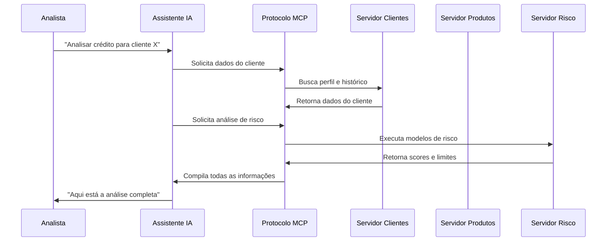

**Componentes da Solução:**

- **Servidor MCP de Clientes:** Acessa o CRM e histórico de relacionamento
- **Servidor MCP de Produtos:** Gerencia ofertas disponíveis e condições
- **Servidor MCP de Risco:** Executa modelos de análise de crédito
- **Assistente com MCP:** Orquestra a consulta aos diferentes servidores

**Benefícios Tangíveis:**

- **Velocidade:** Análise 10x mais rápida que processos manuais tradicionais
- **Consistência:** Aplicação uniforme de políticas de crédito em todos os casos
- **Conformidade:** Documentação automática para processos de auditoria e compliance
- **Transparência:** Capacidade de explicar decisões (explainability)
- **Personalização:** Ofertas adaptadas ao perfil específico do cliente

**Métricas de Impacto:**

- Redução de 70% no tempo de análise de crédito
- Diminuição de 35% em aprovações de alto risco
- Aumento de 25% na satisfação dos clientes

## Saúde e Ciências da Vida

### Assistente de Diagnóstico Médico

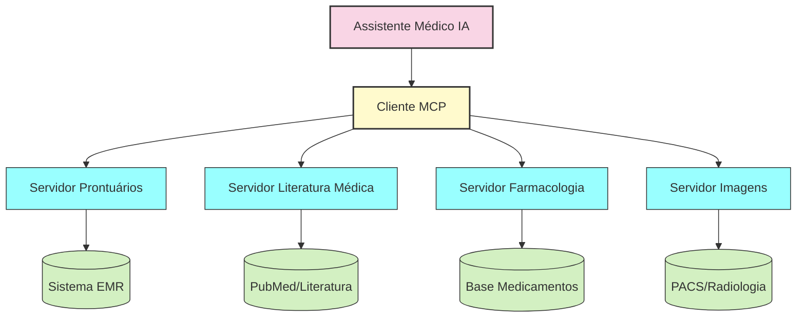

**Caso de Uso: Suporte à Decisão Clínica**

O assistente médico potencializado por MCP auxilia médicos durante consultas e tomadas de decisão:

1. **Acesso contextual ao prontuário:**
   - Histórico completo do paciente
   - Resultados de exames anteriores
   - Medicações em uso e alergias

2. **Consulta à literatura médica:**
   - Artigos científicos relevantes
   - Diretrizes clínicas atualizadas
   - Estudos de caso semelhantes

3. **Análise farmacológica:**
   - Verificação de interações medicamentosas
   - Dosagens apropriadas
   - Alternativas terapêuticas

4. **Interpretação de imagens:**
   - Comparação com casos anteriores
   - Detecção de alterações sutis
   - Identificação de padrões anormais

**Benefícios Clínicos:**

- Assistência em tempo real durante consultas
- Redução de erros diagnósticos e terapêuticos
- Decisões baseadas em evidências atualizadas
- Documentação clínica mais completa e precisa

**Impacto no Fluxo de Trabalho:**

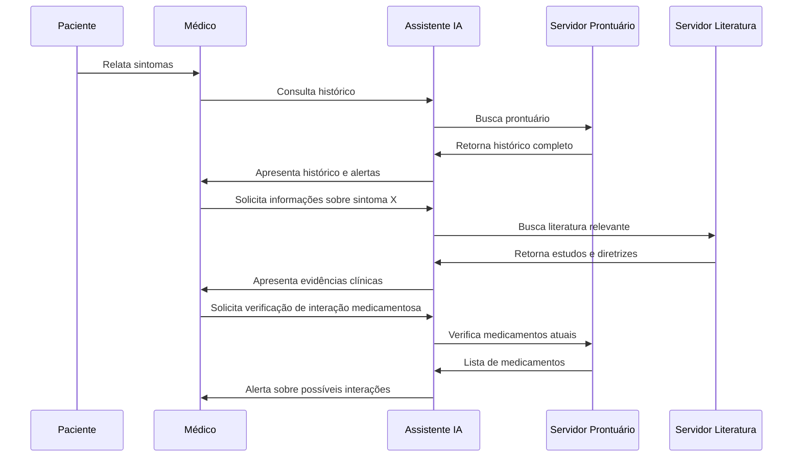

## Varejo e E-commerce

### Assistente de Atendimento ao Cliente

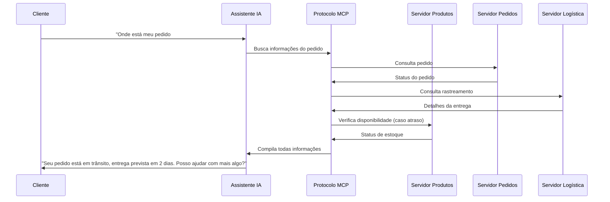

**Ecossistema MCP para Varejo:**

- **Servidor de Produtos:** Catálogo, preços, disponibilidade
- **Servidor de Pedidos:** Histórico, status, pagamentos
- **Servidor de Logística:** Rastreamento, previsões de entrega
- **Servidor de Personalização:** Preferências, histórico de navegação

**Cenários Atendidos:**

1. **Consultas de status:**
   - "Onde está meu pedido?"
   - "Quando meu produto será entregue?"
   - "Por que meu pedido está atrasado?"

2. **Suporte técnico:**
   - "Como configurar meu novo dispositivo?"
   - "Meu produto não está funcionando corretamente"
   - "Preciso de ajuda com a instalação"

3. **Trocas e devoluções:**
   - "Quero devolver um item"
   - "Como faço para trocar por outro tamanho?"
   - "Qual o prazo para reembolso?"

**Métricas de Desempenho:**

- **Resolução no primeiro contato:** Aumento de 45% a 85%
- **Tempo médio de atendimento:** Redução de 8 minutos para 2 minutos
- **Satisfação do cliente (CSAT):** Aumento de 3.5 para 4.7 (escala 1-5)
- **Custo por interação:** Redução de 65%

**Arquitetura da Solução:**

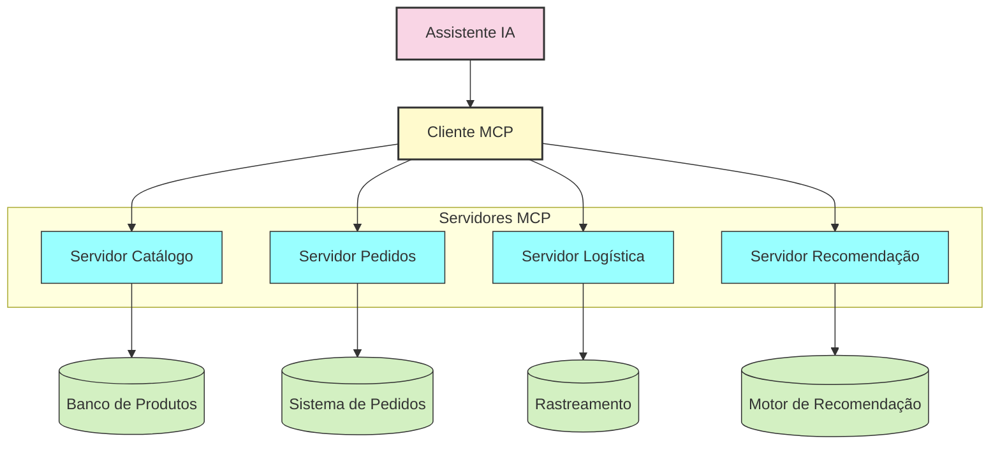

## Manufatura e Indústria

### Assistente de Manutenção Preditiva

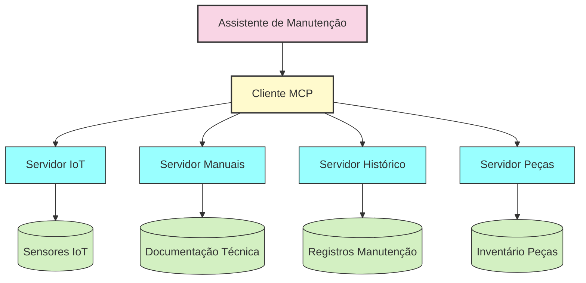

**Capacidades do Sistema:**

- **Monitoramento contínuo:** Coleta e análise de dados de sensores em tempo real
- **Detecção de anomalias:** Identificação precoce de padrões indicativos de falhas
- **Diagnóstico assistido:** Correlação de sintomas com causas prováveis
- **Recomendação de ações:** Sugestões de procedimentos de manutenção específicos
- **Gerenciamento de recursos:** Verificação de disponibilidade de peças e técnicos

**Fluxo de Diagnóstico:**

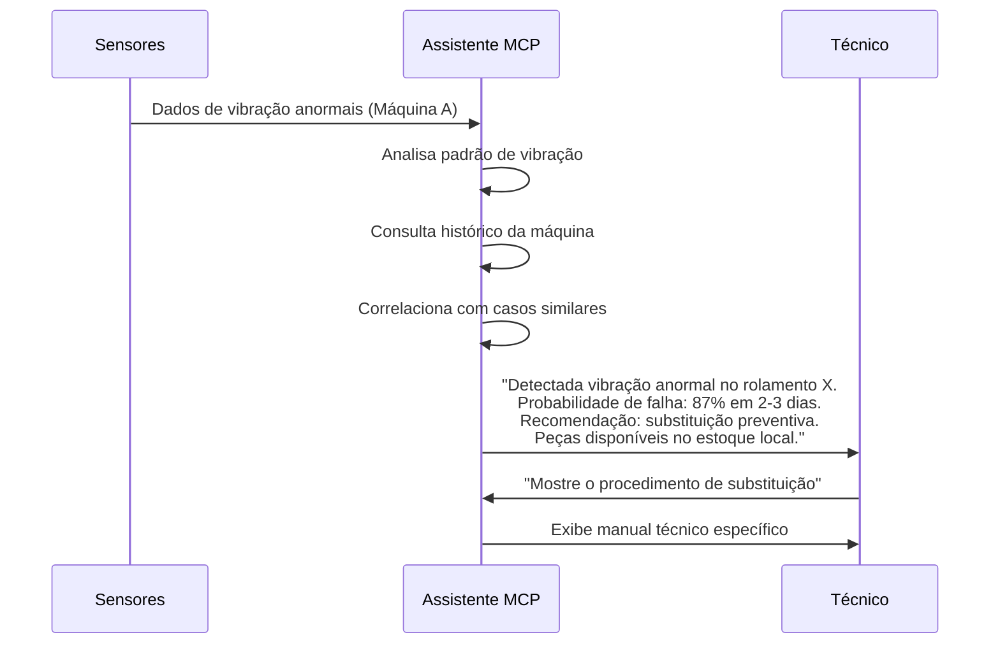

**Benefícios Operacionais:**

- **Redução de downtime:** Prevenção de falhas não planejadas
- **Otimização de manutenção:** Intervenções baseadas na condição real dos equipamentos
- **Aumento de vida útil:** Operação dentro de parâmetros ideais
- **Redução de custos:** Diminuição de reparos emergenciais caros
- **Eficiência energética:** Detecção de condições que aumentam o consumo

**Métricas de Performance:**

- Redução de 72% em falhas não planejadas
- Aumento de 18% na vida útil dos equipamentos
- Economia de 32% em custos de manutenção
- ROI de 315% no primeiro ano de implementação

## Desenvolvimento de Software

### Copiloto de Desenvolvimento

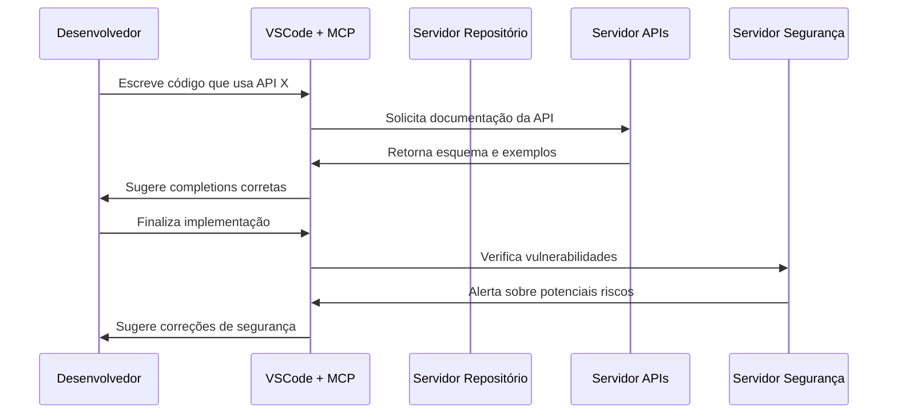

**Infraestrutura MCP para Desenvolvimento:**

- **Servidor de Repositório:** Código existente, padrões, histórico
- **Servidor de APIs:** Documentação e especificações de APIs internas
- **Servidor de Testes:** Casos de teste, cobertura, relatórios
- **Servidor de Segurança:** Verificação de vulnerabilidades, conformidade
- **Servidor de Arquitetura:** Padrões de design, documentação técnica

**Casos de Uso:**

1. **Assistência em tempo real:**
   - Autocompletar contextual com base em APIs e padrões da empresa
   - Sugestões de implementação baseadas em código similar
   - Alertas instantâneos sobre problemas de segurança ou performance

2. **Onboarding acelerado:**
   - Explicações sobre padrões de código específicos da empresa
   - Sugestões de melhores práticas para novas tecnologias
   - Orientação sobre arquitetura da aplicação

3. **Revisão automática:**
   - Verificação de aderência a padrões de codificação
   - Detecção precoce de bugs e vulnerabilidades
   - Sugestões de otimização e refatoração

**Arquitetura da Solução:**

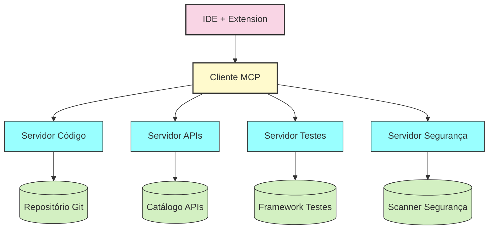

**Impacto na Produtividade:**

- **Redução de bugs:** Diminuição de 40% em bugs encontrados em produção
- **Velocidade de desenvolvimento:** Aumento de 35% na quantidade de features entregues
- **Qualidade de código:** Melhoria significativa em métricas de qualidade
- **Tempo de onboarding:** Redução de 65% no tempo para novos desenvolvedores se tornarem produtivos

## Educação

### Tutor Personalizado com MCP

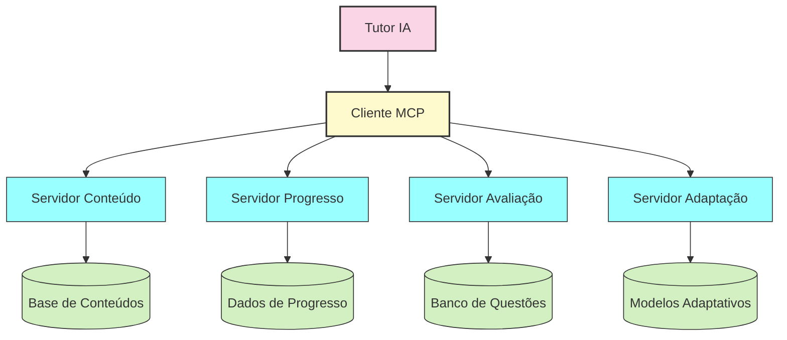

**Componentes da Solução:**

- **Servidor de Conteúdo:** Material didático, recursos multimídia, referências
- **Servidor de Progresso:** Histórico de aprendizado, pontos fortes e fracos
- **Servidor de Avaliação:** Exercícios, questionários, projetos práticos
- **Servidor de Adaptação:** Algoritmos de personalização de aprendizado

**Cenário de Aprendizagem:**

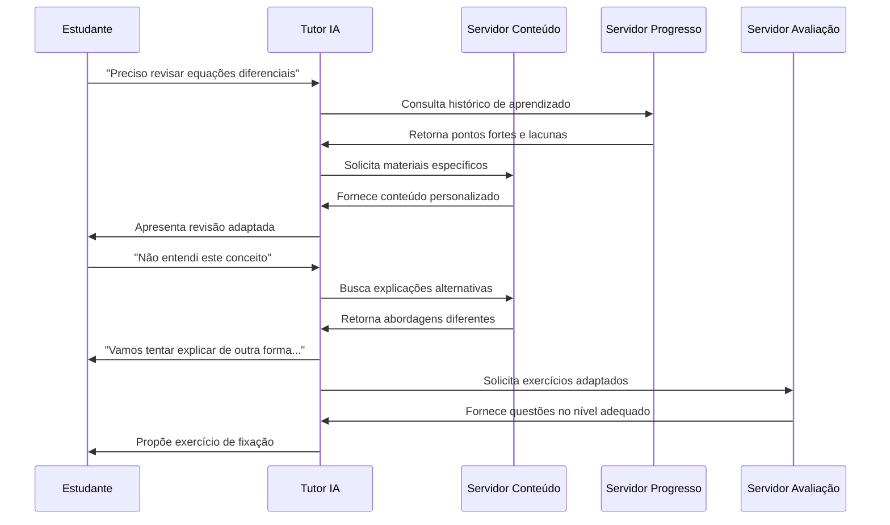

**Impacto Educacional:**

- **Aprendizado personalizado:** Conteúdo e ritmo adaptados às necessidades individuais
- **Feedback imediato:** Correções e orientações em tempo real
- **Identificação de lacunas:** Detecção precoce de conceitos não compreendidos
- **Engajamento aumentado:** Experiência interativa e responsiva

Este panorama das aplicações do MCP em diversos setores demonstra seu potencial transformador. A capacidade de conectar IAs a sistemas específicos de cada indústria permite criar assistentes verdadeiramente contextuais, capazes de agregar valor significativo a processos críticos de negócio. 