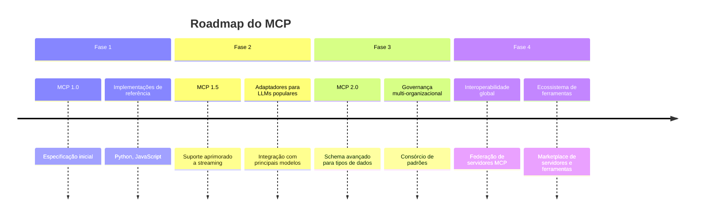

# O Futuro do MCP e Próximos Passos

O Model Context Protocol está apenas no início de sua jornada. À medida que mais organizações e desenvolvedores o adotam, seu potencial continua a expandir. Vamos explorar o que o futuro reserva para o MCP:

## Evolução Contínua do Protocolo

A evolução do MCP continuará nas seguintes direções:

1. **Expansão de capacidades**
   - Suporte para novas modalidades (áudio, vídeo, 3D)
   - Otimizações de performance para casos de uso em larga escala
   - Mecanismos avançados de caching e compressão

2. **Padronização e governança**
   - Formalização através de organizações de padrões
   - Programas de certificação para implementações
   - Grupos de trabalho focados em casos de uso específicos

3. **Interoperabilidade**
   - Federação de servidores MCP
   - Descoberta automática de recursos
   - Autenticação e autorização padronizadas

## Tendências Emergentes

As seguintes tendências estão moldando o futuro do MCP:

### Agentes Autônomos

Agentes de IA podem usar o MCP para:
- Acessar conjuntos diversificados de dados
- Utilizar ferramentas disponíveis em diferentes sistemas
- Colaborar entre si através de interfaces padronizadas
- Manter estado persistente entre sessões

### Sistemas Multi-Modelo

O MCP facilitará a orquestração de múltiplos modelos especializados:
- Roteamento inteligente de tarefas para modelos específicos
- Composição de capacidades entre modelos diferentes
- Tradução automática entre formatos de entrada/saída
- Avaliação comparativa de desempenho

### Ecossistemas de Ferramentas

Surgirá um rico ecossistema em torno do MCP:
- Marketplaces de servidores especializados
- Ferramentas de desenvolvimento e depuração
- Frameworks para construção rápida de servidores
- Bibliotecas de componentes reutilizáveis

## Como Se Envolver

O MCP é um esforço comunitário e existem várias maneiras de contribuir:

1. **Adoção**
   - Implemente servidores MCP em sua organização
   - Compartilhe casos de uso e lições aprendidas
   - Forneça feedback sobre a especificação

2. **Desenvolvimento**
   - Contribua para implementações de referência
   - Crie ferramentas e bibliotecas de suporte
   - Participe de discussões técnicas

3. **Padronização**
   - Ajude a refinar a especificação
   - Participe de grupos de trabalho
   - Advogue pela adoção em sua indústria

O sucesso do MCP depende do envolvimento da comunidade. Cada nova implementação e caso de uso fortalece o ecossistema e amplia o impacto da interoperabilidade.

## Um Convite à Colaboração

A visão do MCP é ambiciosa: criar uma linguagem universal para conectar todas as inteligências, artificiais e humanas. Esta visão requer colaboração entre:

- Organizações de todos os tamanhos e setores
- Pesquisadores acadêmicos e da indústria
- Desenvolvedores e engenheiros
- Designers de produtos e experiências
- Formuladores de políticas e reguladores

Juntos, podemos construir um futuro onde a inteligência artificial realmente amplifique o potencial humano, de forma acessível, segura e equitativa.

---

[Anterior: MCP em Ação nos Diversos Setores](07-aplicacoes-praticas.md) | [Próximo: Recursos para Aprofundamento](09-mcp-recursos.md) 