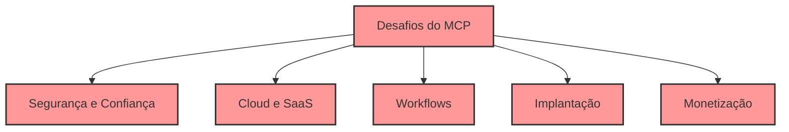
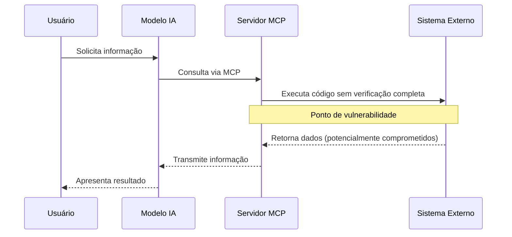
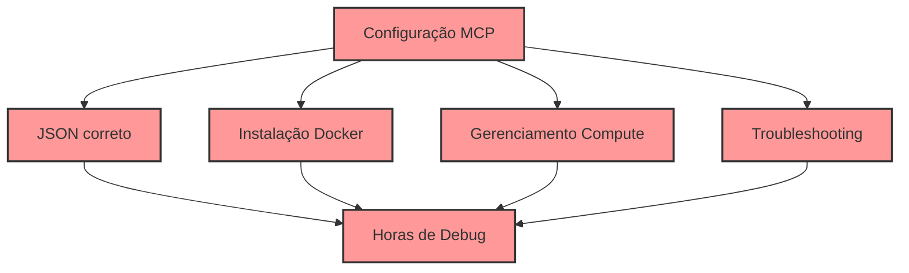
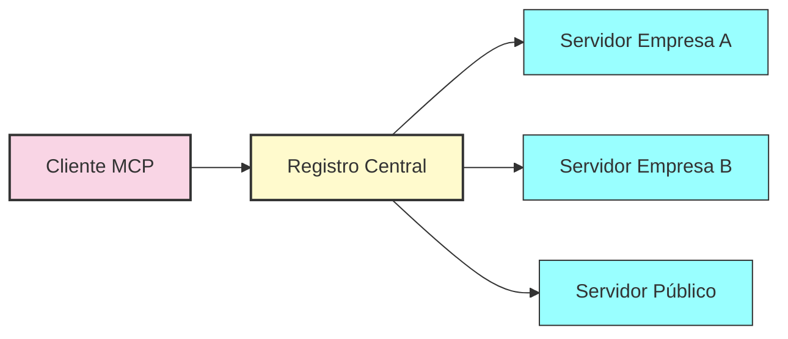
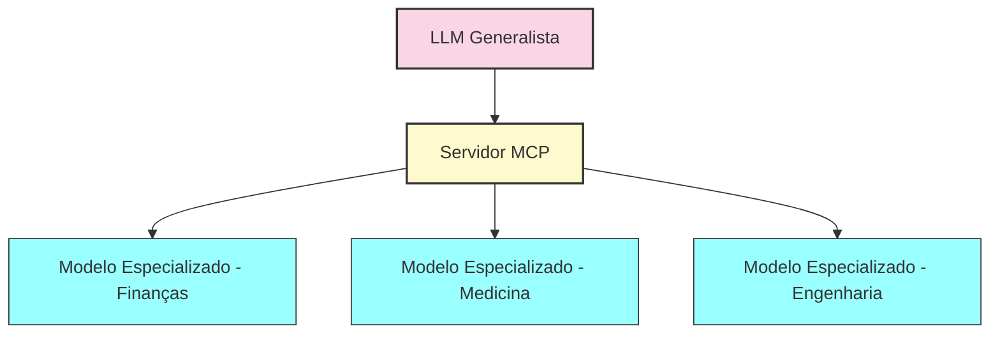
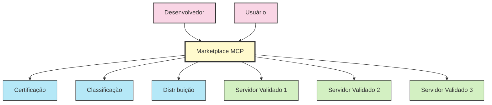
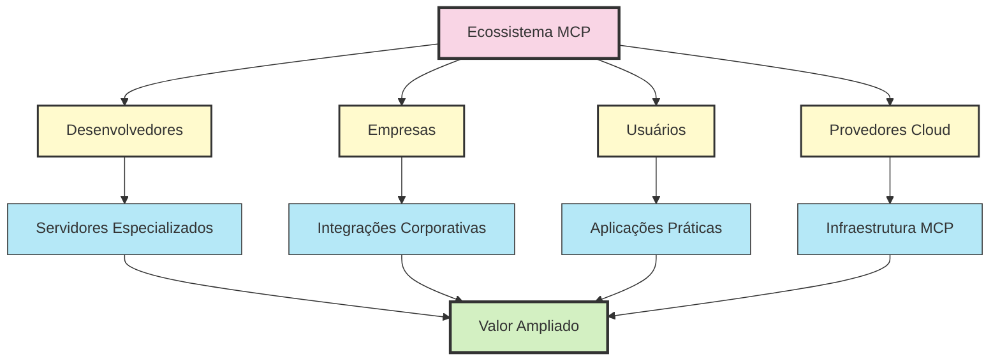

# O Futuro Do MCP

  

O Model Context Protocol está em constante evolução, com um futuro promissor e diversas tendências emergentes. No entanto, para que o MCP alcance todo seu potencial, é essencial reconhecer e abordar os desafios reais que estão surgindo em sua implementação.

  

## Desafios Atuais Na Implementação

  

  

### 1. Segurança E Confiança

  

- **Sistema baseado em confiança:** Conectores MCP funcionam atualmente com um sistema baseado em honra ao comunicar com LLMs
- **Riscos de injeção:** Preocupações sobre a injeção de código/dados sem verificações rigorosas
- **Ausência de certificação:** Inexistência de um sistema centralizado de certificação de segurança para conectores
- **Validação limitada:** Dificuldade em validar a autenticidade e segurança dos servidores MCP de terceiros

  

  

### 2. Limitações De Suporte Cloud/SaaS

  

- **Suporte seletivo:** Algumas plataformas (como Claude) só suportam MCP em aplicativos desktop, não em plataformas web
- **Dilema de hospedagem:** Organizações enfrentam desafios ao precisar auto-hospedar servidores MCP
- **Integração parcial:** Plataformas de nuvem não oferecem integrações nativas para MCP
- **Conformidade regulatória:** Desafios para atender requisitos de compliance em ambientes SaaS

  

### 3. Problemas De Automação De Fluxos

  

- **Entidades isoladas:** MCPs funcionam como entidades atômicas com rotinas funcionais predefinidas
- **Falta de orquestração:** Impossibilidade de orquestrar fluxos de trabalho entre múltiplos conectores MCP dinamicamente
- **Limitação de casos de uso:** Restrições para implementar cenários empresariais complexos que exigem coordenação

  

### 4. Complexidade De Implantação

  

  

- **Configuração trabalhosa:** Configurar clientes MCP com JSONs corretos exige esforço técnico considerável
- **Problemas de interoperabilidade:** Desafios na comunicação entre diferentes conectores
- **Troubleshooting extenso:** Horas dedicadas à resolução de problemas são comuns
- **Curva de aprendizado:** Desenvolvedores enfrentam dificuldade inicial significativa

  

### 5. Monetização E Sustentabilidade

  

- **Modelos indefinidos:** Ausência de modelos claros de monetização para desenvolvedores
- **Ecossistema em formação:** Dificuldade em desenvolver um ecossistema sustentável
- **Incentivos insuficientes:** Poucos mecanismos para incentivar desenvolvimento de conectores de alta qualidade
- **Medição de valor:** Desafios para quantificar o valor gerado pelos conectores MCP

  

### 6. Casos Reais De Problemas Técnicos

  

Desenvolvedores e empresas relatam situações como:

  

- **Timeouts frequentes:** Servidores MCP atingindo limites de tempo durante operações complexas
- **Deployments problemáticos:** Semanas gastas para configurar ambientes MCP estáveis
- **Observabilidade limitada:** Falta de ferramentas maduras para monitoramento e diagnóstico
- **Problemas de cache:** Implementações atuais refazendo consultas idênticas desnecessariamente
- **Falhas silenciosas:** Erros ocorrendo sem feedback adequado para diagnóstico

  

## Tendências Promissoras

  

Apesar dos desafios, várias tendências indicam um futuro promissor para o MCP:

  

### 1. Federação E Descoberta De Servidores

  

Em breve, veremos mecanismos para descoberta automática de servidores MCP, permitindo:

  

  

- Registros centralizados de servidores MCP disponíveis
- Descoberta dinâmica de capacidades e serviços
- Federação entre organizações diferentes
- Marketplaces de servidores especializados

  

### 2. Modelos Especializados

  

O futuro do MCP aponta para uma melhor utilização de diferentes tipos de modelos:

  

  

- Modelos menores e especializados para domínios específicos
- Redução de custos computacionais
- Aumento de precisão em áreas especializadas
- Integração com sistemas corporativos existentes

  

### 3. Segurança E Conformidade Avançadas

  

O MCP está evoluindo para atender requisitos avançados de segurança:

  

- Esquemas de autenticação específicos para setores regulados
- Padrões de criptografia avançados para dados sensíveis
- Mecanismos de auditoria robustos
- Controles granulares baseados em políticas (Policy-as-Code)

  

## Soluções Emergentes

  

Para endereçar os desafios atuais, especialistas e empresas estão desenvolvendo:

  

### 1. Marketplace Centralizado

  

  

- Uma autoridade centralizada ou modelo tipo "App Store" para conectores MCP
- Verificação de vulnerabilidades automática
- Estabelecimento de padrões mínimos de segurança
- Construção de cadeia de confiança verificável

  

### 2. MCP Como Serviço (MCPaaS)

  

- Oferta MCP SaaS totalmente gerenciada
- Eliminação da necessidade de gerenciar infraestrutura
- Conectores pré-configurados para sistemas populares
- Escalabilidade e monitoramento integrados

  

### 3. Frameworks De Automação

  

- Camada de automação de workflows dentro dos MCPs
- Orquestração de múltiplos servidores em fluxos unificados
- Interfaces visuais para criar fluxos sem código
- Capacidades de monitoramento e retentativa

  

### 4. Padronização Aprimorada

  

- Extensões do protocolo para casos de uso empresariais
- Padrões de segurança específicos para indústrias reguladas
- Certificações formais para implementações
- Frameworks de teste para validação de conformidade

  

## Perspectivas Para O Ecossistema

  

O MCP está em um ponto de inflexão emocionante. Com os aprimoramentos adequados — frameworks de segurança, implantações nativas em nuvem, automação de workflow e um modelo de monetização orientado ao ecossistema — o MCP pode fazer a transição de uma tecnologia experimental para uma solução empresarial crítica.

  

  

Para alcançar esse potencial, será necessária colaboração contínua entre:

  

1. **Desenvolvedores de servidores MCP:** Criando implementações robustas e seguras
2. **Provedores de plataforma:** Melhorando o suporte nativo ao MCP
3. **Empresas:** Fornecendo feedback sobre casos de uso reais
4. **Comunidade open-source:** Desenvolvendo frameworks e padrões compartilhados

  

O futuro do MCP dependerá da resolução desses desafios, transformando-o de uma tecnologia promissora em um padrão empresarial confiável e amplamente adotado para integração de IA com sistemas do mundo real.

  

---

  

[Anterior: MCP em Ação nos Diversos Setores](07-aplicacoes-praticas.md) | [Próximo: Recursos para Aprofundamento](09-recursos.md)