# O Protocolo De Contexto De Modelo (MCP): Princípios Fundamentais E Arquitetura

## Introdução

O Model Context Protocol (MCP) é um protocolo aberto que padroniza como aplicações fornecem contexto para Modelos de Linguagem Grandes (LLMs). Ele funciona como um "USB-C para aplicações de IA", estabelecendo uma interface padrão que permite que diferentes aplicações se comuniquem com diversas fontes de dados e ferramentas de forma consistente e segura.

Antes do MCP, os desenvolvedores precisavam criar conectores personalizados para cada fonte de dados ou ferramenta que desejavam integrar com suas aplicações de IA, resultando em esforços duplicados e implementações inconsistentes. O MCP resolve esse problema fornecendo uma especificação padronizada para essas integrações.

## Arquitetura Fundamental

O MCP implementa uma arquitetura cliente-host-servidor que permite a integração segura e eficiente de capacidades de IA:

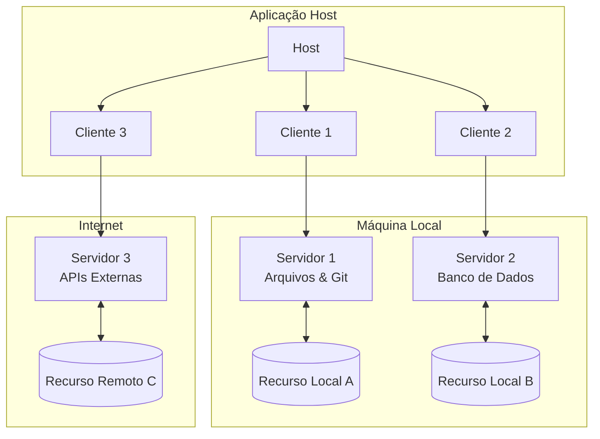

### Componentes Principais

#### Host

O processo host atua como contêiner e coordenador:

- Cria e gerencia múltiplas instâncias de clientes
- Controla permissões e ciclo de vida das conexões
- Impõe políticas de segurança e requisitos de consentimento
- Gerencia decisões de autorização do usuário
- Coordena integração com IA/LLM e amostragem
- Agrega contexto entre diferentes clientes

#### Clientes

Cada cliente é criado pelo host e mantém uma conexão isolada com o servidor:

- Estabelece uma sessão com estado por servidor (relação 1:1)
- Gerencia negociação de protocolo e troca de capacidades
- Encaminha mensagens de protocolo bidirecionalmente
- Gerencia assinaturas e notificações
- Mantém limites de segurança entre servidores

#### Servidores

Os servidores fornecem contexto especializado e capacidades:

- Expõem recursos, ferramentas e prompts via primitivas MCP
- Operam independentemente com responsabilidades focadas
- Podem solicitar amostragem através de interfaces de cliente
- Devem respeitar restrições de segurança
- Podem ser implementados como processos locais ou serviços remotos

## Princípios De Design

O MCP foi construído com base em vários princípios-chave:

1. **Servidores devem ser extremamente fáceis de construir**
    
    - Aplicações host lidam com responsabilidades de orquestração complexas
    - Servidores se concentram em capacidades específicas e bem definidas
    - Interfaces simples minimizam a sobrecarga de implementação
2. **Servidores devem ser altamente componíveis**
    
    - Cada servidor fornece funcionalidade focada em isolamento
    - Múltiplos servidores podem ser combinados perfeitamente
    - O protocolo compartilhado permite interoperabilidade
3. **Servidores não devem poder ler a conversa inteira nem "ver dentro" de outros servidores**
    
    - Servidores recebem apenas informações contextuais necessárias
    - O histórico completo da conversa permanece com o host
    - Cada conexão de servidor mantém isolamento
    - Interações entre servidores são controladas pelo host
4. **Recursos podem ser adicionados a servidores e clientes progressivamente**
    
    - O protocolo central fornece funcionalidade mínima necessária
    - Capacidades adicionais podem ser negociadas conforme necessário
    - Servidores e clientes evoluem independentemente
    - O protocolo é projetado para extensibilidade futura

## Ciclo De Vida Da Conexão

O MCP define um ciclo de vida rigoroso para conexões cliente-servidor:

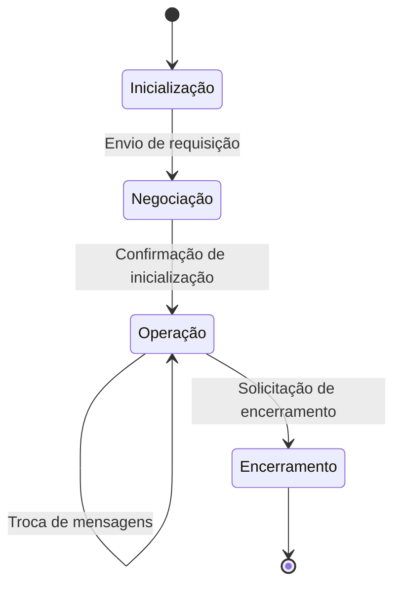

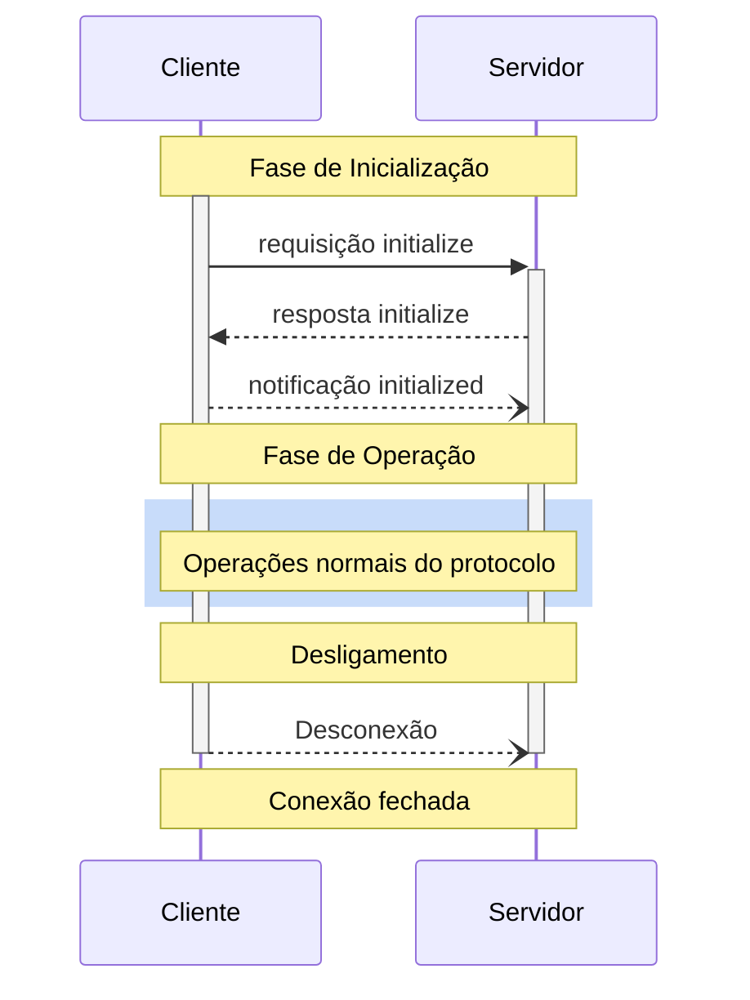

### Fase De Inicialização

Durante a inicialização, o cliente e o servidor:

- Estabelecem compatibilidade de versão do protocolo
- Trocam e negociam capacidades
- Compartilham informações de implementação

### Fase De Operação

Durante a operação, o cliente e o servidor trocam mensagens de acordo com as capacidades negociadas, respeitando a versão do protocolo e usando apenas as capacidades acordadas.

### Fase De Desligamento

Na fase de desligamento, uma das partes (geralmente o cliente) encerra a conexão do protocolo de forma limpa, utilizando o mecanismo de transporte subjacente para sinalizar o término da conexão.

## Tipos De Mensagens MCP

```mermaid
classDiagram
    class MensagemJSONRPC {
        jsonrpc: "2.0"
    }
    
    class Requisição {
        id: string | number
        method: string
        params?: object
    }
    
    class Resposta {
        id: string | number
        result?: object
        error?: ErrorObject
    }
    
    class Notificação {
        method: string
        params?: object
    }
    
    class ErrorObject {
        code: number
        message: string
        data?: any
    }
    
    MensagemJSONRPC <|-- Requisição
    MensagemJSONRPC <|-- Resposta
    MensagemJSONRPC <|-- Notificação
```

O MCP utiliza JSON-RPC 2.0 para codificar mensagens, definindo três tipos principais:

1. **Requisições**: Mensagens enviadas para iniciar uma operação
    
    - Devem incluir um ID string ou numérico
    - Contém nome do método e parâmetros opcionais
    - Esperam uma resposta
2. **Respostas**: Mensagens enviadas em retorno às requisições
    
    - Devem incluir o mesmo ID da requisição correspondente
    - Contêm resultado de sucesso ou erro (nunca ambos)
    - Os códigos de erro devem ser inteiros
3. **Notificações**: Mensagens unidirecionais que não esperam resposta
    
    - Não incluem ID
    - Contêm nome do método e parâmetros opcionais

## Transportes MCP

O MCP define dois mecanismos de transporte padrão:

### 1. Transporte Stdio

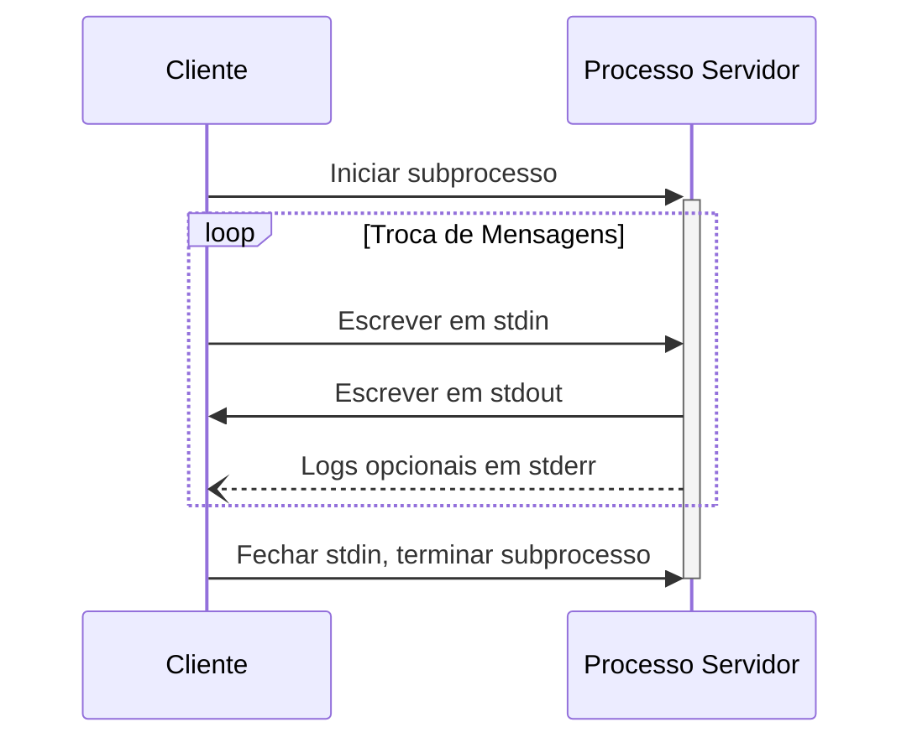

**Como funciona**:

- Cliente inicia o servidor MCP como um subprocesso
- Servidor recebe mensagens JSON-RPC em sua entrada padrão (stdin)
- Servidor escreve respostas em sua saída padrão (stdout)
- Mensagens são delimitadas por quebras de linha
- Servidor pode usar stderr para logs (sem afetar o protocolo)

**Vantagens**:

- Simplicidade de implementação
- Excelente para ferramentas locais
- Baixa sobrecarga

**Desvantagens**:

- Limitado a comunicação local
- Um cliente por servidor

### 2. Transporte HTTP Streamable

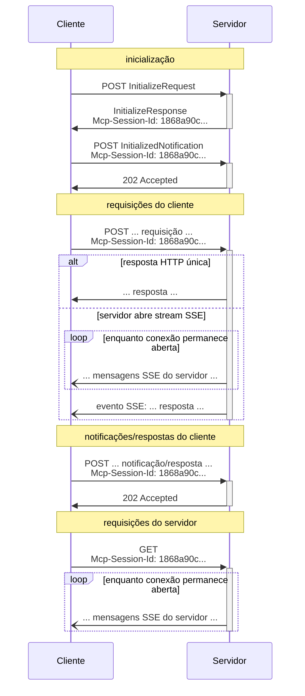

**Como funciona**:

- Servidor opera como processo independente que pode lidar com múltiplas conexões de clientes
- Utiliza requisições HTTP POST e GET
- Pode usar Server-Sent Events (SSE) para streaming
- Suporta gerenciamento de sessão com cabeçalho `Mcp-Session-Id`

**Vantagens**:

- Suporta comunicação remota
- Permite múltiplos clientes por servidor
- Oferece opções de streaming

**Desvantagens**:

- Implementação mais complexa
- Requer considerações adicionais de segurança

## Negociação De Capacidades

O MCP usa um sistema baseado em capacidades onde clientes e servidores declaram explicitamente recursos suportados durante a inicialização:

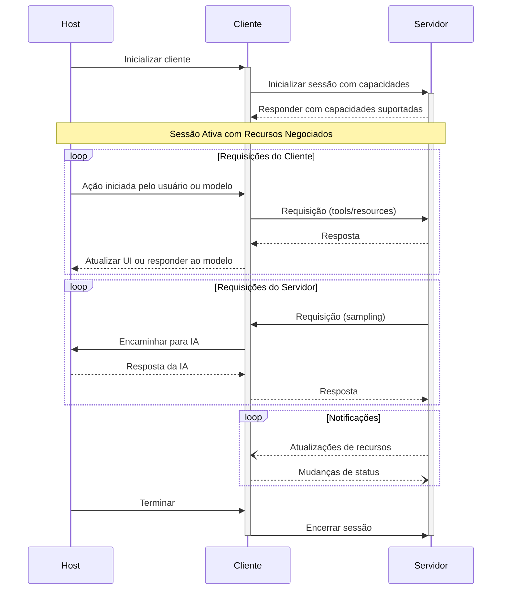

As capacidades principais incluem:

|Categoria|Capacidade|Descrição|
|---|---|---|
|Cliente|`roots`|Capacidade de fornecer diretórios raiz do sistema de arquivos|
|Cliente|`sampling`|Suporte para requisições de amostragem de LLM|
|Cliente|`experimental`|Descreve suporte para recursos experimentais não padrão|
|Servidor|`prompts`|Oferece templates de prompts|
|Servidor|`resources`|Fornece recursos legíveis|
|Servidor|`tools`|Expõe ferramentas que podem ser chamadas|
|Servidor|`logging`|Emite mensagens de log estruturadas|
|Servidor|`experimental`|Descreve suporte para recursos experimentais não padrão|

## Primitivas MCP: Uma Comparação Detalhada

|Primitiva|Controlado por|Natureza|Uso Principal|Exemplo de Implementação|Fluxo de Dados|
|---|---|---|---|---|---|
|Recursos|Aplicação|Dados estáticos ou dinâmicos|Fornecer contexto ao modelo|Conteúdo de arquivo, registros de BD, resultado de API|Servidor → Cliente → LLM|
|Ferramentas|Modelo de IA|Funções executáveis|Permitir ações e obter informações|Consulta SQL, chamada de API externa, cálculo|LLM → Cliente → Servidor → Fonte externa → Servidor → Cliente → LLM|
|Prompts|Usuário|Templates estruturados|Guiar interações padronizadas|Slash command, template de análise, fluxo de trabalho|Servidor → Cliente → Usuário → LLM|

### Recursos (Resources)

Os recursos no MCP são projetados para serem **controlados pela aplicação**, dando às aplicações host a flexibilidade de determinar como incorporar o contexto.

Um recurso inclui:

- **URI**: Identificador único para o recurso
- **Nome**: Nome legível por humanos
- **Descrição**: Descrição opcional
- **Tipo MIME**: Tipo de mídia opcional
- **Tamanho**: Tamanho opcional em bytes

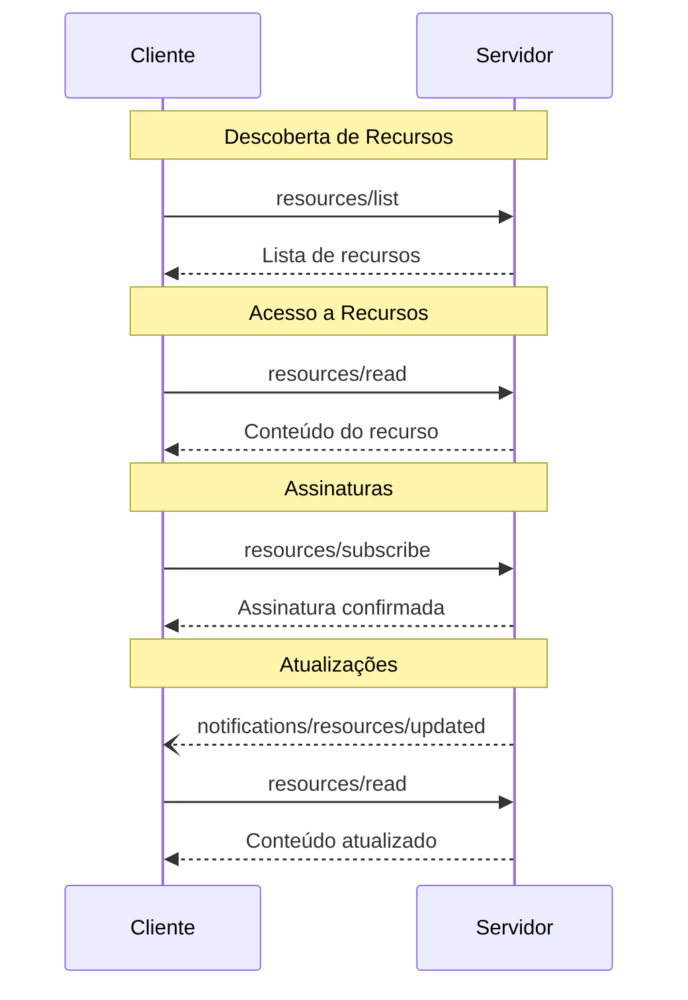

### Ferramentas (Tools)

As ferramentas no MCP são projetadas para serem **controladas pelo modelo**, permitindo que o LLM descubra e invoque ferramentas com base em seu entendimento contextual.

Uma definição de ferramenta inclui:

- **Nome**: Identificador único para a ferramenta
- **Descrição**: Descrição legível da funcionalidade
- **Esquema de entrada**: Esquema JSON definindo parâmetros esperados
- **Anotações**: Propriedades opcionais que descrevem o comportamento

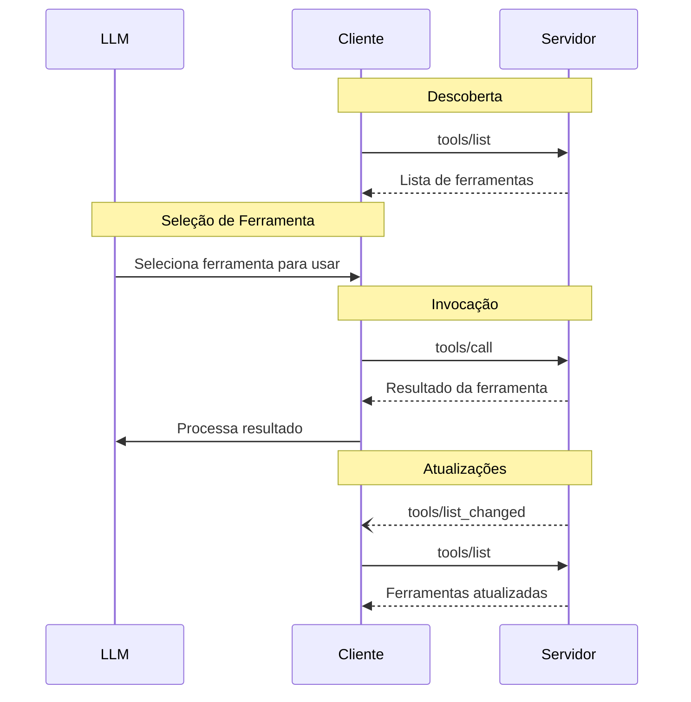

### Prompts

Os prompts no MCP são projetados para serem **controlados pelo usuário**, permitindo que os usuários selecionem explicitamente templates para uso.

Um prompt inclui:

- **Nome**: Identificador único para o prompt
- **Descrição**: Descrição opcional legível por humanos
- **Argumentos**: Lista opcional de argumentos para personalização

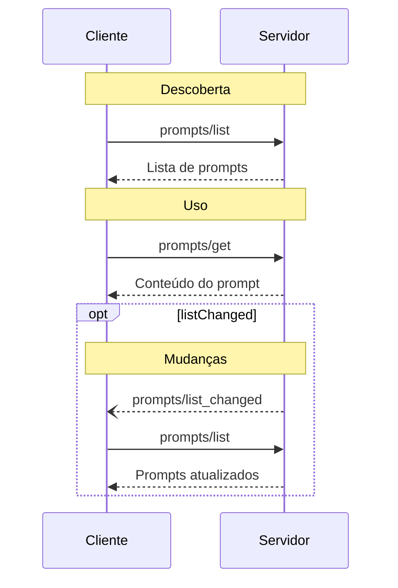

## Persistência E Gerenciamento De Estado

O MCP fornece mecanismos robustos para manutenção de estado:

### Sessão HTTP

Para servidores que desejam estabelecer sessões com estado:

1. Um servidor usando transporte HTTP Streamable pode atribuir um ID de sessão na inicialização
2. Este ID é incluído em um cabeçalho `Mcp-Session-Id` em todas as solicitações subsequentes
3. O servidor pode encerrar sessões a qualquer momento
4. Clientes que recebem código 404 precisam iniciar uma nova sessão

### Notificações E Assinaturas

O protocolo suporta:

- Notificações de mudança de lista para recursos, ferramentas e prompts
- Assinaturas para recursos individuais
- Atualizações baseadas em eventos

### Retomada De Stream

Para suportar a retomada de conexões quebradas:

- Servidores podem anexar IDs a seus eventos SSE
- Clientes podem retomar usando o cabeçalho `Last-Event-ID`
- Servidores podem reproduzir mensagens perdidas

## Segurança E Privacidade

O MCP foi projetado com considerações robustas de segurança:

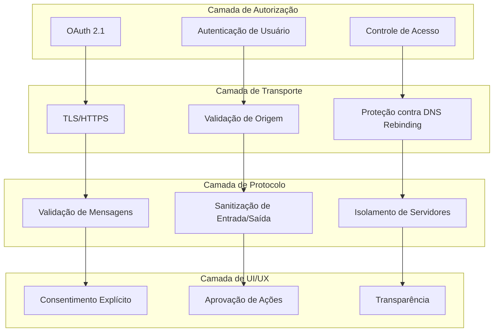

### Princípios-chave De Segurança

1. **Consentimento e Controle do Usuário**
    
    - Os usuários devem consentir explicitamente e entender todo o acesso a dados e operações
    - Os usuários devem manter controle sobre quais dados são compartilhados e quais ações são tomadas
2. **Privacidade de Dados**
    
    - Os hosts devem obter consentimento explícito do usuário antes de expor dados do usuário aos servidores
    - Os hosts não devem transmitir dados de recursos para outros lugares sem consentimento do usuário
3. **Segurança das Ferramentas**
    
    - As ferramentas representam execução de código arbitrária e devem ser tratadas com cautela
    - Os hosts devem obter consentimento explícito do usuário antes de invocar qualquer ferramenta
    - Os usuários devem entender o que cada ferramenta faz antes de autorizar seu uso
4. **Controles de Amostragem de LLM**
    
    - Os usuários devem aprovar explicitamente quaisquer solicitações de amostragem de LLM
    - Os usuários devem controlar se a amostragem ocorre, qual prompt será enviado e quais resultados o servidor pode ver

### Implementação De Segurança

Os implementadores DEVEM:

1. Construir fluxos robustos de consentimento e autorização
2. Documentar claramente as implicações de segurança
3. Implementar controles de acesso e proteções de dados apropriados
4. Seguir as melhores práticas de segurança em suas integrações
5. Considerar implicações de privacidade no design de recursos

## Exemplo De Fluxo De Execução De Ferramenta

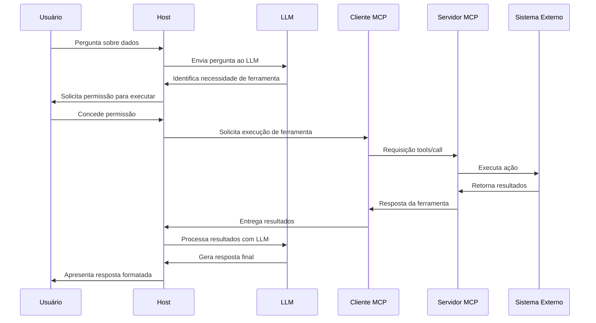

## Implementação E Desenvolvimento

Para implementar o MCP, desenvolvedores podem utilizar:

### SDKs Oficiais

- **TypeScript**: [typescript-sdk](https://github.com/modelcontextprotocol/typescript-sdk)
- **Python**: [python-sdk](https://github.com/modelcontextprotocol/python-sdk)
- **Java**: [java-sdk](https://github.com/modelcontextprotocol/java-sdk)
- **Kotlin**: [kotlin-sdk](https://github.com/modelcontextprotocol/kotlin-sdk)
- **C#**: [csharp-sdk](https://github.com/modelcontextprotocol/csharp-sdk)

### Ferramentas De Desenvolvimento

- **MCP Inspector**: Ferramenta interativa para testar e depurar servidores MCP
- **Código de Referência**: Implementações de exemplo disponíveis para casos de uso comuns

## Conclusão

O Model Context Protocol representa uma evolução significativa na forma como aplicações AI se integram com dados e ferramentas externas. Ao fornecer um padrão aberto, seguro e flexível, o MCP permite:

1. **Para usuários finais**: Aplicações AI que podem acessar e compreender dados pessoais e de trabalho, tornando-as mais úteis e contextuais.
    
2. **Para desenvolvedores**: Redução significativa no tempo e esforço necessários para criar aplicações AI com integração rica de dados, permitindo foco em experiências excelentes em vez de construção repetitiva de conectores.
    
3. **Para o ecossistema**: Um conjunto crescente de servidores MCP reutilizáveis que podem ser compartilhados entre aplicações, criando uma infraestrutura comum para IA contextual.
    

O MCP continua a evoluir com contribuições da comunidade, expandindo suas capacidades e aprimorando seu ecossistema de implementações.

---

Para mais informações, visite a [documentação oficial](https://modelcontextprotocol.io/) ou explore os [repositórios de código no GitHub](https://github.com/modelcontextprotocol).