# MCP - Overview

> 💡 O Model Context Protocol (MCP) é o "adaptador universal" do mundo da IA. Ele permite que modelos de linguagem se conectem facilmente com dados e ferramentas externas, transformando IAs isoladas em assistentes verdadeiramente contextuais e capazes.

---

## Sumário

1. [O Desafio das IAs Isoladas](#o-desafio-das-ias-isoladas)
2. [O Problema da Fragmentação](#o-problema-da-fragmentação)
3. [O MCP Como Solução Universal](#o-mcp-como-solução-universal)
4. [Arquitetura MCP: Como Tudo se Conecta](#arquitetura-mcp-como-tudo-se-conecta)
5. [Conceitos Fundamentais](#conceitos-fundamentais)

- [Roots: Territórios de Acesso](#roots-territórios-de-acesso)
- [Resources: A Biblioteca de Conhecimento](#resources-a-biblioteca-de-conhecimento)
- [Prompts: As Receitas Prontas](#prompts-as-receitas-prontas)
- [Tools: A Caixa de Ferramentas](#tools-a-caixa-de-ferramentas)
- [Sampling: Consultando o Oráculo](#sampling-consultando-o-oráculo)

6. [Como o MCP Funciona Por Baixo dos Panos](#como-o-mcp-funciona-por-baixo-dos-panos)
7. [A Evolução das IAs com MCP](#a-evolução-das-ias-com-mcp)
8. [MCP em Ação: Aplicações em Diversos Setores](#mcp-em-ação-aplicações-em-diversos-setores)
9. [O Futuro do MCP](#o-futuro-do-mcp)
10. [Recursos para Aprofundamento](#recursos-para-aprofundamento)

  

---

## O Desafio Das IAs Isoladas

Imagine um consultor brilhante trancado em uma sala isolada, sem acesso aos sistemas, dados ou documentos da sua empresa. Não importa quão inteligente seja, suas recomendações serão limitadas porque ele não pode ver as informações essenciais para o contexto.

É exatamente assim que funcionam os modelos de linguagem (LLMs) quando não têm acesso contextual aos seus sistemas. Como a Anthropic destacou ao lançar o MCP:

> "Mesmo os modelos mais sofisticados são constrangidos por seu isolamento dos dados—presos atrás de silos de informação e sistemas legados."

**O Desafio Atual:** Nas organizações modernas, essa limitação é especialmente problemática. Os LLMs poderiam revolucionar inúmeros processos, mas como conectá-los com:

- Sistemas legados desenvolvidos décadas atrás?
- Bancos de dados corporativos com informações críticas?
- Documentos internos que mudam constantemente?
- Ferramentas e aplicações específicas da empresa?

  

Este é o problema fundamental que o Model Context Protocol foi criado para resolver.

## O Problema Da Fragmentação

**A Torre de Babel Digital**

Antes do MCP, conectar LLMs a sistemas externos era uma tarefa árdua e fragmentada. Cada aplicação de IA precisava construir suas próprias conexões para cada sistema:

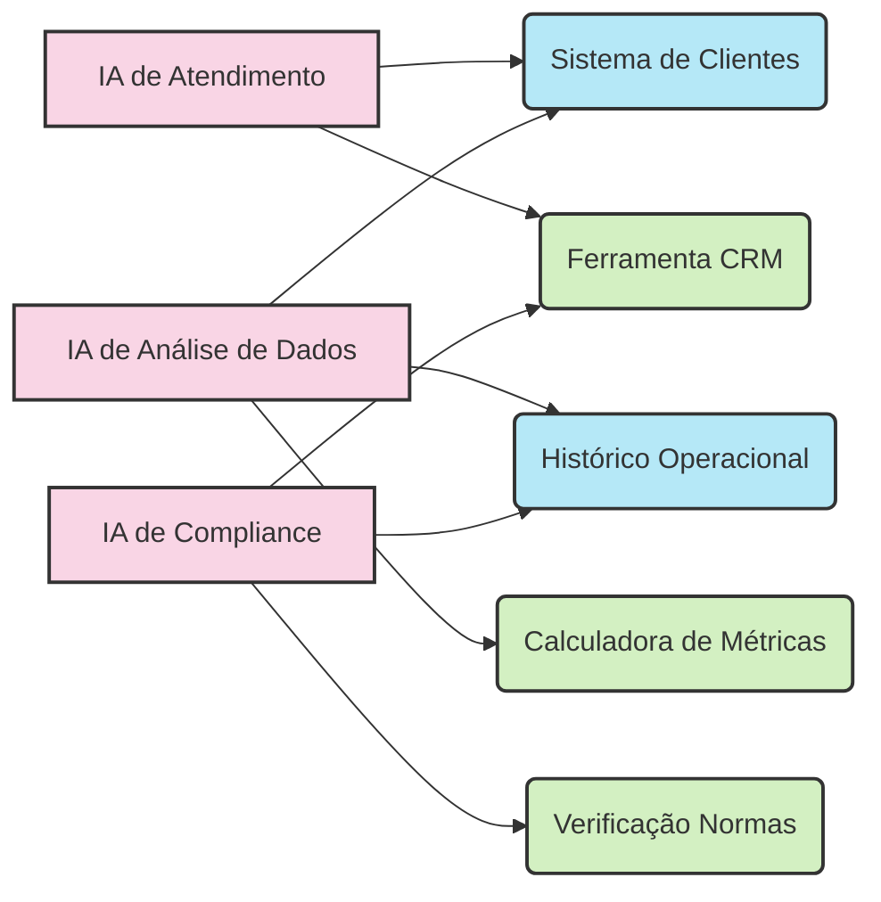

Este modelo causava vários problemas críticos:

- **Duplicação de esforços:** A mesma conexão era recriada múltiplas vezes
- **Inconsistência:** Diferentes padrões para cada integração
- **Custos elevados:** Mudanças em um sistema exigiam atualizações em todas as integrações
- **Desenvolvimento lento:** Meses para construir cada conexão
- **Segurança comprometida:** Cada integração com sua própria implementação de segurança
- **Dependência de fornecedor:** Difícil migrar entre diferentes modelos de IA

  

Para as organizações, isso significava projetos de IA caros, lentos e difíceis de manter.

## O MCP Como Solução Universal

O Model Context Protocol transforma esta realidade ao criar uma interface padronizada entre as IAs e os sistemas externos. É como um "tradutor universal" que permite que qualquer IA se comunique facilmente com qualquer sistema.

**A Nova Arquitetura com MCP:**

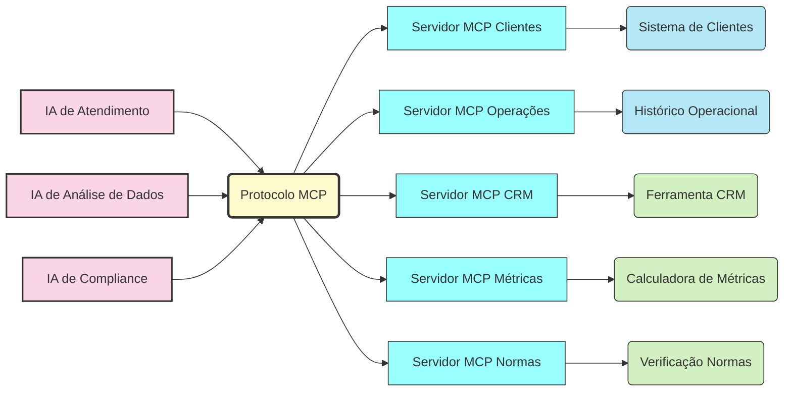

**Benefícios Transformadores:**

- **Unificação:** Todas as aplicações de IA falam a mesma língua
- **Reutilização:** Um servidor MCP serve a múltiplas aplicações
- **Modularidade:** Adicionar uma nova fonte de dados significa apenas criar mais um servidor MCP
- **Interoperabilidade:** Fácil troca entre diferentes LLMs (Claude, GPT, etc.)
- **Segurança padronizada:** Um modelo de segurança único e auditável
- **Documentação automática:** Autodocumentação via especificações do protocolo

  

O MCP é para a IA o que os padrões USB são para dispositivos eletrônicos: um conector universal que permite a interconexão entre diferentes sistemas.

## Arquitetura MCP: Como Tudo Se Conecta

O MCP se baseia em uma arquitetura cliente-servidor elegante e flexível:

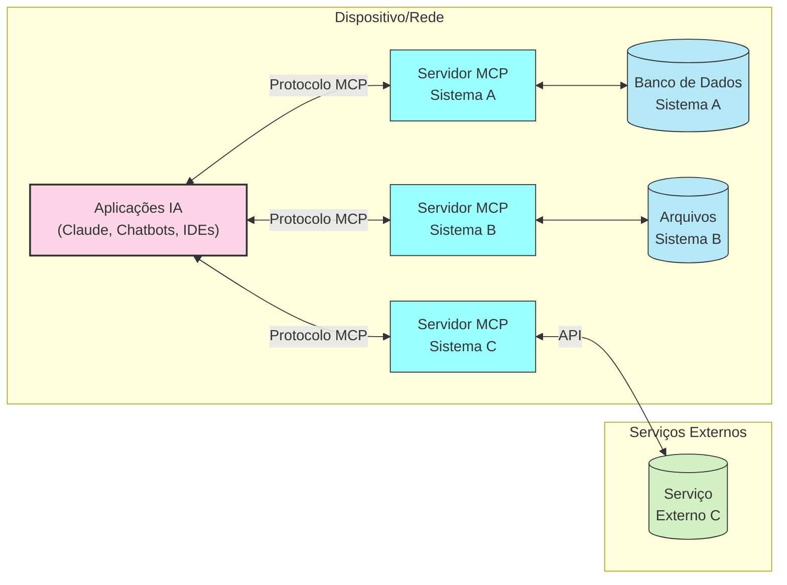

### Os Três Pilares Do MCP

1. **MCP Hosts (Clientes):**

- As aplicações que incorporam LLMs e precisam de acesso a dados/ferramentas
- Exemplos: Claude Desktop, plugins de IDE, chatbots corporativos
- Função: Coordenar a comunicação entre os LLMs e os servidores MCP

2. **MCP Servers (Servidores):**

- Componentes que fornecem acesso a sistemas específicos
- Cada servidor é especializado em um sistema ou fonte de dados
- Operam independentemente, podendo ser locais ou remotos
- Exemplos: Um servidor para dados de clientes, outro para documentação técnica

3. **O Protocolo MCP:**

- A "língua comum" falada entre hosts e servidores
- Define formatos de mensagens padronizados
- Estabelece regras claras de comunicação
- Garante segurança e controle de acesso

  

### Como Funciona Na Prática

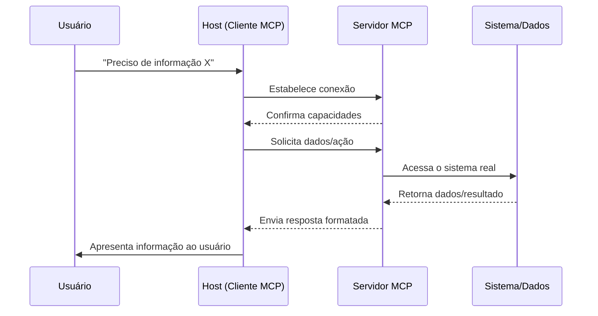

Este fluxo é semelhante a um intérprete que facilita uma conversa entre pessoas que falam idiomas diferentes: o protocolo traduz as necessidades do LLM para os sistemas externos e vice-versa.

## Conceitos Fundamentais

### Roots: Territórios De Acesso

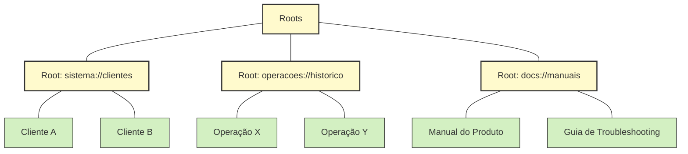

**O que são:** Roots (raízes) são como os territórios ou zonas que delimitam onde um servidor MCP pode operar. São o equivalente a crachás de segurança que controlam o acesso a diferentes áreas de um prédio.

**Analogia:** Se o MCP fosse um sistema de arquivos, os Roots seriam as pastas principais. Se fosse um shopping, seriam as diferentes lojas e áreas.

**Função na prática:**

- **Segurança:** Limitam o escopo de atuação de cada servidor
- **Organização:** Agrupam recursos relacionados
- **Controle:** Permitem gerenciar permissões de forma granular

  

Um servidor MCP para recursos humanos, por exemplo, poderia ter acesso ao root `rh://políticas` mas não ao root `financeiro://orçamentos`.

### Resources: A Biblioteca De Conhecimento

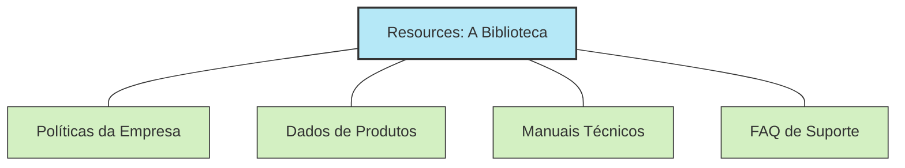

**O que são:** Resources são as "fontes de conhecimento" que o LLM pode consultar. São os documentos, dados ou conteúdos que o servidor MCP disponibiliza para o LLM.

**Analogia:** Pense nos Resources como livros em uma biblioteca ou artigos em uma enciclopédia. O LLM pode solicitá-los, lê-los e usar as informações para responder perguntas ou tomar decisões.

**Função na prática:**

- **Contextualização:** Fornecem informações atualizadas e específicas
- **Conhecimento:** Permitem que o LLM acesse dados que não estão em seu treinamento
- **Precisão:** Garantem respostas baseadas em informações oficiais e atuais

  

Por exemplo, um LLM conectado via MCP poderia acessar o resource `empresa://produtos/catalogo-atual` para fornecer informações precisas sobre os produtos disponíveis no momento.

### Prompts: As Receitas Prontas

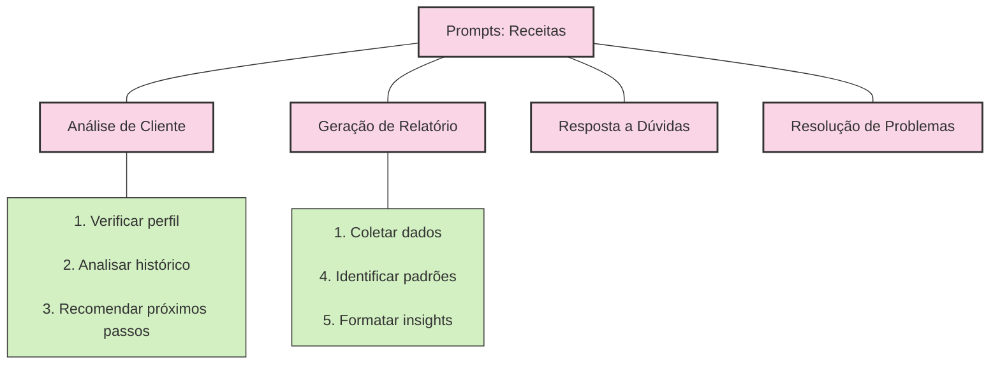

**O que são:** Prompts são instruções padronizadas que guiam o LLM em tarefas específicas. São como receitas ou templates para interações comuns.

**Analogia:** Se o LLM fosse um chef, os Prompts seriam receitas testadas e aprovadas. Garantem que cada "prato" (resposta) siga um padrão consistente e inclua todos os ingredientes necessários.

**Função na prática:**

- **Padronização:** Garantem consistência nas interações repetitivas
- **Completude:** Asseguram que todas as etapas de um processo sejam seguidas
- **Eficiência:** Eliminam a necessidade de reinventar instruções comuns

  

Empresas podem criar prompts específicos como "Análise de Cliente" ou "Diagnóstico de Problema" que seguem seus procedimentos internos.

### Tools: A Caixa De Ferramentas

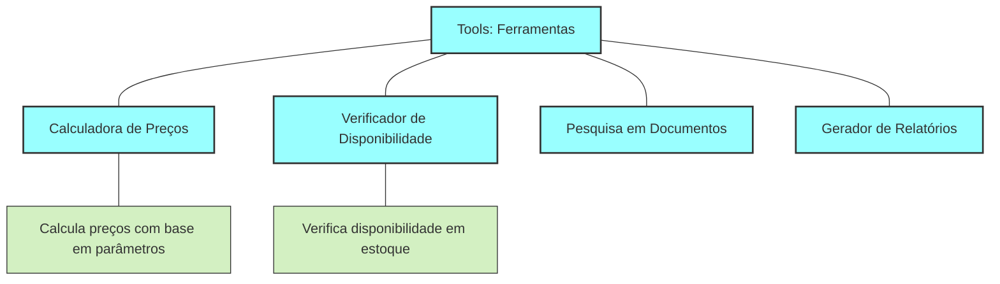

**O que são:** Tools são funções ou capacidades que o LLM pode invocar para realizar ações no mundo real. São como botões ou controles que permitem que a IA faça algo além de gerar texto.

**Analogia:** Se o LLM fosse um piloto em um cockpit, as Tools seriam os diversos controles e botões que permitem operar a aeronave.

**Função na prática:**

- **Ação:** Permitem que o LLM execute operações em sistemas externos
- **Automação:** Habilitam tarefas que antes exigiam intervenção humana
- **Integração:** Conectam o LLM a funcionalidades de sistemas existentes

  

Uma Tool pode permitir que o LLM consulte um banco de dados, agende uma reunião, reserve um produto ou calcule métricas complexas.

### Sampling: Consultando O Oráculo

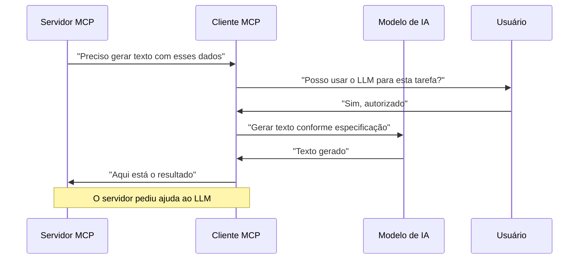

**O que é:** Sampling é quando um servidor MCP precisa da inteligência do LLM para gerar conteúdo. É um fluxo inverso onde o servidor pede ao cliente LLM para resolver um problema.

**Analogia:** Imagine um assistente (servidor) que, ao se deparar com uma tarefa criativa, pede ajuda a um especialista (LLM) via o gerente (cliente MCP).

**Função na prática:**

- **Geração de conteúdo:** Permite que servidores utilizem o poder dos LLMs
- **Controle:** Mantém o usuário no comando, podendo aprovar ou rejeitar
- **Flexibilidade:** Possibilita criar conteúdo dinâmico sem reescrever servidores

  

Um exemplo seria um servidor MCP de gestão de documentos que solicita ao LLM para gerar um resumo de um relatório extenso.

## Como O MCP Funciona Por Baixo Dos Panos

O MCP pode parecer mágica, mas é construído sobre fundamentos técnicos sólidos. Para entender como ele funciona, vamos explorar sua estrutura interna:

### Camadas Do Protocolo

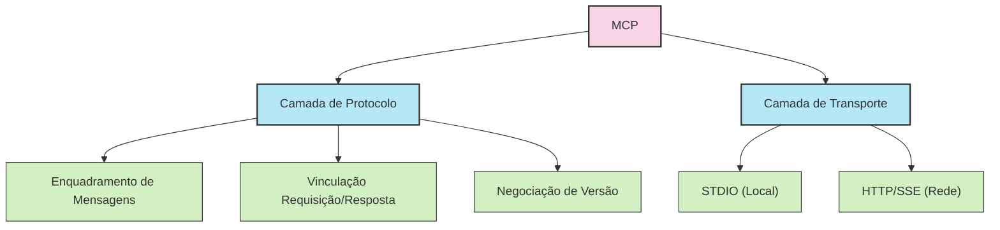

O MCP divide sua operação em duas camadas principais:

1. **Camada de Protocolo:** Define o formato e estrutura das mensagens

- Baseada em JSON-RPC 2.0
- Mensagens estruturadas e tipadas
- Sistema de requisição-resposta

2. **Camada de Transporte:** Define como as mensagens são transmitidas

- STDIO para comunicação local (mesmo dispositivo)
- HTTP com Server-Sent Events para comunicação em rede
- WebSockets para comunicação bidirecional em tempo real

  

### Tipos De Mensagens

O MCP utiliza três tipos principais de mensagens:

1. **Requests (Pedidos):** Solicitações de ação ou informação

- Incluem um ID para rastreamento
- Especificam o método desejado
- Contêm parâmetros necessários

2. **Results (Resultados):** Respostas às solicitações

- Referência ao ID da solicitação original
- Dados resultantes da operação
- Formato estruturado para fácil processamento

3. **Notifications (Notificações):** Mensagens unidirecionais

- Não esperam resposta
- Úteis para atualizações de progresso
- Eventos assíncronos

  

### Ciclo De Vida De Uma Conexão MCP

Todo servidor MCP passa por um ciclo de vida predefinido:

1. **Inicialização:**

- Cliente e servidor negociam capacidades
- Estabelecem versão do protocolo compatível
- Definem limites de segurança

2. **Operação:**

- Troca de mensagens de requisição e resposta
- Notificações para eventos assíncronos
- Monitoramento de saúde da conexão

3. **Encerramento:**

- Desligamento controlado
- Liberação de recursos
- Logging de auditoria final

  

Este framework técnico fornece a base sólida que permite ao MCP ser ao mesmo tempo flexível e confiável.

## A Evolução Das IAs Com MCP

O MCP representa uma evolução fundamental na forma como construímos e utilizamos inteligências artificiais. Esta evolução pode ser compreendida em duas fases principais:

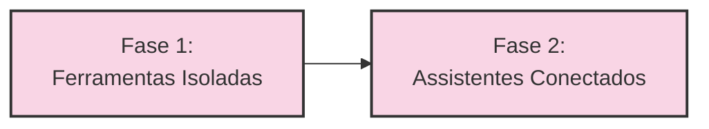

### Fase 1: Ferramentas Isoladas

**Características:**

- IAs limitadas ao que "sabem" de seu treinamento
- Sem acesso a dados externos ou atualizados
- Capacidades definidas no momento do desenvolvimento
- Respostas genéricas baseadas em padrões

  

**Limitações:**

- Não conseguem acessar dados específicos da empresa
- Informações desatualizadas
- Incapacidade de executar ações em sistemas

  

### Fase 2: Assistentes Conectados (MCP)

**Características:**

- IAs com acesso a dados e sistemas externos via MCP
- Capacidade de buscar informações atualizadas
- Habilidade para executar ações em sistemas existentes
- Contextualização baseada em dados reais

  

**Avanços:**

- Respostas precisas e atualizadas
- Integração com sistemas empresariais
- Automação de tarefas simples e repetitivas

  

Esta evolução representa uma mudança fundamental: de IAs isoladas para assistentes verdadeiramente conectados e contextuais.

## MCP Em Ação: Aplicações Em Diversos Setores

O Model Context Protocol está transformando como as organizações de diversos setores utilizam IA. Vamos explorar aplicações concretas em diferentes indústrias:

### Setor Financeiro

**Assistente de Análise de Crédito**

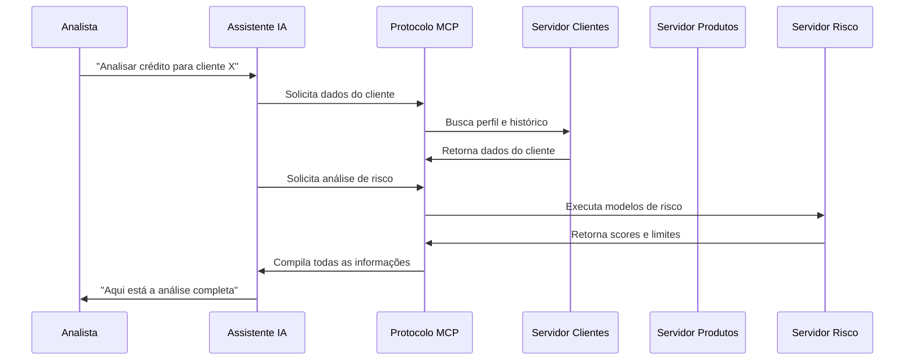

**Benefícios:**

- Análise 10x mais rápida que processos manuais
- Consistência na aplicação de políticas de crédito
- Documentação automática para compliance
- Capacidade de explicar decisões (explainability)

  

### Saúde E Ciências Da Vida

**Assistente de Diagnóstico Médico**

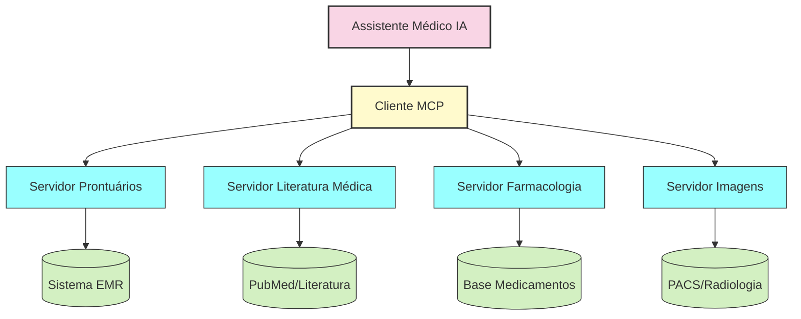

**Benefícios:**

- Assistência em tempo real durante consultas
- Acesso a literatura médica atualizada
- Análise de histórico completo do paciente
- Sugestões baseadas em diretrizes atuais

  

### Varejo E E-commerce

**Assistente de Atendimento ao Cliente**

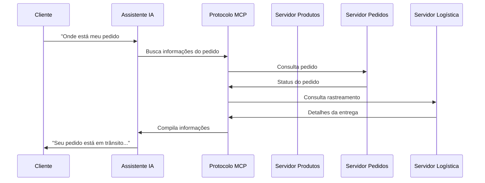

**Benefícios:**

- Respostas personalizadas com dados atuais
- Resolução autônoma de consultas comuns
- Capacidade de criar/modificar pedidos
- Experiência consistente entre canais

  

### Manufatura E Indústria

**Assistente de Manutenção Preditiva**

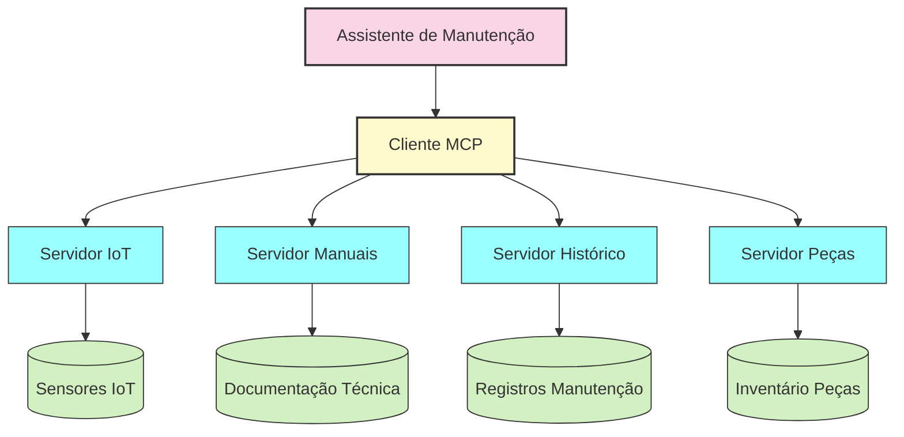

**Benefícios:**

- Monitoramento em tempo real de equipamentos
- Acesso a manuais técnicos e procedimentos
- Previsão de falhas antes que ocorram
- Otimização de estoque de peças de reposição

  

### Desenvolvimento De Software

**Copiloto de Desenvolvimento**

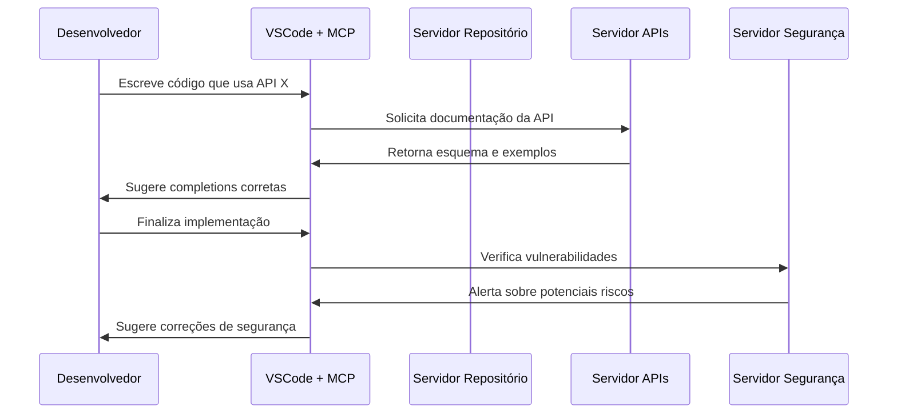

**Benefícios:**

- Sugestões contextualmente relevantes
- Acesso à documentação atualizada
- Verificações de segurança em tempo real
- Onboarding acelerado para novos desenvolvedores

  

Estas aplicações demonstram como o MCP pode transformar diversos setores, tornando os sistemas de IA mais úteis, precisos e integrados aos fluxos de trabalho existentes.

## O Futuro Do MCP

O Model Context Protocol está em constante evolução, com várias tendências promissoras no horizonte:

### 1. Federação E Descoberta De Servidores

Em breve, veremos mecanismos para descoberta automática de servidores MCP, permitindo:

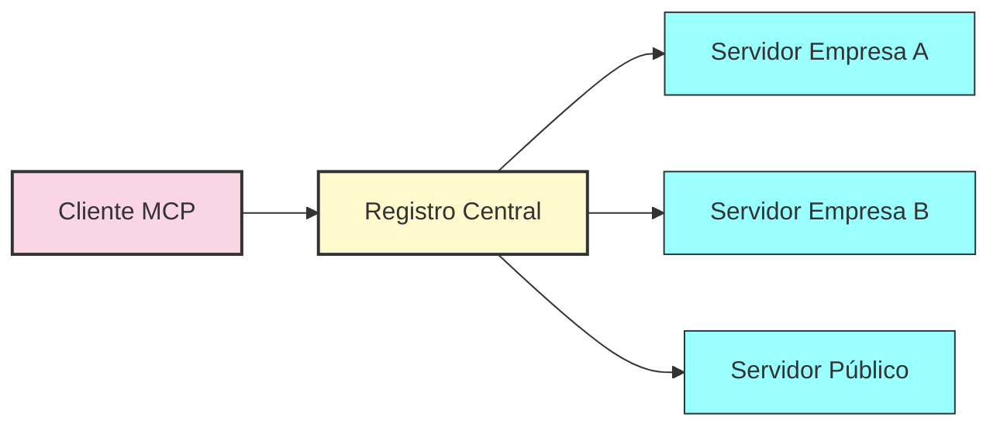

- Registros centralizados de servidores MCP disponíveis
- Descoberta dinâmica de capacidades e serviços
- Federação entre organizações diferentes
- Marketplaces de servidores especializados

  

### 2. Modelos Especializados

O futuro do MCP aponta para uma melhor utilização de diferentes tipos de modelos:

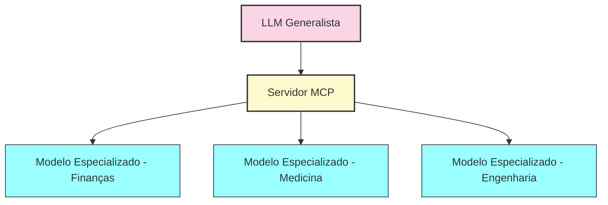

- Modelos menores e especializados para domínios específicos
- Redução de custos computacionais
- Aumento de precisão em áreas especializadas
- Integração com sistemas corporativos existentes

  

### 3. Segurança E Conformidade Avançadas

O MCP está evoluindo para atender requisitos avançados de segurança:

- Esquemas de autenticação específicos para setores regulados
- Padrões de criptografia avançados para dados sensíveis
- Mecanismos de auditoria robustos
- Controles granulares baseados em políticas (Policy-as-Code)

  

Estas tendências demonstram como o MCP está se tornando a base de uma nova geração de sistemas de IA corporativos, especialmente em setores onde segurança, auditabilidade e expertise especializada são críticas.

## Recursos Para Aprofundamento

### Fontes Oficiais

- **Documentação Oficial:** [modelcontextprotocol.io](https://modelcontextprotocol.io/)
- **Repositório GitHub:** [github.com/modelcontextprotocol](https://github.com/modelcontextprotocol)
- **Anúncio da Anthropic:** [anthropic.com/news/model-context-protocol](https://www.anthropic.com/news/model-context-protocol)
- **Especificação Técnica:** [spec.modelcontextprotocol.io](https://spec.modelcontextprotocol.io/)

  

### SDKs Disponíveis

- **Java SDK:** Suporte completo para cliente e servidor, integrações com Spring
- **TypeScript SDK:** Implementações Web e Node.js, suporte a CLI
- **Python SDK:** API assíncrona moderna, decoradores para definição de servidores
- **C# SDK:** Integração.NET, colaboração com Microsoft

  

### Comunidade E Suporte

- **Fórum de Desenvolvedores:** [forum.modelcontextprotocol.io](https://forum.modelcontextprotocol.io/)
- **Canal Discord:** [discord.gg/mcp](https://discord.gg/mcp)
- **Repositório de Exemplos:** [github.com/modelcontextprotocol/examples](https://github.com/modelcontextprotocol/examples)

  

---

> 💼 **Documento preparado como material didático**

>> Versão 1.0 - Junho 2024