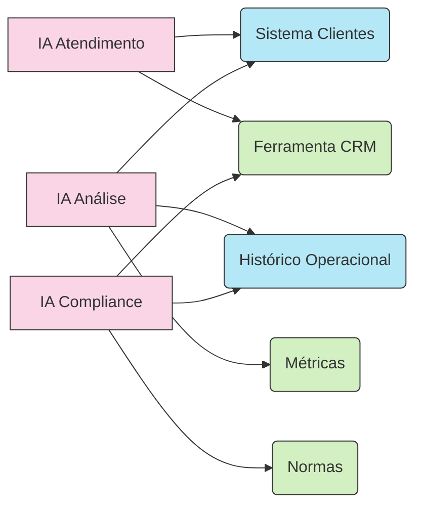
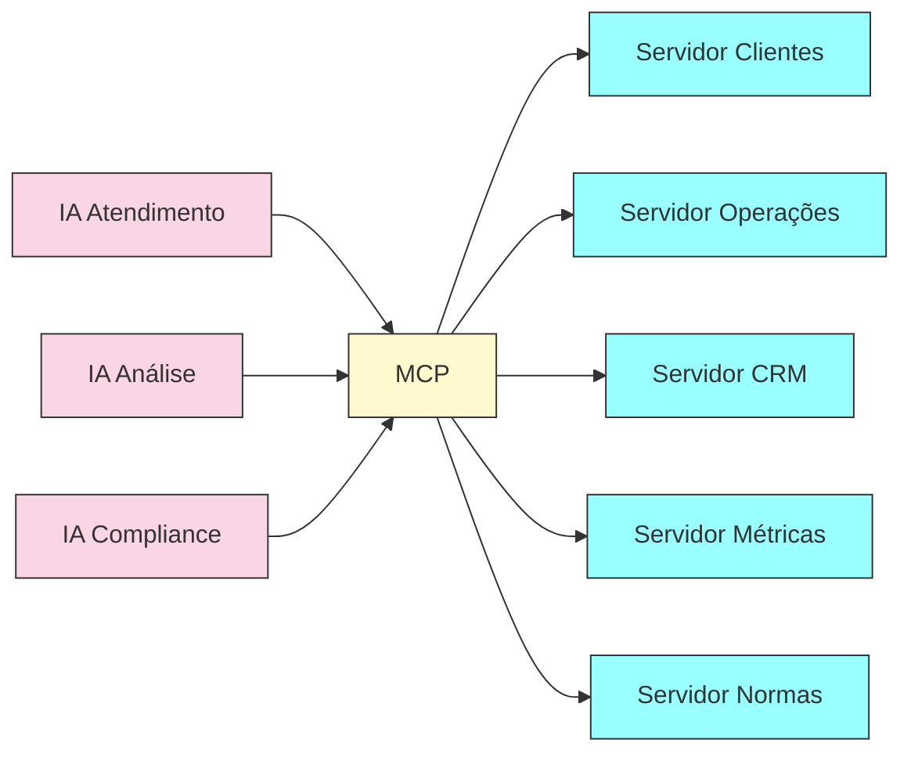
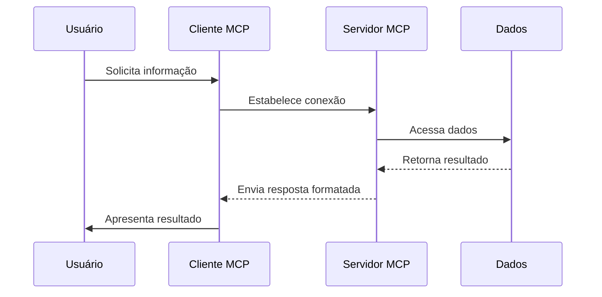
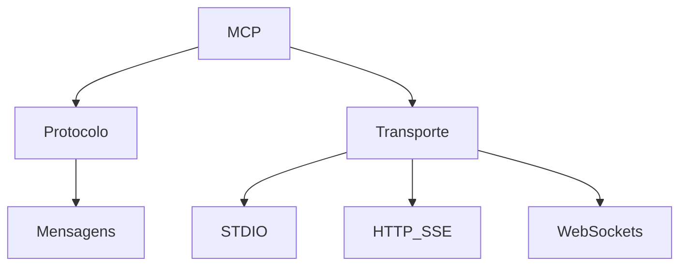
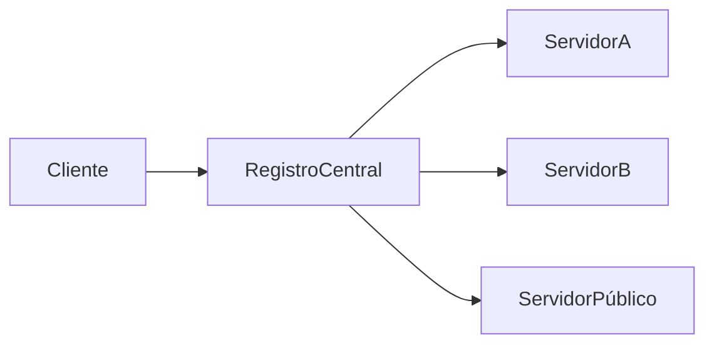

# 🌐 MCP - Model Context Protocol

## 🚀 Transformando a Integração De IAs Com O Mundo Real

O **Model Context Protocol (MCP)** é o adaptador universal para inteligências artificiais. Permite conectar facilmente modelos de linguagem (LLMs) com dados e ferramentas externas, transformando IAs isoladas em assistentes contextuais e eficientes.

---

## 📖 Sumário

1. [O Desafio das IAs Isoladas](https://chatgpt.com/c/6807b5ad-85e4-8003-ba1b-2406131470db#o-desafio-das-ias-isoladas)
    
2. [Problema da Fragmentação](https://chatgpt.com/c/6807b5ad-85e4-8003-ba1b-2406131470db#problema-da-fragmenta%C3%A7%C3%A3o)
    
3. [MCP como Solução Universal](https://chatgpt.com/c/6807b5ad-85e4-8003-ba1b-2406131470db#mcp-como-solu%C3%A7%C3%A3o-universal)
    
4. [Arquitetura MCP](https://chatgpt.com/c/6807b5ad-85e4-8003-ba1b-2406131470db#arquitetura-mcp)
    
5. [Conceitos Fundamentais](https://chatgpt.com/c/6807b5ad-85e4-8003-ba1b-2406131470db#conceitos-fundamentais)
    
6. [Funcionamento Interno do MCP](https://chatgpt.com/c/6807b5ad-85e4-8003-ba1b-2406131470db#funcionamento-interno-do-mcp)
    
7. [Aplicações do MCP em Diversos Setores](https://chatgpt.com/c/6807b5ad-85e4-8003-ba1b-2406131470db#aplica%C3%A7%C3%B5es-do-mcp-em-diversos-setores)
    
8. [Futuro do MCP](https://chatgpt.com/c/6807b5ad-85e4-8003-ba1b-2406131470db#futuro-do-mcp)
    
9. [Recursos para Aprofundamento](https://chatgpt.com/c/6807b5ad-85e4-8003-ba1b-2406131470db#recursos-para-aprofundamento)
    

---

## 🔒 O Desafio Das IAs Isoladas

Imagine um consultor brilhante trancado em uma sala isolada, sem acesso aos sistemas da empresa. Por mais inteligente que seja, suas recomendações são limitadas. Assim são os LLMs isolados, incapazes de acessar dados corporativos essenciais.

**Consequências:**

- Informações desatualizadas
    
- Falta de contexto específico
    
- Limitações operacionais
    

O MCP resolve justamente esses problemas, conectando inteligências artificiais ao contexto real das empresas.

---

## 🔗 Problema Da Fragmentação

Sem MCP, cada IA precisa criar integrações individuais, resultando em:

- 🚨 **Duplicação** de esforços
    
- ❌ **Inconsistência** nas integrações
    
- 💸 **Custos elevados** com manutenção
    
- 🐢 **Lentidão** no desenvolvimento
    
- 🔓 **Riscos de segurança**
    

---

## 🌟 MCP Como Solução Universal

O MCP é como um tradutor universal, simplificando a comunicação entre modelos de IA e sistemas externos:

- 📌 **Unificação**: Todos falam a mesma língua
    
- 🔄 **Reutilização**: Um servidor MCP atende múltiplas aplicações
    
- 🔧 **Modularidade**: Fácil adição de novas fontes de dados
    
- 🌍 **Interoperabilidade**: Compatível com diversos modelos (Claude, GPT)
    
- 🔐 **Segurança Padronizada**
    
- 📚 **Documentação Automática**
    

---

## 🛠️ Arquitetura MCP

---

## 📌 Conceitos Fundamentais

- 🌱 **Roots**: Zonas de acesso (segurança)
    
- 📖 **Resources**: Fontes de conhecimento (dados, documentos)
    
- 📜 **Prompts**: Templates para consistência
    
- 🔨 **Tools**: Funções de interação com sistemas externos
    
- 🧞‍♂️ **Sampling**: Uso criativo do LLM pelo servidor MCP
    

---

## ⚙️ Funcionamento Interno Do MCP

---

## 💼 Aplicações Do MCP

- **Financeiro**: Análise de crédito automatizada
    
- **Saúde**: Diagnóstico médico assistido
    
- **Varejo**: Atendimento ao cliente integrado
    
- **Indústria**: Manutenção preditiva
    
- **Software**: Copiloto de código seguro
    

---

## 🚀 Futuro Do MCP

- **Federação e Descoberta**: Registro dinâmico de servidores
    
- **Inteligência Distribuída**: Especialização de modelos
    
- **Segurança Avançada**: Controles rigorosos
    

---

## 📚 Recursos Para Aprofundamento

- [Documentação Oficial](https://modelcontextprotocol.io/)
    
- [GitHub](https://github.com/modelcontextprotocol)
    
- [Especificação Técnica](https://spec.modelcontextprotocol.io/)
    
- [Fórum Desenvolvedores](https://forum.modelcontextprotocol.io/)
    
- [Discord](https://discord.gg/mcp)
    
- [Exemplos GitHub](https://github.com/modelcontextprotocol/examples)
    

---

💡 **Material didático para Obsidian**

_Versão 1.2 - Abril 2025_