# MCP - Model Context Protocol

## O adaptador universal para IAs

  

---

  

# O que é o MCP?

  

> 💡 O Model Context Protocol (MCP) é o "adaptador universal" do mundo da IA. Ele permite que modelos de linguagem se conectem facilmente com dados e ferramentas externas, transformando IAs isoladas em assistentes verdadeiramente contextuais e capazes.

  

---

  

# O Desafio das IAs Isoladas

  

  

- LLMs não têm acesso nativo aos seus sistemas

- Sem acesso a dados específicos e atualizados

- Respostas genéricas e potencialmente desatualizadas

- Incapacidade de realizar ações em sistemas externos

  

---

  

# A Torre de Babel Digital

  

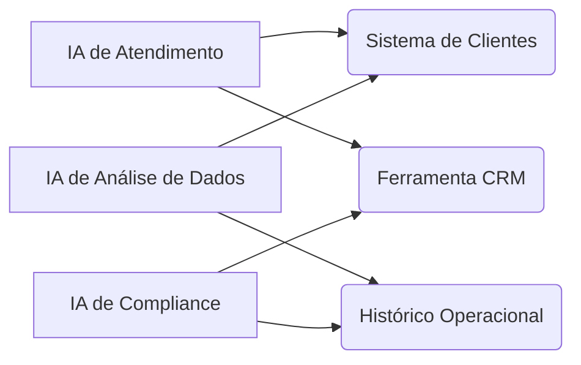

  

- **Duplicação de esforços:** A mesma conexão recriada múltiplas vezes

- **Inconsistência:** Diferentes padrões para cada integração

- **Custos elevados:** Mudanças em um sistema exigem múltiplas atualizações

  

---

  

# MCP Como Solução Universal

  

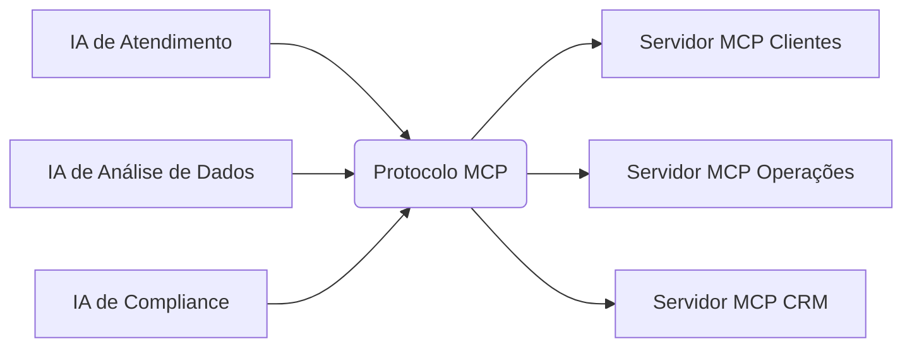

  

- Todas as IAs falam a mesma "língua"

- Reutilização de servidores entre aplicações

- Interoperabilidade entre diferentes LLMs

  

---

  

# Analogia USB

  

  

O MCP é para a IA o que os padrões USB são para dispositivos eletrônicos:

- **Um conector universal**

- **Elimina adaptadores específicos**

- **Simplifica integrações**

- **Padroniza comunicações**

  

---

  

# Arquitetura MCP: Cliente-Servidor

  

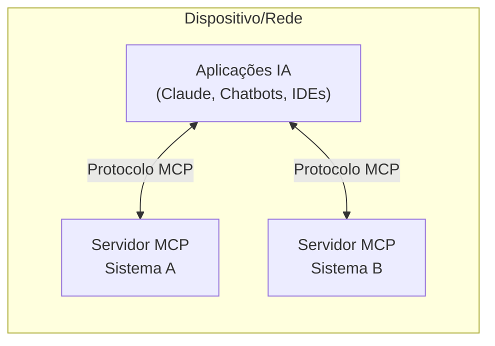

  

---

  

# Os Três Pilares do MCP

  

1. **MCP Hosts (Clientes):**

- Aplicações que incorporam LLMs (Claude, chatbots, IDEs)

- Coordenam comunicação entre LLMs e servidores

  

2. **MCP Servers (Servidores):**

- Fornecem acesso a sistemas específicos

- Cada servidor é especializado em um sistema/fonte

  

3. **O Protocolo MCP:**

- A "língua comum" entre hosts e servidores

- Define formato de mensagens padronizado

  

---

  

# Como Funciona na Prática

  

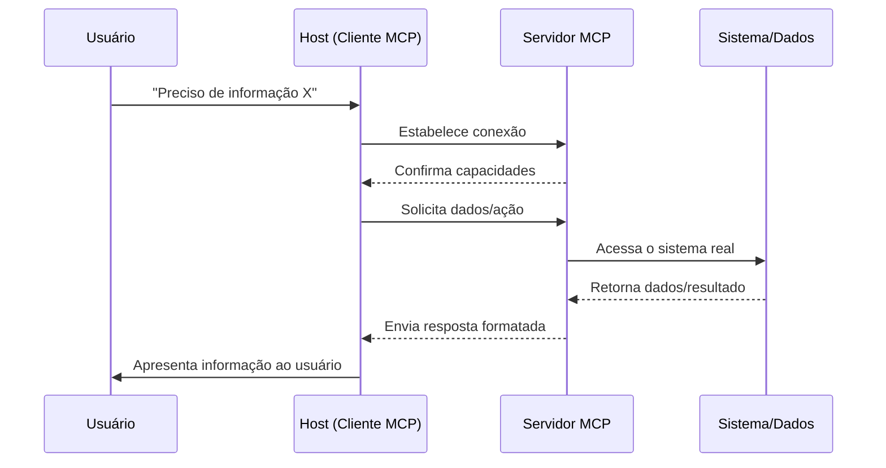

  

---

  

# Conceitos Fundamentais: Roots

  

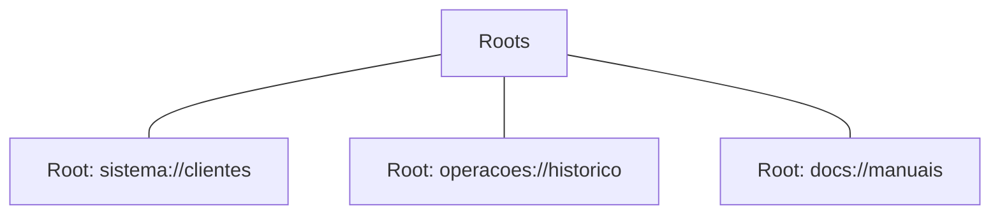

  

- **Territórios de acesso** que delimitam onde um servidor pode operar

- Funcionam como "crachás de segurança" para diferentes áreas

- Permitem controle granular de permissões

  

---

  

# Conceitos Fundamentais: Resources

  

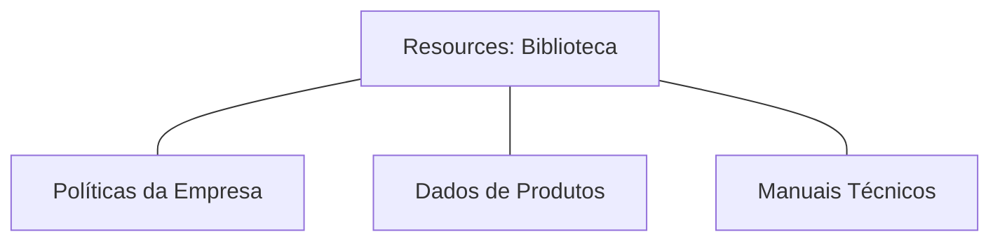

  

- "Fontes de conhecimento" que o LLM pode consultar

- Documentos, dados ou conteúdos disponibilizados pelo servidor MCP

- Permitem acesso a dados que não estão no treinamento do LLM

  

---

  

# Conceitos Fundamentais: Tools

  

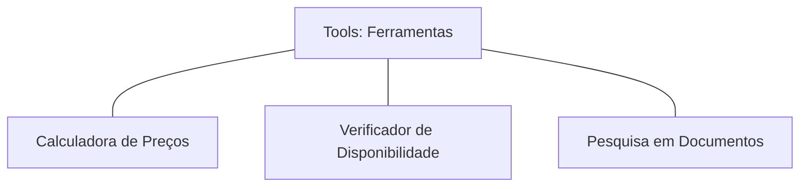

  

- Funções que o LLM pode invocar para realizar ações

- Permitem que a IA faça algo além de gerar texto

- Conectam o LLM a funcionalidades de sistemas existentes

  

---

  

# Conceitos Fundamentais: Prompts

  

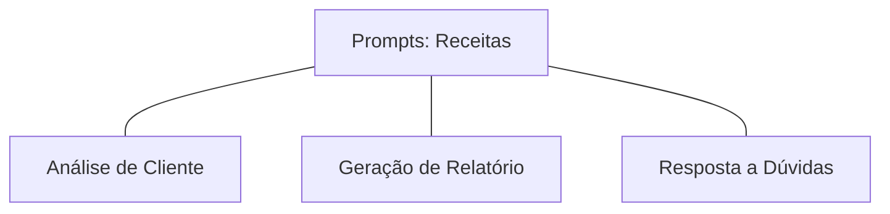

  

- Instruções padronizadas que guiam o LLM em tarefas específicas

- "Receitas testadas" para garantir respostas consistentes

- Asseguram que todas as etapas de um processo sejam seguidas

  

---

  

# Conceitos Fundamentais: Sampling

  

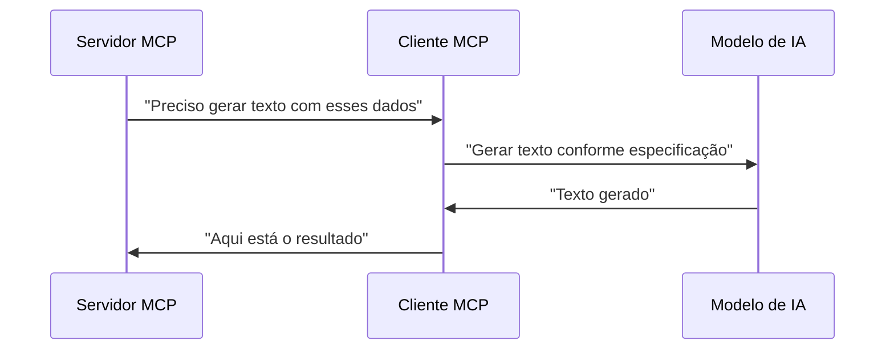

  

- Permite que o servidor solicite geração de conteúdo do LLM

- Fluxo reverso: servidor pede ajuda ao cliente/LLM

  

---

  

# Como o MCP Funciona Por Baixo

  

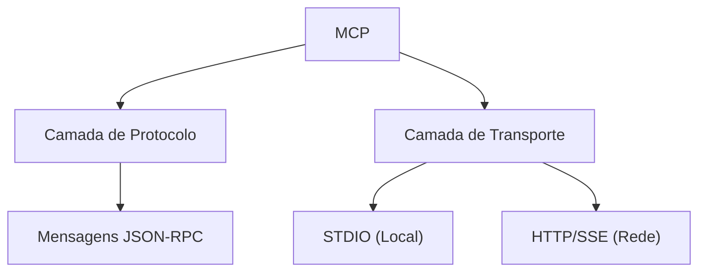

  

- Baseado em JSON-RPC 2.0

- Dois métodos de transporte: STDIO (local) e HTTP/SSE (rede)

- Sistema de requisição-resposta com monitoramento

  

---

  

# A Evolução das IAs Com MCP

  

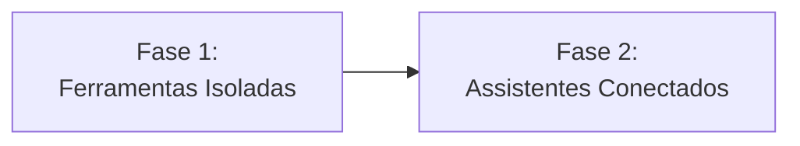

  

**Antes:**

- IAs limitadas ao seu treinamento

- Respostas genéricas

- Dados potencialmente desatualizados

  

**Com MCP:**

- Acesso a dados atualizados e específicos

- Execução de ações em sistemas externos

- Contextualização baseada em dados reais

  

---

  

# MCP na Prática: Setor Financeiro

  

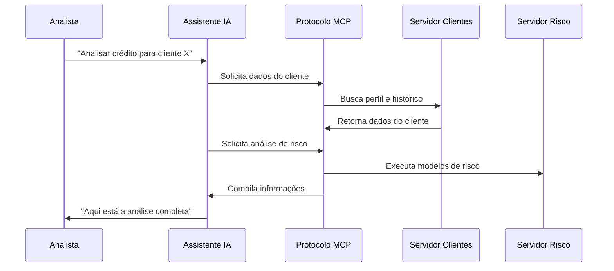

  

---

  

# MCP na Prática: Saúde

  

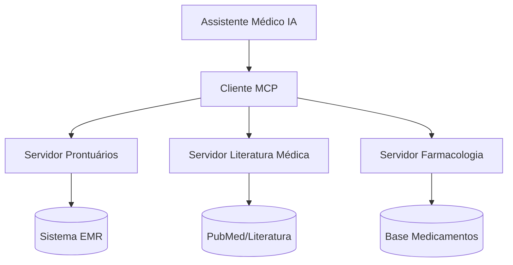

  

- Assistência em tempo real durante consultas

- Acesso a literatura médica atualizada

- Análise de histórico completo do paciente

  

---

  

# MCP na Prática: E-commerce

  

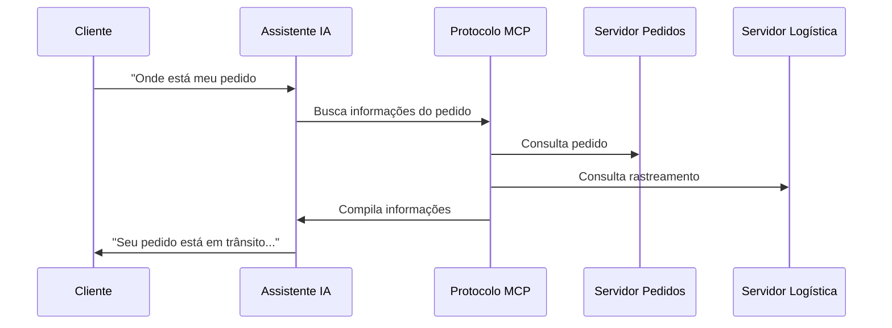

  

---

  

# MCP na Prática: Desenvolvimento

  

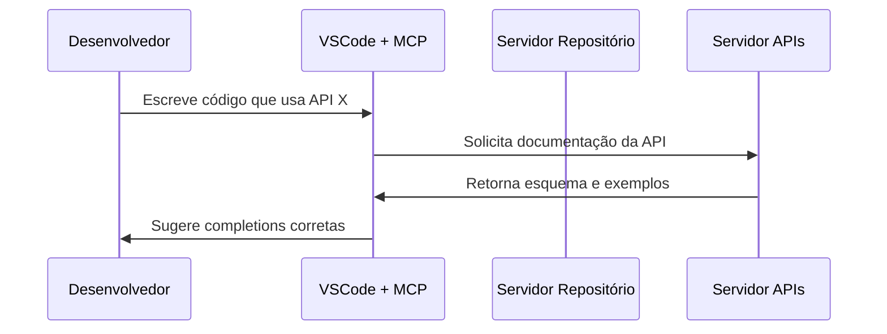

  

- Sugestões contextualmente relevantes

- Acesso à documentação atualizada

- Verificações de segurança em tempo real

  

---

  

# O Futuro do MCP

  

### 1. Federação e Descoberta de Servidores

  

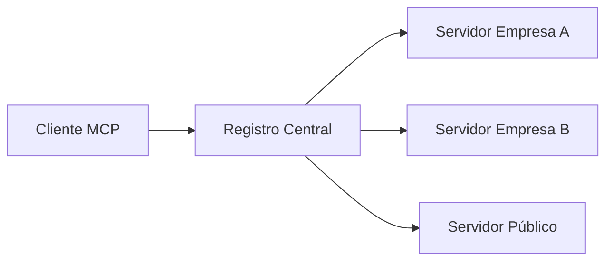

  

### 2. Modelos Especializados por Domínio

  

### 3. Segurança e Conformidade Avançadas

  

---

  

# Recursos para Aprofundamento

  

- **Documentação Oficial:** [modelcontextprotocol.io](https://modelcontextprotocol.io/)

- **GitHub:** [github.com/modelcontextprotocol](https://github.com/modelcontextprotocol)

- **Anúncio Anthropic:** [anthropic.com/news/model-context-protocol](https://www.anthropic.com/news/model-context-protocol)

- **Especificação:** [spec.modelcontextprotocol.io](https://spec.modelcontextprotocol.io/)

  

---

  

# Obrigado!

  

> 💼 Apresentação preparada por Pimentel

>

> Junho 2024