# MCP: A Ponte Entre IA E Valor De Negócio 🚀

## Para Empresários E Líderes De Produto

---

# A História De Pedro: Do Problema Ao Crescimento

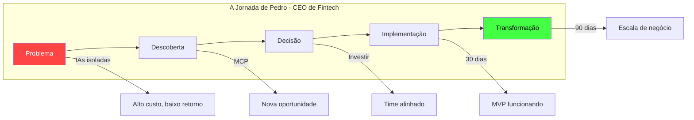

> "Implementamos MCP e transformamos nossa operação: 70% menos custos, 3x mais eficiência. A decisão mais estratégica que tomei." — Pedro, CEO

---

# O Custo Oculto Da IA Sem Contexto

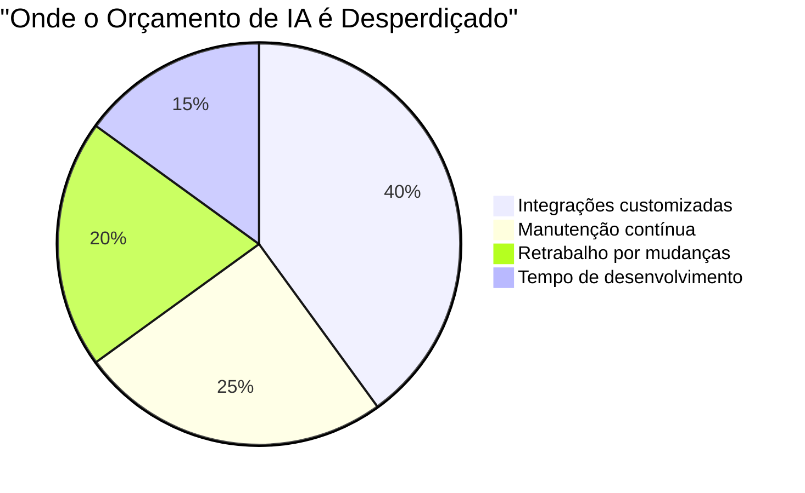

## O Problema Real Que CEOs Enfrentam

### Sem MCP

- 🚨 **6-12 meses** para integrar IA com sistemas existentes
- 💸 **$500K-$2M** por projeto de integração
- 🔄 **Vendor lock-in** com fornecedores específicos
- 🎯 **ROI incerto** e difícil de medir

### Com MCP

- ✅ **2-4 semanas** para primeira integração funcional
- ✅ **80% menos** investimento inicial
- ✅ **Liberdade** para trocar fornecedores
- ✅ **ROI claro** desde o primeiro mês

---

# MCP: O Que É E Por Que Importa

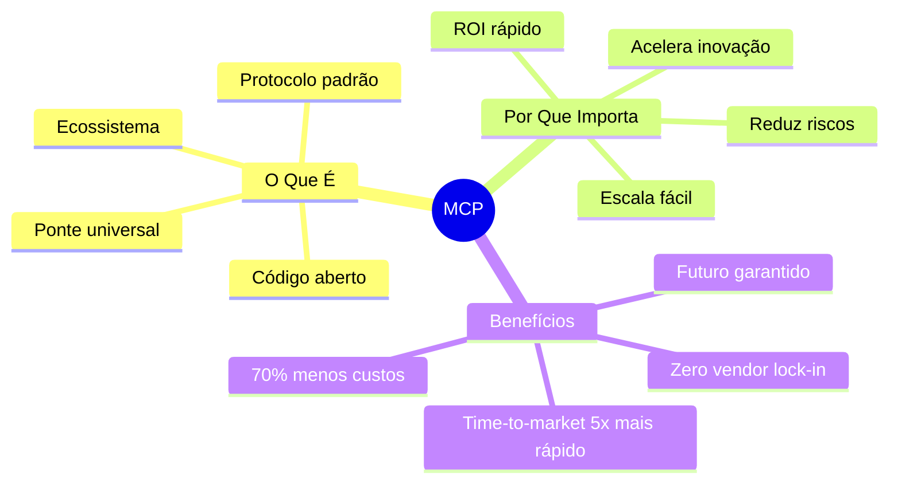

## Analogia Empresarial

**MCP é como o sistema bancário SWIFT para IA**:

- Permite que diferentes sistemas "conversem"
- Padroniza as "transações" de dados
- Reduz custos de integração
- Aumenta segurança e controle

---

# Impacto no Seu Negócio: Números Reais

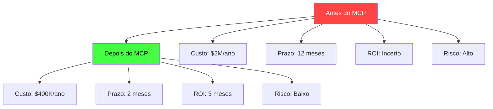

## Métricas De Sucesso

|Métrica|Sem MCP|Com MCP|Impacto|
|---|---|---|---|
|**Time-to-Market**|6-12 meses|4-8 semanas|5x mais rápido|
|**Custo de Integração**|$500K-$2M|$100K-$400K|70% menos|
|**Manutenção Anual**|$300K|$60K|80% menos|
|**Flexibilidade**|Baixa|Alta|♾️|
|**Escalabilidade**|Complexa|Simples|10x mais fácil|

---

# Para Líderes De Produto: Oportunidades Infinitas

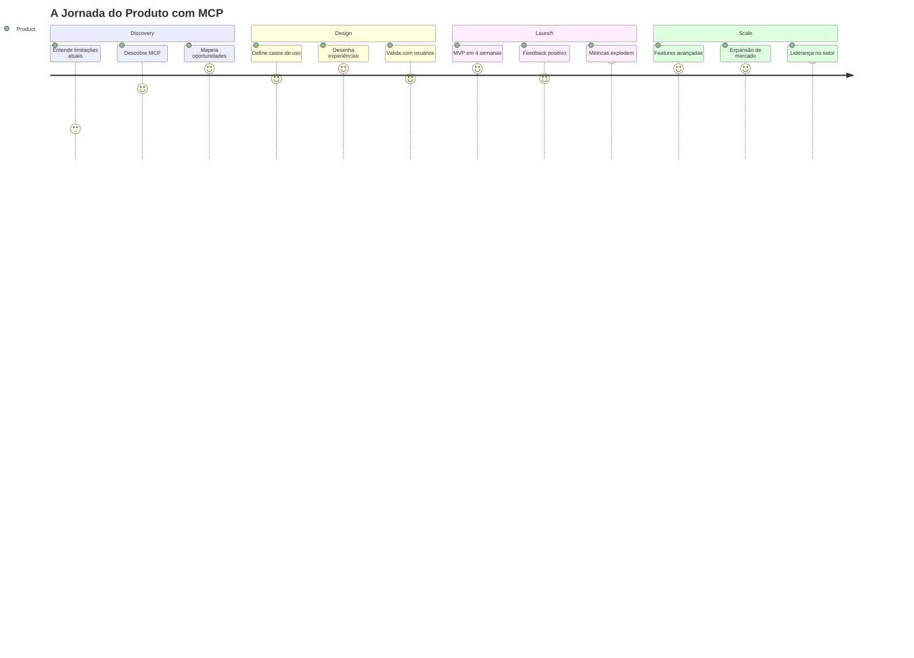

---

# Casos De Uso: Do Simples Ao Transformador

## 1. Assistente Empresarial Inteligente

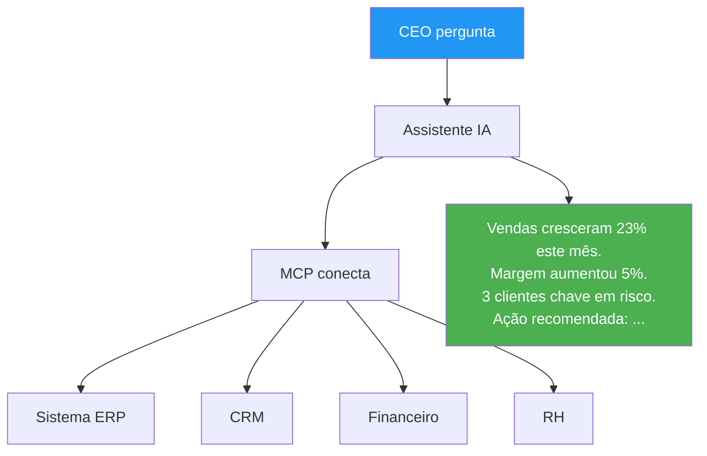

### Valor Entregue

- ⏱️ Respostas em segundos, não dias
- 🎯 Insights acionáveis, não apenas dados
- 💡 Correlações que humanos não veriam
- 🚀 Decisões mais rápidas e precisas

---

# Design De Experiência: O Poder Do Contexto

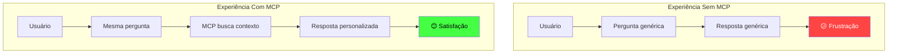

## Princípios De Design Com MCP

1. **Contexto Sempre Presente**
    
    - IA conhece histórico do usuário
    - Respostas são sempre relevantes
    - Zero perguntas desnecessárias
2. **Ações Inteligentes**
    
    - IA pode executar tarefas
    - Automação com aprovação
    - Fluxos multi-step simplificados
3. **Feedback Contínuo**
    
    - Sistema aprende com uso
    - Experiência melhora com tempo
    - Personalização automática

---

# ROI E Investimento: A Matemática Clara

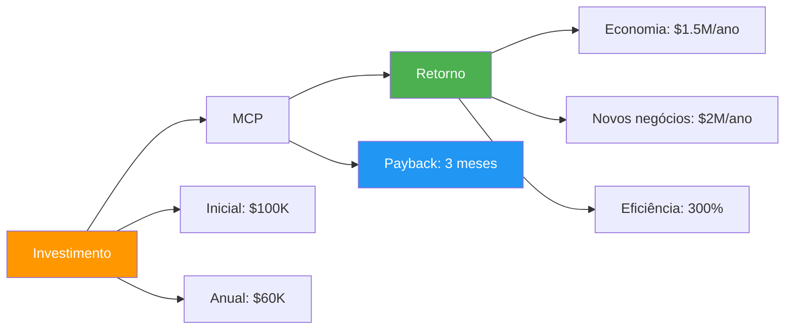

## Cálculo De ROI

|Investimento|Valor|Período|
|---|---|---|
|Implementação inicial|$100K|Uma vez|
|Treinamento do time|$20K|Uma vez|
|Manutenção|$5K|Mensal|
|**Total Ano 1**|**$180K**|-|

|Retorno|Valor|Período|
|---|---|---|
|Economia em integrações|$1.5M|Anual|
|Aumento de produtividade|$800K|Anual|
|Novos negócios habilitados|$2M|Anual|
|**Total Ano 1**|**$4.3M**|-|

**ROI = 2,289% no primeiro ano**

---

# Riscos E Mitigação

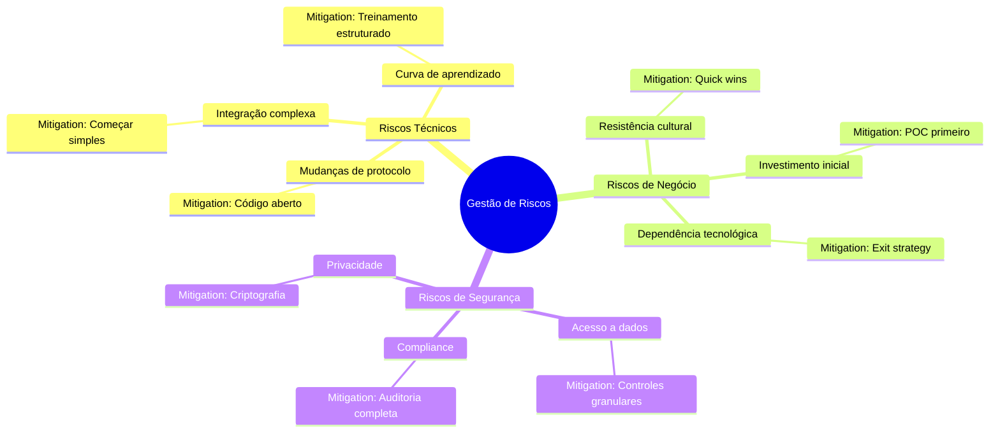

---

# Roadmap De Implementação

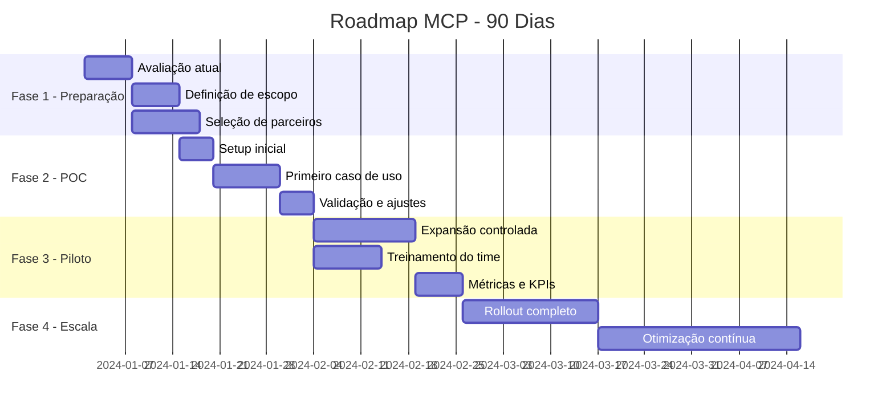

---

# Decisões Estratégicas Para CEOs

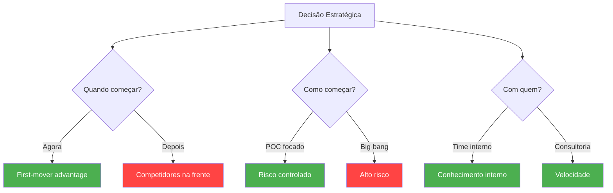

## Checklist De Decisão

- [ ] Temos problemas de integração de IA?
- [ ] Nossos concorrentes estão avançando?
- [ ] Precisamos de ROI em menos de 6 meses?
- [ ] Queremos flexibilidade de fornecedores?
- [ ] Buscamos vantagem competitiva?

**Se marcou 3+, MCP é estratégico para você.**

---

# Para Product Managers: Framework De Oportunidades

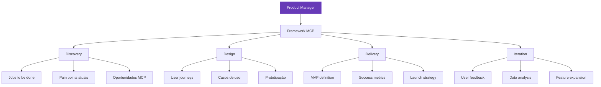

---

# Oportunidades De Produto Por Indústria

## 🏦 Fintech: Bankeiro IA Pessoal

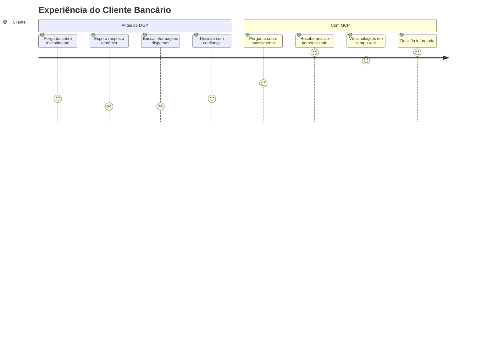

### Features Habilitadas

- Análise de portfólio em tempo real
- Recomendações personalizadas
- Simulações interativas
- Alertas inteligentes
- Execução automatizada (com aprovação)

---

# O Papel Do Designer Na Era MCP

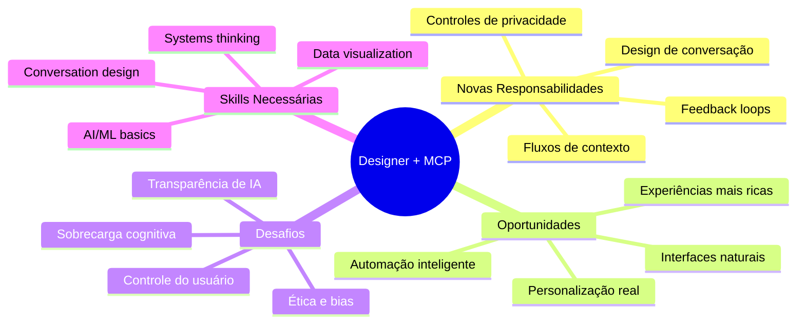

---

# Métricas De Sucesso Para Produto

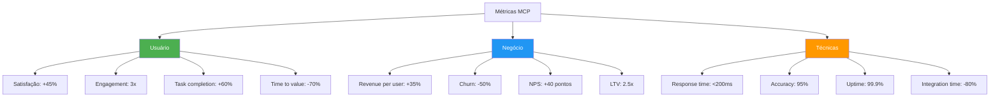

---

# Casos De Sucesso: Resultados Reais

## 📊 SaaS B2B: Plataforma De Analytics

**Antes do MCP:**

- Clientes precisavam de 3 ferramentas diferentes
- Setup demorava 2 semanas
- Churn alto por complexidade

**Depois do MCP:**

- Interface unificada com IA
- Setup em 30 minutos
- Retenção aumentou 65%


## 🛍️ E-commerce: Assistente De Compras

**Impacto nos KPIs:**

- Conversão: +38%
- Ticket médio: +52%
- Satisfação: 4.2 → 4.8 ⭐
- Retorno de clientes: +45%

---

# Competitive Advantage: Por Que Agora?

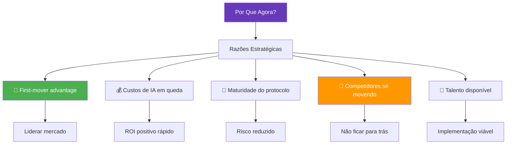

---

# Plano De Ação: Próximos 30 Dias

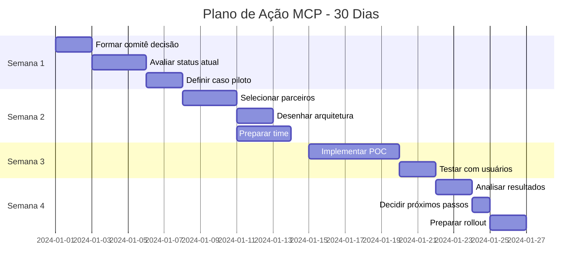

---

# Perguntas Que CEOs Devem Fazer

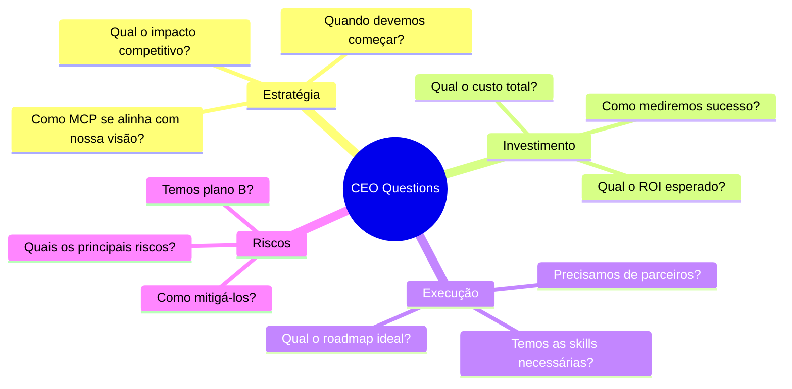

---

# Conclusão: A Decisão É Sua

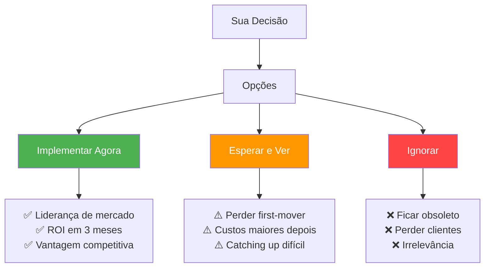

---

# MCP: O Futuro É Contextual

> "Em 2025, empresas sem IA contextual serão como empresas sem internet em 2000." — Gartner

## Três Verdades Sobre MCP

1. **Não é uma tendência, é uma mudança fundamental**
    
    - Como a web mudou negócios nos anos 90
    - Como mobile mudou comportamentos em 2010
    - MCP está mudando IA agora
2. **O custo de esperar só aumenta**
    
    - Cada dia sem MCP é vantagem para concorrentes
    - Integrações ficam mais caras com o tempo
    - Talento fica mais escasso
3. **ROI é mensurável e rápido**
    
    - Payback em 3-6 meses
    - Métricas claras de sucesso
    - Valor composto ao longo do tempo

---

# Recursos Para Começar

```mermaid
graph TD
    START[Comece Aqui] --> LEARN[Aprender]
    START --> CONNECT[Conectar]
    START --> BUILD[Construir]
    
    LEARN --> L1[modelcontextprotocol.io]
    LEARN --> L2[Casos de sucesso]
    LEARN --> L3[Whitepapers]
    
    CONNECT --> C1[Comunidade MCP]
    CONNECT --> C2[Parceiros certificados]
    CONNECT --> C3[Eventos e workshops]
    
    BUILD --> B1[POC Kit]
    BUILD --> B2[Consultoria]
    B3[Time interno]
    
    style START fill:#673ab7,color:#fff
    style LEARN fill:#2196F3,color:#fff
    style CONNECT fill:#ff9800,color:#fff
    style BUILD fill:#4CAF50,color:#fff
```

## Próximos Passos Concretos

1. **Esta semana**: Agende uma demo com especialista MCP
2. **Próximas 2 semanas**: Forme comitê de avaliação
3. **Próximo mês**: Defina e inicie POC
4. **Em 90 dias**: Primeira integração em produção

---

# Contato E Suporte

## Para CEOs E Decisores

- **Email**: executive@modelcontextprotocol.io
- **Hotline**: 0800-MCP-EXEC
- **Consultoria gratuita**: 1h de assessment

## Para Product Leaders

- **Slack**: mcp-product-leaders
- **Office hours**: Quintas, 16h
- **Templates e frameworks**: mcp.io/product

## Recursos Adicionais

- **ROI Calculator**: mcp.io/roi
- **Success stories**: mcp.io/cases
- **Implementation guide**: mcp.io/start

---

# A Revolução MCP Começa Com Você

**MCP não é sobre tecnologia.**  
**É sobre transformar potencial em resultados.**

Quando você conecta IA ao contexto real do seu negócio, você não está implementando um protocolo - você está desbloqueando o futuro.

**O futuro da IA é contextual.**  
**E começa com sua decisão.**

🚀 **[modelcontextprotocol.io](https://modelcontextprotocol.io/)** 🚀