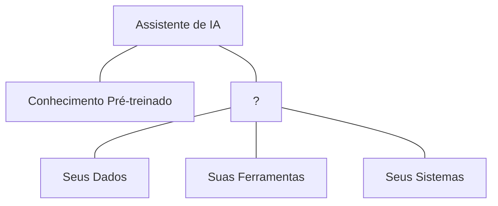
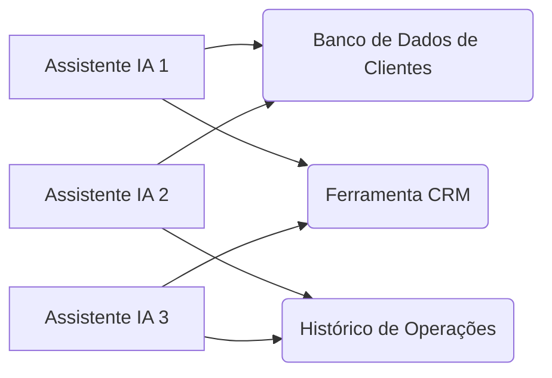
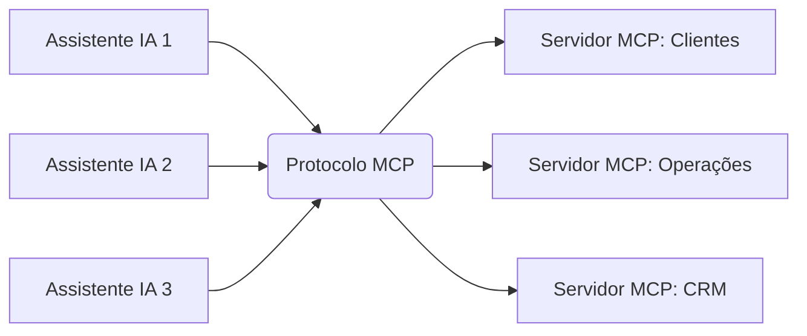
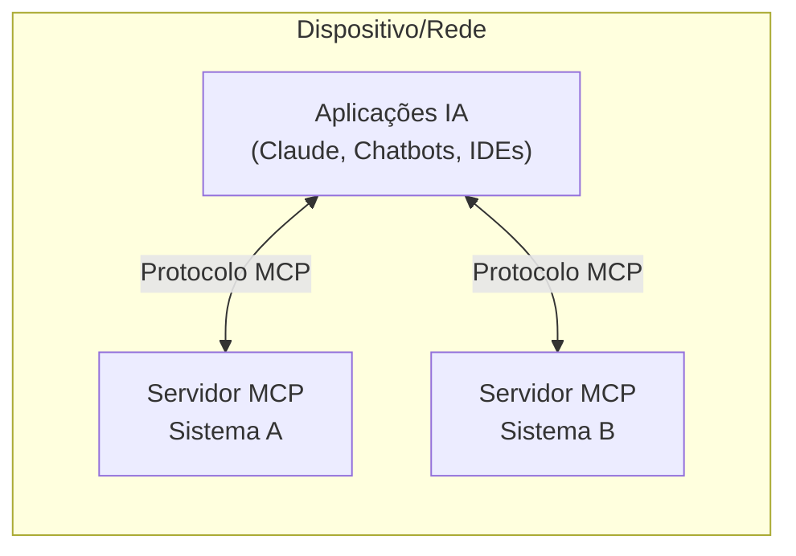
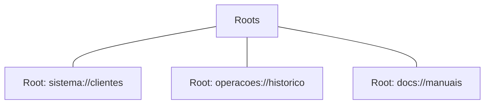
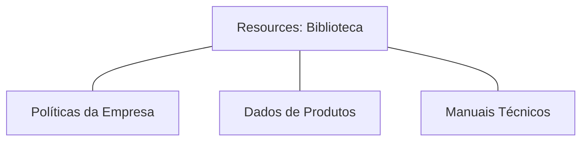
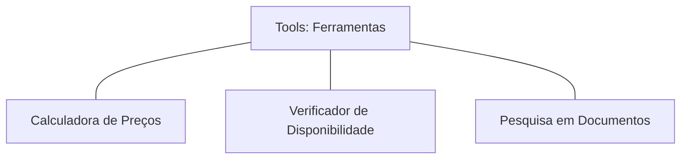
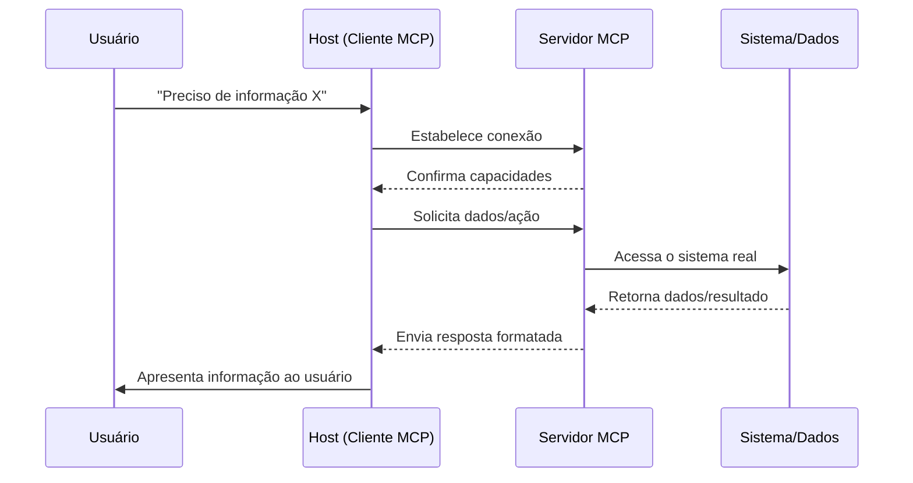
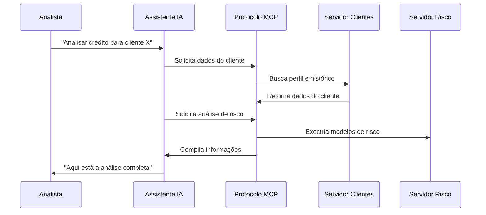
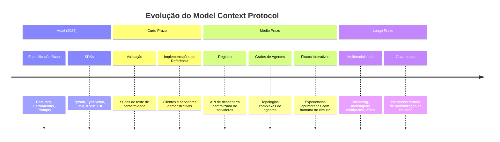

# Model Context Protocol (MCP)

## O Adaptador Universal Para Aplicações de IA

---

# O Que É o MCP?

O Model Context Protocol (MCP) é um padrão que permite que aplicações de IA se conectem com fontes de dados e ferramentas. Ele facilita a integração entre modelos de linguagem e sistemas externos.

Pense no MCP como um adaptador universal para aplicações de IA, similar ao que o USB-C é para dispositivos físicos:

- **Um protocolo universal** para conectar aplicações de IA a diferentes fontes de dados e ferramentas
- **Elimina integrações customizadas** para cada combinação de IA e dados/ferramentas
- **Padroniza a comunicação** entre todos os componentes
- **Possibilita interoperabilidade** em todo o ecossistema de IA

---

# O Desafio das IAs Isoladas

- LLMs não têm acesso nativo aos seus sistemas e dados específicos
- Respostas baseadas em dados de treinamento podem estar desatualizadas ou ser genéricas
- Sem capacidade de executar ações em sistemas externos
- Compreensão contextual limitada do seu ambiente específico

---

# O Problema da Torre de Babel Digital

- **Esforço duplicado:** A mesma conexão é recriada múltiplas vezes
- **Inconsistência:** Diferentes padrões para cada integração
- **Custos elevados:** Mudanças em um sistema exigem múltiplas atualizações
- **Escalabilidade ruim:** Adicionar novos assistentes de IA se torna cada vez mais complexo

---

# MCP Como Solução Universal

- Todos os assistentes de IA falam a mesma "língua"
- Reutilização de servidores entre aplicações
- Interoperabilidade entre diferentes LLMs
- Padronização de integrações facilita manutenção e expansão

---

# Arquitetura MCP: Cliente-Servidor

## Os Três Pilares do MCP

1. **MCP Hosts (Clientes):** Aplicações que incorporam LLMs
2. **MCP Servers (Servidores):** Fornecem acesso a sistemas específicos
3. **O Protocolo MCP:** A "língua comum" entre hosts e servidores

---

# Conceitos Fundamentais: Roots

- **Territórios de acesso** que delimitam onde um servidor pode operar
- Funcionam como "crachás de segurança" para diferentes áreas
- Permitem controle granular de permissões

---

# Conceitos Fundamentais: Resources

- "Fontes de conhecimento" que o LLM pode consultar
- Documentos, dados ou conteúdos disponibilizados pelo servidor MCP
- Permitem acesso a dados que não estão no treinamento do LLM

---

# Conceitos Fundamentais: Tools

- Funções que o LLM pode invocar para realizar ações
- Permitem que a IA faça algo além de gerar texto
- Conectam o LLM a funcionalidades de sistemas existentes

---

# Conceitos Fundamentais: Prompts e Sampling

- **Prompts:** Instruções padronizadas que guiam o LLM em tarefas específicas
    
    - "Receitas testadas" para garantir respostas consistentes
    - Asseguram que todas as etapas de um processo sejam seguidas
- **Sampling:** Permite que o servidor solicite geração de conteúdo do LLM
    
    - Fluxo reverso: servidor pede ajuda ao cliente/LLM
    - Permite implementar comportamentos "agênticos" complexos

---

# Como o MCP Funciona na Prática

---

# MCP na Prática: Setor Financeiro

---

# Roadmap do MCP: O Que Está Por Vir

O roadmap do MCP inclui:

- **Validação:** Ferramentas para verificar implementações
- **Registro:** Sistemas para distribuição e descoberta de servidores MCP
- **Agentes:** Suporte a fluxos de trabalho agênticos e topologias complexas
- **Interatividade:** Melhorias na experiência humano-no-circuito
- **Multimodalidade:** Suporte a vídeo e outras modalidades de mídia
- **Governança:** Desenvolvimento liderado pela comunidade e padronização formal

---

# Recursos Para Aprofundamento

- **Documentação Oficial:** [modelcontextprotocol.io](https://modelcontextprotocol.io/)
- **GitHub:** [github.com/modelcontextprotocol](https://github.com/modelcontextprotocol)
- **Anúncio Anthropic:** [anthropic.com/news/model-context-protocol](https://www.anthropic.com/news/model-context-protocol)
- **Especificação:** [spec.modelcontextprotocol.io](https://spec.modelcontextprotocol.io/)

---

# Obrigado!

> 💼 Apresentação sobre Model Context Protocol (MCP)

> Junho 2024