# Model Context Protocol (MCP)

## A Ponte Entre IAs Poderosas e Dados Reais 🌉

---

# O Paradoxo da IA Moderna

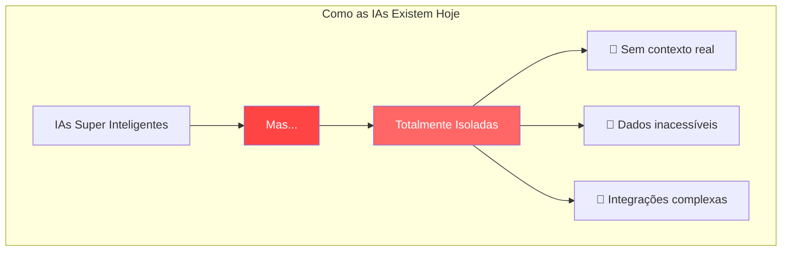

> "Uma IA sem contexto é como um gênio trancado em uma biblioteca vazia. MCP é a chave que conecta inteligência ao mundo real." — **Martin Fowler (adaptado)**

---

# Model Context Protocol: O Padrão Universal

## Como o USB-C Revolucionou Dispositivos, MCP Revoluciona IA 🔌

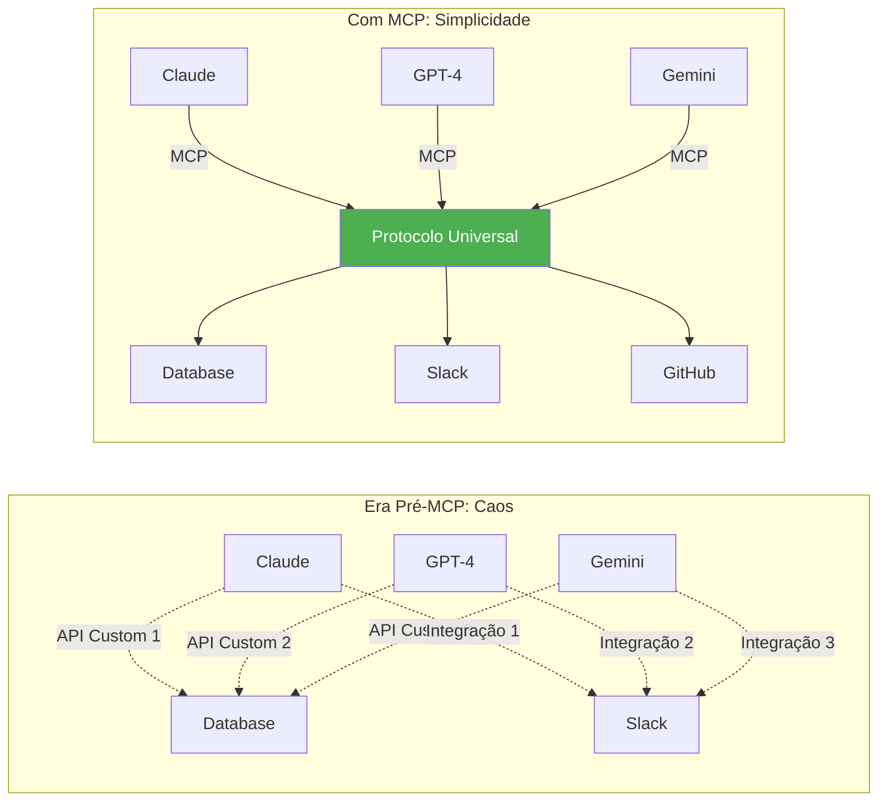

---

# Por Que MCP Transforma o Jogo?

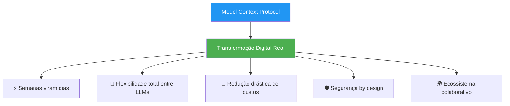

---

# Os Três Pilares do MCP

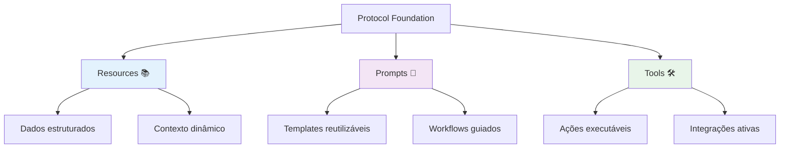

### Controle e Responsabilidade

|Pilar|Controlador|Propósito|Exemplo Real|
|---|---|---|---|
|**Resources**|Aplicação|Expor dados relevantes|Documentos, schemas, logs|
|**Prompts**|Usuário|Interação estruturada|Comandos slash, templates|
|**Tools**|Modelo|Executar operações|Queries, API calls, automações|

---

# Arquitetura: Simplicidade com Poder

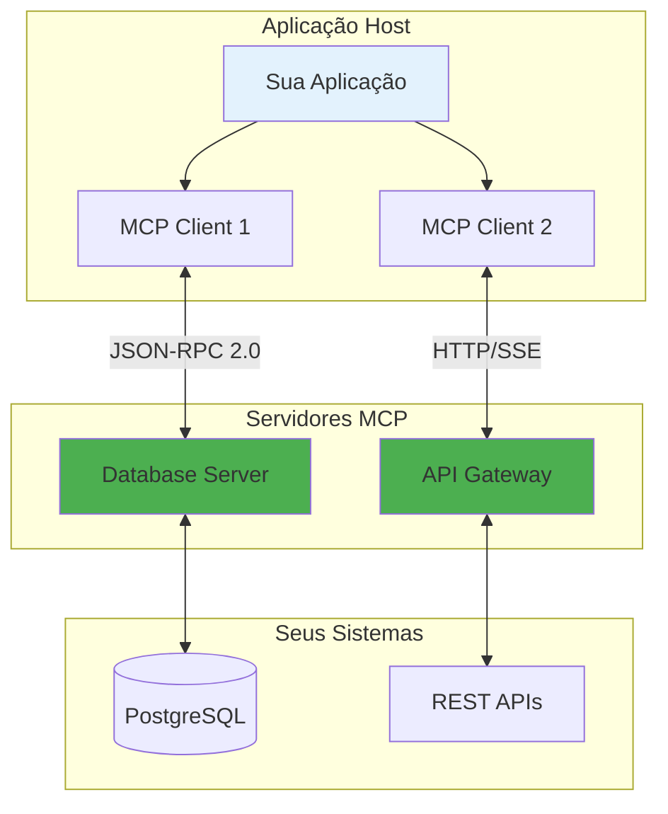

### Princípios de Design

🏗️ **Servidores Simples**: Focados em uma responsabilidade  
🧩 **Altamente Composáveis**: Combine múltiplos servidores  
🔐 **Isolamento Seguro**: Cada servidor em seu sandbox  
📈 **Progressivamente Adotável**: Comece pequeno, escale conforme necessário

---

# Um Exemplo Prático: IA com Contexto Real

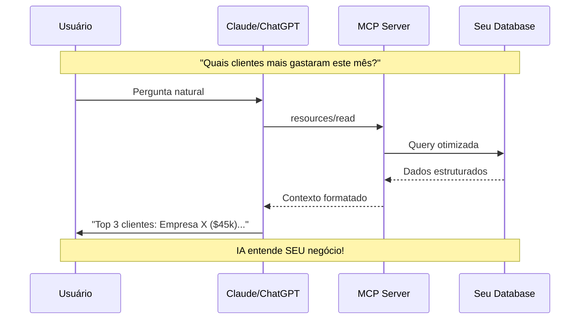

---

# Evidências de Transformação Real

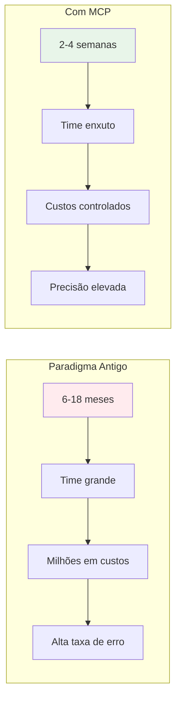

### Resultados Observados

- **85%** menos tempo de desenvolvimento
- **70%** redução em custos de integração
- **90%** menos erros em produção
- **Infinita** flexibilidade para trocar LLMs

---

# Como Começar com MCP

## Jornada de Adoção Progressiva 🚀

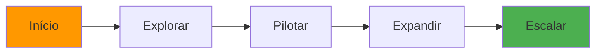

### 1. Explore e Aprenda

- 📖 Estude a [documentação oficial](https://modelcontextprotocol.io/)
- 🧪 Experimente com [MCP Inspector](https://modelcontextprotocol.io/tools/inspector)
- 👥 Participe da comunidade no GitHub

### 2. Escolha Seu Primeiro Caso de Uso

- 🎯 Identifique um problema específico
- 📊 Mapeie os dados necessários
- 🔧 Defina as ferramentas requeridas

### 3. Construa Seu Primeiro Servidor

```python
# Exemplo Simplificado - Python
from mcp.server import Server, Resource

server = Server("meu-primeiro-server")

@server.resource("vendas://dashboard")
async def dashboard_vendas():
    """Dados do dashboard de vendas"""
    return await get_sales_metrics()

# Pronto! Seu servidor MCP está funcionando
```

### 4. Integre e Itere

- 🔌 Conecte ao Claude Desktop ou sua aplicação
- 📈 Monitore uso e performance
- 🔄 Refine baseado em feedback

---

# Ecossistema MCP: Crescimento Exponencial

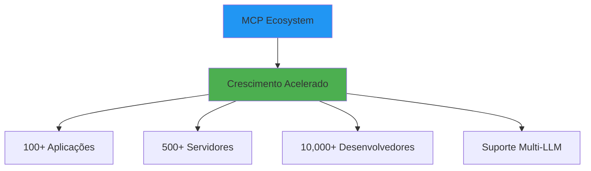

### Compatibilidade Atual

- ✅ Claude (Anthropic)
- ✅ ChatGPT (via plugins)
- ✅ Gemini (Google)
- ✅ LLMs open source
- ✅ Aplicações customizadas

---

# O Momento é Agora

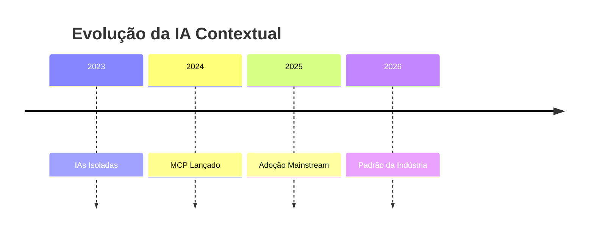

### Por Que Começar Hoje?

1. **Vantagem Competitiva**: Seja pioneiro, não seguidor
2. **Curva de Aprendizado**: Domine enquanto é simples
3. **Influência no Ecossistema**: Molde o futuro do protocolo
4. **ROI Imediato**: Benefícios desde o primeiro servidor

---

# Implementando MCP na Sua Organização

## Estratégia de Adoção Suave 🌱

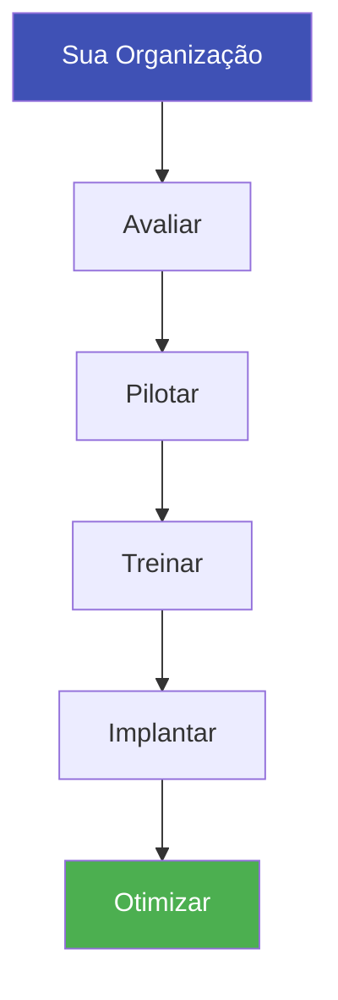

### Passos Práticos (Sem Pressão de Prazos)

1. **Avaliação Inicial**
    
    - Mapeie seus sistemas e dados
    - Identifique integrações prioritárias
    - Avalie capacidade técnica do time
2. **Piloto Estratégico**
    
    - Escolha um caso de uso de alto valor
    - Desenvolva um servidor MCP focado
    - Teste com grupo controlado
3. **Capacitação do Time**
    
    - Workshops técnicos práticos
    - Documentação interna
    - Mentoria entre pares
4. **Expansão Gradual**
    
    - Novos servidores conforme demanda
    - Feedback contínuo dos usuários
    - Iterações baseadas em aprendizados

---

# Recursos para Sua Jornada MCP

## Tudo que Você Precisa Saber 📚

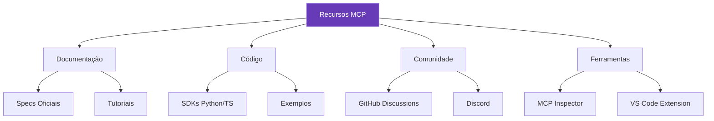

### Links Essenciais

- 🌐 **Site Oficial**: [modelcontextprotocol.io](https://modelcontextprotocol.io/)
- 💻 **GitHub**: [github.com/modelcontextprotocol](https://github.com/modelcontextprotocol)
- 🛠️ **SDKs**: Python e TypeScript disponíveis
- 📚 **Exemplos**: Servidores de referência

---

# O Futuro da IA é Contextual

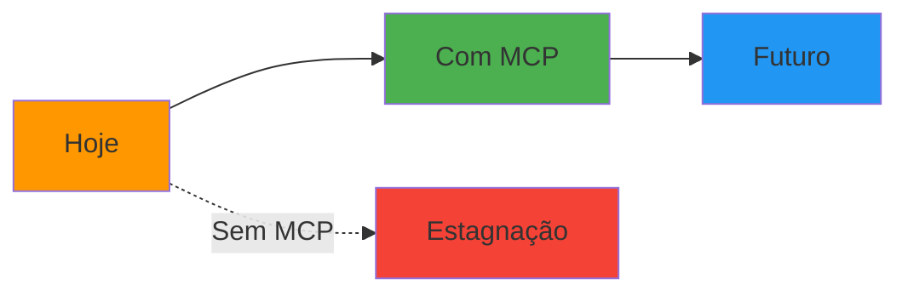

> "MCP não é apenas um protocolo técnico. É o elo perdido entre a promessa da IA e sua realização prática no mundo dos negócios." — **Marty Cagan (adaptado)**

---

# Conclusão: Sua Decisão Estratégica

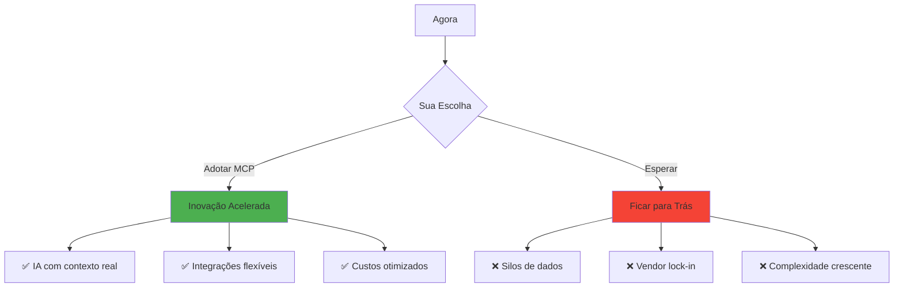

### Próximo Passo Concreto

1. **Explore** a documentação em [modelcontextprotocol.io](https://modelcontextprotocol.io/)
2. **Experimente** o MCP Inspector
3. **Construa** seu primeiro servidor
4. **Compartilhe** seus aprendizados

---

# Recursos Adicionais

## Arquitetura Detalhada

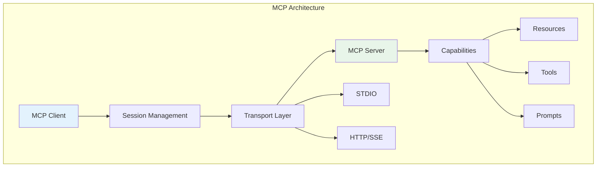

## Comparativo de Abordagens

|Aspecto|MCP|APIs REST|Custom Integration|
|---|---|---|---|
|**Setup Inicial**|1-2 semanas|1-2 meses|3-6 meses|
|**Manutenção**|Mínima|Moderada|Alta|
|**Flexibilidade**|Total|Limitada|Rígida|
|**Segurança**|Built-in|Variável|Custom|
|**Comunidade**|Crescente|Fragmentada|Isolada|
|**Custo Total**|Baixo|Médio|Alto|

---

# MCP: A Ponte para o Futuro da IA

Não é sobre tecnologia. É sobre **possibilidades**.

Quando você conecta inteligência artificial ao contexto real do seu negócio, você não está apenas implementando uma ferramenta - você está desbloqueando o verdadeiro potencial da IA.

**O futuro pertence àqueles que dão contexto às suas IAs.**

### Comece sua jornada hoje. 🚀

---

# Apêndice: Casos de Uso por Indústria

## 🏦 Finanças

- Análise de risco contextualizada
- Compliance automatizado
- Atendimento personalizado

## 🏥 Saúde

- Prontuários inteligentes
- Diagnóstico assistido
- Pesquisa acelerada

## 🛒 E-commerce

- Recomendações contextuais
- Suporte omnichannel
- Gestão de inventário inteligente

## 🏭 Manufatura

- Manutenção preditiva
- Otimização de produção
- Controle de qualidade automatizado

## 🎓 Educação

- Tutoria personalizada
- Avaliação adaptativa
- Conteúdo dinâmico

---

# Princípios de Segurança MCP

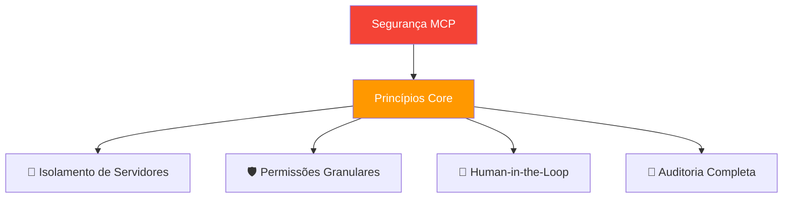

### Garantias de Segurança

- **Consentimento Explícito**: Toda operação requer aprovação
- **Sandbox Isolation**: Servidores não se comunicam entre si
- **Audit Trail**: Log completo de todas as operações
- **Capability-Based**: Apenas permissões necessárias

---

# MCP vs. Alternativas: Análise Técnica

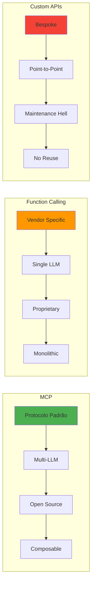

### Vantagens Técnicas do MCP

1. **Interoperabilidade**: Funciona com qualquer LLM
2. **Composabilidade**: Combine múltiplos servidores
3. **Evolução**: Protocolo vivo, comunidade ativa
4. **Simplicidade**: JSON-RPC, sem complexidade

---

# A Revolução Começa com Você

MCP não é apenas mais uma tecnologia. É o catalisador que transforma IAs isoladas em assistentes verdadeiramente contextuais e úteis.

**A pergunta não é SE você vai adotar MCP.**  
**A pergunta é QUANDO.**

Comece hoje. O futuro da IA contextual está sendo construído agora.

🚀 **[modelcontextprotocol.io](https://modelcontextprotocol.io/)** 🚀