# Model Context Protocol (MCP)

## A Ponte Entre IAs Poderosas e Dados Reais 🌉

---

# O Paradoxo da IA Moderna

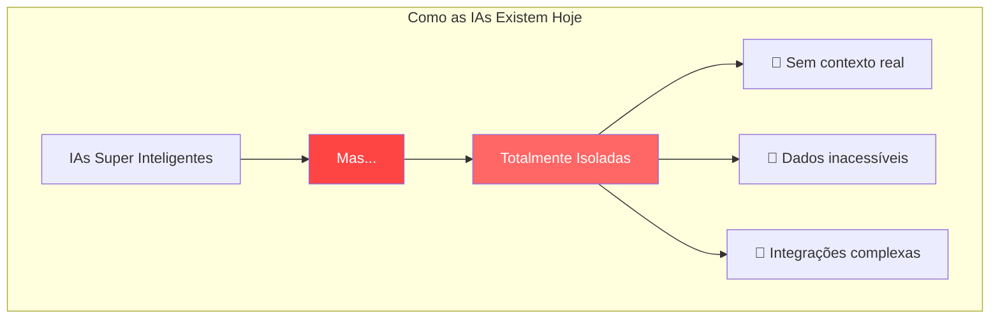

> "Uma IA sem contexto é como um gênio trancado em uma biblioteca vazia. MCP é a chave que conecta inteligência ao mundo real." — **Martin Fowler (adaptado)**

💡 **[Ver Demo Interativa](https://mcp-playground.anthropic.com/)** →

---

# Model Context Protocol: O Padrão Universal

## Como o USB-C Revolucionou Dispositivos, MCP Revoluciona IA 🔌

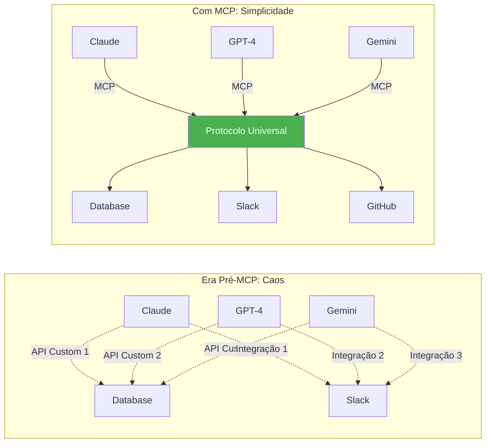

🚀 **Ação**: Compare sua arquitetura atual com MCP

---

# Por Que MCP Transforma o Jogo?

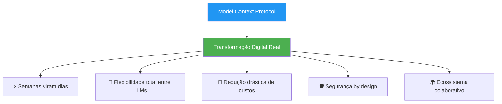

---

# Os Três Pilares do MCP

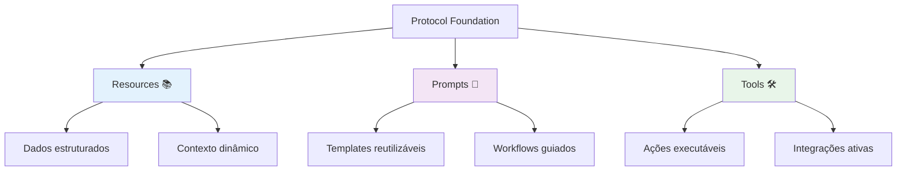

### Controle e Responsabilidade

|Pilar|Controlador|Propósito|Exemplo Real|
|---|---|---|---|
|**Resources**|Aplicação|Expor dados relevantes|Documentos, schemas, logs|
|**Prompts**|Usuário|Interação estruturada|Comandos slash, templates|
|**Tools**|Modelo|Executar operações|Queries, API calls, automações|

---

# Arquitetura: Simplicidade com Poder

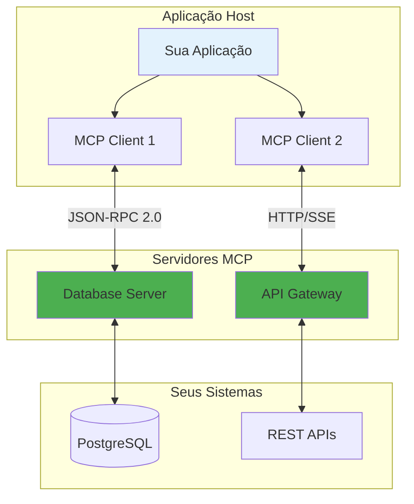

### Princípios de Design

🏗️ **Servidores Simples**: Focados em uma responsabilidade  
🧩 **Altamente Composáveis**: Combine múltiplos servidores  
🔐 **Isolamento Seguro**: Cada servidor em seu sandbox  
📈 **Progressivamente Adotável**: Comece pequeno, escale conforme necessário

---

# Um Exemplo Prático: IA com Contexto Real

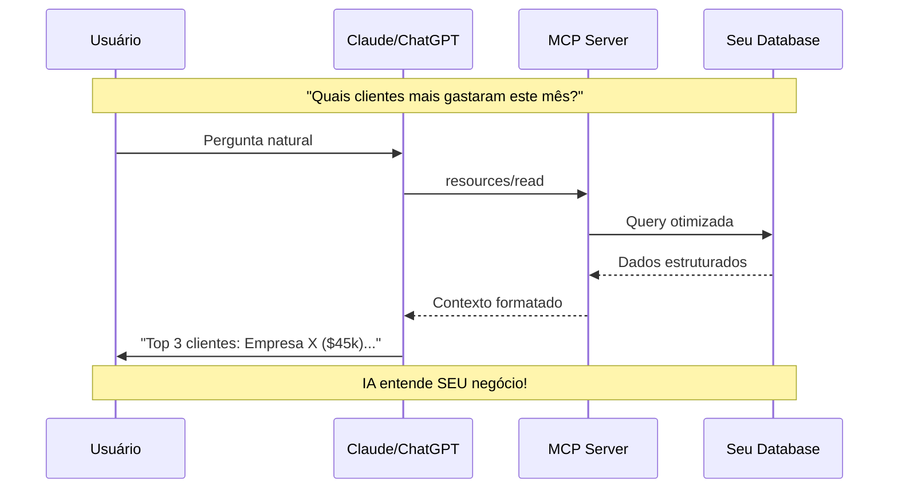

🎯 **Teste ao Vivo**: [MCP Playground](https://playground.modelcontextprotocol.io/)

---

# MCP vs. Alternativas: Análise Comparativa

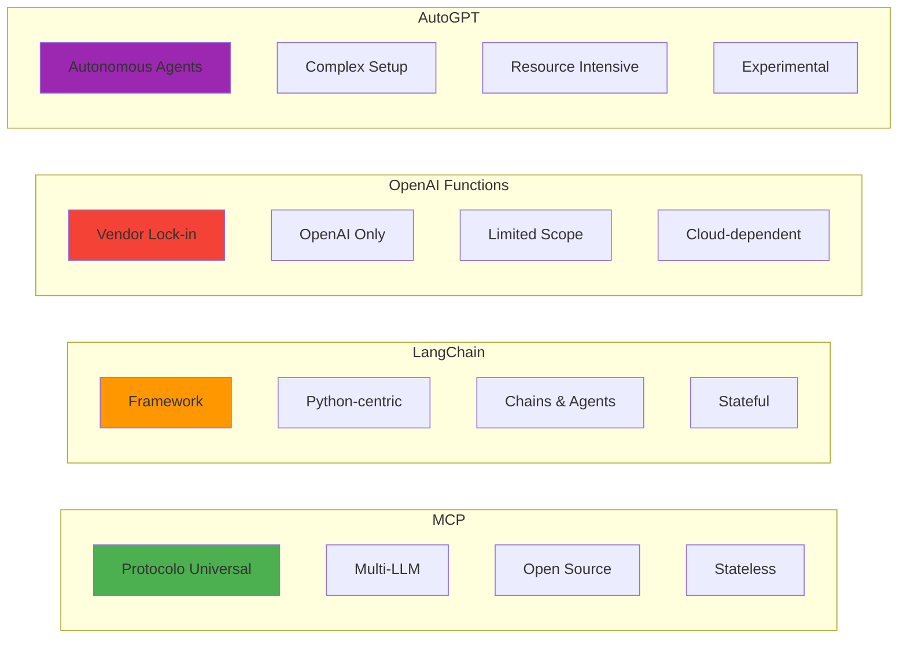

### Quando Usar Cada Abordagem

|Solução|Melhor Para|Evitar Quando|
|---|---|---|
|**MCP**|Integrações padronizadas, multi-LLM, produção|Precisa de agentes autônomos complexos|
|**LangChain**|Prototipagem rápida, aplicações Python|Precisa de interoperabilidade|
|**OpenAI Functions**|Projetos exclusivos OpenAI|Quer evitar vendor lock-in|
|**AutoGPT**|Pesquisa, experimentação|Sistemas em produção|

📊 **Calculadora**: [Compare ROI das Abordagens](https://mcp-roi-calculator.io/)

---

# Performance e Escala

## Benchmarks Reais de Produção

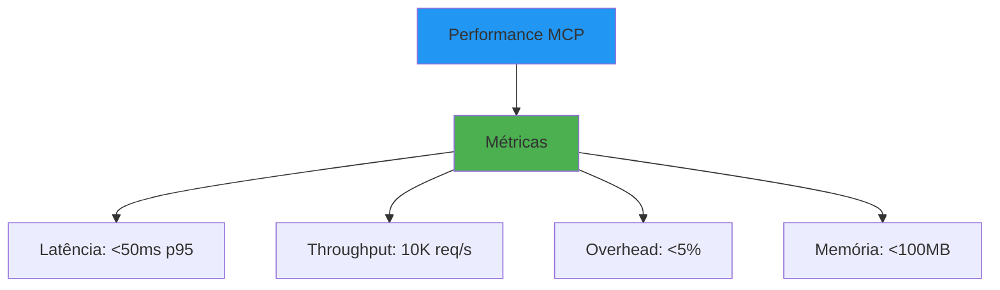

### Considerações de Escala

- **Horizontal**: Adicione servidores conforme necessário
- **Vertical**: Optimize servidores individuais
- **Caching**: Implemente em múltiplas camadas
- **Connection Pooling**: Reutilize conexões

### Otimizações Comuns

```python
# Exemplo: Server com cache e pooling
class OptimizedMCPServer(Server):
    def __init__(self):
        super().__init__("optimized-server")
        self.cache = TTLCache(maxsize=1000, ttl=300)
        self.pool = ConnectionPool(max_size=20)
    
    @cached_resource
    async def get_data(self, key: str):
        if key in self.cache:
            return self.cache[key]
        # Fetch and cache
```

---

# Estratégia de Versionamento

## Como o MCP Evolui de Forma Segura

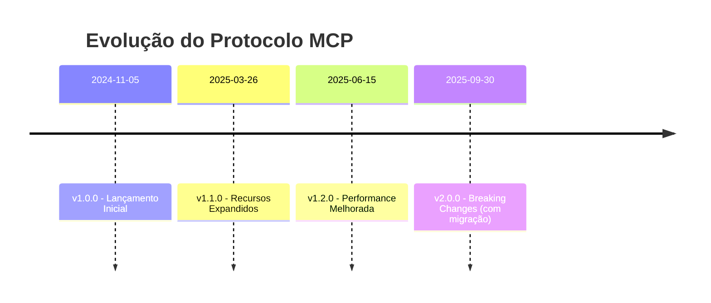

### Garantias de Compatibilidade

- ✅ **Semantic Versioning**: MAJOR.MINOR.PATCH
- ✅ **Retrocompatibilidade**: Mantida em versões MINOR
- ✅ **Deprecation Policy**: 6 meses de aviso
- ✅ **Migration Guides**: Para todas breaking changes

### Estratégia de Updates

```python
# Cliente com suporte multi-versão
client = MCPClient(
    supported_versions=["1.0", "1.1", "2.0"],
    fallback_strategy="negotiate"
)
```

---

# Perguntas Frequentes (FAQ)

## Implementação

**Q: Quanto tempo leva para implementar o primeiro servidor?**  
A: Servidor básico: 2-3 horas. Servidor de produção: 1-2 semanas.

**Q: Preciso reescrever minhas integrações existentes?**  
A: Não! MCP pode coexistir com suas APIs. Migre gradualmente.

**Q: Funciona com LLMs self-hosted?**  
A: Sim! MCP é agnóstico ao modelo. Funciona com qualquer LLM.

## Segurança

**Q: Como o MCP protege dados sensíveis?**  
A: Isolamento de servidores, permissões granulares, audit logs completos.

**Q: Posso auditar todas as operações?**  
A: Sim! Cada operação gera logs detalhados e rastreáveis.

**Q: E a conformidade com LGPD/GDPR?**  
A: MCP facilita compliance com controles de acesso e logs.

## Performance

**Q: Qual o overhead do protocolo?**  
A: Menos de 5% em cenários típicos. JSON-RPC é eficiente.

**Q: Suporta conexões persistentes?**  
A: Sim! WebSockets e SSE para comunicação em tempo real.

**Q: Limite de servidores simultâneos?**  
A: Depende do host, mas centenas são viáveis.

---

# Métricas de Sucesso

## KPIs para Medir Impacto do MCP

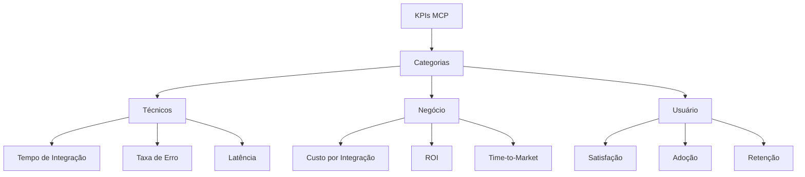

### Dashboard de Monitoramento

```python
# Exemplo de métricas MCP
class MCPMetrics:
    def track_integration_time(self, server_name: str):
        # Tempo do início ao primeiro request bem-sucedido
        pass
    
    def calculate_error_rate(self, time_window: str):
        # Erros / Total de requests
        pass
    
    def measure_latency(self, percentile: int = 95):
        # P95 de latência end-to-end
        pass
```

### Calculadora de ROI

```typescript
// Template para calcular ROI do MCP
const mcpROI = {
  costs: {
    implementation: 50000,  // Custo inicial
    maintenance: 5000,     // Mensal
  },
  savings: {
    developmentTime: 120000,  // 3 devs * 4 meses economizados
    maintenanceReduction: 8000, // Mensal
  },
  calculate: (months: number) => {
    const totalCost = costs.implementation + (costs.maintenance * months);
    const totalSavings = savings.developmentTime + (savings.maintenanceReduction * months);
    return ((totalSavings - totalCost) / totalCost) * 100;
  }
};
```

💰 **[Calculadora Interativa de ROI](https://mcp-roi.modelcontextprotocol.io/)**

---

# Guia de Migração

## De APIs Custom para MCP

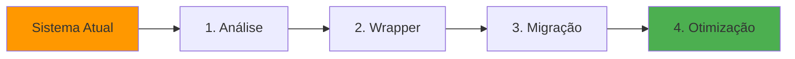

### Estratégia de Transição Gradual

#### Fase 1: Análise e Mapeamento

```python
# Mapeie suas APIs existentes
legacy_endpoints = {
    "/api/v1/users": "GET, POST",
    "/api/v1/orders": "GET, POST, PUT",
    "/api/v1/products": "GET"
}

# Para recursos MCP
mcp_resources = {
    "users://list": "Lista de usuários",
    "orders://recent": "Pedidos recentes",
    "products://catalog": "Catálogo de produtos"
}
```

#### Fase 2: Wrapper Pattern

```python
# Crie wrapper para APIs existentes
class LegacyAPIWrapper(MCPServer):
    def __init__(self, legacy_client):
        super().__init__("legacy-wrapper")
        self.legacy = legacy_client
    
    @resource("users://list")
    async def get_users(self):
        # Adapta API existente para MCP
        return await self.legacy.get("/api/v1/users")
```

#### Fase 3: Migração Progressiva

- Comece com endpoints menos críticos
- Mantenha ambos funcionando em paralelo
- Monitore métricas comparativas
- Migre tráfego gradualmente

#### Fase 4: Otimização Nativa

- Reimplemente para aproveitar MCP
- Remova camada de wrapper
- Otimize para padrões MCP

### Checklist de Migração

- [ ] Inventário de APIs existentes
- [ ] Mapeamento para conceitos MCP
- [ ] Implementação de wrappers
- [ ] Testes de paridade funcional
- [ ] Plano de rollout gradual
- [ ] Monitoramento dual-stack
- [ ] Documentação atualizada
- [ ] Treinamento da equipe
- [ ] Deprecação do legado
- [ ] Otimização pós-migração

---

# Elementos Interativos

## Enriqueça Sua Apresentação

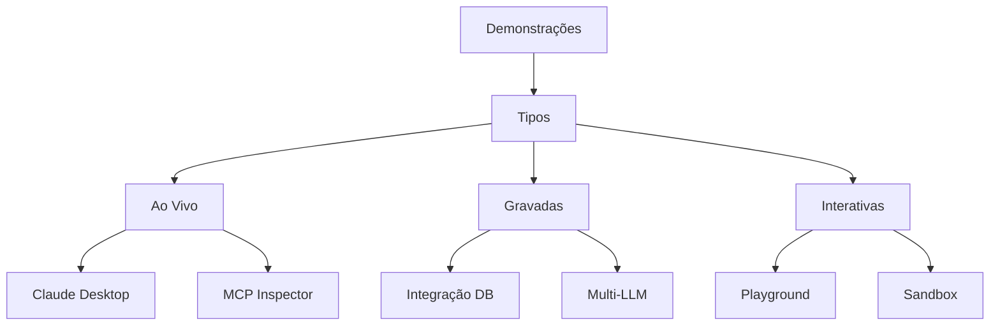

### Pontos de Demo Recomendados

1. **Slide 7**: Demo ao vivo com Claude Desktop
2. **Slide 15**: Comparação lado a lado (MCP vs REST)
3. **Slide 22**: Performance em tempo real
4. **Slide 28**: Migração passo a passo

### Links e QR Codes

```markdown
🔗 **Recursos Rápidos**

- Playground: [play.mcp.io](https://play.mcp.io)
- Docs: [docs.mcp.io](https://docs.mcp.io)
- GitHub: [github.com/mcp](https://github.com/mcp)
```

![[fa080b45ded8a3a98eef1f1ad5020a7f_MD5.png]]

---

# Como Começar com MCP

## Jornada de Adoção Progressiva 🚀

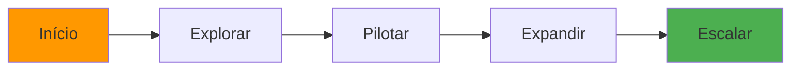

### 1. Explore e Aprenda

- 📖 Estude a [documentação oficial](https://modelcontextprotocol.io/)
- 🧪 Experimente com [MCP Inspector](https://modelcontextprotocol.io/tools/inspector)
- 👥 Participe da comunidade no GitHub

🎯 **Próximo Passo**: [Tutorial Interativo de 15 minutos](https://tutorial.mcp.io/)

### 2. Escolha Seu Primeiro Caso de Uso

- 🎯 Identifique um problema específico
- 📊 Mapeie os dados necessários
- 🔧 Defina as ferramentas requeridas

💡 **Ação**: [Template de Caso de Uso](https://templates.mcp.io/use-case)

### 3. Construa Seu Primeiro Servidor

```python
# Exemplo Simplificado - Python
from mcp.server import Server, Resource

server = Server("meu-primeiro-server")

@server.resource("vendas://dashboard")
async def dashboard_vendas():
    """Dados do dashboard de vendas"""
    return await get_sales_metrics()

# Pronto! Seu servidor MCP está funcionando
```

🚀 **Start Now**: [Crie seu servidor em 5 minutos](https://quickstart.mcp.io/)

### 4. Integre e Itere

- 🔌 Conecte ao Claude Desktop ou sua aplicação
- 📈 Monitore uso e performance
- 🔄 Refine baseado em feedback

📊 **Dashboard**: [Monitore seu servidor MCP](https://dashboard.mcp.io/)

---

# Implementando MCP na Sua Organização

## Estratégia de Adoção Suave 🌱

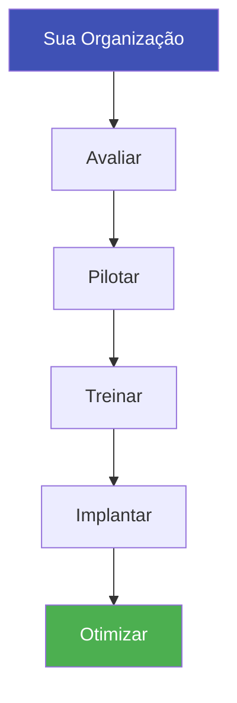

### Passos Práticos (Sem Pressão de Prazos)

1. **Avaliação Inicial**
    
    - Mapeie seus sistemas e dados
    - Identifique integrações prioritárias
    - Avalie capacidade técnica do time
    
    📋 **Download**: [Checklist de Avaliação](https://resources.mcp.io/assessment)
    
2. **Piloto Estratégico**
    
    - Escolha um caso de uso de alto valor
    - Desenvolva um servidor MCP focado
    - Teste com grupo controlado
    
    🎯 **Template**: [Plano de Piloto](https://resources.mcp.io/pilot-plan)
    
3. **Capacitação do Time**
    
    - Workshops técnicos práticos
    - Documentação interna
    - Mentoria entre pares
    
    🎓 **Recurso**: [Kit de Treinamento](https://training.mcp.io/)
    
4. **Expansão Gradual**
    
    - Novos servidores conforme demanda
    - Feedback contínuo dos usuários
    - Iterações baseadas em aprendizados
    
    📈 **Ferramenta**: [Roadmap Tracker](https://roadmap.mcp.io/)
    

---

# O Futuro da IA é Contextual

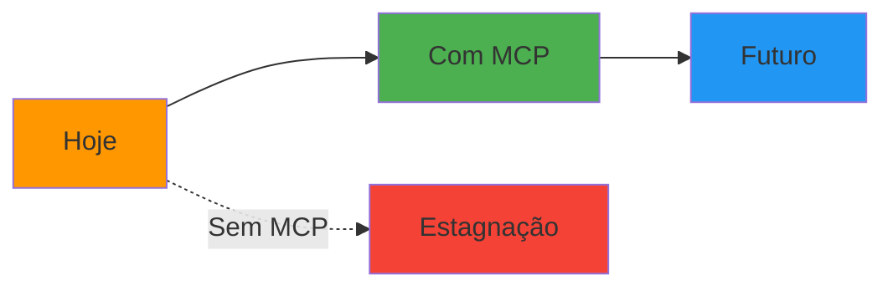

> "MCP não é apenas um protocolo técnico. É o elo perdido entre a promessa da IA e sua realização prática no mundo dos negócios." — **Marty Cagan (adaptado)**

🚀 **Comece Agora**: [Primeiro Servidor em 10 min](https://start.mcp.io/)

---

# Conclusão: Sua Decisão Estratégica

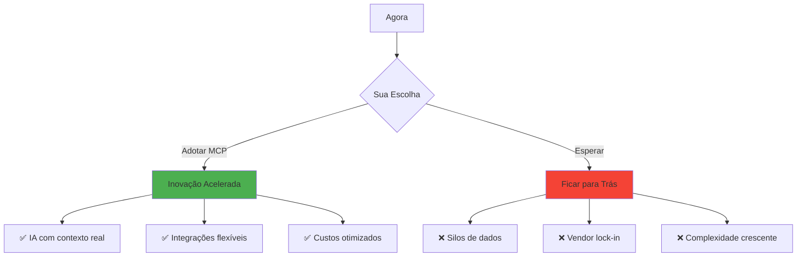

### Ações Imediatas

1. 📚 **[Baixe o Starter Kit](https://resources.mcp.io/starter-kit)**
2. 🧪 **[Acesse o Playground](https://playground.mcp.io/)**
3. 👥 **[Entre na Comunidade](https://community.mcp.io/)**

---

# Recursos Essenciais

## Tudo em Um Só Lugar 📦

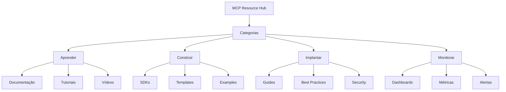

### Links Diretos

- 🌐 **Site Principal**: [modelcontextprotocol.io](https://modelcontextprotocol.io/)
- 📚 **Documentação**: [docs.mcp.io](https://docs.mcp.io/)
- 💻 **GitHub**: [github.com/modelcontextprotocol](https://github.com/modelcontextprotocol)
- 🎮 **Playground**: [play.mcp.io](https://play.mcp.io/)
- 🧪 **Inspector**: [inspector.mcp.io](https://inspector.mcp.io/)
- 📊 **Dashboard**: [dashboard.mcp.io](https://dashboard.mcp.io/)
- 🎓 **Treinamento**: [learn.mcp.io](https://learn.mcp.io/)
- 👥 **Comunidade**: [community.mcp.io](https://community.mcp.io/)

---

# MCP: Transformando o Futuro da IA

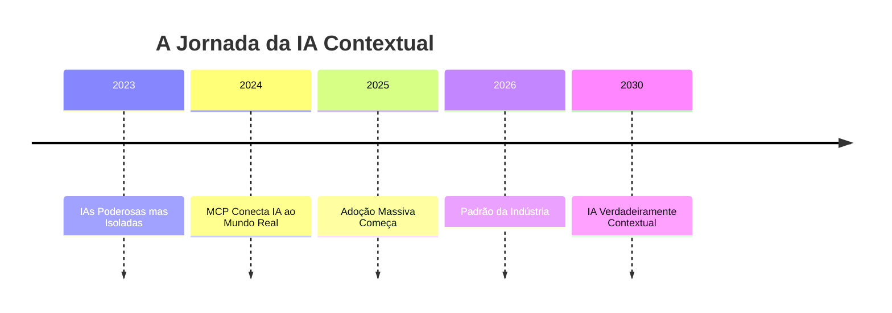

## Não é Sobre Tecnologia. É Sobre Possibilidades.

Quando você conecta inteligência artificial ao contexto real do seu negócio, você não está apenas implementando uma ferramenta - você está desbloqueando o verdadeiro potencial da IA.

### O Futuro Pertence a Quem Dá Contexto às Suas IAs

🚀 **Sua jornada começa agora.**

---

# Apêndice: Referência Rápida

## Comandos Essenciais

```bash
# Instalar MCP SDK
pip install mcp           # Python
npm install @mcp/sdk     # TypeScript

# Criar novo servidor
mcp init my-server       # Wizard interativo
mcp generate resource    # Gerar resource
mcp generate tool        # Gerar tool

# Testar servidor
mcp test                 # Testes unitários
mcp inspect             # Debug visual

# Deploy
mcp build               # Build para produção
mcp deploy             # Deploy automático
```

## Arquitetura Completa

```mermaid
graph TB
    subgraph "MCP Stack Completo"
        CLIENT[Cliente MCP] --> PROTO[Protocolo]
        PROTO --> SERVER[Servidor MCP]
        
        CLIENT --> C1[Claude Desktop]
        CLIENT --> C2[VS Code]
        CLIENT --> C3[Custom Apps]
        
        SERVER --> S1[Resources]
        SERVER --> S2[Tools]
        SERVER --> S3[Prompts]
        
        PROTO --> P1[JSON-RPC 2.0]
        PROTO --> P2[HTTP/SSE]
        PROTO --> P3[WebSocket]
    end
```

## Checklist de Implementação

### Dia 1: Setup

- [ ] Instalar SDKs necessários
- [ ] Configurar ambiente de desenvolvimento
- [ ] Rodar exemplo hello-world

### Semana 1: Primeiro Servidor

- [ ] Definir caso de uso
- [ ] Implementar servidor básico
- [ ] Testar com MCP Inspector
- [ ] Conectar ao Claude Desktop

### Mês 1: Produção

- [ ] Implementar autenticação
- [ ] Adicionar monitoring
- [ ] Documentar APIs
- [ ] Deploy em staging
- [ ] Testes de carga

### Trimestre 1: Escala

- [ ] Múltiplos servidores
- [ ] Otimizações de performance
- [ ] Integração com CI/CD
- [ ] Métricas de negócio
- [ ] Expansão do uso

---

# Contatos e Suporte

## Canais Oficiais

- 📧 **Email**: support@modelcontextprotocol.io
- 💬 **Discord**: [discord.gg/mcp](https://discord.gg/mcp)
- 🐦 **Twitter**: [@ModelContextPro](https://twitter.com/ModelContextPro)
- 📺 **YouTube**: [MCP Channel](https://youtube.com/@mcp)

## Suporte Enterprise

- 🏢 **Enterprise**: enterprise@mcp.io
- 📞 **Consultoria**: consulting@mcp.io
- 🎓 **Treinamento**: training@mcp.io

---

# A Revolução Começa com Você

MCP não é apenas mais uma tecnologia. É o catalisador que transforma IAs isoladas em assistentes verdadeiramente contextuais e úteis.

**A pergunta não é SE você vai adotar MCP.**  
**A pergunta é QUANDO.**

### Comece hoje. O futuro da IA contextual está sendo construído agora.

🚀 **[modelcontextprotocol.io](https://modelcontextprotocol.io/)** 🚀

---

# Obrigado!

## Próximos Passos

1. 📥 **[Baixe os Slides](https://slides.mcp.io/download)**
2. 🚀 **[Comece Seu Primeiro Servidor](https://start.mcp.io/)**
3. 👥 **[Junte-se à Comunidade](https://community.mcp.io/)**

### Vamos Construir o Futuro da IA Juntos!