# Model Context Protocol (MCP)

## O Adaptador Universal Para Aplicações de IA 🚀

---

![[Pasted image 20250507015044.png]]

---
# O Problema: IAs Desconectadas do Mundo Real 🔌

### "Quantas vezes você precisou pedir para sua IA acessar seus dados reais?" 🤔

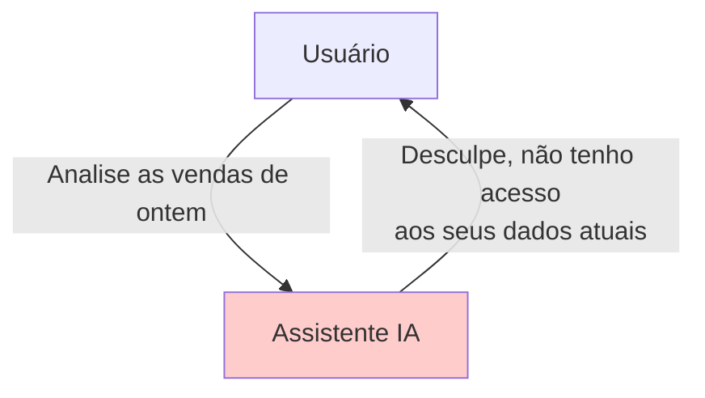

---

# O Que É o MCP?

O Model Context Protocol (MCP) é um padrão aberto que permite que aplicações de IA se conectem de forma padronizada com fontes de dados e ferramentas.

**Analogia:** MCP é como um adaptador USB-C para aplicações de IA:

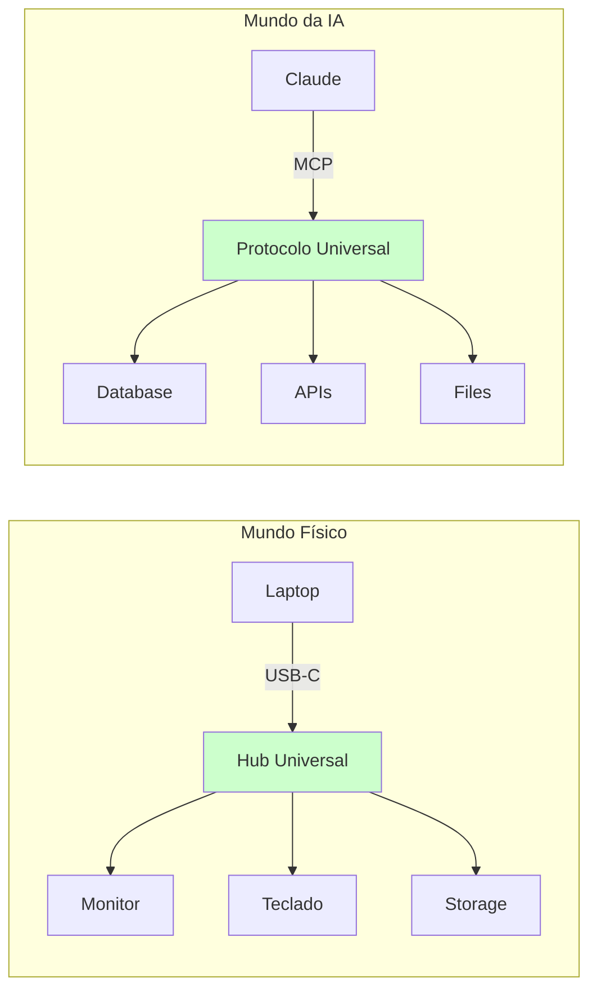

---

# MCP vs Function Calling: Qual a Diferença? 🤷‍♂️

## Function Calling Tradicional:

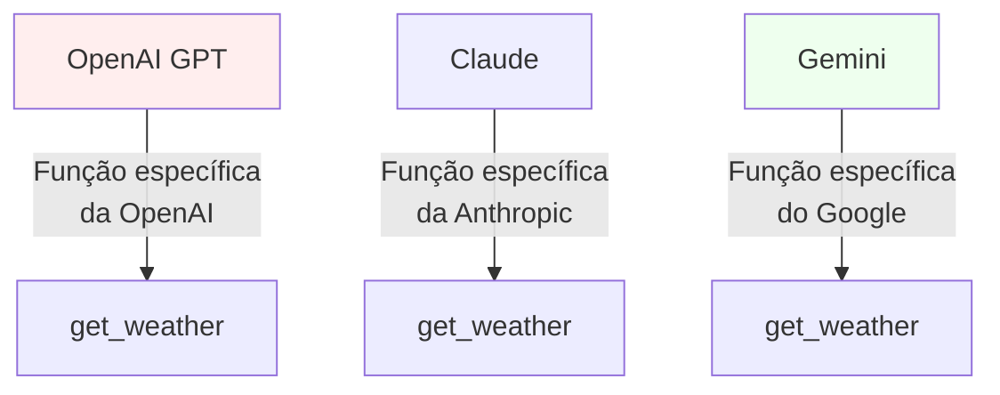

## Com MCP:

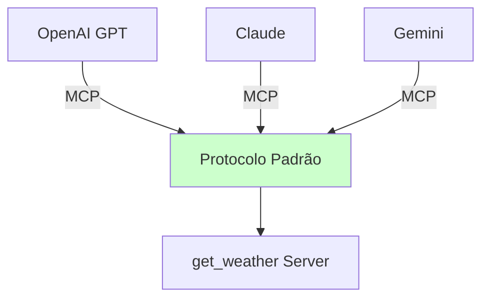

### Diferenças Chave:

- **Function Calling:** Específico de cada LLM, código duplicado
- **MCP:** Protocolo universal, uma implementação para todos

---

# O Mundo Antes e Depois do MCP

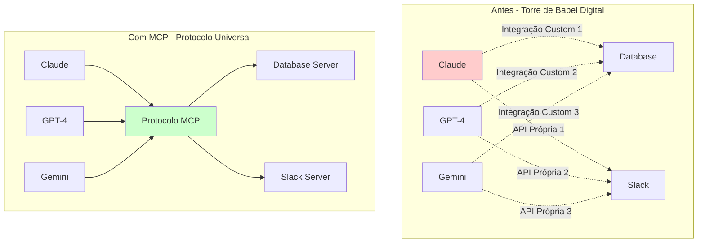

---

# Como Funciona na Prática? 🔧

## Os 3 Componentes Principais e Quem os Controla:

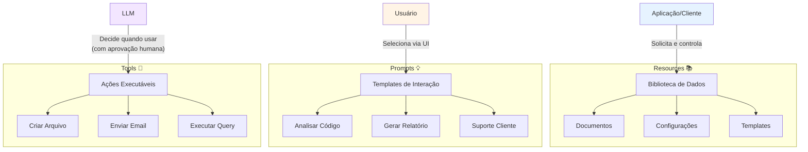

---

# Fluxo Detalhado: Quem Chama o Quê? 🔄

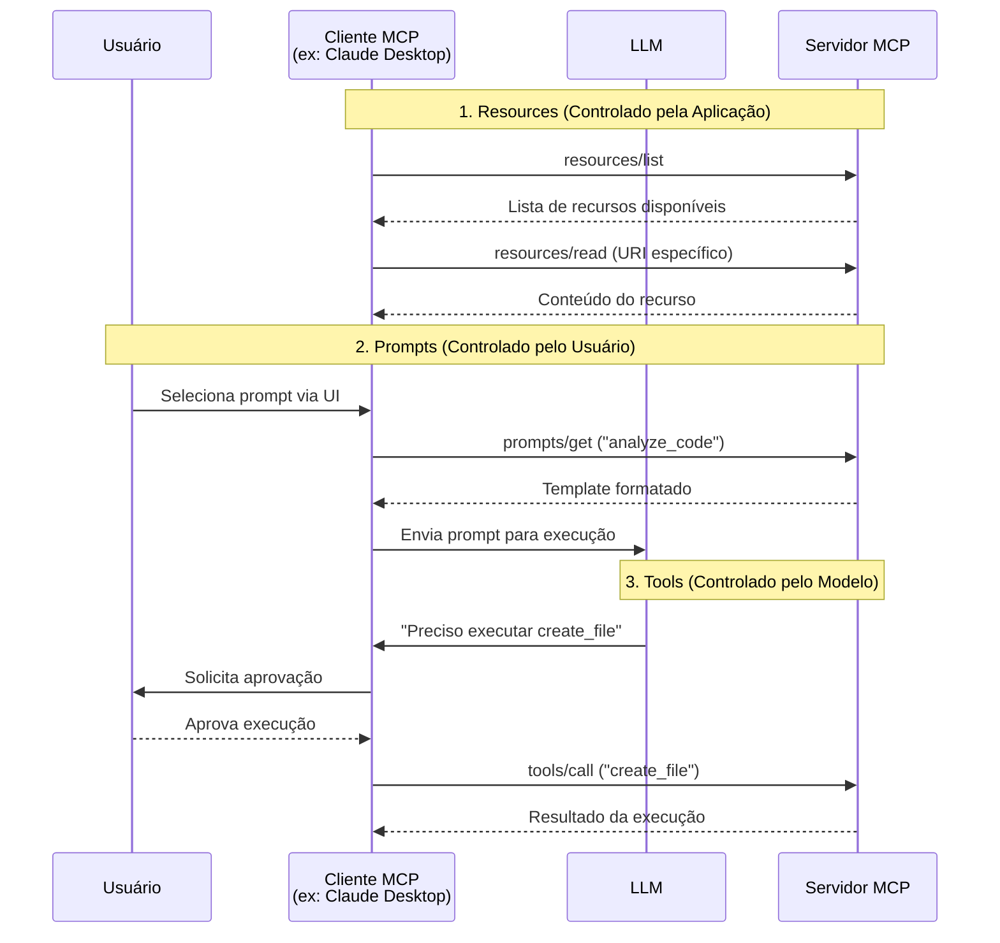

---

# Arquitetura MCP: Visão Completa

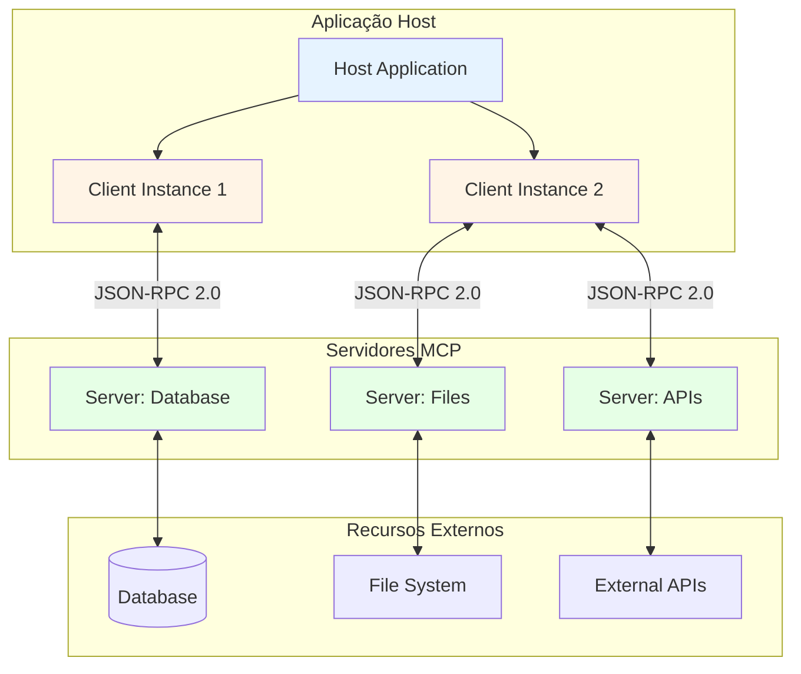

---

# Por Que MCP É Um Game Changer? 💡

## Para Executivos e Líderes de Produto:

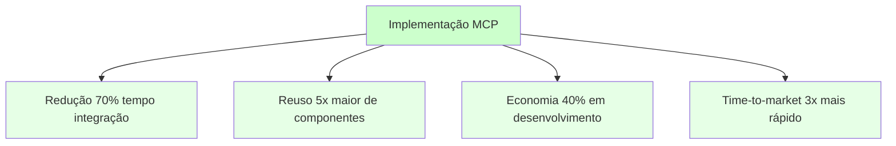

## Benefícios Tangíveis:

- **Interoperabilidade Total:** Troque de LLM sem reescrever integrações
- **Ecossistema Aberto:** Aproveite servidores criados pela comunidade
- **Redução de Vendor Lock-in:** Não fique preso a um único provedor
- **Escalabilidade Simplificada:** Adicione novos sistemas facilmente

---

# Caso de Uso Real: Sistema Financeiro 💰

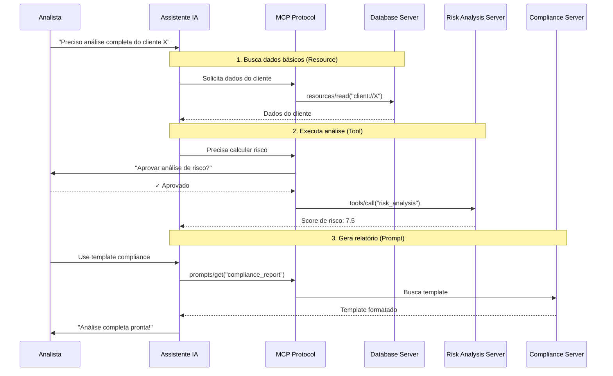

---

# Segurança e Controle no MCP 🔐

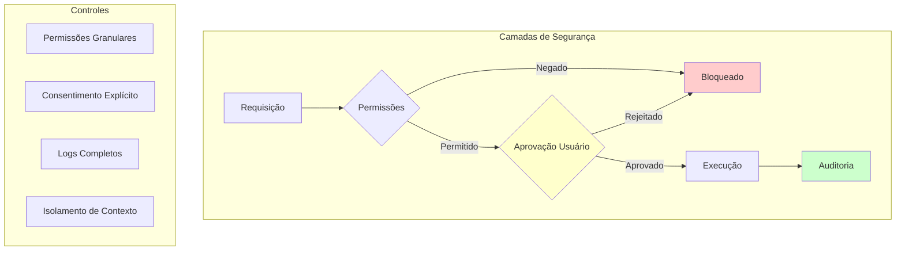

## Princípios de Segurança:

- **Controle do Usuário:** Nada acontece sem aprovação
- **Menor Privilégio:** Acesso apenas ao necessário
- **Auditoria Total:** Todas as ações são registradas
- **Isolamento:** Servidores não veem uns aos outros

---

# Ecossistema MCP em Crescimento 🌱

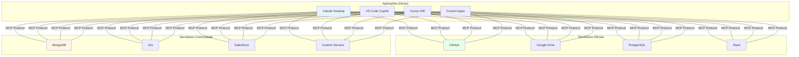

---

# Casos de Uso Por Indústria 🏭

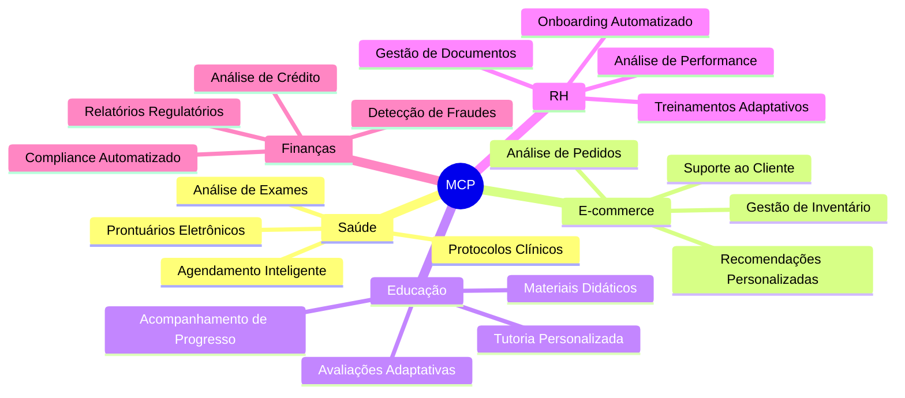

---

# Quick Start: Comece Hoje! 🚀

## Para Desenvolvedores:

```bash
# 1. Clone exemplos
git clone https://github.com/modelcontextprotocol/servers

# 2. Escolha sua linguagem
cd servers/python/hello-world
# ou
cd servers/typescript/hello-world

# 3. Instale e execute
npm install && npm start
# ou
pip install -r requirements.txt && python server.py
```

## Para Empresas:

1. **Identifique:** 3 sistemas críticos para integrar
2. **Piloto:** Comece com 1 servidor básico
3. **Meça:** Tempo economizado, redução de erros
4. **Escale:** Expanda para outros sistemas

---

# ROI Mensurável: Números Reais 📊

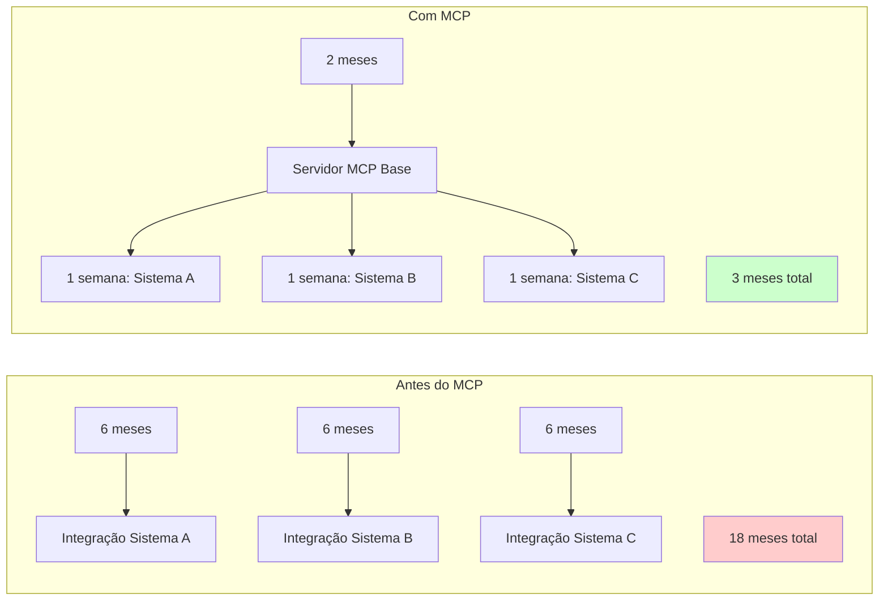

## Economia Real:

- **Tempo:** 83% de redução
- **Custo:** 75% menor
- **Manutenção:** 90% mais simples
- **Reutilização:** 100% entre projetos

---

# Roadmap MCP: O Futuro 🔮

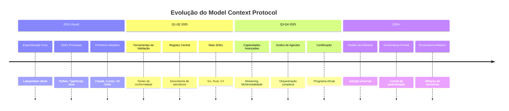

---

# Comparação: MCP vs Alternativas 📊

|Característica|MCP|Function Calling|APIs REST|LangChain|
|---|---|---|---|---|
|**Padronização**|✅ Universal|❌ Por LLM|❌ Por serviço|❌ Framework específico|
|**Interoperabilidade**|✅ Total|❌ Limitada|❌ Nenhuma|❌ Parcial|
|**Complexidade**|✅ Baixa|✅ Baixa|⚠️ Média|❌ Alta|
|**Ecossistema**|✅ Crescente|⚠️ Fragmentado|✅ Maduro|✅ Rico|
|**Vendor Lock-in**|✅ Nenhum|❌ Alto|⚠️ Médio|⚠️ Médio|
|**Curva de Aprendizado**|✅ Suave|✅ Suave|⚠️ Variável|❌ Íngreme|

---

# Implementação Prática: Passo a Passo 👨‍💻

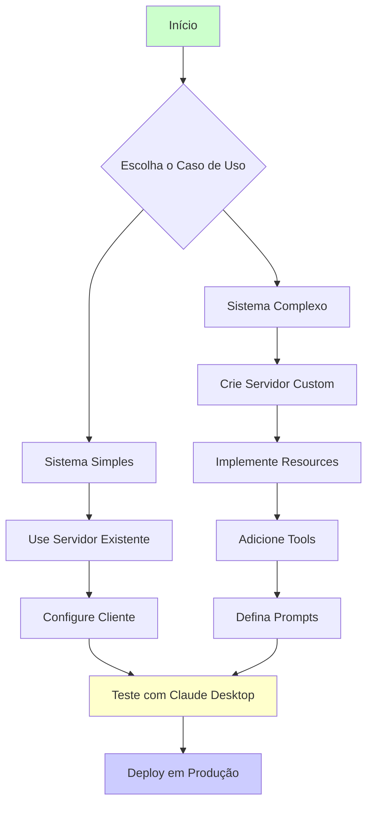

---

# Perguntas Frequentes (FAQ) ❓

## Para Executivos:

**Q: Quanto tempo leva para implementar?**  
A: Servidor básico: 1-2 semanas. Sistema completo: 1-3 meses.

**Q: Preciso mudar toda minha arquitetura?**  
A: Não! MCP é aditivo, não substitui sistemas existentes.

**Q: E a segurança dos meus dados?**  
A: Controle total permanece com você. MCP apenas padroniza acesso.

## Para Desenvolvedores:

**Q: Posso usar com meu LLM atual?**  
A: Sim! MCP é agnóstico a modelo.

**Q: Preciso reescrever integrações existentes?**  
A: Não necessariamente. Pode encapsular código existente.

**Q: Qual linguagem devo usar?**  
A: Python e TypeScript têm melhor suporte atualmente.

---

# Chamada Para Ação: Próximos Passos 🎯

## Para Líderes:

> "Identifique 3 sistemas críticos e inicie um piloto MCP em 30 dias"

## Para Desenvolvedores:

> "Construa seu primeiro servidor MCP hoje - leva apenas 30 minutos!"

## Para Todos:

> "Junte-se à revolução das integrações de IA padronizadas"

### Recursos Essenciais:

- 📚 **Documentação:** [modelcontextprotocol.io](https://modelcontextprotocol.io/)
- 💻 **GitHub:** [github.com/modelcontextprotocol](https://github.com/modelcontextprotocol)
- 🛠️ **Exemplos:** [github.com/modelcontextprotocol/servers](https://github.com/modelcontextprotocol/servers)
- 💬 **Comunidade:** [Discord MCP](https://discord.gg/mcp)

---

# O Futuro é Padronizado e Interoperável 🌟

> "MCP não é apenas um protocolo - é a fundação para o futuro das aplicações de IA verdadeiramente conectadas ao mundo real."

### Comece sua jornada MCP hoje!

**Contato:** [seu-email@empresa.com]  
**Versão:** 2.0 - Dezembro 2024