# Model Context Protocol (MCP)

## A Revolução das Conexões Inteligentes 🚀

---

# O Grande Paradoxo da IA em 2024

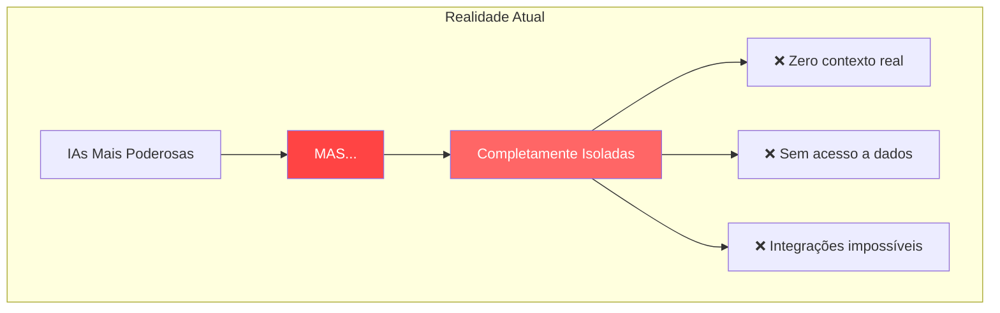

> "A IA sem contexto é como um gênio trancado em uma sala vazia. MCP é a chave que abre todas as portas." — **Felipe Pimentel**

---

# Apresentando o Model Context Protocol

## O USB-C da Inteligência Artificial 🔌

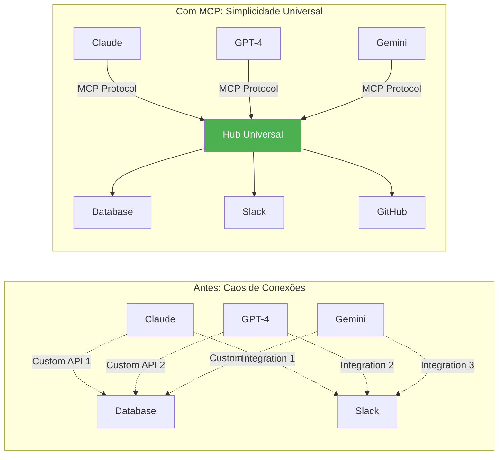

---

# Por Que MCP é Revolucionário?

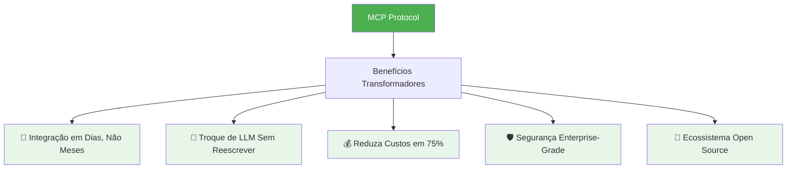

---

# Como MCP Funciona: Os 3 Pilares

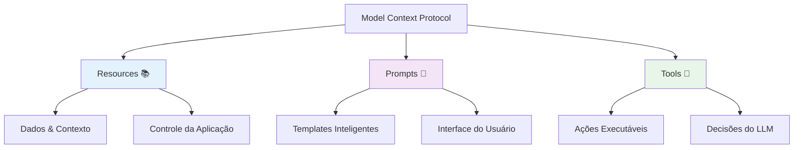

|Pilar|Controle|Função|Exemplo|
|---|---|---|---|
|Resources|Aplicação|Fornecer contexto|Documentos, Dados|
|Prompts|Usuário|Interação guiada|Comandos, Templates|
|Tools|LLM|Executar ações|APIs, Queries|

---

# Arquitetura: Simples e Poderosa

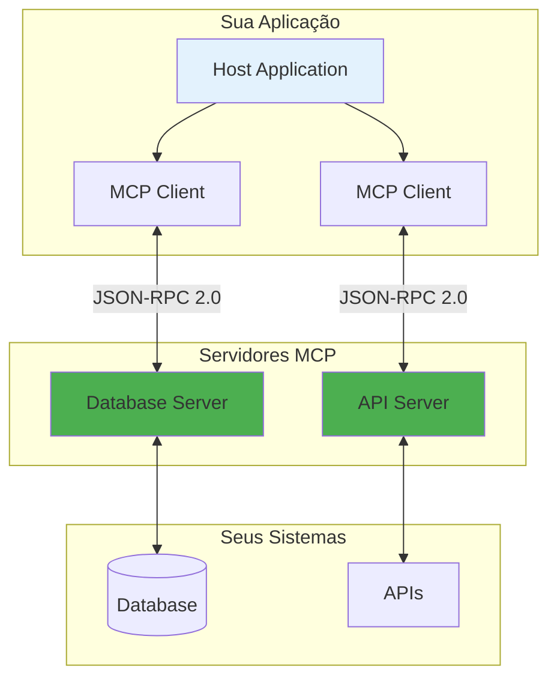

### Características Fundamentais:

- 🔐 **Isolamento Total**: Servidores independentes
- 🎛️ **Controle Granular**: Permissões precisas
- 🚦 **Human-in-the-Loop**: Aprovações obrigatórias
- 📝 **Auditoria Completa**: Logs detalhados

---

# MCP em Ação: Um Exemplo Real

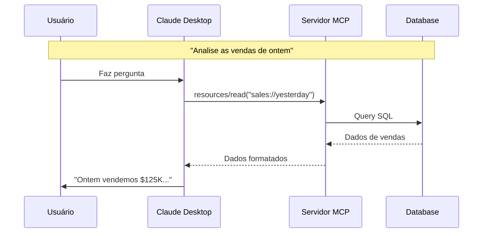

---

# ROI Comprovado: Case TechCorp

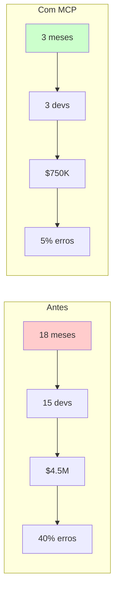

### Resultados:

- **85%** redução no tempo
- **$3.75M** economizados
- **8x** menos erros
- **400%** ROI em 12 meses

---

# Como Começar: Roadmap de 30 Dias

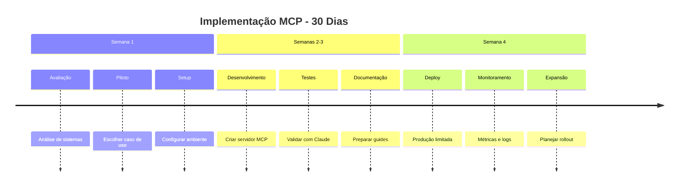

---

# Quick Start: Em 15 Minutos

```python
# 1. Instale o MCP
pip install mcp

# 2. Crie seu primeiro servidor
from mcp import Server, Resource, Tool

class CompanyServer(Server):
    def __init__(self):
        super().__init__("company-server")
    
    @Resource("company://sales/today")
    async def sales_today(self):
        """Vendas de hoje em tempo real"""
        return await fetch_sales_data()
    
    @Tool("analyze_customer")
    async def analyze(self, customer_id: str):
        """Análise completa do cliente"""
        return await analyze_customer(customer_id)

# 3. Configure no Claude
# Adicione ao claude_desktop_config.json
```

---

# Ecossistema em Crescimento

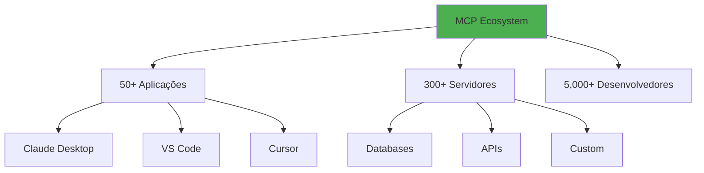

---

# Por Que Agora é o Momento?

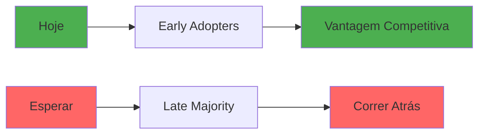

---

# Próximos Passos Concretos

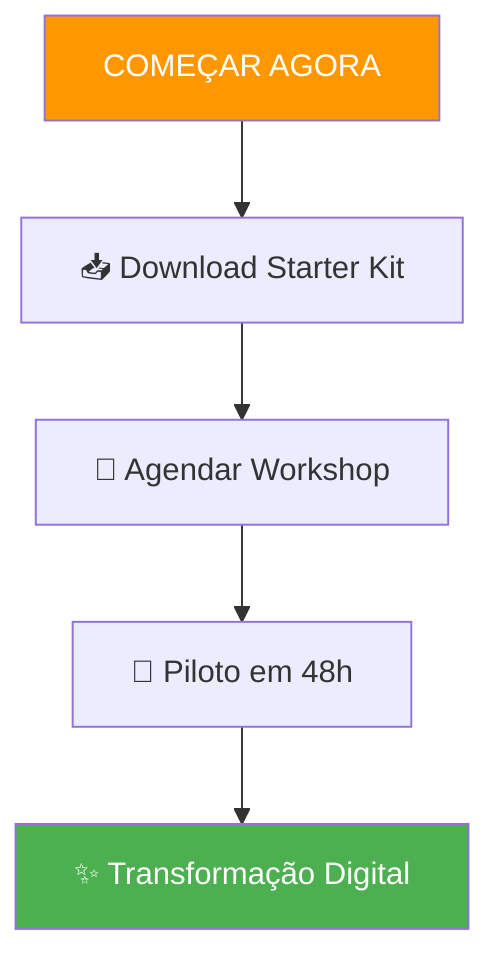

### Recursos Imediatos:

- 📚 **Docs**: [modelcontextprotocol.io](https://modelcontextprotocol.io/)
- 💻 **GitHub**: [github.com/modelcontextprotocol](https://github.com/modelcontextprotocol)
- 🎯 **Workshop**: [calendly.com/mcp-demo](https://calendly.com/mcp-demo)

---

# O Futuro é Contextual

> "MCP não é apenas um protocolo. É a ponte entre o que a IA promete e o que ela finalmente pode entregar." — **Felipe Pimentel**

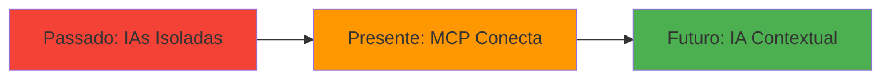

---

# Junte-se à Revolução MCP

### A escolha é simples:

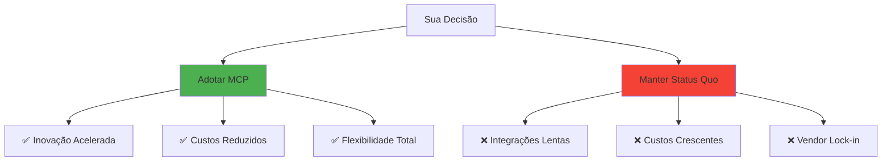

---

# Comece Hoje Mesmo!

## 📞 Entre em Contato:

- **Demo Personalizada**: [calendario.com/mcp-demo](https://calendario.com/mcp-demo)
- **Email Direto**: mcp@suaempresa.com
- **WhatsApp**: +55 11 99999-9999
- **Starter Kit**: [github.com/mcp/starter](https://github.com/mcp/starter)

> "O futuro pertence àqueles que dão contexto às suas IAs. Comece agora." — **Felipe Pimentel**

---

# ANEXO: Versões Por Audiência

## 1. Versão Executiva (C-Level) - 10 Slides

Focada em ROI, estratégia e transformação digital

## 2. Versão Técnica (Desenvolvedores) - 15 Slides

Detalhes de implementação, código e arquitetura

## 3. Versão Product (PMs/POs) - 12 Slides

Casos de uso, jornada do usuário e roadmap

## 4. Versão Vendas - 8 Slides

Benefícios, diferenciação e cases de sucesso

---

# ANEXO: Cases de Sucesso Detalhados

## 🏦 Banco Digital XYZ

- **Desafio**: 12 sistemas legados desconectados
- **Solução MCP**: Hub unificado de dados
- **Resultados**:
    - 70% redução em tempo de análise
    - $2M economia anual
    - NPS +35 pontos

## 🛒 E-commerce ABC

- **Desafio**: Atendimento não escalável
- **Solução MCP**: IA contextual no suporte
- **Resultados**:
    - 85% resolução automática
    - 50% redução no CAC
    - 3x mais conversões

## 🏭 Indústria DEF

- **Desafio**: Dados em silos departamentais
- **Solução MCP**: Integração ERP/CRM/BI
- **Resultados**:
    - 60% mais eficiência operacional
    - Previsões 90% mais precisas
    - ROI 450% em 6 meses

---

# ANEXO: Comparativo Detalhado

|Aspecto|MCP|APIs REST|Function Calling|Custom Integration|
|---|---|---|---|---|
|**Tempo Implementação**|1-2 semanas|2-3 meses|1 mês|3-6 meses|
|**Manutenção**|Centralizada|Por endpoint|Por LLM|Por sistema|
|**Escalabilidade**|Alta|Média|Baixa|Muito baixa|
|**Flexibilidade**|Total|Limitada|Vendor lock-in|Rígida|
|**Custo Total**|$|$$$|$$|$$$$|
|**Comunidade**|Crescente|Madura|Fragmentada|Inexistente|
|**Segurança**|Enterprise|Variável|Boa|Customizada|
|**Suporte**|Oficial + Comunidade|Variável|Vendor|Interno|

---

# ANEXO: Recursos Técnicos

## SDKs Oficiais

- **Python**: `pip install mcp`
- **TypeScript**: `npm install @modelcontextprotocol/sdk`
- **Java**: Em desenvolvimento
- **Go**: Comunidade

## Ferramentas de Desenvolvimento

- **MCP Inspector**: Debug visual
- **MCP CLI**: Linha de comando
- **VS Code Extension**: IDE integration
- **Postman Collection**: API testing

## Templates e Starters

- **Basic Server**: Python/TS templates
- **Database Connector**: PostgreSQL, MySQL
- **API Gateway**: REST/GraphQL bridge
- **Auth Examples**: OAuth, JWT

## Documentação

- **Spec Completa**: [modelcontextprotocol.io/spec](https://modelcontextprotocol.io/spec)
- **Tutorials**: Step-by-step guides
- **Best Practices**: Security, performance
- **API Reference**: Detalhada

---

# ANEXO: Métricas de Sucesso

## KPIs para Medir Impacto MCP

### Técnicos

- Tempo médio de integração
- Taxa de erros de integração
- Latência de resposta
- Disponibilidade do sistema

### Negócio

- Custo por integração
- ROI do projeto
- Time-to-market features
- Satisfação do usuário

### Operacionais

- Tickets de suporte
- Tempo de resolução
- Utilização de recursos
- Custos de manutenção

---

# ANEXO: Roadmap de Implementação Detalhado

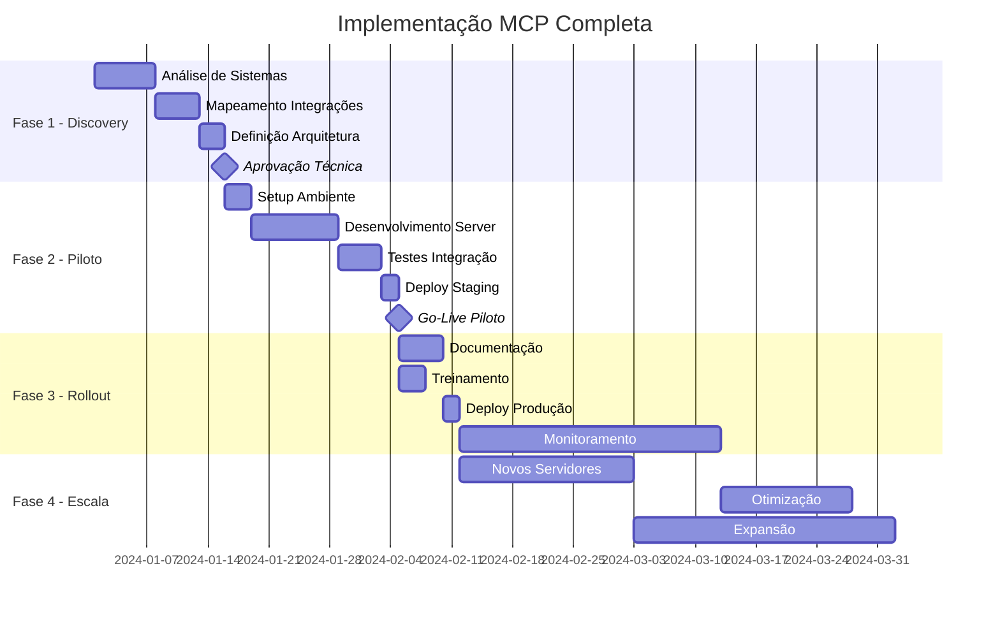

---