# Model Context Protocol (MCP)

## O Adaptador Universal Para Aplicações de IA

---

# Quantas vezes você precisou pedir para sua IA acessar seus dados reais? 🤔

---

# O Que É o MCP?

O Model Context Protocol (MCP) é um padrão que permite que aplicações de IA se conectem com fontes de dados e ferramentas. Ele facilita a integração entre modelos de linguagem e sistemas externos.

Pense no MCP como um adaptador universal para aplicações de IA, similar ao que o USB-C é para dispositivos físicos:

- **Um protocolo universal** para conectar aplicações de IA a diferentes fontes de dados e ferramentas
- **Elimina integrações customizadas** para cada combinação de IA e dados/ferramentas
- **Padroniza a comunicação** entre todos os componentes
- **Possibilita interoperabilidade** em todo o ecossistema de IA

---

# O Mundo Antes e Depois do MCP

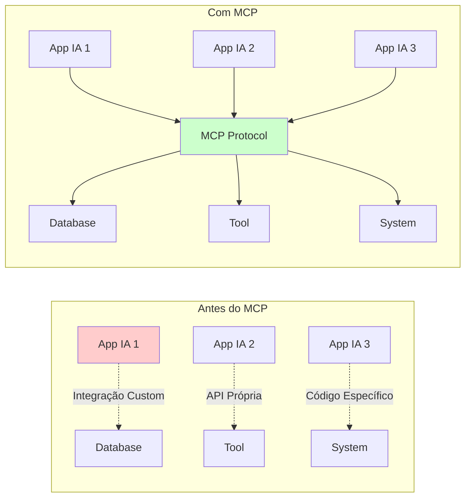

---

# O Desafio das IAs Isoladas

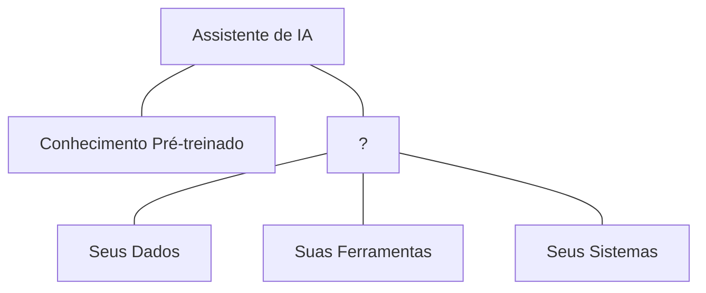

- LLMs não têm acesso nativo aos seus sistemas e dados específicos
- Respostas baseadas em dados de treinamento podem estar desatualizadas ou ser genéricas
- Sem capacidade de executar ações em sistemas externos
- Compreensão contextual limitada do seu ambiente específico

---

# O Problema da Torre de Babel Digital

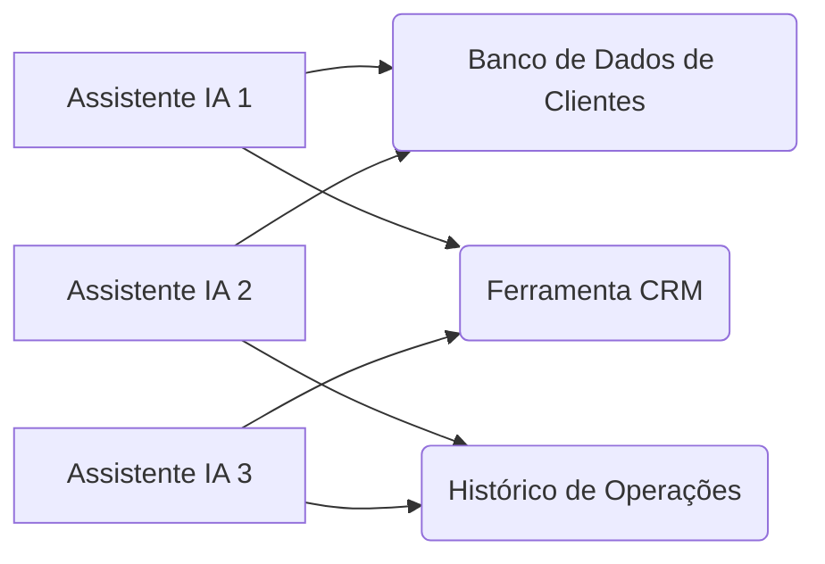

- **Esforço duplicado:** A mesma conexão é recriada múltiplas vezes
- **Inconsistência:** Diferentes padrões para cada integração
- **Custos elevados:** Mudanças em um sistema exigem múltiplas atualizações
- **Escalabilidade ruim:** Adicionar novos assistentes de IA se torna cada vez mais complexo

---

# MCP Como Solução Universal

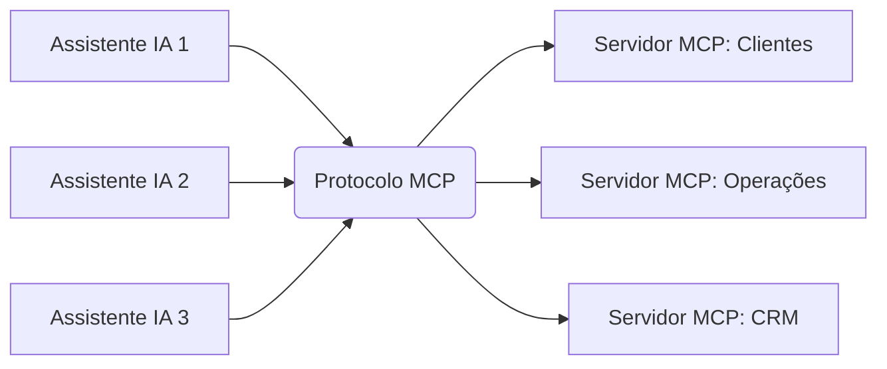

- Todos os assistentes de IA falam a mesma "língua"
- Reutilização de servidores entre aplicações
- Interoperabilidade entre diferentes LLMs
- Padronização de integrações facilita manutenção e expansão

---

# Arquitetura MCP: Cliente-Servidor

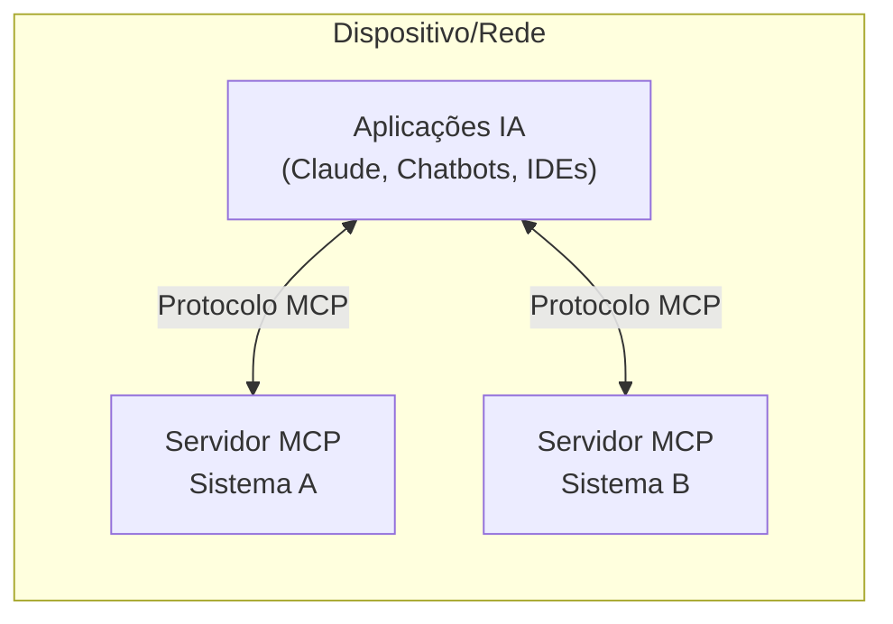

## Os Três Pilares do MCP

1. **MCP Hosts (Clientes):** Aplicações que incorporam LLMs
2. **MCP Servers (Servidores):** Fornecem acesso a sistemas específicos
3. **O Protocolo MCP:** A "língua comum" entre hosts e servidores

---

# O Ecossistema MCP em Crescimento

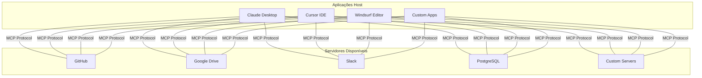

---

# Conceitos Fundamentais: Core Architecture

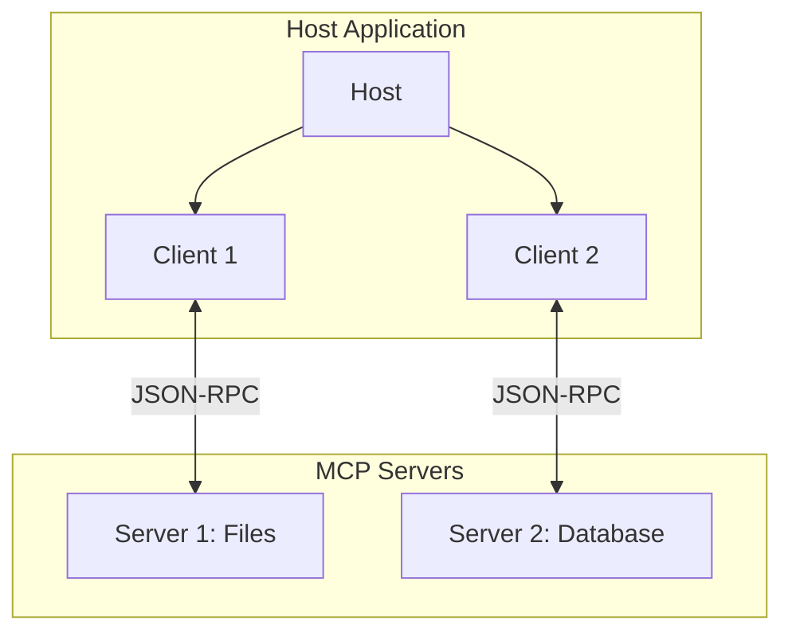

- **Hosts:** Aplicações LLM que iniciam conexões (ex: Claude Desktop)
- **Clients:** Conectores dentro do host para cada servidor
- **Servers:** Serviços que fornecem contexto e capacidades
- **Protocolo:** Baseado em JSON-RPC 2.0 para comunicação

---

# Conceitos Fundamentais: Transports

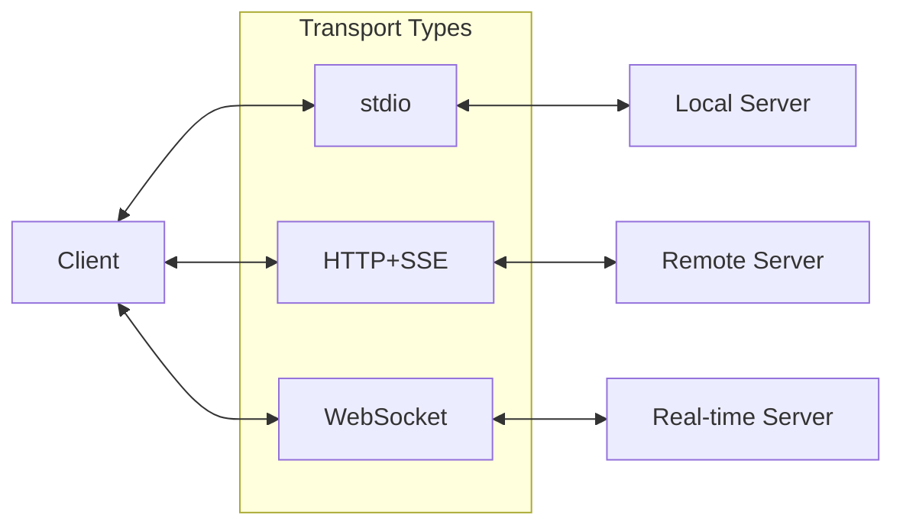

- **stdio:** Comunicação via entrada/saída padrão (processos locais)
- **HTTP+SSE:** Server-Sent Events para comunicação remota
- **Customizados:** Protocolos específicos para necessidades especiais
- Definem como as mensagens são transmitidas entre cliente e servidor

---

# Conceitos Fundamentais: Resources

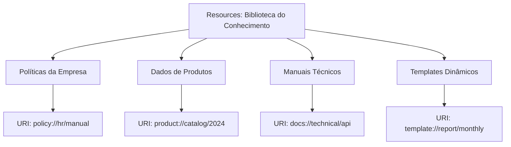

- "Fontes de conhecimento" que o LLM pode consultar
- Identificados por URIs únicos para cada recurso
- Suportam conteúdo texto ou binário (imagens, PDFs)
- Templates dinâmicos para recursos parametrizados
- Permitem subscrições para atualizações em tempo real

---

# Conceitos Fundamentais: Prompts

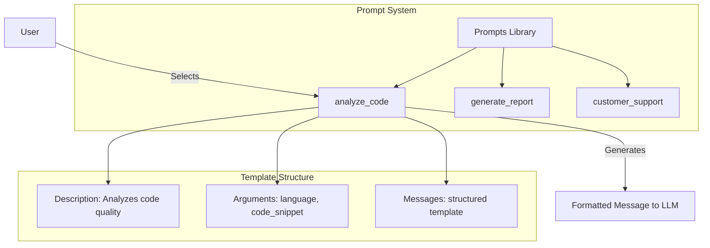

- **Templates pré-definidos** que guiam interações com LLM
- **Controlados pelo usuário** via interface (slash commands, menus)
- **Argumentos dinâmicos** personalizáveis para cada uso
- **Mensagens estruturadas** garantem consistência
- **Reutilizáveis** entre diferentes aplicações e contextos

---

# Conceitos Fundamentais: Tools

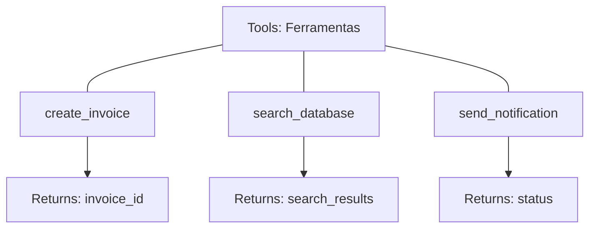

- Funções executáveis que o LLM pode chamar
- Controladas pelo modelo (com aprovação humana)
- Definem esquemas de entrada/saída
- Permitem ações no mundo real

---

# Conceitos Fundamentais: Sampling

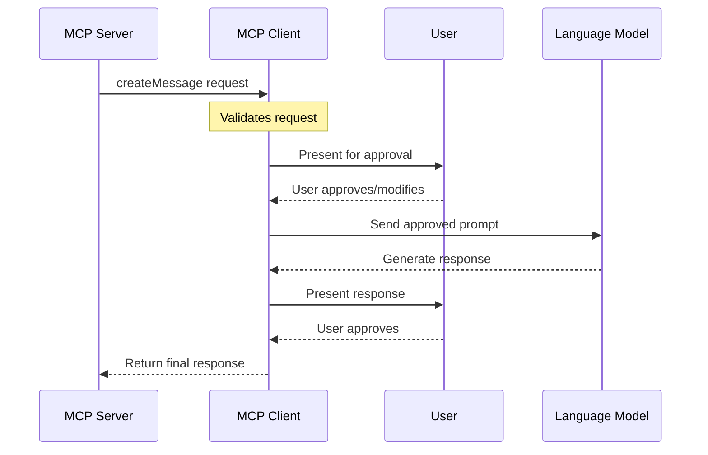

- **Fluxo inverso:** Servidor solicita geração de conteúdo do LLM
- **Controle humano:** Cliente mantém aprovação sobre requisições
- **Capacidades agênticas:** Permite comportamentos autônomos
- **Segurança:** Usuário sempre no controle do processo
- **Flexibilidade:** Servidor pode implementar lógicas complexas

---

# Conceitos Fundamentais: Roots

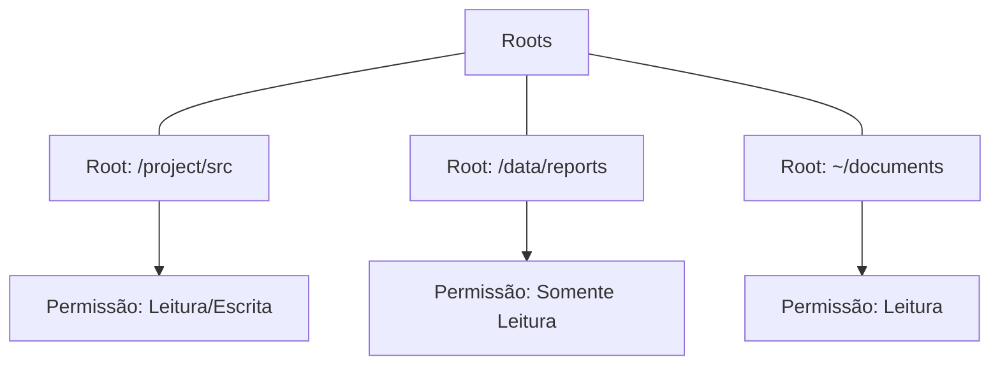

- Definem "territórios" onde servidores podem operar
- Controlam acesso ao sistema de arquivos
- Implementam princípio de menor privilégio
- Cliente controla quais roots expor

---

# Segurança e Controle no MCP 🔐

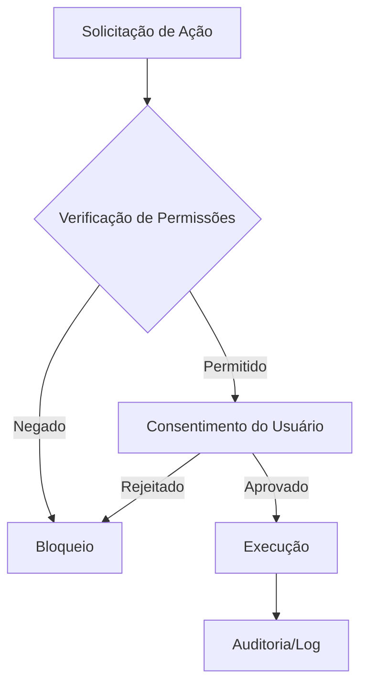

- **Permissões granulares** por servidor e recurso
- **Consentimento explícito** do usuário para ações sensíveis
- **Auditoria completa** de todas as operações
- **Isolamento de contextos** entre diferentes servidores

---

# Como o MCP Funciona na Prática

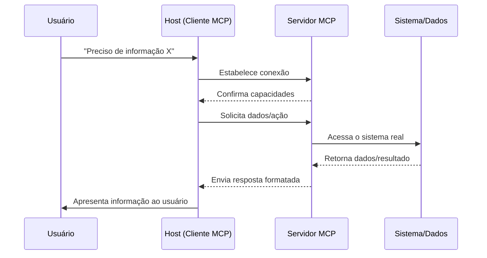

---

# MCP vs Outras Soluções

|Solução|Prós|Contras|Quando Usar|
|---|---|---|---|
|APIs REST|Simples, universal|Sem padronização AI|Integrações pontuais|
|LangChain|Rico em features|Complexo, acoplado|Projetos específicos|
|MCP|Padronizado, interoperável|Emergente|Ecossistemas AI|

---

# Casos de Uso Por Indústria

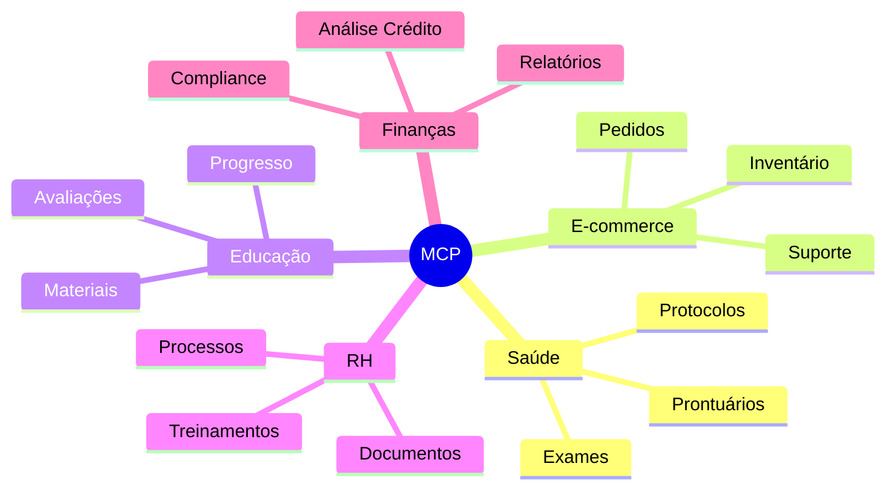

---

# MCP na Prática: Setor Financeiro

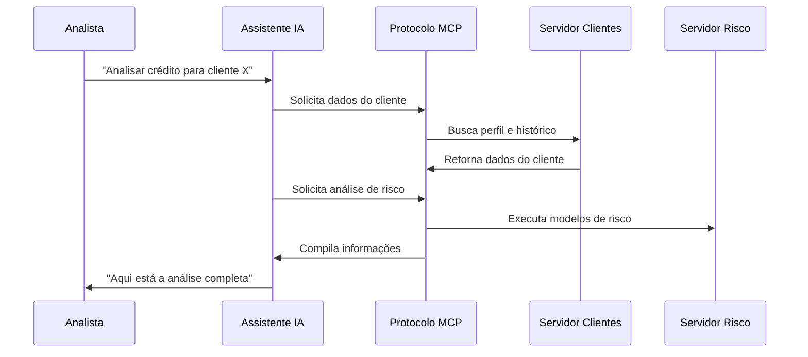

---

# ROI e Métricas de Negócio 💰

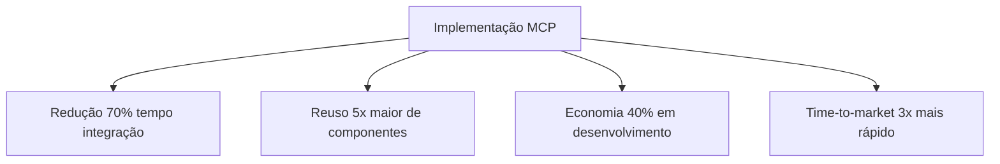

## Impacto Mensurável:

- **Produtividade:** Desenvolvedores focam em lógica de negócio, não em integrações
- **Escalabilidade:** Novos assistentes conectam instantaneamente a sistemas existentes
- **Manutenção:** Uma mudança no servidor atualiza todas as aplicações
- **Inovação:** Experimentação rápida com novos casos de uso

---

# Quick Start: Seu Primeiro Servidor MCP 🚀

## Começando em 3 Passos:

1. Clone o repositório de exemplos:
    
    ```
    git clone https://github.com/felipepimentel/P0001-samples-mcp
    ```
    
2. Escolha um exemplo (Python, TypeScript, Java)
3. Siga as instruções do README

## Exemplos Disponíveis:

- **Hello World:** Servidor básico funcional
- **Database:** Integração com banco de dados
- **API Client:** Consumo de APIs externas
- **File System:** Manipulação de arquivos

📚 **Todos os exemplos em:** [github.com/felipepimentel/P0001-samples-mcp](https://github.com/felipepimentel/P0001-samples-mcp)

---

# Roadmap do MCP: O Que Está Por Vir

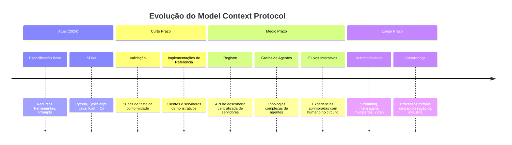

---

# Como Começar com MCP Hoje

## 🛠️ Para Desenvolvedores:

1. Escolha seu SDK preferido (Python/TypeScript/Java)
2. Clone um exemplo de servidor do GitHub
3. Customize para seu caso de uso
4. Teste com Claude Desktop

## 🏢 Para Empresas:

1. Identifique 3 sistemas críticos para integrar
2. Faça um piloto com 1 servidor básico
3. Meça resultados (tempo, custos, satisfação)
4. Escale gradualmente para outros sistemas

---

# Recursos Para Aprofundamento

- **Documentação Oficial:** [modelcontextprotocol.io](https://modelcontextprotocol.io/)
- **GitHub:** [github.com/modelcontextprotocol](https://github.com/modelcontextprotocol)
- **Especificação Técnica:** [spec.modelcontextprotocol.io](https://spec.modelcontextprotocol.io/)
- **Exemplos de Código:** [github.com/felipepimentel/P0001-samples-mcp](https://github.com/felipepimentel/P0001-samples-mcp)
- **Comunidade:** [Discord MCP](https://discord.gg/mcp)

---

# Chamada Para Ação 🎯

## Desenvolvedores:

> "Construa seu primeiro servidor MCP em 30 minutos e conecte sua aplicação favorita!"

## Gestores e Líderes:

> "Identifique 3 sistemas na sua empresa que poderiam se beneficiar do MCP e comece um piloto!"

## Todos:

> "Junte-se à comunidade MCP e ajude a moldar o futuro das integrações de IA!"

---

# Obrigado!

> 💼 Apresentação sobre Model Context Protocol (MCP)

> A revolução das integrações de IA está apenas começando. Seja parte dela!

> Junho 2024