# Model Context Protocol (MCP)

## O Padrão Universal Para Conectar IA ao Mundo Real 🚀

---

# A Era da IA Desconectada Chegou ao Fim

### "Suas IAs ainda vivem em uma bolha?" 🫧

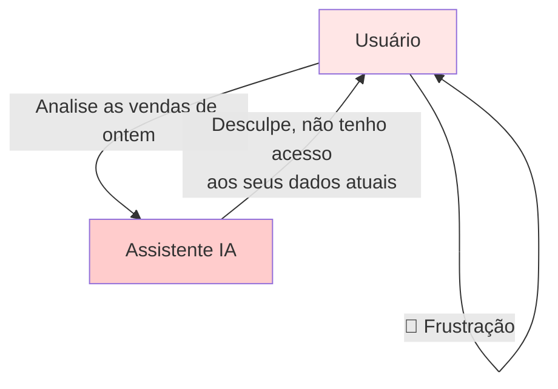

> **O Problema:** IAs poderosas, mas cegas para o contexto real do seu negócio

---

# Os Desafios Atuais da Integração IA

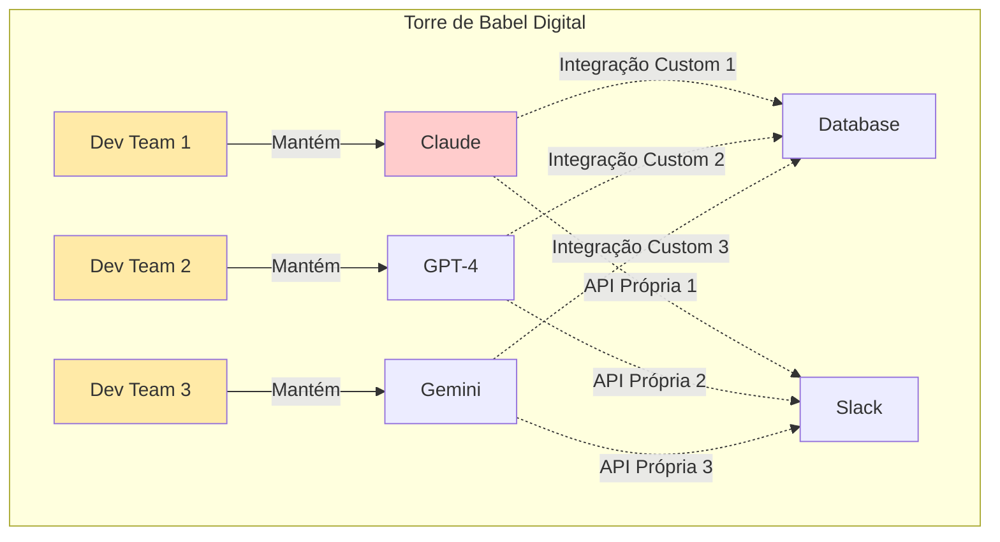

### Os Custos Ocultos:

- 🕒 **6 meses** para cada nova integração
- 💸 **$500K+** por sistema conectado
- 🔄 **3x retrabalho** ao trocar de LLM
- 🐛 **40% dos bugs** vêm de integrações

---


"Sem MCP, sua IA é apenas um cérebro sem corpo. Com MCP, ela ganha olhos, ouvidos e mãos." — **Felipe Pimentel**

---

# Apresentando o Model Context Protocol

## O USB-C da Inteligência Artificial 🔌

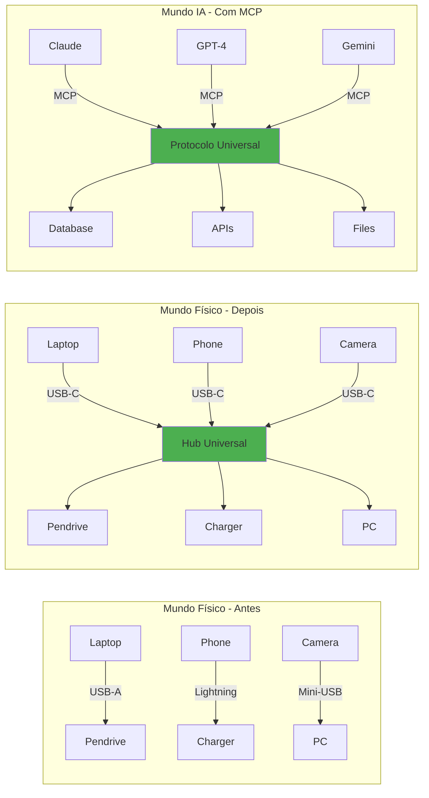

> **MCP:** Um protocolo aberto que padroniza como IAs se conectam a dados e ferramentas

---

# Por Que MCP é Diferente?

## MCP vs Function Calling vs APIs Tradicionais

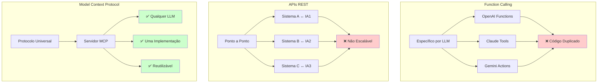

---

# Como Funciona o MCP?

## Os 3 Pilares Fundamentais

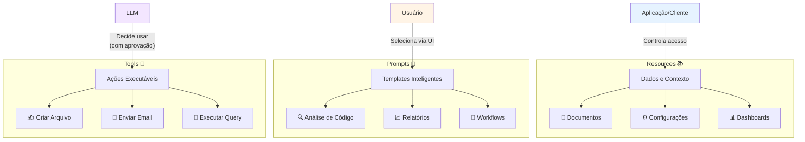

---

# Arquitetura MCP: Simples e Poderosa

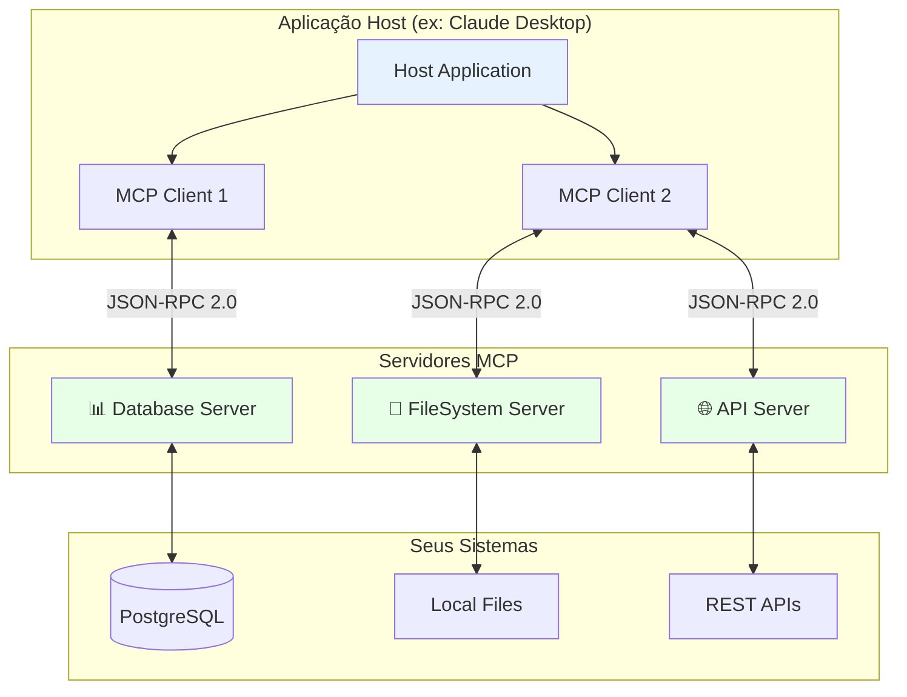

### Características Principais:

- 🔐 **Isolamento Total**: Servidores não se veem
- 🎛️ **Controle Granular**: Permissões por recurso
- 🚦 **Aprovação Humana**: Nada acontece sem consentimento
- 📝 **Auditoria Completa**: Todas ações registradas

---

# Fluxo Detalhado: Como Tudo se Conecta

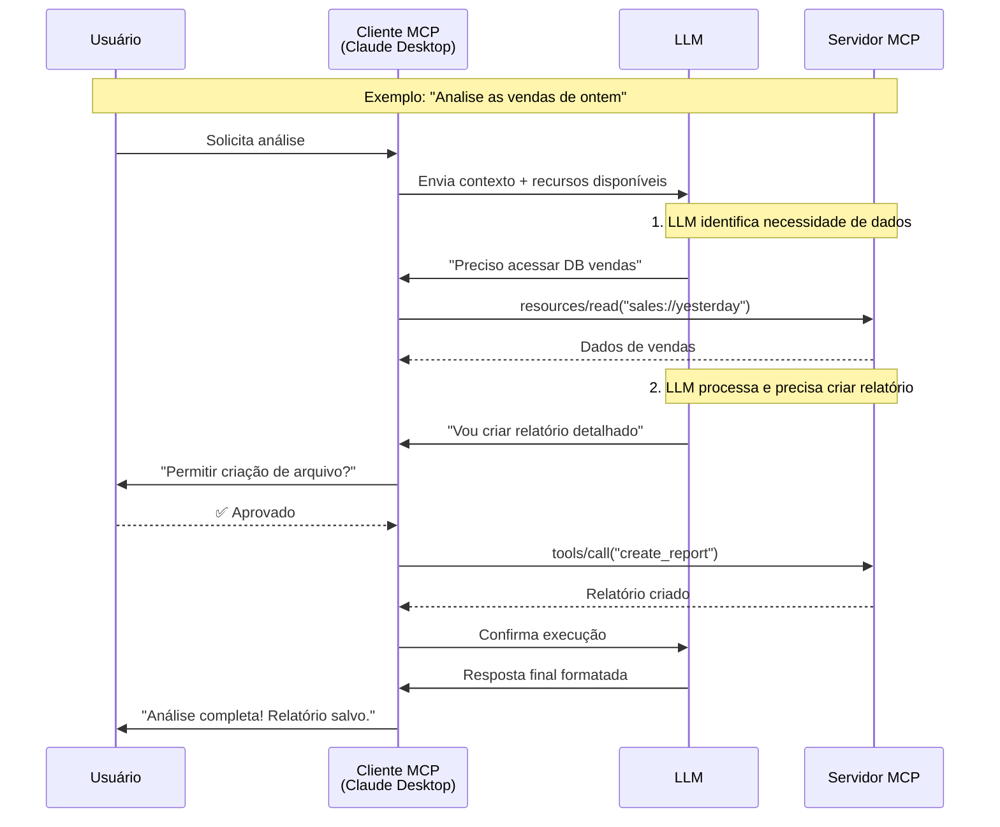

---

# Sua Empresa Precisa do MCP?

## Framework de Decisão

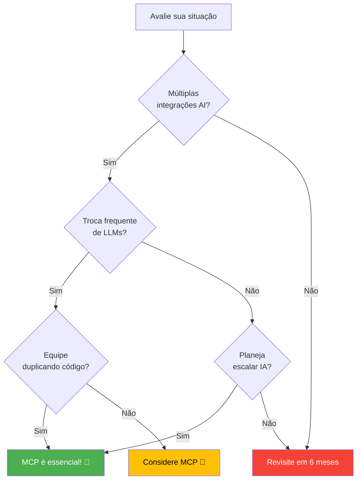

---

# Case Study: TechCorp - Transformação Real

## De 18 Meses Para 3 Meses 📈

### Contexto

- **Empresa**: TechCorp Financial Services
- **Funcionários**: 10.000
- **Desafio**: 15 sistemas legados, 3 LLMs diferentes
- **Problema**: 6 meses por integração

### Implementação MCP (Timeline)

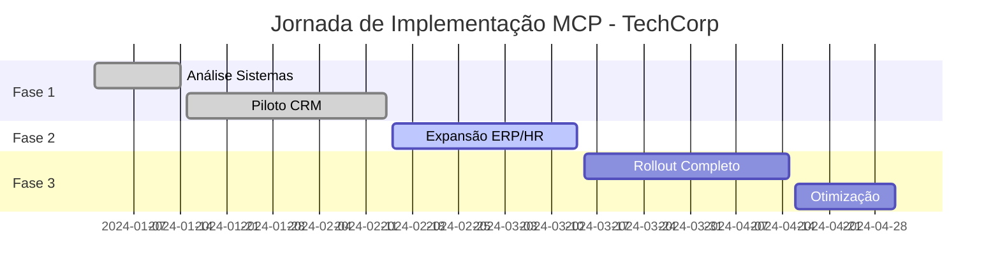

### Resultados Mensuráveis

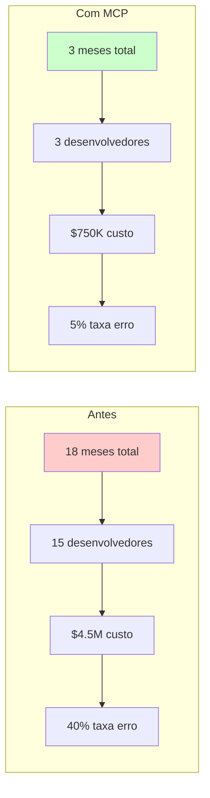

### ROI Alcançado:

- **85%** redução tempo integração
- **$3.75M** economizados
- **8x** menos erros
- **ROI**: 400% em 12 meses

---

# Performance e Custos: Números Reais

## Métricas de Performance

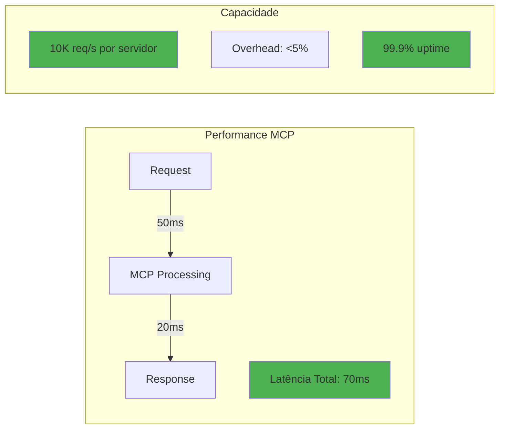

## Estrutura de Custos

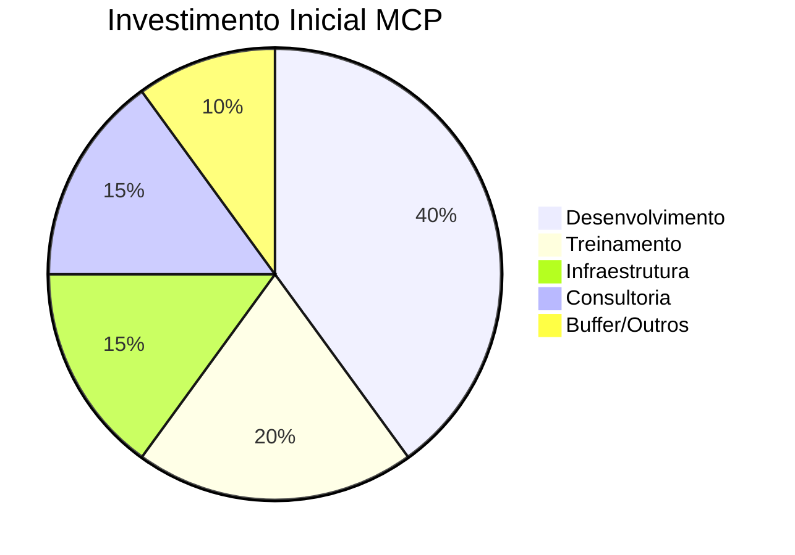

### Análise Financeira:

- **Investimento médio**: $250-500K
- **Break-even**: 4-6 meses
- **Economia anual**: $1-3M
- **ROI 3 anos**: 800-1200%

---

# Casos de Uso Por Indústria

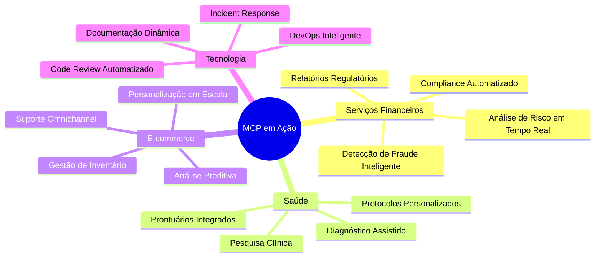

---

# Segurança e Compliance: Prioridade Máxima

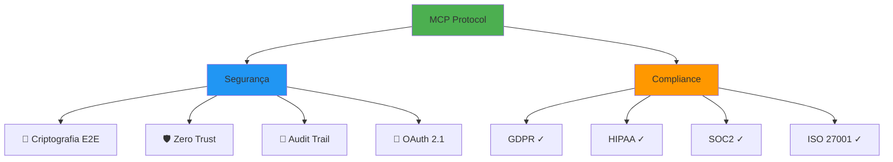

### Controles de Segurança:

- **Permissões Granulares**: Por recurso e ação
- **Aprovação Humana**: Para todas operações críticas
- **Isolamento Total**: Entre servidores e contextos
- **Logs Imutáveis**: Para auditoria completa

---

# Ecossistema MCP: Crescendo Rapidamente

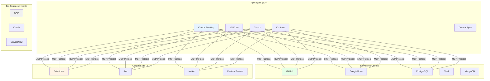

### Números do Ecossistema:

- 👥 **5.000+** desenvolvedores ativos
- 🏢 **50+** empresas Fortune 500
- 📦 **300+** servidores disponíveis
- 🌟 **150+** contribuidores core

---

# Roadmap: O Futuro do MCP

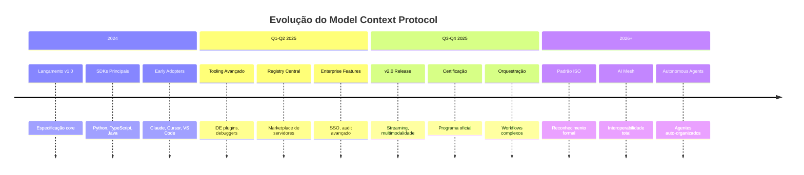

---

# Comparação Detalhada: MCP vs Alternativas

|Aspecto|MCP|Function Calling|APIs REST|LangChain|
|---|---|---|---|---|
|**Padronização**|✅ Universal, aberto|❌ Proprietário por LLM|❌ Sem padrão|❌ Framework específico|
|**Interoperabilidade**|✅ Total entre LLMs|❌ Lock-in por vendor|❌ Point-to-point|⚠️ Parcial|
|**Curva de Aprendizado**|✅ Suave (1 semana)|✅ Simples|⚠️ Média|❌ Íngreme|
|**Manutenção**|✅ Centralizada|❌ Por integração|❌ Alta|⚠️ Média|
|**Comunidade**|✅ Crescente rápido|⚠️ Fragmentada|✅ Madura|✅ Ativa|
|**Enterprise Ready**|✅ Sim|⚠️ Depende|✅ Sim|⚠️ Parcial|
|**Custo Total**|✅ Baixo longo prazo|❌ Alto (reescrita)|❌ Alto (manutenção)|⚠️ Médio|

---

# Implementação: Seu Roadmap de 90 Dias

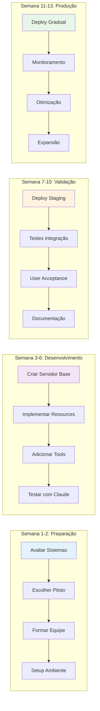

---

# Requisitos e Preparação

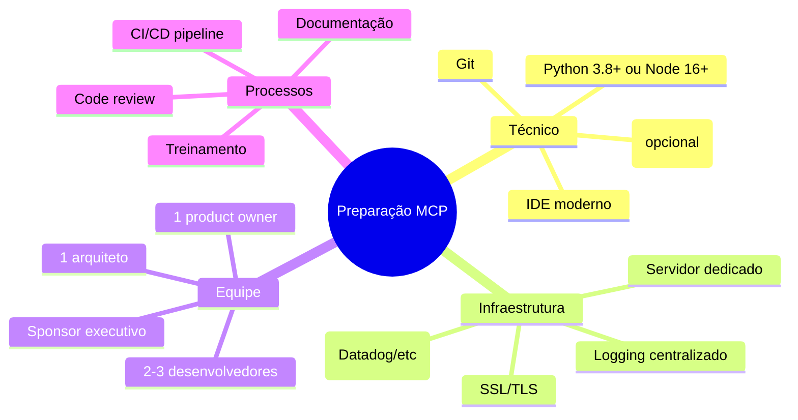

---

# Quick Start: Comece em 30 Minutos!

```python
# 1. Instale o SDK
pip install mcp

# 2. Crie seu primeiro servidor
from mcp import Server, Resource, Tool
import sqlite3

class MyCompanyServer(Server):
    def __init__(self):
        super().__init__("company-data-server")
        self.db = sqlite3.connect("company.db")
    
    @Resource("sales://dashboard/current")
    async def get_sales_dashboard(self):
        """Retorna dashboard de vendas atual"""
        cursor = self.db.execute("""
            SELECT date, total_sales, transactions
            FROM sales_summary 
            WHERE date = date('now')
        """)
        return cursor.fetchall()
    
    @Tool("analyze_customer")
    async def analyze_customer(self, customer_id: str):
        """Analisa perfil e histórico do cliente"""
        # Análise com ML/AI
        return {
            "risk_score": 0.15,
            "ltv_prediction": 15000,
            "churn_probability": 0.05
        }

# 3. Configure no Claude Desktop
# Adicione ao config.json:
# {
#   "mcpServers": {
#     "company": {
#       "command": "python",
#       "args": ["path/to/your/server.py"]
#     }
#   }
# }
```

---

# FAQs Expandidas

## Para Líderes Executivos

**Q: Qual o ROI esperado do MCP?**  
A: Empresas relatam ROI de 250-400% no primeiro ano, com payback em 4-6 meses.

**Q: Como isso afeta nossa estratégia de IA?**  
A: MCP permite flexibilidade total - troque de LLMs sem reescrever integrações.

**Q: E a segurança dos nossos dados?**  
A: Controle total permanece com você. MCP adiciona camadas de segurança.

**Q: Precisamos de consultoria externa?**  
A: Recomendado para acelerar, mas não obrigatório. Documentação é completa.

## Para Desenvolvedores

**Q: Quais linguagens são suportadas?**  
A: Python, TypeScript, Java oficialmente. Go, Rust, C# em desenvolvimento.

**Q: Posso migrar integrações existentes?**  
A: Sim! Encapsule código atual em servidores MCP progressivamente.

**Q: Como fazer debugging?**  
A: MCP Inspector + logs estruturados + tracing distribuído disponíveis.

**Q: Performance em produção?**  
A: <100ms latência média, 10K+ req/s por servidor, overhead <5%.

---

# A Escolha é Clara

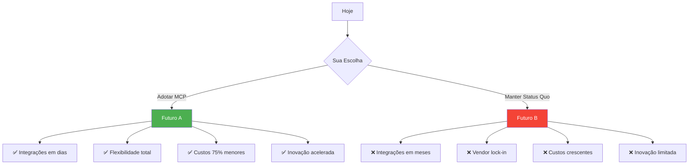

---

# Próximos Passos Concretos

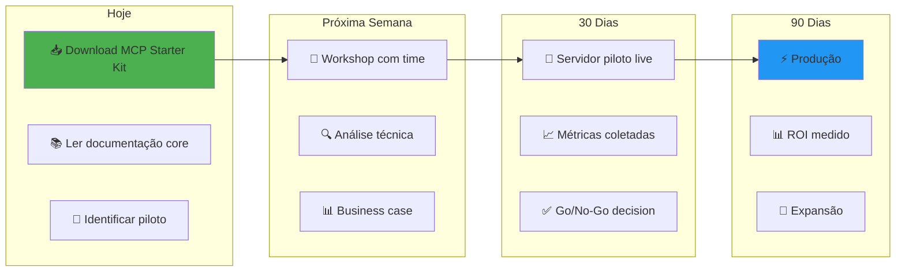

### Recursos Para Começar Agora:

- 📚 **Documentação Completa**: [modelcontextprotocol.io](https://modelcontextprotocol.io/)
- 💻 **GitHub Oficial**: [github.com/modelcontextprotocol](https://github.com/modelcontextprotocol)
- 🛠️ **Starter Kit**: [github.com/modelcontextprotocol/starter-kit](https://github.com/modelcontextprotocol/starter-kit)
- 💬 **Comunidade Ativa**: [Discord MCP](https://discord.gg/mcp)
- 🎓 **Treinamento**: [mcp-training.io](https://mcp-training.io/)

---

# O Futuro é Padronizado, Aberto e Interoperável

> "Em breve, toda aplicação de IA séria usará MCP. A questão não é SE você vai adotar, mas QUANDO." - Pimente, Felipe

## Por que esperar?

O ecossistema MCP está crescendo exponencialmente. Cada dia que passa, mais integrações ficam disponíveis, mais ferramentas são criadas, e mais empresas colhem os benefícios.

### Junte-se aos pioneiros. Lidere a transformação.

---

"O MCP não é apenas um protocolo, é a ponte entre o que a IA promete e o que ela finalmente pode entregar." — **Felipe Pimentel**

---