# Model Context Protocol (MCP)

## A Ponte Entre IAs Poderosas E O Mundo Real 🌉

---

# O Paradoxo Da IA Moderna

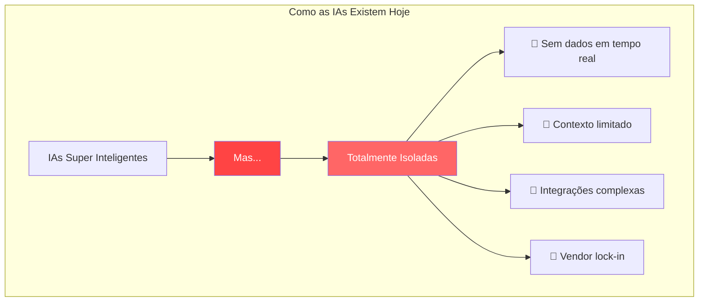

> "Uma IA sem contexto é como um gênio trancado em uma biblioteca vazia. MCP é a chave que conecta inteligência ao mundo real." — **Martin Fowler (adaptado)**

---

# Model Context Protocol: O Padrão Universal

## Como O USB-C Revolucionou Dispositivos, MCP Revoluciona IA 🔌

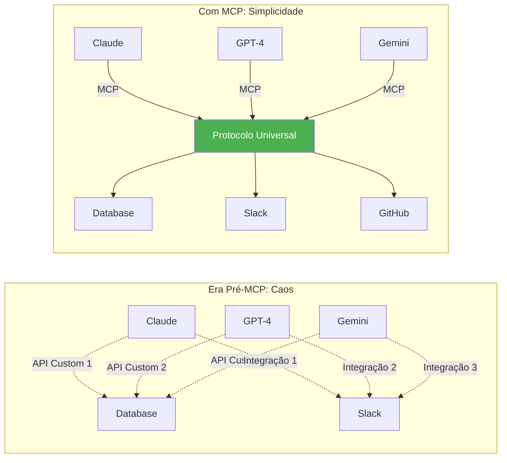

### O Que É MCP?

MCP é um protocolo aberto que padroniza como aplicações de IA se conectam a fontes de dados e ferramentas. Baseado em **JSON-RPC 2.0**, fornece uma maneira consistente para que modelos de linguagem acessem contexto através de:

- **Transporte padronizado** (stdio, HTTP/SSE)
- **Negociação de capacidades**
- **Sistema de tipos forte**
- **Ciclo de vida bem definido**

---

# Arquitetura Fundamental Do MCP

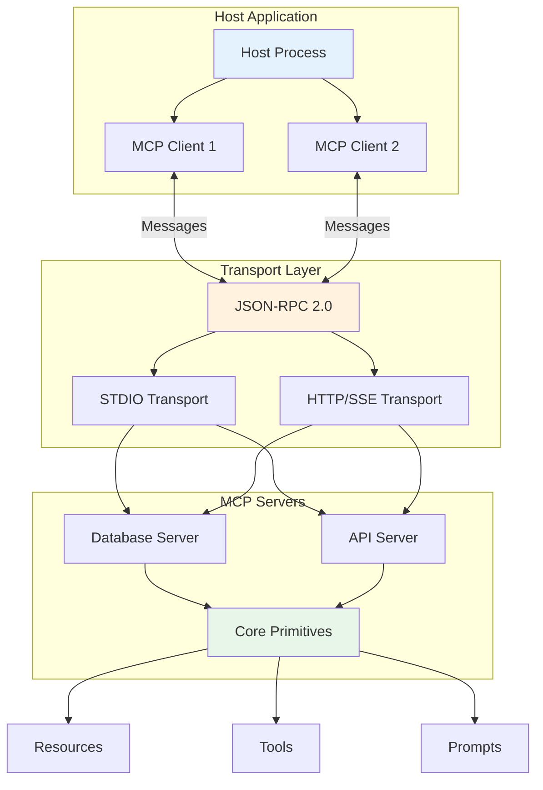

### Componentes Core

1. **Host**: Aplicação principal (ex: Claude Desktop)
2. **Client**: Mantém conexão 1:1 com servidor
3. **Server**: Fornece capacidades específicas
4. **Transport**: Mecanismo de comunicação (stdio ou HTTP/SSE)

---

# O Protocolo: JSON-RPC 2.0

## Tipos De Mensagens Fundamentais

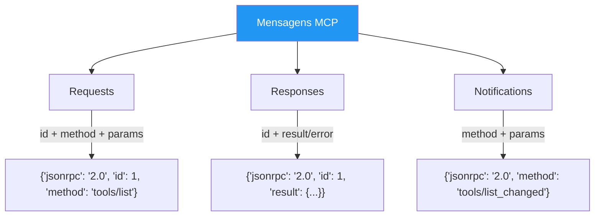

### Características Do Protocolo

- **Stateful**: Mantém sessão entre cliente e servidor
- **Bidirectional**: Ambos podem iniciar comunicação
- **Typed**: Esquema TypeScript como fonte de verdade
- **Extensible**: Capacidades negociáveis

---

# Ciclo De Vida Da Conexão MCP

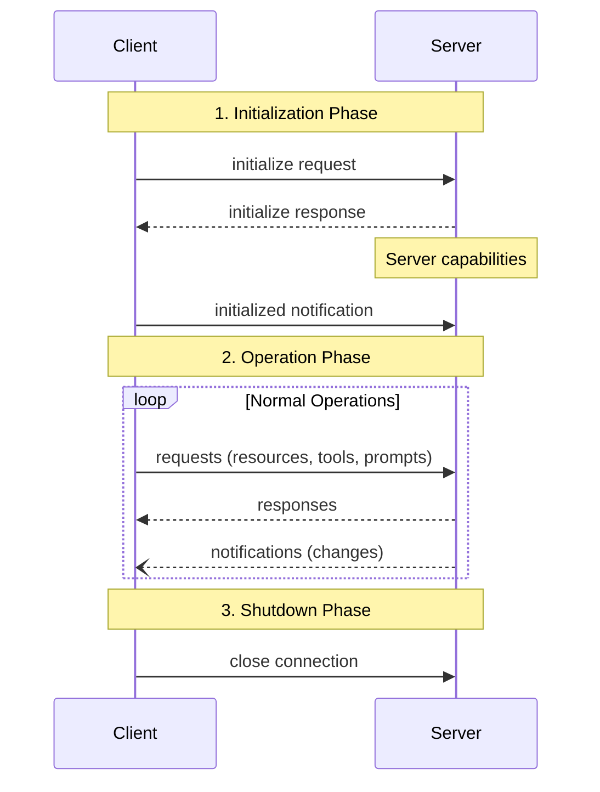

### Negociação De Capacidades

Durante a inicialização, cliente e servidor negociam:

```json
{
  "capabilities": {
    "resources": { "subscribe": true, "listChanged": true },
    "tools": { "listChanged": true },
    "prompts": { "listChanged": true },
    "logging": {}
  }
}
```

---

# Os Três Primitivos Do MCP

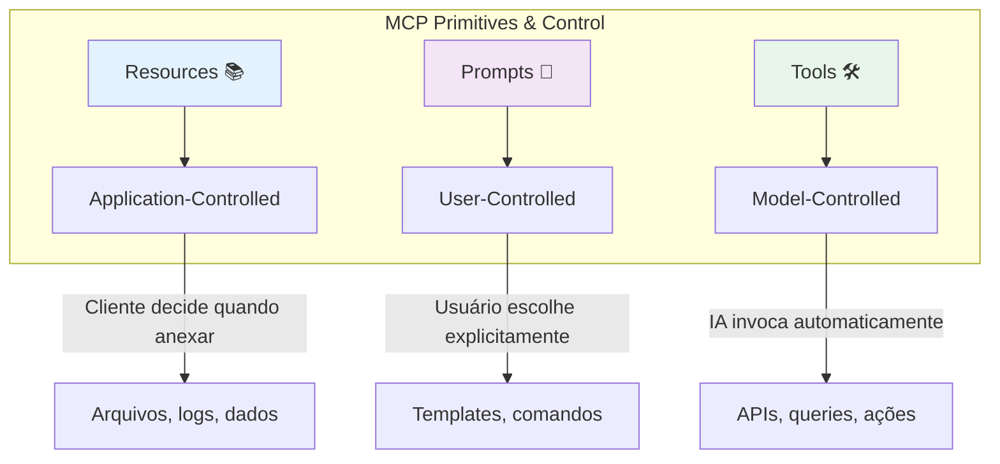

### Hierarquia De Controle

|Primitivo|Controle|Descrição|Exemplos|
|---|---|---|---|
|**Resources**|Application-controlled|Cliente gerencia contexto|Arquivos, schemas, documentação|
|**Prompts**|User-controlled|Usuário seleciona explicitamente|Comandos slash, templates|
|**Tools**|Model-controlled|IA decide quando usar|API calls, queries, automações|

---

# Resources: Dados Estruturados Para Contexto

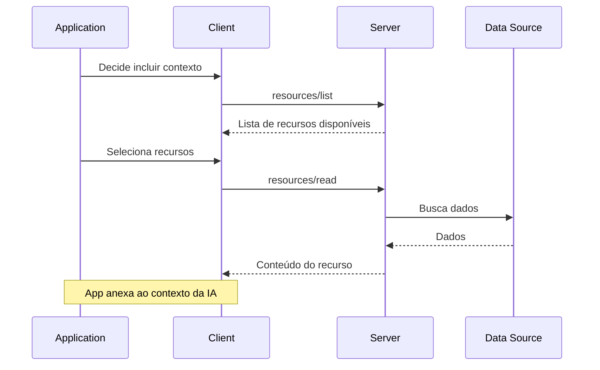

### Características De Resources

- **URI-based**: Identificados por URIs (`file://`, `database://`, etc.)
- **MIME-typed**: Tipo de conteúdo explícito
- **Subscribable**: Notificações de mudanças
- **Text ou Binary**: Suporte para ambos formatos

```typescript
{
  uri: "database://customers/schema",
  name: "Customer Schema",
  mimeType: "application/json",
  description: "Database schema for customers table"
}
```

---

# Prompts: Templates Interativos

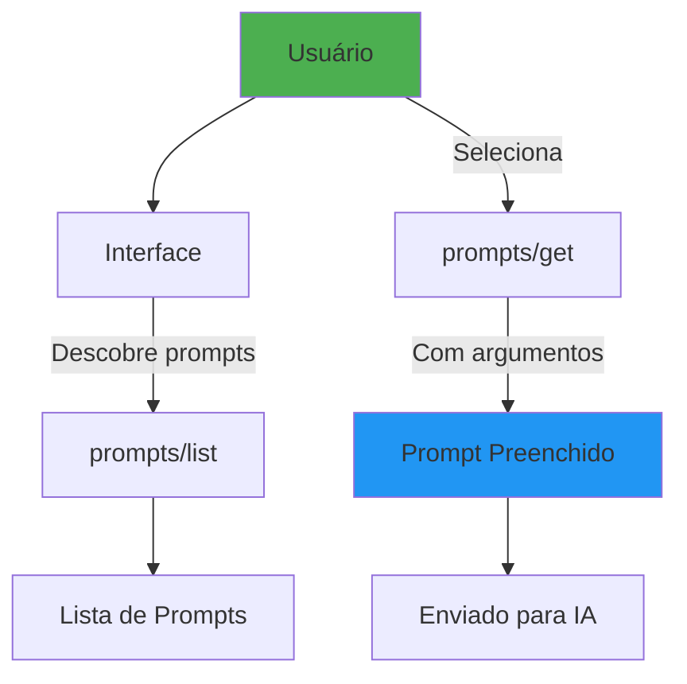

### Exemplo De Prompt

```json
{
  "name": "code_review",
  "description": "Analyze code for improvements",
  "arguments": [
    {
      "name": "language",
      "description": "Programming language",
      "required": true
    }
  ]
}
```

### Casos De Uso

- Comandos slash (`/analyze`, `/summarize`)
- Templates de workflow
- Interações guiadas
- Operações padronizadas

---

# Tools: Ações Executáveis Pela IA

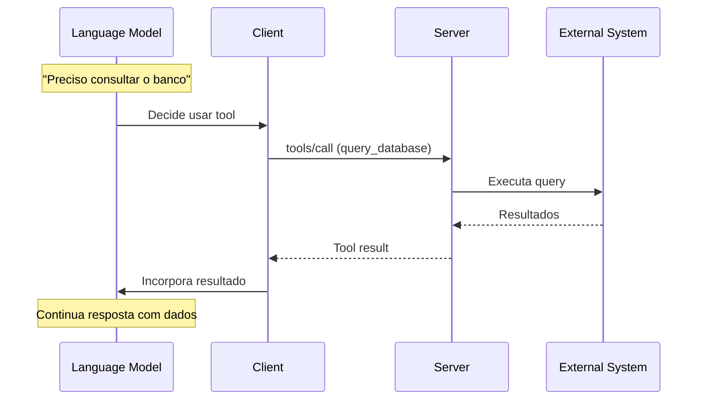

### Estrutura De Tool

```typescript
{
  name: "query_database",
  description: "Execute SQL queries",
  inputSchema: {
    type: "object",
    properties: {
      query: { type: "string" },
      database: { type: "string" }
    },
    required: ["query"]
  }
}
```

### Segurança De Tools

⚠️ **Tools representam execução de código arbitrário**

- Sempre requer confirmação humana
- Validação rigorosa de inputs
- Logs de auditoria completos
- Sandboxing quando possível

---

# Transports: Como MCP Se Comunica

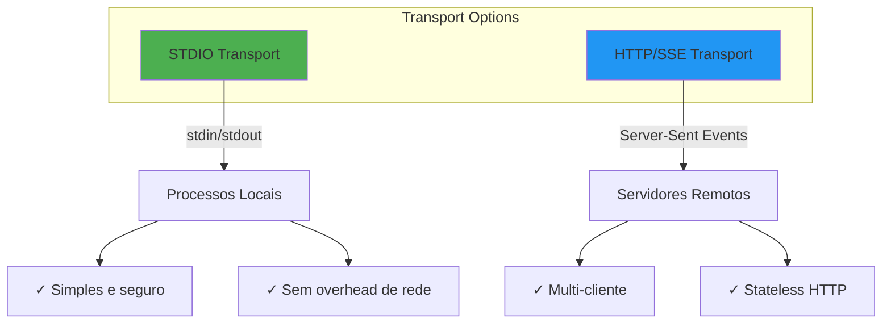

### STDIO Transport

- Cliente lança servidor como subprocess
- Comunicação via stdin/stdout
- Mensagens delimitadas por newlines
- Ideal para ferramentas locais

### HTTP/SSE Transport

- Servidor independente
- Múltiplas conexões simultâneas
- Server-Sent Events para mensagens do servidor
- POST para mensagens do cliente

---

# Implementando Um Servidor MCP

## Exemplo Em Python: Servidor De Métricas

```python
from mcp.server import Server, Resource
from mcp.server.models import InitializationOptions
import mcp.types as types

# Cria servidor
app = Server("metrics-server")

# Define recurso
@app.list_resources()
async def handle_list_resources() -> list[types.Resource]:
    return [
        types.Resource(
            uri="metrics://sales/current",
            name="Current Sales Metrics",
            description="Real-time sales data",
            mimeType="application/json"
        )
    ]

# Implementa leitura
@app.read_resource()
async def handle_read_resource(uri: str) -> str:
    if uri == "metrics://sales/current":
        metrics = await fetch_current_metrics()
        return json.dumps(metrics)
    raise ValueError(f"Unknown resource: {uri}")

# Define tool
@app.list_tools()
async def handle_list_tools() -> list[types.Tool]:
    return [
        types.Tool(
            name="analyze_metrics",
            description="Analyze sales patterns",
            inputSchema={
                "type": "object",
                "properties": {
                    "period": {"type": "string"},
                    "metric": {"type": "string"}
                },
                "required": ["period", "metric"]
            }
        )
    ]

# Implementa tool
@app.call_tool()
async def handle_call_tool(name: str, arguments: dict) -> list[types.TextContent]:
    if name == "analyze_metrics":
        analysis = await analyze_sales_data(
            period=arguments["period"],
            metric=arguments["metric"]
        )
        return [types.TextContent(type="text", text=analysis)]
    raise ValueError(f"Unknown tool: {name}")
```

---

# Segurança Em MCP: Defesa Em Profundidade

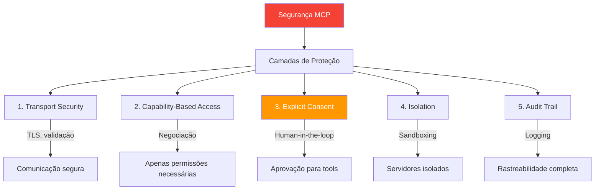

### Princípios De Segurança

1. **Princípio do Menor Privilégio**: Servidores só acessam o necessário
2. **Consentimento Explícito**: Usuário controla todas as operações
3. **Isolamento**: Servidores não se comunicam entre si
4. **Validação**: Todos os inputs são verificados
5. **Auditoria**: Log completo de operações

---

# Padrões De Implementação MCP

## 1. Servidor De Dados (Read-Only)

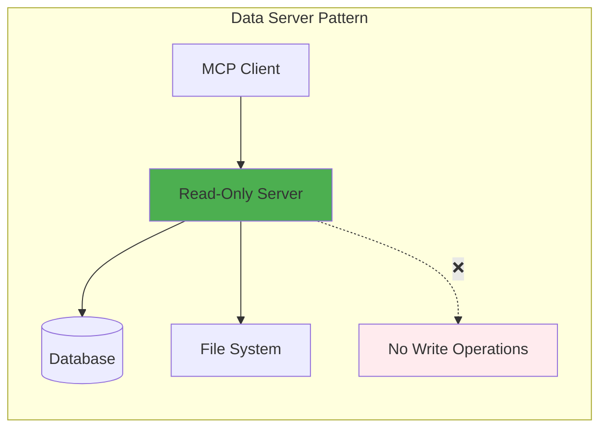

Ideal para: Documentação, schemas, dados históricos

## 2. Servidor De Ferramentas (Action-Based)

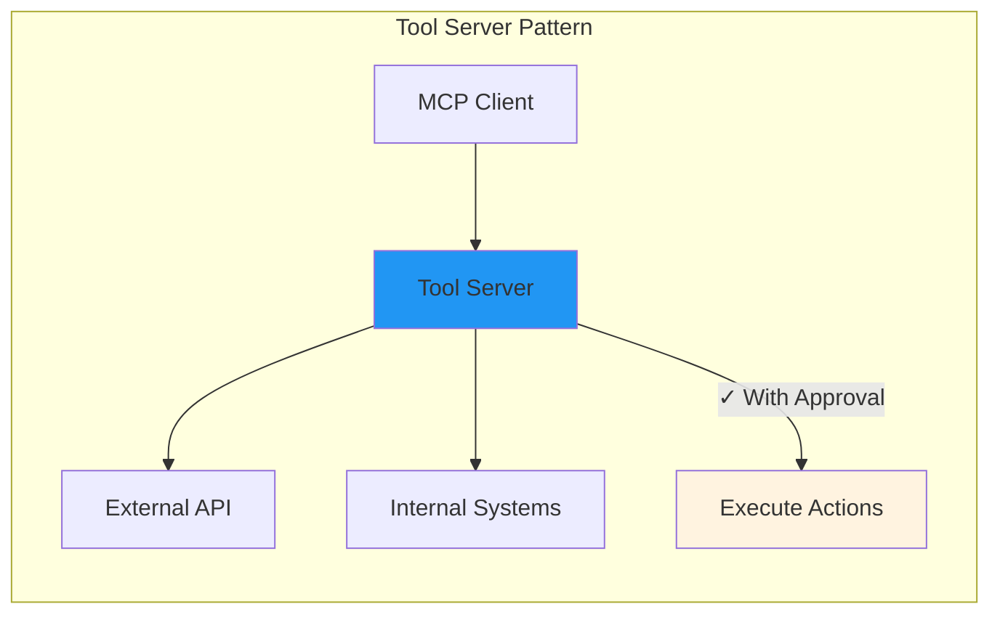

Ideal para: Integrações API, automações, operações

## 3. Servidor Híbrido

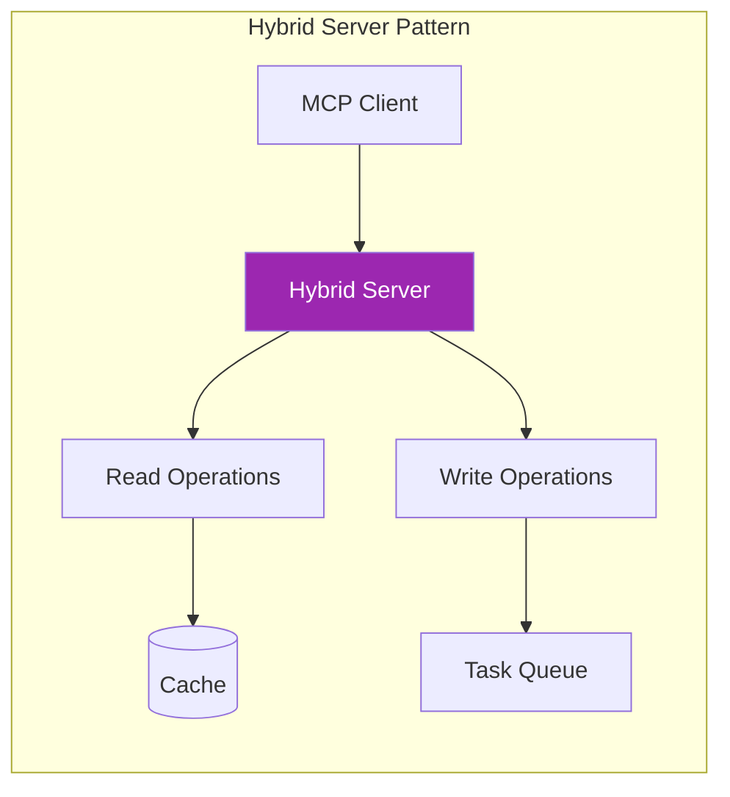

Ideal para: Sistemas complexos, workflows completos

---

# Comparativo Técnico: MCP Vs Alternativas

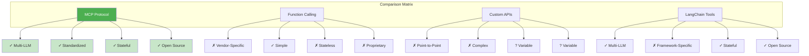

### Análise Comparativa

|Aspecto|MCP|Function Calling|Custom APIs|LangChain|
|---|---|---|---|---|
|**Interoperabilidade**|Universal|Vendor lock-in|Específico|Framework-only|
|**Complexidade**|Moderada|Baixa|Alta|Alta|
|**Manutenção**|Compartilhada|Vendor|Total|Framework|
|**Flexibilidade**|Alta|Limitada|Total|Média|
|**Comunidade**|Crescente|Grande|Isolada|Grande|

---

# Ecossistema MCP: Estado Atual

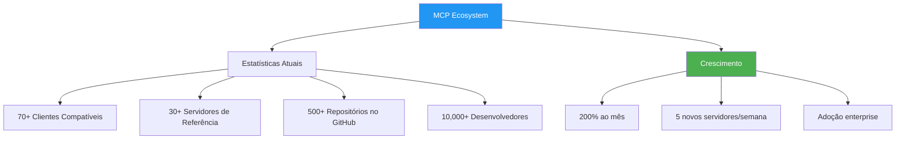

### Principais Implementações

- **Claude Desktop**: Cliente de referência
- **Continue.dev**: IDE integration
- **Cline**: VS Code extension
- **Zed**: Editor with MCP support
- **LangChain**: Framework integration

---

# Roadmap E Futuro Do MCP

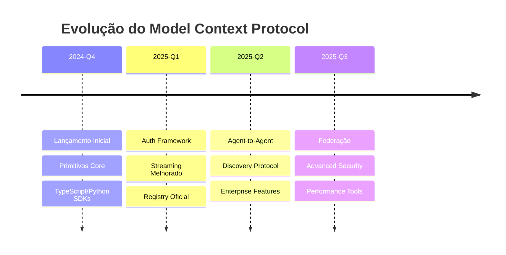

### Próximas Features

1. **Authentication & Authorization**: OAuth 2.1, tokens, permissões
2. **Registry**: Descoberta de servidores, marketplace
3. **Multimodalidade**: Suporte nativo para áudio/vídeo
4. **Agent Graphs**: Comunicação entre agentes
5. **Observability**: Métricas, tracing, debugging

---

# Como Começar Com MCP Hoje

## 1. Para Experimentar (15 minutos)

```bash
# Instale o Claude Desktop
# Clone um servidor exemplo
git clone https://github.com/modelcontextprotocol/servers.git
cd servers/src/filesystem

# Configure no Claude Desktop
{
  "mcpServers": {
    "filesystem": {
      "command": "node",
      "args": ["path/to/server/index.js", "/allowed/directory"]
    }
  }
}
```

## 2. Para Desenvolver (1-2 dias)

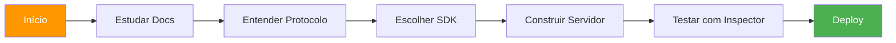

## 3. Para Produção (1-2 semanas)

- Mapear casos de uso prioritários
- Implementar servidores focados
- Estabelecer práticas de segurança
- Monitorar e otimizar
- Documentar para o time

---

# Recursos Essenciais Para Desenvolvedores

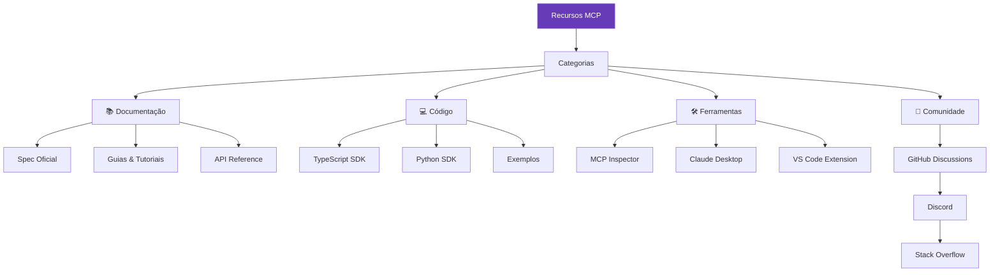

### Links Importantes

- 🌐 **Documentação**: [modelcontextprotocol.io](https://modelcontextprotocol.io/)
- 💻 **GitHub**: [github.com/modelcontextprotocol](https://github.com/modelcontextprotocol)
- 🔍 **Inspector**: [MCP Inspector Tool](https://modelcontextprotocol.io/docs/tools/inspector)
- 📦 **NPM**: [@modelcontextprotocol](https://www.npmjs.com/org/modelcontextprotocol)
- 🐍 **PyPI**: [mcp package](https://pypi.org/project/mcp/)

---

# Casos De Uso Avançados Por Indústria

## 🏦 Fintech & Banking

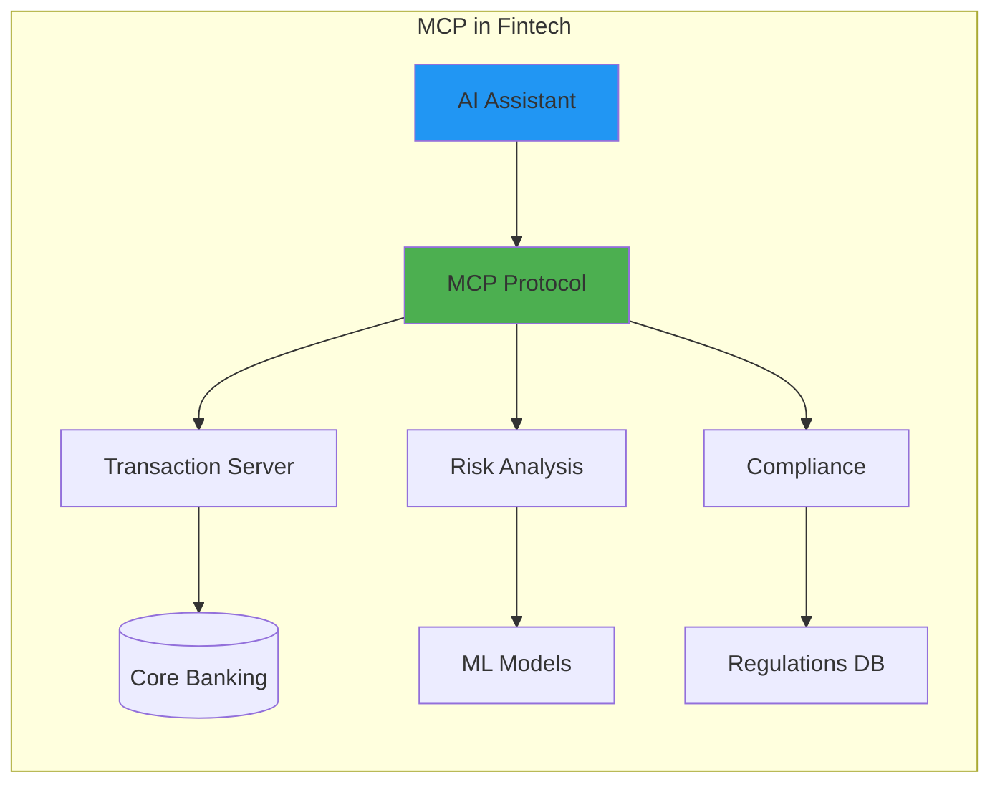

- Análise de transações em tempo real
- Compliance automatizado (KYC/AML)
- Assessoria financeira personalizada
- Detecção de fraudes contextualizada

## 🏥 Healthcare & Life Sciences

```mermaid
graph LR
    subgraph "MCP in Healthcare"
        DOC[Doctor's AI] --> MCP[MCP Protocol]
        MCP --> EMR[EMR Server]
        MCP --> LAB[Lab Results]
        MCP --> RESEARCH[Research DB]
        
        EMR --> FHIR[(FHIR Store)]
        LAB --> LIMS[LIMS System]
        RESEARCH --> PAPERS[(PubMed)]
    end
    
    style DOC fill:#e91e63
    style MCP fill:#4CAF50
```

- Diagnóstico assistido com contexto completo
- Integração com prontuários (FHIR)
- Pesquisa clínica acelerada
- Monitoramento de pacientes

## 🏭 Manufacturing & IoT

```mermaid
graph LR
    subgraph "MCP in Industry 4.0"
        OPERATOR[Operator AI] --> MCP[MCP Protocol]
        MCP --> SCADA[SCADA Server]
        MCP --> IOT[IoT Gateway]
        MCP --> ERP[ERP Integration]
        
        SCADA --> PLC[PLCs]
        IOT --> SENSORS[Sensors]
        ERP --> SAP[(SAP)]
    end
    
    style OPERATOR fill:#ff9800
    style MCP fill:#4CAF50
```

- Manutenção preditiva inteligente
- Otimização de produção em tempo real
- Controle de qualidade automatizado
- Supply chain intelligence

---

# Padrões Arquiteturais Com MCP

## 1. Gateway Pattern

```mermaid
graph TD
    subgraph "MCP Gateway Architecture"
        APPS[Multiple AI Apps] --> GW[MCP Gateway]
        GW --> AUTH[Auth/Security]
        GW --> CACHE[Response Cache]
        GW --> ROUTE[Smart Routing]
        
        ROUTE --> S1[Server 1]
        ROUTE --> S2[Server 2]
        ROUTE --> S3[Server 3]
    end
    
    style GW fill:#673ab7,color:#fff
    style AUTH fill:#f44336,color:#fff
```

## 2. Federation Pattern

```mermaid
graph TD
    subgraph "Federated MCP"
        ORG1[Organization A] --> FED[Federation Layer]
        ORG2[Organization B] --> FED
        ORG3[Organization C] --> FED
        
        FED --> TRUST[Trust Network]
        FED --> DISCOVERY[Service Discovery]
        FED --> POLICY[Policy Engine]
    end
    
    style FED fill:#3f51b5,color:#fff
```

## 3. Event-Driven Pattern

```mermaid
graph LR
    subgraph "Event-Driven MCP"
        EVENTS[Event Stream] --> MCP[MCP Server]
        MCP --> HANDLERS[Event Handlers]
        
        HANDLERS --> H1[Resource Updates]
        HANDLERS --> H2[Tool Triggers]
        HANDLERS --> H3[Notifications]
        
        H3 --> CLIENTS[Connected Clients]
    end
    
    style EVENTS fill:#ff5722,color:#fff
```

---

# Performance E Escalabilidade

```mermaid
graph TD
    PERF[Performance MCP] --> METRICS[Métricas Chave]
    
    METRICS --> M1[Latência < 100ms]
    METRICS --> M2[Throughput 1000 req/s]
    METRICS --> M3[Concorrência 100+ clients]
    
    PERF --> OPT[Otimizações]
    OPT --> O1[Connection Pooling]
    OPT --> O2[Response Caching]
    OPT --> O3[Batch Operations]
    OPT --> O4[Async Processing]
    
    style PERF fill:#607d8b,color:#fff
```

### Best Practices Para Performance

1. **Connection Management**
    
    - Pool de conexões reutilizáveis
    - Keep-alive para conexões longas
    - Graceful degradation
2. **Caching Strategy**
    
    - Cache de recursos estáticos
    - Invalidação inteligente
    - Edge caching quando possível
3. **Resource Optimization**
    
    - Paginação para listas grandes
    - Streaming para dados volumosos
    - Compressão de payloads

---

# Debugging E Observabilidade

```mermaid
graph TD
    DEBUG[MCP Debugging] --> TOOLS[Ferramentas]
    
    TOOLS --> T1[MCP Inspector]
    TOOLS --> T2[Chrome DevTools]
    TOOLS --> T3[Request Logger]
    
    DEBUG --> METRICS[Observability]
    METRICS --> M1[OpenTelemetry]
    METRICS --> M2[Prometheus]
    METRICS --> M3[Grafana]
    
    DEBUG --> LOGS[Logging]
    LOGS --> L1[Structured Logs]
    LOGS --> L2[Trace IDs]
    LOGS --> L3[Error Tracking]
    
    style DEBUG fill:#795548,color:#fff
```

### Estratégia De Debugging

1. **Development**
    
    - MCP Inspector para teste interativo
    - Verbose logging habilitado
    - Mock servers para testes
2. **Production**
    
    - Distributed tracing
    - Métricas de negócio
    - Alertas proativos

---

# Conclusão: O Futuro É Contextual

```mermaid
graph LR
    TODAY[Hoje] --> TRANSITION[Transição]
    TRANSITION --> FUTURE[Futuro com MCP]
    
    TODAY --> T1[IAs Isoladas]
    TODAY --> T2[Integrações Frágeis]
    TODAY --> T3[Vendor Lock-in]
    
    FUTURE --> F1[IAs Contextuais]
    FUTURE --> F2[Ecossistema Aberto]
    FUTURE --> F3[Inovação Acelerada]
    
    style TODAY fill:#f44336,color:#fff
    style TRANSITION fill:#ff9800,color:#fff
    style FUTURE fill:#4CAF50,color:#fff
```

> "MCP não é apenas um protocolo técnico. É a ponte entre a promessa da IA e sua realização prática no mundo dos negócios." — **Marty Cagan (adaptado)**

### Por Que Agora?

1. **Momento Tecnológico**: IAs maduras, necessidade de contexto
2. **Pressão de Mercado**: Competição por eficiência
3. **Comunidade Ativa**: Ecossistema em rápido crescimento
4. **ROI Comprovado**: Cases de sucesso multiplicando

### Próximos Passos

1. **Explore**: [modelcontextprotocol.io](https://modelcontextprotocol.io/)
2. **Experimente**: MCP Inspector
3. **Construa**: Seu primeiro servidor
4. **Contribua**: Junte-se à comunidade

---

# Apêndice: Referência Rápida

## Estrutura De Mensagem MCP

```typescript
// Request
{
  jsonrpc: "2.0",
  id: string | number,
  method: string,
  params?: object
}

// Response  
{
  jsonrpc: "2.0",
  id: string | number,
  result?: object,
  error?: {
    code: number,
    message: string,
    data?: any
  }
}

// Notification
{
  jsonrpc: "2.0",
  method: string,
  params?: object
}
```

## Capabilities Reference

```typescript
interface ServerCapabilities {
  resources?: {
    subscribe?: boolean;
    listChanged?: boolean;
  };
  prompts?: {
    listChanged?: boolean;
  };
  tools?: {
    listChanged?: boolean;
  };
  logging?: {};
  experimental?: object;
}
```

## Common Methods

|Method|Type|Description|
|---|---|---|
|`initialize`|Request|Start session|
|`resources/list`|Request|List resources|
|`resources/read`|Request|Read resource|
|`tools/list`|Request|List tools|
|`tools/call`|Request|Execute tool|
|`prompts/list`|Request|List prompts|
|`prompts/get`|Request|Get prompt|

---

# MCP: Construindo O Futuro Da IA Contextual

A revolução já começou. Junte-se a nós.

**🚀 [modelcontextprotocol.io](https://modelcontextprotocol.io/) 🚀**