# Model Context Protocol (MCP)

## A Ponte Entre IAs e o Mundo Real 🌉

---

# A História de Maria: O Despertar para o MCP

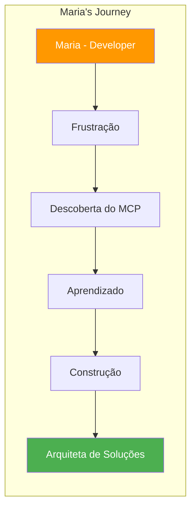

> "Passei 6 meses construindo integrações customizadas. Com MCP, refiz tudo em 2 semanas e ainda sobrou tempo para inovar." — **Maria, Arquiteta de Soluções**

---

# O Problema que Todos Enfrentamos

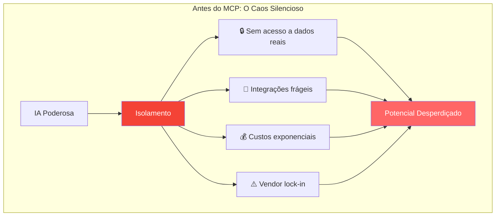

### O Dilema do Contexto

Imagine ter acesso às IAs mais avançadas do mundo, mas elas não conseguem:

- 📊 Acessar seus dados empresariais
- 📝 Ler seus documentos específicos
- 🔧 Executar ações em seus sistemas
- 🌐 Integrar com suas ferramentas

---

# MCP: A Revolução Silenciosa

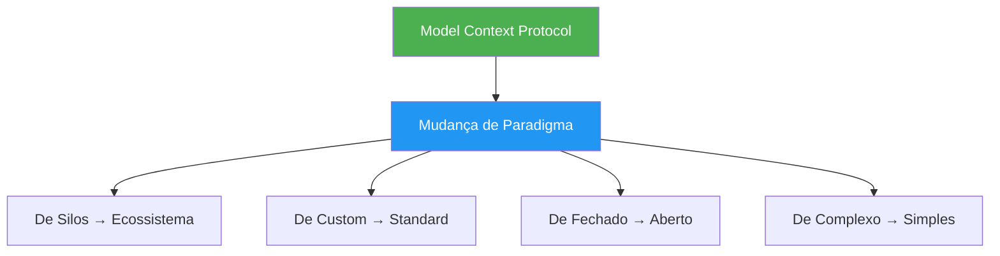

## O Que É MCP?

MCP é um **protocolo aberto** que padroniza como aplicações de IA se conectam ao mundo real. Pense nele como o **USB-C da inteligência artificial**.

### Analogia Perfeita

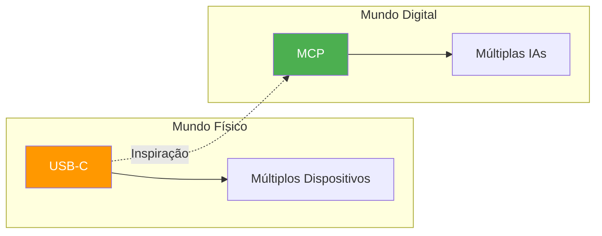

---

# A Arquitetura Elegante do MCP

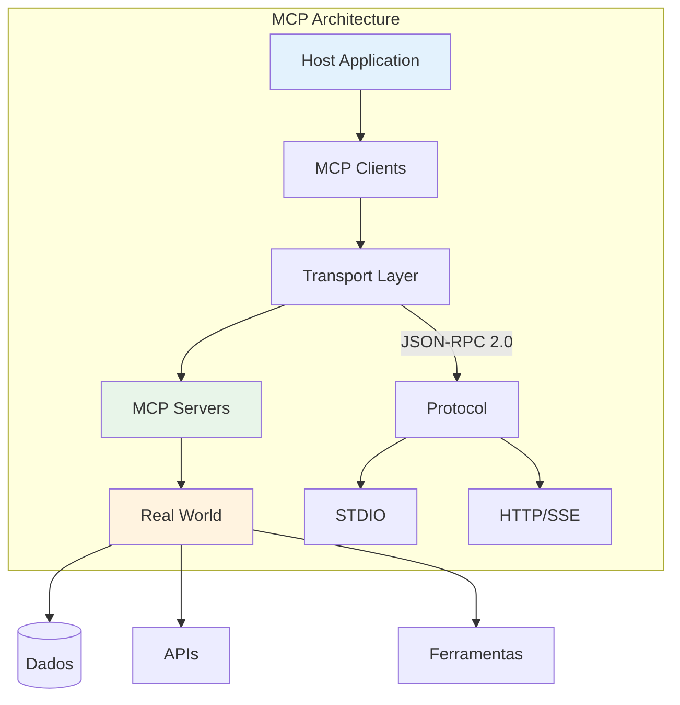

### Princípios de Design

1. **Simplicidade**: Servidores devem ser fáceis de construir
2. **Composabilidade**: Combine múltiplos servidores
3. **Isolamento**: Segurança por design
4. **Progressividade**: Adote incrementalmente

---

# Os Três Pilares Fundamentais

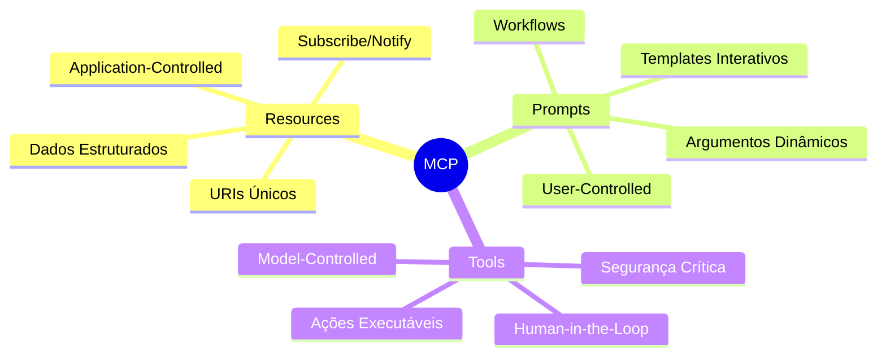

## A Hierarquia de Controle

|Primitivo|Controlador|Quando Usar|Exemplo Real|
|---|---|---|---|
|**Resources**|Aplicação|Contexto automático|Documentação, logs|
|**Prompts**|Usuário|Interação explícita|Comandos, templates|
|**Tools**|Modelo IA|Execução de ações|APIs, automações|

---

# Um Dia na Vida de um Desenvolvedor MCP

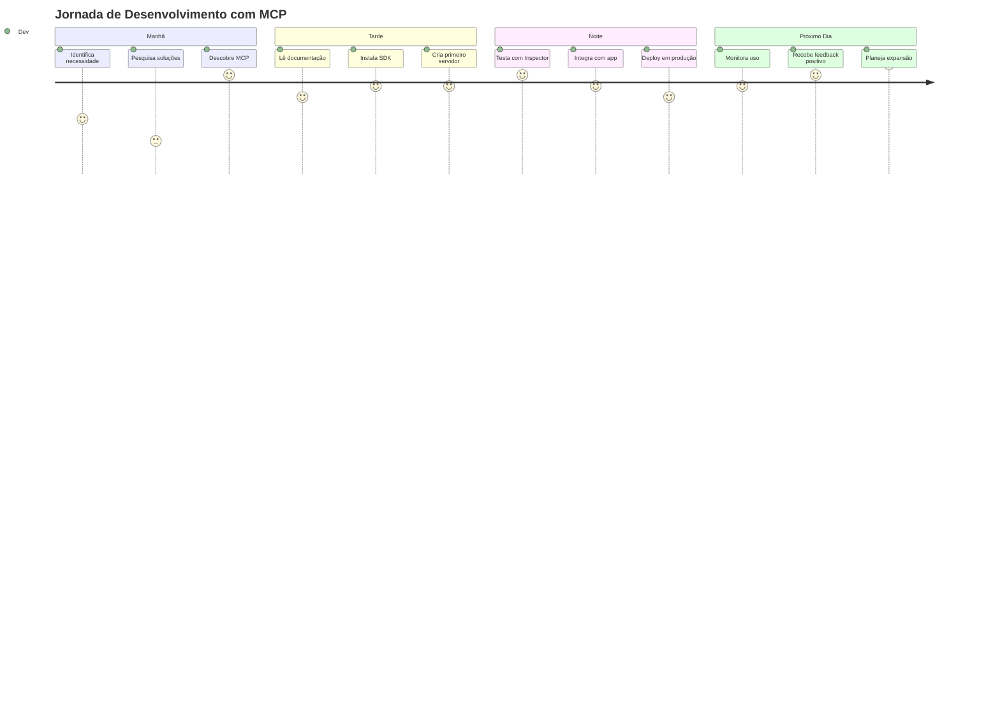

---

# Anatomia de uma Conversa MCP

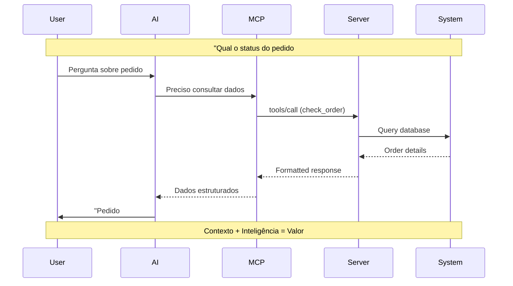

---

# Resources: O Poder do Contexto

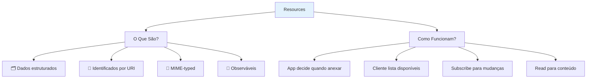

### Exemplo Prático: Sistema de Documentação

```typescript
{
  uri: "docs://api/customers",
  name: "Customer API Documentation",
  mimeType: "text/markdown",
  description: "OpenAPI spec and examples"
}
```

Quando Maria pergunta sobre a API de clientes, o contexto já está lá!

---

# Prompts: Interações Inteligentes

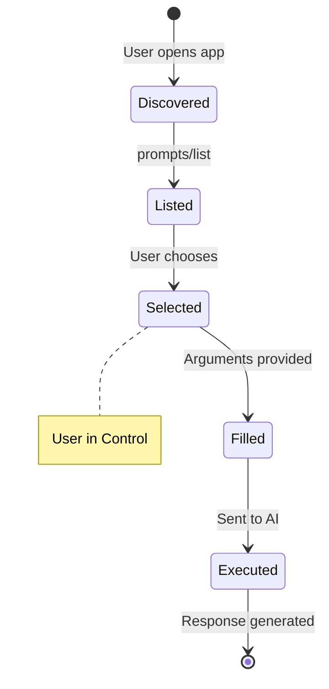

### Exemplo: Análise de Código

```json
{
  "name": "code_review",
  "description": "Comprehensive code analysis",
  "arguments": [
    {
      "name": "language",
      "description": "Programming language",
      "required": true
    },
    {
      "name": "focus",
      "description": "security, performance, style",
      "required": false
    }
  ]
}
```

---

# Tools: Ações com Responsabilidade

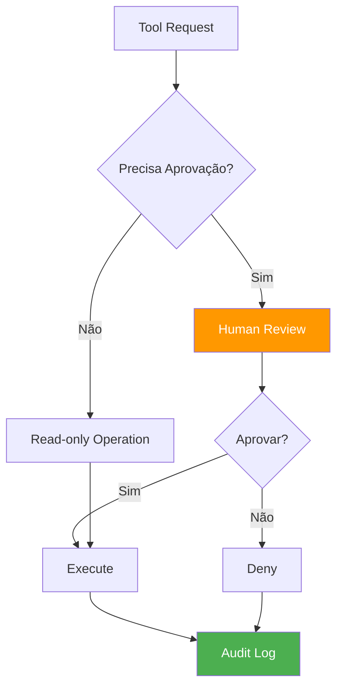

### Segurança em Primeiro Lugar

⚠️ **Princípio Fundamental**: Toda ferramenta que modifica estado DEVE ter aprovação humana.

```typescript
{
  name: "delete_customer",
  description: "Remove customer from database",
  inputSchema: {
    type: "object",
    properties: {
      customerId: { type: "string" },
      confirm: { type: "boolean" }
    }
  }
}
```

---

# O Protocolo: Simplicidade e Poder

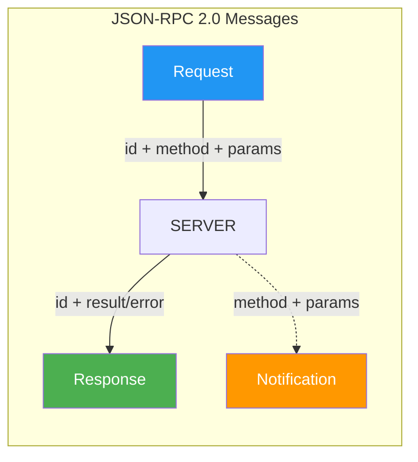

### Características Essenciais

- **Stateful**: Mantém sessão entre cliente/servidor
- **Bidirectional**: Ambos podem iniciar comunicação
- **Typed**: Schema TypeScript como fonte de verdade
- **Extensible**: Capacidades negociáveis

---

# Ciclo de Vida: Do Handshake ao Goodbye

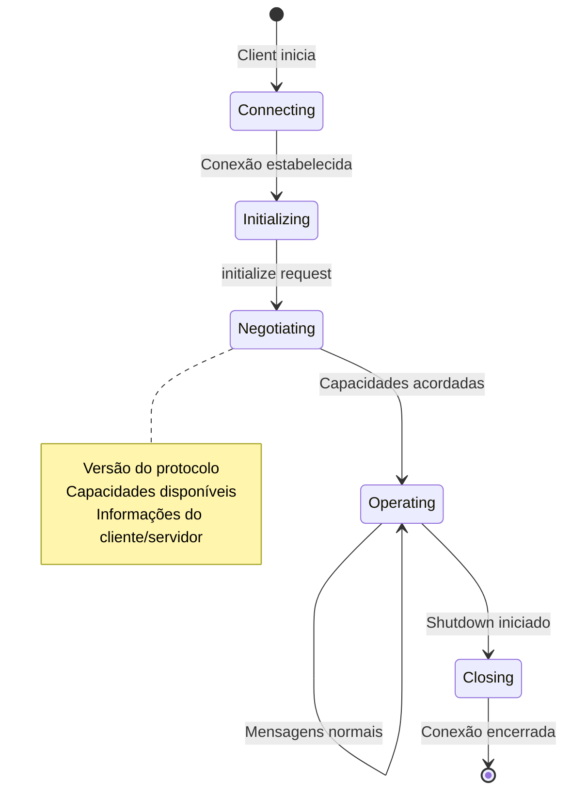

---

# Construindo seu Primeiro Servidor

## A Jornada de Maria: Do Zero ao Deploy

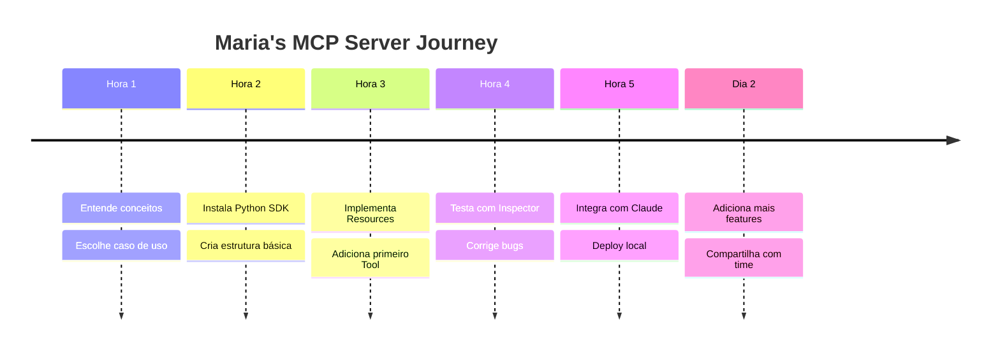

---

# Exemplo Completo: Weather Server

```python
from mcp.server import Server, Resource
from mcp.server.models import InitializationOptions
import mcp.types as types
import aiohttp

# Initialize server
app = Server("weather-server")

@app.list_resources()
async def handle_list_resources() -> list[types.Resource]:
    return [
        types.Resource(
            uri="weather://current",
            name="Current Weather",
            description="Real-time weather data",
            mimeType="application/json"
        )
    ]

@app.read_resource()
async def handle_read_resource(uri: str) -> str:
    if uri == "weather://current":
        # Fetch weather data
        async with aiohttp.ClientSession() as session:
            async with session.get("https://api.weather.com/...") as response:
                data = await response.json()
                return json.dumps(data)
    raise ValueError(f"Unknown resource: {uri}")

@app.list_tools()
async def handle_list_tools() -> list[types.Tool]:
    return [
        types.Tool(
            name="get_forecast",
            description="Get weather forecast",
            inputSchema={
                "type": "object",
                "properties": {
                    "location": {"type": "string"},
                    "days": {"type": "integer", "minimum": 1, "maximum": 7}
                },
                "required": ["location"]
            }
        )
    ]

@app.call_tool()
async def handle_call_tool(name: str, arguments: dict) -> list[types.TextContent]:
    if name == "get_forecast":
        location = arguments["location"]
        days = arguments.get("days", 3)
        
        # Get forecast data
        forecast = await fetch_forecast(location, days)
        
        return [types.TextContent(
            type="text",
            text=f"Forecast for {location}: {forecast}"
        )]
    
    raise ValueError(f"Unknown tool: {name}")
```

---

# Padrões de Sucesso em MCP

## 1. Servidor Focado (Single Responsibility)

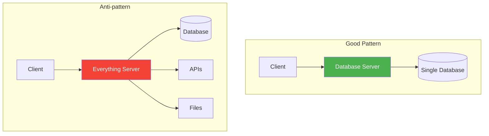

## 2. Resource Caching Pattern

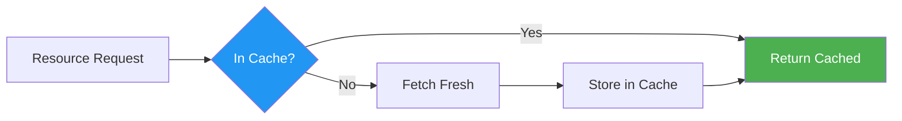

## 3. Tool Safety Pattern

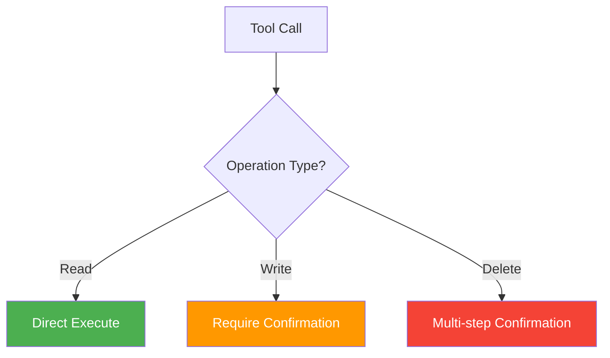

---

# Troubleshooting: Guia do Detetive MCP

## Problemas Comuns e Soluções

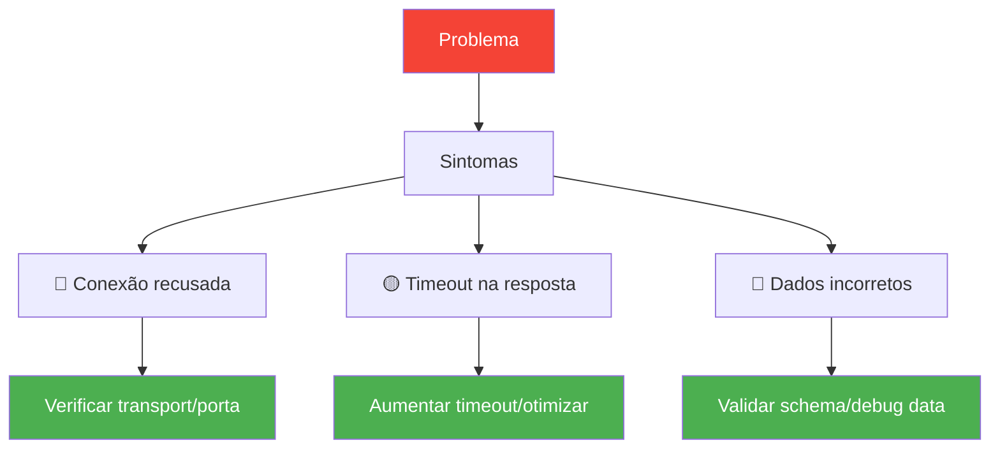

### Checklist de Debugging

1. **Conexão**
    
    - ✅ Transport correto (stdio/HTTP)?
    - ✅ Permissões de execução?
    - ✅ Variáveis de ambiente?
2. **Protocolo**
    
    - ✅ Versão compatível?
    - ✅ Capacidades negociadas?
    - ✅ Formato JSON válido?
3. **Dados**
    
    - ✅ Schema correto?
    - ✅ Encoding UTF-8?
    - ✅ URIs válidas?

---

# Performance e Escalabilidade

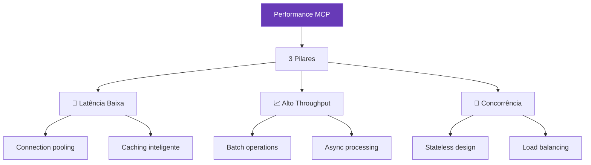

### Métricas de Sucesso

- **Latência P95**: < 100ms
- **Throughput**: > 1000 req/s
- **Concorrência**: 100+ clientes
- **Uptime**: 99.9%

---

# Segurança: Defesa em Profundidade

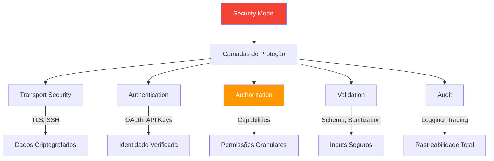

### Princípios de Segurança

1. **Zero Trust**: Valide tudo, sempre
2. **Least Privilege**: Mínimo acesso necessário
3. **Defense in Depth**: Múltiplas camadas
4. **Fail Secure**: Erros devem ser seguros
5. **Audit Everything**: Log completo

---

# Arquiteturas de Referência

## 1. Enterprise Gateway Pattern

```mermaid
graph TD
    subgraph "Enterprise MCP Architecture"
        APPS[AI Applications] --> GW[MCP Gateway]
        
        GW --> SEC[Security Layer]
        SEC --> ROUTER[Smart Router]
        ROUTER --> CACHE[Response Cache]
        
        ROUTER --> S1[HR Server]
        ROUTER --> S2[Finance Server]
        ROUTER --> S3[Sales Server]
        
        S1 --> HR[(HR System)]
        S2 --> FIN[(ERP)]
        S3 --> CRM[(CRM)]
    end
    
    style GW fill:#673ab7,color:#fff
    style SEC fill:#f44336,color:#fff
```

## 2. Microservices Pattern

```mermaid
graph TD
    subgraph "Microservices MCP"
        CLIENT[AI Client] --> MESH[Service Mesh]
        
        MESH --> MS1[User Service]
        MESH --> MS2[Order Service]
        MESH --> MS3[Product Service]
        
        MS1 --> DB1[(Users DB)]
        MS2 --> DB2[(Orders DB)]
        MS3 --> DB3[(Products DB)]
        
        MESH --> DISCOVER[Service Discovery]
        MESH --> CONFIG[Config Center]
    end
    
    style MESH fill:#2196F3,color:#fff
```

## 3. Event-Driven Pattern

```mermaid
graph LR
    subgraph "Event-Driven MCP"
        EVENTS[Event Stream] --> BROKER[Message Broker]
        
        BROKER --> MCP1[MCP Server 1]
        BROKER --> MCP2[MCP Server 2]
        BROKER --> MCP3[MCP Server 3]
        
        MCP1 & MCP2 & MCP3 --> CLIENTS[AI Clients]
        
        CLIENTS --> NOTIFY[Real-time Notifications]
    end
    
    style BROKER fill:#ff5722,color:#fff
```

---

# Casos de Sucesso por Indústria

## 🏦 Fintech: Assistente Bancário Inteligente

```mermaid
graph TD
    AI[AI Assistant] --> MCP[MCP Gateway]
    
    MCP --> TRANS[Transaction Server]
    MCP --> RISK[Risk Analysis]
    MCP --> COMP[Compliance]
    
    TRANS --> CORE[(Core Banking)]
    RISK --> ML[ML Models]
    COMP --> REG[(Regulations)]
    
    AI --> USE1[Consulta de saldo]
    AI --> USE2[Análise de fraude]
    AI --> USE3[Compliance check]
    
    style AI fill:#2196F3,color:#fff
    style MCP fill:#4CAF50,color:#fff
```

### Resultados Alcançados

- ⏱️ Tempo de resposta: 3s → 0.3s
- 🎯 Precisão em detecção de fraude: +40%
- 💰 Redução de custos operacionais: 60%
- 😊 Satisfação do cliente: +35%

## 🏥 Healthcare: Diagnóstico Assistido

```mermaid
graph TD
    DOC[Doctor's AI] --> MCP[MCP Protocol]
    
    MCP --> EMR[EMR Server]
    MCP --> LAB[Lab Results]
    MCP --> IMG[Imaging Server]
    
    EMR --> FHIR[(FHIR Store)]
    LAB --> LIMS[(LIMS)]
    IMG --> PACS[(PACS)]
    
    DOC --> DIAG[Diagnóstico diferencial]
    DOC --> TREAT[Plano de tratamento]
    DOC --> ALERT[Alertas críticos]
    
    style DOC fill:#e91e63,color:#fff
    style MCP fill:#4CAF50,color:#fff
```

### Impacto Medido

- 🎯 Precisão diagnóstica: +25%
- ⏰ Tempo de diagnóstico: -50%
- 📊 Dados integrados: 100%
- 🚨 Alertas críticos: tempo real

---

# A Jornada de Adoção MCP

```mermaid
journey
    title Sua Jornada com MCP
    
    section Descoberta
      Entende o problema: 5: You
      Descobre MCP: 9: You
      Vê potencial: 10: You
    
    section Exploração
      Lê documentação: 7: You
      Testa Inspector: 8: You
      Cria POC: 8: You
    
    section Implementação
      Primeiro servidor: 8: You
      Integra com app: 7: You
      Deploy inicial: 7: You
    
    section Expansão
      Adiciona features: 8: You
      Time adota: 9: You
      Escala solução: 9: You
    
    section Maestria
      Arquitetura robusta: 9: You
      Contribui comunidade: 10: You
      Lidera inovação: 10: You
```

---

# Melhores Práticas Consolidadas

## 1. Design de Servidores

```mermaid
mindmap
  root((Server Design))
    Single Responsibility
      Um foco claro
      Fácil manutenção
      Alta coesão
    Resource Management
      URIs descritivas
      Caching inteligente
      Paginação
    Tool Safety
      Validação rigorosa
      Human-in-the-loop
      Audit logs
    Error Handling
      Mensagens claras
      Graceful degradation
      Recovery strategies
```

## 2. Padrões de Integração

```mermaid
graph TD
    PATTERNS[Integration Patterns] --> P1[Adapter Pattern]
    PATTERNS --> P2[Facade Pattern]
    PATTERNS --> P3[Gateway Pattern]
    PATTERNS --> P4[Proxy Pattern]
    
    P1 --> USE1[Legacy systems]
    P2 --> USE2[Complex APIs]
    P3 --> USE3[Multiple services]
    P4 --> USE4[Security layer]
    
    style PATTERNS fill:#673ab7,color:#fff
```

## 3. Monitoring e Observability

```mermaid
graph LR
    OBS[Observability] --> METRICS[Metrics]
    OBS --> LOGS[Logging]
    OBS --> TRACES[Tracing]
    
    METRICS --> M1[Request rate]
    METRICS --> M2[Error rate]
    METRICS --> M3[Latency]
    
    LOGS --> L1[Structured logs]
    LOGS --> L2[Correlation IDs]
    
    TRACES --> T1[Distributed tracing]
    TRACES --> T2[Span analysis]
    
    style OBS fill:#607d8b,color:#fff
```

---

# O Ecossistema MCP Hoje

```mermaid
graph TD
    ECO[MCP Ecosystem] --> COMPONENTS[Componentes]
    
    COMPONENTS --> CLIENTS[70+ Clients]
    COMPONENTS --> SERVERS[100+ Servers]
    COMPONENTS --> TOOLS[1000+ Tools]
    
    ECO --> COMMUNITY[Comunidade]
    COMMUNITY --> DEVS[10k+ Developers]
    COMMUNITY --> CONTRIB[500+ Contributors]
    COMMUNITY --> COMP[50+ Companies]
    
    ECO --> ADOPTION[Adoção]
    ADOPTION --> GROWTH[200% growth]
    ADOPTION --> PROD[Production ready]
    ADOPTION --> ENTERPRISE[Enterprise scale]
    
    style ECO fill:#2196F3,color:#fff
    style COMMUNITY fill:#4CAF50,color:#fff
```

---

# Recursos para sua Jornada

```mermaid
graph TD
    RES[Recursos MCP] --> LEARN[🎓 Aprendizado]
    RES --> BUILD[🛠️ Construção]
    RES --> CONNECT[🤝 Comunidade]
    
    LEARN --> L1[Documentação oficial]
    LEARN --> L2[Tutoriais interativos]
    LEARN --> L3[Vídeos e workshops]
    
    BUILD --> B1[SDKs oficiais]
    BUILD --> B2[Exemplos de código]
    BUILD --> B3[Templates prontos]
    
    CONNECT --> C1[GitHub Discussions]
    CONNECT --> C2[Discord community]
    CONNECT --> C3[Stack Overflow]
    
    style RES fill:#673ab7,color:#fff
```

### Links Essenciais

- 📚 **Documentação**: [modelcontextprotocol.io](https://modelcontextprotocol.io/)
- 🛠️ **GitHub**: [github.com/modelcontextprotocol](https://github.com/modelcontextprotocol)
- 🔍 **Inspector**: Para debugging interativo
- 🎯 **Exemplos**: Servidores de referência

---

# Anti-Padrões: O Que Evitar

```mermaid
graph TD
    ANTI[Anti-Patterns] --> A1[🚫 God Server]
    ANTI --> A2[🚫 Tight Coupling]
    ANTI --> A3[🚫 No Validation]
    ANTI --> A4[🚫 Sync Everything]
    
    A1 --> S1[Um servidor faz tudo]
    A2 --> S2[Dependências diretas]
    A3 --> S3[Trust all inputs]
    A4 --> S4[Blocking operations]
    
    style ANTI fill:#f44336,color:#fff
```

### Como Evitar

1. **God Server**: Divida em servidores focados
2. **Tight Coupling**: Use abstrações e interfaces
3. **No Validation**: Sempre valide inputs
4. **Sync Everything**: Prefira operações async

---

# MCP para Diferentes Personas

## 👨‍💻 Para Desenvolvedores

```mermaid
graph LR
    DEV[Developer] --> FOCUS[Foco em]
    FOCUS --> F1[SDKs e APIs]
    FOCUS --> F2[Exemplos práticos]
    FOCUS --> F3[Debugging tools]
    FOCUS --> F4[Performance tips]
    
    style DEV fill:#2196F3,color:#fff
```

**Sua jornada**: Código → Teste → Deploy → Otimize

## 🏗️ Para Arquitetos

```mermaid
graph LR
    ARCH[Architect] --> FOCUS[Foco em]
    FOCUS --> F1[Patterns]
    FOCUS --> F2[Scalability]
    FOCUS --> F3[Security]
    FOCUS --> F4[Integration]
    
    style ARCH fill:#673ab7,color:#fff
```

**Sua jornada**: Design → Padrões → Governança → Evolução

## 📊 Para Product Managers

```mermaid
graph LR
    PM[Product Manager] --> FOCUS[Foco em]
    FOCUS --> F1[Business value]
    FOCUS --> F2[User experience]
    FOCUS --> F3[ROI metrics]
    FOCUS --> F4[Roadmap]
    
    style PM fill:#4CAF50,color:#fff
```

**Sua jornada**: Problema → Solução → Métricas → Escala

---

# Métricas de Sucesso com MCP

```mermaid
graph TD
    METRICS[Métricas MCP] --> TECH[Técnicas]
    METRICS --> BIZ[Negócio]
    METRICS --> USER[Usuário]
    
    TECH --> T1[Latência < 100ms]
    TECH --> T2[Uptime > 99.9%]
    TECH --> T3[Zero memory leaks]
    
    BIZ --> B1[Redução de custos 70%]
    BIZ --> B2[Time-to-market 5x]
    BIZ --> B3[ROI positivo]
    
    USER --> U1[Satisfação +40%]
    USER --> U2[Adoção 90%]
    USER --> U3[Retenção 95%]
    
    style METRICS fill:#ff9800,color:#fff
```

---

# O Futuro com MCP

```mermaid
graph TD
    TODAY[Hoje] --> MCP[Com MCP]
    MCP --> FUTURE[Futuro]
    
    TODAY --> T1[IAs isoladas]
    TODAY --> T2[Integrações frágeis]
    TODAY --> T3[Alto custo]
    
    FUTURE --> F1[IAs contextuais]
    FUTURE --> F2[Ecossistema robusto]
    FUTURE --> F3[Inovação acelerada]
    
    style TODAY fill:#f44336,color:#fff
    style MCP fill:#ff9800,color:#fff
    style FUTURE fill:#4CAF50,color:#fff
```

> "MCP não é apenas tecnologia. É a ponte entre o potencial da IA e sua realização prática." — **A Comunidade MCP**

---

# Sua Decisão Estratégica

```mermaid
graph TD
    NOW[Agora] --> CHOICE{Sua Escolha}
    
    CHOICE -->|Adotar MCP| SUCCESS[Sucesso]
    CHOICE -->|Esperar| RISK[Risco]
    
    SUCCESS --> S1[✅ Inovação rápida]
    SUCCESS --> S2[✅ Custos otimizados]
    SUCCESS --> S3[✅ Vantagem competitiva]
    
    RISK --> R1[❌ Ficar para trás]
    RISK --> R2[❌ Custos crescentes]
    RISK --> R3[❌ Complexidade maior]
    
    style SUCCESS fill:#4CAF50,color:#fff
    style RISK fill:#f44336,color:#fff
```

---

# Comece Sua Jornada Hoje

## Três Passos Simples

```mermaid
graph LR
    STEP1[1. Explore] --> STEP2[2. Experimente]
    STEP2 --> STEP3[3. Construa]
    
    STEP1 --> A1[Leia a documentação]
    STEP1 --> A2[Junte-se à comunidade]
    
    STEP2 --> B1[Use o Inspector]
    STEP2 --> B2[Teste servidores exemplo]
    
    STEP3 --> C1[Crie seu servidor]
    STEP3 --> C2[Compartilhe conhecimento]
    
    style STEP1 fill:#2196F3,color:#fff
    style STEP2 fill:#ff9800,color:#fff
    style STEP3 fill:#4CAF50,color:#fff
```

## Recursos Imediatos

1. **Site Oficial**: [modelcontextprotocol.io](https://modelcontextprotocol.io/)
2. **GitHub**: Código, exemplos e discussões
3. **Comunidade**: Discord, fóruns, meetups
4. **Suporte**: Documentação, tutoriais, workshops

---

# MCP: A Revolução Começa com Você

O Model Context Protocol não é apenas mais uma tecnologia. É o elo perdido entre a inteligência artificial e o mundo real.

Quando você conecta IAs ao contexto do seu negócio, você não implementa uma ferramenta - você desbloqueia possibilidades infinitas.

**O futuro da IA é contextual. E começa agora.**

---

# Apêndice: Referência Técnica Rápida

## Estrutura de Mensagens

```typescript
// Request
interface Request {
  jsonrpc: "2.0";
  id: string | number;
  method: string;
  params?: object;
}

// Response
interface Response {
  jsonrpc: "2.0";
  id: string | number;
  result?: object;
  error?: {
    code: number;
    message: string;
    data?: any;
  };
}

// Notification
interface Notification {
  jsonrpc: "2.0";
  method: string;
  params?: object;
}
```

## Capabilities Reference

```typescript
interface Capabilities {
  experimental?: object;
  logging?: {};
  prompts?: {
    listChanged?: boolean;
  };
  resources?: {
    subscribe?: boolean;
    listChanged?: boolean;
  };
  tools?: {
    listChanged?: boolean;
  };
}
```

## Métodos Principais

|Método|Tipo|Descrição|
|---|---|---|
|`initialize`|Request|Inicia sessão|
|`initialized`|Notification|Confirma inicialização|
|`resources/list`|Request|Lista recursos|
|`resources/read`|Request|Lê recurso|
|`tools/list`|Request|Lista ferramentas|
|`tools/call`|Request|Executa ferramenta|
|`prompts/list`|Request|Lista prompts|
|`prompts/get`|Request|Obtém prompt|

---

# Junte-se à Revolução MCP

**A inteligência artificial sem contexto é apenas potencial.**  
**Com MCP, transformamos potencial em realidade.**

Comece h
A revolução já começou. Junte-se a nós.

**🚀 [modelcontextprotocol.io](https://modelcontextprotocol.io/) 🚀**