# Model Context Protocol (MCP)

## O Adaptador Universal Para Aplicações de IA 🔌

---

# Quantas vezes sua IA precisou acessar dados que ela não conseguia ver? 🤔

---

# O Que É o MCP?

O Model Context Protocol (MCP) é um padrão aberto que permite que aplicações de IA se conectem com fontes de dados e ferramentas de forma padronizada.

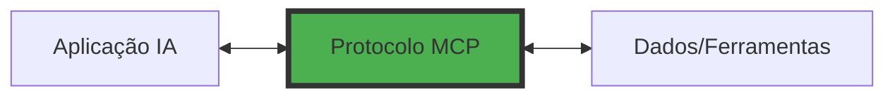

## Analogia Perfeita: MCP é o USB-C das IAs

- **Um protocolo universal** para todas as conexões
- **Elimina integrações customizadas** para cada sistema
- **Padroniza a comunicação** entre componentes
- **Permite interoperabilidade** total no ecossistema

---

# O Mundo Antes e Depois do MCP

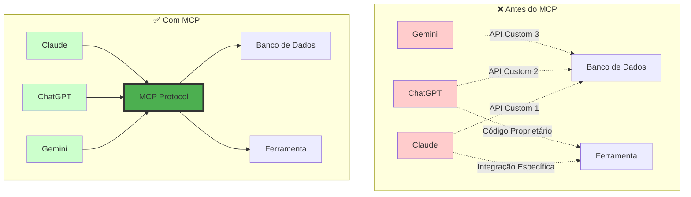

---

# O Problema: IAs Vivem em Ilhas Isoladas 🏝️

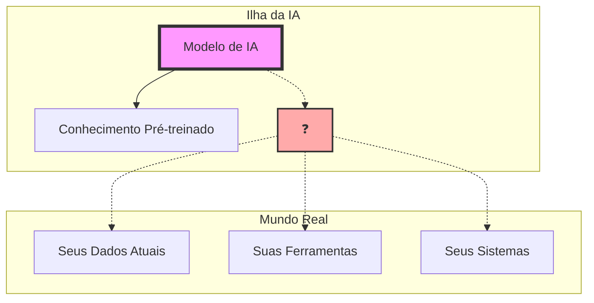

### Consequências:

- 📅 Dados desatualizados
- 🔒 Sem acesso aos seus sistemas
- ⚡ Incapacidade de executar ações
- 🎯 Respostas genéricas sem contexto

---

# Torre de Babel Digital: O Caos das Integrações

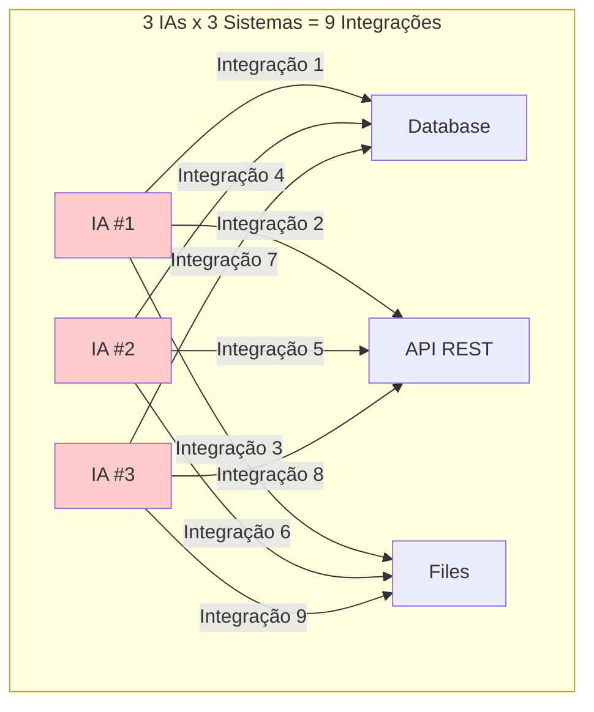

### Problemas Exponenciais:

- 💰 **Custo:** Cada integração custa tempo e dinheiro
- 🔄 **Manutenção:** Mudanças requerem múltiplas atualizações
- 🐛 **Inconsistência:** Cada integração pode ter bugs únicos
- ⏱️ **Escalabilidade:** Adicionar nova IA = recriar tudo

---

# MCP: A Solução Universal 🌟

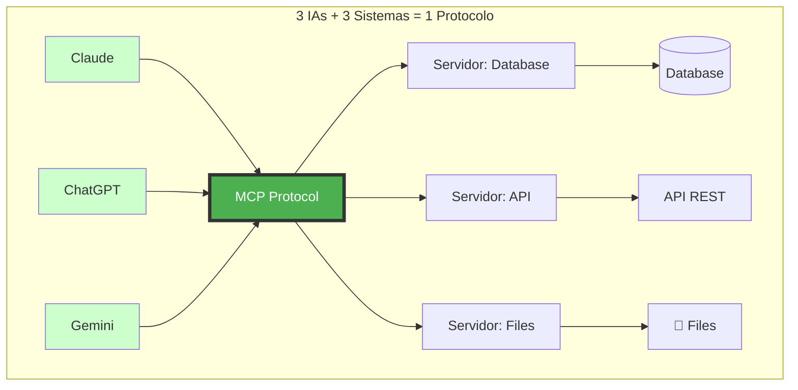

### Uma Mudança de Paradigma:

- ✅ **Uma linguagem comum** para todas as IAs
- ♻️ **Reutilização total** de servidores
- 🔄 **Manutenção centralizada**
- 🚀 **Escalabilidade infinita**

---

# Arquitetura MCP: Os Três Mosqueteiros

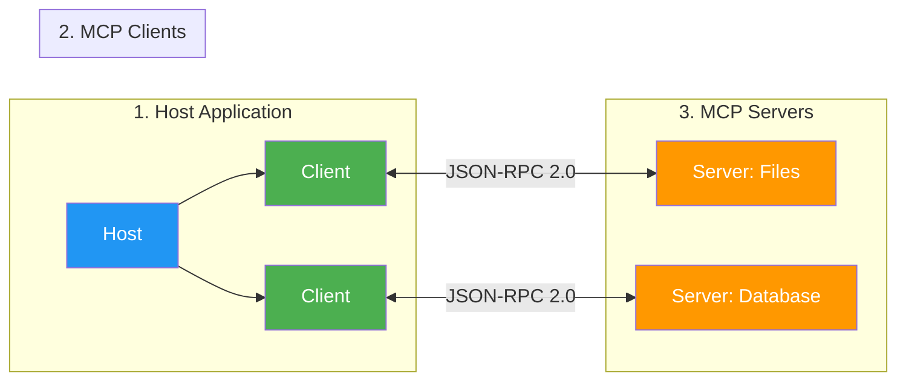

## Os Pilares do Ecossistema:

1. **🏠 Hosts:** Aplicações que hospedam IAs (Claude Desktop, VSCode)
2. **🔌 Clients:** Conectores que implementam o protocolo
3. **⚙️ Servers:** Serviços que expõem dados e ferramentas
4. **📡 Protocol:** JSON-RPC 2.0 padronizado

---

# O Ecossistema MCP Hoje 🌐

```mermaid
graph TD
    subgraph "Aplicações Host"
        H1[🖥️ Claude Desktop]
        H2[📝 Cursor IDE]
        H3[⚡ Continue.dev]
        H4[🛠️ Windsurf]
        H5[🔧 Custom Apps]
    end
    
    subgraph "Servidores Oficiais"
        S1[📦 GitHub]
        S2[📁 Google Drive]
        S3[💬 Slack]
        S4[🗄️ PostgreSQL]
        S5[📊 SQLite]
    end
    
    subgraph "Servidores Comunidade"
        C1[🐳 Docker]
        C2[☸️ Kubernetes]
        C3[📈 Linear]
        C4[❄️ Snowflake]
        C5[🎵 Spotify]
    end
    
    H1 & H2 & H3 & H4 & H5 ---|MCP Protocol| S1 & S2 & S3 & S4 & S5
    H1 & H2 & H3 & H4 & H5 ---|MCP Protocol| C1 & C2 & C3 & C4 & C5
```

---

# Conceitos Fundamentais: Core Architecture

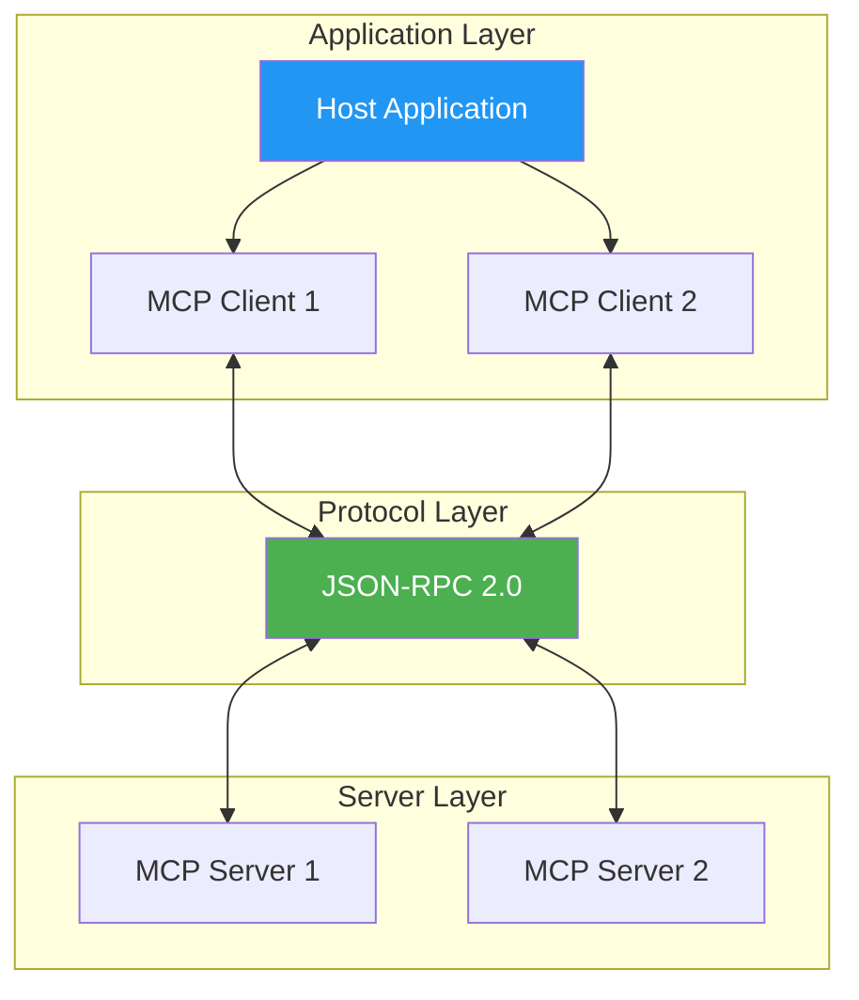

### Princípios da Arquitetura:

- **Stateful Sessions:** Conexões mantêm estado
- **Capability Negotiation:** Servidor e cliente negociam features
- **Security Boundaries:** Isolamento entre servidores
- **Progressive Enhancement:** Features podem ser adicionadas incrementalmente

---

# Conceitos Fundamentais: Transports

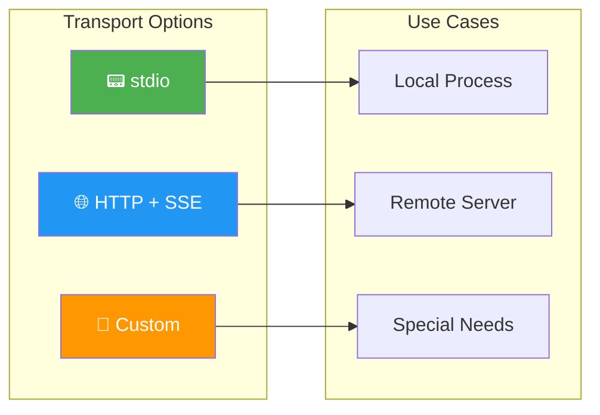

### Tipos de Transporte:

- **stdio:** Comunicação local via stdin/stdout
    - Ideal para subprocessos
    - Zero configuração de rede
- **HTTP + SSE:** Para servidores remotos
    - Server-Sent Events para mensagens do servidor
    - HTTP POST para mensagens do cliente
- **Custom:** Implementações específicas
    - WebSocket, gRPC, etc.

---

# Conceitos Fundamentais: Resources

```mermaid
graph TD
    subgraph "Resource System"
        R[Resources] --> URI[URI-based]
        R --> TYPE[Content Types]
        R --> SUB[Subscriptions]
    end
    
    subgraph "Examples"
        E1[📄 file:///docs/guide.pdf]
        E2[🗃️ postgres://db/users]
        E3[📸 screen://desktop]
        E4[📝 template://report/{id}]
    end
    
    URI --> E1 & E2 & E3 & E4
    
    style R fill:#4CAF50,color:#fff
    style URI fill:#2196F3,color:#fff
```

### Características dos Resources:

- **Identificação por URI:** Cada recurso tem endereço único
- **Tipos de conteúdo:** Texto, binário, ou misto
- **Templates dinâmicos:** URIs parametrizados
- **Subscriptions:** Notificações de mudanças

```json
{
  "uri": "file:///project/README.md",
  "name": "Project Documentation",
  "mimeType": "text/markdown",
  "description": "Main project documentation"
}
```

---

# Conceitos Fundamentais: Prompts

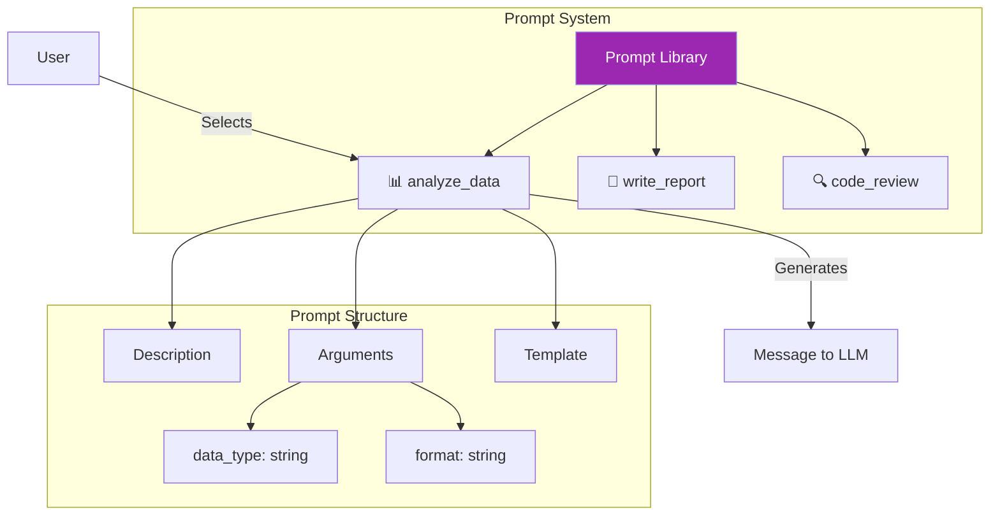

### Como Prompts Funcionam:

- **Templates pré-definidos** para tarefas comuns
- **Argumentos dinâmicos** customizam cada uso
- **Controle do usuário** via interface (slash commands)
- **Mensagens estruturadas** garantem consistência

```json
{
  "name": "analyze_data",
  "description": "Analyzes data and provides insights",
  "arguments": [
    {
      "name": "data_type",
      "required": true,
      "description": "Type of data to analyze"
    }
  ]
}
```

---

# Conceitos Fundamentais: Tools

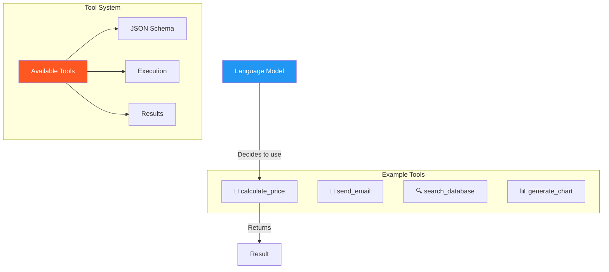

### Características das Tools:

- **Controladas pelo modelo:** LLM decide quando usar
- **Schema definido:** Parâmetros via JSON Schema
- **Aprovação humana:** Usuário pode vetar execução
- **Retorno estruturado:** Resultados em formato padrão

```json
{
  "name": "calculate_price",
  "description": "Calculates product pricing",
  "inputSchema": {
    "type": "object",
    "properties": {
      "product_id": {"type": "string"},
      "quantity": {"type": "number"}
    },
    "required": ["product_id", "quantity"]
  }
}
```

---

# Conceitos Fundamentais: Sampling

```mermaid
sequenceDiagram
    participant S as MCP Server
    participant C as MCP Client
    participant U as User
    participant LLM as Language Model
    
    S->>C: sampling/createMessage
    Note over C: Validates request
    C->>U: Request approval
    U-->>C: ✅ Approved
    C->>LLM: Forward request
    LLM-->>C: Generated response
    C->>U: Show response
    U-->>C: ✅ Approved
    C-->>S: Final response
    
    style S fill:#FF9800
    style C fill:#4CAF50
    style U fill:#2196F3
    style LLM fill:#9C27B0
```

### O Poder do Sampling:

- **Fluxo inverso:** Servidor pede ajuda ao LLM
- **Comportamento agêntico:** Permite autonomia
- **Controle humano:** Usuário sempre no loop
- **Casos de uso:** Análises complexas, decisões

```json
{
  "method": "sampling/createMessage",
  "params": {
    "messages": [{
      "role": "user",
      "content": "Analyze this dataset and suggest optimizations"
    }],
    "temperature": 0.7
  }
}
```

---

# Conceitos Fundamentais: Roots

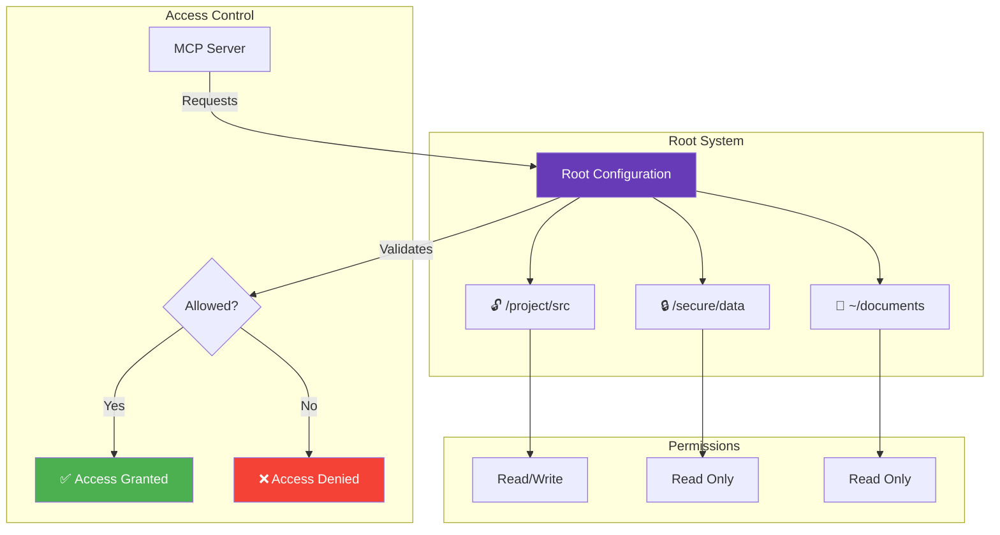

### Segurança com Roots:

- **Boundaries explícitos:** Define onde servidor pode operar
- **Principle of Least Privilege:** Acesso mínimo necessário
- **Controle do cliente:** Host decide quais roots expor
- **Isolamento:** Cada servidor vê apenas seus roots

---

# Segurança e Controle no MCP 🔐

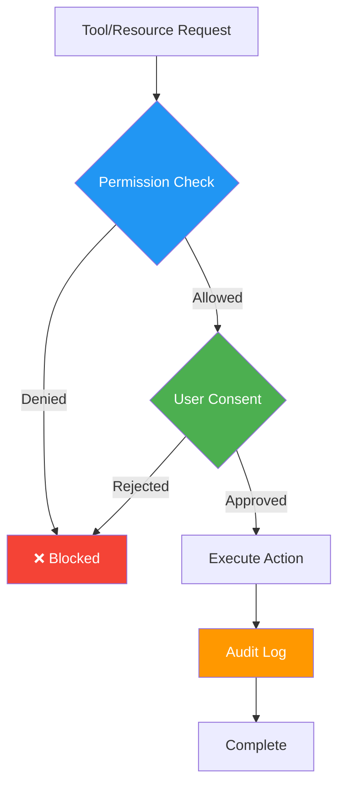

### Camadas de Segurança:

1. **Permissões granulares** por servidor
2. **Consentimento explícito** do usuário
3. **Auditoria completa** de ações
4. **Isolamento de contexto** entre servidores
5. **Validação** de todos os inputs

---

# Como Tudo se Conecta: Fluxo Completo

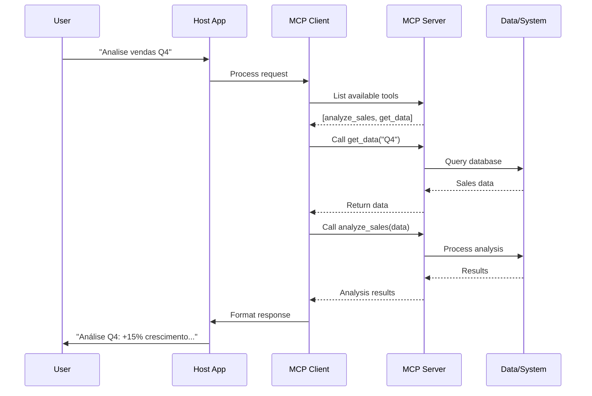

---

# MCP vs Outras Abordagens

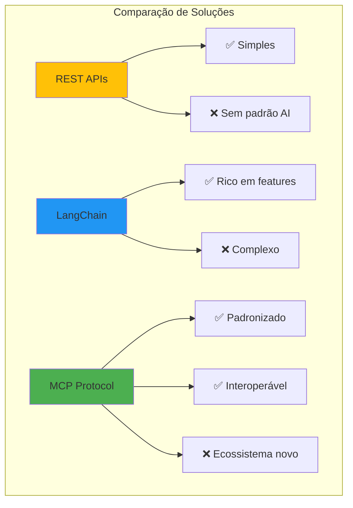

|Critério|REST APIs|LangChain|MCP|
|---|---|---|---|
|**Complexidade**|Baixa|Alta|Média|
|**Padronização**|Nenhuma|Framework|Protocolo|
|**Interoperabilidade**|Manual|Limitada|Nativa|
|**Maturidade**|Alta|Média|Emergente|

---

# Casos de Uso Por Indústria 🏭

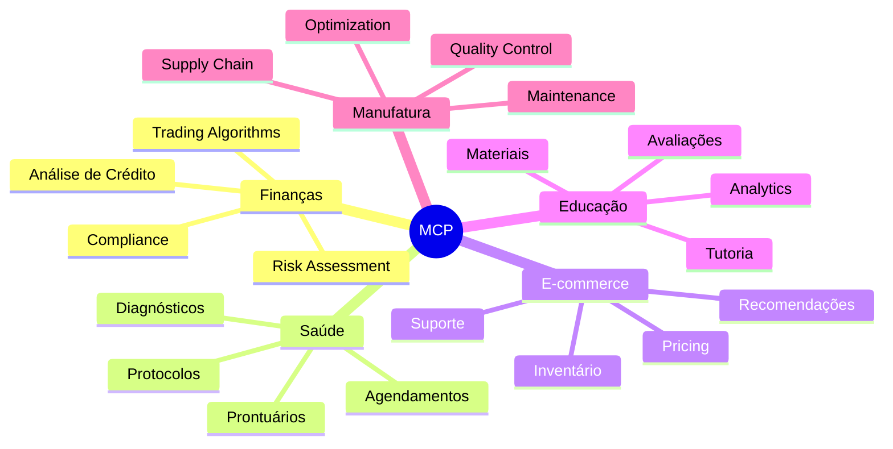

---

# Exemplo Prático: Setor Financeiro 💰

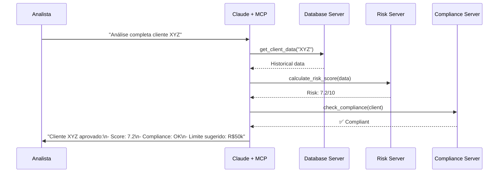

### Benefícios Reais:

- ⚡ Análise em segundos vs horas
- 🎯 Dados sempre atualizados
- 📊 Integração de múltiplos sistemas
- ✅ Compliance automático

---

# ROI e Métricas de Negócio 📈

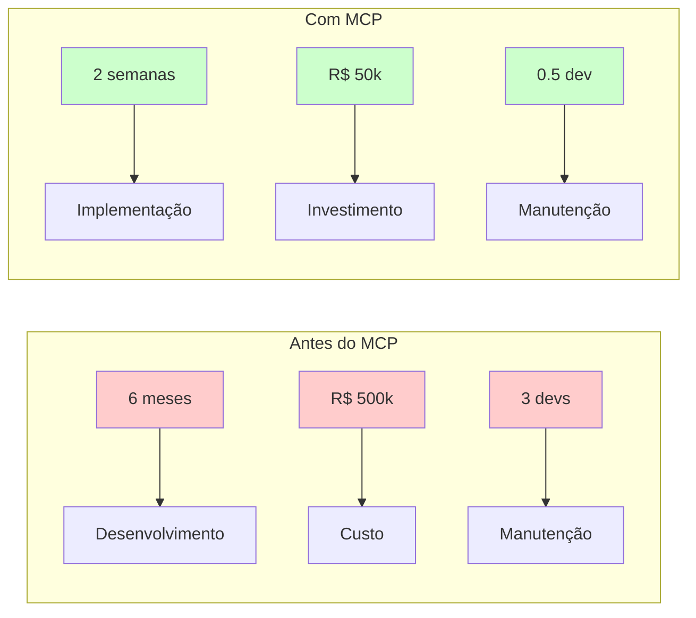

### Impacto Mensurável:

|Métrica|Sem MCP|Com MCP|Melhoria|
|---|---|---|---|
|**Tempo de integração**|6 meses|2 semanas|92% ⬇️|
|**Custo inicial**|R$ 500k|R$ 50k|90% ⬇️|
|**Manutenção**|3 devs|0.5 dev|83% ⬇️|
|**Time to market**|8 meses|1 mês|87% ⬇️|

---

# Quick Start: Servidor MCP em 5 Minutos 🚀

```python
from mcp.server import Server
from mcp.server.fastmcp import FastMCP

# 1. Criar servidor
app = FastMCP("meu-servidor")

# 2. Adicionar ferramenta
@app.tool("buscar_produto")
async def buscar_produto(id: str):
    """Busca produto no estoque"""
    # Sua lógica aqui
    return {
        "id": id,
        "nome": "Notebook Pro",
        "preco": 5999.90,
        "estoque": 15
    }

# 3. Adicionar recurso
@app.resource("catalogo://produtos")
async def listar_produtos():
    """Lista todos os produtos"""
    return "Catálogo com 150 produtos ativos"

# 4. Rodar!
if __name__ == "__main__":
    app.run(transport="stdio")
```

### Setup em 3 passos:

```bash
# 1. Instalar
pip install mcp

# 2. Salvar código
# 3. Executar
python servidor.py
```

---

# Exemplo Real: E-commerce Assistant 🛒

```python
@app.tool("verificar_estoque")
async def verificar_estoque(produto_id: str, loja_id: str = None):
    """Verifica disponibilidade em tempo real"""
    estoque = await db.query_inventory(produto_id, loja_id)
    return {
        "disponivel": estoque.quantidade > 0,
        "quantidade": estoque.quantidade,
        "previsao_reposicao": estoque.proxima_entrada
    }

@app.tool("calcular_frete")
async def calcular_frete(cep: str, produtos: list):
    """Calcula opções de entrega"""
    opcoes = await shipping_api.calculate(cep, produtos)
    return [{
        "transportadora": opt.carrier,
        "prazo_dias": opt.days,
        "valor": opt.price
    } for opt in opcoes]

@app.prompt("suporte_venda")
async def suporte_venda(cliente_id: str, contexto: str):
    """Template para atendimento de vendas"""
    historico = await get_customer_history(cliente_id)
    return f"""
    Cliente: {historico.nome}
    Compras anteriores: {len(historico.pedidos)}
    Contexto atual: {contexto}
    
    Forneça suporte personalizado...
    """
```

---

# Roadmap MCP: O Futuro 🔮

```mermaid
timeline
    title Evolução do Model Context Protocol
    
    section Q4 2024
      Lançamento : Especificação inicial
      SDKs : Python, TypeScript
      Early Adopters : Claude Desktop, Continue
    
    section Q1 2025
      Validação : Test suites
      Registry : Descoberta de servidores
      Community : Primeiros contributors
    
    section Q2-Q3 2025
      Agent Graphs : Topologias complexas
      Enterprise : Features corporativas
      Standards : ISO/IEEE discussions
    
    section 2026+
      Multimodal : Video, audio streaming
      Federation : Servidores distribuídos
      AI OS : Sistema operacional para IA
```

### Oportunidades Emergentes:

- 🌐 **Marketplaces** de servidores MCP
- 🏢 **Enterprise features** (audit, compliance)
- 🤖 **Agent ecosystems** complexos
- 📱 **Mobile SDKs** para apps

---

# Como Começar HOJE 📋

## Para Desenvolvedores 👩‍💻

```mermaid
graph LR
    S1[1. Escolher SDK] --> S2[2. Clonar exemplo]
    S2 --> S3[3. Customizar]
    S3 --> S4[4. Testar]
    S4 --> S5[5. Deploy]
    
    style S1 fill:#4CAF50,color:#fff
    style S5 fill:#2196F3,color:#fff
```

### Recursos:

- 📚 [Documentação oficial](https://modelcontextprotocol.io/)
- 🧑‍💻 [Exemplos no GitHub](https://github.com/modelcontextprotocol/servers)
- 🎓 [Tutorial interativo](https://modelcontextprotocol.io/quickstart)

## Para Empresas 🏢

```mermaid
graph TD
    A[Identificar caso de uso] --> B[Proof of Concept]
    B --> C{Sucesso?}
    C -->|Sim| D[Piloto controlado]
    C -->|Não| E[Ajustar approach]
    D --> F[Rollout gradual]
    E --> B
    
    style A fill:#4CAF50,color:#fff
    style F fill:#2196F3,color:#fff
```

### Checklist:

- [ ] Mapear 3 sistemas críticos
- [ ] Definir métricas de sucesso
- [ ] Alocar time (1 dev, 2 semanas)
- [ ] Executar PoC
- [ ] Medir e iterar

---

# Ecossistema e Comunidade 🌍

```mermaid
graph TD
    subgraph "Open Source"
        OS1[anthropic/servers]
        OS2[modelcontextprotocol/*]
        OS3[Community Servers]
    end
    
    subgraph "Ferramentas"
        T1[MCP Inspector]
        T2[SDK Generators]
        T3[Testing Tools]
    end
    
    subgraph "Comunidade"
        C1[Discord]
        C2[GitHub Discussions]
        C3[Stack Overflow]
    end
    
    OS1 & OS2 & OS3 --> Hub[MCP Hub]
    T1 & T2 & T3 --> Hub
    C1 & C2 & C3 --> Hub
    
    style Hub fill:#4CAF50,color:#fff,stroke-width:4px
```

### Junte-se à Revolução:

- 💬 [Discord MCP](https://discord.gg/mcp)
- 🐙 [GitHub](https://github.com/modelcontextprotocol)
- 📝 [Blog & Updates](https://modelcontextprotocol.io/blog)
- 🎯 [Roadmap público](https://github.com/modelcontextprotocol/specification/projects)

---

# Recursos e Documentação 📚

```mermaid
graph LR
    subgraph "Para Começar"
        D1[🚀 Quickstart]
        D2[📖 Tutoriais]
        D3[🎥 Videos]
    end
    
    subgraph "Referência"
        R1[📜 Spec]
        R2[🔧 SDKs]
        R3[📚 API Docs]
    end
    
    subgraph "Avançado"
        A1[🏗️ Arquitetura]
        A2[🔐 Segurança]
        A3[⚡ Performance]
    end
    
    D1 --> R1 --> A1
    D2 --> R2 --> A2
    D3 --> R3 --> A3
```

### Links Essenciais:

- **Site oficial:** [modelcontextprotocol.io](https://modelcontextprotocol.io/)
- **Especificação:** [spec.modelcontextprotocol.io](https://spec.modelcontextprotocol.io/)
- **GitHub:** [github.com/modelcontextprotocol](https://github.com/modelcontextprotocol)
- **Exemplos:** [github.com/modelcontextprotocol/servers](https://github.com/modelcontextprotocol/servers)

---

# Chamada Para Ação 🎯

## Para Desenvolvedores 💻

> ### "Construa seu primeiro servidor MCP em 30 minutos!"
> 
> 1. Clone um exemplo
> 2. Customize para seu caso
> 3. Conecte ao Claude Desktop
> 4. Compartilhe com a comunidade

## Para Líderes Técnicos 🏗️

> ### "Identifique 3 integrações que poderiam usar MCP"
> 
> 1. Mapeie sistemas isolados
> 2. Estime economia potencial
> 3. Inicie um piloto
> 4. Meça resultados

## Para Todos 🌟

> ### "Junte-se à revolução das IAs conectadas!"
> 
> - Entre no Discord
> - Contribua com código
> - Compartilhe experiências
> - Molde o futuro do MCP

---

# O Futuro é Conectado 🌟

```mermaid
graph TD
    Today[Hoje: IAs isoladas] --> Tomorrow[Amanhã: IAs conectadas]
    Tomorrow --> Future[Futuro: Ecossistema inteligente]
    
    subgraph "Evolução"
        E1[2024: Primeiros adotantes]
        E2[2025: Adoção mainstream]
        E3[2026: Padrão da indústria]
    end
    
    Today --> E1
    E1 --> E2
    E2 --> E3
    E3 --> Future
    
    style Today fill:#ffcccc
    style Tomorrow fill:#ffffcc
    style Future fill:#ccffcc
```

### MCP é mais que um protocolo...

## É a fundação para o futuro das aplicações de IA! 🚀

---

# Obrigado! 🙏

## Model Context Protocol (MCP)

### O Adaptador Universal Para Aplicações de IA

> 💭 "O futuro pertence àqueles que conectam mundos diferentes"

### Contato e Recursos:

- 🌐 [modelcontextprotocol.io](https://modelcontextprotocol.io/)
- 📧 [mcp@anthropic.com](mailto:mcp@anthropic.com)
- 💬 [Discord Community](https://discord.gg/mcp)
- 🐙 [GitHub](https://github.com/modelcontextprotocol)

> Apresentação criada com ❤️ para a comunidade
> 
> Junho