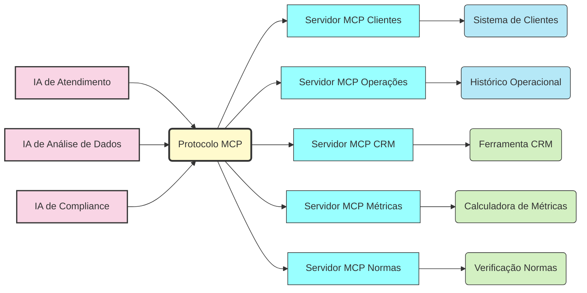

# O MCP Como Solução Universal

O Model Context Protocol transforma esta realidade ao criar uma interface padronizada entre as IAs e os sistemas externos. É como um "tradutor universal" que permite que qualquer IA se comunique facilmente com qualquer sistema.

**A Nova Arquitetura com MCP:**

## Benefícios Transformadores

A adoção do MCP traz vários benefícios críticos para as organizações:

- **Unificação:** Todas as aplicações de IA falam a mesma língua
- **Reutilização:** Um servidor MCP serve a múltiplas aplicações
- **Modularidade:** Adicionar uma nova fonte de dados significa apenas criar mais um servidor MCP
- **Interoperabilidade:** Fácil troca entre diferentes LLMs (Claude, GPT, etc.)
- **Segurança padronizada:** Um modelo de segurança único e auditável
- **Documentação automática:** Autodocumentação via especificações do protocolo

## A Analogia do USB

O MCP é para a IA o que os padrões USB são para dispositivos eletrônicos: um conector universal que permite a interconexão entre diferentes sistemas.

Assim como o USB eliminou a necessidade de diferentes cabos e adaptadores para cada tipo de dispositivo, o MCP elimina a necessidade de criar conexões específicas entre cada IA e cada sistema externo.

Esta padronização é o que realmente permite que a IA se torne uma tecnologia verdadeiramente onipresente nas organizações - conectada, contextual e capaz.

---

[Anterior: O Desafio das IAs Isoladas](02-mcp-desafio-ias-isoladas.md) | [Próximo: Arquitetura MCP](04-mcp-arquitetura-mcp.md) 