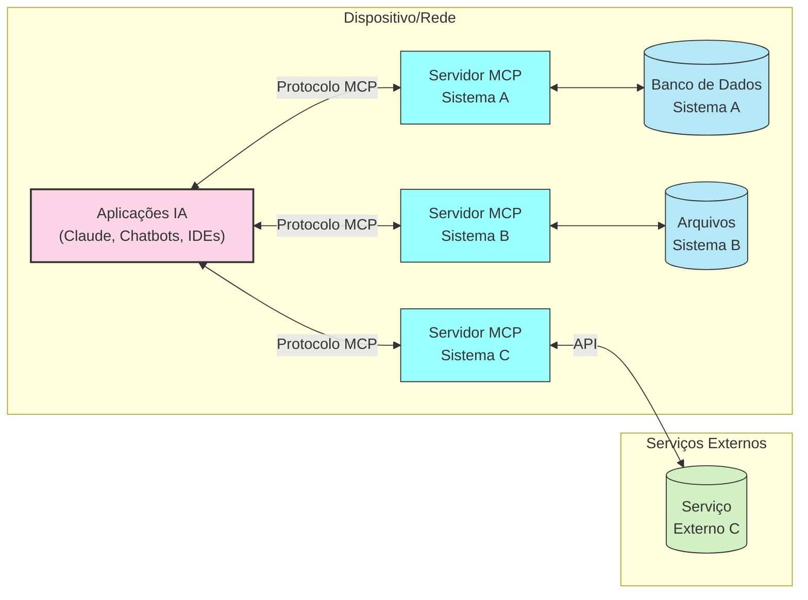
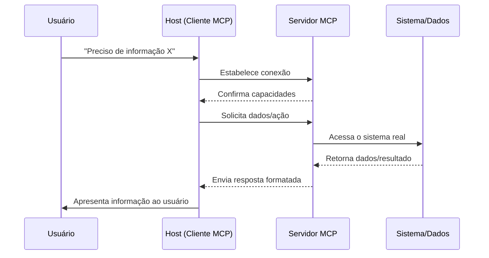

# Arquitetura MCP: Como Tudo se Conecta

O MCP se baseia em uma arquitetura cliente-servidor elegante e flexível:

## Os Três Pilares do MCP

### 1. MCP Hosts (Clientes)

- As aplicações que incorporam LLMs e precisam de acesso a dados/ferramentas
- Exemplos: Claude Desktop, plugins de IDE, chatbots corporativos
- Função: Coordenar a comunicação entre os LLMs e os servidores MCP

### 2. MCP Servers (Servidores)

- Componentes que fornecem acesso a sistemas específicos
- Cada servidor é especializado em um sistema ou fonte de dados
- Operam independentemente, podendo ser locais ou remotos
- Exemplos: Um servidor para dados de clientes, outro para documentação técnica

### 3. O Protocolo MCP

- A "língua comum" falada entre hosts e servidores
- Define formatos de mensagens padronizados
- Estabelece regras claras de comunicação
- Garante segurança e controle de acesso

## Como Funciona na Prática

Este fluxo é semelhante a um intérprete que facilita uma conversa entre pessoas que falam idiomas diferentes: o protocolo traduz as necessidades do LLM para os sistemas externos e vice-versa.

## Flexibilidade da Arquitetura

Uma das principais vantagens do MCP é sua arquitetura distribuída e agnóstica em relação a implementações. Isso significa que:

- Servidores podem ser desenvolvidos independentemente
- Múltiplos servidores podem operar em paralelo
- Clientes podem se conectar a diversos servidores simultaneamente
- A comunicação pode acontecer local ou remotamente

Este design permite que organizações implementem o MCP de forma incremental, começando com integrações simples e expandindo conforme necessário.

---

[Anterior: O MCP Como Solução Universal](03-mcp-solucao-universal.md) | [Próximo: Conceitos Fundamentais](05-mcp-conceitos-fundamentais.md) 