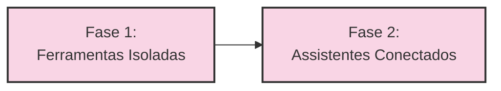
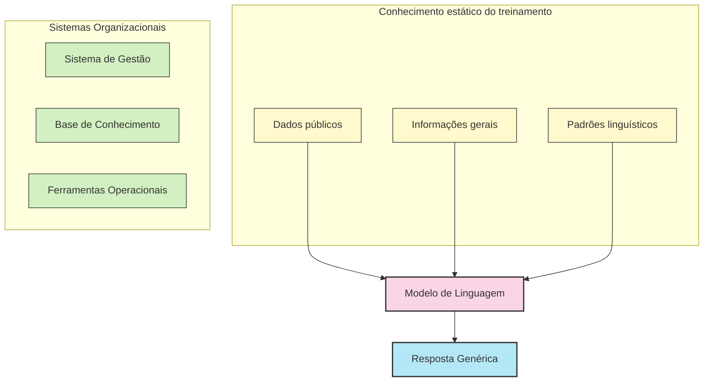
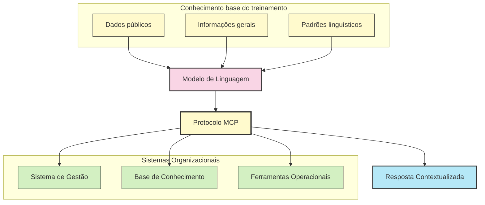
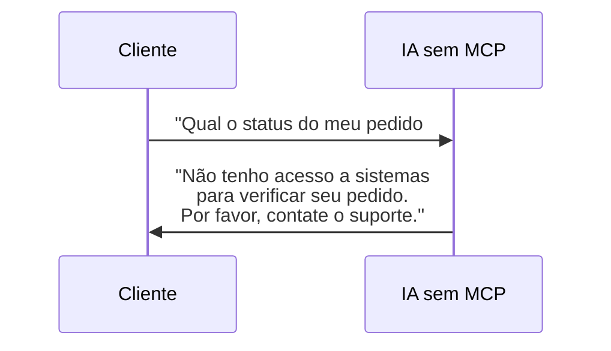
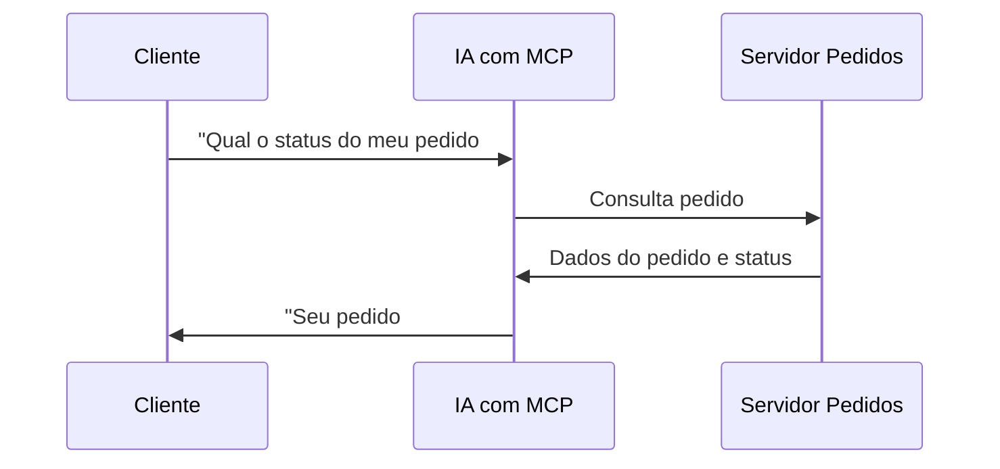
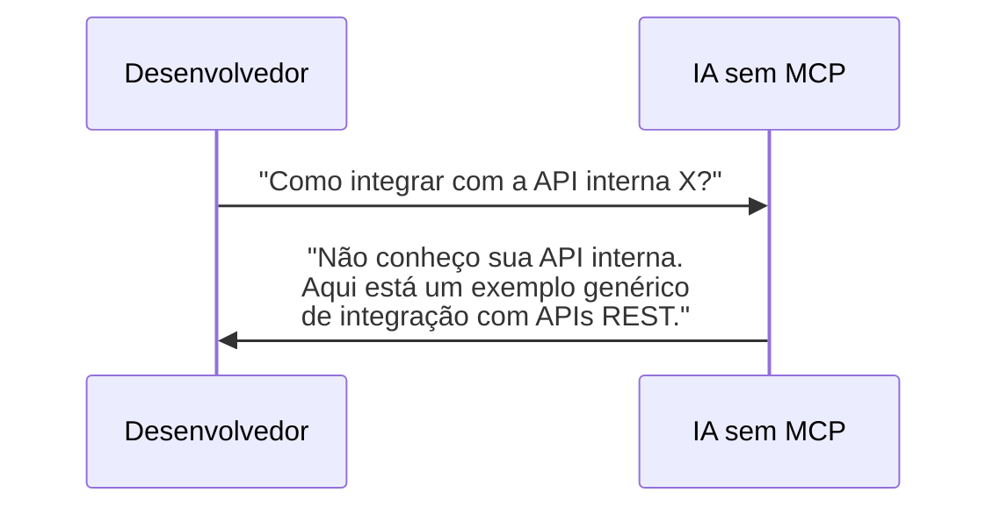
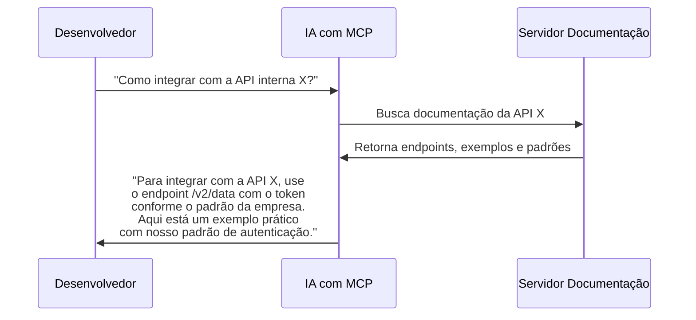
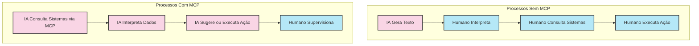
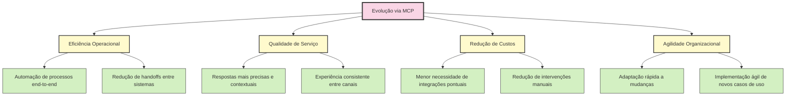

# A Evolução das IAs com MCP

O MCP representa uma evolução fundamental na forma como construímos e utilizamos inteligências artificiais. Esta transformação não é apenas tecnológica, mas também conceitual, alterando profundamente o que é possível realizar com sistemas de IA.

## Fases Evolutivas

A evolução das IAs pode ser compreendida em duas fases principais, com o MCP servindo como ponte entre elas:

### Fase 1: Ferramentas Isoladas

**Características:**

- IAs limitadas ao que "sabem" de seu treinamento
- Sem acesso a dados externos ou atualizados
- Capacidades definidas no momento do desenvolvimento
- Respostas genéricas baseadas em padrões estatísticos
- Desconectadas dos sistemas organizacionais

**Limitações Fundamentais:**

- **Desatualização rápida:** Conhecimento congelado no tempo do treinamento
- **Contextualização limitada:** Incapacidade de acessar dados específicos da empresa
- **Generalização excessiva:** Respostas baseadas em padrões gerais, não em dados específicos
- **Operação passiva:** Incapacidade de executar ações em sistemas

### Fase 2: Assistentes Conectados via MCP

**Características Transformadoras:**

- IAs com acesso dinâmico a dados e sistemas externos
- Capacidade de buscar informações atualizadas em tempo real
- Habilidade para executar ações em sistemas existentes
- Contextualização baseada em dados organizacionais reais
- Integração profunda com ecossistemas tecnológicos

**Avanços Fundamentais:**

- **Dados atualizados:** Acesso a informações em tempo real
- **Contextualização precisa:** Respostas baseadas em dados específicos da organização
- **Personalização profunda:** Adaptação ao contexto único de cada organização
- **Operação ativa:** Capacidade de realizar ações em sistemas externos

## Transformação de Capacidades

A integração via MCP transforma fundamentalmente o que as IAs são capazes de fazer:

| Aspecto | Sem MCP | Com MCP |
|---------|---------|---------|
| **Acesso a dados** | Limitado ao treinamento | Dinâmico e atualizado |
| **Contextualização** | Genérica e aproximada | Específica e precisa |
| **Ações possíveis** | Apenas geração de texto | Interação com sistemas |
| **Personalização** | Limitada por prompts | Profunda por integração |
| **Atualização** | Requer retreinamento | Automática via sistemas |
| **Especialização** | Geral para muitos domínios | Específica para a organização |

## Casos de Uso Transformados

### Atendimento ao Cliente

**Antes do MCP:**

**Com MCP:**

### Desenvolvimento de Software

**Antes do MCP:**

**Com MCP:**

## Impactos nos Processos de Negócio

A evolução proporcionada pelo MCP afeta diretamente como os processos de negócio são executados:

### Principais transformações:

1. **Automação de fluxos completos:**
   - Antes: IA apenas sugeriu texto para o próximo passo
   - Depois: IA coordena várias etapas do processo

2. **Reposicionamento humano:**
   - Antes: Humanos como intermediários entre IA e sistemas
   - Depois: Humanos como supervisores estratégicos

3. **Velocidade operacional:**
   - Antes: Processos com múltiplas transferências humano-máquina
   - Depois: Processos streamlined com mínima intervenção

4. **Precisão decisória:**
   - Antes: Decisões baseadas em informações parciais
   - Depois: Decisões baseadas em dados completos e atualizados

## Benefícios Organizacionais da Evolução

A adoção do MCP como ponte evolutiva para IAs conectadas traz benefícios organizacionais tangíveis:

## Considerações Estratégicas na Transição

A evolução para IAs conectadas via MCP exige considerações estratégicas:

1. **Preparação da infraestrutura:**
   - Inventário de sistemas a serem integrados
   - Avaliação de requisitos de segurança
   - Estabelecimento de padrões de governança

2. **Desenvolvimento gradual:**
   - Começar com servidores MCP para casos de uso prioritários
   - Expandir incrementalmente o ecossistema de integração
   - Estabelecer patterns reusáveis para novas integrações

3. **Capacitação da equipe:**
   - Treinamento em desenvolvimento de servidores MCP
   - Adaptação de processos de governança
   - Estabelecimento de novas métricas de sucesso

4. **Gestão de mudança organizacional:**
   - Comunicação clara sobre o novo paradigma
   - Redefinição de papéis impactados
   - Captura de lições aprendidas

A evolução para IAs conectadas via MCP não é apenas uma mudança tecnológica, mas uma transformação fundamental no modo como organizações podem aproveitar o potencial da inteligência artificial para criar valor, superar limitações históricas e implementar casos de uso antes impossíveis. 