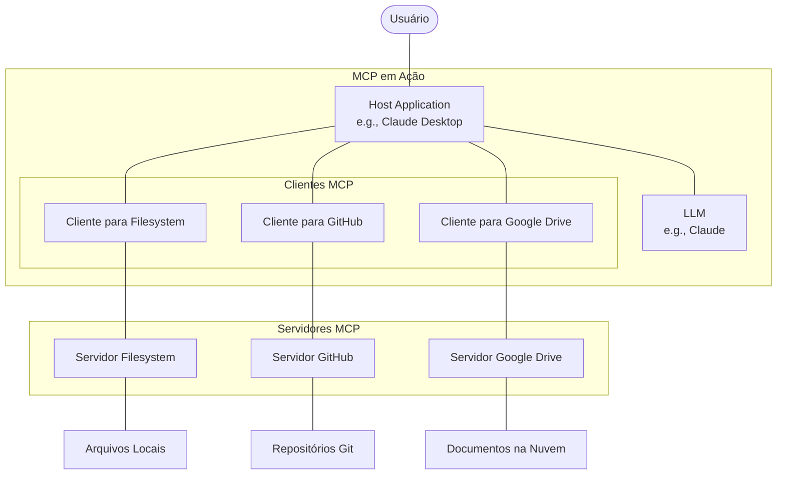
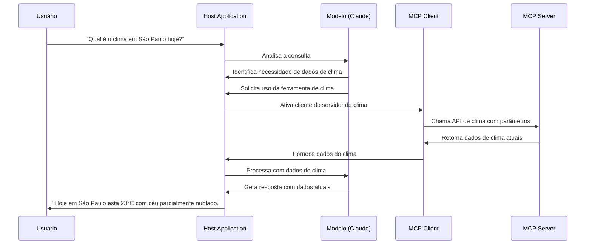
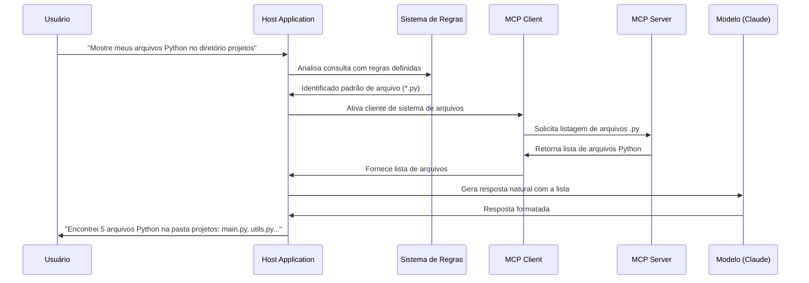
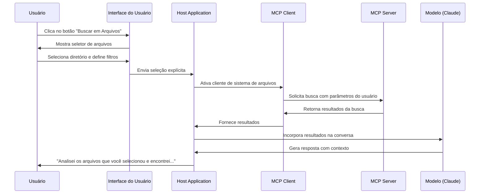
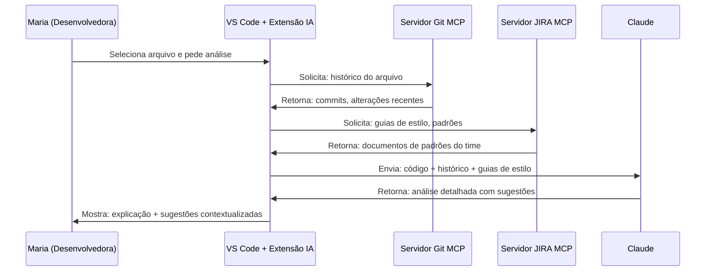
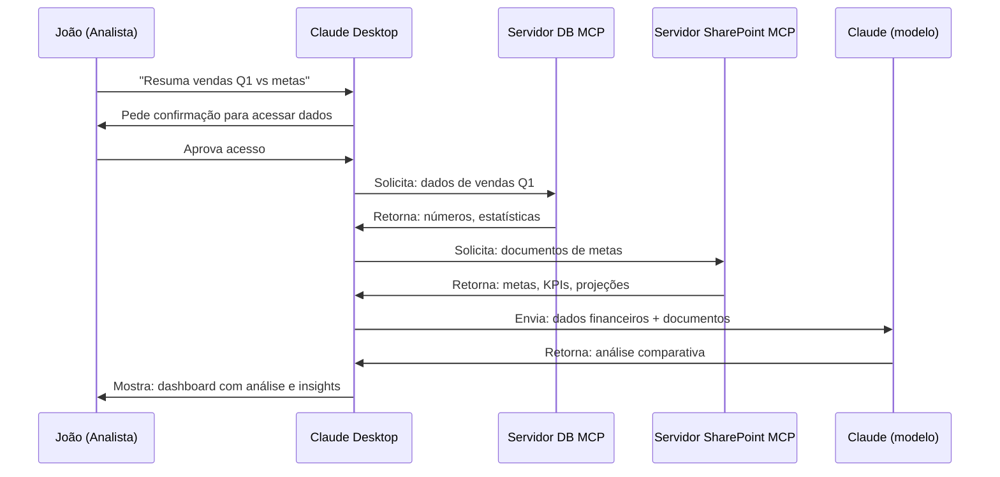
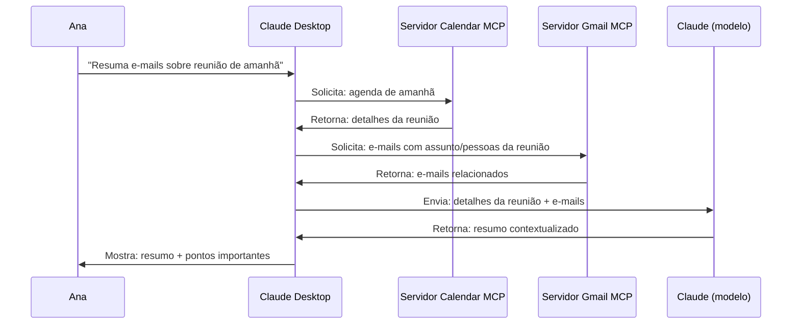
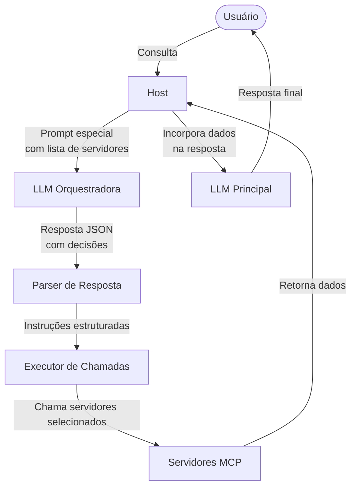
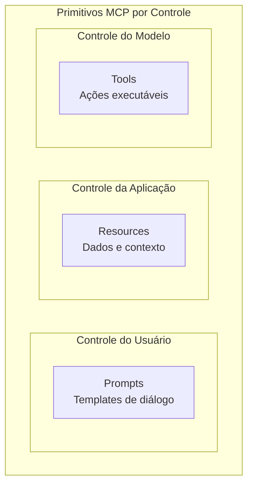

# MCP Na Prática

# Guia Prático do Model Context Protocol (MCP): Componentes e Fluxos

## Sumário

1. [Componentes em Cenários Reais](https://claude.ai/chat/ef1663ef-2ef6-48d7-b980-2beb952f3d47#componentes-em-cen%C3%A1rios-reais)
2. [Fluxos de Orquestração](https://claude.ai/chat/ef1663ef-2ef6-48d7-b980-2beb952f3d47#fluxos-de-orquestra%C3%A7%C3%A3o)
3. [Cenários Práticos de Uso](https://claude.ai/chat/ef1663ef-2ef6-48d7-b980-2beb952f3d47#cen%C3%A1rios-pr%C3%A1ticos-de-uso)
4. [LLM como Orquestradora](https://claude.ai/chat/ef1663ef-2ef6-48d7-b980-2beb952f3d47#llm-como-orquestradora)
5. [Fluxograma Completo do Ecossistema MCP](https://claude.ai/chat/ef1663ef-2ef6-48d7-b980-2beb952f3d47#fluxograma-completo-do-ecossistema-mcp)

## Componentes em Cenários Reais

Para entender o MCP na prática, é fundamental identificar claramente seus componentes em cenários reais:

### Host

O **host** é a aplicação principal de IA com a qual o usuário interage diretamente:

- **Claude Desktop**: A aplicação desktop onde você conversa com o Claude
- **VS Code com IA**: Editores de código com extensões que utilizam IA
- **JetBrains IDEs com plugins de IA**: IntelliJ, PyCharm com recursos de IA
- **Dashboards analíticos**: Interfaces para análise de dados com assistentes de IA integrados

### Client

O **client** é o componente dentro do host que se comunica com servidores MCP específicos:

- Em **Claude Desktop**: Um client individual para cada servidor conectado (GitHub, Google Drive, etc.)
- No **VS Code**: Componentes da extensão Copilot que se conectam a vários servidores
- Em **JetBrains**: Módulos de plugins que gerenciam conexões com servidores

### Server

O **server** é o componente que fornece acesso a dados ou funcionalidades específicas:

- **Servidor de Filesystem**: Permite acesso controlado a arquivos locais
- **Servidor GitHub**: Permite buscar código, criar PRs, gerenciar issues
- **Servidor PostgreSQL**: Permite executar consultas seguras em bancos de dados
- **Servidor Google Drive**: Acessa documentos, planilhas e apresentações



## Fluxos de Orquestração

Um aspecto crucial do MCP é como decidir quais servidores chamar e quando. Existem diferentes abordagens para esta orquestração:

### 1. Orquestração Dirigida pelo Modelo

Neste fluxo, o LLM analisa a consulta e decide quais ferramentas chamar:



### 2. Orquestração Dirigida pelo Host

A aplicação host usa heurísticas para determinar quando usar servidores:



Exemplos de regras usadas pelo host:

- Menção a "arquivos" ou extensões → servidor de filesystem
- Menção a "código" ou "repositório" → servidor Git
- Menção a "agenda" ou "evento" → servidor de calendário

### 3. Orquestração Dirigida pelo Usuário

Interfaces permitem que usuários escolham explicitamente quais servidores acessar:



## Cenários Práticos de Uso

### Cenário 1: Desenvolvimento de Software

**Componentes:**

- **Host**: VS Code com extensão de IA
- **Clientes**: Componentes da extensão conectados a diferentes servidores
- **Servidores**:
    - Servidor Git para acessar o histórico de código
    - Servidor de compilação para executar e testar código
    - Servidor de JIRA para integração com rastreamento de problemas

**Caso de uso:** Maria, uma desenvolvedora, pede à extensão de IA: "Explique este código e sugira melhorias com base em nosso guia de estilo".



### Cenário 2: Análise de Documentos Corporativos

**Componentes:**

- **Host**: Claude Desktop
- **Clientes**: Componentes do Claude Desktop conectados a servidores corporativos
- **Servidores**:
    - Servidor SharePoint da empresa
    - Servidor de banco de dados de relatórios financeiros
    - Servidor de API de CRM

**Caso de uso:** João, um analista de negócios, pergunta: "Resuma as vendas do Q1 e compare com nossas metas".



### Cenário 3: Assistência Pessoal

**Componentes:**

- **Host**: Claude Desktop
- **Clientes**: Componentes do Claude Desktop para cada integração
- **Servidores**:
    - Servidor Google Calendar
    - Servidor Gmail
    - Servidor de arquivos locais

**Caso de uso:** Ana pede: "Encontre os e-mails relacionados à reunião de amanhã e prepare um resumo".



## LLM como Orquestradora

Uma abordagem inovadora quando a LLM principal não pode chamar servidores MCP diretamente é usar uma LLM como camada de decisão intermediária:

### Conceito

Em vez de implementar lógica complexa de if/else no código para decidir quais servidores chamar, podemos usar uma LLM para analisar a consulta e determinar quais servidores e ações são necessários.



### Exemplo de Prompt para a LLM Orquestradora

Quando usamos uma LLM como orquestradora, enviamos a ela um prompt especial que inclui:

1. A consulta original do usuário
2. Lista de servidores MCP disponíveis e suas capacidades
3. Instruções para responder em um formato específico (JSON)

**Exemplo de prompt**:

```
Você é um orquestrador de servidores MCP. Analise a consulta do usuário e determine 
quais servidores MCP devem ser chamados.

Servidores disponíveis:
1. filesystem_server: Acessa arquivos locais. Capacidades: listar, ler, buscar.
2. database_server: Conecta ao PostgreSQL. Capacidades: executar SQL, listar tabelas.
3. weather_server: Fornece dados meteorológicos. Capacidades: clima atual, previsão.
4. calendar_server: Acessa o Google Calendar. Capacidades: listar/criar eventos.

Consulta do usuário: "Quais reuniões tenho amanhã e qual será o clima durante estas reuniões?"

Responda APENAS com um objeto JSON no seguinte formato:
{
  "servers": [
    {
      "server_id": "nome_do_servidor",
      "action": "ação_específica",
      "parameters": {"param1": "valor1", "param2": "valor2"}
    }
  ],
  "reasoning": "Explicação breve do seu raciocínio"
}
```

**Exemplo de resposta**:

```json
{
  "servers": [
    {
      "server_id": "calendar_server",
      "action": "list_events",
      "parameters": {"date": "tomorrow"}
    },
    {
      "server_id": "weather_server",
      "action": "forecast",
      "parameters": {"location": "user_location", "timeframe": "tomorrow"}
    }
  ],
  "reasoning": "A consulta requer informações sobre reuniões de amanhã (calendar_server) e condições climáticas durante essas reuniões (weather_server)."
}
```

### Vantagens desta Abordagem

1. **Flexibilidade**: Adicione novos servidores MCP sem alterar a lógica central
2. **Manutenção simplificada**: Sem proliferação de condicionais (ifs/elses)
3. **Raciocínio natural**: Aproveita a capacidade da LLM de entender linguagem natural
4. **Explicabilidade**: A LLM pode fornecer explicações sobre suas decisões
5. **Adaptabilidade**: Lida bem com consultas ambíguas ou que requerem múltiplos servidores

### Desafios a Considerar

1. **Latência adicional**: Requer uma chamada extra à LLM antes de acessar os servidores
2. **Custo**: Chamadas adicionais à LLM aumentam o custo operacional
3. **Consistência**: As LLMs podem tomar decisões diferentes para consultas similares
4. **Parsear resposta**: Precisa garantir que a LLM responda no formato esperado
5. **Tratamento de erros**: Precisa lidar com casos onde a decisão da LLM não é clara

## Fluxograma Completo do Ecossistema MCP

```mermaid
flowchart TD
    %% Principais componentes do MCP
    User([Usuário]) --> Host
    subgraph "Processo Principal"
        Host[Host Application\n<i>Ex: Claude Desktop, VS Code, etc</i>]
        LLM[LLM\n<i>Ex: Claude, GPT, etc</i>]
        
        subgraph "Orquestração"
            direction TB
            DecisionEngine{Como decidir qual\nservidor chamar?}
            DecisionEngine -->|Modelo decide| ModelDriven[Dirigido pelo Modelo]
            DecisionEngine -->|Host decide| HostDriven[Dirigido pelo Host]
            DecisionEngine -->|Usuário decide| UserDriven[Dirigido pelo Usuário]
            DecisionEngine -->|LLM externa decide| LLMDriven[LLM como Orquestradora]
        end
        
        subgraph "Clientes MCP"
            Client1[Cliente MCP 1]
            Client2[Cliente MCP 2]
            ClientN[Cliente MCP N]
        end
    end
    
    %% Servidores MCP
    subgraph "Servidores MCP"
        FileServer[Servidor de Arquivos]
        GitServer[Servidor Git/GitHub]
        DBServer[Servidor de Banco de Dados]
        APIServer[Servidor de APIs]
        CalendarServer[Servidor de Calendário]
        EmailServer[Servidor de Email]
        CustomServer[Servidores Personalizados]
    end
    
    %% Fluxo básico
    User -->|"1. Faz consulta"| Host
    Host <-->|"2. Processa consulta"| LLM
    
    %% Fluxo de decisão e orquestração
    LLM -->|"3. Determina\nnecessidades"| DecisionEngine
    Host -->|"3. Pode determinar\ndiretamente"| DecisionEngine
    User -->|"3. Pode selecionar\nexplicitamente"| DecisionEngine
    
    %% Conexão com o modelo de decisão alternativo
    subgraph "Cenário: LLM Externa como Orquestradora"
        LLMOrchestrator[LLM Orquestradora]
        ServerRegistry[Registro de Servidores\nDisponíveis]
        ResponseParser[Parser de Resposta]
        
        QueryAnalyzer[Analisador de Consulta]
        ServerSelector[Seletor de Servidor]
        ResultIntegrator[Integrador de Resultados]
    end
    
    LLMDriven -->|"Chamada com\nprompt especial"| LLMOrchestrator
    ServerRegistry -->|"Informa servidores\ndisponíveis"| LLMOrchestrator
    User -->|"Consulta original"| QueryAnalyzer
    QueryAnalyzer -->|"Analisa intenção"| LLMOrchestrator
    LLMOrchestrator -->|"Retorna decisão\nJSON"| ResponseParser
    ResponseParser -->|"Estrutura processada"| ServerSelector
    ServerSelector -->|"Chamadas a servidores"| ServerIntegration
    
    %% Integração com clientes
    ModelDriven -->|"4. Solicita uso\nde ferramentas"| Client1
    HostDriven -->|"4. Direciona para\ncliente apropriado"| Client2
    UserDriven -->|"4. Conforme seleção\ndo usuário"| ClientN
    ServerSelector -->|"4. Chama clientes\nbaseado na decisão"| Client1
    ServerSelector -->|"4. Chama clientes\nbaseado na decisão"| Client2
    
    %% Conexão com servidores
    Client1 <-->|"5. Comunica via\nprimitivos MCP"| FileServer
    Client1 <-->|"5. Comunica via\nprimitivos MCP"| GitServer
    Client2 <-->|"5. Comunica via\nprimitivos MCP"| DBServer
    Client2 <-->|"5. Comunica via\nprimitivos MCP"| APIServer
    ClientN <-->|"5. Comunica via\nprimitivos MCP"| CalendarServer
    ClientN <-->|"5. Comunica via\nprimitivos MCP"| EmailServer
    ClientN <-->|"5. Comunica via\nprimitivos MCP"| CustomServer
    
    %% Primitivos MCP
    subgraph "Primitivos MCP"
        Resources[Resources\n<i>Dados/Contexto</i>]
        Tools[Tools\n<i>Ações Executáveis</i>]
        Prompts[Prompts\n<i>Templates de Interação</i>]
    end
    
    FileServer --> Resources
    GitServer --> Resources
    GitServer --> Tools
    DBServer --> Resources
    DBServer --> Tools
    APIServer --> Tools
    CalendarServer --> Resources
    CalendarServer --> Tools
    EmailServer --> Resources
    EmailServer --> Tools
    CustomServer --> Resources
    CustomServer --> Tools
    CustomServer --> Prompts
    
    %% Retorno de resultados
    subgraph "Integração e Resposta"
        ServerIntegration[Integração de\nResultados]
        SecurityFilters[Filtros de Segurança\ne Aprovação]
        FinalResponse[Resposta Final]
    end
    
    FileServer -->|"6. Retorna dados"| ServerIntegration
    GitServer -->|"6. Retorna dados"| ServerIntegration
    DBServer -->|"6. Retorna dados"| ServerIntegration
    APIServer -->|"6. Retorna dados"| ServerIntegration
    CalendarServer -->|"6. Retorna dados"| ServerIntegration
    EmailServer -->|"6. Retorna dados"| ServerIntegration
    CustomServer -->|"6. Retorna dados"| ServerIntegration
    
    ServerIntegration -->|"7. Consolida\ndados"| SecurityFilters
    SecurityFilters -->|"8. Aprova resultados"| FinalResponse
    User <-->|"9. Aprovação\n(se necessário)"| SecurityFilters
    FinalResponse -->|"10. Envia para\nprocessamento"| LLM
    LLM -->|"11. Gera resposta\ncontextualizada"| Host
    Host -->|"12. Apresenta\nresposta"| User
    
    %% Cenário de failover
    subgraph "Tratamento de Falhas"
        ErrorHandler[Manipulador de Erros]
        Fallback[Estratégias de Fallback]
        Logging[Registro de Problemas]
    end
    
    ServerIntegration -->|"Erro de servidor"| ErrorHandler
    LLMOrchestrator -->|"Erro de decisão"| ErrorHandler
    ErrorHandler -->|"Tenta alternativas"| Fallback
    ErrorHandler -->|"Registra problema"| Logging
    Fallback -->|"Resposta degradada"| Host
    
    %% Estilo
    classDef host fill:#e6f7ff,stroke:#2198fb,stroke-width:2px
    classDef llm fill:#f9f0ff,stroke:#9d5cba,stroke-width:2px
    classDef client fill:#fff8e6,stroke:#ffbb00,stroke-width:2px
    classDef server fill:#ebfaeb,stroke:#5cb85c,stroke-width:2px
    classDef orchestration fill:#f2e6ff,stroke:#9966cc,stroke-width:2px
    classDef primitive fill:#e6faff,stroke:#00bbff,stroke-width:2px
    classDef integration fill:#ffe6e6,stroke:#ff6666,stroke-width:2px
    classDef fallback fill:#ffe6f2,stroke:#ff66b3,stroke-width:2px
    
    class Host,User host
    class LLM,LLMOrchestrator llm
    class Client1,Client2,ClientN client
    class FileServer,GitServer,DBServer,APIServer,CalendarServer,EmailServer,CustomServer server
    class DecisionEngine,ModelDriven,HostDriven,UserDriven,LLMDriven,QueryAnalyzer,ServerRegistry,ResponseParser,ServerSelector orchestration
    class Resources,Tools,Prompts primitive
    class ServerIntegration,SecurityFilters,FinalResponse,ResultIntegrator integration
    class ErrorHandler,Fallback,Logging fallback
```



## Primitivos MCP Resumo Prático

### 1. Resources (Recursos)

Os Resources são a forma de MCP fornecer dados e contexto para LLMs:

**Controle**: Controlados pela aplicação (Claude Desktop, VS Code, etc.) **Utilização**: Fornecer arquivos, dados, documentos para análise **Exemplos reais**:

- Conteúdo de arquivos de código para análise
- Documentos de especificação para referência
- Dados estruturados de banco de dados

### 2. Tools (Ferramentas)

As Tools permitem que os LLMs executem ações no mundo real:

**Controle**: Controlados pelo modelo, com aprovação do usuário **Utilização**: Permitir ações como busca, consultas, criação **Exemplos reais**:

- Buscar na web informações atualizadas
- Criar um novo arquivo ou documento
- Executar uma consulta SQL para análise de dados
- Enviar uma mensagem ou agendar uma reunião

### 3. Prompts (Modelos de Prompts)

Os Prompts são templates predefinidos que guiam interações específicas:

**Controle**: Controlados pelo usuário (ex: slash commands) **Utilização**: Iniciar fluxos de trabalho padronizados **Exemplos reais**:

- Template para revisão de código
- Formulário para planejamento de sprint
- Estrutura para análise de relatórios financeiros



## Tabela Comparativa: Casos de Uso por Setor

| Setor                           | Caso de Uso             | Host                   | Servidores MCP                         | Benefício Principal                           |
| ------------------------------- | ----------------------- | ---------------------- | -------------------------------------- | --------------------------------------------- |
| **Desenvolvimento de Software** | Assistência de código   | VS Code                | Git, JIRA, Compilação                  | Código contextualizado com padrões da empresa |
| **Finanças**                    | Análise de relatórios   | Claude Desktop         | Banco de dados, SharePoint             | Análises financeiras contextualizadas         |
| **Medicina**                    | Análise de caso clínico | Dashboard médico       | EMR, PubMed, Farmácia                  | Recomendações com histórico do paciente       |
| **Educação**                    | Tutoria personalizada   | Plataforma de ensino   | Materiais do curso, Progresso do aluno | Explicações adaptadas ao histórico do aluno   |
| **Legal**                       | Pesquisa jurídica       | Software jurídico      | Banco de jurisprudência, Códigos       | Pesquisa legal com contexto dos casos atuais  |
| **Marketing**                   | Análise de campanha     | Dashboard de marketing | Analytics, CRM, Redes sociais          | Insights de campanha com dados reais          |
| **Pessoal**                     | Assistente diário       | Claude Desktop         | Calendário, Email, Contatos            | Organização pessoal contextualizada           |