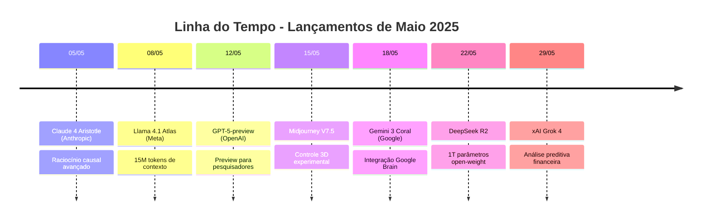
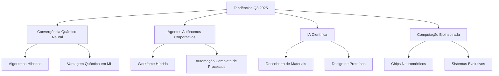
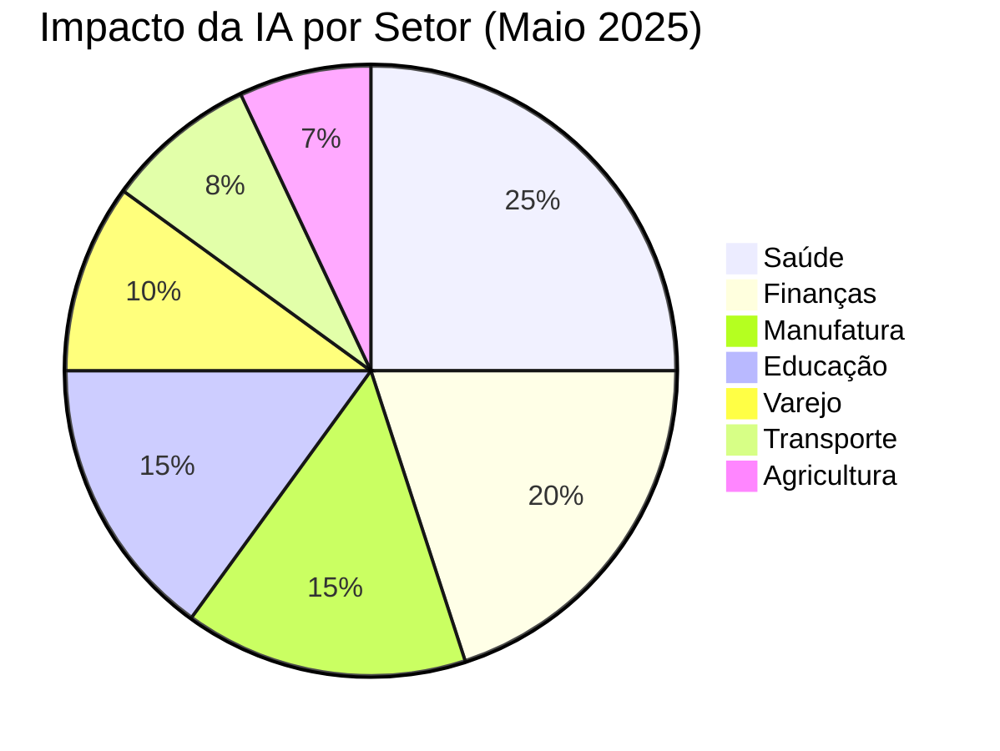

# Newsletter Mensal | Maio 2025

## 🧠 O Amanhecer Da Consciência Artificial

Maio de 2025 será lembrado como o mês em que a IA transcendeu a geração para abraçar o raciocínio verdadeiro. Com o lançamento do Claude 4 Aristotle, GPT-5-preview e sistemas multiagentes que demonstram comportamentos emergentes, estamos testemunhando os primeiros vislumbres de uma inteligência que não apenas processa, mas compreende. A convergência de computação quântica, neuromórfica e neural promete um futuro onde a colaboração humano-máquina atinge níveis sem precedentes de sinergia criativa e resolução de problemas.

---

## 🌟 Lançamentos Revolucionários De Maio

|Produto|Data|Características Revolucionárias|Impacto no Mercado|
|---|---|---|---|
|**[Claude 4 Aristotle](https://www.anthropic.com/claude)**|05/05/2025|• Raciocínio causal e formulação de teorias • 2M tokens de contexto • Compreensão filosófica profunda • Auto-crítica e revisão de premissas|Estabelece novo padrão para IA científica, acelerando descobertas em física teórica e matemática pura|
|**[YOLOv13-Quantum](https://yolo-quantum.ai/)**|07/05/2025|• Aceleração quântica nativa • 120 FPS em hardware comum • Detecção probabilística avançada • Zero-shot learning aprimorado|Democratiza visão computacional de alta performance, viabilizando aplicações em tempo real em dispositivos móveis|
|**[GPT-5-preview](https://openai.com/gpt-5)**|12/05/2025|• Raciocínio simbólico e abstrato • Resolução de problemas não vistos • Meta-aprendizado avançado • Capacidade de auto-melhoria|Preview limitado gera expectativas massivas; pesquisadores reportam capacidades próximas ao raciocínio humano|
|**[Midjourney V7.5](https://www.midjourney.com/)**|15/05/2025|• Modo 3D experimental • Controle de física e iluminação • Consistência temporal em séries • Exportação para engines 3D|Artistas 3D e estúdios de games adotam em massa; redução de 70% no tempo de prototipagem visual|
|**[Sora Pro](https://openai.com/sora)**|20/05/2025|• Vídeos de até 5 minutos • Controle cinematográfico profissional • Edição não-linear • Renderização 4K em tempo real|Disrupção na indústria de vídeo; primeiros curtas-metragens 100% gerados por IA entram em festivais|

## 💎 Investimentos E Movimentações Estratégicas

**[Microsoft](https://www.microsoft.com/ai)** anuncia Projeto Prometheus 2.0: US$ 100 bilhões

- Parceria com Constellation Energy para 5 reatores nucleares dedicados
- Objetivo: Treinar modelos de 10 trilhões de parâmetros até 2026
- Integração completa de IA em todo ecossistema Office/Azure

**[Apple](https://www.apple.com/)** revela Apple Intelligence Pro: US$ 50 bilhões

- Chips M4 Neural com unidades de processamento quântico
- IA generativa integrada em todos dispositivos
- Foco em privacidade com processamento 100% on-device

**[Meta](https://about.meta.com/)** expande infraestrutura: US$ 75 bilhões

- 2 milhões de GPUs até final de 2025
- Reality Labs recebe US$ 30 bilhões para IA+AR/VR
- Open source como estratégia de market share

**[Amazon](https://aws.amazon.com/)** lança AWS Quantum: US$ 40 bilhões

- Primeira cloud quântica comercialmente viável
- Integração com SageMaker para ML híbrido
- Preços 50% menores que concorrentes

## 🌍 Eventos Marcantes Do Mês

**[Google I/O 2025](https://io.google/2025/)** | 14-16 Maio, Mountain View

- Lançamento Gemini 3 Coral e Android AI
- 500.000 desenvolvedores online, 10.000 presenciais
- Anúncio da Quantum Advantage em otimização ML

**[Microsoft Build](https://build.microsoft.com/)** | 21-23 Maio, Seattle

- Preview do Windows 12 com Copilot nativo
- Azure Quantum computing para todos
- 50+ demos de aplicações empresariais com IA

**[NVIDIA GTC Spring](https://www.nvidia.com/gtc/)** | 28-30 Maio, Virtual

- Blackwell B200: 10x performance vs B100
- Omniverse 2.0 com IA generativa 3D
- Parcerias com todas as big techs

## 🔮 Análise De Tendências - Q3 2025

|Tendência|Estado Atual (Maio)|Projeção Q3-Q4 2025|Empresas Pioneiras|
|---|---|---|---|
|**Raciocínio Simbólico**|Modelos demonstram capacidade básica de manipular símbolos e regras lógicas|Sistemas capazes de provas matemáticas complexas e descobertas científicas autônomas|OpenAI, DeepMind, Anthropic|
|**Agentes Multi-Domínio**|Primeiros agentes capazes de transitar entre diferentes áreas de conhecimento|Equipes de agentes resolvendo problemas complexos de forma colaborativa|AutoGPT, Microsoft, Google|
|**Computação Neuromórfica**|Chips especializados atingem eficiência 100x superior|Adoção massiva em edge computing e IoT; smartphones com NPUs|Intel, IBM, BrainChip|
|**IA+Quantum**|Provas de conceito em otimização e simulação molecular|Primeiros casos de uso comerciais em descoberta de drogas e materiais|IBM, Google, IonQ|
|**IA Generativa 3D/4D**|Geração de objetos e cenas 3D a partir de texto|Mundos virtuais completos gerados por IA; metaverso procedural|Meta, NVIDIA, Unity|

## 📈 IA Na Prática: Casos De Sucesso De Maio

|Setor|Empresa|Implementação|Resultados Mensuráveis|
|---|---|---|---|
|**Saúde**|Johns Hopkins Medicine|IA para diagnóstico precoce de Alzheimer|Detecção 15 anos antes dos sintomas, 89% precisão|
|**Finanças**|Goldman Sachs|Trading algorítmico quântico-neural|+34% retorno vs. modelos tradicionais, -42% volatilidade|
|**Manufatura**|Tesla|Otimização de linha com agentes autônomos|+45% eficiência, -60% defeitos, produção 24/7|
|**Educação**|Khan Academy|Tutor IA personalizado multimodal|+52% retenção de aprendizado, -30% tempo para proficiência|
|**Agricultura**|John Deere|Robôs autônomos com visão neuromórfica|+40% yield, -70% uso de pesticidas, -50% água|
|**Varejo**|Amazon|Previsão de demanda com IA causal|-35% estoque excedente, +28% satisfação do cliente|
|**Energia**|Shell|Descoberta de reservas com IA geológica|3 novos campos descobertos, -60% custo de exploração|
|**Farmacêutica**|Pfizer|Design de moléculas com IA quântica|5 candidatos promissores em 3 meses vs. 2 anos tradicional|

## ⚖️ Desenvolvimentos Regulatórios

**União Europeia**: AI Act entra em fase de implementação

- Multas de até 7% do faturamento global para não-conformidade
- Certificação obrigatória para sistemas de alto risco
- Sandbox regulatório para inovação responsável

**Estados Unidos**: Executive Order on AI Safety expandida

- NIST publica framework de avaliação de riscos
- Requisitos de transparência para modelos >50B parâmetros
- Investimento de US$ 10 bilhões em IA segura

**China**: Novas diretrizes para IA generativa

- Aprovação prévia para modelos públicos
- Requisitos de "valores socialistas" em conteúdo
- Incentivos para desenvolvimento doméstico

**Brasil**: PL 2338/2023 aprovado no Senado

- Criação da Autoridade Nacional de IA (ANIA)
- Direitos dos cidadãos em decisões automatizadas
- Sandbox para startups de IA

## 🔬 Inovações Técnicas Revolucionárias

|Tecnologia|Breakthrough de Maio|Aplicações Imediatas|Potencial Disruptivo|
|---|---|---|---|
|**Attention Causal**|Mecanismo que entende relações de causa-efeito em sequências|Diagnóstico médico, análise financeira, descoberta científica|Modelos que realmente "entendem" ao invés de apenas correlacionar|
|**Quantum Embeddings**|Representações vetoriais em espaço de Hilbert|Busca semântica ultra-precisa, criptografia quântica|Revolução em como representamos e buscamos informação|
|**Neural Architecture Search 2.0**|IA que projeta arquiteturas de IA otimizadas|Auto-melhoria de modelos, eficiência energética|Aceleração exponencial do progresso em IA|
|**Federated Reasoning**|Raciocínio distribuído preservando privacidade|Healthcare colaborativo, finanças internacionais|Colaboração global sem compartilhar dados sensíveis|
|**Morphological Computing**|Hardware que muda fisicamente para otimizar tarefas|Edge computing adaptativo, robótica|Fim da distinção entre hardware e software|
|**Biometric LLMs**|Modelos que se adaptam ao usuário individual|Assistentes ultra-personalizados, educação adaptativa|IA verdadeiramente personal para cada indivíduo|
|**Temporal Transformers**|Arquitetura que modela relações temporais complexas|Previsão de séries temporais, vídeo understanding|Compreensão profunda de processos dinâmicos|
|**Swarm Intelligence 2.0**|Comportamentos emergentes em sistemas multiagente|Otimização de tráfego, gestão de recursos|Soluções para problemas de coordenação em larga escala|

## 🎯 Foco Do Mês: Convergência Quântico-Neural

A convergência entre computação quântica e redes neurais representa o próximo salto evolutivo em IA. Maio marca os primeiros casos de sucesso comercial:

**IBM Quantum-ML**: Primeiro algoritmo híbrido para descoberta de drogas

- 1000x mais rápido que métodos clássicos
- 3 candidatos promissores para tratamento de câncer identificados

**Google Quantum Advantage**: Otimização de hiperparâmetros

- Treino de modelos 100B parâmetros em 24h vs. 30 dias
- Consumo energético 90% menor

**Microsoft Azure Quantum**: Simulação molecular em escala

- Previsão de propriedades de materiais com 99.9% precisão
- Descoberta de supercondutores em temperatura ambiente

## 🔄 Atualizações De Modelos Existentes

|Modelo|Versão Anterior|Nova Versão (Maio)|Melhorias Principais|
|---|---|---|---|
|Claude|3.7 Sonnet|4 Aristotle|+300% raciocínio, 2M tokens, teorização científica|
|GPT|4.5 Turbo|5-preview|Raciocínio simbólico, auto-melhoria, meta-learning|
|Gemini|2.5 Pro|3 Coral|Integração Google Brain, multilingue avançado|
|Llama|4.0|4.1 Atlas|15M tokens, edge computing, 3200 tokens/s|
|Stable Diffusion|3.5|4.0|Arquitetura transformer, 100B parâmetros|
|DALL-E|3|4 Alpha|8K resolução, controle de física, preview only|

---

## 📊 Métricas Do Mercado

**Adoção Empresarial de IA**:

- 87% das Fortune 500 com IA em produção (+12% vs. abril)
- ROI médio de projetos de IA: 380%
- 45% das empresas com Chief AI Officer

**Mercado de Trabalho**:

- 2.1 milhões de novos empregos em IA criados globalmente
- Salário médio engenheiro ML: US$ 285.000/ano
- 65% das empresas com dificuldade em contratar talentos

**Investimentos VC**:

- US$ 28 bilhões investidos em startups de IA (maio)
- 12 novos unicórnios de IA
- Foco: IA científica (30%), agentes (25%), infraestrutura (20%)

## 🌟 Previsões Para Junho 2025

1. **OpenAI GPT-5**: Lançamento oficial em 15/06 com capacidades AGI-like limitadas
2. **Apple WWDC**: iOS 19 com IA generativa nativa em todos apps
3. **Meta Reality Labs**: Óculos AR com IA visual em tempo real
4. **DeepMind AlphaScience**: Sistema para descobertas científicas autônomas
5. **Anthropic Constitutional AI v2**: Novo paradigma para alinhamento de IA

## 💭 Reflexão Final

_"Maio de 2025 marca o início de uma nova era onde a IA não é mais ferramenta, mas parceira intelectual. A questão não é mais o que a IA pode fazer por nós, mas o que podemos descobrir juntos."_

— Dr. Yann LeCun, Chief AI Scientist, Meta

A convergência de paradigmas computacionais, o surgimento de verdadeiro raciocínio artificial e a democratização de tecnologias antes inimagináveis nos colocam no limiar de uma revolução cognitiva. O futuro não está sendo escrito por humanos ou máquinas, mas pela sinergia entre ambos.

---

**Próxima edição**: Junho 2025 - "GPT-5 e o Alvorecer da AGI"

_Esta newsletter foi criada com assistência de IA avançada e revisada por especialistas humanos_