or# Model Context Protocol (MCP)

## A Revolução na Integração de IAs para o Setor Bancário

---

![[0205cbbf1fffaf70a06f58c25b34d544_MD5.png]]

> 💡 **Resumo Executivo:** O MCP é o "adaptador universal" para conectar modelos de IA aos sistemas bancários. Ele padroniza integrações, simplifica o desenvolvimento e permite que qualquer aplicação de IA se comunique facilmente com seus sistemas legados e novas plataformas.

---

## Sumário

1. [Introdução: O Desafio das IAs Isoladas](https://claude.ai/chat/95243e4f-5199-4f9a-bf98-54f6a6372088#introdu%C3%A7%C3%A3o-o-desafio-das-ias-isoladas)
2. [O Problema: Desenvolvimento Fragmentado no Banco](https://claude.ai/chat/95243e4f-5199-4f9a-bf98-54f6a6372088#o-problema-desenvolvimento-fragmentado-no-banco)
3. [A Solução: MCP - O Tradutor Universal](https://claude.ai/chat/95243e4f-5199-4f9a-bf98-54f6a6372088#a-solu%C3%A7%C3%A3o-mcp---o-tradutor-universal)
4. [Arquitetura MCP: Como Tudo se Conecta](https://claude.ai/chat/95243e4f-5199-4f9a-bf98-54f6a6372088#arquitetura-mcp-como-tudo-se-conecta)
5. [Conceitos Fundamentais do MCP](https://claude.ai/chat/95243e4f-5199-4f9a-bf98-54f6a6372088#conceitos-fundamentais-do-mcp)
    - [Roots: Os Territórios de Acesso](https://claude.ai/chat/95243e4f-5199-4f9a-bf98-54f6a6372088#roots-os-territ%C3%B3rios-de-acesso)
    - [Resources: A Biblioteca de Conhecimento](https://claude.ai/chat/95243e4f-5199-4f9a-bf98-54f6a6372088#resources-a-biblioteca-de-conhecimento)
    - [Prompts: As Receitas Prontas](https://claude.ai/chat/95243e4f-5199-4f9a-bf98-54f6a6372088#prompts-as-receitas-prontas)
    - [Tools: A Caixa de Ferramentas](https://claude.ai/chat/95243e4f-5199-4f9a-bf98-54f6a6372088#tools-a-caixa-de-ferramentas)
    - [Sampling: Consultando o Oráculo](https://claude.ai/chat/95243e4f-5199-4f9a-bf98-54f6a6372088#sampling-consultando-o-or%C3%A1culo)
6. [Especificação Técnica do Protocolo](https://claude.ai/chat/95243e4f-5199-4f9a-bf98-54f6a6372088#especifica%C3%A7%C3%A3o-t%C3%A9cnica-do-protocolo)
7. [De Tools Simples ao A2A: A Evolução dos Assistentes](https://claude.ai/chat/95243e4f-5199-4f9a-bf98-54f6a6372088#de-tools-simples-ao-a2a-a-evolu%C3%A7%C3%A3o-dos-assistentes)
8. [Benefícios para o Itaú](https://claude.ai/chat/95243e4f-5199-4f9a-bf98-54f6a6372088#benef%C3%ADcios-para-o-ita%C3%BA)
9. [Roteiro de Implementação](https://claude.ai/chat/95243e4f-5199-4f9a-bf98-54f6a6372088#roteiro-de-implementa%C3%A7%C3%A3o)
10. [Casos de Uso no Itaú](https://claude.ai/chat/95243e4f-5199-4f9a-bf98-54f6a6372088#casos-de-uso-no-ita%C3%BA)
11. [Próximos Passos](https://claude.ai/chat/95243e4f-5199-4f9a-bf98-54f6a6372088#pr%C3%B3ximos-passos)
12. [Recursos para Aprofundamento](https://claude.ai/chat/95243e4f-5199-4f9a-bf98-54f6a6372088#recursos-para-aprofundamento)

---

## Introdução: O Desafio das IAs Isoladas

Imagine um consultor genial sentado em uma sala sem acesso aos sistemas do banco. Não importa quão inteligente seja, suas recomendações serão limitadas porque ele não pode ver os dados dos clientes, as políticas internas ou o histórico de transações. É exatamente assim que funcionam os LLMs (Large Language Models) quando não têm acesso contextual aos seus sistemas.

Como observado pela Anthropic no lançamento do MCP:

> "Mesmo os modelos mais sofisticados são constrangidos por seu isolamento dos dados—presos atrás de silos de informação e sistemas legados."

**🔍 O Cenário Bancário:** Para o Itaú, essa limitação é especialmente desafiadora. Os LLMs poderiam revolucionar o atendimento ao cliente, análise de crédito e compliance, mas como integrá-los com:

- Sistemas legados em mainframe?
- Bancos de dados transacionais com trilhões de registros?
- Políticas de risco que mudam constantemente?
- Requisitos regulatórios com auditabilidade obrigatória?

É aqui que entra o Model Context Protocol (MCP).

## O Problema: Desenvolvimento Fragmentado no Banco

### 🧩 A "Torre de Babel" das Integrações

Antes do MCP, cada aplicação de IA no banco precisava construir suas próprias pontes para cada sistema:

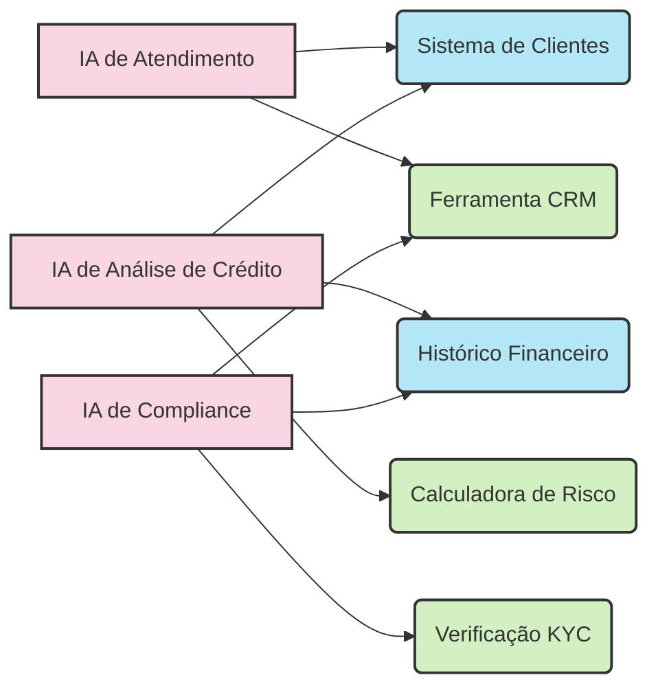

**Cada Nova IA = Novos Problemas:**

- Duplicação de código entre equipes (o mesmo conector reescrito várias vezes)
- Inconsistência nas integrações (diferentes padrões em cada sistema)
- Altos custos de manutenção (uma mudança no sistema = atualizar todas as integrações)
- Longo tempo de implementação (meses para construir cada conexão do zero)

**💬 Na Prática:** "Nossa equipe levou 3 meses para integrar o chatbot com o sistema de clientes, enquanto a equipe de crédito levou outros 4 meses para integrar seu assistente com o mesmo sistema, reescrevendo tudo do zero!"

## A Solução: MCP - O Tradutor Universal

O MCP funciona como um "adaptador universal" que padroniza todas as integrações. É como criar uma linguagem comum que todos os sistemas bancários e todas as IAs conseguem entender.

### 🔄 A Transformação com MCP

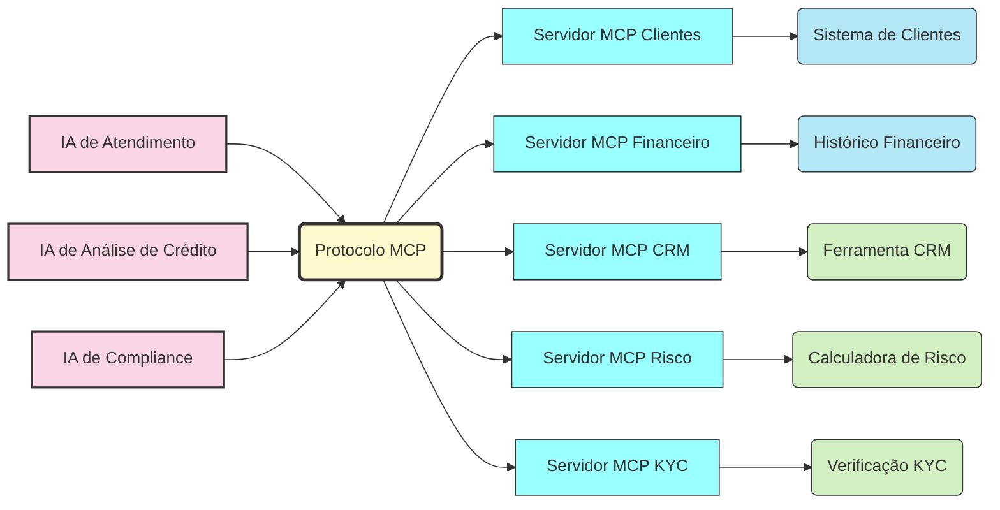

**Os Benefícios Imediatos:**

- **Unificação:** Todas as aplicações falam a mesma língua
- **Reutilização:** Um servidor MCP serve a múltiplas aplicações
- **Modularidade:** Adicionar uma nova fonte de dados = apenas mais um servidor MCP
- **Interoperabilidade:** Fácil troca entre diferentes LLMs (Claude, GPT, etc.)

**💬 Na Prática:** "Com o MCP, nossa nova solução de atendimento se conectou instantaneamente a todos os nossos sistemas legados através dos servidores MCP já existentes, economizando 6 meses de desenvolvimento!"

## Arquitetura MCP: Como Tudo se Conecta

A arquitetura MCP se baseia em três componentes principais:

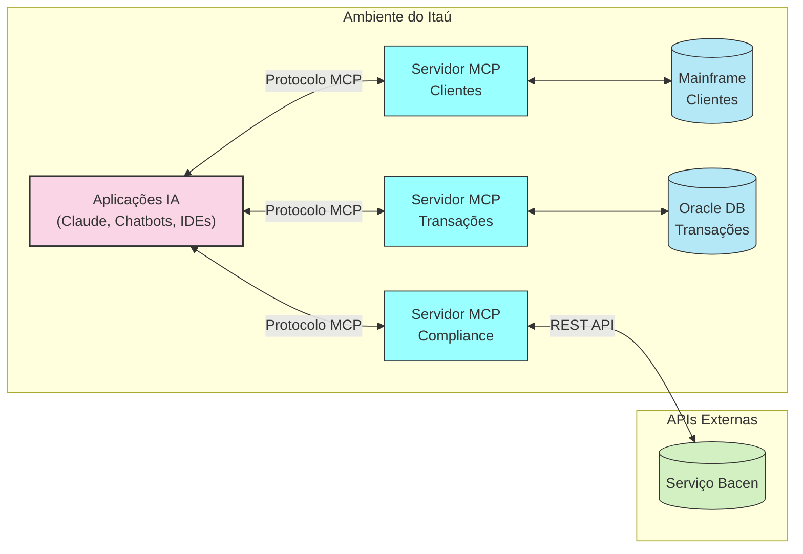

### 🧿 Os Três Pilares:

1. **MCP Hosts:** Aplicações de IA do banco (chatbots internos, assistentes para gerentes, plugins para VSCode)
    
    - Gerenciam múltiplas instâncias de clientes MCP
    - Controlam permissões de conexão
    - Coordenam integrações com diferentes modelos de IA
2. **MCP Clients:** Componente dentro do Host que se comunica com os servidores
    
    - Mantém uma sessão por servidor
    - Gerencia negociação de protocolo
    - Roteia mensagens bidirecionalmente
3. **MCP Servers:** Pontos de acesso padronizados para sistemas específicos
    
    - Servidor para mainframe de clientes
    - Servidor para Oracle de transações
    - Servidor para APIs de compliance do Bacen
4. **Transporte:** Os "correios" do sistema que levam as mensagens
    
    - STDIO (para comunicação local)
    - HTTP/SSE (para comunicação pela rede)

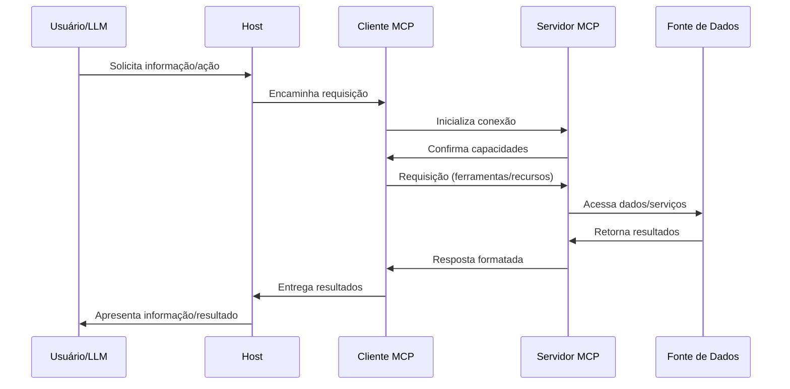

**🔐 Segurança Integrada:**

- Autenticação via OAuth 2.1
- Logs detalhados para auditoria
- Controle granular de permissões

**💬 Na Prática:** "Nossa equipe de segurança aprovou o MCP porque cada servidor tem seu próprio perímetro de segurança, e todas as interações são autenticadas e registradas para auditoria futura."

## Conceitos Fundamentais do MCP

### Roots: Os Territórios de Acesso

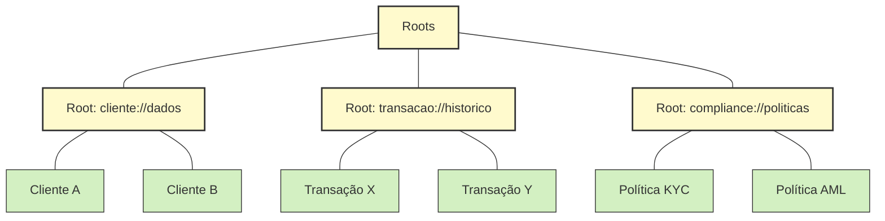

**O que são:** Roots são como "zonas de acesso" que delimitam onde um servidor MCP pode operar. Como crachás de segurança que dão acesso a diferentes áreas do banco.

**Para que servem:**

- Garantem segurança, limitando o escopo de atuação
- Organizam recursos em categorias lógicas
- Permitem controle granular de permissões

**Como implementar no Itaú:**

```python
@app.list_roots()
async def list_roots() -> list[types.Root]:
    return [
        types.Root(
            uri="cliente://dados-cadastrais",
            name="Dados Cadastrais de Clientes"
        ),
        types.Root(
            uri="risco://modelos",
            name="Modelos de Análise de Risco"
        )
    ]
```

**💬 Na Prática:** "Criamos um Root específico para dados não-sensíveis de clientes que nosso chatbot pode acessar, mantendo os dados sensíveis em um Root separado com acesso mais restrito."

### Resources: A Biblioteca de Conhecimento

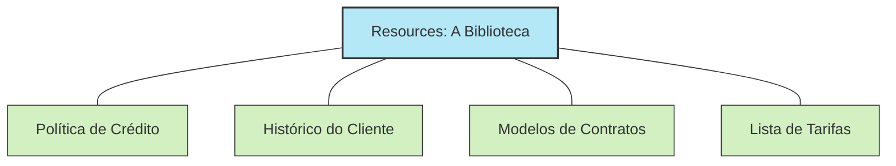

**O que são:** Resources são "livros de conhecimento" que a IA pode consultar. São dados estruturados ou documentos que o servidor MCP disponibiliza para leitura.

**Para que servem:**

- Fornecem contexto atual e preciso para as IAs
- Permitem acesso a documentos específicos (políticas, contratos, etc.)
- Garantem que a IA use informações aprovadas e atualizadas

**Como implementar no Itaú:**

```python
@app.list_resources(root_uri="cliente://dados-cadastrais")
async def list_resources() -> list[types.Resource]:
    return [
        types.Resource(
            uri="cliente://dados-cadastrais/segmentacao",
            name="Regras de Segmentação de Clientes"
        ),
        types.Resource(
            uri="cliente://dados-cadastrais/produtos-recomendados",
            name="Matriz de Recomendação de Produtos"
        )
    ]
```

**💬 Na Prática:** "Nosso assistente agora consulta a versão mais atual das políticas de crédito diretamente do sistema através de Resources MCP, eliminando respostas baseadas em versões desatualizadas."

### Prompts: As Receitas Prontas

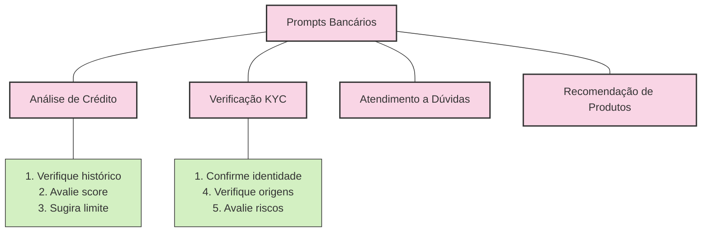

**O que são:** Prompts são "receitas" pré-estruturadas que guiam a IA em tarefas específicas. Como formulários padronizados para processos bancários comuns.

**Para que servem:**

- Padronizam o formato de interações repetitivas
- Garantem que todas as etapas de um processo sejam seguidas
- Simplificam tarefas complexas em fluxos reutilizáveis

**Como implementar no Itaú:**

```python
@app.list_prompts()
async def list_prompts() -> list[types.Prompt]:
    return [
        types.Prompt(
            uri="prompts://analise-credito",
            name="Análise de Crédito PF",
            description="Verifica elegibilidade para crédito pessoal",
            parameters=[
                types.ParameterDefinition(
                    name="cpf",
                    description="CPF do cliente",
                    required=True
                ),
                types.ParameterDefinition(
                    name="valor_solicitado",
                    description="Valor do empréstimo",
                    required=True
                )
            ]
        )
    ]
```

**💬 Na Prática:** "Nossos gerentes têm um botão 'Análise de Crédito' que aciona um prompt MCP estruturado, garantindo que todas as análises de crédito sigam exatamente o mesmo processo e documentação."

### Tools: A Caixa de Ferramentas

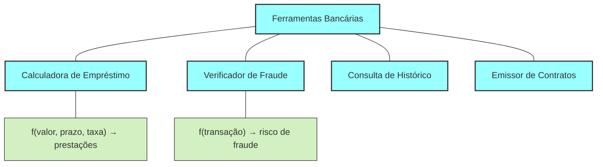

**O que são:** Tools são "ferramentas" que permitem à IA executar ações concretas nos sistemas. Como um conjunto de botões que a IA pode apertar para fazer coisas acontecerem.

**Para que servem:**

- Permitem que a IA execute operações em sistemas externos
- Processam dados e retornam resultados estruturados
- Automatizam tarefas que antes exigiam intervenção humana

**Como implementar no Itaú:**

```python
@app.tool("calculadora-credito")
async def calcular_credito(
    valor: float, 
    prazo: int, 
    perfil_risco: str
) -> dict:
    # Lógica de cálculo real do banco
    taxa = obter_taxa_por_perfil(perfil_risco)
    prestacao = calcular_prestacao(valor, prazo, taxa)
    return {
        "valor_emprestimo": valor,
        "prazo_meses": prazo,
        "taxa_mensal": taxa,
        "valor_prestacao": prestacao,
        "cet": calcular_cet(valor, prazo, taxa)
    }
```

**💬 Na Prática:** "Nossa IA agora pode simular empréstimos em tempo real usando a mesma calculadora de crédito que nossos sistemas core, garantindo consistência total nas ofertas apresentadas aos clientes."

### Sampling: Consultando o Oráculo

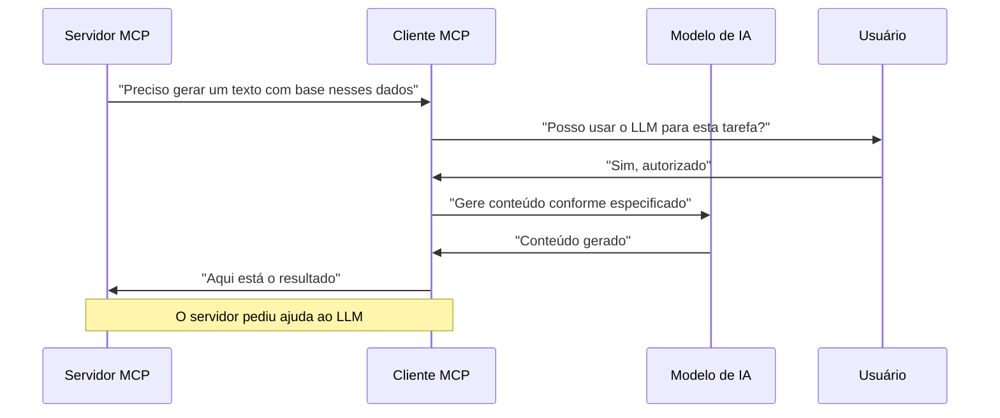

**O que é:** Sampling é quando um servidor MCP precisa da inteligência do LLM e pede ao cliente para fazer essa ponte. Como um especialista pedindo a opinião de um consultor externo para resolver um problema.

**Para que serve:**

- Permite que servidores MCP aproveitem a inteligência dos LLMs
- Mantém o controle com o usuário, que pode aprovar ou rejeitar
- Permite customização de respostas sem reescrever servidores

**Como funciona no Itaú:**

```python
# Servidor solicita geração de texto para uma carta específica
sampling_request = SamplingRequest(
    model="claude-3-5-sonnet",
    prompt="Gere uma carta de boas-vindas para um cliente Personnalité que acaba de abrir sua conta. Dados do cliente: {dados}",
    context=[
        {"role": "system", "content": "Use linguagem formal seguindo o manual de identidade do Itaú Personnalité."}
    ],
    parameters={
        "max_tokens": 500,
        "temperature": 0.7
    }
)

# Cliente MCP recebe esse pedido, solicita aprovação do usuário, e só então executa
```

**💬 Na Prática:** "Nosso servidor MCP de documentação consegue gerar exemplos de código específicos para APIs bancárias, pedindo ao LLM para criar snippets baseados na documentação oficial."

## Especificação Técnica do Protocolo

### Camadas do Protocolo

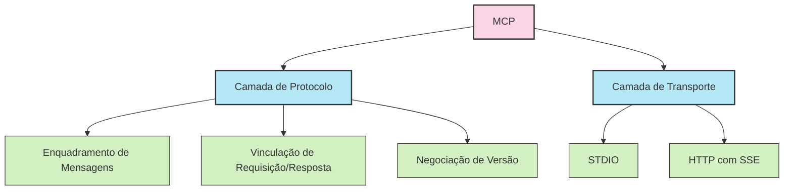

**🧰 Especificações:**

1. **Formato de Mensagens:** Baseado em JSON-RPC 2.0
    
    **Requests (Pedidos):**
    
    ```json
    {
        "jsonrpc": "2.0",
        "id": "req-123",
        "method": "tools/call",
        "params": {
            "tool": "calculadora-credito",
            "arguments": {
                "valor": 50000,
                "prazo": 36,
                "perfil_risco": "baixo"
            }
        }
    }
    ```
    
    **Results (Resultados):**
    
    ```json
    {
        "jsonrpc": "2.0",
        "id": "req-123",
        "result": {
            "valor_emprestimo": 50000,
            "prazo_meses": 36,
            "taxa_mensal": 0.99,
            "valor_prestacao": 1695.32,
            "cet": 12.68
        }
    }
    ```
    
    **Notifications (Notificações):**
    
    ```json
    {
        "jsonrpc": "2.0",
        "method": "progress/update",
        "params": {
            "id": "task-456",
            "percentage": 75,
            "message": "Processando histórico de crédito..."
        }
    }
    ```
    
2. **Ciclo de Vida da Conexão:**
    
    - **Inicialização:**
        
        1. Cliente envia requisição `initialize` com versão e capacidades
        2. Servidor responde com suas capacidades
        3. Cliente envia notificação `initialized`
    - **Troca de Mensagens:**
        
        - Request-Response: Comunicação bidirecional
        - Notifications: Mensagens unidirecionais
    - **Terminação:**
        
        - Desligamento limpo via `close()`
        - Desconexão de transporte
        - Tratamento de condições de erro
3. **Camada de Transporte:**
    
    - **STDIO:** Comunicação local entre processos
        
        - Eficiente e simples para aplicações no mesmo dispositivo
        - Baixa latência e zero configuração de rede
    - **HTTP com SSE:** Comunicação remota
        
        - Suporte a autenticação e autorização
        - Compatível com firewalls e proxies corporativos
        - Permite comunicação através da rede interna do banco

**🔄 Negociação de Versão:** Clientes e servidores concordam com a versão do protocolo a usar, garantindo compatibilidade e evolução controlada.

## De Tools Simples ao A2A: A Evolução dos Assistentes

### 📈 A Jornada Evolutiva


**Fase 1: Ferramentas Básicas**

- IA com acesso limitado a funções predefinidas
- Operação isolada, sem consciência de outros agentes
- Exemplos: Calculadora de câmbio, verificador de saldo

**Fase 2: MCP Completo**

- Comunicação estruturada com metadados
- Acesso a múltiplos sistemas via servidores especializados
- Auditoria completa de todas as interações
- Exemplos: Assistente de crédito, auxiliar de compliance

**Fase 3: Comunicação A2A**

- Múltiplos agentes especializados colaborando
- Delegação e orquestração de tarefas complexas
- Resolução colaborativa de problemas
- Exemplos: Time virtual de análise de fraude, sistema automatizado de aprovação de crédito

**💬 Na Prática:** "No futuro, quando um cliente solicitar um produto complexo, um agente orquestrador delegará tarefas para agentes especialistas em análise de crédito, compliance, precificação e documentação, todos colaborando sem intervenção humana, mas com supervisão total."

## Benefícios para o Itaú

### 💰 Impacto nos Negócios

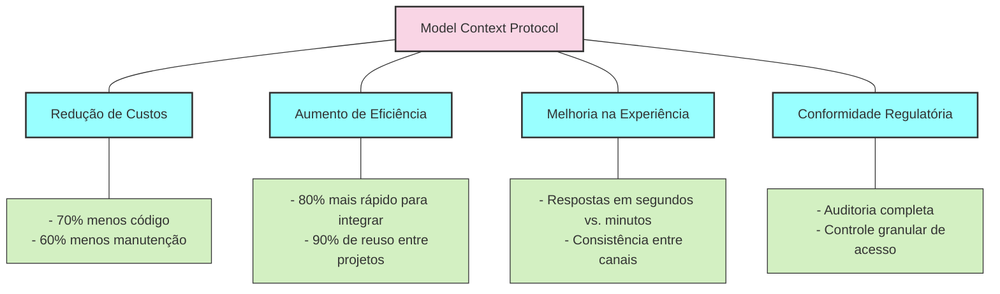

### 1. Compliance e Auditoria

- **Rastreabilidade Total:** Cada interação é documentada com timestamps e metadados
- **Evidências Auditáveis:** Suporte para auditorias do Banco Central e processos internos
- **Controle Granular:** Permissões específicas para cada tipo de dado e operação

### 2. Integração com Sistemas Legados

- **Adaptadores Uniformes:** Conexão padronizada com mainframes e sistemas antigos
- **Evolução Gradual:** Atualização incremental sem reescrever sistemas inteiros
- **Extensibilidade:** Fácil adição de novas funcionalidades a sistemas existentes

### 3. Segurança Bancária

- **Isolamento:** Separação clara entre acesso a dados e lógica de negócio
- **Autenticação Robusta:** Suporte para esquemas de autenticação bancária
- **Prevenção de Ataques:** Validação rigorosa de todas as entradas e saídas

### 4. Aceleração do Time-to-Market

- **Biblioteca de Componentes:** Servidores MCP reutilizáveis para funções bancárias comuns
- **Prototipagem Rápida:** Novos assistentes conectados a sistemas existentes em dias, não meses
- **Escala:** Capacidade de lançar múltiplos assistentes para diferentes segmentos e produtos

**💬 Na Prática:** "Com o MCP, conseguimos reduzir o tempo de desenvolvimento de novos assistentes de IA de 6 meses para 3 semanas, reutilizando servidores MCP já desenvolvidos para outros projetos."

## Roteiro de Implementação

### 🚀 Roadmap para o Itaú

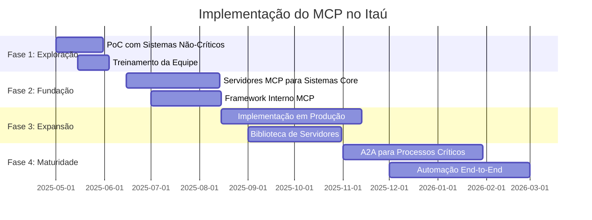

### Fase 1: Exploração (1-2 meses)

- **PoC Controlada:** Começar com um caso de uso não-crítico (ex: busca em documentos internos)
- **Equipe Piloto:** Formar um squad multidisciplinar para aprender a tecnologia
- **Ambiente Seguro:** Configurar sandbox isolado para testes iniciais

### Fase 2: Fundação (2-3 meses)

- **Servidores Core:** Desenvolver primeiros servidores MCP para sistemas estratégicos
- **Framework Bancário:** Criar camadas de abstração específicas para o contexto bancário
- **Políticas de Segurança:** Estabelecer padrões de desenvolvimento seguro com MCP

### Fase 3: Expansão (3-6 meses)

- **Produtização:** Mover primeiros serviços para ambiente produtivo
- **Catálogo Interno:** Criar biblioteca de servidores MCP para reuso
- **Comunidade Interna:** Fomentar compartilhamento de conhecimento entre equipes

### Fase 4: Maturidade (6+ meses)

- **Integração A2A:** Implementar comunicação entre agentes para processos complexos
- **Automação Avançada:** Criar fluxos end-to-end para processos de negócio
- **Otimização:** Refinar com base em métricas de performance e feedback

**💬 Na Prática:** "Começamos com um servidor MCP simples para nossa base de conhecimento, depois expandimos para sistemas de atendimento, e em 6 meses já tínhamos uma biblioteca de 15 servidores MCP reutilizáveis em diferentes projetos."

## Casos de Uso no Itaú

### 📊 Aplicações Práticas

#### Caso 1: Assistente de Gerentes Personnalité

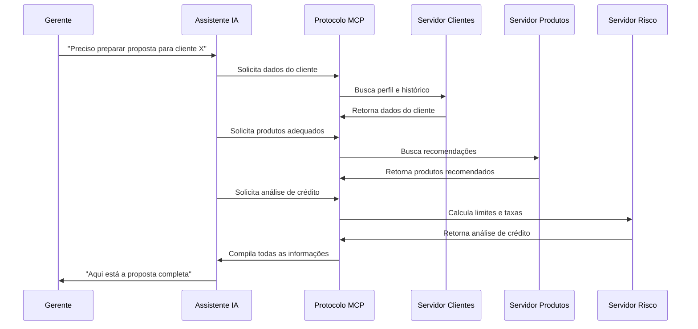

**Servidores MCP Utilizados:**

- Servidor para dados de clientes Personnalité
- Servidor para catálogo de produtos de investimento
- Servidor para motor de análise de crédito
- Servidor para geração de propostas

**Benefícios:**

- Redução de 70% no tempo de preparação de propostas
- Consistência nas recomendações entre todos os gerentes
- Documentação automática de todas as análises para compliance

#### Caso 2: Sistema Automatizado de Compliance

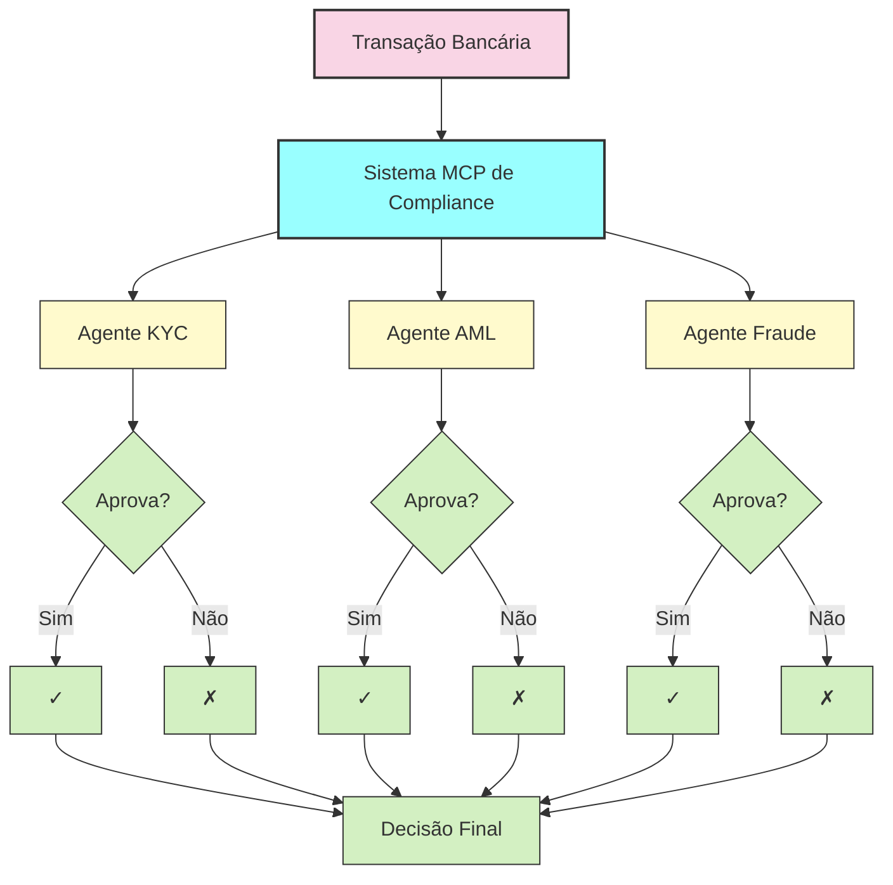

**Servidores MCP Utilizados:**

- Servidor para verificação KYC (Know Your Customer)
- Servidor para análise AML (Anti-Money Laundering)
- Servidor para detecção de fraudes
- Servidor para regras Bacen e regulações internacionais

**Benefícios:**

- Análise de 100% das transações em tempo real
- Redução de 60% nos falsos positivos
- Trilha de auditoria completa para cada decisão

#### Caso 3: Assistente de Desenvolvimento Interno

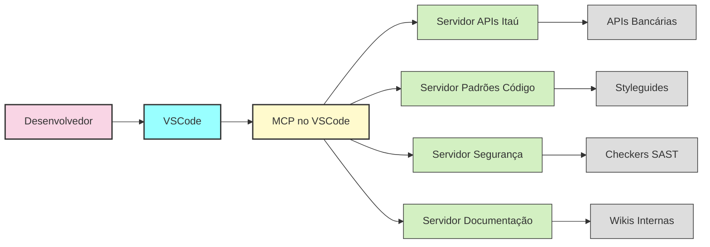

**Servidores MCP Utilizados:**

- Servidor para documentação de APIs bancárias
- Servidor para padrões e boas práticas de código
- Servidor para verificações de segurança
- Servidor para wikis e documentação interna

**Benefícios:**

- Redução de 40% no tempo de onboarding de novos desenvolvedores
- Aumento de 30% na qualidade de código (menos bugs e vulnerabilidades)
- Conformidade automática com padrões de segurança bancária

**💬 Na Prática:** "Um dev novo costumava levar semanas para entender nossas APIs bancárias. Com nosso assistente MCP no VSCode, ele tem sugestões contextuais e exemplos em tempo real enquanto codifica."

## Próximos Passos

### 📋 Plano de Ação Imediato

1. **Formar Grupo de Trabalho**
    
    - [ ] Identificar stakeholders de TI, Negócios e Compliance
    - [ ] Designar líder técnico e product owner
    - [ ] Estabelecer cadência de reuniões e comunicação
2. **Selecionar Caso de Uso Piloto**
    
    - [ ] Identificar aplicação com alto valor e baixo risco
    - [ ] Definir métricas de sucesso claras
    - [ ] Mapear sistemas e dados necessários
3. **Preparar Ambiente**
    
    - [ ] Configurar infraestrutura para servidores MCP
    - [ ] Definir padrões de segurança e compliance
    - [ ] Estabelecer pipelines de CI/CD
4. **Capacitar Equipe**
    
    - [ ] Treinamento técnico em MCP
    - [ ] Workshops de design para casos de uso
    - [ ] Documentação de boas práticas internas

**🔄 Loops de Feedback:**

- Revisões semanais do progresso da POC
- Demonstrações para stakeholders a cada 2 semanas
- Retrospectivas técnicas para melhorias contínuas

## Recursos para Aprofundamento

### 📚 Fontes Oficiais

- **Documentação Oficial:** [modelcontextprotocol.io](https://modelcontextprotocol.io/)
- **Repositório GitHub:** [github.com/modelcontextprotocol](https://github.com/modelcontextprotocol)
- **Anúncio da Anthropic:** [anthropic.com/news/model-context-protocol](https://www.anthropic.com/news/model-context-protocol)
- **SDKs Disponíveis:**
    - Java: [github.com/modelcontextprotocol/java-sdk](https://github.com/modelcontextprotocol/java-sdk)
    - TypeScript: [github.com/modelcontextprotocol/typescript-sdk](https://github.com/modelcontextprotocol/typescript-sdk)
    - Python: [github.com/modelcontextprotocol/python-sdk](https://github.com/modelcontextprotocol/python-sdk)

### 🤝 Contatos para Suporte

- **Time de Integração Claude:** email@anthropic.com
- **Comunidade MCP:** [Discord](https://discord.gg/mcp)
- **Fórum de Desenvolvedores:** [forum.modelcontextprotocol.io](https://forum.modelcontextprotocol.io/)

---

> 💼 **Preparado para o Itaú Banking Group por:** Equipe de Integração IA
> 
> Para mais informações: [email@itau.com.br]