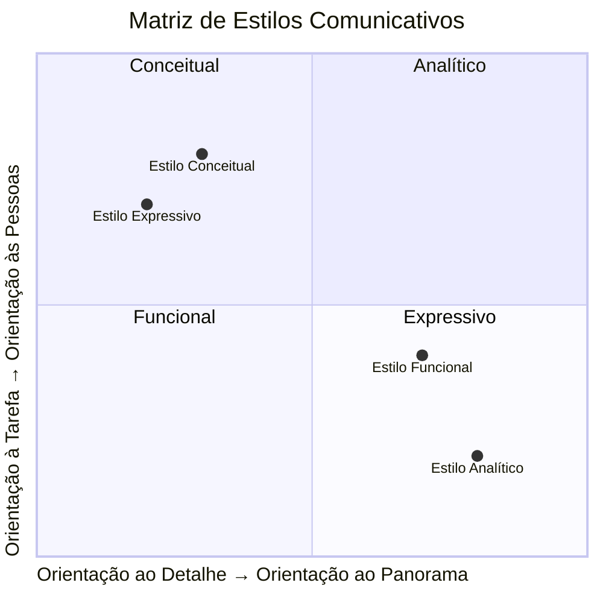
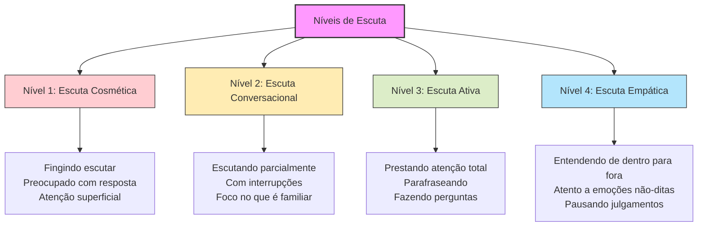
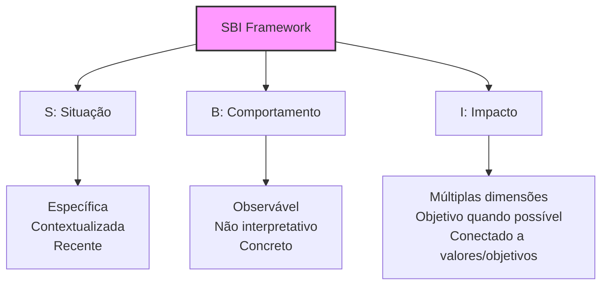
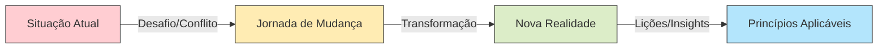

# A Arte da Comunicação Eficaz na Liderança: Um Guia Prático e Abrangente

![[91bf74b659beb21622ff995a30ccd287_MD5.svg]]

> _"A forma como nos comunicamos com os outros e conosco mesmos determina a qualidade de nossas vidas."_ — Anthony Robbins

> _"A comunicação não é sobre dizer o que você pensa. É sobre garantir que o outro entenda o que você quer dizer."_ — Simon Sinek

## 🔍 Índice

- [A Arte da Comunicação Eficaz na Liderança: Um Guia Prático e Abrangente](https://claude.ai/chat/2cb2ff43-829c-4ab4-84c5-304538705264#a-arte-da-comunica%C3%A7%C3%A3o-eficaz-na-lideran%C3%A7a-um-guia-pr%C3%A1tico-e-abrangente)
    - [🔍 Índice](https://claude.ai/chat/2cb2ff43-829c-4ab4-84c5-304538705264#-%C3%ADndice)
    - [🎯 Por que a comunicação é a habilidade que amplifica todas as outras](https://claude.ai/chat/2cb2ff43-829c-4ab4-84c5-304538705264#-por-que-a-comunica%C3%A7%C3%A3o-%C3%A9-a-habilidade-que-amplifica-todas-as-outras)
    - [🧩 O Mosaico da Comunicação: Diferentes Estilos e Personalidades](https://claude.ai/chat/2cb2ff43-829c-4ab4-84c5-304538705264#-o-mosaico-da-comunica%C3%A7%C3%A3o-diferentes-estilos-e-personalidades)
        - [Identificando seu Estilo Comunicativo Natural](https://claude.ai/chat/2cb2ff43-829c-4ab4-84c5-304538705264#identificando-seu-estilo-comunicativo-natural)
        - [Como Diversificar seu Repertório Comunicativo](https://claude.ai/chat/2cb2ff43-829c-4ab4-84c5-304538705264#como-diversificar-seu-repert%C3%B3rio-comunicativo)
    - [🌈 Potencializando a Comunicação para Diferentes Personalidades](https://claude.ai/chat/2cb2ff43-829c-4ab4-84c5-304538705264#-potencializando-a-comunica%C3%A7%C3%A3o-para-diferentes-personalidades)
        - [Estratégias para Comunicadores Introvertidos](https://claude.ai/chat/2cb2ff43-829c-4ab4-84c5-304538705264#estrat%C3%A9gias-para-comunicadores-introvertidos)
        - [Técnicas para Comunicadores Tímidos](https://claude.ai/chat/2cb2ff43-829c-4ab4-84c5-304538705264#t%C3%A9cnicas-para-comunicadores-t%C3%ADmidos)
        - [Abordagens para Comunicadores Analíticos](https://claude.ai/chat/2cb2ff43-829c-4ab4-84c5-304538705264#abordagens-para-comunicadores-anal%C3%ADticos)
        - [Métodos para Comunicadores Verbalmente Intensos](https://claude.ai/chat/2cb2ff43-829c-4ab4-84c5-304538705264#m%C3%A9todos-para-comunicadores-verbalmente-intensos)
    - [🛠️ O Kit de Ferramentas do Comunicador Eficaz](https://claude.ai/chat/2cb2ff43-829c-4ab4-84c5-304538705264#%EF%B8%8F-o-kit-de-ferramentas-do-comunicador-eficaz)
        - [1. Domínio da Escuta Ativa](https://claude.ai/chat/2cb2ff43-829c-4ab4-84c5-304538705264#1-dom%C3%ADnio-da-escuta-ativa)
        - [2. Maestria do Feedback Construtivo](https://claude.ai/chat/2cb2ff43-829c-4ab4-84c5-304538705264#2-maestria-do-feedback-construtivo)
        - [3. Comunicação Visual e Simplificação](https://claude.ai/chat/2cb2ff43-829c-4ab4-84c5-304538705264#3-comunica%C3%A7%C3%A3o-visual-e-simplifica%C3%A7%C3%A3o)
        - [4. Storytelling para Engajamento e Retenção](https://claude.ai/chat/2cb2ff43-829c-4ab4-84c5-304538705264#4-storytelling-para-engajamento-e-reten%C3%A7%C3%A3o)
        - [5. Perguntas Poderosas: A Arte de Desbloquear Conversas](https://claude.ai/chat/2cb2ff43-829c-4ab4-84c5-304538705264#5-perguntas-poderosas-a-arte-de-desbloquear-conversas)
        - [6. Comunicação Não-Verbal e Presença](https://claude.ai/chat/2cb2ff43-829c-4ab4-84c5-304538705264#6-comunica%C3%A7%C3%A3o-n%C3%A3o-verbal-e-presen%C3%A7a)
    - [📊 A Comunicação nos Diferentes Contextos Profissionais](https://claude.ai/chat/2cb2ff43-829c-4ab4-84c5-304538705264#-a-comunica%C3%A7%C3%A3o-nos-diferentes-contextos-profissionais)
        - [Em Reuniões One-on-One](https://claude.ai/chat/2cb2ff43-829c-4ab4-84c5-304538705264#em-reuni%C3%B5es-one-on-one)
        - [Em Reuniões de Equipe](https://claude.ai/chat/2cb2ff43-829c-4ab4-84c5-304538705264#em-reuni%C3%B5es-de-equipe)
        - [Em Apresentações para Stakeholders](https://claude.ai/chat/2cb2ff43-829c-4ab4-84c5-304538705264#em-apresenta%C3%A7%C3%B5es-para-stakeholders)
        - [Em Comunicações Escritas](https://claude.ai/chat/2cb2ff43-829c-4ab4-84c5-304538705264#em-comunica%C3%A7%C3%B5es-escritas)
        - [Em Situações de Conflito](https://claude.ai/chat/2cb2ff43-829c-4ab4-84c5-304538705264#em-situa%C3%A7%C3%B5es-de-conflito)
        - [Em Ambientes Remotos e Híbridos](https://claude.ai/chat/2cb2ff43-829c-4ab4-84c5-304538705264#em-ambientes-remotos-e-h%C3%ADbridos)
    - [🚫 Anti-padrões: Os Sabotadores da Comunicação Eficaz](https://claude.ai/chat/2cb2ff43-829c-4ab4-84c5-304538705264#-anti-padr%C3%B5es-os-sabotadores-da-comunica%C3%A7%C3%A3o-eficaz)
    - [🧪 Laboratório Prático: Experimentos para Desenvolver Suas Habilidades Comunicativas](https://claude.ai/chat/2cb2ff43-829c-4ab4-84c5-304538705264#-laborat%C3%B3rio-pr%C3%A1tico-experimentos-para-desenvolver-suas-habilidades-comunicativas)
    - [📈 Medindo e Evoluindo Sua Comunicação](https://claude.ai/chat/2cb2ff43-829c-4ab4-84c5-304538705264#-medindo-e-evoluindo-sua-comunica%C3%A7%C3%A3o)
    - [📝 Conclusão: A Jornada Contínua da Comunicação Eficaz](https://claude.ai/chat/2cb2ff43-829c-4ab4-84c5-304538705264#-conclus%C3%A3o-a-jornada-cont%C3%ADnua-da-comunica%C3%A7%C3%A3o-eficaz)

## 🎯 Por que a comunicação é a habilidade que amplifica todas as outras

Imagine sua carreira como um motor de alto desempenho. Suas habilidades técnicas, conhecimento de domínio e experiência são componentes essenciais desse motor. Mas a comunicação? É o lubrificante que permite que todas essas peças trabalhem juntas em harmonia, maximizando a potência e evitando o atrito que poderia paralisar toda a máquina.

> "A maior falha na comunicação é a ilusão de que ela ocorreu." — George Bernard Shaw

A realidade é que profissionais brilhantes frequentemente veem suas carreiras estagnarem não por falta de competência técnica, mas pela incapacidade de comunicar eficazmente seu valor, suas ideias e sua visão. Em um estudo da McKinsey, 86% dos executivos identificaram a comunicação ineficaz como a principal causa de falhas em projetos organizacionais.

Algumas verdades inconvenientes sobre comunicação no ambiente profissional:

1. **Seu valor percebido está diretamente ligado à sua capacidade de comunicação**
    
    - Duas pessoas com habilidades técnicas idênticas serão percebidas de maneira drasticamente diferente se uma comunica com clareza e a outra não
2. **A clareza é rara e valiosa**
    
    - Em um mundo de sobrecarga informacional, a capacidade de transmitir ideias complexas com clareza e concisão é um diferencial competitivo
3. **A comunicação é bidirecional**
    
    - Comunicar não é apenas transmitir informações—é garantir compreensão mútua

Ao contrário do que muitos pensam, comunicação eficaz não é um talento inato, mas sim um conjunto de habilidades que podem ser deliberadamente desenvolvidas e aprimoradas. Como observa Brené Brown: "A comunicação clara não é um talento natural para a maioria de nós; é uma habilidade que precisa ser desenvolvida e praticada."

## 🧩 O Mosaico da Comunicação: Diferentes Estilos e Personalidades

Assim como cada pessoa tem uma impressão digital única, cada um de nós possui um estilo comunicativo próprio—uma combinação particular de tendências, preferências e padrões que moldou-se ao longo de nossas vidas.

### Identificando seu Estilo Comunicativo Natural

**Os quatro estilos fundamentais:**

1. **Estilo Analítico**
    
    - **Características:** Orientado a dados, preciso, lógico, medido
    - **Forças:** Precisão, pensamento estruturado, argumentação baseada em fatos
    - **Desafios:** Pode parecer distante, muito detalhista, menos empático
    - **Preferências:** Emails bem estruturados, documentação completa, tempo para processar
2. **Estilo Funcional**
    
    - **Características:** Prático, orientado a processos, sequencial, organizado
    - **Forças:** Clareza procedimental, orientação para a ação, confiabilidade
    - **Desafios:** Pode resistir a mudanças, focado demais em como fazer vs. por que fazer
    - **Preferências:** Checklists, passos concretos, expectativas claras
3. **Estilo Conceitual**
    
    - **Características:** Inovador, visionário, orientado ao futuro, abstrato
    - **Forças:** Pensamento integrador, visão de longo prazo, inspirador
    - **Desafios:** Pode parecer impraticável, desorganizado ou desconectado do presente
    - **Preferências:** Brainstormings, discussões sobre possibilidades, espaço para criatividade
4. **Estilo Expressivo**
    
    - **Características:** Empático, entusiasta, orientado a relacionamentos, animado
    - **Forças:** Construção de conexões, motivação de equipes, comunicação emocional
    - **Desafios:** Pode ser percebido como muito emocional ou menos focado em resultados
    - **Preferências:** Interações pessoais, reconhecimento público, ambiente colaborativo

**Exercício de Auto-diagnóstico:**

Pense nas últimas cinco interações comunicativas significativas que você teve. Para cada uma, identifique:

1. Qual foi seu objetivo principal?
2. Como você estruturou a mensagem?
3. Que aspectos você enfatizou?
4. Como você se sentiu durante a interação?

Padrões emergirão, revelando suas tendências naturais. Lembre-se: não há estilo "certo" ou "errado" — apenas estilos mais ou menos eficazes em contextos específicos.

### Como Diversificar seu Repertório Comunicativo

A verdadeira maestria na comunicação não vem de aperfeiçoar seu estilo natural, mas de expandir seu repertório para incluir elementos de todos os estilos, adaptando-se ao contexto e ao interlocutor.

**Técnicas para Expansão de Estilo:**

|Se Você For:|Para Incorporar Elementos Analíticos|Para Incorporar Elementos Funcionais|Para Incorporar Elementos Conceituais|Para Incorporar Elementos Expressivos|
|---|---|---|---|---|
|**Analítico**|_Seu estilo natural_|Termine conversas com próximos passos concretos|Reserve tempo para explorar o "e se?"|Comece reuniões com check-in pessoal|
|**Funcional**|Inclua dados que suportem seu plano|_Seu estilo natural_|Explique o "porquê" antes do "como"|Reconheça o impacto emocional das mudanças|
|**Conceitual**|Traga pelo menos 3 dados concretos para cada ideia|Detalhe os passos práticos de implementação|_Seu estilo natural_|Conecte sua visão às pessoas afetadas|
|**Expressivo**|Estruture suas emoções com lógica subjacente|Defina critérios claros para sucesso|Canalize entusiasmo em visões estruturadas|_Seu estilo natural_|

**Princípio Fundamental:** A comunicação mais eficaz acontece quando você adapta seu estilo para encontrar a pessoa onde ela está, não onde você gostaria que ela estivesse.

## 🌈 Potencializando a Comunicação para Diferentes Personalidades

### Estratégias para Comunicadores Introvertidos

A introversão não é uma barreira à comunicação eficaz—é simplesmente uma abordagem diferente que pode ser altamente poderosa quando bem aproveitada.

Susan Cain, autora de "O Poder dos Quietos", enfatiza: "Há zero correlação entre ser o melhor comunicador e ter as melhores ideias."

**Potencializando Forças Introvertidas:**

1. **Preparação Deliberada**
    
    - Elabore notas detalhadas antes de reuniões importantes
    - Ensaie mentalmente pontos-chave para discussões antecipadas
    - Solicite agendas com antecedência para processar informações no seu ritmo
2. **Comunicação Escrita Estratégica**
    
    - Utilize documentação assíncrona onde sua clareza de pensamento pode brilhar
    - Desenvolva uma "voz escrita" distintiva em emails e documentos
    - Crie templates pessoais para comunicações recorrentes
3. **Intervenções Calculadas em Discussões**
    
    - Priorize qualidade sobre quantidade em contribuições verbais
    - Utilize frases como "Estive refletindo sobre..." para sinalizar contribuições pensadas
    - Reserve energia para momentos verdadeiramente críticos em discussões
4. **Gestão de Energia Comunicativa**
    
    - Programe períodos de "recarga" entre interações de alta intensidade
    - Agende suas contribuições mais importantes para seus picos de energia
    - Comunique suas preferências de modo de trabalho para normalizar seu estilo

**Exemplo prático:** Sarah, uma líder técnica introvertida, transformou sua preferência por reflexão profunda em uma vantagem comunicativa criando "Documentos de Decisão" detalhados antes de reuniões críticas. Estes documentos circulados previamente permitiam que suas ideias fossem consideradas por seus méritos, não por quão assertivamente eram apresentadas em tempo real.

### Técnicas para Comunicadores Tímidos

A timidez — diferente da introversão — envolve ansiedade social que pode impedir a expressão plena de ideias valiosas. Felizmente, existem técnicas específicas para superar essas barreiras.

**Construindo Confiança Comunicativa:**

1. **Expansão Gradual da Zona de Conforto**
    
    - Comece contribuindo em grupos pequenos antes de contextos maiores
    - Estabeleça metas progressivas (ex: fazer uma pergunta hoje, apresentar um tópico na próxima semana)
    - Pratique contribuições breves mas regulares para normalizar sua voz
2. **Técnicas de Redução de Ansiedade**
    
    - Utilize respiração diafragmática antes de momentos comunicativos importantes
    - Empregue visualização positiva de interações bem-sucedidas
    - Adote uma postura física confiante mesmo quando não se sentir assim internamente
3. **Estruturas de Apoio à Expressão**
    
    - Prepare três pontos-chave antes de qualquer reunião importante
    - Utilize formatos previsíveis como "Situação-Complicação-Questão-Resposta" para estruturar contribuições
    - Recrute aliados que possam criar espaço para suas contribuições
4. **Reframing Cognitivo**
    
    - Substitua "Tenho que soar perfeito" por "Estou contribuindo para o pensamento coletivo"
    - Veja cada interação como prática, não como performance avaliativa
    - Foque no valor que sua perspectiva única traz, não em como você a entrega

**Exemplo prático:** Carlos, um engenheiro tímido mas talentoso, desenvolveu um sistema pessoal de "contribuições planejadas" onde identificava antecipadamente 1-2 pontos específicos que queria fazer em cada reunião. Com o tempo, esta prática construiu sua confiança para contribuições mais espontâneas.

### Abordagens para Comunicadores Analíticos

Profissionais com mentalidade predominantemente analítica frequentemente lutam para conectar-se com audiências menos técnicas ou para simplificar conceitos complexos sem perder precisão.

**Traduzindo o Analítico para o Acessível:**

1. **Framework Pirâmide Invertida**
    
    - Comece com a conclusão/impacto principal
    - Siga com pontos-chave de suporte
    - Termine com detalhes técnicos para quem quiser aprofundar
    - Permita que o ouvinte decida o nível de profundidade que deseja
2. **Técnica das "Camadas de Cebola"**
    
    - Prepare múltiplas camadas de explicação do mesmo conceito
    - Comece pela explicação mais simples e "descasque" apenas conforme necessário
    - Calibre a profundidade técnica baseada nos sinais da audiência
3. **Uso Estratégico de Analogias**
    
    - Desenvolva um repertório de analogias para conceitos técnicos recorrentes
    - Teste analogias com públicos diversos para refinar sua eficácia
    - Conecte o desconhecido (conceito técnico) ao conhecido (experiência cotidiana)
4. **Visualização de Dados e Conceitos**
    
    - Transforme dados complexos em visualizações intuitivas
    - Utilize diagramas simplificados para conceitos abstratos
    - Crie representações visuais de relações causa-efeito

**Exemplo prático:** Elena, uma cientista de dados, desenvolveu um "dicionário de analogias" para explicar algoritmos complexos para stakeholders não-técnicos. Seu favorito era comparar machine learning a ensinar uma criança a reconhecer frutas—começando com exemplos óbvios e gradualmente refinando com casos mais sutis.

### Métodos para Comunicadores Verbalmente Intensos

Comunicadores verbalmente fluentes e entusiastas frequentemente enfrentam o desafio oposto: ajustar seu estilo natural para não dominar conversas ou sobrecarregar outros com informações.

**Canalizando o Entusiasmo Verbal:**

1. **Técnica de Auto-Monitoramento**
    
    - Implemente a regra "pausar após 60 segundos" em conversas
    - Faça verificações periódicas de engajamento da audiência
    - Desenvolva consciência dos sinais não-verbais de sobrecarga informacional
2. **Estruturação Deliberada**
    
    - Anuncie no início quantos pontos você vai abordar ("Tenho três ideias para compartilhar...")
    - Utilize sinalização clara de transições entre tópicos
    - Resuma periodicamente para ajudar a audiência a acompanhar
3. **Criação de Espaço para Outros**
    
    - Pratique fazer perguntas abertas após expressar ideias
    - Implemente a regra de "duas orelhas, uma boca" (ouvir o dobro do que fala)
    - Adote conscientemente o papel de facilitador em vez de protagonista
4. **Redirecionamento de Energia Verbal**
    
    - Canalize intensidade verbal para formatos apropriados (apresentações, documentação detalhada)
    - Utilize notas para capturar pensamentos sem interromper o fluxo da conversa
    - Pratique comunicação assíncrona para reflexão mais estruturada

**Exemplo prático:** Miguel, um líder de produto verbalmente intenso, implementou uma técnica de "verificação de temperatura" em suas reuniões. A cada 5-7 minutos, ele deliberadamente parava e perguntava: "Isto está fazendo sentido? Alguma pergunta até aqui?", criando espaço para outros contribuírem.

## 🛠️ O Kit de Ferramentas do Comunicador Eficaz

### 1. Domínio da Escuta Ativa

A comunicação eficaz começa paradoxalmente não com falar, mas com escutar. Como Stephen Covey observou: "A maioria das pessoas não escuta com a intenção de entender; escuta com a intenção de responder."

**Os Quatro Níveis de Escuta:**

**Técnicas Práticas de Escuta Ativa:**

1. **Escuta 80/20**
    
    - Dedique 80% do tempo a escutar e 20% a falar
    - Resista à tendência de formular respostas enquanto a outra pessoa fala
    - Pratique pausas de 3 segundos antes de responder
2. **Verificação de Entendimento**
    
    - Parafraseie o que ouviu: "Então, o que estou entendendo é..."
    - Peça confirmação: "Estou compreendendo corretamente?"
    - Seja confortável admitindo: "Não tenho certeza se entendi completamente..."
3. **Técnicas para Entrevistas e One-on-Ones**
    
    - Utilize perguntas abertas (Como? O que? Por quê?)
    - Pratique o "mmm" encorajador para manter o interlocutor falando
    - Adote a regra: "nunca faça duas perguntas seguidas"
4. **Escuta Digital (para comunicação assíncrona)**
    
    - Leia mensagens e documentos inteiros antes de responder
    - Evite respostas parciais que ignoram pontos importantes
    - Verifique se entendeu a intenção subjacente, não apenas as palavras

**Exercício prático:** Na próxima conversa importante, mantenha uma contagem mental das vezes em que você interrompe ou começa a formular uma resposta antes da pessoa terminar. Apenas observar esse padrão já começará a transformá-lo.

### 2. Maestria do Feedback Construtivo

O feedback é a ferramenta mais poderosa para desenvolvimento pessoal e profissional, mas frequentemente é administrado de forma contraproducente.

**Framework SBI para Feedback Impactante:**

**Abordagens para Diferentes Tipos de Feedback:**

1. **Feedback de Reconhecimento**
    
    - Seja específico sobre o comportamento observado
    - Conecte à habilidade ou valor demonstrado
    - Explique o impacto ampliado além do resultado imediato
    - Ex: "Quando você dedicou tempo extra para mentorar nosso novo colaborador (comportamento), demonstrou nosso valor de crescimento coletivo (valor) e acelerou o onboarding dele em semanas (impacto)."
2. **Feedback de Desenvolvimento**
    
    - Use a estrutura "Continue-Comece-Pare"
    - Equilibre feedback positivo e corretivo (proporção ideal: 3:1)
    - Forneça exemplos concretos e sugestões acionáveis
    - Ex: "Continue explicando seu raciocínio em reuniões, comece a preparar um resumo escrito antecipadamente, e pare de usar jargão técnico com stakeholders não-técnicos."
3. **Feedback em Situações Delicadas**
    
    - Utilize a técnica "Observação-Sentimento-Necessidade-Pedido"
    - Foque no impacto do comportamento, não na intenção presumida
    - Sugira alternativas específicas

**Técnicas para Receber Feedback:**

1. **Postura de Aprendizagem Ativa**
    
    - Agradeça explicitamente pelo feedback, mesmo que desconfortável
    - Resista à tentação de explicar, justificar ou contra-argumentar imediatamente
    - Faça perguntas de clarificação: "Pode me dar um exemplo específico?"
2. **Processamento Construtivo**
    
    - Separe a reação emocional inicial da análise racional
    - Identifique padrões em múltiplos feedbacks recebidos
    - Busque um "grão de verdade" mesmo em feedback mal entregue

**Exemplo prático:** Marina, uma gerente de engenharia, transformou suas reuniões one-on-one implementando a "prática de feedback bidirecional" onde tanto ela quanto seu liderado devem compartilhar uma observação de reconhecimento e uma de desenvolvimento a cada encontro.

### 3. Comunicação Visual e Simplificação

Em um mundo de sobrecarga informacional, a capacidade de simplificar o complexo sem perder a essência tornou-se uma habilidade crítica.

**Técnicas de Simplificação:**

1. **O Princípio ELI5 ("Explain Like I'm 5")**
    
    - Elimine jargão e terminologia específica de domínio
    - Use frases curtas e vocabulário simples
    - Incorpore analogias com experiências universais
    - Ex: "Cloud computing é como alugar um apartamento em vez de construir uma casa"
2. **Comunicação em Camadas**
    
    - Comece com a versão mais simples ("manchete")
    - Adicione detalhes em camadas progressivas conforme necessário
    - Estruture informação do macro para o micro
3. **Reducionismo Estratégico**
    
    - Identifique os 2-3 pontos absolutamente essenciais
    - Elimine deliberadamente detalhes secundários
    - Construa sua comunicação em torno desses pontos-chave

**Ferramentas Visuais para Clareza:**

|Ferramenta Visual|Melhor Para|Exemplo de Uso|
|---|---|---|
|**Diagramas de Fluxo**|Processos sequenciais|Jornada do usuário, workflow de aprovação|
|**Mapas Mentais**|Conexões entre conceitos|Explorando relações entre iniciativas|
|**Quadrantes**|Comparações em duas dimensões|Priorização de projetos, análise de risco-valor|
|**Linha do Tempo**|Progressão temporal|Roadmaps, histórico de evolução|
|**Diagramas de Venn**|Sobreposições conceituais|Responsabilidades compartilhadas, casos de uso|

**Princípios de Design Visual:**

- **Contraste:** Destaque o mais importante
- **Repetição:** Crie padrões reconhecíveis
- **Alinhamento:** Estabeleça relações visuais claras
- **Proximidade:** Agrupe elementos relacionados

**Exemplo prático:** Paulo, um product manager, abandonou longas apresentações de slides em favor de "one-pagers visuais" para cada iniciativa importante—documentos de uma página combinando texto conciso e elementos visuais que comunicam a essência do projeto de maneira memorável.

### 4. Storytelling para Engajamento e Retenção

As histórias são 22 vezes mais memoráveis que fatos isolados, segundo pesquisas cognitivas. O storytelling não é um elemento decorativo, mas uma ferramenta fundamental de comunicação que transforma informação em significado.

**A Estrutura Universal de Histórias Eficazes:**

**Tipos de Narrativas para Contextos Profissionais:**

1. **Histórias de Origem**
    
    - Revelam motivações e valores fundamentais
    - Humanizam conceitos abstratos ou organizações
    - Ex: "Como descobri o problema que nossa solução resolve"
2. **Histórias de Falha e Aprendizado**
    
    - Demonstram vulnerabilidade e crescimento
    - Normalizam experimentação e aprendizado contínuo
    - Ex: "O lançamento desastroso que transformou nossa abordagem"
3. **Histórias de Transformação**
    
    - Ilustram mudanças significativas e seus impactos
    - Criam conexão emocional com conceitos abstratos
    - Ex: "Como passamos de startup caótica para operação estruturada"
4. **Micro-histórias para Contextualização**
    
    - Anedotas breves que ilustram pontos específicos
    - Tornam conceitos memoráveis e relatáveis
    - Ex: "Deixe-me compartilhar um exemplo rápido de como isso funcionou com um cliente..."

**Técnicas de Storytelling Aplicado:**

1. **Detalhes Sensoriais Estratégicos**
    
    - Inclua detalhes visuais, auditivos ou emocionais específicos
    - Evite generalidades vagas ("Foi difícil" vs. "Passei três noites sem dormir")
    - Limite-se a detalhes que amplificam o ponto central
2. **Personificação de Conceitos Abstratos**
    
    - Transforme ideias em personagens com desafios
    - Crie representações concretas para princípios abstratos
    - Ex: "Imagine nosso código como uma casa que cresceu sem planejamento..."
3. **Story-listening e Co-criação**
    
    - Solicite e incorpore histórias da audiência
    - Construa narrativas colaborativas em vez de monólogos
    - Use perguntas que provocam compartilhamento de experiências

**Exemplo prático:** Carla, CTO de uma startup