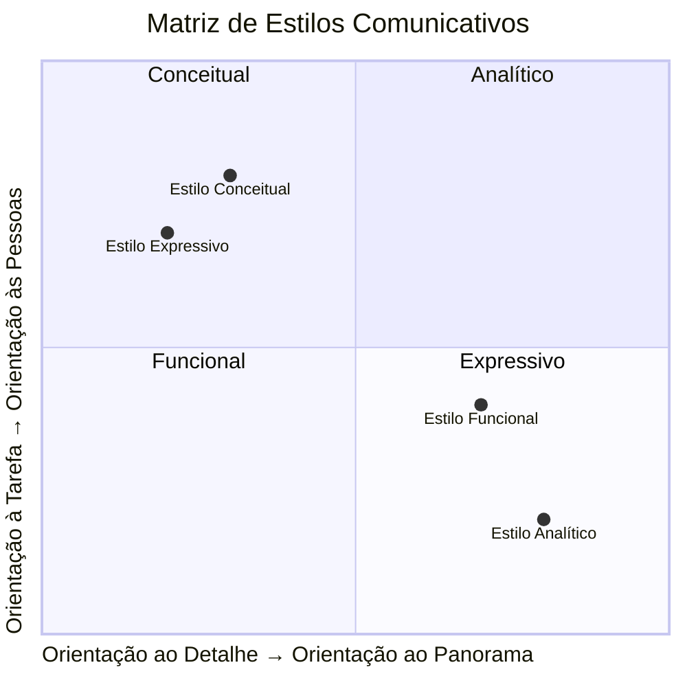
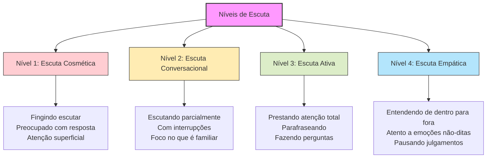
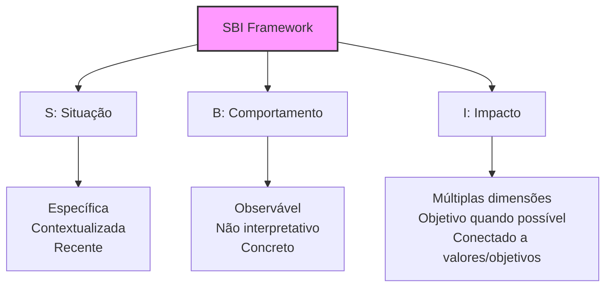
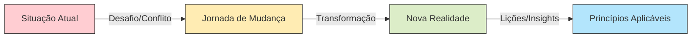
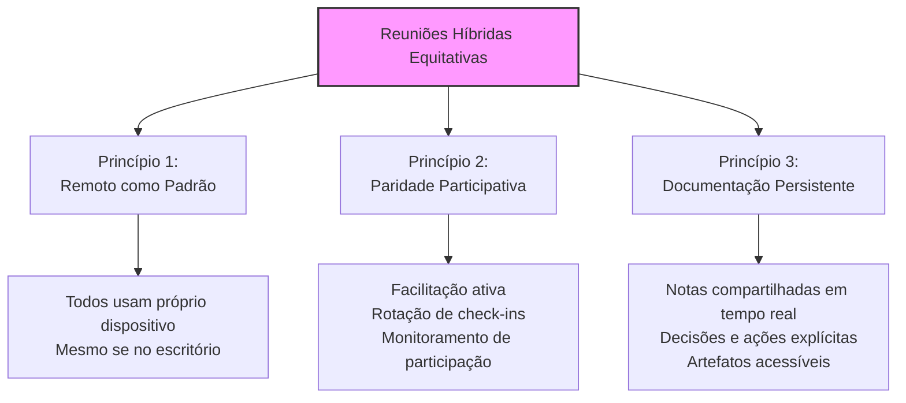
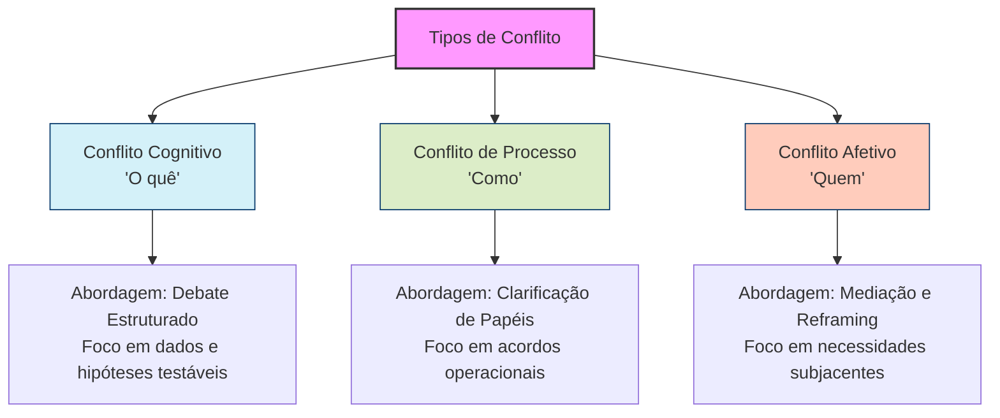
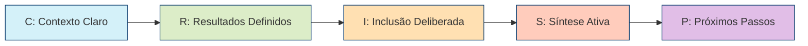
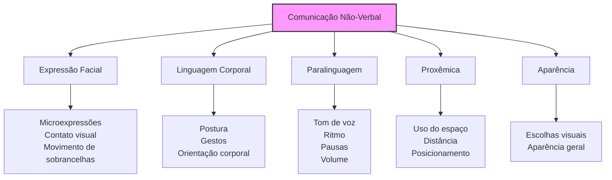
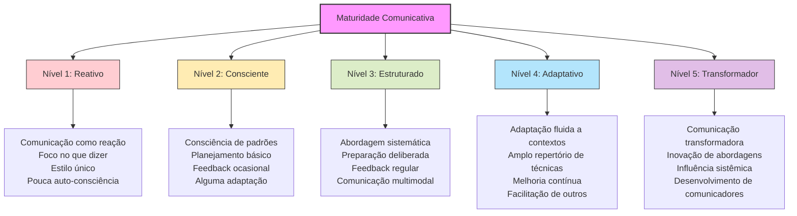

# A Arte da Comunicação Eficaz na Liderança: Um Guia Prático e Abrangente

![[91bf74b659beb21622ff995a30ccd287_MD5.svg]]

> _"A forma como nos comunicamos com os outros e conosco mesmos determina a qualidade de nossas vidas."_ — Anthony Robbins

> _"A comunicação não é sobre dizer o que você pensa. É sobre garantir que o outro entenda o que você quer dizer."_ — Simon Sinek

## 🔍 Índice

- [A Arte da Comunicação Eficaz na Liderança: Um Guia Prático e Abrangente](a-arte-da-comunica%C3%A7%C3%A3o-eficaz-na-lideran%C3%A7a-um-guia-pr%C3%A1tico-e-abrangente)
    - [🔍 Índice]( que amplifica todas as outras](-por-que-a-comunica%C3%A7%C3%A3o-%C3%A9-a-habilidade-que-amplifica-todas-as-outras)
    - [🧩 O Mosaico da Comunicação: Diferentes Estilos e Personalidades](-o-mosaico-da-comunica%C3%A7%C3%A3o-diferentes-estilos-e-personalidades)
        - [Identificando seu Estilo Comunicativo Natural](identificando-seu-estilo-comunicativo-natural)
        - [Como Diversificar seu Repertório Comunicativo](como-diversificar-seu-repert%C3%B3rio-comunicativo)
    - [🌈 Potencializando a Comunicação para Diferentes Personalidades](-potencializando-a-comunica%C3%A7%C3%A3o-para-diferentes-personalidades)
        - [Estratégias para Comunicadores Introvertidos](estrat%C3%A9gias-para-comunicadores-introvertidos)
        - [Técnicas para Comunicadores Tímidos](t%C3%A9cnicas-para-comunicadores-t%C3%ADmidos)
        - [Abordagens para Comunicadores Analíticos](abordagens-para-comunicadores-anal%C3%ADticos)
        - [Métodos para Comunicadores Verbalmente Intensos](m%C3%A9todos-para-comunicadores-verbalmente-intensos)
    - [🛠️ O Kit de Ferramentas do Comunicador Eficaz](%EF%B8%8F-o-kit-de-ferramentas-do-comunicador-eficaz)
        - [1. Domínio da Escuta Ativa](1-dom%C3%ADnio-da-escuta-ativa)
        - [2. Maestria do Feedback Construtivo](2-maestria-do-feedback-construtivo)
        - [3. Comunicação Visual e Simplificação](3-comunica%C3%A7%C3%A3o-visual-e-simplifica%C3%A7%C3%A3o)
        - [4. Storytelling para Engajamento e Retenção](4-storytelling-para-engajamento-e-reten%C3%A7%C3%A3o)
        - [5. Perguntas Poderosas: A Arte de Desbloquear Conversas](5-perguntas-poderosas-a-arte-de-desbloquear-conversas)
        - [6. Comunicação Não-Verbal e Presença](6-comunica%C3%A7%C3%A3o-n%C3%A3o-verbal-e-presen%C3%A7a)
    - [📊 A Comunicação nos Diferentes Contextos Profissionais](-a-comunica%C3%A7%C3%A3o-nos-diferentes-contextos-profissionais)
        - [Em Reuniões One-on-One](em-reuni%C3%B5es-one-on-one)
        - [Em Reuniões de Equipe](em-reuni%C3%B5es-de-equipe)
        - [Em Apresentações para Stakeholders](em-apresenta%C3%A7%C3%B5es-para-stakeholders)
        - [Em Comunicações Escritas](em-comunica%C3%A7%C3%B5es-escritas)
        - [Em Situações de Conflito](em-situa%C3%A7%C3%B5es-de-conflito)
        - [Em Ambientes Remotos e Híbridos](em-ambientes-remotos-e-h%C3%ADbridos)
    - [🚫 Anti-padrões: Os Sabotadores da Comunicação Eficaz](-anti-padr%C3%B5es-os-sabotadores-da-comunica%C3%A7%C3%A3o-eficaz)
    - [🧪 Laboratório Prático: Experimentos para Desenvolver Suas Habilidades Comunicativas](-laborat%C3%B3rio-pr%C3%A1tico-experimentos-para-desenvolver-suas-habilidades-comunicativas)
    - [📈 Medindo e Evoluindo Sua Comunicação](-medindo-e-evoluindo-sua-comunica%C3%A7%C3%A3o)
    - [📝 Conclusão: A Jornada Contínua da Comunicação Eficaz](-conclus%C3%A3o-a-jornada-cont%C3%ADnua-da-comunica%C3%A7%C3%A3o-eficaz)

## 🎯 Por que a comunicação é a habilidade que amplifica todas as outras

Imagine sua carreira como um motor de alto desempenho. Suas habilidades técnicas, conhecimento de domínio e experiência são componentes essenciais desse motor. Mas a comunicação? É o lubrificante que permite que todas essas peças trabalhem juntas em harmonia, maximizando a potência e evitando o atrito que poderia paralisar toda a máquina.

> "A maior falha na comunicação é a ilusão de que ela ocorreu." — George Bernard Shaw

A realidade é que profissionais brilhantes frequentemente veem suas carreiras estagnarem não por falta de competência técnica, mas pela incapacidade de comunicar eficazmente seu valor, suas ideias e sua visão. Em um estudo da McKinsey, 86% dos executivos identificaram a comunicação ineficaz como a principal causa de falhas em projetos organizacionais.

Algumas verdades inconvenientes sobre comunicação no ambiente profissional:

1. **Seu valor percebido está diretamente ligado à sua capacidade de comunicação**
    
    - Duas pessoas com habilidades técnicas idênticas serão percebidas de maneira drasticamente diferente se uma comunica com clareza e a outra não
2. **A clareza é rara e valiosa**
    
    - Em um mundo de sobrecarga informacional, a capacidade de transmitir ideias complexas com clareza e concisão é um diferencial competitivo
3. **A comunicação é bidirecional**
    
    - Comunicar não é apenas transmitir informações—é garantir compreensão mútua

Ao contrário do que muitos pensam, comunicação eficaz não é um talento inato, mas sim um conjunto de habilidades que podem ser deliberadamente desenvolvidas e aprimoradas. Como observa Brené Brown: "A comunicação clara não é um talento natural para a maioria de nós; é uma habilidade que precisa ser desenvolvida e praticada."

## 🧩 O Mosaico da Comunicação: Diferentes Estilos e Personalidades

Assim como cada pessoa tem uma impressão digital única, cada um de nós possui um estilo comunicativo próprio—uma combinação particular de tendências, preferências e padrões que moldou-se ao longo de nossas vidas.

### Identificando seu Estilo Comunicativo Natural



**Os quatro estilos fundamentais:**

1. **Estilo Analítico**
    
    - **Características:** Orientado a dados, preciso, lógico, medido
    - **Forças:** Precisão, pensamento estruturado, argumentação baseada em fatos
    - **Desafios:** Pode parecer distante, muito detalhista, menos empático
    - **Preferências:** Emails bem estruturados, documentação completa, tempo para processar
2. **Estilo Funcional**
    
    - **Características:** Prático, orientado a processos, sequencial, organizado
    - **Forças:** Clareza procedimental, orientação para a ação, confiabilidade
    - **Desafios:** Pode resistir a mudanças, focado demais em como fazer vs. por que fazer
    - **Preferências:** Checklists, passos concretos, expectativas claras
3. **Estilo Conceitual**
    
    - **Características:** Inovador, visionário, orientado ao futuro, abstrato
    - **Forças:** Pensamento integrador, visão de longo prazo, inspirador
    - **Desafios:** Pode parecer impraticável, desorganizado ou desconectado do presente
    - **Preferências:** Brainstormings, discussões sobre possibilidades, espaço para criatividade
4. **Estilo Expressivo**
    
    - **Características:** Empático, entusiasta, orientado a relacionamentos, animado
    - **Forças:** Construção de conexões, motivação de equipes, comunicação emocional
    - **Desafios:** Pode ser percebido como muito emocional ou menos focado em resultados
    - **Preferências:** Interações pessoais, reconhecimento público, ambiente colaborativo

**Exercício de Auto-diagnóstico:**

Pense nas últimas cinco interações comunicativas significativas que você teve. Para cada uma, identifique:

1. Qual foi seu objetivo principal?
2. Como você estruturou a mensagem?
3. Que aspectos você enfatizou?
4. Como você se sentiu durante a interação?

Padrões emergirão, revelando suas tendências naturais. Lembre-se: não há estilo "certo" ou "errado" — apenas estilos mais ou menos eficazes em contextos específicos.

### Como Diversificar seu Repertório Comunicativo

A verdadeira maestria na comunicação não vem de aperfeiçoar seu estilo natural, mas de expandir seu repertório para incluir elementos de todos os estilos, adaptando-se ao contexto e ao interlocutor.

**Técnicas para Expansão de Estilo:**

|Se Você For:|Para Incorporar Elementos Analíticos|Para Incorporar Elementos Funcionais|Para Incorporar Elementos Conceituais|Para Incorporar Elementos Expressivos|
|---|---|---|---|---|
|**Analítico**|_Seu estilo natural_|Termine conversas com próximos passos concretos|Reserve tempo para explorar o "e se?"|Comece reuniões com check-in pessoal|
|**Funcional**|Inclua dados que suportem seu plano|_Seu estilo natural_|Explique o "porquê" antes do "como"|Reconheça o impacto emocional das mudanças|
|**Conceitual**|Traga pelo menos 3 dados concretos para cada ideia|Detalhe os passos práticos de implementação|_Seu estilo natural_|Conecte sua visão às pessoas afetadas|
|**Expressivo**|Estruture suas emoções com lógica subjacente|Defina critérios claros para sucesso|Canalize entusiasmo em visões estruturadas|_Seu estilo natural_|

**Princípio Fundamental:** A comunicação mais eficaz acontece quando você adapta seu estilo para encontrar a pessoa onde ela está, não onde você gostaria que ela estivesse.

## 🌈 Potencializando a Comunicação para Diferentes Personalidades

### Estratégias para Comunicadores Introvertidos

A introversão não é uma barreira à comunicação eficaz—é simplesmente uma abordagem diferente que pode ser altamente poderosa quando bem aproveitada.

Susan Cain, autora de "O Poder dos Quietos", enfatiza: "Há zero correlação entre ser o melhor comunicador e ter as melhores ideias."

**Potencializando Forças Introvertidas:**

1. **Preparação Deliberada**
    
    - Elabore notas detalhadas antes de reuniões importantes
    - Ensaie mentalmente pontos-chave para discussões antecipadas
    - Solicite agendas com antecedência para processar informações no seu ritmo
2. **Comunicação Escrita Estratégica**
    
    - Utilize documentação assíncrona onde sua clareza de pensamento pode brilhar
    - Desenvolva uma "voz escrita" distintiva em emails e documentos
    - Crie templates pessoais para comunicações recorrentes
3. **Intervenções Calculadas em Discussões**
    
    - Priorize qualidade sobre quantidade em contribuições verbais
    - Utilize frases como "Estive refletindo sobre..." para sinalizar contribuições pensadas
    - Reserve energia para momentos verdadeiramente críticos em discussões
4. **Gestão de Energia Comunicativa**
    
    - Programe períodos de "recarga" entre interações de alta intensidade
    - Agende suas contribuições mais importantes para seus picos de energia
    - Comunique suas preferências de modo de trabalho para normalizar seu estilo

**Exemplo prático:** Sarah, uma líder técnica introvertida, transformou sua preferência por reflexão profunda em uma vantagem comunicativa criando "Documentos de Decisão" detalhados antes de reuniões críticas. Estes documentos circulados previamente permitiam que suas ideias fossem consideradas por seus méritos, não por quão assertivamente eram apresentadas em tempo real.

### Técnicas para Comunicadores Tímidos

A timidez — diferente da introversão — envolve ansiedade social que pode impedir a expressão plena de ideias valiosas. Felizmente, existem técnicas específicas para superar essas barreiras.

**Construindo Confiança Comunicativa:**

1. **Expansão Gradual da Zona de Conforto**
    
    - Comece contribuindo em grupos pequenos antes de contextos maiores
    - Estabeleça metas progressivas (ex: fazer uma pergunta hoje, apresentar um tópico na próxima semana)
    - Pratique contribuições breves mas regulares para normalizar sua voz
2. **Técnicas de Redução de Ansiedade**
    
    - Utilize respiração diafragmática antes de momentos comunicativos importantes
    - Empregue visualização positiva de interações bem-sucedidas
    - Adote uma postura física confiante mesmo quando não se sentir assim internamente
3. **Estruturas de Apoio à Expressão**
    
    - Prepare três pontos-chave antes de qualquer reunião importante
    - Utilize formatos previsíveis como "Situação-Complicação-Questão-Resposta" para estruturar contribuições
    - Recrute aliados que possam criar espaço para suas contribuições
4. **Reframing Cognitivo**
    
    - Substitua "Tenho que soar perfeito" por "Estou contribuindo para o pensamento coletivo"
    - Veja cada interação como prática, não como performance avaliativa
    - Foque no valor que sua perspectiva única traz, não em como você a entrega

**Exemplo prático:** Carlos, um engenheiro tímido mas talentoso, desenvolveu um sistema pessoal de "contribuições planejadas" onde identificava antecipadamente 1-2 pontos específicos que queria fazer em cada reunião. Com o tempo, esta prática construiu sua confiança para contribuições mais espontâneas.

### Abordagens para Comunicadores Analíticos

Profissionais com mentalidade predominantemente analítica frequentemente lutam para conectar-se com audiências menos técnicas ou para simplificar conceitos complexos sem perder precisão.

**Traduzindo o Analítico para o Acessível:**

1. **Framework Pirâmide Invertida**
    
    - Comece com a conclusão/impacto principal
    - Siga com pontos-chave de suporte
    - Termine com detalhes técnicos para quem quiser aprofundar
    - Permita que o ouvinte decida o nível de profundidade que deseja
2. **Técnica das "Camadas de Cebola"**
    
    - Prepare múltiplas camadas de explicação do mesmo conceito
    - Comece pela explicação mais simples e "descasque" apenas conforme necessário
    - Calibre a profundidade técnica baseada nos sinais da audiência
3. **Uso Estratégico de Analogias**
    
    - Desenvolva um repertório de analogias para conceitos técnicos recorrentes
    - Teste analogias com públicos diversos para refinar sua eficácia
    - Conecte o desconhecido (conceito técnico) ao conhecido (experiência cotidiana)
4. **Visualização de Dados e Conceitos**
    
    - Transforme dados complexos em visualizações intuitivas
    - Utilize diagramas simplificados para conceitos abstratos
    - Crie representações visuais de relações causa-efeito

**Exemplo prático:** Elena, uma cientista de dados, desenvolveu um "dicionário de analogias" para explicar algoritmos complexos para stakeholders não-técnicos. Seu favorito era comparar machine learning a ensinar uma criança a reconhecer frutas—começando com exemplos óbvios e gradualmente refinando com casos mais sutis.

### Métodos para Comunicadores Verbalmente Intensos

Comunicadores verbalmente fluentes e entusiastas frequentemente enfrentam o desafio oposto: ajustar seu estilo natural para não dominar conversas ou sobrecarregar outros com informações.

**Canalizando o Entusiasmo Verbal:**

1. **Técnica de Auto-Monitoramento**
    
    - Implemente a regra "pausar após 60 segundos" em conversas
    - Faça verificações periódicas de engajamento da audiência
    - Desenvolva consciência dos sinais não-verbais de sobrecarga informacional
2. **Estruturação Deliberada**
    
    - Anuncie no início quantos pontos você vai abordar ("Tenho três ideias para compartilhar...")
    - Utilize sinalização clara de transições entre tópicos
    - Resuma periodicamente para ajudar a audiência a acompanhar
3. **Criação de Espaço para Outros**
    
    - Pratique fazer perguntas abertas após expressar ideias
    - Implemente a regra de "duas orelhas, uma boca" (ouvir o dobro do que fala)
    - Adote conscientemente o papel de facilitador em vez de protagonista
4. **Redirecionamento de Energia Verbal**
    
    - Canalize intensidade verbal para formatos apropriados (apresentações, documentação detalhada)
    - Utilize notas para capturar pensamentos sem interromper o fluxo da conversa
    - Pratique comunicação assíncrona para reflexão mais estruturada

**Exemplo prático:** Miguel, um líder de produto verbalmente intenso, implementou uma técnica de "verificação de temperatura" em suas reuniões. A cada 5-7 minutos, ele deliberadamente parava e perguntava: "Isto está fazendo sentido? Alguma pergunta até aqui?", criando espaço para outros contribuírem.

## 🛠️ O Kit de Ferramentas do Comunicador Eficaz

### 1. Domínio da Escuta Ativa

A comunicação eficaz começa paradoxalmente não com falar, mas com escutar. Como Stephen Covey observou: "A maioria das pessoas não escuta com a intenção de entender; escuta com a intenção de responder."

**Os Quatro Níveis de Escuta:**



**Técnicas Práticas de Escuta Ativa:**

1. **Escuta 80/20**
    
    - Dedique 80% do tempo a escutar e 20% a falar
    - Resista à tendência de formular respostas enquanto a outra pessoa fala
    - Pratique pausas de 3 segundos antes de responder
2. **Verificação de Entendimento**
    
    - Parafraseie o que ouviu: "Então, o que estou entendendo é..."
    - Peça confirmação: "Estou compreendendo corretamente?"
    - Seja confortável admitindo: "Não tenho certeza se entendi completamente..."
3. **Técnicas para Entrevistas e One-on-Ones**
    
    - Utilize perguntas abertas (Como? O que? Por quê?)
    - Pratique o "mmm" encorajador para manter o interlocutor falando
    - Adote a regra: "nunca faça duas perguntas seguidas"
4. **Escuta Digital (para comunicação assíncrona)**
    
    - Leia mensagens e documentos inteiros antes de responder
    - Evite respostas parciais que ignoram pontos importantes
    - Verifique se entendeu a intenção subjacente, não apenas as palavras

**Exercício prático:** Na próxima conversa importante, mantenha uma contagem mental das vezes em que você interrompe ou começa a formular uma resposta antes da pessoa terminar. Apenas observar esse padrão já começará a transformá-lo.

### 2. Maestria do Feedback Construtivo

O feedback é a ferramenta mais poderosa para desenvolvimento pessoal e profissional, mas frequentemente é administrado de forma contraproducente.

**Framework SBI para Feedback Impactante:**



**Abordagens para Diferentes Tipos de Feedback:**

1. **Feedback de Reconhecimento**
    
    - Seja específico sobre o comportamento observado
    - Conecte à habilidade ou valor demonstrado
    - Explique o impacto ampliado além do resultado imediato
    - Ex: "Quando você dedicou tempo extra para mentorar nosso novo colaborador (comportamento), demonstrou nosso valor de crescimento coletivo (valor) e acelerou o onboarding dele em semanas (impacto)."
2. **Feedback de Desenvolvimento**
    
    - Use a estrutura "Continue-Comece-Pare"
    - Equilibre feedback positivo e corretivo (proporção ideal: 3:1)
    - Forneça exemplos concretos e sugestões acionáveis
    - Ex: "Continue explicando seu raciocínio em reuniões, comece a preparar um resumo escrito antecipadamente, e pare de usar jargão técnico com stakeholders não-técnicos."
3. **Feedback em Situações Delicadas**
    
    - Utilize a técnica "Observação-Sentimento-Necessidade-Pedido"
    - Foque no impacto do comportamento, não na intenção presumida
    - Sugira alternativas específicas

**Técnicas para Receber Feedback:**

1. **Postura de Aprendizagem Ativa**
    
    - Agradeça explicitamente pelo feedback, mesmo que desconfortável
    - Resista à tentação de explicar, justificar ou contra-argumentar imediatamente
    - Faça perguntas de clarificação: "Pode me dar um exemplo específico?"
2. **Processamento Construtivo**
    
    - Separe a reação emocional inicial da análise racional
    - Identifique padrões em múltiplos feedbacks recebidos
    - Busque um "grão de verdade" mesmo em feedback mal entregue

**Exemplo prático:** Marina, uma gerente de engenharia, transformou suas reuniões one-on-one implementando a "prática de feedback bidirecional" onde tanto ela quanto seu liderado devem compartilhar uma observação de reconhecimento e uma de desenvolvimento a cada encontro.

### 3. Comunicação Visual e Simplificação

Em um mundo de sobrecarga informacional, a capacidade de simplificar o complexo sem perder a essência tornou-se uma habilidade crítica.

**Técnicas de Simplificação:**

1. **O Princípio ELI5 ("Explain Like I'm 5")**
    
    - Elimine jargão e terminologia específica de domínio
    - Use frases curtas e vocabulário simples
    - Incorpore analogias com experiências universais
    - Ex: "Cloud computing é como alugar um apartamento em vez de construir uma casa"
2. **Comunicação em Camadas**
    
    - Comece com a versão mais simples ("manchete")
    - Adicione detalhes em camadas progressivas conforme necessário
    - Estruture informação do macro para o micro
3. **Reducionismo Estratégico**
    
    - Identifique os 2-3 pontos absolutamente essenciais
    - Elimine deliberadamente detalhes secundários
    - Construa sua comunicação em torno desses pontos-chave

**Ferramentas Visuais para Clareza:**

|Ferramenta Visual|Melhor Para|Exemplo de Uso|
|---|---|---|
|**Diagramas de Fluxo**|Processos sequenciais|Jornada do usuário, workflow de aprovação|
|**Mapas Mentais**|Conexões entre conceitos|Explorando relações entre iniciativas|
|**Quadrantes**|Comparações em duas dimensões|Priorização de projetos, análise de risco-valor|
|**Linha do Tempo**|Progressão temporal|Roadmaps, histórico de evolução|
|**Diagramas de Venn**|Sobreposições conceituais|Responsabilidades compartilhadas, casos de uso|

**Princípios de Design Visual:**

- **Contraste:** Destaque o mais importante
- **Repetição:** Crie padrões reconhecíveis
- **Alinhamento:** Estabeleça relações visuais claras
- **Proximidade:** Agrupe elementos relacionados

**Exemplo prático:** Paulo, um product manager, abandonou longas apresentações de slides em favor de "one-pagers visuais" para cada iniciativa importante—documentos de uma página combinando texto conciso e elementos visuais que comunicam a essência do projeto de maneira memorável.

### 4. Storytelling para Engajamento e Retenção

As histórias são 22 vezes mais memoráveis que fatos isolados, segundo pesquisas cognitivas. O storytelling não é um elemento decorativo, mas uma ferramenta fundamental de comunicação que transforma informação em significado.

**A Estrutura Universal de Histórias Eficazes:**



**Tipos de Narrativas para Contextos Profissionais:**

1. **Histórias de Origem**
    
    - Revelam motivações e valores fundamentais
    - Humanizam conceitos abstratos ou organizações
    - Ex: "Como descobri o problema que nossa solução resolve"
2. **Histórias de Falha e Aprendizado**
    
    - Demonstram vulnerabilidade e crescimento
    - Normalizam experimentação e aprendizado contínuo
    - Ex: "O lançamento desastroso que transformou nossa abordagem"
3. **Histórias de Transformação**
    
    - Ilustram mudanças significativas e seus impactos
    - Criam conexão emocional com conceitos abstratos
    - Ex: "Como passamos de startup caótica para operação estruturada"
4. **Micro-histórias para Contextualização**
    
    - Anedotas breves que ilustram pontos específicos
    - Tornam conceitos memoráveis e relatáveis
    - Ex: "Deixe-me compartilhar um exemplo rápido de como isso funcionou com um cliente..."

**Técnicas de Storytelling Aplicado:**

1. **Detalhes Sensoriais Estratégicos**
    
    - Inclua detalhes visuais, auditivos ou emocionais específicos
    - Evite generalidades vagas ("Foi difícil" vs. "Passei três noites sem dormir")
    - Limite-se a detalhes que amplificam o ponto central
2. **Personificação de Conceitos Abstratos**
    
    - Transforme ideias em personagens com desafios
    - Crie representações concretas para princípios abstratos
    - Ex: "Imagine nosso código como uma casa que cresceu sem planejamento..."
3. **Story-listening e Co-criação**
    
    - Solicite e incorpore histórias da audiência
    - Construa narrativas colaborativas em vez de monólogos
    - Use perguntas que provocam compartilhamento de experiências

**Exemplo prático:** Carla, CTO de uma startup

### Em Ambientes Remotos e Híbridos

O trabalho remoto e híbrido introduziu novos desafios e oportunidades para a comunicação eficaz, exigindo adaptação consciente de práticas comunicativas.

**Desafios Específicos do Ambiente Remoto:**

1. **Perda de Largura de Banda Comunicativa**
    
    - Redução de sinais não-verbais (postura, microexpressões)
    - Dificuldade de perceber reações emocionais sutis
    - Limitações na construção de rapport e confiança
2. **Fragmentação Comunicativa**
    
    - Proliferação de canais (email, chat, videoconferência, documentos)
    - Assincronicidade aumentada e expectativas desalinhadas
    - "Ilhas de informação" e conhecimento fragmentado
3. **Fadiga Digital**
    
    - Sobrecarga cognitiva de videoconferências consecutivas
    - Multitasking e atenção dividida
    - Fronteiras trabalho-vida pessoal borradas

**Estratégias de Alto Impacto:**

1. **Higiene de Canal**
    
    - Estabeleça claramente qual canal usar para cada tipo de comunicação
    - Crie "horários de sincronização" específicos vs. trabalho assíncrono
    - Documente acordos de "tempo de resposta esperado" por canal
2. **Rituais de Conexão Deliberada**
    
    - Implemente check-ins estruturados no início de reuniões
    - Crie espaços virtuais para interação social não-estruturada
    - Normalize momentos de "câmera ligada" para conexão humana
3. **Documentação como Primeiro Recurso**
    
    - Adote mentalidade "write-it-down" para decisões e contextos
    - Crie sistema de conhecimento acessível e pesquisável
    - Implemente processo para manter documentação atualizada

**Framework para Reuniões Híbridas Equitativas:**



**Comunicação Assíncrona de Alta Qualidade:**

1. **Documentos "Autocontidos"**
    
    - Forneça todo contexto necessário sem depender de comunicação prévia
    - Inclua links para informações de suporte relevantes
    - Antecipe e responda perguntas prováveis no próprio documento
2. **Técnicas "Mude Minha Visão"**
    
    - Apresente múltiplas perspectivas em propostas, não apenas sua posição
    - Articule explicitamente riscos e limitações de sua abordagem
    - Convide feedback específico em áreas de incerteza
3. **Templates Consistentes para Reduzir Carga Cognitiva**
    
    - Standardize formatos para tipos recorrentes de comunicação
    - Utilize convenções visuais para sinalizar importância e urgência
    - Crie rituais de comunicação previsíveis (ex: relatórios de status em formato consistente)

**Exemplo prático:** Juliana, COO de uma empresa com equipes distribuídas globalmente, implementou a prática de "documentação radial" onde cada decisão significativa é documentada em formato padronizado e conectada visualmente a decisões relacionadas, criando um "mapa de conhecimento" navegável que reduziu drasticamente reuniões redundantes e perguntas repetitivas.

## 🚫 Anti-padrões: Os Sabotadores da Comunicação Eficaz

Evitar armadilhas comunicativas é tão importante quanto implementar práticas positivas. Estes anti-padrões são particularmente perniciosos por frequentemente passarem despercebidos.

|Anti-padrão|Descrição|Impacto|Alternativa Construtiva|
|---|---|---|---|
|**A Avalanche Informacional**|Sobrecarregar com detalhes excessivos sem hierarquização|Paralisia decisória, desengajamento, perda de mensagem principal|Estrutura em camadas com sumário executivo + detalhes opcionais|
|**O Jargão Impenetrável**|Uso excessivo de termos técnicos, acrônimos ou linguagem específica de domínio|Exclusão, falsas concordâncias, pseudo-sofisticação|"ELI5" (Explain Like I'm 5) + glossário acessível|
|**A Falsa Transparência**|Compartilhar seletivamente informação criando ilusão de transparência total|Erosão de confiança quando omissões são descobertas|Transparência calibrada: explicitar o que é compartilhado e o que não é (e por quê)|
|**O Feedback Sanduíche**|Empacotar críticas entre dois elogios artificiais|Confusão sobre mensagem real, desvalorização de reconhecimento genuíno|Separar reconhecimento e feedback de desenvolvimento em momentos distintos|
|**A Escuta Performativa**|Simular atenção enquanto mentalmente prepara resposta ou aguarda oportunidade de falar|Perda de informação crucial, relacionamentos superficiais|Práticas de escuta plena com técnicas de tomada de notas|
|**O Sequestro Emocional**|Permitir que estados emocionais intensos dominem comunicações importantes|Escalação de conflitos, decisões impulsivas, danos relacionais|Técnicas de regulação ("pausa tática", "regra das 24 horas")|
|**A Urgência Fabricada**|Criar### Em Comunicações Escritas|||

Na era digital, a comunicação escrita tornou-se tão crucial quanto a verbal, com documentos, emails e mensagens instantâneas formando grande parte do tecido comunicativo organizacional.

**Princípios de Clareza na Escrita Profissional:**

1. **Estrutura Invertida (Pirâmide Invertida)**
    
    - Comece com conclusão/mensagem principal
    - Siga com informações de suporte em ordem decrescente de importância
    - Permita leitura seletiva e compreensão mesmo com atenção parcial
2. **Escaneabilidade**
    
    - Utilize cabeçalhos e subcabeçalhos informativos
    - Empregue listas com marcadores para pontos discretos
    - Incorpore negrito estratégico para termos e frases-chave
    - Mantenha parágrafos curtos (3-5 linhas máximo)
3. **Precisão Calibrada**
    
    - Escolha deliberadamente qualificadores que refletem níveis reais de certeza
    - Evite hedge words desnecessários ("talvez", "possivelmente")
    - Use linguagem precisa para compromissos ("vou" vs. "tentarei")

**Customização por Meio e Propósito:**

|Tipo de Comunicação|Melhores Práticas|Armadilhas a Evitar|
|---|---|---|
|**Email**|Linha de assunto acionável, 1-2 parágrafos + bullets, call-to-action claro|"Muralhas de texto", múltiplos tópicos não relacionados, falta de priorização|
|**Mensagens Instantâneas**|Contexto conciso, uma ideia por mensagem, uso adequado de threads|Fragmentação excessiva, interrupções frequentes, inadequação para tópicos complexos|
|**Documentação Técnica**|Padrões consistentes, exemplos concretos, revisões por pares|Jargão desnecessário, suposições não declaradas, falta de manutenção|
|**Apresentações Assíncronas**|Auto-explicativas, navegáveis, combinação de texto e visual|Excesso de texto por slide, dependência de narração ao vivo|
|**Posts de Blog Interno**|Título intrigante, conclusão no início, seções escaneáveis|Excesso de introdução, falta de subseções, ausência de TL;DR|

**Framework TL;DR para Comunicações de Alto Impacto:**

1. **T - Título Acionável**: Um título ou assunto que comunica a essência e a importância
2. **L - Lede (Introdução)**: Resumo executivo de 2-3 frases no início
3. **D - Detalhes Estruturados**: Informações de suporte organizadas logicamente
4. **R - Requisição Clara**: Call-to-action ou próximos passos explícitos

**Exemplo prático:** Luísa, uma VP de Engineering, transformou a documentação técnica de sua organização implementando o "Princípio da Camada de Cebola", onde cada documento começa com um resumo TL;DR de 30 segundos, seguido por uma explicação de 3 minutos, e só então mergulha nos detalhes técnicos completos. Esta estrutura permitiu que pessoas com diferentes necessidades e níveis de expertise extraíssem valor do mesmo documento.

### Em Situações de Conflito

O conflito é inevitável em qualquer ambiente humano complexo. A diferença entre organizações de alto desempenho e as medianas frequentemente reside não na ausência de conflitos, mas na capacidade de navegar por eles construtivamente.

**Os Três Tipos de Conflito e Como Abordá-los:**



**Técnicas para Comunicação Não-Violenta em Conflitos:**

1. **Formato Observação-Sentimento-Necessidade-Pedido**
    
    - **Observação:** Descreva fatos objetivos sem interpretação
    - **Sentimento:** Expresse seu estado emocional sem culpar
    - **Necessidade:** Articule valores ou necessidades não atendidas
    - **Pedido:** Faça solicitação positiva, específica e negociável
    
    Exemplo: "Quando três reuniões consecutivas começaram 10 minutos atrasadas (observação), sinto-me frustrado e desvalorizado (sentimento), pois preciso de previsibilidade para gerenciar meu dia (necessidade). Podemos concordar em começar pontualmente ou ajustar oficialmente o horário de início? (pedido)"
    
2. **Técnica de Desescalada "LEAF"**
    
    - **L**isten - Escute ativamente sem interromper
    - **E**mpathize - Reconheça emoções sem necessariamente concordar
    - **A**sk - Faça perguntas que explorem interesses subjacentes
    - **F**rame - Reframe o conflito como problema compartilhado a resolver
3. **Abordagem de Interesses vs. Posições**
    
    - Identifique posições declaradas (demandas específicas)
    - Explore interesses subjacentes (necessidades e preocupações)
    - Busque soluções que atendam interesses mútuos, não apenas compromissos de posição

**Prevenção de Escalação:**

1. **Contratos Comunicativos**
    
    - Estabeleça explicitamente como a equipe lidará com discordâncias
    - Crie sinais ou protocolos para "pausar" discussões acaloradas
    - Normalize meta-comunicação ("Posso dar um feedback sobre como estamos discutindo isso?")
2. **Ciclos de Feedback Curtos**
    
    - Aborde tensões quando pequenas, antes que se acumulem
    - Implemente check-ins regulares para "manutenção de relacionamento"
    - Crie espaço para "lidar com o não-dito" periodicamente

**Exemplo prático:** Roberto, um gerente de produto, implementou o protocolo "Tempo de Design, Tempo de Crítica" para decisões controversas. As discussões são explicitamente divididas em duas fases: na primeira (Tempo de Design), ideias são desenvolvidas sem crítica; na segunda (Tempo de Crítica), avaliação rigorosa é bem-vinda. Esta separação clara reduziu drasticamente conflitos e melhorou a qualidade das decisões.### Em Reuniões de Equipe

As reuniões de equipe podem ser tanto o motor da colaboração eficaz quanto o símbolo do desperdício organizacional. A diferença frequentemente reside na abordagem comunicativa do líder.

**Arquétipos de Reuniões e Suas Finalidades:**

1. **Reuniões Informativas**
    
    - Propósito: Compartilhar informações, alinhar entendimento
    - Estrutura: Apresentação concisa + perguntas de clarificação
    - Armadilha comum: Transformá-las em discussões sem preparação adequada
2. **Reuniões Deliberativas**
    
    - Propósito: Tomar decisões coletivas, resolver problemas
    - Estrutura: Contexto claro → opções → discussão facilitada → decisão
    - Armadilha comum: Permitir discussões circulares sem convergência
3. **Reuniões Criativas**
    
    - Propósito: Gerar ideias, explorar possibilidades
    - Estrutura: Divergência (brainstorming) → convergência (refinamento)
    - Armadilha comum: Julgar ideias prematuramente ou não chegar à fase de convergência
4. **Reuniões Retrospectivas**
    
    - Propósito: Aprendizado coletivo, melhoria contínua
    - Estrutura: O que funcionou → o que não funcionou → o que mudaremos
    - Armadilha comum: Focar em culpa em vez de aprendizado sistêmico

**Técnicas de Facilitação Avançada:**

1. **Democratização da Participação**
    
    - **Round-robin**: Cada pessoa contribui brevemente em turnos
    - **Brainstorming escrito**: Todos escrevem ideias antes de compartilhar
    - **Técnica 1-2-4-All**: Reflexão individual → pares → quartetos → grupo completo
2. **Gestão de Dinâmicas de Poder**
    
    - Pessoas seniores falam por último em discussões iniciais
    - Utilize técnicas de anonimização para ideias controversas
    - Alterne conscientemente entre vozes dominantes e silenciosas
3. **Fechamento Cognitivo**
    
    - Resuma decisões explicitamente: "O que decidimos foi..."
    - Documente e compartilhe ações acordadas dentro de 24 horas
    - Implemente verificações de alinhamento: "Como explicaríamos esta decisão para alguém que não está aqui?"

**O Modelo de Reunião CRISP:**



**Exemplo prático:** Mariana, uma líder de produto, implementou a prática de "rotação de facilitação" em suas reuniões semanais de equipe, onde cada membro assume a responsabilidade de planejar e conduzir a reunião. Esta abordagem não apenas desenvolveu habilidades comunicativas em toda a equipe, mas também trouxe diversidade de estilos e abordagens que energizaram o formato.

### Em Apresentações para Stakeholders

Apresentações para stakeholders são momentos críticos onde a clareza e o impacto comunicativo podem determinar o futuro de iniciativas inteiras.

**O Framework SCQA para Apresentações Executivas:**

1. **S**ituação: Estabeleça o contexto compartilhado (1 slide)
2. **C**omplicação: Introduza o problema ou oportunidade (1-2 slides)
3. **Q**uestão: Formule a pergunta central que sua proposta responde (1 slide)
4. **A**nswer: Apresente sua solução ou recomendação (3-5 slides)

**Técnicas de Preparação:**

1. **Mapeamento de Stakeholders**
    
    - Identifique os interesses específicos e preocupações de cada stakeholder-chave
    - Prepare respostas para objeções prováveis antecipadamente
    - Adapte ênfases baseadas nos "gatilhos de valor" de cada audiência
2. **Regra do 10/20/30**
    
    - Máximo de 10 slides substantivos
    - Apresentação em 20 minutos ou menos
    - Tamanho de fonte mínimo de 30 pontos
3. **Técnica do "Elevador-Andar-Elevador"**
    
    - Comece com visão macro (elevador subindo)
    - Entre em detalhes necessários no meio (andar)
    - Termine retornando ao contexto amplo (elevador descendo)

**Elementos de Design Persuasivo:**

1. **Narrativa Visual**
    
    - Use imagens que evocam emoções e contextualizam dados
    - Crie uma progressão visual que reforça a narrativa
    - Simplifique radicalmente - um conceito principal por slide
2. **Dados com Impacto**
    
    - Transforme números abstratos em comparações concretas
    - Humanize estatísticas conectando-as a impactos reais
    - Utilize visualizações que revelam padrões, não apenas valores
3. **Memorabilidade Deliberada**
    
    - Crie "momentos de ancoragem" - frases ou imagens memoráveis
    - Utilize a "regra de três" para pontos principais
    - Implemente contraste deliberado (visual ou conceitual) para momentos-chave

**Exemplo prático:** Carlos, um CTO, revolucionou suas apresentações de roadmap tecnológico ao substituir longas listas de recursos por uma série de "snapshots do futuro" - vividas descrições de como a organização operaria após cada fase de implementação. Estas narrativas tangíveis criaram alinhamento executivo muito mais eficaz que cronogramas técnicos detalhados.**Exemplo prático:** Carla, CTO de uma startup, revolucionou a comunicação de roadmaps técnicos transformando-os de listas de recursos em "histórias de futuro", narrando como a vida de diferentes usuários seria transformada pelas novas capacidades. Estas narrativas não apenas engajaram stakeholders não-técnicos, mas também inspiraram a equipe técnica a conectar seu trabalho a impactos humanos tangíveis.

### 5. Perguntas Poderosas: A Arte de Desbloquear Conversas

Fazer as perguntas certas é frequentemente mais valioso que fornecer as respostas certas. Como observou Eric Schmidt, ex-CEO do Google: "Nós contratamos pessoas para nos dizer o que fazer, não para perguntar o que fazer."

**Tipos de Perguntas por Finalidade:**

1. **Perguntas de Abertura**
    
    - Propósito: Iniciar diálogo, mapear território
    - Exemplos: "O que está funcionando bem?", "Quais desafios estão surgindo?"
    - Dica: Mantenha-as genuinamente abertas, evitando perguntas que teleguiam respostas
2. **Perguntas de Aprofundamento**
    
    - Propósito: Explorar nuances, entender motivações
    - Exemplos: "O que está por trás dessa escolha?", "Como chegamos a essa situação?"
    - Dica: Use "o que" e "como" em vez de "por que" para evitar defensividade
3. **Perguntas de Esclarecimento**
    
    - Propósito: Verificar entendimento, criar precisão
    - Exemplos: "Quando você diz 'rápido', está pensando em dias ou semanas?", "Pode me dar um exemplo concreto?"
    - Dica: Busque especificidade em vez de deixar ambiguidades não resolvidas
4. **Perguntas de Redirecionamento**
    
    - Propósito: Mudar perspectiva, explorar alternativas
    - Exemplos: "E se considerássemos o oposto?", "Como alguém que discorda abordaria isso?"
    - Dica: Formule-as como experimentos mentais para reduzir resistência
5. **Perguntas Catalíticas**
    
    - Propósito: Provocar inovação, desafiar pressupostos
    - Exemplos: "O que tornou isso impossível até agora?", "O que poderia tornar esta abordagem obsoleta?"
    - Dica: Aceite o desconforto inicial que frequentemente precede insights significativos

**Técnicas Avançadas de Questionamento:**

1. **Questionamento Socrático**
    
    - Série de perguntas que gradualmente expõem contradições ou lacunas no raciocínio
    - Evita confronto direto ao permitir autodescoberta
    - Sequência típica: clarificação → pressupostos → evidências → implicações → perspectivas alternativas
2. **Técnica de "5 Porquês"**
    
    - Aprofundamento iterativo para identificar causas-raiz
    - Evita soluções superficiais para problemas sistêmicos
    - Exemplo:
        - Por que perdemos o cliente? Porque o sistema caiu.
        - Por que o sistema caiu? Porque o servidor não suportou a carga.
        - Por que não suportou a carga? Porque não testamos com volumes reais.
        - Por que não testamos? Porque não tínhamos ambiente de teste adequado.
        - Por que não tínhamos ambiente adequado? Porque nunca priorizamos infraestrutura de teste.
3. **Questionamento Apreciativo**
    
    - Foca em forças e possibilidades em vez de problemas
    - Estrutura: Descobrir (o que funciona) → Sonhar (o que poderia ser) → Desenhar (o que deveria ser) → Entregar (o que será)

**Exemplo prático:** Rafael, um diretor de engineering, transformou suas reuniões de revisão de projeto ao substituir a pergunta padrão "Estamos no cronograma?" por "O que estamos aprendendo que poderia mudar nossa abordagem?", revelando insights críticos que teriam permanecido ocultos.

### 6. Comunicação Não-Verbal e Presença

Estudos mostram que 55-93% do impacto comunicativo vem de elementos não-verbais. Mesmo em ambientes remotos, onde muitos sinais são filtrados, a comunicação não-verbal continua sendo decisiva.

**Componentes da Comunicação Não-Verbal:**



**Técnicas para Presença Comunicativa:**

1. **Presença Física (Presencial)**
    
    - Adote postura aberta e aterrada: pés plantados, ombros para trás
    - Pratique contato visual consciente: conexão sem intensidade excessiva
    - Utilize gestos deliberados que amplificam (não competem com) a mensagem
    - Experimente o "poder do pausa" - 2-3 segundos após pontos importantes
2. **Presença Virtual (Remota)**
    
    - Otimize seu ambiente digital: iluminação frontal, câmera no nível dos olhos
    - Aumente expressividade facial e vocal para compensar limitações do meio
    - Utilize técnicas de "check-in" mais frequentes para verificar engajamento
    - Pratique a "presença digital ativa" - demonstre escuta através de sinais visíveis
3. **Presença Executiva**
    
    - Cultive o "efeito halo" - estado mental interno reflete externamente
    - Pratique respiração diafragmática antes de comunicações importantes
    - Desenvolva rituais de preparação mental para estados comunicativos ótimos
    - Elimine qualificadores desnecessários ("só uma ideia", "talvez", "não sei se...")

**Gerenciando Incongruências:**

A congruência entre comunicação verbal e não-verbal é fundamental para credibilidade. Quando surgem incongruências:

1. **Auto-consciência:** Identifique padrões pessoais de incongruência (ex: sorrir ao dar feedback difícil)
    
2. **Alinhamento:** Trabalhe para alinhar intenção interna e expressão externa
    
3. **Transparência:** Quando apropriado, reconheça explicitamente estados internos conflitantes
    

**Exemplo prático:** Teresa, uma líder de produto, percebeu que constantemente olhava para baixo ao apresentar estimativas de tempo, minando sua credibilidade. Através de prática deliberada com gravações de vídeo, desenvolveu uma presença mais congruente que transmitia confiança mesmo ao comunicar incertezas.

## 📊 A Comunicação nos Diferentes Contextos Profissionais

### Em Reuniões One-on-One

O one-on-one é possivelmente o formato de comunicação mais impactante na liderança moderna, criando o espaço psicologicamente seguro necessário para diálogos autênticos e desenvolvimento.

**Estruturas Eficazes para One-on-Ones:**

1. **Modelo 3C (Conexão-Conteúdo-Clareza)**
    
    - **Conexão** (5 min): Estabelecer rapport genuíno
    - **Conteúdo** (30-40 min): Tópicos substantivos e discussão
    - **Clareza** (5-10 min): Resumir ações, decisões e expectativas
2. **Abordagem GROW (para coaching)**
    
    - **G**oals: "O que você quer alcançar?"
    - **R**eality: "Onde você está agora em relação a isso?"
    - **O**ptions: "Que caminhos existem para avançar?"
    - **W**ill: "Que ações específicas você tomará?"
3. **Framework de Check-in/Check-out**
    
    - Inicie com check-in pessoal deliberado
    - Conduza a discussão principal
    - Encerre com check-out reafirmando compromissos

**Diferenciação por Nível de Experiência:**

|Para Liderados Juniores|Para Liderados Experientes|Para Liderados Seniores|
|---|---|---|
|**Foco:** Orientação direta, feedback frequente|**Foco:** Coaching, remoção de obstáculos|**Foco:** Alinhamento estratégico, desenvolvimento de liderança|
|**Abordagem:** Estruturada, com check-ins frequentes|**Abordagem:** Colaborativa, baseada em desafios|**Abordagem:** Consultiva, focada em impacto organizacional|
|**Cadência:** Semanal ou quinzenal|**Cadência:** Quinzenal|**Cadência:** Mensal com comunicação contínua|

**Armadilhas a Evitar:**

1. **O One-on-One Administrativo**
    
    - Sintoma: Reunião dominada por updates de status e tarefas operacionais
    - Solução: Reserve os primeiros 20% da reunião para tópicos estratégicos e desenvolvimento
2. **O Monólogo do Líder**
    
    - Sintoma: O líder fala mais de 50% do tempo
    - Solução: Monitore conscientemente a proporção de fala e faça perguntas abertas
3. **A Ausência de Vulnerabilidade**
    
    - Sintoma: Conversas superficiais que evitam tópicos desconfortáveis
    - Solução: Modele vulnerabilidade apropriada e crie espaço para discussões autênticas

**Exemplo prático:** Daniel, um diretor de engineering, transformou seus one-on-ones implementando a prática de "feedback bidirecional obrigatório", onde tanto ele quanto seu liderado devem oferecer uma observação de desenvolvimento em cada encontro, estabelecendo uma cultura de feedback contínuo.# A Arte da Comunicação Eficaz na Liderança: Um Guia Prático e Abrangente

![[91bf74b659beb21622ff995a30ccd287_MD5.svg]]

> _"A forma como nos comunicamos com os outros e conosco mesmos determina a qualidade de nossas vidas."_ — Anthony Robbins
> 
> _"A comunicação não é sobre dizer o que você pensa. É sobre garantir que o outro entenda o que você quer dizer."_ — Simon Sinek

## 🔍 Índice

- [A Arte da Comunicação Eficaz na Liderança: Um Guia Prático e Abrangente](a-arte-da-comunica%C3%A7%C3%A3o-eficaz-na-lideran%C3%A7a-um-guia-pr%C3%A1tico-e-abrangente)
    - [🔍 Índice](-%C3%ADndice)
    - [🎯 Por que a comunicação é a habilidade que amplifica todas as outras](-por-que-a-comunica%C3%A7%C3%A3o-%C3%A9-a-habilidade-que-amplifica-todas-as-outras)
    - [🧩 O Mosaico da Comunicação: Diferentes Estilos e Personalidades](-o-mosaico-da-comunica%C3%A7%C3%A3o-diferentes-estilos-e-personalidades)
        - [Identificando seu Estilo Comunicativo Natural](identificando-seu-estilo-comunicativo-natural)
        - [Como Diversificar seu Repertório Comunicativo](como-diversificar-seu-repert%C3%B3rio-comunicativo)
    - [🌈 Potencializando a Comunicação para Diferentes Personalidades](-potencializando-a-comunica%C3%A7%C3%A3o-para-diferentes-personalidades)
        - [Estratégias para Comunicadores Introvertidos](estrat%C3%A9gias-para-comunicadores-introvertidos)
        - [Técnicas para Comunicadores Tímidos](t%C3%A9cnicas-para-comunicadores-t%C3%ADmidos)
        - [Abordagens para Comunicadores Analíticos](abordagens-para-comunicadores-anal%C3%ADticos)
        - [Métodos para Comunicadores Verbalmente Intensos](m%C3%A9todos-para-comunicadores-verbalmente-intensos)
    - [🛠️ O Kit de Ferramentas do Comunicador Eficaz](%EF%B8%8F-o-kit-de-ferramentas-do-comunicador-eficaz)
        - [1. Domínio da Escuta Ativa](1-dom%C3%ADnio-da-escuta-ativa)
        - [2. Maestria do Feedback Construtivo](2-maestria-do-feedback-construtivo)
        - [3. Comunicação Visual e Simplificação](3-comunica%C3%A7%C3%A3o-visual-e-simplifica%C3%A7%C3%A3o)
        - [4. Storytelling para Engajamento e Retenção](4-storytelling-para-engajamento-e-reten%C3%A7%C3%A3o)
        - [5. Perguntas Poderosas: A Arte de Desbloquear Conversas](5-perguntas-poderosas-a-arte-de-desbloquear-conversas)
        - [6. Comunicação Não-Verbal e Presença](6-comunica%C3%A7%C3%A3o-n%C3%A3o-verbal-e-presen%C3%A7a)
    - [📊 A Comunicação nos Diferentes Contextos Profissionais](-a-comunica%C3%A7%C3%A3o-nos-diferentes-contextos-profissionais)
        - [Em Reuniões One-on-One](em-reuni%C3%B5es-one-on-one)
        - [Em Reuniões de Equipe](em-reuni%C3%B5es-de-equipe)
        - [Em Apresentações para Stakeholders](em-apresenta%C3%A7%C3%B5es-para-stakeholders)
        - [Em Comunicações Escritas](em-comunica%C3%A7%C3%B5es-escritas)
        - [Em Situações de Conflito](em-situa%C3%A7%C3%B5es-de-conflito)
        - [Em Ambientes Remotos e Híbridos](em-ambientes-remotos-e-h%C3%ADbridos)
    - [🚫 Anti-padrões: Os Sabotadores da Comunicação Eficaz](-anti-padr%C3%B5es-os-sabotadores-da-comunica%C3%A7%C3%A3o-eficaz)
    - [🧪 Laboratório Prático: Experimentos para Desenvolver Suas Habilidades Comunicativas](-laborat%C3%B3rio-pr%C3%A1tico-experimentos-para-desenvolver-suas-habilidades-comunicativas)
    - [📈 Medindo e Evoluindo Sua Comunicação](-medindo-e-evoluindo-sua-comunica%C3%A7%C3%A3o)
    - [📝 Conclusão: A Jornada Contínua da Comunicação Eficaz](-conclus%C3%A3o-a-jornada-cont%C3%ADnua-da-comunica%C3%A7%C3%A3o-eficaz)

## 🎯 Por que a comunicação é a habilidade que amplifica todas as outras

Imagine sua carreira como um motor de alto desempenho. Suas habilidades técnicas, conhecimento de domínio e experiência são componentes essenciais desse motor. Mas a comunicação? É o lubrificante que permite que todas essas peças trabalhem juntas em harmonia, maximizando a potência e evitando o atrito que poderia paralisar toda a máquina.

> "A maior falha na comunicação é a ilusão de que ela ocorreu." — George Bernard Shaw

A realidade é que profissionais brilhantes frequentemente veem suas carreiras estagnarem não por falta de competência técnica, mas pela incapacidade de comunicar eficazmente seu valor, suas ideias e sua visão. Em um estudo da McKinsey, 86% dos executivos identificaram a comunicação ineficaz como a principal causa de falhas em projetos organizacionais.

Algumas verdades inconvenientes sobre comunicação no ambiente profissional:

1. **Seu valor percebido está diretamente ligado à sua capacidade de comunicação**
    
    - Duas pessoas com habilidades técnicas idênticas serão percebidas de maneira drasticamente diferente se uma comunica com clareza e a outra não
2. **A clareza é rara e valiosa**
    
    - Em um mundo de sobrecarga informacional, a capacidade de transmitir ideias complexas com clareza e concisão é um diferencial competitivo
3. **A comunicação é bidirecional**
    
    - Comunicar não é apenas transmitir informações—é garantir compreensão mútua

Ao contrário do que muitos pensam, comunicação eficaz não é um talento inato, mas sim um conjunto de habilidades que podem ser deliberadamente desenvolvidas e aprimoradas. Como observa Brené Brown: "A comunicação clara não é um talento natural para a maioria de nós; é uma habilidade que precisa ser desenvolvida e praticada."

## 🧩 O Mosaico da Comunicação: Diferentes Estilos e Personalidades

Assim como cada pessoa tem uma impressão digital única, cada um de nós possui um estilo comunicativo próprio—uma combinação particular de tendências, preferências e padrões que moldou-se ao longo de nossas vidas.

### Identificando seu Estilo Comunicativo Natural


**Os quatro estilos fundamentais:**

1. **Estilo Analítico**
    
    - **Características:** Orientado a dados, preciso, lógico, medido
    - **Forças:** Precisão, pensamento estruturado, argumentação baseada em fatos
    - **Desafios:** Pode parecer distante, muito detalhista, menos empático
    - **Preferências:** Emails bem estruturados, documentação completa, tempo para processar
2. **Estilo Funcional**
    
    - **Características:** Prático, orientado a processos, sequencial, organizado
    - **Forças:** Clareza procedimental, orientação para a ação, confiabilidade
    - **Desafios:** Pode resistir a mudanças, focado demais em como fazer vs. por que fazer
    - **Preferências:** Checklists, passos concretos, expectativas claras
3. **Estilo Conceitual**
    
    - **Características:** Inovador, visionário, orientado ao futuro, abstrato
    - **Forças:** Pensamento integrador, visão de longo prazo, inspirador
    - **Desafios:** Pode parecer impraticável, desorganizado ou desconectado do presente
    - **Preferências:** Brainstormings, discussões sobre possibilidades, espaço para criatividade
4. **Estilo Expressivo**
    
    - **Características:** Empático, entusiasta, orientado a relacionamentos, animado
    - **Forças:** Construção de conexões, motivação de equipes, comunicação emocional
    - **Desafios:** Pode ser percebido como muito emocional ou menos focado em resultados
    - **Preferências:** Interações pessoais, reconhecimento público, ambiente colaborativo

**Exercício de Auto-diagnóstico:**

Pense nas últimas cinco interações comunicativas significativas que você teve. Para cada uma, identifique:

1. Qual foi seu objetivo principal?
2. Como você estruturou a mensagem?
3. Que aspectos você enfatizou?
4. Como você se sentiu durante a interação?

Padrões emergirão, revelando suas tendências naturais. Lembre-se: não há estilo "certo" ou "errado" — apenas estilos mais ou menos eficazes em contextos específicos.

### Como Diversificar seu Repertório Comunicativo

A verdadeira maestria na comunicação não vem de aperfeiçoar seu estilo natural, mas de expandir seu repertório para incluir elementos de todos os estilos, adaptando-se ao contexto e ao interlocutor.

**Técnicas para Expansão de Estilo:**

|Se Você For:|Para Incorporar Elementos Analíticos|Para Incorporar Elementos Funcionais|Para Incorporar Elementos Conceituais|Para Incorporar Elementos Expressivos|
|---|---|---|---|---|
|**Analítico**|_Seu estilo natural_|Termine conversas com próximos passos concretos|Reserve tempo para explorar o "e se?"|Comece reuniões com check-in pessoal|
|**Funcional**|Inclua dados que suportem seu plano|_Seu estilo natural_|Explique o "porquê" antes do "como"|Reconheça o impacto emocional das mudanças|
|**Conceitual**|Traga pelo menos 3 dados concretos para cada ideia|Detalhe os passos práticos de implementação|_Seu estilo natural_|Conecte sua visão às pessoas afetadas|
|**Expressivo**|Estruture suas emoções com lógica subjacente|Defina critérios claros para sucesso|Canalize entusiasmo em visões estruturadas|_Seu estilo natural_|

**Princípio Fundamental:** A comunicação mais eficaz acontece quando você adapta seu estilo para encontrar a pessoa onde ela está, não onde você gostaria que ela estivesse.

## 🌈 Potencializando a Comunicação para Diferentes Personalidades

### Estratégias para Comunicadores Introvertidos

A introversão não é uma barreira à comunicação eficaz—é simplesmente uma abordagem diferente que pode ser altamente poderosa quando bem aproveitada.

Susan Cain, autora de "O Poder dos Quietos", enfatiza: "Há zero correlação entre ser o melhor comunicador e ter as melhores ideias."

**Potencializando Forças Introvertidas:**

1. **Preparação Deliberada**
    
    - Elabore notas detalhadas antes de reuniões importantes
    - Ensaie mentalmente pontos-chave para discussões antecipadas
    - Solicite agendas com antecedência para processar informações no seu ritmo
2. **Comunicação Escrita Estratégica**
    
    - Utilize documentação assíncrona onde sua clareza de pensamento pode brilhar
    - Desenvolva uma "voz escrita" distintiva em emails e documentos
    - Crie templates pessoais para comunicações recorrentes
3. **Intervenções Calculadas em Discussões**
    
    - Priorize qualidade sobre quantidade em contribuições verbais
    - Utilize frases como "Estive refletindo sobre..." para sinalizar contribuições pensadas
    - Reserve energia para momentos verdadeiramente críticos em discussões
4. **Gestão de Energia Comunicativa**
    
    - Programe períodos de "recarga" entre interações de alta intensidade
    - Agende suas contribuições mais importantes para seus picos de energia
    - Comunique suas preferências de modo de trabalho para normalizar seu estilo

**Exemplo prático:** Sarah, uma líder técnica introvertida, transformou sua preferência por reflexão profunda em uma vantagem comunicativa criando "Documentos de Decisão" detalhados antes de reuniões críticas. Estes documentos circulados previamente permitiam que suas ideias fossem consideradas por seus méritos, não por quão assertivamente eram apresentadas em tempo real.

### Técnicas para Comunicadores Tímidos

A timidez — diferente da introversão — envolve ansiedade social que pode impedir a expressão plena de ideias valiosas. Felizmente, existem técnicas específicas para superar essas barreiras.

**Construindo Confiança Comunicativa:**

1. **Expansão Gradual da Zona de Conforto**
    
    - Comece contribuindo em grupos pequenos antes de contextos maiores
    - Estabeleça metas progressivas (ex: fazer uma pergunta hoje, apresentar um tópico na próxima semana)
    - Pratique contribuições breves mas regulares para normalizar sua voz
2. **Técnicas de Redução de Ansiedade**
    
    - Utilize respiração diafragmática antes de momentos comunicativos importantes
    - Empregue visualização positiva de interações bem-sucedidas
    - Adote uma postura física confiante mesmo quando não se sentir assim internamente
3. **Estruturas de Apoio à Expressão**
    
    - Prepare três pontos-chave antes de qualquer reunião importante
    - Utilize formatos previsíveis como "Situação-Complicação-Questão-Resposta" para estruturar contribuições
    - Recrute aliados que possam criar espaço para suas contribuições
4. **Reframing Cognitivo**
    
    - Substitua "Tenho que soar perfeito" por "Estou contribuindo para o pensamento coletivo"
    - Veja cada interação como prática, não como performance avaliativa
    - Foque no valor que sua perspectiva única traz, não em como você a entrega

**Exemplo prático:** Carlos, um engenheiro tímido mas talentoso, desenvolveu um sistema pessoal de "contribuições planejadas" onde identificava antecipadamente 1-2 pontos específicos que queria fazer em cada reunião. Com o tempo, esta prática construiu sua confiança para contribuições mais espontâneas.

### Abordagens para Comunicadores Analíticos

Profissionais com mentalidade predominantemente analítica frequentemente lutam para conectar-se com audiências menos técnicas ou para simplificar conceitos complexos sem perder precisão.

**Traduzindo o Analítico para o Acessível:**

1. **Framework Pirâmide Invertida**
    
    - Comece com a conclusão/impacto principal
    - Siga com pontos-chave de suporte
    - Termine com detalhes técnicos para quem quiser aprofundar
    - Permita que o ouvinte decida o nível de profundidade que deseja
2. **Técnica das "Camadas de Cebola"**
    
    - Prepare múltiplas camadas de explicação do mesmo conceito
    - Comece pela explicação mais simples e "descasque" apenas conforme necessário
    - Calibre a profundidade técnica baseada nos sinais da audiência
3. **Uso Estratégico de Analogias**
    
    - Desenvolva um repertório de analogias para conceitos técnicos recorrentes
    - Teste analogias com públicos diversos para refinar sua eficácia
    - Conecte o desconhecido (conceito técnico) ao conhecido (experiência cotidiana)
4. **Visualização de Dados e Conceitos**
    
    - Transforme dados complexos em visualizações intuitivas
    - Utilize diagramas simplificados para conceitos abstratos
    - Crie representações visuais de relações causa-efeito

**Exemplo prático:** Elena, uma cientista de dados, desenvolveu um "dicionário de analogias" para explicar algoritmos complexos para stakeholders não-técnicos. Seu favorito era comparar machine learning a ensinar uma criança a reconhecer frutas—começando com exemplos óbvios e gradualmente refinando com casos mais sutis.

### Métodos para Comunicadores Verbalmente Intensos

Comunicadores verbalmente fluentes e entusiastas frequentemente enfrentam o desafio oposto: ajustar seu estilo natural para não dominar conversas ou sobrecarregar outros com informações.

**Canalizando o Entusiasmo Verbal:**

1. **Técnica de Auto-Monitoramento**
    
    - Implemente a regra "pausar após 60 segundos" em conversas
    - Faça verificações periódicas de engajamento da audiência
    - Desenvolva consciência dos sinais não-verbais de sobrecarga informacional
2. **Estruturação Deliberada**
    
    - Anuncie no início quantos pontos você vai abordar ("Tenho três ideias para compartilhar...")
    - Utilize sinalização clara de transições entre tópicos
    - Resuma periodicamente para ajudar a audiência a acompanhar
3. **Criação de Espaço para Outros**
    
    - Pratique fazer perguntas abertas após expressar ideias
    - Implemente a regra de "duas orelhas, uma boca" (ouvir o dobro do que fala)
    - Adote conscientemente o papel de facilitador em vez de protagonista
4. **Redirecionamento de Energia Verbal**
    
    - Canalize intensidade verbal para formatos apropriados (apresentações, documentação detalhada)
    - Utilize notas para capturar pensamentos sem interromper o fluxo da conversa
    - Pratique comunicação assíncrona para reflexão mais estruturada

**Exemplo prático:** Miguel, um líder de produto verbalmente intenso, implementou uma técnica de "verificação de temperatura" em suas reuniões. A cada 5-7 minutos, ele deliberadamente parava e perguntava: "Isto está fazendo sentido? Alguma pergunta até aqui?", criando espaço para outros contribuírem.

## 🛠️ O Kit de Ferramentas do Comunicador Eficaz

### 1. Domínio da Escuta Ativa

A comunicação eficaz começa paradoxalmente não com falar, mas com escutar. Como Stephen Covey observou: "A maioria das pessoas não escuta com a intenção de entender; escuta com a intenção de responder."

**Os Quatro Níveis de Escuta:**


**Técnicas Práticas de Escuta Ativa:**

1. **Escuta 80/20**
    
    - Dedique 80% do tempo a escutar e 20% a falar
    - Resista à tendência de formular respostas enquanto a outra pessoa fala
    - Pratique pausas de 3 segundos antes de responder
2. **Verificação de Entendimento**
    
    - Parafraseie o que ouviu: "Então, o que estou entendendo é..."
    - Peça confirmação: "Estou compreendendo corretamente?"
    - Seja confortável admitindo: "Não tenho certeza se entendi completamente..."
3. **Técnicas para Entrevistas e One-on-Ones**
    
    - Utilize perguntas abertas (Como? O que? Por quê?)
    - Pratique o "mmm" encorajador para manter o interlocutor falando
    - Adote a regra: "nunca faça duas perguntas seguidas"
4. **Escuta Digital (para comunicação assíncrona)**
    
    - Leia mensagens e documentos inteiros antes de responder
    - Evite respostas parciais que ignoram pontos importantes
    - Verifique se entendeu a intenção subjacente, não apenas as palavras

**Exercício prático:** Na próxima conversa importante, mantenha uma contagem mental das vezes em que você interrompe ou começa a formular uma resposta antes da pessoa terminar. Apenas observar esse padrão já começará a transformá-lo.

### 2. Maestria do Feedback Construtivo

O feedback é a ferramenta mais poderosa para desenvolvimento pessoal e profissional, mas frequentemente é administrado de forma contraproducente.

**Framework SBI para Feedback Impactante:**


**Abordagens para Diferentes Tipos de Feedback:**

1. **Feedback de Reconhecimento**
    
    - Seja específico sobre o comportamento observado
    - Conecte à habilidade ou valor demonstrado
    - Explique o impacto ampliado além do resultado imediato
    - Ex: "Quando você dedicou tempo extra para mentorar nosso novo colaborador (comportamento), demonstrou nosso valor de crescimento coletivo (valor) e acelerou o onboarding dele em semanas (impacto)."
2. **Feedback de Desenvolvimento**
    
    - Use a estrutura "Continue-Comece-Pare"
    - Equilibre feedback positivo e corretivo (proporção ideal: 3:1)
    - Forneça exemplos concretos e sugestões acionáveis
    - Ex: "Continue explicando seu raciocínio em reuniões, comece a preparar um resumo escrito antecipadamente, e pare de usar jargão técnico com stakeholders não-técnicos."
3. **Feedback em Situações Delicadas**
    
    - Utilize a técnica "Observação-Sentimento-Necessidade-Pedido"
    - Foque no impacto do comportamento, não na intenção presumida
    - Sugira alternativas específicas

**Técnicas para Receber Feedback:**

1. **Postura de Aprendizagem Ativa**
    
    - Agradeça explicitamente pelo feedback, mesmo que desconfortável
    - Resista à tentação de explicar, justificar ou contra-argumentar imediatamente
    - Faça perguntas de clarificação: "Pode me dar um exemplo específico?"
2. **Processamento Construtivo**
    
    - Separe a reação emocional inicial da análise racional
    - Identifique padrões em múltiplos feedbacks recebidos
    - Busque um "grão de verdade" mesmo em feedback mal entregue

**Exemplo prático:** Marina, uma gerente de engenharia, transformou suas reuniões one-on-one implementando a "prática de feedback bidirecional" onde tanto ela quanto seu liderado devem compartilhar uma observação de reconhecimento e uma de desenvolvimento a cada encontro.

### 3. Comunicação Visual e Simplificação

Em um mundo de sobrecarga informacional, a capacidade de simplificar o complexo sem perder a essência tornou-se uma habilidade crítica.

**Técnicas de Simplificação:**

1. **O Princípio ELI5 ("Explain Like I'm 5")**
    
    - Elimine jargão e terminologia específica de domínio
    - Use frases curtas e vocabulário simples
    - Incorpore analogias com experiências universais
    - Ex: "Cloud computing é como alugar um apartamento em vez de construir uma casa"
2. **Comunicação em Camadas**
    
    - Comece com a versão mais simples ("manchete")
    - Adicione detalhes em camadas progressivas conforme necessário
    - Estruture informação do macro para o micro
3. **Reducionismo Estratégico**
    
    - Identifique os 2-3 pontos absolutamente essenciais
    - Elimine deliberadamente detalhes secundários
    - Construa sua comunicação em torno desses pontos-chave

**Ferramentas Visuais para Clareza:**

|Ferramenta Visual|Melhor Para|Exemplo de Uso|
|---|---|---|
|**Diagramas de Fluxo**|Processos sequenciais|Jornada do usuário, workflow de aprovação|
|**Mapas Mentais**|Conexões entre conceitos|Explorando relações entre iniciativas|
|**Quadrantes**|Comparações em duas dimensões|Priorização de projetos, análise de risco-valor|
|**Linha do Tempo**|Progressão temporal|Roadmaps, histórico de evolução|
|**Diagramas de Venn**|Sobreposições conceituais|Responsabilidades compartilhadas, casos de uso|

**Princípios de Design Visual:**

- **Contraste:** Destaque o mais importante
- **Repetição:** Crie padrões reconhecíveis
- **Alinhamento:** Estabeleça relações visuais claras
- **Proximidade:** Agrupe elementos relacionados

**Exemplo prático:** Paulo, um product manager, abandonou longas apresentações de slides em favor de "one-pagers visuais" para cada iniciativa importante—documentos de uma página combinando texto conciso e elementos visuais que comunicam a essência do projeto de maneira memorável.

### 4. Storytelling para Engajamento e Retenção

As histórias são 22 vezes mais memoráveis que fatos isolados, segundo pesquisas cognitivas. O storytelling não é um elemento decorativo, mas uma ferramenta fundamental de comunicação que transforma informação em significado.

**A Estrutura Universal de Histórias Eficazes:**


**Tipos de Narrativas para Contextos Profissionais:**

1. **Histórias de Origem**
    
    - Revelam motivações e valores fundamentais
    - Humanizam conceitos abstratos ou organizações
    - Ex: "Como descobri o problema que nossa solução resolve"
2. **Histórias de Falha e Aprendizado**
    
    - Demonstram vulnerabilidade e crescimento
    - Normalizam experimentação e aprendizado contínuo
    - Ex: "O lançamento desastroso que transformou nossa abordagem"
3. **Histórias de Transformação**
    
    - Ilustram mudanças significativas e seus impactos
    - Criam conexão emocional com conceitos abstratos
    - Ex: "Como passamos de startup caótica para operação estruturada"
4. **Micro-histórias para Contextualização**
    
    - Anedotas breves que ilustram pontos específicos
    - Tornam conceitos memoráveis e relatáveis
    - Ex: "Deixe-me compartilhar um exemplo rápido de como isso funcionou com um cliente..."

**Técnicas de Storytelling Aplicado:**

1. **Detalhes Sensoriais Estratégicos**
    
    - Inclua detalhes visuais, auditivos ou emocionais específicos
    - Evite generalidades vagas ("Foi difícil" vs. "Passei três noites sem dormir")
    - Limite-se a detalhes que amplificam o ponto central
2. **Personificação de Conceitos Abstratos**
    
    - Transforme ideias em personagens com desafios
    - Crie representações concretas para princípios abstratos
    - Ex: "Imagine nosso código como uma casa que cresceu sem planejamento..."
3. **Story-listening e Co-criação**
    
    - Solicite e incorpore histórias da audiência
    - Construa narrativas colaborativas em vez de monólogos
    - Use perguntas que provocam compartilhamento de experiências

**Exemplo prático:** Carla, CTO de uma startup

## 📈 Medindo e Evoluindo Sua Comunicação

O desenvolvimento comunicativo deve ser tratado como qualquer outro processo de melhoria: com métricas claras, iteração consciente e feedback contínuo.

**Métricas para Comunicação Individual:**

1. **Métricas de Percepção**
    
    - Feedback estruturado de pares, liderados e superiores
    - Avaliações específicas por contexto (one-on-ones, apresentações, documentação)
    - Análise de gravações (com consentimento) para auto-avaliação
2. **Métricas de Resultado**
    
    - Compreensão verificável (testes de "repetição" do que foi comunicado)
    - Tempo até alinhamento em discussões complexas
    - Implementação bem-sucedida de direções comunicadas
3. **Métricas de Processo**
    
    - Razão de fala vs. escuta em interações importantes
    - Frequência de verificações de compreensão
    - Regularidade de feedback bidirecional

**Matriz de Maturidade Comunicativa:**



**Roteiro para Desenvolvimento Comunicativo:**

1. **Avaliação Sincera**
    
    - Realize um diagnóstico abrangente de suas forças e desafios comunicativos
    - Solicite feedback honesto de diversas fontes
    - Identifique padrões e temas recorrentes
2. **Foco Estratégico**
    
    - Selecione no máximo 2-3 áreas para desenvolvimento imediato
    - Priorize habilidades com maior impacto multiplicador
    - Defina metas específicas e mensuráveis
3. **Prática Deliberada**
    
    - Crie oportunidades específicas para praticar habilidades-alvo
    - Implemente os experimentos mais relevantes para suas áreas de foco
    - Mantenha um "diário comunicativo" documentando insights e descobertas
4. **Feedback e Iteração**
    
    - Estabeleça ciclos regulares de feedback (semanal/quinzenal)
    - Adapte técnicas baseado em resultados observados
    - Celebre progressos e refine áreas de foco conforme evolui

**Exemplo prático:** Paulo, um gestor introvertido com desafios em comunicação pública, desenvolveu um plano de desenvolvimento personalizado focando em storytelling e presença executiva. Ele começou gravando apresentações para auto-análise, progrediu para feedback de um mentor de confiança, e eventualmente implementou sessões mensais de prática com feedback estruturado de um pequeno grupo. Em seis meses, sua eficácia em comunicações executivas cresceu dramaticamente, resultando em maior influência organizacional e avanço na carreira.

## 📝 Conclusão: A Jornada Contínua da Comunicação Eficaz

A comunicação não é um destino, mas uma jornada contínua. Como observou George Bernard Shaw: "O maior problema da comunicação é a ilusão de que ela ocorreu." Esta humildade sobre as limitações de nossa eficácia comunicativa é precisamente o que nos permite melhorar constantemente.

**Princípios Fundamentais para sua Jornada:**

1. **A autenticidade supera a técnica**
    
    - As habilidades comunicativas mais sofisticadas falham quando não há congruência entre mensagem e mensageiro
    - Desenvolva técnicas que amplifiquem sua voz autêntica, não que a substituam
    - Lembre-se: pessoas respondem primeiro a quem você é, depois ao que você diz
2. **A comunicação é um sistema, não um evento**
    
    - Trate cada interação como parte de um sistema comunicativo maior
    - Invista em infraestrutura comunicativa (processos, ferramentas, normas)
    - Reconheça que a comunicação mais importante frequentemente acontece nos espaços informais
3. **O crescimento comunicativo é exponencial**
    
    - Melhorias em habilidades comunicativas amplificam todas as outras capacidades
    - O feedback positivo que resulta de melhor comunicação alimenta ainda mais desenvolvimento
    - Os benefícios se estendem muito além do contexto profissional

Como enfatizado pelo renomado especialista em comunicação Alan Alda: "A comunicação real acontece quando as pessoas se sentem seguras o suficiente para dizer o que realmente pensam e ouvir o que realmente não querem ouvir."

Em sua jornada de desenvolvimento como comunicador, lembre-se que o objetivo não é a perfeição, mas a conexão autêntica e o entendimento compartilhado. As habilidades técnicas são importantes, mas são apenas ferramentas a serviço de objetivos humanos mais profundos: inspirar, alinhar, desenvolver e transformar.

---

_Este artigo faz parte da série "Habilidades Fundamentais para Líderes". Para mais conteúdo sobre liderança e desenvolvimento profissional, siga nosso blog e participe de nossa comunidade de prática._

**Sobre o autor:** [Sua bio aqui] é um líder de tecnologia com experiência em organizações como [Y e Z]. Apaixonado pelo desenvolvimento de lideranças e pelo poder da comunicação eficaz para transformar organizações e carreiras.| **A Urgência Fabricada** | Criar falsa sensação de urgência para forçar ação rápida sem deliberação adequada | Decisões subótimas, burnout, erosão de confiança | Expectativas realistas com priorização transparente | | **O Silêncio Ambíguo** | Não responder ou responder vagamente, deixando espaço para interpretações divergentes | Ansiedade, rumores, decisões baseadas em suposições | Comunicação proativa de status, mesmo quando a mensagem é "ainda não sei" | | **A Centralização Informacional** | Acumular informação como fonte de poder, compartilhando apenas quando absolutamente necessário | Silos, duplicação de esforços, decisões baseadas em informação incompleta | Sistemas de conhecimento distribuído com acessibilidade por padrão |

**Lidando com Anti-padrões na Sua Equipe:**

1. **Normalização da Meta-comunicação**
    
    - Crie linguagem compartilhada para nomear anti-padrões quando ocorrem
    - Implemente "cartões amarelos" não-punitivos para sinalizar padrões problemáticos
    - Realize retrospectivas comunicativas regulares
2. **Modelagem Deliberada**
    
    - Demonstre vulnerabilidade apropriada reconhecendo seus próprios anti-padrões
    - Explicite seus esforços para melhorar padrões comunicativos
    - Celebre melhorias e avanços comunicativos na equipe
3. **Desenvolvimento Sistêmico**
    
    - Crie estruturas que dificultem anti-padrões (ex: templates, processos)
    - Estabeleça normas explícitas sobre comportamento comunicativo esperado
    - Incorpore competências comunicativas em avaliações de desempenho

**Exemplo prático:** André, um diretor de engenharia, transformou a cultura de comunicação de sua organização ao criar um "Dicionário de Anti-padrões" humorístico mas incisivo. A equipe colaborativamente nomeou e descreveu padrões problemáticos (ex: "O Tsunami de Contexto", "A Reunião Zumbi"), permitindo que fossem identificados de forma leve mas eficaz quando surgiam.

## 🧪 Laboratório Prático: Experimentos para Desenvolver Suas Habilidades Comunicativas

O desenvolvimento de habilidades comunicativas requer prática deliberada. Estes experimentos, organizados por nível de complexidade, oferecem caminhos concretos para crescimento.

**Experimentos para Iniciantes:**

1. **O Desafio da Escuta de 48 Horas**
    
    - Por 2 dias completos, pratique interromper menos e fazer mais perguntas
    - Mantenha contagem de interrupções vs. perguntas abertas
    - Reflita sobre insights gerados por escuta mais profunda
2. **Simplificação Radical**
    
    - Escolha um conceito complexo que você explica frequentemente
    - Crie três versões: 30 segundos, 2 minutos, 5 minutos
    - Teste com audiências variadas e refine baseado no feedback
3. **Feedback Estruturado Diário**
    
    - Comprometa-se a oferecer um feedback estruturado por dia
    - Utilize o formato SBI (Situação-Comportamento-Impacto)
    - Documente reações e ajuste sua abordagem

**Experimentos para Nível Intermediário:**

1. **Shadowing Comunicativo**
    
    - Identifique comunicadores excepcionais na sua organização
    - Observe deliberadamente suas técnicas em diferentes contextos
    - Conduza entrevistas para entender seu processo mental
2. **Imersão em Estilo Não-Dominante**
    
    - Identifique seu estilo comunicativo menos desenvolvido
    - Crie oportunidades específicas para praticar esse estilo
    - Solicite feedback específico sobre sua eficácia nesse modo
3. **Laboratório de Comunicação Visual**
    
    - Transforme três documentos baseados em texto em formatos visuais
    - Experimente diferentes ferramentas e abordagens (diagramas, infográficos)
    - Teste compreensão e retenção com sua audiência-alvo

**Experimentos para Nível Avançado:**

1. **Círculo de Feedback 360°**
    
    - Organize um grupo pequeno (4-6 pessoas) de comunicadores confiáveis
    - Cada participante apresenta um desafio comunicativo real
    - O grupo oferece feedback estruturado e sugestões práticas
2. **Tradução Multi-Contextual**
    
    - Selecione uma mensagem complexa importante
    - Adapte-a para cinco audiências diferentes (técnica, executiva, novatos, etc.)
    - Solicite feedback de representantes de cada audiência
3. **Comunicação sob Restrição**
    
    - Imponha limitações artificiais (sem slides, limite de tempo rigoroso, etc.)
    - Force-se a comunicar eficazmente dentro dessas restrições
    - Identifique insights que podem ser aplicados em contextos normais

**Exemplo prático:** Camila, uma líder de tecnologia, criou um "Clube de Comunicação" mensal onde membros da equipe apresentavam o mesmo tópico técnico para três audiências diferentes (pares técnicos, iniciantes, executivos). Esta prática regular não apenas melhorou habilidades individuais, mas elevou o padrão comunicativo de toda a organização.### Em Ambientes Remotos e Híbridos

O trabalho remoto e híbrido introduziu novos desafios e oportunidades para a comunicação eficaz, exigindo adaptação consciente de práticas comunicativas.

**Desafios Específicos do Ambiente Remoto:**

1. **Perda de Largura de Banda Comunicativa**
    
    - Redução de sinais não-verbais (postura, microexpressões)
    - Dificuldade de perceber reações emocionais sutis
    - Limitações na construção de rapport e confiança
2. **Fragmentação Comunicativa**
    
    - Proliferação de canais (email, chat, videoconferência, documentos)
    - Assincronicidade aumentada e expectativas desalinhadas
    - "Ilhas de informação" e conhecimento fragmentado
3. **Fadiga Digital**
    
    - Sobrecarga cognitiva de videoconferências consecutivas
    - Multitasking e atenção dividida
    - Fronteiras trabalho-vida pessoal borradas

**Estratégias de Alto Impacto:**

1. **Higiene de Canal**
    
    - Estabeleça claramente qual canal usar para cada tipo de comunicação
    - Crie "horários de sincronização" específicos vs. trabalho assíncrono
    - Documente acordos de "tempo de resposta esperado" por canal
2. **Rituais de Conexão Deliberada**
    
    - Implemente check-ins estruturados no início de reuniões
    - Crie espaços virtuais para interação social não-estruturada
    - Normalize momentos de "câmera ligada" para conexão humana
3. **Documentação como Primeiro Recurso**
    
    - Adote mentalidade "write-it-down" para decisões e contextos
    - Crie sistema de conhecimento acessível e pesquisável
    - Implemente processo para manter documentação atualizada

**Framework para Reuniões Híbridas Equitativas:**


**Comunicação Assíncrona de Alta Qualidade:**

1. **Documentos "Autocontidos"**
    
    - Forneça todo contexto necessário sem depender de comunicação prévia
    - Inclua links para informações de suporte relevantes
    - Antecipe e responda perguntas prováveis no próprio documento
2. **Técnicas "Mude Minha Visão"**
    
    - Apresente múltiplas perspectivas em propostas, não apenas sua posição
    - Articule explicitamente riscos e limitações de sua abordagem
    - Convide feedback específico em áreas de incerteza
3. **Templates Consistentes para Reduzir Carga Cognitiva**
    
    - Standardize formatos para tipos recorrentes de comunicação
    - Utilize convenções visuais para sinalizar importância e urgência
    - Crie rituais de comunicação previsíveis (ex: relatórios de status em formato consistente)

**Exemplo prático:** Juliana, COO de uma empresa com equipes distribuídas globalmente, implementou a prática de "documentação radial" onde cada decisão significativa é documentada em formato padronizado e conectada visualmente a decisões relacionadas, criando um "mapa de conhecimento" navegável que reduziu drasticamente reuniões redundantes e perguntas repetitivas.

## 🚫 Anti-padrões: Os Sabotadores da Comunicação Eficaz

Evitar armadilhas comunicativas é tão importante quanto implementar práticas positivas. Estes anti-padrões são particularmente perniciosos por frequentemente passarem despercebidos.

|Anti-padrão|Descrição|Impacto|Alternativa Construtiva|
|---|---|---|---|
|**A Avalanche Informacional**|Sobrecarregar com detalhes excessivos sem hierarquização|Paralisia decisória, desengajamento, perda de mensagem principal|Estrutura em camadas com sumário executivo + detalhes opcionais|
|**O Jargão Impenetrável**|Uso excessivo de termos técnicos, acrônimos ou linguagem específica de domínio|Exclusão, falsas concordâncias, pseudo-sofisticação|"ELI5" (Explain Like I'm 5) + glossário acessível|
|**A Falsa Transparência**|Compartilhar seletivamente informação criando ilusão de transparência total|Erosão de confiança quando omissões são descobertas|Transparência calibrada: explicitar o que é compartilhado e o que não é (e por quê)|
|**O Feedback Sanduíche**|Empacotar críticas entre dois elogios artificiais|Confusão sobre mensagem real, desvalorização de reconhecimento genuíno|Separar reconhecimento e feedback de desenvolvimento em momentos distintos|
|**A Escuta Performativa**|Simular atenção enquanto mentalmente prepara resposta ou aguarda oportunidade de falar|Perda de informação crucial, relacionamentos superficiais|Práticas de escuta plena com técnicas de tomada de notas|
|**O Sequestro Emocional**|Permitir que estados emocionais intensos dominem comunicações importantes|Escalação de conflitos, decisões impulsivas, danos relacionais|Técnicas de regulação ("pausa tática", "regra das 24 horas")|
|**A Urgência Fabricada**|Criar### Em Comunicações Escritas|||

Na era digital, a comunicação escrita tornou-se tão crucial quanto a verbal, com documentos, emails e mensagens instantâneas formando grande parte do tecido comunicativo organizacional.

**Princípios de Clareza na Escrita Profissional:**

1. **Estrutura Invertida (Pirâmide Invertida)**
    
    - Comece com conclusão/mensagem principal
    - Siga com informações de suporte em ordem decrescente de importância
    - Permita leitura seletiva e compreensão mesmo com atenção parcial
2. **Escaneabilidade**
    
    - Utilize cabeçalhos e subcabeçalhos informativos
    - Empregue listas com marcadores para pontos discretos
    - Incorpore negrito estratégico para termos e frases-chave
    - Mantenha parágrafos curtos (3-5 linhas máximo)
3. **Precisão Calibrada**
    
    - Escolha deliberadamente qualificadores que refletem níveis reais de certeza
    - Evite hedge words desnecessários ("talvez", "possivelmente")
    - Use linguagem precisa para compromissos ("vou" vs. "tentarei")

**Customização por Meio e Propósito:**

|Tipo de Comunicação|Melhores Práticas|Armadilhas a Evitar|
|---|---|---|
|**Email**|Linha de assunto acionável, 1-2 parágrafos + bullets, call-to-action claro|"Muralhas de texto", múltiplos tópicos não relacionados, falta de priorização|
|**Mensagens Instantâneas**|Contexto conciso, uma ideia por mensagem, uso adequado de threads|Fragmentação excessiva, interrupções frequentes, inadequação para tópicos complexos|
|**Documentação Técnica**|Padrões consistentes, exemplos concretos, revisões por pares|Jargão desnecessário, suposições não declaradas, falta de manutenção|
|**Apresentações Assíncronas**|Auto-explicativas, navegáveis, combinação de texto e visual|Excesso de texto por slide, dependência de narração ao vivo|
|**Posts de Blog Interno**|Título intrigante, conclusão no início, seções escaneáveis|Excesso de introdução, falta de subseções, ausência de TL;DR|

**Framework TL;DR para Comunicações de Alto Impacto:**

1. **T - Título Acionável**: Um título ou assunto que comunica a essência e a importância
2. **L - Lede (Introdução)**: Resumo executivo de 2-3 frases no início
3. **D - Detalhes Estruturados**: Informações de suporte organizadas logicamente
4. **R - Requisição Clara**: Call-to-action ou próximos passos explícitos

**Exemplo prático:** Luísa, uma VP de Engineering, transformou a documentação técnica de sua organização implementando o "Princípio da Camada de Cebola", onde cada documento começa com um resumo TL;DR de 30 segundos, seguido por uma explicação de 3 minutos, e só então mergulha nos detalhes técnicos completos. Esta estrutura permitiu que pessoas com diferentes necessidades e níveis de expertise extraíssem valor do mesmo documento.

### Em Situações de Conflito

O conflito é inevitável em qualquer ambiente humano complexo. A diferença entre organizações de alto desempenho e as medianas frequentemente reside não na ausência de conflitos, mas na capacidade de navegar por eles construtivamente.

**Os Três Tipos de Conflito e Como Abordá-los:**


**Técnicas para Comunicação Não-Violenta em Conflitos:**

1. **Formato Observação-Sentimento-Necessidade-Pedido**
    
    - **Observação:** Descreva fatos objetivos sem interpretação
    - **Sentimento:** Expresse seu estado emocional sem culpar
    - **Necessidade:** Articule valores ou necessidades não atendidas
    - **Pedido:** Faça solicitação positiva, específica e negociável
    
    Exemplo: "Quando três reuniões consecutivas começaram 10 minutos atrasadas (observação), sinto-me frustrado e desvalorizado (sentimento), pois preciso de previsibilidade para gerenciar meu dia (necessidade). Podemos concordar em começar pontualmente ou ajustar oficialmente o horário de início? (pedido)"
    
2. **Técnica de Desescalada "LEAF"**
    
    - **L**isten - Escute ativamente sem interromper
    - **E**mpathize - Reconheça emoções sem necessariamente concordar
    - **A**sk - Faça perguntas que explorem interesses subjacentes
    - **F**rame - Reframe o conflito como problema compartilhado a resolver
3. **Abordagem de Interesses vs. Posições**
    
    - Identifique posições declaradas (demandas específicas)
    - Explore interesses subjacentes (necessidades e preocupações)
    - Busque soluções que atendam interesses mútuos, não apenas compromissos de posição

**Prevenção de Escalação:**

1. **Contratos Comunicativos**
    
    - Estabeleça explicitamente como a equipe lidará com discordâncias
    - Crie sinais ou protocolos para "pausar" discussões acaloradas
    - Normalize meta-comunicação ("Posso dar um feedback sobre como estamos discutindo isso?")
2. **Ciclos de Feedback Curtos**
    
    - Aborde tensões quando pequenas, antes que se acumulem
    - Implemente check-ins regulares para "manutenção de relacionamento"
    - Crie espaço para "lidar com o não-dito" periodicamente

**Exemplo prático:** Roberto, um gerente de produto, implementou o protocolo "Tempo de Design, Tempo de Crítica" para decisões controversas. As discussões são explicitamente divididas em duas fases: na primeira (Tempo de Design), ideias são desenvolvidas sem crítica; na segunda (Tempo de Crítica), avaliação rigorosa é bem-vinda. Esta separação clara reduziu drasticamente conflitos e melhorou a qualidade das decisões.### Em Reuniões de Equipe

As reuniões de equipe podem ser tanto o motor da colaboração eficaz quanto o símbolo do desperdício organizacional. A diferença frequentemente reside na abordagem comunicativa do líder.

**Arquétipos de Reuniões e Suas Finalidades:**

1. **Reuniões Informativas**
    
    - Propósito: Compartilhar informações, alinhar entendimento
    - Estrutura: Apresentação concisa + perguntas de clarificação
    - Armadilha comum: Transformá-las em discussões sem preparação adequada
2. **Reuniões Deliberativas**
    
    - Propósito: Tomar decisões coletivas, resolver problemas
    - Estrutura: Contexto claro → opções → discussão facilitada → decisão
    - Armadilha comum: Permitir discussões circulares sem convergência
3. **Reuniões Criativas**
    
    - Propósito: Gerar ideias, explorar possibilidades
    - Estrutura: Divergência (brainstorming) → convergência (refinamento)
    - Armadilha comum: Julgar ideias prematuramente ou não chegar à fase de convergência
4. **Reuniões Retrospectivas**
    
    - Propósito: Aprendizado coletivo, melhoria contínua
    - Estrutura: O que funcionou → o que não funcionou → o que mudaremos
    - Armadilha comum: Focar em culpa em vez de aprendizado sistêmico

**Técnicas de Facilitação Avançada:**

1. **Democratização da Participação**
    
    - **Round-robin**: Cada pessoa contribui brevemente em turnos
    - **Brainstorming escrito**: Todos escrevem ideias antes de compartilhar
    - **Técnica 1-2-4-All**: Reflexão individual → pares → quartetos → grupo completo
2. **Gestão de Dinâmicas de Poder**
    
    - Pessoas seniores falam por último em discussões iniciais
    - Utilize técnicas de anonimização para ideias controversas
    - Alterne conscientemente entre vozes dominantes e silenciosas
3. **Fechamento Cognitivo**
    
    - Resuma decisões explicitamente: "O que decidimos foi..."
    - Documente e compartilhe ações acordadas dentro de 24 horas
    - Implemente verificações de alinhamento: "Como explicaríamos esta decisão para alguém que não está aqui?"

**O Modelo de Reunião CRISP:**


**Exemplo prático:** Mariana, uma líder de produto, implementou a prática de "rotação de facilitação" em suas reuniões semanais de equipe, onde cada membro assume a responsabilidade de planejar e conduzir a reunião. Esta abordagem não apenas desenvolveu habilidades comunicativas em toda a equipe, mas também trouxe diversidade de estilos e abordagens que energizaram o formato.

### Em Apresentações para Stakeholders

Apresentações para stakeholders são momentos críticos onde a clareza e o impacto comunicativo podem determinar o futuro de iniciativas inteiras.

**O Framework SCQA para Apresentações Executivas:**

1. **S**ituação: Estabeleça o contexto compartilhado (1 slide)
2. **C**omplicação: Introduza o problema ou oportunidade (1-2 slides)
3. **Q**uestão: Formule a pergunta central que sua proposta responde (1 slide)
4. **A**nswer: Apresente sua solução ou recomendação (3-5 slides)

**Técnicas de Preparação:**

1. **Mapeamento de Stakeholders**
    
    - Identifique os interesses específicos e preocupações de cada stakeholder-chave
    - Prepare respostas para objeções prováveis antecipadamente
    - Adapte ênfases baseadas nos "gatilhos de valor" de cada audiência
2. **Regra do 10/20/30**
    
    - Máximo de 10 slides substantivos
    - Apresentação em 20 minutos ou menos
    - Tamanho de fonte mínimo de 30 pontos
3. **Técnica do "Elevador-Andar-Elevador"**
    
    - Comece com visão macro (elevador subindo)
    - Entre em detalhes necessários no meio (andar)
    - Termine retornando ao contexto amplo (elevador descendo)

**Elementos de Design Persuasivo:**

1. **Narrativa Visual**
    
    - Use imagens que evocam emoções e contextualizam dados
    - Crie uma progressão visual que reforça a narrativa
    - Simplifique radicalmente - um conceito principal por slide
2. **Dados com Impacto**
    
    - Transforme números abstratos em comparações concretas
    - Humanize estatísticas conectando-as a impactos reais
    - Utilize visualizações que revelam padrões, não apenas valores
3. **Memorabilidade Deliberada**
    
    - Crie "momentos de ancoragem" - frases ou imagens memoráveis
    - Utilize a "regra de três" para pontos principais
    - Implemente contraste deliberado (visual ou conceitual) para momentos-chave

**Exemplo prático:** Carlos, um CTO, revolucionou suas apresentações de roadmap tecnológico ao substituir longas listas de recursos por uma série de "snapshots do futuro" - vividas descrições de como a organização operaria após cada fase de implementação. Estas narrativas tangíveis criaram alinhamento executivo muito mais eficaz que cronogramas técnicos detalhados.**Exemplo prático:** Carla, CTO de uma startup, revolucionou a comunicação de roadmaps técnicos transformando-os de listas de recursos em "histórias de futuro", narrando como a vida de diferentes usuários seria transformada pelas novas capacidades. Estas narrativas não apenas engajaram stakeholders não-técnicos, mas também inspiraram a equipe técnica a conectar seu trabalho a impactos humanos tangíveis.

### 5. Perguntas Poderosas: A Arte de Desbloquear Conversas

Fazer as perguntas certas é frequentemente mais valioso que fornecer as respostas certas. Como observou Eric Schmidt, ex-CEO do Google: "Nós contratamos pessoas para nos dizer o que fazer, não para perguntar o que fazer."

**Tipos de Perguntas por Finalidade:**

1. **Perguntas de Abertura**
    
    - Propósito: Iniciar diálogo, mapear território
    - Exemplos: "O que está funcionando bem?", "Quais desafios estão surgindo?"
    - Dica: Mantenha-as genuinamente abertas, evitando perguntas que teleguiam respostas
2. **Perguntas de Aprofundamento**
    
    - Propósito: Explorar nuances, entender motivações
    - Exemplos: "O que está por trás dessa escolha?", "Como chegamos a essa situação?"
    - Dica: Use "o que" e "como" em vez de "por que" para evitar defensividade
3. **Perguntas de Esclarecimento**
    
    - Propósito: Verificar entendimento, criar precisão
    - Exemplos: "Quando você diz 'rápido', está pensando em dias ou semanas?", "Pode me dar um exemplo concreto?"
    - Dica: Busque especificidade em vez de deixar ambiguidades não resolvidas
4. **Perguntas de Redirecionamento**
    
    - Propósito: Mudar perspectiva, explorar alternativas
    - Exemplos: "E se considerássemos o oposto?", "Como alguém que discorda abordaria isso?"
    - Dica: Formule-as como experimentos mentais para reduzir resistência
5. **Perguntas Catalíticas**
    
    - Propósito: Provocar inovação, desafiar pressupostos
    - Exemplos: "O que tornou isso impossível até agora?", "O que poderia tornar esta abordagem obsoleta?"
    - Dica: Aceite o desconforto inicial que frequentemente precede insights significativos

**Técnicas Avançadas de Questionamento:**

1. **Questionamento Socrático**
    
    - Série de perguntas que gradualmente expõem contradições ou lacunas no raciocínio
    - Evita confronto direto ao permitir autodescoberta
    - Sequência típica: clarificação → pressupostos → evidências → implicações → perspectivas alternativas
2. **Técnica de "5 Porquês"**
    
    - Aprofundamento iterativo para identificar causas-raiz
    - Evita soluções superficiais para problemas sistêmicos
    - Exemplo:
        - Por que perdemos o cliente? Porque o sistema caiu.
        - Por que o sistema caiu? Porque o servidor não suportou a carga.
        - Por que não suportou a carga? Porque não testamos com volumes reais.
        - Por que não testamos? Porque não tínhamos ambiente de teste adequado.
        - Por que não tínhamos ambiente adequado? Porque nunca priorizamos infraestrutura de teste.
3. **Questionamento Apreciativo**
    
    - Foca em forças e possibilidades em vez de problemas
    - Estrutura: Descobrir (o que funciona) → Sonhar (o que poderia ser) → Desenhar (o que deveria ser) → Entregar (o que será)

**Exemplo prático:** Rafael, um diretor de engineering, transformou suas reuniões de revisão de projeto ao substituir a pergunta padrão "Estamos no cronograma?" por "O que estamos aprendendo que poderia mudar nossa abordagem?", revelando insights críticos que teriam permanecido ocultos.

### 6. Comunicação Não-Verbal e Presença

Estudos mostram que 55-93% do impacto comunicativo vem de elementos não-verbais. Mesmo em ambientes remotos, onde muitos sinais são filtrados, a comunicação não-verbal continua sendo decisiva.

**Componentes da Comunicação Não-Verbal:**


**Técnicas para Presença Comunicativa:**

1. **Presença Física (Presencial)**
    
    - Adote postura aberta e aterrada: pés plantados, ombros para trás
    - Pratique contato visual consciente: conexão sem intensidade excessiva
    - Utilize gestos deliberados que amplificam (não competem com) a mensagem
    - Experimente o "poder do pausa" - 2-3 segundos após pontos importantes
2. **Presença Virtual (Remota)**
    
    - Otimize seu ambiente digital: iluminação frontal, câmera no nível dos olhos
    - Aumente expressividade facial e vocal para compensar limitações do meio
    - Utilize técnicas de "check-in" mais frequentes para verificar engajamento
    - Pratique a "presença digital ativa" - demonstre escuta através de sinais visíveis
3. **Presença Executiva**
    
    - Cultive o "efeito halo" - estado mental interno reflete externamente
    - Pratique respiração diafragmática antes de comunicações importantes
    - Desenvolva rituais de preparação mental para estados comunicativos ótimos
    - Elimine qualificadores desnecessários ("só uma ideia", "talvez", "não sei se...")

**Gerenciando Incongruências:**

A congruência entre comunicação verbal e não-verbal é fundamental para credibilidade. Quando surgem incongruências:

1. **Auto-consciência:** Identifique padrões pessoais de incongruência (ex: sorrir ao dar feedback difícil)
    
2. **Alinhamento:** Trabalhe para alinhar intenção interna e expressão externa
    
3. **Transparência:** Quando apropriado, reconheça explicitamente estados internos conflitantes
    

**Exemplo prático:** Teresa, uma líder de produto, percebeu que constantemente olhava para baixo ao apresentar estimativas de tempo, minando sua credibilidade. Através de prática deliberada com gravações de vídeo, desenvolveu uma presença mais congruente que transmitia confiança mesmo ao comunicar incertezas.

## 📊 A Comunicação nos Diferentes Contextos Profissionais

### Em Reuniões One-on-One

O one-on-one é possivelmente o formato de comunicação mais impactante na liderança moderna, criando o espaço psicologicamente seguro necessário para diálogos autênticos e desenvolvimento.

**Estruturas Eficazes para One-on-Ones:**

1. **Modelo 3C (Conexão-Conteúdo-Clareza)**
    
    - **Conexão** (5 min): Estabelecer rapport genuíno
    - **Conteúdo** (30-40 min): Tópicos substantivos e discussão
    - **Clareza** (5-10 min): Resumir ações, decisões e expectativas
2. **Abordagem GROW (para coaching)**
    
    - **G**oals: "O que você quer alcançar?"
    - **R**eality: "Onde você está agora em relação a isso?"
    - **O**ptions: "Que caminhos existem para avançar?"
    - **W**ill: "Que ações específicas você tomará?"
3. **Framework de Check-in/Check-out**
    
    - Inicie com check-in pessoal deliberado
    - Conduza a discussão principal
    - Encerre com check-out reafirmando compromissos

**Diferenciação por Nível de Experiência:**

|Para Liderados Juniores|Para Liderados Experientes|Para Liderados Seniores|
|---|---|---|
|**Foco:** Orientação direta, feedback frequente|**Foco:** Coaching, remoção de obstáculos|**Foco:** Alinhamento estratégico, desenvolvimento de liderança|
|**Abordagem:** Estruturada, com check-ins frequentes|**Abordagem:** Colaborativa, baseada em desafios|**Abordagem:** Consultiva, focada em impacto organizacional|
|**Cadência:** Semanal ou quinzenal|**Cadência:** Quinzenal|**Cadência:** Mensal com comunicação contínua|

**Armadilhas a Evitar:**

1. **O One-on-One Administrativo**
    
    - Sintoma: Reunião dominada por updates de status e tarefas operacionais
    - Solução: Reserve os primeiros 20% da reunião para tópicos estratégicos e desenvolvimento
2. **O Monólogo do Líder**
    
    - Sintoma: O líder fala mais de 50% do tempo
    - Solução: Monitore conscientemente a proporção de fala e faça perguntas abertas
3. **A Ausência de Vulnerabilidade**
    
    - Sintoma: Conversas superficiais que evitam tópicos desconfortáveis
    - Solução: Modele vulnerabilidade apropriada e crie espaço para discussões autênticas

**Exemplo prático:** Daniel, um diretor de engineering, transformou seus one-on-ones implementando a prática de "feedback bidirecional obrigatório", onde tanto ele quanto seu liderado devem oferecer uma observação de desenvolvimento em cada encontro, estabelecendo uma cultura de feedback contínuo.# A Arte da Comunicação Eficaz na Liderança: Um Guia Prático e Abrangente

![[91bf74b659beb21622ff995a30ccd287_MD5.svg]]

> _"A forma como nos comunicamos com os outros e conosco mesmos determina a qualidade de nossas vidas."_ — Anthony Robbins
> 
> _"A comunicação não é sobre dizer o que você pensa. É sobre garantir que o outro entenda o que você quer dizer."_ — Simon Sinek

## 🔍 Índice

- [A Arte da Comunicação Eficaz na Liderança: Um Guia Prático e Abrangente](a-arte-da-comunica%C3%A7%C3%A3o-eficaz-na-lideran%C3%A7a-um-guia-pr%C3%A1tico-e-abrangente)
    - [🔍 Índice](-%C3%ADndice)
    - [🎯 Por que a comunicação é a habilidade que amplifica todas as outras](-por-que-a-comunica%C3%A7%C3%A3o-%C3%A9-a-habilidade-que-amplifica-todas-as-outras)
    - [🧩 O Mosaico da Comunicação: Diferentes Estilos e Personalidades](-o-mosaico-da-comunica%C3%A7%C3%A3o-diferentes-estilos-e-personalidades)
        - [Identificando seu Estilo Comunicativo Natural](identificando-seu-estilo-comunicativo-natural)
        - [Como Diversificar seu Repertório Comunicativo](como-diversificar-seu-repert%C3%B3rio-comunicativo)
    - [🌈 Potencializando a Comunicação para Diferentes Personalidades](-potencializando-a-comunica%C3%A7%C3%A3o-para-diferentes-personalidades)
        - [Estratégias para Comunicadores Introvertidos](estrat%C3%A9gias-para-comunicadores-introvertidos)
        - [Técnicas para Comunicadores Tímidos](t%C3%A9cnicas-para-comunicadores-t%C3%ADmidos)
        - [Abordagens para Comunicadores Analíticos](abordagens-para-comunicadores-anal%C3%ADticos)
        - [Métodos para Comunicadores Verbalmente Intensos](m%C3%A9todos-para-comunicadores-verbalmente-intensos)
    - [🛠️ O Kit de Ferramentas do Comunicador Eficaz](%EF%B8%8F-o-kit-de-ferramentas-do-comunicador-eficaz)
        - [1. Domínio da Escuta Ativa](1-dom%C3%ADnio-da-escuta-ativa)
        - [2. Maestria do Feedback Construtivo](2-maestria-do-feedback-construtivo)
        - [3. Comunicação Visual e Simplificação](3-comunica%C3%A7%C3%A3o-visual-e-simplifica%C3%A7%C3%A3o)
        - [4. Storytelling para Engajamento e Retenção](4-storytelling-para-engajamento-e-reten%C3%A7%C3%A3o)
        - [5. Perguntas Poderosas: A Arte de Desbloquear Conversas](5-perguntas-poderosas-a-arte-de-desbloquear-conversas)
        - [6. Comunicação Não-Verbal e Presença](6-comunica%C3%A7%C3%A3o-n%C3%A3o-verbal-e-presen%C3%A7a)
    - [📊 A Comunicação nos Diferentes Contextos Profissionais](-a-comunica%C3%A7%C3%A3o-nos-diferentes-contextos-profissionais)
        - [Em Reuniões One-on-One](em-reuni%C3%B5es-one-on-one)
        - [Em Reuniões de Equipe](em-reuni%C3%B5es-de-equipe)
        - [Em Apresentações para Stakeholders](em-apresenta%C3%A7%C3%B5es-para-stakeholders)
        - [Em Comunicações Escritas](em-comunica%C3%A7%C3%B5es-escritas)
        - [Em Situações de Conflito](em-situa%C3%A7%C3%B5es-de-conflito)
        - [Em Ambientes Remotos e Híbridos](em-ambientes-remotos-e-h%C3%ADbridos)
    - [🚫 Anti-padrões: Os Sabotadores da Comunicação Eficaz](-anti-padr%C3%B5es-os-sabotadores-da-comunica%C3%A7%C3%A3o-eficaz)
    - [🧪 Laboratório Prático: Experimentos para Desenvolver Suas Habilidades Comunicativas](-laborat%C3%B3rio-pr%C3%A1tico-experimentos-para-desenvolver-suas-habilidades-comunicativas)
    - [📈 Medindo e Evoluindo Sua Comunicação](-medindo-e-evoluindo-sua-comunica%C3%A7%C3%A3o)
    - [📝 Conclusão: A Jornada Contínua da Comunicação Eficaz](-conclus%C3%A3o-a-jornada-cont%C3%ADnua-da-comunica%C3%A7%C3%A3o-eficaz)

## 🎯 Por que a comunicação é a habilidade que amplifica todas as outras

Imagine sua carreira como um motor de alto desempenho. Suas habilidades técnicas, conhecimento de domínio e experiência são componentes essenciais desse motor. Mas a comunicação? É o lubrificante que permite que todas essas peças trabalhem juntas em harmonia, maximizando a potência e evitando o atrito que poderia paralisar toda a máquina.

> "A maior falha na comunicação é a ilusão de que ela ocorreu." — George Bernard Shaw

A realidade é que profissionais brilhantes frequentemente veem suas carreiras estagnarem não por falta de competência técnica, mas pela incapacidade de comunicar eficazmente seu valor, suas ideias e sua visão. Em um estudo da McKinsey, 86% dos executivos identificaram a comunicação ineficaz como a principal causa de falhas em projetos organizacionais.

Algumas verdades inconvenientes sobre comunicação no ambiente profissional:

1. **Seu valor percebido está diretamente ligado à sua capacidade de comunicação**
    
    - Duas pessoas com habilidades técnicas idênticas serão percebidas de maneira drasticamente diferente se uma comunica com clareza e a outra não
2. **A clareza é rara e valiosa**
    
    - Em um mundo de sobrecarga informacional, a capacidade de transmitir ideias complexas com clareza e concisão é um diferencial competitivo
3. **A comunicação é bidirecional**
    
    - Comunicar não é apenas transmitir informações—é garantir compreensão mútua

Ao contrário do que muitos pensam, comunicação eficaz não é um talento inato, mas sim um conjunto de habilidades que podem ser deliberadamente desenvolvidas e aprimoradas. Como observa Brené Brown: "A comunicação clara não é um talento natural para a maioria de nós; é uma habilidade que precisa ser desenvolvida e praticada."

## 🧩 O Mosaico da Comunicação: Diferentes Estilos e Personalidades

Assim como cada pessoa tem uma impressão digital única, cada um de nós possui um estilo comunicativo próprio—uma combinação particular de tendências, preferências e padrões que moldou-se ao longo de nossas vidas.

### Identificando seu Estilo Comunicativo Natural


**Os quatro estilos fundamentais:**

1. **Estilo Analítico**
    
    - **Características:** Orientado a dados, preciso, lógico, medido
    - **Forças:** Precisão, pensamento estruturado, argumentação baseada em fatos
    - **Desafios:** Pode parecer distante, muito detalhista, menos empático
    - **Preferências:** Emails bem estruturados, documentação completa, tempo para processar
2. **Estilo Funcional**
    
    - **Características:** Prático, orientado a processos, sequencial, organizado
    - **Forças:** Clareza procedimental, orientação para a ação, confiabilidade
    - **Desafios:** Pode resistir a mudanças, focado demais em como fazer vs. por que fazer
    - **Preferências:** Checklists, passos concretos, expectativas claras
3. **Estilo Conceitual**
    
    - **Características:** Inovador, visionário, orientado ao futuro, abstrato
    - **Forças:** Pensamento integrador, visão de longo prazo, inspirador
    - **Desafios:** Pode parecer impraticável, desorganizado ou desconectado do presente
    - **Preferências:** Brainstormings, discussões sobre possibilidades, espaço para criatividade
4. **Estilo Expressivo**
    
    - **Características:** Empático, entusiasta, orientado a relacionamentos, animado
    - **Forças:** Construção de conexões, motivação de equipes, comunicação emocional
    - **Desafios:** Pode ser percebido como muito emocional ou menos focado em resultados
    - **Preferências:** Interações pessoais, reconhecimento público, ambiente colaborativo

**Exercício de Auto-diagnóstico:**

Pense nas últimas cinco interações comunicativas significativas que você teve. Para cada uma, identifique:

1. Qual foi seu objetivo principal?
2. Como você estruturou a mensagem?
3. Que aspectos você enfatizou?
4. Como você se sentiu durante a interação?

Padrões emergirão, revelando suas tendências naturais. Lembre-se: não há estilo "certo" ou "errado" — apenas estilos mais ou menos eficazes em contextos específicos.

### Como Diversificar seu Repertório Comunicativo

A verdadeira maestria na comunicação não vem de aperfeiçoar seu estilo natural, mas de expandir seu repertório para incluir elementos de todos os estilos, adaptando-se ao contexto e ao interlocutor.

**Técnicas para Expansão de Estilo:**

|Se Você For:|Para Incorporar Elementos Analíticos|Para Incorporar Elementos Funcionais|Para Incorporar Elementos Conceituais|Para Incorporar Elementos Expressivos|
|---|---|---|---|---|
|**Analítico**|_Seu estilo natural_|Termine conversas com próximos passos concretos|Reserve tempo para explorar o "e se?"|Comece reuniões com check-in pessoal|
|**Funcional**|Inclua dados que suportem seu plano|_Seu estilo natural_|Explique o "porquê" antes do "como"|Reconheça o impacto emocional das mudanças|
|**Conceitual**|Traga pelo menos 3 dados concretos para cada ideia|Detalhe os passos práticos de implementação|_Seu estilo natural_|Conecte sua visão às pessoas afetadas|
|**Expressivo**|Estruture suas emoções com lógica subjacente|Defina critérios claros para sucesso|Canalize entusiasmo em visões estruturadas|_Seu estilo natural_|

**Princípio Fundamental:** A comunicação mais eficaz acontece quando você adapta seu estilo para encontrar a pessoa onde ela está, não onde você gostaria que ela estivesse.

## 🌈 Potencializando a Comunicação para Diferentes Personalidades

### Estratégias para Comunicadores Introvertidos

A introversão não é uma barreira à comunicação eficaz—é simplesmente uma abordagem diferente que pode ser altamente poderosa quando bem aproveitada.

Susan Cain, autora de "O Poder dos Quietos", enfatiza: "Há zero correlação entre ser o melhor comunicador e ter as melhores ideias."

**Potencializando Forças Introvertidas:**

1. **Preparação Deliberada**
    
    - Elabore notas detalhadas antes de reuniões importantes
    - Ensaie mentalmente pontos-chave para discussões antecipadas
    - Solicite agendas com antecedência para processar informações no seu ritmo
2. **Comunicação Escrita Estratégica**
    
    - Utilize documentação assíncrona onde sua clareza de pensamento pode brilhar
    - Desenvolva uma "voz escrita" distintiva em emails e documentos
    - Crie templates pessoais para comunicações recorrentes
3. **Intervenções Calculadas em Discussões**
    
    - Priorize qualidade sobre quantidade em contribuições verbais
    - Utilize frases como "Estive refletindo sobre..." para sinalizar contribuições pensadas
    - Reserve energia para momentos verdadeiramente críticos em discussões
4. **Gestão de Energia Comunicativa**
    
    - Programe períodos de "recarga" entre interações de alta intensidade
    - Agende suas contribuições mais importantes para seus picos de energia
    - Comunique suas preferências de modo de trabalho para normalizar seu estilo

**Exemplo prático:** Sarah, uma líder técnica introvertida, transformou sua preferência por reflexão profunda em uma vantagem comunicativa criando "Documentos de Decisão" detalhados antes de reuniões críticas. Estes documentos circulados previamente permitiam que suas ideias fossem consideradas por seus méritos, não por quão assertivamente eram apresentadas em tempo real.

### Técnicas para Comunicadores Tímidos

A timidez — diferente da introversão — envolve ansiedade social que pode impedir a expressão plena de ideias valiosas. Felizmente, existem técnicas específicas para superar essas barreiras.

**Construindo Confiança Comunicativa:**

1. **Expansão Gradual da Zona de Conforto**
    
    - Comece contribuindo em grupos pequenos antes de contextos maiores
    - Estabeleça metas progressivas (ex: fazer uma pergunta hoje, apresentar um tópico na próxima semana)
    - Pratique contribuições breves mas regulares para normalizar sua voz
2. **Técnicas de Redução de Ansiedade**
    
    - Utilize respiração diafragmática antes de momentos comunicativos importantes
    - Empregue visualização positiva de interações bem-sucedidas
    - Adote uma postura física confiante mesmo quando não se sentir assim internamente
3. **Estruturas de Apoio à Expressão**
    
    - Prepare três pontos-chave antes de qualquer reunião importante
    - Utilize formatos previsíveis como "Situação-Complicação-Questão-Resposta" para estruturar contribuições
    - Recrute aliados que possam criar espaço para suas contribuições
4. **Reframing Cognitivo**
    
    - Substitua "Tenho que soar perfeito" por "Estou contribuindo para o pensamento coletivo"
    - Veja cada interação como prática, não como performance avaliativa
    - Foque no valor que sua perspectiva única traz, não em como você a entrega

**Exemplo prático:** Carlos, um engenheiro tímido mas talentoso, desenvolveu um sistema pessoal de "contribuições planejadas" onde identificava antecipadamente 1-2 pontos específicos que queria fazer em cada reunião. Com o tempo, esta prática construiu sua confiança para contribuições mais espontâneas.

### Abordagens para Comunicadores Analíticos

Profissionais com mentalidade predominantemente analítica frequentemente lutam para conectar-se com audiências menos técnicas ou para simplificar conceitos complexos sem perder precisão.

**Traduzindo o Analítico para o Acessível:**

1. **Framework Pirâmide Invertida**
    
    - Comece com a conclusão/impacto principal
    - Siga com pontos-chave de suporte
    - Termine com detalhes técnicos para quem quiser aprofundar
    - Permita que o ouvinte decida o nível de profundidade que deseja
2. **Técnica das "Camadas de Cebola"**
    
    - Prepare múltiplas camadas de explicação do mesmo conceito
    - Comece pela explicação mais simples e "descasque" apenas conforme necessário
    - Calibre a profundidade técnica baseada nos sinais da audiência
3. **Uso Estratégico de Analogias**
    
    - Desenvolva um repertório de analogias para conceitos técnicos recorrentes
    - Teste analogias com públicos diversos para refinar sua eficácia
    - Conecte o desconhecido (conceito técnico) ao conhecido (experiência cotidiana)
4. **Visualização de Dados e Conceitos**
    
    - Transforme dados complexos em visualizações intuitivas
    - Utilize diagramas simplificados para conceitos abstratos
    - Crie representações visuais de relações causa-efeito

**Exemplo prático:** Elena, uma cientista de dados, desenvolveu um "dicionário de analogias" para explicar algoritmos complexos para stakeholders não-técnicos. Seu favorito era comparar machine learning a ensinar uma criança a reconhecer frutas—começando com exemplos óbvios e gradualmente refinando com casos mais sutis.

### Métodos para Comunicadores Verbalmente Intensos

Comunicadores verbalmente fluentes e entusiastas frequentemente enfrentam o desafio oposto: ajustar seu estilo natural para não dominar conversas ou sobrecarregar outros com informações.

**Canalizando o Entusiasmo Verbal:**

1. **Técnica de Auto-Monitoramento**
    
    - Implemente a regra "pausar após 60 segundos" em conversas
    - Faça verificações periódicas de engajamento da audiência
    - Desenvolva consciência dos sinais não-verbais de sobrecarga informacional
2. **Estruturação Deliberada**
    
    - Anuncie no início quantos pontos você vai abordar ("Tenho três ideias para compartilhar...")
    - Utilize sinalização clara de transições entre tópicos
    - Resuma periodicamente para ajudar a audiência a acompanhar
3. **Criação de Espaço para Outros**
    
    - Pratique fazer perguntas abertas após expressar ideias
    - Implemente a regra de "duas orelhas, uma boca" (ouvir o dobro do que fala)
    - Adote conscientemente o papel de facilitador em vez de protagonista
4. **Redirecionamento de Energia Verbal**
    
    - Canalize intensidade verbal para formatos apropriados (apresentações, documentação detalhada)
    - Utilize notas para capturar pensamentos sem interromper o fluxo da conversa
    - Pratique comunicação assíncrona para reflexão mais estruturada

**Exemplo prático:** Miguel, um líder de produto verbalmente intenso, implementou uma técnica de "verificação de temperatura" em suas reuniões. A cada 5-7 minutos, ele deliberadamente parava e perguntava: "Isto está fazendo sentido? Alguma pergunta até aqui?", criando espaço para outros contribuírem.

## 🛠️ O Kit de Ferramentas do Comunicador Eficaz

### 1. Domínio da Escuta Ativa

A comunicação eficaz começa paradoxalmente não com falar, mas com escutar. Como Stephen Covey observou: "A maioria das pessoas não escuta com a intenção de entender; escuta com a intenção de responder."

**Os Quatro Níveis de Escuta:**


**Técnicas Práticas de Escuta Ativa:**

1. **Escuta 80/20**
    
    - Dedique 80% do tempo a escutar e 20% a falar
    - Resista à tendência de formular respostas enquanto a outra pessoa fala
    - Pratique pausas de 3 segundos antes de responder
2. **Verificação de Entendimento**
    
    - Parafraseie o que ouviu: "Então, o que estou entendendo é..."
    - Peça confirmação: "Estou compreendendo corretamente?"
    - Seja confortável admitindo: "Não tenho certeza se entendi completamente..."
3. **Técnicas para Entrevistas e One-on-Ones**
    
    - Utilize perguntas abertas (Como? O que? Por quê?)
    - Pratique o "mmm" encorajador para manter o interlocutor falando
    - Adote a regra: "nunca faça duas perguntas seguidas"
4. **Escuta Digital (para comunicação assíncrona)**
    
    - Leia mensagens e documentos inteiros antes de responder
    - Evite respostas parciais que ignoram pontos importantes
    - Verifique se entendeu a intenção subjacente, não apenas as palavras

**Exercício prático:** Na próxima conversa importante, mantenha uma contagem mental das vezes em que você interrompe ou começa a formular uma resposta antes da pessoa terminar. Apenas observar esse padrão já começará a transformá-lo.

### 2. Maestria do Feedback Construtivo

O feedback é a ferramenta mais poderosa para desenvolvimento pessoal e profissional, mas frequentemente é administrado de forma contraproducente.

**Framework SBI para Feedback Impactante:**


**Abordagens para Diferentes Tipos de Feedback:**

1. **Feedback de Reconhecimento**
    
    - Seja específico sobre o comportamento observado
    - Conecte à habilidade ou valor demonstrado
    - Explique o impacto ampliado além do resultado imediato
    - Ex: "Quando você dedicou tempo extra para mentorar nosso novo colaborador (comportamento), demonstrou nosso valor de crescimento coletivo (valor) e acelerou o onboarding dele em semanas (impacto)."
2. **Feedback de Desenvolvimento**
    
    - Use a estrutura "Continue-Comece-Pare"
    - Equilibre feedback positivo e corretivo (proporção ideal: 3:1)
    - Forneça exemplos concretos e sugestões acionáveis
    - Ex: "Continue explicando seu raciocínio em reuniões, comece a preparar um resumo escrito antecipadamente, e pare de usar jargão técnico com stakeholders não-técnicos."
3. **Feedback em Situações Delicadas**
    
    - Utilize a técnica "Observação-Sentimento-Necessidade-Pedido"
    - Foque no impacto do comportamento, não na intenção presumida
    - Sugira alternativas específicas

**Técnicas para Receber Feedback:**

1. **Postura de Aprendizagem Ativa**
    
    - Agradeça explicitamente pelo feedback, mesmo que desconfortável
    - Resista à tentação de explicar, justificar ou contra-argumentar imediatamente
    - Faça perguntas de clarificação: "Pode me dar um exemplo específico?"
2. **Processamento Construtivo**
    
    - Separe a reação emocional inicial da análise racional
    - Identifique padrões em múltiplos feedbacks recebidos
    - Busque um "grão de verdade" mesmo em feedback mal entregue

**Exemplo prático:** Marina, uma gerente de engenharia, transformou suas reuniões one-on-one implementando a "prática de feedback bidirecional" onde tanto ela quanto seu liderado devem compartilhar uma observação de reconhecimento e uma de desenvolvimento a cada encontro.

### 3. Comunicação Visual e Simplificação

Em um mundo de sobrecarga informacional, a capacidade de simplificar o complexo sem perder a essência tornou-se uma habilidade crítica.

**Técnicas de Simplificação:**

1. **O Princípio ELI5 ("Explain Like I'm 5")**
    
    - Elimine jargão e terminologia específica de domínio
    - Use frases curtas e vocabulário simples
    - Incorpore analogias com experiências universais
    - Ex: "Cloud computing é como alugar um apartamento em vez de construir uma casa"
2. **Comunicação em Camadas**
    
    - Comece com a versão mais simples ("manchete")
    - Adicione detalhes em camadas progressivas conforme necessário
    - Estruture informação do macro para o micro
3. **Reducionismo Estratégico**
    
    - Identifique os 2-3 pontos absolutamente essenciais
    - Elimine deliberadamente detalhes secundários
    - Construa sua comunicação em torno desses pontos-chave

**Ferramentas Visuais para Clareza:**

|Ferramenta Visual|Melhor Para|Exemplo de Uso|
|---|---|---|
|**Diagramas de Fluxo**|Processos sequenciais|Jornada do usuário, workflow de aprovação|
|**Mapas Mentais**|Conexões entre conceitos|Explorando relações entre iniciativas|
|**Quadrantes**|Comparações em duas dimensões|Priorização de projetos, análise de risco-valor|
|**Linha do Tempo**|Progressão temporal|Roadmaps, histórico de evolução|
|**Diagramas de Venn**|Sobreposições conceituais|Responsabilidades compartilhadas, casos de uso|

**Princípios de Design Visual:**

- **Contraste:** Destaque o mais importante
- **Repetição:** Crie padrões reconhecíveis
- **Alinhamento:** Estabeleça relações visuais claras
- **Proximidade:** Agrupe elementos relacionados

**Exemplo prático:** Paulo, um product manager, abandonou longas apresentações de slides em favor de "one-pagers visuais" para cada iniciativa importante—documentos de uma página combinando texto conciso e elementos visuais que comunicam a essência do projeto de maneira memorável.

### 4. Storytelling para Engajamento e Retenção

As histórias são 22 vezes mais memoráveis que fatos isolados, segundo pesquisas cognitivas. O storytelling não é um elemento decorativo, mas uma ferramenta fundamental de comunicação que transforma informação em significado.

**A Estrutura Universal de Histórias Eficazes:**

```mermaid
graph LR
    A[Situação Atual] -->|Desafio/Conflito| B[Jornada de Mudança]
    B -->|Transformação| C[Nova Realidade]
    C -->|Lições/Insights| D[Princípios Aplicáveis]
    
    style A fill:#ffcdd2,stroke:#333
    style B fill:#ffecb3,stroke:#333
    style C fill:#dcedc8,stroke:#333
    style D fill:#b3e5fc,stroke:#333
```

**Tipos de Narrativas para Contextos Profissionais:**

1. **Histórias de Origem**
    
    - Revelam motivações e valores fundamentais
    - Humanizam conceitos abstratos ou organizações
    - Ex: "Como descobri o problema que nossa solução resolve"
2. **Histórias de Falha e Aprendizado**
    
    - Demonstram vulnerabilidade e crescimento
    - Normalizam experimentação e aprendizado contínuo
    - Ex: "O lançamento desastroso que transformou nossa abordagem"
3. **Histórias de Transformação**
    
    - Ilustram mudanças significativas e seus impactos
    - Criam conexão emocional com conceitos abstratos
    - Ex: "Como passamos de startup caótica para operação estruturada"
4. **Micro-histórias para Contextualização**
    
    - Anedotas breves que ilustram pontos específicos
    - Tornam conceitos memoráveis e relatáveis
    - Ex: "Deixe-me compartilhar um exemplo rápido de como isso funcionou com um cliente..."

**Técnicas de Storytelling Aplicado:**

1. **Detalhes Sensoriais Estratégicos**
    
    - Inclua detalhes visuais, auditivos ou emocionais específicos
    - Evite generalidades vagas ("Foi difícil" vs. "Passei três noites sem dormir")
    - Limite-se a detalhes que amplificam o ponto central
2. **Personificação de Conceitos Abstratos**
    
    - Transforme ideias em personagens com desafios
    - Crie representações concretas para princípios abstratos
    - Ex: "Imagine nosso código como uma casa que cresceu sem planejamento..."
3. **Story-listening e Co-criação**
    
    - Solicite e incorpore histórias da audiência
    - Construa narrativas colaborativas em vez de monólogos
    - Use perguntas que provocam compartilhamento de experiências

**Exemplo prático:** Carla, CTO de uma startup