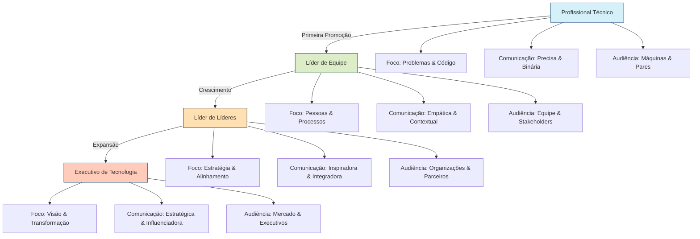
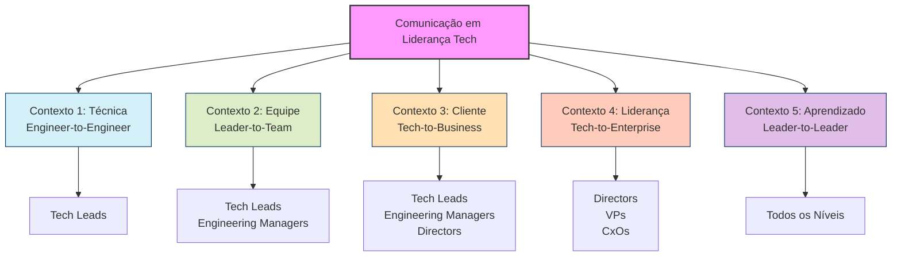
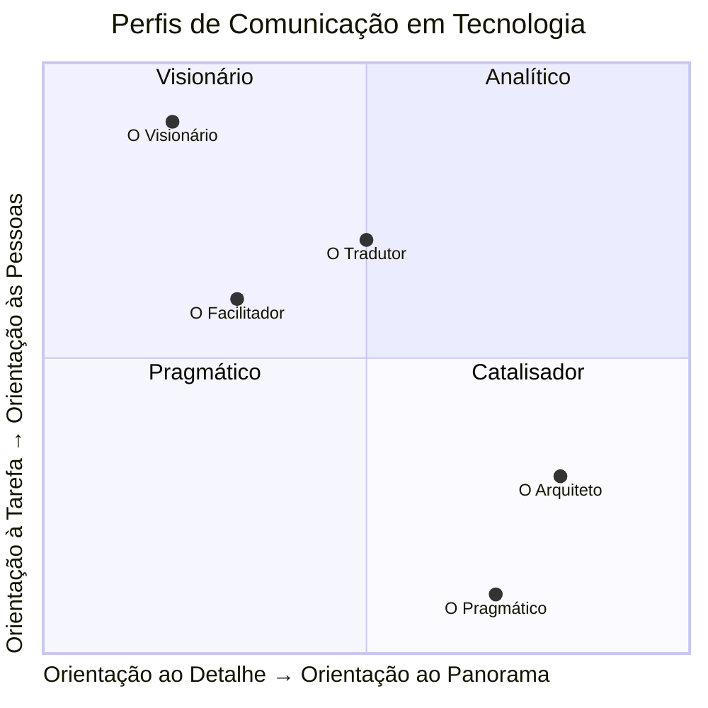
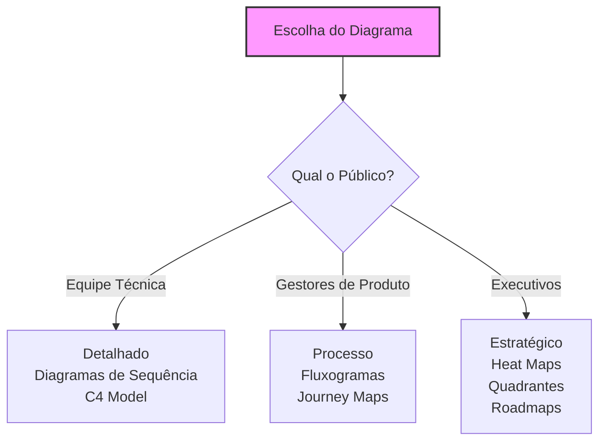
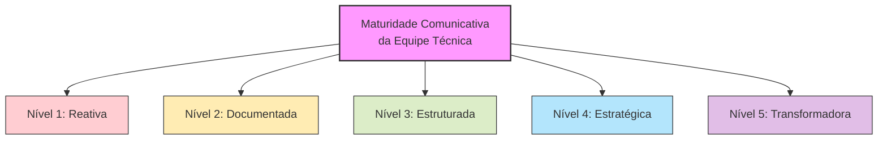

# A Arte (e a Ciência) da Comunicação Eficaz na Liderança em Tecnologia

![[4eb6db23f5ed648879ec043c047f1ffc_MD5.svg]]

> _"A forma como você reúne, gerencia e usa a informação determinará se você vence ou perde."_ — Bill Gates
> 
> _"A comunicação não é sobre dizer o que você pensa. É sobre garantir que o outro entenda o que você quer dizer."_ — Simon Sinek

## 🔍 Índice

- [A Arte (e a Ciência) da Comunicação Eficaz na Liderança em Tecnologia](https://claude.ai/chat/2cb2ff43-829c-4ab4-84c5-304538705264#a-arte-e-a-ci%C3%AAncia-da-comunica%C3%A7%C3%A3o-eficaz-na-lideran%C3%A7a-em-tecnologia)
    - [🔍 Índice](https://claude.ai/chat/2cb2ff43-829c-4ab4-84c5-304538705264#-%C3%ADndice)
    - [🎯 Por que a comunicação é o desafio oculto em Tecnologia?](https://claude.ai/chat/2cb2ff43-829c-4ab4-84c5-304538705264#-por-que-a-comunica%C3%A7%C3%A3o-%C3%A9-o-desafio-oculto-em-tecnologia)
    - [🧠 O Paradoxo da Liderança em Tech](https://claude.ai/chat/2cb2ff43-829c-4ab4-84c5-304538705264#-o-paradoxo-da-lideran%C3%A7a-em-tech)
    - [🔄 Framework: Os 5 Contextos de Comunicação em Tecnologia](https://claude.ai/chat/2cb2ff43-829c-4ab4-84c5-304538705264#-framework-os-5-contextos-de-comunica%C3%A7%C3%A3o-em-tecnologia)
        - [Contexto 1: Comunicação Técnica (Engineer-to-Engineer)](https://claude.ai/chat/2cb2ff43-829c-4ab4-84c5-304538705264#contexto-1-comunica%C3%A7%C3%A3o-t%C3%A9cnica-engineer-to-engineer)
        - [Contexto 2: Comunicação de Liderança (Leader-to-Team)](https://claude.ai/chat/2cb2ff43-829c-4ab4-84c5-304538705264#contexto-2-comunica%C3%A7%C3%A3o-de-lideran%C3%A7a-leader-to-team)
        - [Contexto 3: Comunicação Stakeholder (Tech-to-Business)](https://claude.ai/chat/2cb2ff43-829c-4ab4-84c5-304538705264#contexto-3-comunica%C3%A7%C3%A3o-stakeholder-tech-to-business)
        - [Contexto 4: Comunicação Estratégica (Tech-to-Enterprise)](https://claude.ai/chat/2cb2ff43-829c-4ab4-84c5-304538705264#contexto-4-comunica%C3%A7%C3%A3o-estrat%C3%A9gica-tech-to-enterprise)
        - [Contexto 5: Comunicação Executiva (Leader-to-Leader)](https://claude.ai/chat/2cb2ff43-829c-4ab4-84c5-304538705264#contexto-5-comunica%C3%A7%C3%A3o-executiva-leader-to-leader)
    - [⚡ Perfis de Comunicação: Descubra o Seu](https://claude.ai/chat/2cb2ff43-829c-4ab4-84c5-304538705264#-perfis-de-comunica%C3%A7%C3%A3o-descubra-o-seu)
    - [🛠️ Técnicas Práticas para Cada Contexto](https://claude.ai/chat/2cb2ff43-829c-4ab4-84c5-304538705264#%EF%B8%8F-t%C3%A9cnicas-pr%C3%A1ticas-para-cada-contexto)
        - [1. Design Docs e RFCs: A Base da Comunicação Técnica](https://claude.ai/chat/2cb2ff43-829c-4ab4-84c5-304538705264#1-design-docs-e-rfcs-a-base-da-comunica%C3%A7%C3%A3o-t%C3%A9cnica)
        - [2. One-on-Ones Transformadores](https://claude.ai/chat/2cb2ff43-829c-4ab4-84c5-304538705264#2-one-on-ones-transformadores)
        - [3. Descomplicando o Técnico: A Arte do Storytelling para Stakeholders](https://claude.ai/chat/2cb2ff43-829c-4ab4-84c5-304538705264#3-descomplicando-o-t%C3%A9cnico-a-arte-do-storytelling-para-stakeholders)
        - [4. Comunicação Visual: Quando um Diagrama Vale Mais que Mil Palavras](https://claude.ai/chat/2cb2ff43-829c-4ab4-84c5-304538705264#4-comunica%C3%A7%C3%A3o-visual-quando-um-diagrama-vale-mais-que-mil-palavras)
        - [5. Feedback: A Ferramenta Mais Poderosa (e Subutilizada)](https://claude.ai/chat/2cb2ff43-829c-4ab4-84c5-304538705264#5-feedback-a-ferramenta-mais-poderosa-e-subutilizada)
    - [🚫 Anti-padrões: Como os Líderes Técnicos Destroem a Comunicação (Sem Perceber)](https://claude.ai/chat/2cb2ff43-829c-4ab4-84c5-304538705264#-anti-padr%C3%B5es-como-os-l%C3%ADderes-t%C3%A9cnicos-destroem-a-comunica%C3%A7%C3%A3o-sem-perceber)
    - [🧪 Laboratório Prático: Experimentos de Comunicação para Sua Equipe](https://claude.ai/chat/2cb2ff43-829c-4ab4-84c5-304538705264#-laborat%C3%B3rio-pr%C3%A1tico-experimentos-de-comunica%C3%A7%C3%A3o-para-sua-equipe)
    - [📊 Medindo a Eficácia da Comunicação](https://claude.ai/chat/2cb2ff43-829c-4ab4-84c5-304538705264#-medindo-a-efic%C3%A1cia-da-comunica%C3%A7%C3%A3o)
    - [📝 Conclusão: Comunicação como Superpoder Técnico](https://claude.ai/chat/2cb2ff43-829c-4ab4-84c5-304538705264#-conclus%C3%A3o-comunica%C3%A7%C3%A3o-como-superpoder-t%C3%A9cnico)

## 🎯 Por que a comunicação é o desafio oculto em Tecnologia?

Vejamos a realidade. Se você atua em tecnologia — seja como líder de equipe, gerente de engenharia, CTO ou qualquer função de liderança tech — já enfrentou o abismo da comunicação. Aquela apresentação técnica perfeita que resultou em olhares confusos. A frustração de traduzir uma visão arquitetural para stakeholders não-técnicos. A dificuldade de alinhar equipes distribuídas sobre prioridades ou débito técnico.

> "Todo problema de tecnologia, no final das contas, é um problema de comunicação." — Camille Fournier

A comunicação não é um "soft skill" opcional ou secundário em tecnologia — ela é **o sistema operacional** sobre o qual todo o valor técnico é construído, compartilhado e multiplicado.

Mary Poppendieck, pioneira do Lean Software Development, observa que "a habilidade mais valiosa que um líder de tecnologia pode desenvolver é a capacidade de estabelecer uma comunicação eficaz através de fronteiras organizacionais."

Alguns dados para dimensionar o problema:

- Líderes em tecnologia gastam entre 50-80% de seu tempo em atividades comunicativas (reuniões, emails, documentação, coaching)
- 68% dos problemas em projetos de tecnologia são atribuídos a falhas de comunicação (Standish Group)
- A produtividade de equipes técnicas com comunicação eficaz é, em média, 25% maior (McKinsey)

Como expressa Gregor Hohpe, autor de "The Software Architect Elevator": "A arquitetura mais elegante do mundo não tem valor se você não conseguir comunicá-la às pessoas que precisam implementá-la."

## 🧠 O Paradoxo da Liderança em Tech

Existe um fascinante paradoxo na jornada de liderança em tecnologia, que se intensifica à medida que você sobe na hierarquia:

Este é o grande paradoxo: **As habilidades comunicativas que garantiram seu sucesso em cada nível podem se tornar suas maiores limitações no próximo nível.**

Como observa Patrick Lencioni em "The Advantage": "A maioria dos líderes técnicos é promovida por sua capacidade de resolver problemas, não por sua capacidade de criar clareza — e então ficamos surpresos quando eles lutam para comunicar visão e direção."

Michael Lopp (Rands) expressa esse paradoxo em "Managing Humans" quando diz: "A ironia é que quanto mais alto você sobe na hierarquia de tecnologia, menos você usa o conjunto de habilidades técnicas que o levou lá em primeiro lugar."

## 🔄 Framework: Os 5 Contextos de Comunicação em Tecnologia

Um líder eficaz em tecnologia, independente do seu nível, precisa dominar diferentes contextos de comunicação. O modelo TECLA (Técnica, Equipe, Cliente, Liderança e Aprendizado) mapeia esse território:

Como enfatiza Satya Nadella: "Sua capacidade de mover-se entre estes contextos, adaptando mensagem e abordagem, é o que diferencia líderes verdadeiramente impactantes em tecnologia."

### Contexto 1: Comunicação Técnica (Engineer-to-Engineer)

Este é o alicerce da comunicação em tecnologia, crucial para todos os níveis, mas especialmente para tech leads. Envolve a troca de informações técnicas complexas com precisão e clareza.

**Desafio principal:** Equilibrar profundidade técnica com clareza e acessibilidade.

**Dilema comum:** Como Martin Fowler observa em "Patterns of Enterprise Application Architecture": "Qualquer tolo pode escrever código que um computador entende. Bons programadores escrevem código que humanos entendem."

**Situações típicas:**

- Revisões de código e arquitetura
- Documentação técnica e RFCs
- Discussões sobre decisões de implementação
- Sessões de debugging colaborativo
- Wikis e repositórios de conhecimento técnico

**Técnicas de alto impacto:**

- **Documentação como código:** Trate documentação com o mesmo rigor que código, incluindo revisões e refatorações regulares
- **Princípio do telescópio:** Estruture explicações do geral para o específico, permitindo diferentes níveis de aprofundamento
- **Metáforas técnicas:** Use analogias consistentes para conceitos arquiteturais complexos
- **Visualização de dados e fluxos:** Transforme conceitos abstratos em representações visuais

### Contexto 2: Comunicação de Liderança (Leader-to-Team)

Este contexto é crucial para tech leads e engineering managers, sendo o terreno onde a liderança ganha vida através das palavras e ações diárias.

**Desafio principal:** Criar clareza, alinhamento e motivação sem microgerenciamento.

**Dilema comum:** Como observou Andy Grove, ex-CEO da Intel, em "High Output Management": "A tentação é dizer às pessoas exatamente o que fazer, mas isso mata a iniciativa. A arte está em ser claro sobre o 'o quê' e o 'porquê', mas flexível sobre o 'como'."

**Situações típicas:**

- One-on-ones e reuniões de equipe
- Definição de expectativas e padrões técnicos
- Feedback de performance e coaching
- Resolução de conflitos técnicos ou interpessoais
- Comunicação de mudanças organizacionais

**Técnicas de alto impacto:**

- **Comunicação em camadas:** Comunique nos níveis de "Por quê" (propósito), "O quê" (objetivos) e só então "Como" (implementação)
- **Feedforward vs. Feedback:** Concentre-se no futuro e não apenas no passado (como sugerido por Marshall Goldsmith)
- **Comunicação situacional:** Adapte seu estilo entre direcionador, coach, suporte ou delegação conforme a maturidade do liderado e contexto
- **Perguntas poderosas:** Use perguntas que promovam reflexão e descoberta ao invés de simplesmente fornecer respostas

### Contexto 3: Comunicação Stakeholder (Tech-to-Business)

Este contexto é a interface crítica entre tecnologia e negócios, essencial para tech leads, engineering managers e diretores de tecnologia.

**Desafio principal:** Traduzir complexidade técnica em valor de negócio tangível sem perder nuances importantes.

**Dilema comum:** Marty Cagan, em "Inspired", destaca: "Se você não consegue explicar como uma decisão técnica impacta os resultados de negócio, você não está realmente liderando — está apenas gerenciando atividades técnicas."

**Situações típicas:**

- Apresentações para PMs e executivos de produto
- Negociações de escopo e trade-offs técnicos
- Justificativas para investimentos em infraestrutura
- Reports de progresso e roadmaps
- Gestão de expectativas sobre débito técnico

**Técnicas de alto impacto:**

- **Framework WIIFT (What's In It For Them):** Estruture toda comunicação a partir do que importa para seu interlocutor
- **Storytelling com dados:** Use narrativas que conectem métricas técnicas a impactos de negócio tangíveis
- **Visualização de trade-offs:** Apresente decisões técnicas como escolhas conscientes com pros/contras claros
- **Princípio da pirâmide invertida:** Comece com a conclusão/impacto e só depois forneça os detalhes técnicos que a suportam

### Contexto 4: Comunicação Estratégica (Tech-to-Enterprise)

Este contexto é vital para diretores, VPs e C-level em tecnologia, focando na comunicação que conecta tecnologia à estratégia organizacional mais ampla.

**Desafio principal:** Posicionar tecnologia como capacitador estratégico em vez de centro de custo ou área de suporte.

**Dilema comum:** Como Gene Kim observa em "The Phoenix Project": "Tecnologia não é mais um departamento à parte — é o núcleo de como toda empresa moderna compete e ganha."

**Situações típicas:**

- Apresentações para liderança executiva
- Planejamento estratégico e orçamentário
- Comunicação de transformações tecnológicas
- Alinhamento de roadmaps técnicos com objetivos corporativos
- Narrativas sobre inovação e vantagens competitivas

**Técnicas de alto impacto:**

- **Modelo OAS (Objetivo, Alternativas, Seleção):** Estruture discussões estratégicas demonstrando consideração deliberada de alternativas
- **Storytelling estratégico:** Crie narrativas que conectem capacidades tecnológicas a resultados de negócio de longo prazo
- **Comunicação baseada em riscos:** Apresente opções técnicas em termos de exposição a riscos e oportunidades estratégicas
- **Uso estratégico de dados externos:** Incorpore benchmarks de mercado e tendências para contextualizar propostas técnicas

### Contexto 5: Comunicação Executiva (Leader-to-Leader)

Este contexto, frequentemente negligenciado, envolve a comunicação entre líderes de tecnologia, seja dentro da mesma organização ou como parte de comunidades profissionais mais amplas.

**Desafio principal:** Equilibrar vulnerabilidade autêntica com autoridade e credibilidade.

**Dilema comum:** Como observou Brené Brown: "A vulnerabilidade é a linguagem da liderança, mas precisa ser autêntica e estratégica para ser eficaz."

**Situações típicas:**

- Mentoria e coaching de outros líderes
- Comunidades de prática e fóruns de liderança
- Gestão de relacionamentos com pares executivos
- Comunicação lateral em estruturas matriciais
- Resolução de conflitos entre departamentos técnicos

**Técnicas de alto impacto:**

- **Comunicação baseada em princípios:** Articule os princípios por trás de decisões, não apenas as decisões em si
- **Narrativas de aprendizado:** Compartilhe histórias de fracassos e aprendizados de maneira construtiva
- **Criação de espaços seguros:** Estabeleça protocolos de comunicação que permitam discussões francas sobre desafios
- **Facilitação estratégica:** Guie conversas complexas entre líderes para convergência produtiva

## ⚡ Perfis de Comunicação em Tecnologia: Uma Tipologia

Líderes em tecnologia tendem a desenvolver estilos de comunicação distintos. Identificar seu perfil dominante ajuda a compreender suas forças naturais e áreas de desenvolvimento deliberado.

|Perfil|Características|Superpoderes|Pontos Cegos|Exemplos Notáveis|
|---|---|---|---|---|
|**O Arquiteto**|Comunicação estruturada, sistemática e lógica|Clareza técnica, documentação excepcional, precisão|Pode sobrecarregar com detalhes, dificuldade com nuances emocionais|Linus Torvalds, Guido van Rossum|
|**O Tradutor**|Fluente em múltiplos "idiomas", adaptável|Tradução técnica-negócio, comunicação intercultural, construção de pontes|Pode perder profundidade técnica, tende a evitar confrontos necessários|Satya Nadella, Marissa Mayer|
|**O Visionário**|Inspirador, conceitual, orientado ao futuro|Comunicação de visão, mobilização de equipes, inovação narrativa|Pode faltar praticidade, impaciência com detalhes operacionais|Steve Jobs, Marc Andreessen|
|**O Pragmático**|Direto, conciso, orientado a resultados|Clareza em expectativas, eficiência, foco em deliverables|Pode parecer brusco, negligencia aspectos relacionais|Jeff Bezos, Larry Ellison|
|**O Facilitador**|Empático, colaborativo, focado em consenso|Resolução de conflitos, criação de ambientes seguros, desenvolvimento de equipes|Pode prolongar decisões buscando alinhamento excessivo|Sundar Pichai, Melinda Gates|

**Auto-diagnóstico rápido:** Pense na última vez que você teve que explicar uma decisão técnica complexa. Você:

1. Criou um documento detalhado com todas as opções, prós e contras?
2. Conversou individualmente com as pessoas para entender suas perspectivas?
3. Apresentou uma visão do futuro que a decisão ajudaria a construir?
4. Foi direto ao ponto explicando a decisão e o que todos deveriam fazer?
5. Criou uma sessão educativa explicando os conceitos fundamentais por trás da decisão?

Sua resposta natural revela muito sobre seu perfil de comunicação. O segredo não é mudar seu perfil, mas expandir seu repertório para os contextos onde seu estilo natural não é o mais eficaz.

transformam documentação de uma obrigação tediosa em uma poderosa ferramenta de alinhamento. Veja como:

**O Modelo T-DIG:**

1. **T**ítulo e Objetivo Claro: O que estamos resolvendo e por quê?
2. **D**ecisores Identificados: Quem precisa aprovar ou ser consultado?
3. **I**mpacto Tecnológico e de Negócio: Quais os trade-offs e consequências?
4. **G**uia de Implementação: Como isso será executado concretamente?

**Anti-padrão comum:** O "documento atirado no Confluence" - aquele documento gigante que ninguém lê, cheio de jargões e sem contexto claro.

**Pro-tip:** Inicie seus RFCs com a seção "TL;DR" - 3 frases que capturam a essência para quem tem apenas 30 segundos.

### 2. One-on-Ones Transformadores

One-on-ones eficazes são a ferramenta secreta dos melhores líderes técnicos. Não são apenas check-ins de status - são oportunidades de alinhamento, mentoria e construção de confiança.

**A estrutura 3C para one-on-ones:**

1. **Conexão** (5 min): Estabeleça rapport genuíno, não superficial
2. **Contexto** (15 min): Discuta trabalho atual, desafios, progressos
3. **Crescimento** (10 min): Foque em desenvolvimento de longo prazo

**Anti-padrão comum:** O "Então, como estão as coisas?" vago que leva a respostas igualmente vagas como "Tudo bem".

**Pro-tip:** Termine sempre com "O que eu poderia fazer diferente ou melhor como líder para ajudá-lo(a) no próximo período?"

### 3. Descomplicando o Técnico: A Arte do Storytelling para Stakeholders

Transforme discussões técnicas áridas em narrativas envolventes para stakeholders:

**Framework CEPAR:**

1. **C**ontexto: Qual é a situação atual e por que importa?
2. **E**xplicação: Qual é a solução técnica (simplificada)?
3. **P**aridade: Qual analogia do mundo real torna isso tangível?
4. **A**ção: O que precisamos fazer agora?
5. **R**esultado: Qual o impacto esperado para o negócio?

**Exemplo prático:**

_Versão técnica:_ "Precisamos implementar uma arquitetura de cache distribuído com Redis para resolver problemas de latência."

_Versão CEPAR:_ "Nossos usuários estão esperando 5 segundos para carregar a página principal (Contexto). Podemos implementar um sistema que salva resultados frequentes para acesso rápido (Explicação). É como ter um garçom que memoriza os pedidos mais comuns para não precisar ir até a cozinha toda vez (Paridade). Precisamos investir 2 semanas de um engenheiro para implementar isso (Ação). Isso reduzirá o tempo de carregamento para menos de 1 segundo, diminuindo a taxa de abandono em 15% segundo nossos dados de analytics (Resultado)."

**Anti-padrão comum:** O "despejo técnico" - quando você explica todos os detalhes técnicos sem filtrar o que realmente importa para o interlocutor.

### 4. Comunicação Visual: Quando um Diagrama Vale Mais que Mil Palavras

Um bom diagrama pode transformar completamente a comunicação técnica. A chave é escolher a visualização certa para o contexto.

**Adaptando o diagrama ao público:**

**Tipos de diagramas por finalidade:**

1. **Para arquitetura:** C4 Model, diagramas de componentes
2. **Para fluxos:** Diagramas de sequência, fluxogramas
3. **Para decisões:** Árvores de decisão, quadrantes
4. **Para impacto:** Heat maps, dashboards visuais

**Anti-padrão comum:** O "diagrama de spaghetti" - aquele diagrama tão complexo que confunde mais do que esclarece.

**Pro-tip:** Quando em dúvida, simplifique. Pergunte-se: "Qual é a única mensagem que quero que as pessoas lembrem deste diagrama?"

### 5. Feedback: A Ferramenta Mais Poderosa (e Subutilizada)

O feedback eficaz é a espinha dorsal do desenvolvimento técnico, mas muitos líderes o evitam ou o fazem de forma contraproducente.

**O modelo SCI para feedback técnico:**

1. **S**ituação: Descreva o contexto específico (quando, onde, o quê)
2. **C**omportamento: Foque nas ações observáveis, não interpretações
3. **I**mpacto: Explique as consequências concretas (técnicas e humanas)

**Exemplo de feedback técnico eficaz:**

_Fraco:_ "Seu código não é bom o suficiente, precisa refatorar."

_Eficaz:_ "Na PR do módulo de pagamentos ontem (Situação), notei que a função de processamento tinha mais de 200 linhas e misturava múltiplas responsabilidades (Comportamento). Isso dificultou minha revisão e aumenta o risco de bugs quando modificarmos essa parte no futuro (Impacto). Como podemos melhorar a separação de responsabilidades nesse módulo?"

**Anti-padrão comum:** O "feedback sanduíche" forçado (positivo-negativo-positivo) que soa insincero e diluí a mensagem principal.

## 🚫 Anti-padrões: Como os Líderes Técnicos Destroem a Comunicação (Sem Perceber)

|Anti-padrão|Descrição|Exemplo|Alternativa|
|---|---|---|---|
|**O Hoarding de Contexto**|Reter informações críticas "na cabeça"|"Achei que todo mundo já sabia disso"|Documentar decisões e contexto historicamente|
|**A Avalanche Técnica**|Sobrecarregar com detalhes técnicos|Uma apresentação de 50 slides sobre a implementação de um feature simples|Adaptar o nível de detalhe ao público e objetivo|
|**O Assumidor**|Presumir conhecimento ou alinhamento sem verificar|"Então está combinado" (quando nada foi realmente decidido)|Explicitamente verificar entendimento e concordância|
|**O Oráculo Vago**|Comunicar de forma ambígua para evitar conflito|"Talvez possamos considerar melhorar essa parte..." (quando você realmente quer dizer "Isso precisa ser refeito")|Ser claro e específico, especialmente em feedback crítico|
|**O Tradutor Ausente**|Não adaptar mensagens técnicas para públicos não-técnicos|Explicar débito técnico para o CEO usando termos como "acoplamento" e "coesão"|Usar analogias relevantes para o contexto do interlocutor|

## 🧪 Laboratório Prático: Experimentos de Comunicação para Sua Equipe

Transforme sua comunicação técnica através de experimentos práticos:

1. **Demo Day Invertido**: Em vez das tradicionais demos de produto, faça demos de arquitetura onde engenheiros explicam decisões técnicas para não-técnicos.
    
2. **Shadowing de Comunicação**: Engenheiros juniores acompanham líderes em reuniões de alto nível e depois discutem as técnicas de comunicação observadas.
    
3. **Desafio de Explicação em 5 Níveis**: Inspirado no formato da WIRED, desafie sua equipe a explicar um conceito técnico complexo em 5 níveis: para uma criança, para um iniciante, para um graduado, para um especialista e para um CTO.
    
4. **Rodízio de RFC**: Cada membro da equipe deve revisar e fornecer feedback sobre um RFC em um domínio fora de sua especialidade.
    
5. **Documentação como Produto**: Trate documentação interna como um produto, com UX, métricas de engajamento e iterações baseadas em feedback.
    

## 📊 Medindo a Eficácia da Comunicação

Como saber se você está melhorando? Aqui estão algumas métricas e sinais para acompanhar:

**Métricas Quantitativas:**

- Tempo médio de discussão até decisão em PRs e RFCs
- Taxa de retrabalho devido a mal-entendidos
- Score de clareza em feedback anônimo da equipe
- Tempo médio para onboarding de novos membros

**Sinais Qualitativos:**

- Menor frequência de "isso não era o que eu tinha entendido"
- Maior participação em discussões técnicas
- Stakeholders conseguem explicar corretamente as prioridades técnicas
- Equipe técnica entende claramente o "porquê" por trás das decisões

**Heat Map de Maturidade Comunicativa:**

- **Nível 1 (Reativa)**: Comunicação ad-hoc, principalmente em resposta a problemas
- **Nível 2 (Documentada)**: Informações importantes são documentadas, mas sem estrutura consistente
- **Nível 3 (Estruturada)**: Processos e canais definidos para diferentes tipos de comunicação
- **Nível 4 (Estratégica)**: Comunicação alinhada deliberadamente com objetivos estratégicos
- **Nível 5 (Transformadora)**: Comunicação como vantagem competitiva, influenciando decisões organizacionais

## 📝 Conclusão: Comunicação como Superpoder Técnico

A comunicação eficaz não é apenas uma habilidade adicional para líderes técnicos — é o multiplicador que transforma excelência técnica em impacto organizacional. Como resumiu certa vez Alan Kay: "Ponto de vista vale 80 pontos de QI". A comunicação eficaz é o que permite compartilhar esse ponto de vista.

Os melhores líderes técnicos não são apenas aqueles com maior conhecimento técnico, mas os que conseguem:

1. Criar clareza em meio à ambiguidade técnica
2. Construir pontes entre silos organizacionais
3. Traduzir complexidade em ação alinhada
4. Inspirar equipes a superarem desafios técnicos aparentemente impossíveis

Lembre-se: você pode ter a melhor solução técnica do mundo, mas ela só terá impacto se for compreendida, adotada e implementada corretamente. A comunicação é o que transforma grandes ideias em grandes resultados.

E como disse o lendário Gerald Weinberg: "Não importa o que você pense que está comunicando, você não está comunicando isso até verificar."

---

_Este artigo faz parte da série "Superpoderes do Líder Técnico". Para mais conteúdo sobre liderança técnica, siga nosso blog e participe da comunidade de prática de Tech Leadership._

**Sobre o autor:** [Sua bio aqui] é um líder de engenharia com mais de [X] anos de experiência em empresas como [Y e Z]. Apaixonado por construir times de alta performance e por transformar excelência técnica em impacto de negócio.