# 📘 PDI TRANSFORMADOR: O Guia Definitivo para Líderes Técnicos

> _"O desenvolvimento profissional não é um destino, mas uma jornada contínua. Na era da transformação digital acelerada, quem não evolui deliberadamente, involuntariamente retrocede."_

---

## 📋 Sumário

1. [Introdução: A Jornada de Transformação](https://claude.ai/chat/6341fcb9-1eaa-4d92-b448-7c68122bb3ba#introdu%C3%A7%C3%A3o-a-jornada-de-transforma%C3%A7%C3%A3o)
2. [PDI: Muito Além de um Documento](https://claude.ai/chat/6341fcb9-1eaa-4d92-b448-7c68122bb3ba#pdi-muito-al%C3%A9m-de-um-documento)
3. [Autoconhecimento: A Base do Desenvolvimento](https://claude.ai/chat/6341fcb9-1eaa-4d92-b448-7c68122bb3ba#autoconhecimento-a-base-do-desenvolvimento)
4. [O Paradoxo do Líder Técnico](https://claude.ai/chat/6341fcb9-1eaa-4d92-b448-7c68122bb3ba#o-paradoxo-do-l%C3%ADder-t%C3%A9cnico)
5. [Objetivos que Inspiram e Transformam](https://claude.ai/chat/6341fcb9-1eaa-4d92-b448-7c68122bb3ba#objetivos-que-inspiram-e-transformam)
6. [PDI Centrado em Impacto](https://claude.ai/chat/6341fcb9-1eaa-4d92-b448-7c68122bb3ba#pdi-centrado-em-impacto)
7. [Estratégias de Planejamento para Resultados Extraordinários](https://claude.ai/chat/6341fcb9-1eaa-4d92-b448-7c68122bb3ba#estrat%C3%A9gias-de-planejamento-para-resultados-extraordin%C3%A1rios)
8. [Da Teoria à Prática: Implementação Efetiva](https://claude.ai/chat/6341fcb9-1eaa-4d92-b448-7c68122bb3ba#da-teoria-%C3%A0-pr%C3%A1tica-implementa%C3%A7%C3%A3o-efetiva)
9. [Implementação Ágil do PDI](https://claude.ai/chat/6341fcb9-1eaa-4d92-b448-7c68122bb3ba#implementa%C3%A7%C3%A3o-%C3%A1gil-do-pdi)
10. [Mensuração de Progresso: Além dos Números](https://claude.ai/chat/6341fcb9-1eaa-4d92-b448-7c68122bb3ba#mensura%C3%A7%C3%A3o-de-progresso-al%C3%A9m-dos-n%C3%BAmeros)
11. [A Cultura de Feedback Contínuo](https://claude.ai/chat/6341fcb9-1eaa-4d92-b448-7c68122bb3ba#a-cultura-de-feedback-cont%C3%ADnuo)
12. [PDI para Diferentes Momentos de Carreira](https://claude.ai/chat/6341fcb9-1eaa-4d92-b448-7c68122bb3ba#pdi-para-diferentes-momentos-de-carreira)
13. [Neurociência do Aprendizado para PDIs Excepcionais](https://claude.ai/chat/6341fcb9-1eaa-4d92-b448-7c68122bb3ba#neuroci%C3%AAncia-do-aprendizado-para-pdis-excepcionais)
14. [PDI na Era da Fragmentação da Atenção](https://claude.ai/chat/6341fcb9-1eaa-4d92-b448-7c68122bb3ba#pdi-na-era-da-fragmenta%C3%A7%C3%A3o-da-aten%C3%A7%C3%A3o)
15. [O Novo Contexto Tecnológico: Desafios e Oportunidades](https://claude.ai/chat/6341fcb9-1eaa-4d92-b448-7c68122bb3ba#o-novo-contexto-tecnol%C3%B3gico-desafios-e-oportunidades)
16. [Microaprendizado Estratégico](https://claude.ai/chat/6341fcb9-1eaa-4d92-b448-7c68122bb3ba#microaprendizado-estrat%C3%A9gico)
17. [PDI no Ambiente Híbrido/Remoto](https://claude.ai/chat/6341fcb9-1eaa-4d92-b448-7c68122bb3ba#pdi-no-ambiente-h%C3%ADbridoremoto)
18. [Desenvolvimento Imersivo: RV, RA e Simulações](https://claude.ai/chat/6341fcb9-1eaa-4d92-b448-7c68122bb3ba#desenvolvimento-imersivo-rv-ra-e-simula%C3%A7%C3%B5es)
19. [Gamificação e Narrativa no Desenvolvimento Profissional](https://claude.ai/chat/6341fcb9-1eaa-4d92-b448-7c68122bb3ba#gamifica%C3%A7%C3%A3o-e-narrativa-no-desenvolvimento-profissional)
20. [Sinergia entre IA e Desenvolvimento Humano](https://claude.ai/chat/6341fcb9-1eaa-4d92-b448-7c68122bb3ba#sinergia-entre-ia-e-desenvolvimento-humano)
21. [PDI Baseado em Dados: Abordagem Analítica](https://claude.ai/chat/6341fcb9-1eaa-4d92-b448-7c68122bb3ba#pdi-baseado-em-dados-abordagem-anal%C3%ADtica)
22. [Desenvolvimento para Neurodiversidade e Inclusão](https://claude.ai/chat/6341fcb9-1eaa-4d92-b448-7c68122bb3ba#desenvolvimento-para-neurodiversidade-e-inclus%C3%A3o)
23. [Micro-credentials e Aprendizado Modular](https://claude.ai/chat/6341fcb9-1eaa-4d92-b448-7c68122bb3ba#micro-credentials-e-aprendizado-modular)
24. [Comunidades de Prática Potencializadas](https://claude.ai/chat/6341fcb9-1eaa-4d92-b448-7c68122bb3ba#comunidades-de-pr%C3%A1tica-potencializadas)
25. [O Framework ELITE para Líderes Técnicos](https://claude.ai/chat/6341fcb9-1eaa-4d92-b448-7c68122bb3ba#o-framework-elite-para-l%C3%ADderes-t%C3%A9cnicos)
26. [O PDI Integrado: Bem-estar e Performance](https://claude.ai/chat/6341fcb9-1eaa-4d92-b448-7c68122bb3ba#o-pdi-integrado-bem-estar-e-performance)
27. [Biohacking para Performance Cognitiva](https://claude.ai/chat/6341fcb9-1eaa-4d92-b448-7c68122bb3ba#biohacking-para-performance-cognitiva)
28. [PDI para Líderes: Desenvolvendo Pessoas](https://claude.ai/chat/6341fcb9-1eaa-4d92-b448-7c68122bb3ba#pdi-para-l%C3%ADderes-desenvolvendo-pessoas)
29. [Casos de Transformação no Setor Tech](https://claude.ai/chat/6341fcb9-1eaa-4d92-b448-7c68122bb3ba#casos-de-transforma%C3%A7%C3%A3o-no-setor-tech)
30. [O Futuro do Desenvolvimento Profissional](https://claude.ai/chat/6341fcb9-1eaa-4d92-b448-7c68122bb3ba#o-futuro-do-desenvolvimento-profissional)
31. [Ferramentas e Recursos Práticos](https://claude.ai/chat/6341fcb9-1eaa-4d92-b448-7c68122bb3ba#ferramentas-e-recursos-pr%C3%A1ticos)
32. [Autoavaliação e Próximos Passos](https://claude.ai/chat/6341fcb9-1eaa-4d92-b448-7c68122bb3ba#autoavalia%C3%A7%C3%A3o-e-pr%C3%B3ximos-passos)

---

## 🌟 Introdução: A Jornada de Transformação

> "O desenvolvimento pessoal é um processo, não um destino. É a jornada que nos transforma." - Carol Dweck, autora de "Mindset: A Nova Psicologia do Sucesso"

Se existe algo que permanece constante no mundo da tecnologia, é a mudança acelerada. E se você é um líder técnico em 2025, sabe exatamente do que estou falando. Enquanto finalizava este guia, três novas versões de frameworks que usamos diariamente foram lançadas, duas linguagens de programação importantes receberam atualizações significativas, e os modelos de IA avançaram mais um degrau na escada infinita da evolução tecnológica.

Você já se perguntou por que algumas pessoas parecem evoluir constantemente em suas carreiras, enquanto outras, igualmente talentosas, acabam estagnadas? A resposta, na maioria das vezes, está em uma abordagem intencional e estruturada para o desenvolvimento.

Bem-vindo à jornada do PDI Transformador – não apenas um documento, mas uma filosofia que pode revolucionar sua trajetória profissional. Este guia nasceu da minha experiência acompanhando centenas de profissionais em suas jornadas de desenvolvimento, combinando insights práticos com as mais recentes descobertas científicas sobre como realmente evoluímos.

Em um mundo onde as competências necessárias mudam a cada 2-3 anos, como afirma o Fórum Econômico Mundial, possuir um sistema para adquirir novas habilidades deixou de ser uma vantagem para se tornar uma necessidade de sobrevivência. Como diz Josh Bersin, especialista em desenvolvimento de talentos: "Num mundo de mudanças constantes, a capacidade de aprender continuamente é a habilidade mais valiosa que podemos desenvolver."

Neste guia, vamos explorar desde os fundamentos essenciais até as abordagens mais inovadoras e disruptivas para o desenvolvimento profissional. Você encontrará técnicas práticas, frameworks testados e histórias inspiradoras que ajudarão a criar um plano que realmente transforme suas capacidades e perspectivas.

O PDI para líderes técnicos em 2025 precisa ser reimaginado como um sistema operacional vivo, não um documento estático. Precisa funcionar mais como o Linux do que como o Windows 95 — adaptável, atualizável em tempo real, respondendo continuamente às mudanças do ambiente e das necessidades.

Afinal, como podemos planejar nosso desenvolvimento quando as próprias competências que precisaremos em 12 meses podem ainda não existir hoje?

Estou aqui para te guiar nessa jornada, mas lembre-se: seu desenvolvimento é algo profundamente pessoal. Sinta-se à vontade para adaptar, experimentar e descobrir os métodos que mais ressoam com seu contexto único. Afinal, a maior prova de um PDI bem-sucedido não está na perfeição do planejamento, mas na transformação real que ele possibilita.

Vamos começar?

---

## 🚀 PDI: Muito Além de um Documento

### O Que Realmente Define um PDI

Quando falamos de Plano de Desenvolvimento Individual, muitas pessoas imaginam imediatamente uma planilha preenchida uma vez por ano, frequentemente esquecida em alguma pasta digital. Mas um PDI verdadeiramente eficaz transcende essa visão limitada – é um organismo vivo, uma bússola que orienta decisões diárias e uma plataforma para conversas significativas sobre carreira e evolução.

Na sua essência mais poderosa, um PDI é:

- Uma **bússola estratégica** que orienta escolhas profissionais quando você está na encruzilhada de decisões importantes
- Um **contrato de compromisso** consigo mesmo, que reflete seus valores mais profundos e aspirações
- Um **catalisador de diálogos transformadores** sobre carreira e crescimento
- Uma **ferramenta viva** que evolui organicamente conforme você acumula experiências e insights

### A Anatomia de um PDI Transformador

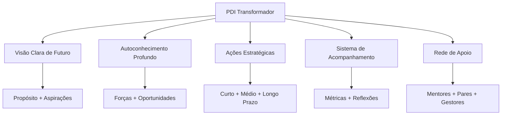

Analisando esse diagrama, percebe-se que um PDI transformador combina elementos de autoconhecimento com visão de futuro, traduzidos em ações concretas e suportados por um sistema eficaz de acompanhamento e uma rede sólida de apoio.

### Por que Muitos PDIs Falham?

Se você já teve a experiência de criar um plano de desenvolvimento que acabou abandonado, não está sozinho. Na minha experiência trabalhando com profissionais de todos os níveis, identifiquei padrões recorrentes que levam planos bem-intencionados ao fracasso:

- **Desconexão emocional**: Objetivos que soam bem no papel mas não ressoam com seus valores e motivações mais profundos
- **Ambição excessiva**: Metas irrealistas que geram frustração e abandono logo nos primeiros obstáculos
- **Isolamento**: Desenvolvimento sem apoio e feedback contínuo, tornando-se uma jornada solitária e desanimadora
- **Rigidez**: Incapacidade de adaptar-se às mudanças inevitáveis de contexto e prioridades
- **Falta de ritmo**: Ausência de rotinas e rituais que mantenham o desenvolvimento vivo no dia a dia
- **Abordagem cascata**: Longos ciclos de planejamento, execução linear e avaliação apenas ao final, sem adaptação contínua

Como diz Kent Beck, "o problema com os planos não é que eles eventualmente falham, mas que nos dão a ilusão de controle". Para superar esses obstáculos, precisamos repensar fundamentalmente como abordamos o desenvolvimento profissional. O PDI que realmente transforma carreiras é aquele que se torna parte integrada da sua vida profissional diária, não apenas um exercício anual obrigatório.

> "Um grande produto começa com um problema real e uma visão clara de como resolvê-lo. Um PDI eficaz segue o mesmo princípio: começa com uma compreensão genuína de suas necessidades e uma visão inspiradora do profissional que você deseja se tornar."

Vamos agora explorar o primeiro e mais fundamental elemento de um PDI excepcional: o autoconhecimento profundo.

---

## 🔍 Autoconhecimento: A Base do Desenvolvimento

### O Tripé do Autoconhecimento Profissional

Já parou para pensar que somos como icebergs? A maior parte do que determina nosso desempenho profissional está abaixo da superfície – nossos valores fundamentais, crenças limitantes, talentos naturais e motivações inconscientes. Daniel Goleman, pioneiro da inteligência emocional, resume bem: "Sem autoconhecimento, ficamos pilotando no escuro".

O desenvolvimento significativo só começa quando temos clareza sobre quem somos de verdade, o que nos move e como impactamos o mundo ao nosso redor. O tripé do autoconhecimento que utilizo com profissionais consiste em:

1. **Clareza sobre valores e propósito** – Viktor Frankl, em seus estudos sobre sentido, descobriu que pessoas com propósito claro demonstram maior resiliência diante de desafios. Quando você conhece seus "porquês", consegue suportar quase qualquer "como".
    
2. **Consciência de pontos fortes e áreas de desenvolvimento** – A psicologia positiva, liderada por Martin Seligman, demonstra consistentemente que focar em potencializar talentos naturais traz resultados superiores a apenas tentar corrigir fraquezas. Como você definiria seus "superpoderes" profissionais?
    
3. **Entendimento do impacto de seu comportamento em diferentes contextos** – Tasha Eurich, pesquisadora de autoconsciência, distingue entre autoconsciência interna (como nos vemos) e externa (como os outros nos percebem). O alinhamento entre essas dimensões é fundamental para a eficácia profissional.
    

### Ferramentas Avançadas de Autodiagnóstico

#### 📊 Matriz SOAR vs. SWOT

A tradicional análise SWOT (Forças, Fraquezas, Oportunidades, Ameaças) deu lugar a uma abordagem mais positiva e orientada ao futuro: a matriz SOAR, desenvolvida por Jacqueline Stavros e Gina Hinrichs.

|SOAR|Foco|Exemplo Prático|
|---|---|---|
|**S**trengths (Forças)|O que você faz excepcionalmente bem|"Minha capacidade de sintetizar dados complexos em narrativas claras"|
|**O**pportunities (Oportunidades)|Possibilidades no ambiente externo|"Crescente demanda por interpretação de dados na minha indústria"|
|**A**spirations (Aspirações)|O que você quer ser e alcançar|"Tornar-me referência em data storytelling em 2 anos"|
|**R**esults (Resultados)|Como o sucesso será mensurado|"Liderar projetos de análise estratégica com impacto mensurável"|

**Exercício Prático: Sua Matriz SOAR**

Reserve 20 minutos agora para completar sua matriz SOAR pessoal. Na minha experiência facilitando este exercício com centenas de executivos, percebo que aqueles que chegam a exemplos concretos (não genéricos) conseguem insights muito mais valiosos.

#### 🔄 O Poder do Feedback Multidimensional

O feedback 360° estruturado, técnica popularizada por Marshall Goldsmith, oferece perspectivas valiosas sobre nossos pontos cegos comportamentais. Para maximizar seu valor:

- **Diversifique as fontes**: Inclua gestores, pares, subordinados e até clientes – cada grupo enxerga facetas diferentes do seu comportamento
    
- **Estruture as perguntas**: Craig Chappelow do Center for Creative Leadership recomenda utilizar questões específicas sobre comportamentos observáveis, não traços de personalidade ("Como esta pessoa lida com situações de conflito?" em vez de "Esta pessoa é paciente?")
    
- **Triangule os dados**: Jim Collins, autor de "Good to Great", sugere buscar padrões mencionados por múltiplas fontes para identificar tendências reais versus opiniões isoladas
    
- **Separe observação de interpretação**: Técnica fundamental da Comunicação Não-Violenta de Marshall Rosenberg, distinguindo "o que aconteceu" de "o que penso sobre o que aconteceu"
    

**Caso Ilustrativo:**

> Marina, gerente de produto que acompanhei, implementou um sistema trimestral de feedback 360° inspirado nas práticas do Google. Descobriu que, embora fosse admirada por sua visão estratégica, sua comunicação era percebida como excessivamente técnica para stakeholders não-técnicos. Este insight a levou a desenvolver métodos de comunicação adaptados a diferentes audiências, resultando em maior alinhamento e engajamento das equipes cross-funcionais.

#### 🧠 Além dos Testes: Autoconhecimento Experiencial

Quantas vezes você já "soube" algo intelectualmente, mas não conseguiu incorporar esse conhecimento em seu comportamento? David Kolb, em sua Teoria da Aprendizagem Experiencial, explica que o verdadeiro autoconhecimento vem da experiência reflexiva:

- **Diário de situações críticas**: Técnica utilizada por líderes como Bill Gates e Oprah Winfrey, registrando detalhadamente situações desafiadoras, suas reações e resultados
    
- **Práticas contemplativas**: Jon Kabat-Zinn demonstrou como a meditação mindfulness desenvolve nossa capacidade de observação imparcial de padrões mentais
    
- **Experimentos comportamentais**: Inspirados na metodologia "Test and Learn" de Eric Ries, teste conscientemente novas abordagens em situações controladas
    
- **Mentoria reversa**: Prática adotada por executivos da General Electric, onde você aprende sobre si mesmo ao orientar outros com perspectivas diferentes
    

### Mapeamento de Competências: Abordagem Sistêmica

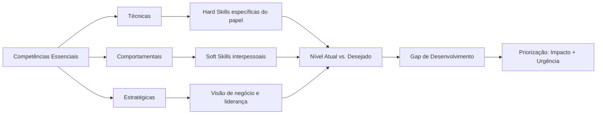

Este mapeamento sistêmico permite visualizar não apenas o estado atual e desejado de suas competências, mas também as interdependências entre diferentes áreas. Como Kent Beck, criador do Extreme Programming e TDD, afirma: "Os melhores desenvolvedores sabem que entender o problema é mais importante que conhecer a solução. No desenvolvimento pessoal, compreender profundamente a si mesmo precede qualquer plano de ação eficaz."

Com um alicerce sólido de autoconhecimento, estamos prontos para explorar um desafio específico que todo líder técnico enfrenta: o paradoxo entre profundidade técnica e amplitude de liderança.

---

## 🔍 O Paradoxo do Líder Técnico

### A Tensão Fundamental

Todo líder técnico eventualmente enfrenta um paradoxo existencial: o mesmo domínio técnico que os elevou à liderança gradualmente se torna insuficiente (e às vezes até obstáculo) para seu sucesso contínuo.

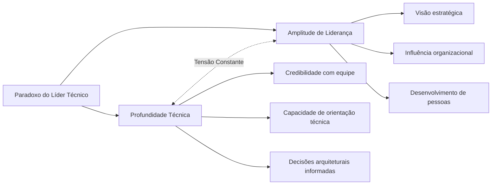

Em seu livro "The Manager's Path", Camille Fournier descreve este dilema: "À medida que você sobe na hierarquia de liderança técnica, sua esfera de influência aumenta, mas sua capacidade de manter-se atualizado em todos os detalhes técnicos diminui inevitavelmente."

### Dados de Carreira Reveladores

Uma análise da trajetória de CIOs e CTOs de empresas da Fortune 500 revela padrões interessantes:

- Os líderes técnicos mais bem-sucedidos mantêm uma proporção de aproximadamente 30/70 entre atividades técnicas hands-on e responsabilidades de liderança mais amplas
    
- 84% dos CTOs de empresas de alto crescimento relatam manter "áreas técnicas de especialidade" específicas, em vez de tentar acompanhar todas as tecnologias
    
- O tempo médio até que um líder técnico experimente sua primeira "crise de obsolescência" (percepção de que suas habilidades técnicas estão desatualizadas) é de 18 meses após assumir um papel de liderança
    

### Resolução via PDI Dicotômico

O PDI eficaz para líderes técnicos deve explicitamente abordar esta tensão, não como problema a ser eliminado, mas como polaridade a ser gerenciada continuamente. Uma abordagem dicotômica reconhece que não existe "equilíbrio perfeito", mas sim movimentos conscientes entre os dois polos quando apropriado.

|Desenvolvimento de Profundidade Técnica|Desenvolvimento de Amplitude de Liderança|
|---|---|
|Área técnica de especialidade escolhida estrategicamente|Meta-habilidades de liderança técnica transferíveis|
|Prática deliberada em contextos controlados|Experiências transformadoras em contextos desafiadores|
|Comunidades externas de prática técnica|Redes internas de influência organizacional|
|Rituais de atualização técnica consistentes|Sistemas para amplificação de impacto via outros|

O engenheiro Zach Lloyd, ex-Google e fundador da Warp, implementa um sistema que ele chama de "T-shape dinâmico":

1. A haste vertical do T (profundidade) muda periodicamente entre diferentes áreas técnicas, mantendo-se profundo em pelo menos uma área relevante
2. A barra horizontal (amplitude) expande-se continuamente à medida que a carreira evolui
3. A escolha da área de profundidade é guiada por uma "heurística de alavancagem": onde o conhecimento técnico profundo gerará o maior impacto multiplicador para a equipe/organização?

> "Não estou tentando ser o melhor programador da equipe. Estou tentando ser um programador bom o suficiente para ter credibilidade técnica, enquanto desenvolvo as habilidades únicas que apenas um líder técnico pode oferecer." - Líder de Engenharia, empresa de pagamentos digitais

Com esta compreensão do paradoxo do líder técnico, podemos agora explorar como definir objetivos que realmente inspirem e transformem nossa trajetória profissional.

---

## 🎯 Objetivos que Inspiram e Transformam

### Além do SMART: Objetivos que Realmente Movem

Quem não conhece o acrônimo SMART (Específicos, Mensuráveis, Atingíveis, Relevantes, Temporais) para definição de objetivos? Esse framework tem seu valor, mas objetivos verdadeiramente transformadores possuem qualidades adicionais que transcendem essa fórmula padrão.

#### 🔥 A Abordagem HARD

Desenvolvida por Mark Murphy, autor de "HARD Goals", esta metodologia complementa a abordagem SMART adicionando dimensões de significado pessoal e desafio:

|Elemento|Descrição|Exemplo|
|---|---|---|
|**H**eartfelt (Significativo)|Conexão emocional profunda|"Este objetivo ressoa com meus valores mais profundos de criatividade e impacto"|
|**A**nimated (Vívido)|Visualização clara e detalhada|"Posso visualizar detalhadamente como será liderar aquela equipe inovadora"|
|**R**equired (Necessário)|Senso de urgência e importância|"Esta transformação é fundamental para onde quero chegar em minha carreira"|
|**D**ifficult (Desafiador)|Esforço que exige crescimento|"Este objetivo me forçará a desenvolver capacidades que ainda não possuo"|

Quando você define objetivos que combinam as qualidades SMART com os elementos HARD, cria metas que não apenas direcionam ações, mas energizam e inspiram. São objetivos que você persegue não porque "deve", mas porque genuinamente "quer".

#### 💫 Objetivos Transformacionais vs. Transacionais

Há uma diferença fundamental entre objetivos que buscam uma transação externa e aqueles que visam uma transformação interna:

|Objetivos Transacionais|Objetivos Transformacionais|
|---|---|
|Foco em métricas externas|Foco em transformação interna|
|"Concluir certificação X"|"Dominar conceitos que mudarão minha perspectiva sobre o mercado"|
|"Obter promoção ao cargo Y"|"Desenvolver liderança que inspira e potencializa a equipe"|
|Orientados a marcos|Orientados a desenvolvimento de mindset|

Os objetivos transacionais têm seu lugar, mas são os transformacionais que realmente impulsionam mudanças profundas e duradouras em sua carreira. Como Teresa Amabile, professora de Harvard, descobriu em sua pesquisa sobre progresso e motivação, o sentimento de desenvolvimento pessoal é um dos maiores impulsionadores da satisfação profissional.

### A Hierarquia de Objetivos: Alinhamento Vertical

Para maximizar impacto e consistência, seus objetivos devem seguir uma hierarquia clara, onde cada nível suporta e alimenta o próximo:

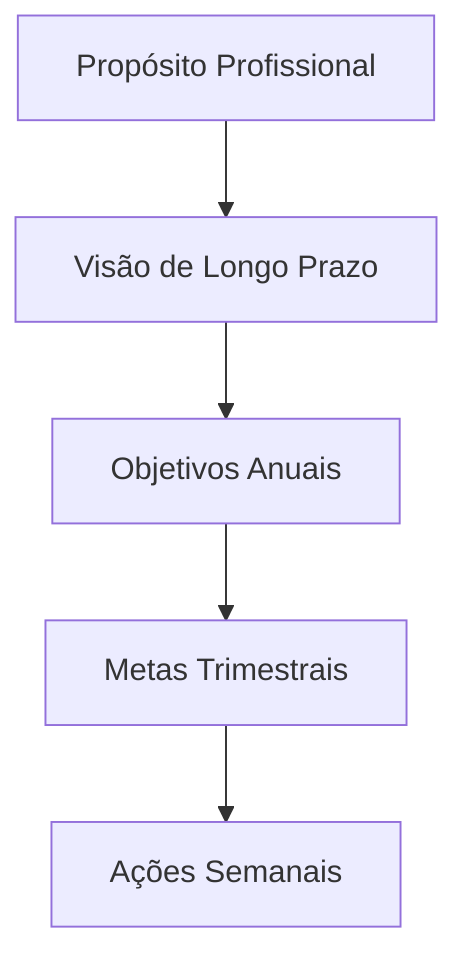

**Exercício de Alinhamento:**

1. Defina seu propósito profissional em uma frase clara e inspiradora
2. Visualize onde quer estar em 3-5 anos (sendo específico sobre funções, realizações, impacto)
3. Estabeleça 2-3 objetivos anuais que contribuam diretamente para essa visão
4. Decomponha cada objetivo anual em metas trimestrais tangíveis
5. Traduza a meta trimestral atual em ações semanais concretas

Quando seus objetivos estão verdadeiramente alinhados dessa forma, até mesmo as pequenas ações diárias ganham significado maior, conectando-se a seu propósito mais amplo. Como o arquiteto Bjarke Ingels diz: "O poder está em poder traçar uma linha direta entre o que você faz diariamente e a diferença que você quer fazer no mundo."

### O Poder dos Anti-Objetivos

Tão importante quanto definir o que queremos alcançar é clarificar o que deliberadamente escolhemos NÃO fazer. Anti-objetivos são declarações explícitas do que você está disposto a deixar de lado para focar no que realmente importa.

**Exemplo:**

|Objetivo|Anti-Objetivo|
|---|---|
|Desenvolver liderança estratégica|NÃO buscarei dominar todos os detalhes técnicos|
|Aprofundar expertise em área específica|NÃO tentarei abraçar múltiplos domínios simultaneamente|
|Construir relações significativas|NÃO focarei em expandir rede de contatos quantitativamente|

Como Greg McKeown, autor de "Essencialismo", enfatiza: "Se não priorizamos nossa vida, alguém fará isso por nós." Os anti-objetivos tornam explícitas suas escolhas de priorização, protegendo seu foco e energia do que não está alinhado com sua visão maior.

> "As melhores visões de produto não apenas definem o que incluir, mas fazem escolhas corajosas sobre o que deixar de fora. Da mesma forma, um PDI excepcional requer foco e renúncias estratégicas."

Com objetivos claros e inspiradores estabelecidos, vamos aprofundar na abordagem centrada em impacto, que revoluciona a forma como pensamos sobre desenvolvimento profissional.

---

## 🎯 PDI Centrado em Impacto

### Do "Desenvolvimento pelo Desenvolvimento" ao "Desenvolvimento por Impacto"

Um erro comum nos PDIs para líderes técnicos é o foco em desenvolvimento de habilidades como um fim em si mesmo. Uma abordagem mais poderosa é começar pelo impacto desejado e trabalhar retroativamente para identificar as competências necessárias.

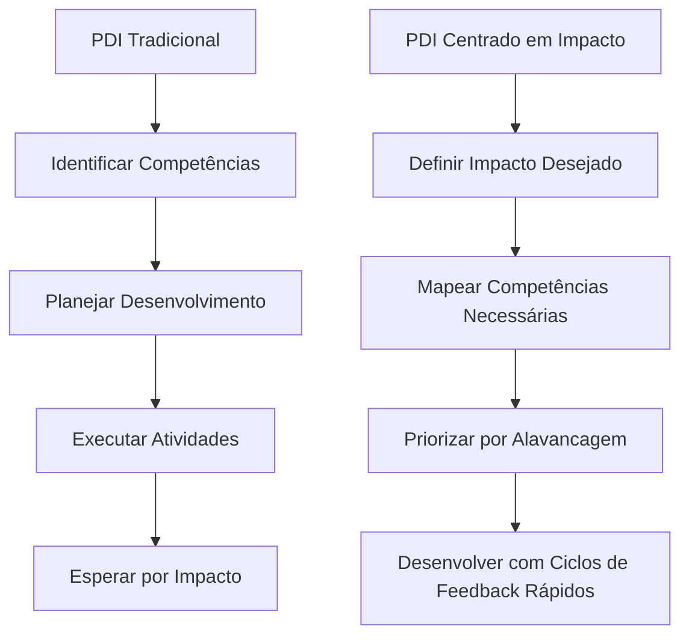

### O Framework de Impacto em Camadas

Líderes técnicos operam em múltiplas camadas de impacto simultaneamente. Um PDI eficaz deve abordar todas essas dimensões:

|Camada de Impacto|Descrição|Exemplo de Objetivo|Competências Relacionadas|
|---|---|---|---|
|**Organizacional**|Contribuição para direção e resultados da empresa|Reduzir time-to-market em 40% através de transformação na plataforma de desenvolvimento|Visão técnica, influência, alinhamento negócio-tecnologia|
|**Ecossistema Técnico**|Melhoria na arquitetura, práticas e capacidades técnicas|Estabelecer arquitetura modular que permita times autonomamente entregarem recursos sem dependências|Modelagem de domínio, design de sistemas, governança técnica|
|**Equipe**|Amplificação das capacidades coletivas|Desenvolver capacidade da equipe para resolução autônoma de incidentes de produção|Coaching técnico, design de sistemas de aprendizado, feedback eficaz|
|**Individual**|Contribuições técnicas diretas|Implementar sistema de feature flags que reduza risco de releases em 60%|Competências técnicas específicas, execução pragmática|

### O Impacto como Bússola para Priorização

Com demandas infinitas competindo por tempo finito, líderes técnicos precisam de mecanismos claros para priorizar seu desenvolvimento. O "Quociente de Alavancagem de Impacto" (QAI) oferece uma abordagem quantitativa:

**QAI = (Impacto Potencial × Probabilidade de Sucesso) ÷ (Tempo de Desenvolvimento × Complexidade)**

Por exemplo, considere duas opções de desenvolvimento:

1. **Aprofundar conhecimento em Kubernetes**:
    
    - Impacto Potencial: 7/10 (beneficiará principalmente decisões de infraestrutura)
    - Probabilidade de Sucesso: 9/10 (altamente factível dadas experiências anteriores)
    - Tempo: 6/10 (requer investimento substancial)
    - Complexidade: 7/10 (conceitos avançados desafiadores)
    - QAI = (7×9)÷(6×7) = 1.5
2. **Desenvolver habilidade de facilitar decisões técnicas complexas**:
    
    - Impacto Potencial: 9/10 (afeta todas as iniciativas importantes)
    - Probabilidade de Sucesso: 7/10 (desafiador mas viável)
    - Tempo: 4/10 (pode ser desenvolvido incrementalmente)
    - Complexidade: 6/10 (envolve aspectos técnicos e interpessoais)
    - QAI = (9×7)÷(4×6) = 2.63

Neste exemplo, a segunda opção oferece quase o dobro de retorno esperado sobre o investimento de desenvolvimento, apesar de à primeira vista poder parecer menos "técnica".

> "Os melhores líderes técnicos que conheço são obcecados com impacto, não com tecnologia. A tecnologia é apenas o meio, não o fim." - CTO, empresa de cybersegurança

Com essa perspectiva centrada em impacto, podemos agora abordar estratégias eficazes de planejamento que transformam intenções em resultados.

---

## 🧩 Estratégias de Planejamento para Resultados Extraordinários

### Modelos Integrados de Desenvolvimento

#### 📋 O Framework CEP+R Aprofundado

O modelo CEP+R (Conteúdo, Experiência, Pessoas e Redes) oferece uma abordagem holística para desenvolvimento profissional, reconhecendo que o aprendizado efetivo acontece através de múltiplos canais:

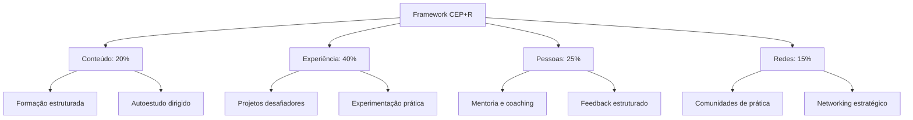

**Exemplo de Aplicação Prática**

Para o objetivo "Tornar-se um líder de produto centrado no cliente":

|Componente|Proporção|Atividades Específicas|
|---|---|---|
|**Conteúdo**|20%|• Curso "Product Leadership" na universidade corporativa<br>• Leitura de 1 livro mensal sobre design thinking e comportamento do cliente<br>• Assinatura de newsletters especializadas|
|**Experiência**|40%|• Liderar um projeto de discovery com usuários reais<br>• Implementar sistema de feedback contínuo de clientes<br>• Conduzir 5 entrevistas mensais com usuários|
|**Pessoas**|25%|• Sessões mensais com mentor sênior em UX<br>• Shadowing com líderes de produto em outras equipes<br>• Feedback quinzenal sobre decisões de produto|
|**Redes**|15%|• Participação ativa em comunidade de product managers<br>• Apresentações em meetups internos<br>• Contribuições em fóruns especializados|

Esta abordagem equilibrada reconhece que apenas o estudo formal (Conteúdo) é insuficiente para desenvolvimento profundo. O verdadeiro aprendizado acontece na aplicação prática (Experiência), na interação com mentores e modelos (Pessoas) e na participação em comunidades relevantes (Redes).

#### 🔄 Modelo 70/20/10 Reimaginado

Originalmente desenvolvido pelo Center for Creative Leadership, o modelo 70/20/10 sugere que o desenvolvimento ocorre predominantemente através da experiência prática (70%), seguido por interações sociais (20%) e apenas 10% via educação formal. Esta abordagem clássica pode ser adaptada para o contexto atual de trabalho híbrido e aprendizado contínuo:

|Dimensão|Abordagem Tradicional|Abordagem Contemporânea|
|---|---|---|
|**70%** Experiência|Aprendizado no trabalho diário|Projetos intencionais desafiadores + Experimentação protegida|
|**20%** Social|Feedback informal e observação|Coaching estruturado + Comunidades de prática virtuais|
|**10%** Formal|Cursos e treinamentos presenciais|Microlearning contínuo + Aprendizado adaptativo personalizado|

A versão contemporânea desse modelo enfatiza a intencionalidade e a estrutura. Em vez de simplesmente "aprender fazendo", você desenha experiências específicas que desenvolvem as competências desejadas. O componente social transcende o feedback casual, incorporando relacionamentos de desenvolvimento estruturados. E o aprendizado formal é distribuído em pequenas doses frequentes, em vez de concentrado em eventos isolados.

### Planejamento Sistemático: Além do 5W2H

O framework 5W2H (O quê, Por quê, Onde, Quando, Quem, Como, Quanto) oferece uma base sólida para planejamento, mas pode ser aprimorado com elementos adicionais que aumentam significativamente sua eficácia:

#### 📊 Framework 5W2H+I+R

|Elemento|Questão-chave|Exemplo Aplicado|
|---|---|---|
|**What** (O quê)|O que preciso desenvolver?|Habilidades de facilitação para reuniões complexas e decisões em grupo|
|**Why** (Por quê)|Por que isso é importante?|Para aumentar produtividade e engajamento em decisões críticas do time|
|**Where** (Onde)|Em quais contextos aplicarei?|Reuniões interdepartamentais e workshops de cocriação|
|**When** (Quando)|Qual o cronograma de desenvolvimento?|Próximos 4 meses, com marcos mensais de progresso|
|**Who** (Quem)|Quem pode apoiar este desenvolvimento?|Mentor especialista em facilitação + coach de comunicação|
|**How** (Como)|Quais métodos específicos utilizarei?|Curso de facilitação + prática gradual em contextos reais|
|**How much** (Quanto)|Qual investimento necessário?|5h semanais + R$X em recursos + energia emocional para errar e aprender|
|**Impact** (Impacto)|Qual transformação esperada?|Decisões 30% mais rápidas e aumento em 40% no engajamento das equipes|
|**Risks** (Riscos)|Quais obstáculos devo antecipar?|Resistência inicial das equipes + sobrecarga do calendário|

Os elementos adicionais de Impacto e Riscos são particularmente valiosos: o primeiro clarifica os benefícios esperados, fortalecendo a motivação; o segundo antecipa possíveis obstáculos, permitindo a criação de estratégias preventivas.

> "Assim como o desenvolvimento de software requer sistemas para gerenciar complexidade, o desenvolvimento profissional necessita de frameworks que transformem aspirações abstratas em ações concretas e mensuráveis."

Com estratégias de planejamento bem definidas, o próximo desafio é traduzi-las em implementação consistente e sustentável.

---

## 🛠️ Da Teoria à Prática: Implementação Efetiva

### O Plano de Implementação Estruturado

Um PDI excepcional precisa de um sistema de implementação igualmente robusto. Como diz o especialista em hábitos James Clear: "Você não cresce até o nível das suas metas; você cai para o nível dos seus sistemas."

#### 🗓️ Ritmos de Execução e Revisão

Estabeleça ciclos definidos para diferentes níveis de atividades:

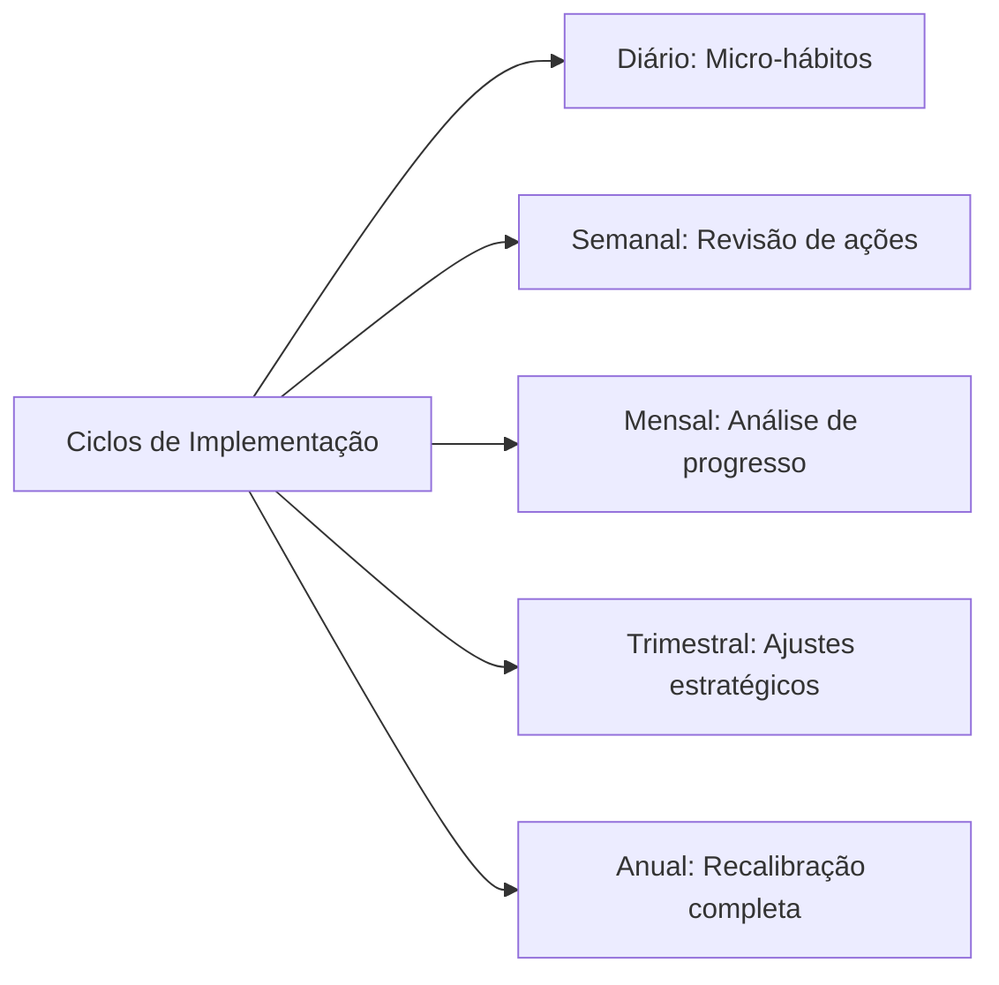

**Sistema de Implementação Diária:**

1. **Ritual matinal** (5-10 min): Reserve um momento no início do dia para revisar suas prioridades de desenvolvimento, conectando-as às atividades planejadas
    
2. **Blocos protegidos** (30-90 min): Defina períodos específicos em seu calendário exclusivamente dedicados a atividades de desenvolvimento, tratando-os com o mesmo respeito que reuniões importantes
    
3. **Micro-momentos** (5-10 min): Identifique pequenas oportunidades ao longo do dia para prática deliberada de novas habilidades
    
4. **Reflexão noturna** (5-10 min): Dedique alguns minutos no final do dia para registrar aprendizados e planejar ações de desenvolvimento para o dia seguinte
    

#### 📈 Exemplo de Plano de Implementação Detalhado

Para o objetivo "Desenvolver competências avançadas em storytelling com dados":

|Horizonte|Atividades de Desenvolvimento|Sistema de Acompanhamento|
|---|---|---|
|**Diário**|• 15 min de estudo de visualizações exemplares<br>• Aplicação consciente em pelo menos 1 comunicação|Checklist diário com registro de insights|
|**Semanal**|• 1 hora dedicada a curso online<br>• Análise crítica de 1 dashboard ou apresentação|Revisão de progresso com par de accountability|
|**Mensal**|• Criação de 1 visualização complexa<br>• Sessão de feedback com especialista|Documentação estruturada de evolução com exemplos|
|**Trimestral**|• Projeto aplicado com stakeholders reais<br>• Avaliação formal de competência|Retrospectiva detalhada com mentor|

O poder deste sistema está em criar múltiplos ciclos de feedback, permitindo ajustes frequentes e celebrações de pequenas vitórias ao longo do percurso.

### Sistemas de Hábitos para Desenvolvimento Sustentável

O desenvolvimento contínuo depende fundamentalmente da formação de hábitos consistentes, não apenas de ações pontuais.

#### 🔄 O Loop de Hábitos Profissionais

Charles Duhigg, autor de "O Poder do Hábito", popularizou o modelo do loop de hábitos, que pode ser adaptado para desenvolvimento profissional:

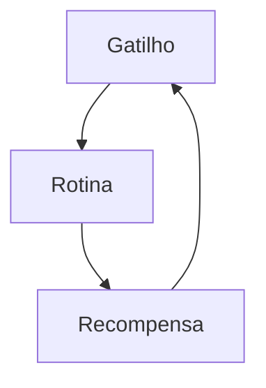

**Aplicação Prática:**

|Componente|Descrição|Exemplo para "Desenvolver Escuta Ativa"|
|---|---|---|
|**Gatilho**|Sinal que inicia o comportamento|Início de cada reunião ou conversa 1:1|
|**Rotina**|Comportamento a ser desenvolvido|Protocolo estruturado: (1) Contato visual, (2) Perguntas abertas, (3) Paráfrase para confirmação|
|**Recompensa**|Benefício imediato percebido|Auto-reconhecimento + registro de insight valioso obtido|

A chave para criar hábitos duradouros é tornar os gatilhos óbvios, as rotinas atrativas e as recompensas satisfatórias. Com o tempo, o que antes exigia esforço consciente torna-se automático, liberando capacidade mental para novos desafios.

#### 🏗️ Scaffolding: Suporte Progressivo para Novos Comportamentos

Inspirado no conceito educacional de "andaimes", o scaffolding para desenvolvimento profissional envolve criar sistemas de suporte que podem ser gradualmente removidos à medida que a competência aumenta:

1. **Suporte máximo**: No início, use checklists detalhados e busque acompanhamento direto de mentores para cada aplicação da nova habilidade
    
2. **Suporte moderado**: À medida que ganha confiança, passe a utilizar lembretes estratégicos e revisão periódica
    
3. **Suporte mínimo**: Posteriormente, implemente gatilhos ambientais sutis que mantêm a consciência da habilidade
    
4. **Autonomia**: Finalmente, o comportamento se integra ao seu modo natural de operação, não exigindo suporte externo
    

Esta abordagem gradual reconhece que o desenvolvimento de novas competências raramente acontece de uma vez. Como observa a especialista em aprendizado adulto Ellen Langer: "A maioria das pessoas precisa de estrutura para desenvolver autonomia."

> "O melhor código é aquele que funciona não apenas no ambiente de desenvolvimento, mas no mundo real, sob condições variáveis. Da mesma forma, o melhor PDI é aquele que sobrevive ao contato com a realidade caótica do dia a dia profissional."

Agora que temos estruturas de implementação robustas, vamos explorar como adotar uma abordagem mais ágil para nosso desenvolvimento.

---

## 🚀 Implementação Ágil do PDI

### Da Abordagem Cascata ao PDI Ágil

A implementação tradicional de PDIs segue frequentemente um modelo "cascata": longos ciclos de planejamento, execução linear e avaliação apenas ao final. Esta abordagem torna-se cada vez mais inadequada em um ambiente caracterizado por rápida mudança e alta incerteza.

A implementação ágil do PDI aplica princípios do desenvolvimento ágil ao próprio desenvolvimento profissional:

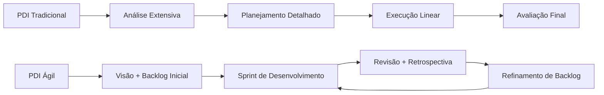

### Estruturas Flexíveis para Desenvolvimento Adaptável

#### O Framework Scrum PDI

Adaptado do Scrum para desenvolvimento de software, este framework oferece estrutura sem rigidez excessiva:

|Elemento|Descrição|Benefício|
|---|---|---|
|**Backlog de Desenvolvimento**|Lista priorizada e evolutiva de competências, experiências e resultados desejados|Visibilidade clara de prioridades com flexibilidade para adaptação contínua|
|**Sprints de Desenvolvimento**|Ciclos curtos (2-4 semanas) com foco específico|Progresso tangível e feedback frequente|
|**Daily Development**|Micro-check diário (2-3 min) sobre progresso e bloqueios|Consciência contínua e adaptação rápida|
|**Sprint Review**|Avaliação objetiva de resultados ao final de cada sprint|Validação regular de progresso real vs. atividades|
|**Sprint Retrospective**|Reflexão sobre o processo de desenvolvimento em si|Melhoria contínua da própria abordagem ao desenvolvimento|

#### Desenvolvimento Orientado a Experimentos

Inspirado nas metodologias Lean Startup e Design Thinking, esta abordagem enquadra o desenvolvimento profissional como série de experimentos:

1. **Hipótese de Desenvolvimento**: Afirmação testável sobre competência específica e impacto esperado _"Se eu desenvolver capacidade X, então conseguirei resultado Y"_
    
2. **Experimento Mínimo Viável**: Menor intervenção possível para validar a hipótese _"A menor iniciativa que permitirá determinar se esta direção de desenvolvimento é valiosa"_
    
3. **Métricas de Validação**: Indicadores específicos que confirmarão ou refutarão a hipótese _"Como saberei objetivamente se o desenvolvimento está gerando o impacto esperado?"_
    
4. **Ciclo de Ajuste**: Processo estruturado para pivotar ou perseverar com base nos resultados _"Com base nos dados deste experimento, como devo ajustar minha abordagem?"_
    

### Ritmos para Desenvolvimento Sustentável

O PDI ágil implementa um sistema de ritmos aninhados que criam previsibilidade e sustentabilidade:

|Cadência|Foco|Atividade Típica|
|---|---|---|
|**Diária**|Consistência e consciência|3 min de reflexão estruturada sobre atividades de desenvolvimento|
|**Semanal**|Progresso incremental|30 min de revisão de sprint parcial e ajustes táticos|
|**Bi-semanal/Mensal**|Avaliação e adaptação|1-2 horas de revisão completa de sprint e planejamento do próximo ciclo|
|**Trimestral**|Direção estratégica|4 horas de reavaliação de backlog completo e alinhamento estratégico|
|**Anual**|Transformação e visão|1 dia de reflexão profunda e redefinição de visão de longo prazo|

### Estudo de Caso: Sistema de Desenvolvimento Ágil de Eduardo

Eduardo, líder técnico numa empresa de tecnologia financeira, implementou um sistema que ele chama de "PDI Lean-Agile":

**Visão de Produto Pessoal**

Eduardo criou uma "Visão de Produto" para si mesmo como líder técnico, definindo claramente o tipo de impacto que deseja ter e as capacidades que precisará desenvolver, sem prescrever caminhos específicos.

**Backlog de Desenvolvimento**

Mantém um backlog estruturado de competências a desenvolver, organizado em:

- "Épicos" (grandes áreas de desenvolvimento como "Liderança Técnica Distribuída")
- "Features" (competências específicas como "Facilitação de Decisões Arquiteturais em Equipes Remotas")
- "Histórias" (experiências concretas de aprendizado)

**Sprints de Duas Semanas**

Cada sprint tem:

- Tema específico alinhado à visão mais ampla
- 2-3 histórias de desenvolvimento concretas
- Resultados esperados claramente definidos

**Quadro Kanban de Desenvolvimento**

Utiliza um quadro digital com colunas:

- Backlog
- Planejado para Sprint
- Em Progresso
- Aguardando Feedback
- Concluído
- Validado pelo Impacto

**Cerimônias Adaptadas**

- Stand-up pessoal diário (3 min)
- Review semanal com par de accountability (30 min)
- Retrospectiva e planejamento bi-semanal (1 hora)
- Revisão estratégica trimestral com mentor (2 horas)

O resultado mais notável dessa abordagem foi a capacidade de Eduardo de adaptar rapidamente seu desenvolvimento às mudanças organizacionais e tecnológicas, mantendo progresso constante mesmo em períodos de alta turbulência.

> "Passei a ver meu desenvolvimento como um produto que estou construindo, com versões incrementais constantes, não como um plano rígido a ser seguido." - Diretora de Engenharia, empresa de mobilidade

Com uma abordagem ágil para implementação, precisamos agora considerar como medir efetivamente o progresso, indo além de métricas simplistas.

---

## 📊 Mensuração de Progresso: Além dos Números

### Métricas Multidimensionais de Desenvolvimento

A mensuração efetiva de desenvolvimento profissional transcende indicadores simplistas como "completou/não completou" ou avaliações numéricas isoladas.

#### 🎯 Framework de Indicadores Balanceados

|Tipo de Métrica|Descrição|Exemplos|
|---|---|---|
|**Métricas de Esforço**|Quantificam a dedicação ao desenvolvimento|• Horas investidas<br>• Consistência de práticas<br>• Quantidade de iterações|
|**Métricas de Progresso**|Avaliam evolução em competências específicas|• Avaliações estruturadas<br>• Feedback comparativo<br>• Auto-avaliações calibradas|
|**Métricas de Aplicação**|Medem a transferência para contextos reais|• Frequência de aplicação<br>• Qualidade de implementação<br>• Adaptabilidade contextual|
|**Métricas de Resultado**|Avaliam o impacto nos objetivos finais|• KPIs de performance<br>• Feedback de stakeholders<br>• Novas oportunidades geradas|

Este framework multidimensional oferece uma visão muito mais rica e completa do desenvolvimento profissional. As métricas de esforço reconhecem a dedicação, enquanto as métricas de progresso capturam a evolução de competências específicas. As métricas de aplicação monitoram como o aprendizado se transfere para situações reais, e as métricas de resultado medem o impacto tangível.

#### 📉 Curvas de Aprendizado: Expectativas Realistas

O desenvolvimento raramente segue uma progressão linear. Compreender as fases típicas de uma curva de aprendizado permite estabelecer expectativas realistas e implementar estratégias apropriadas para cada momento:

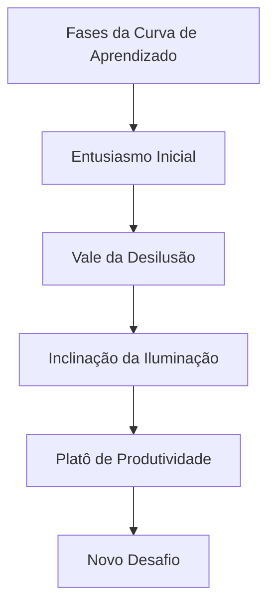

**Estratégias para Cada Fase:**

|Fase|Características|Abordagens Recomendadas|
|---|---|---|
|**Entusiasmo Inicial**|Alta motivação, resultados rápidos|Celebrar pequenas vitórias, estabelecer fundamentos|
|**Vale da Desilusão**|Frustração, percepção de estagnação|Suporte intensificado, recordar propósito maior|
|**Inclinação da Iluminação**|Padrões começam a emergir|Buscar aplicações mais complexas, conectar conceitos|
|**Platô de Produtividade**|Competência estabilizada|Ensinar outros, identificar refinamentos sutis|
|**Novo Desafio**|Risco de estagnação|Estabelecer próximo nível de maestria ou nova competência|

Reconhecer que o "Vale da Desilusão" é uma fase normal e temporária ajuda a perseverar quando a motivação inicial diminui. Como explica Seth Godin em seu livro "The Dip": "Os vencedores não desistem no fundo; eles encontram uma maneira de permanecer engajados com o trabalho para superar o ponto mais baixo."

### Documentação Reflexiva de Jornada

Para além de métricas quantitativas, o desenvolvimento profissional significativo beneficia-se de práticas reflexivas estruturadas que capturem nuances qualitativas da jornada.

#### 📓 Protocolo de Reflexão Estruturada

**Template para Reflexão Periódica:**

1. **Realizações significativas**: O que realizei no último período que representa progresso real em meu desenvolvimento?
    
2. **Insights transformadores**: Quais descobertas ou compreensões mudaram minha perspectiva sobre esta área?
    
3. **Padrões observados**: Que comportamentos recorrentes identifiquei que facilitam ou dificultam meu desenvolvimento?
    
4. **Obstáculos enfrentados**: Quais desafios específicos encontrei e como respondi a eles?
    
5. **Ajustes necessários**: Com base nessas observações, o que preciso modificar em minha abordagem?
    
6. **Próximos passos**: Quais ações específicas decorrentes desta reflexão implementarei no próximo ciclo?
    

Esta reflexão regular não é apenas um registro histórico, mas uma ferramenta ativa de desenvolvimento que acelera o aprendizado através da extração consciente de insights. Como John Dewey, pioneiro da educação experiencial, observou: "Não aprendemos com a experiência. Aprendemos refletindo sobre a experiência."

> "As melhores métricas não apenas medem resultados, mas iluminam o caminho à frente. No desenvolvimento profissional, as medições mais valiosas são aquelas que geram insights acionáveis para o próximo ciclo de crescimento."

A mensuração eficaz de progresso alimenta naturalmente outro componente crucial do desenvolvimento: o feedback contínuo.

---

## 🔄 A Cultura de Feedback Contínuo

### Além do Feedback Tradicional

O feedback eficaz para desenvolvimento vai muito além de avaliações anuais ou comentários genéricos. Quando bem estruturado, torna-se uma fonte contínua de insights que aceleram significativamente o desenvolvimento.

#### 🔍 Níveis de Profundidade do Feedback

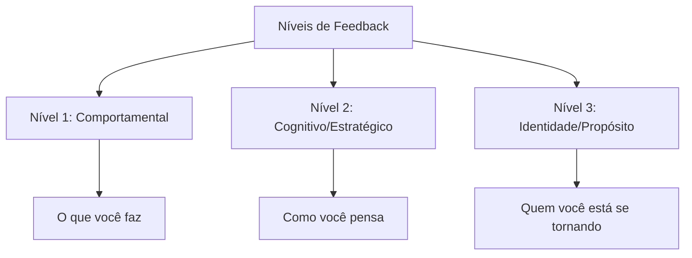

**Exemplos Práticos:**

|Nível|Exemplo de Feedback|Valor para Desenvolvimento|
|---|---|---|
|**Comportamental**|"Observei que você interrompe com frequência durante as reuniões de planejamento"|Identifica padrões concretos para ajustes imediatos|
|**Cognitivo**|"Percebo que você prioriza eficiência técnica sobre construção de consenso nas decisões de arquitetura"|Revela modelos mentais e vieses subjacentes|
|**Identidade**|"Suas ações refletem alguém comprometido com excelência técnica, mas talvez às custas de mentoria e desenvolvimento da equipe"|Conecta comportamentos a valores e aspirações profundas|

O feedback realmente transformador atinge todos os três níveis. O nível comportamental oferece ajustes imediatos, o nível cognitivo revela padrões de pensamento, e o nível de identidade conecta ações com aspirações mais profundas.

#### 📝 Protocolo de Feedback para Desenvolvimento

Para maximizar o valor do feedback no contexto de PDI:

1. **Preparação contextual**: Antes de solicitar feedback, esclareça: "Estou desenvolvendo X competência e valorizo feedback específico nesta área"
    
2. **Solicitação direcionada**: Seja preciso: "Pode observar especificamente como eu [comportamento específico] durante [situação específica]?"
    
3. **Escuta ativa**: Ao receber feedback, mantenha foco total na perspectiva do outro, sem defesa ou justificativa
    
4. **Exploração de nuances**: Aprofunde com perguntas como "Pode me dar um exemplo específico?" ou "Como isso impacta Y?"
    
5. **Conexão com PDI**: Explicite a relevância: "Como isso se relaciona com meu objetivo de desenvolvimento X?"
    
6. **Ação imediata**: Comprometa-se com um experimento específico baseado no feedback: "Baseado nisso, na próxima reunião vou testar..."
    

Este protocolo estruturado transforma feedback de algo potencialmente ameaçador em uma ferramenta poderosa de desenvolvimento. Como observa o especialista em liderança David Rock, "o feedback bem administrado ativa a curiosidade em vez da ameaça, criando um estado cerebral ideal para aprendizado."

### Criando Ciclos Virtuosos de Desenvolvimento

#### 🔄 O Loop de Feedback Integrado ao Cotidiano

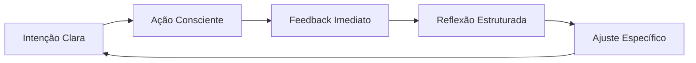

**Exemplos de Implementação:**

|Estágio|Prática Concreta|Ferramenta de Suporte|
|---|---|---|
|**Intenção Clara**|Definir foco de desenvolvimento para a semana|Template de planejamento semanal|
|**Ação Consciente**|Aplicar deliberadamente em situações específicas|Lembretes contextuais estratégicos|
|**Feedback Imediato**|Solicitar micro-feedbacks após interações-chave|Perguntas padronizadas de 1 minuto|
|**Reflexão Estruturada**|Documentar padrões e insights regularmente|Diário de aprendizado digital|
|**Ajuste Específico**|Implementar mudança pontual baseada em insights|Experimentos comportamentais de 7 dias|

Este sistema cria um fluxo contínuo de aprendizado e ajuste, significativamente mais eficaz que os ciclos anuais tradicionais de feedback. A rápida iteração permite ajustes frequentes, mantendo seu desenvolvimento constantemente alinhado às necessidades emergentes.

> "O feedback é como um espelho necessário para nosso desenvolvimento. Sem ele, estamos navegando às cegas, baseados apenas em nossas próprias percepções limitadas. Um PDI excepcional incorpora mecanismos robustos para capturar e integrar múltiplas perspectivas."

Tendo explorado os elementos fundamentais de um PDI eficaz, vamos agora examinar como adaptar esta abordagem para diferentes momentos da trajetória profissional.

---

## 🔄 PDI para Diferentes Momentos de Carreira

O desenvolvimento profissional não é um processo uniforme - ele evolui conforme avançamos em nossa jornada. Como observa Jennifer Petriglieri em "Casais que Trabalham": "As transições de carreira não são apenas mudanças no que fazemos, mas transformações em quem somos."

### Fase Inicial de Carreira (0-5 anos)

**Desafios Típicos:**

- Identificação de forças e paixões genuínas
- Desenvolvimento de competências técnicas fundamentais
- Construção de confiança e credibilidade profissional
- Adaptação à cultura organizacional

**Abordagens Recomendadas:**

- **Experimentação Ampla**: Como defende Reid Hoffman em "The Start-up of You", experimente diferentes funções e projetos para descobrir onde sua energia naturalmente flui
- **Mentorias Estruturadas**: Programa de rotação entre diferentes mentores a cada 3-4 meses
- **Aprendizado Técnico Intensivo**: Blocos dedicados para desenvolvimento de hard skills (método de imersão técnica da Shopify)
- **Feedback de Alto Volume**: Sistema de mini-feedbacks após cada entrega significativa

**Exemplo Prático:**

> Julia, desenvolvedora júnior, criou um PDI focado no método "T-shaped professional" de Tim Brown (IDEO): profundidade em uma competência técnica (desenvolvimento back-end) combinada com amplitude em habilidades complementares (UX, comunicação com stakeholders). Ela estabeleceu um sistema de projetos paralelos mensais para explorar diferentes especialidades, mantendo um "diário de energia" para identificar quais atividades a deixavam mais engajada.

### Meio de Carreira (5-15 anos)

**Desafios Típicos:**

- Transição de contribuidor individual para gestor (quando aplicável)
- Superação de plateaus de desenvolvimento
- Balanceamento entre especialização e versatilidade
- Reavaliação de propósito e alinhamento com valores

**Abordagens Recomendadas:**

- **Desenvolvimento em Profundidade vs. Amplitude**: Metodologia de "escalada T" proposta por Kelley & Kelley da d.school de Stanford
- **Projetos de Alto Impacto**: Liderança de iniciativas estratégicas cross-funcionais
- **Troca de Contextos Deliberada**: Rotação entre departamentos ou funções para ampliar perspectiva
- **Mentoria Reversa**: Orientação de profissionais mais jovens para atualização em tendências emergentes

**Exemplo Prático:**

> Ricardo, gerente de marketing com 8 anos de experiência, aplicou o framework de "desenvolvimento adaptativo" de Robert Kegan para superar um plateau de crescimento. Ele identificou seu "sistema operacional mental" atual (Kegan nível 3: foco em aprovação externa) e trabalhou com um coach para evoluir para o nível 4 (autogerado). Seu PDI incluía "experimentos de contorno", onde deliberadamente assumia posições impopulares mas bem fundamentadas em discussões estratégicas para desenvolver autonomia intelectual.

### Fase Avançada de Carreira (15+ anos)

**Desafios Típicos:**

- Manutenção de relevância em ambiente em rápida mudança
- Desenvolvimento de liderança estratégica e visionária
- Construção de legado e impacto duradouro
- Rejuvenescimento profissional e prevenção de estagnação

**Abordagens Recomendadas:**

- **Conselho Estratégico**: Participação em boards e comitês consultivos
- **Síntese de Sabedoria Prática**: Documentação e compartilhamento de conhecimento tácito acumulado
- **Desenvolvimento de Sucessores**: Programas estruturados de mentoria para próxima geração
- **Renovação Significativa**: Imersão em novas disciplinas ou tendências disruptivas

**Exemplo Prático:**

> Helena, diretora executiva com 22 anos de experiência, aplicou o conceito de "ikigai profissional" para reorientar sua carreira. Seu PDI focou na intersecção entre suas habilidades consolidadas em gestão estratégica e seu interesse emergente em sustentabilidade corporativa. Ela estabeleceu uma prática de "aprendizado em trindade": para cada área nova, combinava estudo formal, mentoria com especialista, e projeto prático aplicado. Isso levou à criação de uma nova vertical de negócios sustentáveis em sua organização.

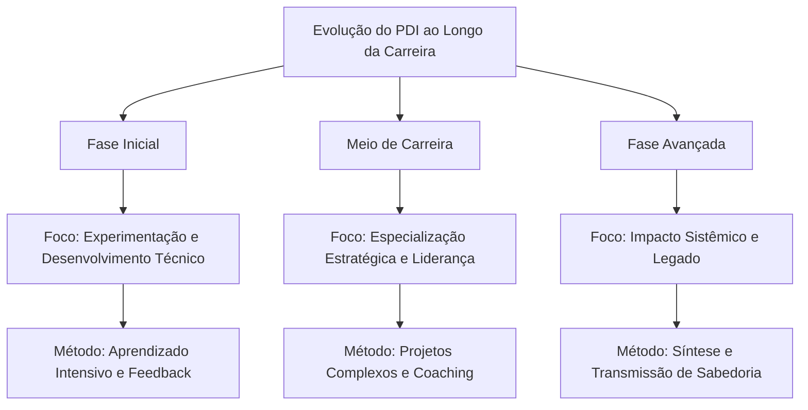

Com este entendimento de como o PDI evolui ao longo da carreira, vamos agora explorar como otimizar nosso desenvolvimento com base em descobertas recentes da neurociência.

---

## 🧠 Neurociência do Aprendizado para PDIs Excepcionais

O entendimento atual de como o cérebro aprende e se desenvolve oferece insights valiosos para otimizar o desenvolvimento profissional. Como destaca Andrew Huberman, neurocientista de Stanford: "A neuroplasticidade não é um evento, mas um processo que requer condições específicas para ocorrer de forma eficaz."

### Janelas de Neuroplasticidade

**Princípios Fundamentais:**

- O cérebro adulto mantém capacidade significativa de mudança (pesquisas de Michael Merzenich)
- A neuroplasticidade é dependente de atenção focada e estado neurológico específico
- Períodos de intensidade seguidos por recuperação otimizam a consolidação neural

**Aplicações Práticas para seu PDI:**

1. **Técnica de Aprendizado Espaçado**: Baseada nos estudos de Hermann Ebbinghaus e refinada por pesquisas recentes em neurociência, esta abordagem utiliza intervalos estratégicos:
    
    - Prática inicial intensiva (60-90 minutos)
    - Revisão após 24 horas
    - Reforço após 1 semana
    - Consolidação após 1 mês
2. **Protocolo de Estado Ótimo**: Desenvolvido com base nas pesquisas de Mihaly Csikszentmihalyi sobre "flow" e estudos de EEG:
    
    - 10-15 minutos de preparação (respiração controlada 5-7-5 para ativar estado parassimpático)
    - 25-45 minutos de prática focada ("janela de atenção produtiva" identificada por K. Anders Ericsson)
    - Breve recuperação (micropausa não-digital de 5 minutos)
    - Repetir 2-3 ciclos em uma sessão
3. **Técnica de Encoding Multisensorial**: Baseada nas pesquisas sobre memória de Richard Atkinson e consolidação de memória de James McGaugh:
    
    - Engajar múltiplos sentidos ao aprender nova habilidade
    - Verbalizar conceitos enquanto pratica (ativação simultânea de áreas motoras e verbais)
    - Ensinar conceito a outra pessoa dentro de 24-48 horas (técnica Feynman neuroaprimorada)

### Ciclos Otimizados de Desafio/Recuperação

A pesquisa sobre plasticidade cerebral de Bruce McEwen e os estudos sobre adaptação de Anders Ericsson revelam que o desenvolvimento ideal ocorre em um ritmo biologicamente alinhado:

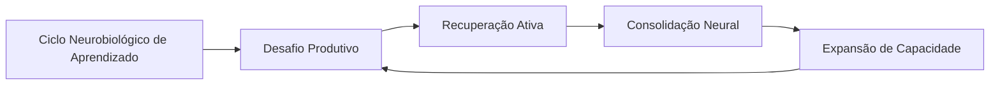

**Protocolo Prático para PDI:**

1. **Identificação da "Dificuldade Desejável"**: Como definido por Robert Bjork, trabalhe em tarefas que sejam aproximadamente 15-20% acima de sua capacidade atual
    
2. **Prática Deliberada Intercalada**: Alterne entre diferentes subhabilidades relacionadas, criando interferência produtiva (pesquisa de Elizabeth Bjork sobre aprendizado intercalado)
    
3. **Recuperação Neurocognitiva**: Após sessões intensas, utilize:
    
    - Caminhada de baixa intensidade (15-20 min) para estimular BDNF (Fator Neurotrófico Derivado do Cérebro)
    - Sono de qualidade priorizado nas 24h seguintes (fundamental para consolidação via ondas delta)
    - Reflexão estruturada para reforçar circuitos neurais (técnica de Barbara Oakley)

### Gatilhos Neurobiológicos de Motivação

As pesquisas de Wolfram Schultz sobre dopamina e Robert Sapolsky sobre estresse nos oferecem insights valiosos sobre como otimizar a motivação sustentável:

1. **Arquitetura de Recompensas Variáveis**: Baseada nos estudos de B.F. Skinner refinados pela neurociência moderna:
    
    - Pequenas celebrações após conclusão de tarefas (liberação de dopamina)
    - Recompensas intermitentes não-previsíveis para manter engajamento
    - Sistema de marcos com significado pessoal (não apenas marcos arbitrários)
2. **Gerenciamento de Estados Neuroquímicos**:
    
    - Prática de alta intensidade pela manhã (aproveitando cortisol elevado)
    - Tarefas criativas durante "depressão pós-almoço" (estado cerebral difuso favorece conexões não-óbvias)
    - Ritual de fechamento para ativação de sistema parassimpático (redução de cortisol)

> "Entender a neurobiologia do aprendizado não diminui a magia do desenvolvimento humano - apenas nos permite criar condições ideais para que essa magia aconteça de forma mais consistente." - Andrew Huberman, neurocientista de Stanford

Com estes insights da neurociência, estamos melhor equipados para enfrentar um dos maiores desafios do desenvolvimento profissional contemporâneo: a fragmentação da atenção.

---

## 🧠 PDI na Era da Fragmentação da Atenção

### O Desafio Contemporâneo do Desenvolvimento Profissional

Vivemos na era da economia da atenção. Como observa o neurocientista Adam Gazzaley: "Nossa capacidade atencional não evoluiu na mesma velocidade que nossa tecnologia". A realidade atual para muitos profissionais é uma constante batalha entre as exigências de desenvolvimento profissional e um ambiente repleto de distrações digitais e cognitivas.

Estudos da Universidade da Califórnia mostram que levamos, em média, 23 minutos para recuperar o foco completo após uma interrupção. Considerando que o profissional médio enfrenta interrupções a cada 3-5 minutos, o panorama para desenvolvimento consistente parece desafiador.

Neste contexto, um PDI eficaz precisa ir além de simplesmente definir "o que" desenvolver, para incluir estratégias sobre "como" proteger a capacidade cognitiva necessária para esse desenvolvimento.

### 🛡️ Arquitetura de Proteção Cognitiva para Desenvolvimento

#### Fundamentos de Ecologia Atencional

O conceito de "ecologia atencional", desenvolvido pelo psicólogo Matthew Crawford, sugere que nossa atenção é um recurso ambiental que precisamos deliberadamente proteger e cultivar. Aplicado ao desenvolvimento profissional, isto requer uma abordagem sistêmica:

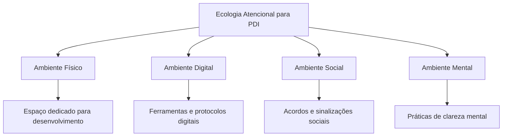

#### Protocolo de Deep Work para Desenvolvimento Profissional

Cal Newport, professor de ciência da computação e autor de "Deep Work", oferece um framework que pode ser adaptado especificamente para PDI:

**Rituais de Profundidade:**

1. **Preparação Espacial**:
    
    - Crie uma "estação de desenvolvimento" com todos os recursos necessários
    - Utilize sinais visuais que ativem o modo de aprendizado profundo
    - Elimine distrações previsíveis do ambiente
2. **Preparação Temporal**:
    
    - Bloqueie períodos específicos no calendário (idealmente 90-120 minutos)
    - Defina horários alinhados com seu ritmo circadiano pessoal
    - Comunique claramente períodos de indisponibilidade
3. **Preparação Mental**:
    
    - Ritual de transição de 5 minutos (respiração, revisão de objetivos)
    - Definição ultra-específica do resultado da sessão
    - "Warm-up" cognitivo com exercício de complexidade moderada
4. **Manutenção do Estado**:
    
    - Técnica de "pergunta adiada" para ideias não relacionadas
    - Micro-intervalos estruturados (52 minutos de foco, 17 de recuperação)
    - Sistema de tracking do estado atencional

**Os Quatro Paradigmas de Trabalho Profundo (Adaptados para PDI):**

|Abordagem|Descrição|Ideal para|
|---|---|---|
|**Monástica**|Blocos extensos (dias/semanas) dedicados exclusivamente a desenvolvimento|Transições profissionais, capacitações complexas, projetos transformadores|
|**Bimodal**|Alternância entre períodos intensivos (ex: 1-2 dias) e rotina normal|Desenvolvimento contínuo com marcos periódicos, equilibrado com responsabilidades atuais|
|**Rítmica**|Horários consistentes dedicados diariamente (ex: 5:30-7:30am)|Desenvolvimento incremental de longo prazo, formação de hábitos fundamentais|
|**Jornalística**|Oportunista - aproveitar quaisquer momentos disponíveis|Complementar a outras abordagens, não recomendado como estratégia primária|

**Caso Aplicado: Clara, Gerente de Marketing**

> Clara implementou o paradigma "Rítmico" para seu desenvolvimento em Analytics. Estabeleceu o período das 7:30-9:00 todas as manhãs, utilizando sinalizadores claros para sua equipe (banner digital de "Modo Desenvolvimento" ativo, status específico no Slack). Ela criou uma sequência de ativação: café específico, playlist instrumental, revisão de 2 minutos do objetivo da sessão. Seu progresso acelerou dramaticamente comparado às tentativas anteriores de estudar "quando sobrasse tempo".

### Estratégias de Gestão de Atenção Fragmentada

Para muitos profissionais, blocos extensos de concentração profunda são um luxo raro. Nestes casos, técnicas específicas para maximizar aprendizado em atenção fragmentada se tornam essenciais:

**1. Micro-Aprendizado Estruturado:**

Baseado nas pesquisas de Hermann Ebbinghaus sobre curva de esquecimento e trabalhos mais recentes sobre aprendizado espaçado:

|Componente|Descrição|Implementação|
|---|---|---|
|**Fragmentação Intencional**|Dividir conteúdo em micro-unidades de 3-7 minutos|Mapear competência em "átomos de aprendizado" que fazem sentido independentemente|
|**Distribuição Estratégica**|Espaçar exposições de forma otimizada|Sistema de repetição espaçada com intervalos crescentes (1 dia, 3 dias, 7 dias, etc.)|
|**Multimodalidade**|Utilizar diferentes formatos para o mesmo conteúdo|Alternar entre texto, áudio, prática, ensino a outros|
|**Contexto Variado**|Estudar o mesmo conceito em diferentes ambientes|Praticar durante deslocamento, em diferentes espaços de trabalho, etc.|

Agora, vamos examinar o contexto tecnológico específico que os líderes técnicos enfrentam hoje e como isso molda suas necessidades de desenvolvimento.

---

## 💻 O Novo Contexto Tecnológico: Desafios e Oportunidades

### A Tempestade Perfeita de Transformações

O contexto atual para líderes técnicos é caracterizado por uma convergência inédita de múltiplas transformações:

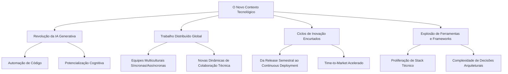

Cada uma dessas transformações traz desafios e oportunidades específicas. A IA generativa, por exemplo, está simultaneamente automatizando aspectos da codificação enquanto cria demanda por novas competências de prompt engineering e orquestração de sistemas inteligentes. O trabalho distribuído eliminou barreiras geográficas enquanto exige novas abordagens para construção de cultura técnica e transmissão de conhecimento tácito.

### Dados Reveladores

Pesquisas recentes da Stack Overflow e GitHub ilustram a magnitude dessas transformações:

- **79%** dos desenvolvedores já utilizam ferramentas de IA generativa regularmente, mas apenas **31%** dos líderes técnicos se sentem preparados para orientar suas equipes sobre o uso ético e eficaz dessas ferramentas
    
- As stacks tecnológicas das empresas cresceram em média **47%** em complexidade nos últimos 3 anos, enquanto o tempo médio de onboarding de novos engenheiros aumentou apenas **12%**
    
- **62%** dos erros críticos em produção são atribuídos a problemas de integração entre sistemas, não a bugs em componentes individuais
    
- Em equipes distribuídas, a transferência eficaz de conhecimento técnico é **40%** mais lenta que em equipes co-localizadas, apesar do aumento de documentação
    

Estes dados pintam um quadro desafiador, mas também revelam oportunidades críticas para líderes técnicos que desenvolvam competências específicas para este novo contexto.

### O Mapa de Competências em Evolução

Para navegar esse cenário, os líderes técnicos precisam desenvolver um conjunto de competências fundamentalmente diferente:

|Competência Histórica|Competência Emergente|Implicações para o PDI|
|---|---|---|
|**Domínio de uma stack específica**|**Agilidade técnica e adaptabilidade**|Focar em princípios e padrões transferíveis vs. sintaxe específica|
|**Planejamento técnico detalhado**|**Navegação ágil em ambiente incerto**|Desenvolver habilidade de estabelecer direção sem prescrever caminhos rígidos|
|**Execução direta de código crítico**|**Amplificação técnica via equipe e IA**|Cultivar capacidade de orquestrar múltiplas fontes de contribuição técnica|
|**Gestão local de pequena equipe**|**Liderança distribuída de ecossistemas**|Priorizar criação de sistemas sobre supervisão direta|

O grande desafio para o PDI do líder técnico em 2025 é que, ao contrário de eras anteriores onde a progressão era relativamente linear e previsível, agora estamos em um ambiente onde o próprio norte magnético do desenvolvimento profissional está em constante movimento.

> "Estamos tentando navegar mares desconhecidos com mapas antigos. E pior, o próprio oceano muda de composição enquanto o atravessamos." - Diretor de Engenharia, empresa unicórnio SaaS

Dada esta complexidade, vamos explorar uma abordagem específica para maximizar o desenvolvimento em um ambiente de alta fragmentação: o microaprendizado estratégico.

---

## ⚡ Microaprendizado Estratégico

### A Fragmentação Necessária do Desenvolvimento

O contexto atual de líderes técnicos é caracterizado por responsabilidades fragmentadas, alta demanda cognitiva e interrupções constantes. Um estudo da Microsoft descobriu que gerentes técnicos são interrompidos em média a cada 4 minutos e levam 23 minutos para recuperar foco profundo.

Neste cenário, a abordagem tradicional de desenvolvimento em grandes blocos contínuos torna-se cada vez menos viável. O microaprendizado estratégico oferece uma alternativa que transforma essa fragmentação de obstáculo em vantagem.

### O Sistema de Microaprendizado em Ação

O microaprendizado não é simplesmente "aprendizado em pedaços pequenos" - é um sistema sofisticado que alinha com os princípios da ciência cognitiva e se adapta ao contexto fragmentado:

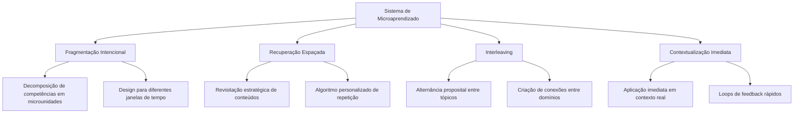

#### Taxonomia de Janelas de Micro-Desenvolvimento

O sistema eficaz reconhece diferentes tipos de janelas de tempo disponíveis e otimiza atividades para cada uma:

|Janela de Tempo|Características|Atividades Otimizadas|
|---|---|---|
|**Micro (1-5 min)**|Alta frequência, alta fragmentação|• Flashcards técnicos<br>• Revisão de conceito-chave<br>• Reflexão estruturada<br>• Consumo de snippet técnico|
|**Mini (5-20 min)**|Média frequência, fragmentação moderada|• Prática deliberada em sub-habilidade<br>• Leitura focada com extração<br>• Tutorial técnico curto<br>• Análise de código específico|
|**Módulo (20-50 min)**|Baixa frequência, baixa fragmentação|• Projeto técnico compacto<br>• Pair programming direcionado<br>• Sessão de design<br>• Experimentação estruturada|

### Encadeamento de Micro-Momentos para Macro-Impacto

O verdadeiro poder do microaprendizado vem da criação de um sistema coerente onde cada fragmento se conecta com os outros para construir competências complexas:

1. **Mapeamento de Cascata**: Decomposição estruturada de competências complexas em componentes granulares que podem ser desenvolvidos individualmente
    
2. **Sequenciamento Estratégico**: Organização dos micro-momentos em sequências lógicas que constroem compreensão progressiva
    
3. **Scaffolding Digital**: Utilização de ferramentas digitais para oferecer suporte contextual que conecta micro-aprendizados a estruturas maiores
    
4. **Revisão Integrada**: Sessões periódicas para conectar explicitamente micro-momentos em compreensão holística
    

### Estudo de Caso: O Sistema LEGO de Desenvolvimento Técnico

Rafael, líder técnico em uma empresa de e-commerce, implementou o que ele chama de "Sistema LEGO" para seu desenvolvimento contínuo:

1. **Biblioteca de Micro-Aprendizados**: Criou uma coleção pessoal de módulos curtos (1-15 minutos) sobre diferentes aspectos de arquitetura de microsserviços, organizados por tema e complexidade
    
2. **Calendário Adaptativo**: Integrou essas micro-unidades em seu calendário com base em diferentes tipos de disponibilidade:
    
    - Micromomentos (espera, transições): revisões rápidas e flashcards
    - Mini-blocos (início da manhã, antes/depois de reuniões): tutoriais curtos
    - Blocos médios (1-2 por semana): projeto prático contínuo
3. **Projeto de Aplicação Contínua**: Manteve um projeto pessoal onde implementa progressivamente os conceitos aprendidos, avançando em pequenos incrementos
    
4. **Ritual de Integração**: Semanalmente, dedica 30 minutos para revisar e conectar explicitamente os micro-aprendizados da semana em um mapa mental evolutivo
    

Os resultados foram significativos: mesmo com uma agenda extremamente fragmentada de líder técnico, Rafael conseguiu dominar uma nova arquitetura complexa em 4 meses, aplicando o conhecimento em uma iniciativa crítica de modernização.

> "A fragmentação não é mais minha inimiga - é simplesmente o terreno em que opero. O microaprendizado me permitiu transformar pequenos momentos em progresso constante." - Líder de Engenharia, empresa fintech

Agora que compreendemos como estruturar o aprendizado em um ambiente fragmentado, vamos explorar estratégias específicas para o desenvolvimento em ambientes híbridos e remotos.

---

## 🌐 PDI no Ambiente Híbrido/Remoto

### A Nova Realidade Distribuída

O trabalho remoto e híbrido não é mais uma adaptação temporária, mas a nova realidade permanente para a maioria dos líderes técnicos. Um estudo da Stack Overflow descobriu que 76% dos desenvolvedores trabalham remotamente pelo menos parte do tempo, com 38% em regime totalmente remoto.

Esta nova configuração apresenta desafios únicos para o desenvolvimento profissional:

- Perda de aprendizado orgânico e osmótico que ocorria naturalmente em ambientes co-localizados
- Redução de oportunidades casuais de coaching e feedback
- Dificuldade em demonstrar e observar comportamentos de liderança
- Barreiras para construção de relacionamentos profundos e capital social

### Estratégias de PDI para o Mundo Distribuído

#### Visibilidade Intencional

No ambiente remoto, a visibilidade das contribuições técnicas e de liderança precisa ser deliberadamente projetada, não deixada ao acaso:

- **Documentação como Produto**: Transformar o processo de documentação de pensamento técnico de obrigação em oportunidade de influência
- **Narração do Trabalho**: Compartilhar regularmente não apenas resultados, mas processo de pensamento e decisões
- **Artefatos Persistentes**: Criar conteúdo técnico de alto valor que persista e circule na organização (arquitetura decisão docs, guias técnicos, postmortems educativos)

#### Aprendizado Assíncrono Estruturado

Diferentemente dos ambientes presenciais que favoreciam interações síncronas, o desenvolvimento remoto eficaz exige sistemas bem projetados para aprendizado assíncrono:

- **Bibliotecas de Conhecimento Pessoal**: Curadoria sistemática de recursos de aprendizado de alta qualidade
- **Experimentação Documentada**: Prática de "aprender em público" através do registro de experimentos técnicos
- **Comunidades de Prática Híbridas**: Grupos de aprendizado que combinam elementos síncronos e assíncronos

#### Rituais de Desenvolvimento Distribuídos

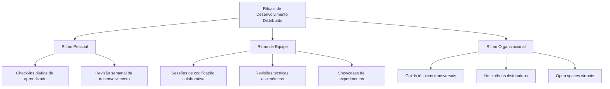

#### Caso Ilustrativo: Sistema STAR de uma Líder Técnica Remota

Marina, líder técnica em uma fintech totalmente distribuída, implementou o seguinte sistema para seu desenvolvimento contínuo:

- **S**haring: Cada semana, publica um documento conciso compartilhando um aprendizado técnico relevante
- **T**eaching: Mensalmente, conduz uma sessão de aprendizado para a equipe ou organização mais ampla
- **A**pplying: Mantém um "projeto de aprendizado" contínuo onde aplica novas tecnologias e conceitos
- **R**ituais: Blocos inegociáveis no calendário para desenvolvimento profissional e reflexão

O componente mais inovador de sua abordagem é o conceito de "pair learning" remoto: ela estabelece parcerias de aprendizado com outros líderes técnicos onde compartilham objetivos de desenvolvimento, trocam recursos e mantêm check-ins regulares sobre progresso.

> "No ambiente presencial, muito do desenvolvimento acontecia por acidente. No mundo remoto, nada acontece por acidente - todo desenvolvimento precisa ser intencional e sistemático." - Diretora de Engenharia, empresa SaaS

Agora, vamos explorar como as tecnologias imersivas estão transformando o desenvolvimento profissional.

---

## 📊 Desenvolvimento Imersivo: RV, RA e Simulações

A aprendizagem imersiva está revolucionando o desenvolvimento profissional, criando experiências multissensoriais que aumentam significativamente a retenção e aplicação prática de novas habilidades.

### A Revolução da Aprendizagem Experiencial

Enquanto métodos tradicionais de desenvolvimento frequentemente falham em transferir conhecimento para situações reais, ambientes imersivos permitem prática contextualizada e emocionalmente engajante. Como explica Jeremy Bailenson, diretor do Laboratório de Interação Humana Virtual de Stanford: "A aprendizagem imersiva coloca o aprendiz no centro do processo, permitindo experimentar situações que seriam impossíveis, perigosas ou caras demais para reproduzir em treinamentos convencionais."

### Abordagens Práticas de Desenvolvimento Imersivo

#### Realidade Virtual para Competências Complexas

A realidade virtual (RV) oferece um ambiente completamente imersivo onde você pode praticar habilidades complexas em contextos simulados, mas realistas. Aplicações potentes para desenvolvimento profissional incluem:

- **Simulações de Apresentações e Discursos**: Praticar apresentações para plateias virtuais que reagem em tempo real, permitindo superar a ansiedade de falar em público em ambiente seguro
    
- **Treinamento de Negociação e Influência**: Engajar-se em cenários de negociação com avatares programados para demonstrar diferentes estilos e táticas
    
- **Gestão de Conflitos**: Experimentar diversas abordagens para mediar conflitos entre equipes, com feedback imediato sobre linguagem corporal e tom
    

#### Realidade Aumentada para Aprendizado Contextual

A realidade aumentada (RA) sobrepõe informações digitais ao mundo real, criando oportunidades para aprendizado contextualizado:

- **Coaching em Tempo Real**: Óculos de RA podem fornecer dicas discretas durante reuniões ou apresentações, como lembretes para fazer contato visual ou sugestões de linguagem corporal
    
- **Visualização de Dados Contextual**: Acesso a métricas e informações relevantes exatamente quando necessárias durante interações profissionais
    
- **Aprendizado Técnico Sobreposto**: Instruções passo-a-passo sobrepostas a equipamentos ou processos reais, facilitando o desenvolvimento de habilidades técnicas complexas
    

#### Simulações Multiplayer para Competências Colaborativas

Ambientes virtuais multi-usuário permitem o desenvolvimento de habilidades interpessoais complexas:

- **Gestão de Equipes Virtuais**: Simulações onde você lidera equipes diversas em projetos complexos com restrições realistas de tempo e recursos
    
- **Tomada de Decisão Colaborativa**: Cenários que exigem coordenação com múltiplos stakeholders para resolver problemas complexos
    
- **Liderança em Crise**: Simulações de situações de emergência que testam capacidade de liderança sob pressão
    

### Pesquisas e Evidências

Estudos conduzidos pela Universidade de Stanford demonstraram que o treinamento em ambientes virtuais imersivos pode aumentar a retenção em até 75% quando comparado a métodos tradicionais. Além disso, a prática em ambientes simulados gera transferência significativa para contextos reais, especialmente em habilidades que envolvem componentes emocionais e interpessoais complexos.

Uma pesquisa da PwC revelou que profissionais treinados em RV completaram programas 40% mais rápido do que aqueles em salas de aula tradicionais e demonstraram 275% mais confiança em aplicar o que aprenderam.

### Implementação em Seu PDI

Para incorporar desenvolvimento imersivo em seu PDI:

1. **Identifique Competências de Alto Impacto**: Priorize habilidades que são difíceis de praticar no dia a dia ou que envolvem riscos significativos
    
2. **Selecione a Tecnologia Apropriada**: Determine qual modalidade (RV, RA ou simulação) melhor atende suas necessidades específicas
    
3. **Desenhe Cenários Progressivos**: Crie uma sequência de situações com dificuldade crescente, começando com cenários básicos e avançando para contextos mais complexos
    
4. **Integre Feedback Multidimensional**: Combine métricas objetivas com feedback qualitativo para uma visão completa do desempenho
    
5. **Pratique Transferência Deliberada**: Estabeleça conexões explícitas entre aprendizados do ambiente virtual e aplicações no mundo real
    

> "A verdadeira magia dos ambientes imersivos não está na tecnologia em si, mas na capacidade de criar contextos de prática seguros e realistas que aceleram drasticamente a curva de aprendizado para competências complexas."

---

## 🎮 Gamificação e Narrativa no Desenvolvimento Profissional

### Introdução: O Poder dos Jogos no Desenvolvimento

Você já se perguntou por que conseguimos passar horas jogando, superando desafios cada vez mais difíceis, enquanto frequentemente lutamos para manter consistência em nosso desenvolvimento profissional? Como observa Jane McGonigal, designer de jogos e pesquisadora: "Os jogos nos dão propósito claro e feedback imediato – exatamente o que falta em muitos contextos profissionais."

A gamificação não é apenas sobre pontos e distintivos – é uma abordagem fundamentada em psicologia comportamental e design motivacional que pode transformar radicalmente seu PDI. Quando aplicada com inteligência, torna o desenvolvimento mais envolvente, mensurável e sustentável.

### 🎯 A Ciência da Motivação Através de Elementos de Jogos

#### O Framework Octalysis: Além da Gamificação Superficial

Yu-kai Chou, um dos principais especialistas em gamificação, desenvolveu o framework Octalysis após analisar milhares de jogos bem-sucedidos. Este modelo identifica oito núcleos motivacionais que podem ser adaptados para desenvolvimento profissional:

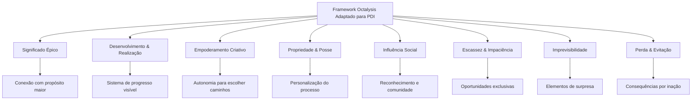

**Aplicação Prática para PDI:**

|Núcleo Motivacional|Implementação no PDI|Exemplo Concreto|
|---|---|---|
|**Significado Épico**|Conecte seu desenvolvimento a um propósito maior|"Minha jornada de desenvolvimento em liderança não é apenas sobre promoção, mas para impactar positivamente as 50 pessoas do meu time"|
|**Desenvolvimento & Realização**|Sistema visível de progressão com marcos claros|Mapa visual de habilidades com níveis específicos e "missões" para avançar|
|**Empoderamento Criativo**|Autonomia para personalizar abordagens|Menu de diferentes métodos para desenvolver cada competência, permitindo escolha|
|**Propriedade & Posse**|Criação de identidade de desenvolvimento|"Avatar profissional" com visualização de atributos que evoluem|
|**Influência Social**|Engajamento de comunidade no processo|Check-ins semanais com "guilda" de desenvolvimento e celebrações coletivas|
|**Escassez & Impaciência**|Oportunidades limitadas e desafios temporários|"Desafios especiais" mensais com benefícios exclusivos para completar|
|**Imprevisibilidade**|Elementos de descoberta e surpresa|"Baús de recompensa" aleatórios após completar certos marcos|
|**Perda & Evitação**|Consequências estruturadas por inação|Sistema de "vidas" ou "energia" que diminui sem ação consistente|

### Exemplo de Sistema Gamificado para Desenvolvimento de Habilidades de Comunicação:

**"A Jornada do Comunicador Magistral"**

1. **Mapa de Progresso Visível:**
    
    - Caminho visual com 5 níveis: Aprendiz → Praticante → Especialista → Mestre → Magistral
    - Cada nível com 3 "regiões" de habilidade: Comunicação Escrita, Verbal e Não-verbal
    - Marcos específicos em cada região (ex: "Dominador de Apresentações", "Mestre do Feedback")
2. **Sistema de Missões e Desafios:**
    
    - Missões principais: Projetos estruturados com critérios claros ("Lidere uma reunião de stakeholders complexa")
    - Missões secundárias: Pequenas práticas diárias ("Faça uma pergunta poderosa em cada conversa hoje")
    - Desafios especiais: Oportunidades temporárias de alto valor ("Apresentação para liderança sênior")
3. **Mecânicas de Feedback e Recompensa:**
    
    - XP (Pontos de Experiência): Acumulados por prática consistente
    - Distintivos: Reconhecimento por domínio de habilidades específicas
    - Desbloqueios: Acesso a novos recursos ou oportunidades
    - "Power-ups": Benefícios temporários (ex: mentoria especial por tempo limitado)
4. **Elementos Sociais:**
    
    - "Guilda de Comunicadores": Grupo de apoio com check-ins regulares
    - Tabuleiro de líderes: Reconhecimento (opcional) de progresso
    - Desafios em equipe: Colaboração para superar obstáculos complexos
    - Celebrações coletivas: Ritual para reconhecer marcos importantes

> "Transformei meu PDI de uma lista de verificação estática para uma jornada épica com desafios progressivos. A diferença foi extraordinária - de uma obrigação ocasional para uma prática que busco diariamente." - Elena Martins, gerente de produto que implementou princípios de gamificação em seu desenvolvimento

### 📖 Narrativa Pessoal: A Arte de Transformar Desenvolvimento em História

O poder das histórias em moldar nosso comportamento está profundamente enraizado na psicologia humana. Como destaca o psicólogo Dan McAdams em suas pesquisas sobre identidade narrativa: "Somos as histórias que contamos a nós mesmos sobre nós mesmos."

#### Técnicas de Storytelling Aplicadas ao Desenvolvimento

**1. A Jornada do Herói para PDI:**

Joseph Campbell identificou padrões universais em histórias míticas que ressoam profundamente. Esta estrutura pode ser adaptada para desenvolvimento profissional:

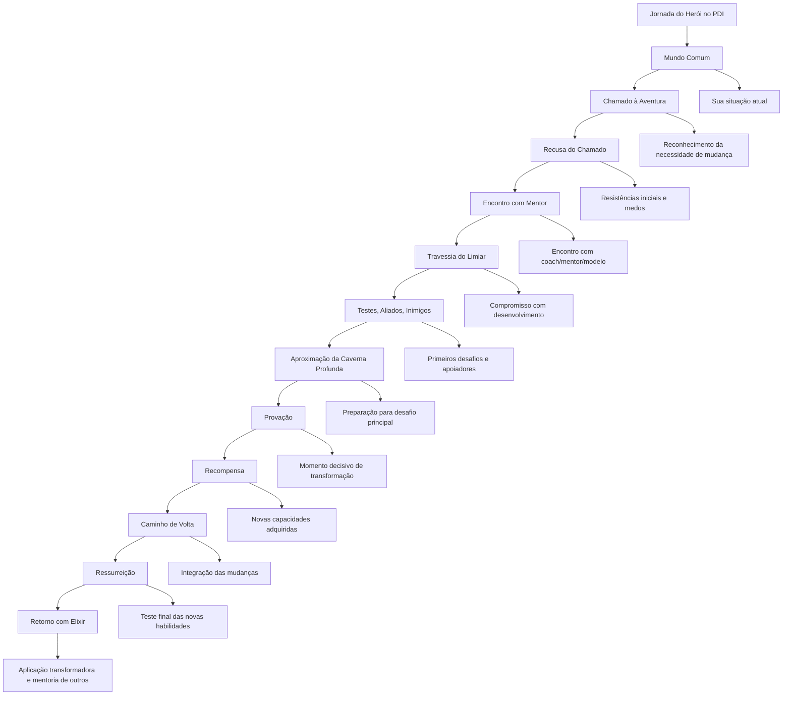

**2. Arcos Narrativos para Desenvolvimento:**

Enxergar seu desenvolvimento como uma história com início, meio e fim, com obstáculos a superar e transformação a alcançar, ativa poderosos mecanismos motivacionais:

- **Estabeleça seu "personagem"**: Quem você é agora no início dessa jornada? Quais são suas forças e limitações atuais?
- **Defina o "conflito central"**: Qual é o desafio fundamental que está enfrentando? O que está em jogo?
- **Crie "pontos de virada"**: Quais serão os momentos decisivos em sua jornada de desenvolvimento?
- **Visualize a "resolução"**: Como será a versão transformada de si mesmo? Como o mundo será diferente?

**3. Técnicas Narrativas Específicas:**

|Técnica|Descrição|Aplicação no PDI|
|---|---|---|
|**Backstory Evolutivo**|Criação de narrativa coerente que integra experiências passadas|Escreva sua "biografia profissional", destacando como experiências anteriores o prepararam para seu próximo desenvolvimento|
|**Visualização Episódica**|Imaginação vívida de cenas futuras específicas|Escreva cenas detalhadas de você demonstrando com maestria as competências que deseja desenvolver|
|**Diário Narrativo**|Registro regular que conecta eventos em estrutura narrativa|Mantenha um diário que explicitamente enquadra seu desenvolvimento como jornada, com altos, baixos e revelações|
|**Arquétipos de Desenvolvimento**|Utilização de padrões universais de personagem|Identifique qual arquétipo melhor representa sua jornada atual (ex: Aprendiz, Explorador, Mentor, Criador)|

A narrativa poderosa transforma obstáculos de ameaças desmotivadoras em desafios necessários dentro de uma história maior. Como Lisa Cron, autora de "Wired for Story", explica: "Nossos cérebros são literalmente conectados para responder a histórias - elas são o sistema operacional da mente humana."

Agora, vamos explorar como a IA pode potencializar profundamente seu desenvolvimento profissional.

---

## 🤖 Sinergia entre IA e Desenvolvimento Humano

### A Falsa Dicotomia: Homem vs. Máquina

A rápida evolução dos sistemas de IA, especialmente modelos como GPT-4, Claude e GitHub Copilot, criou uma ansiedade compreensível entre líderes técnicos. A pergunta "a IA substituirá programadores?" é frequentemente discutida, mas representa um enquadramento fundamentalmente equivocado.

A perspectiva mais produtiva é enxergar a IA não como substituta, mas como amplificadora de capacidades humanas - criando uma nova categoria de "liderança técnica potencializada por IA".

### IA como Aceleradora de Desenvolvimento

Quando integrada estrategicamente a um PDI, a IA pode transformar dramaticamente a velocidade e eficácia do desenvolvimento profissional:

|Aspecto do PDI|Abordagem Tradicional|Abordagem Potencializada por IA|
|---|---|---|
|**Diagnóstico de gaps de conhecimento**|Baseado em auto-percepção e feedback humano limitado|Análise de padrões em artefatos técnicos (código, documentos, comunicações) para identificação precisa de áreas de melhoria|
|**Acesso a conhecimento**|Cursos estruturados, livros, documentação|Interface conversacional personalizada com toda base de conhecimento técnico relevante|
|**Prática deliberada**|Exercícios predefinidos com feedback limitado|Simulações dinâmicas e cenários adaptados ao nível atual, com feedback instantâneo|
|**Mensuração de progresso**|Avaliações periódicas espaçadas|Monitoramento contínuo de competências demonstradas em trabalho real|

Dados iniciais de empresas que implementaram programas de desenvolvimento potencializados por IA mostram redução de 40-60% no tempo necessário para adquirir novas competências técnicas e aumento significativo na retenção e aplicação.

### O PDI como Sistema Ciborgue

O líder técnico eficaz em 2025 não compete com a IA nem a evita - ele constrói um "sistema ciborgue" onde capacidades humanas e de máquina são estrategicamente integradas.

```mermaid
graph TD
    A[Sistema Ciborgue de Desenvolvimento] --> B[Capacidades Humanas]
    A --> C[Capacidades de IA]
    
    B --> D[Intuição contextual]
    B --> E[Criatividade original]
    B --> F[Inteligência emocional]
    B --> G[Julgamento ético]
    
    C --> H[Processamento de conhecimento em escala]
    C --> I[Detecção de padrões sutis]
    C --> J[Simulação rápida de cenários]
    C --> K[Geração de alternativas]
    
    D <--> H
    E <--> I
    F <--> J
    G <--> K
```

### Estudo de Caso: O Multiplicador Técnico

Clara, líder técnica em uma empresa de streaming, implementou o que ela chama de "Sistema Multiplicador" para seu desenvolvimento:

1. **Radar Aumentado**: Utiliza IA para monitorar continuamente avanços técnicos relevantes em sua área, recebendo diariamente uma curadoria personalizada dos desenvolvimentos mais importantes
    
2. **Laboratório Virtual**: Criou um ambiente onde pode experimentar rapidamente com novas tecnologias usando IA para gerar protótipos funcionais, simulando implementações e identificando potenciais desafios
    
3. **Espelho Técnico**: Desenvolveu um sistema que analisa suas decisões técnicas, comunicações e código, oferecendo feedback sobre padrões, possíveis pontos cegos e oportunidades de melhoria
    
4. **Biblioteca Expandida**: Mantém um sistema de aprendizado personalizado que conecta conceitos novos a seu conhecimento existente, criando um "mapa mental aumentado" que evolui continuamente
    

Os resultados foram notáveis: Clara conseguiu reduzir seu "tempo de absorção" de novas tecnologias em 65%, enquanto expandiu significativamente o escopo de sua expertise técnica.

> "A questão não é 'homem ou máquina', mas 'quais aspectos da liderança técnica são melhor executados pelo humano, quais pela máquina, e como desenhamos a interface ideal entre eles'." - Pesquisador líder em IA, Stanford

Vamos agora explorar como dados podem orientar seu desenvolvimento de forma mais precisa e eficaz.

---

## 📊 PDI Baseado em Dados: Abordagem Analítica

### Introdução: A Revolução dos Dados no Desenvolvimento Profissional

Estamos vivendo a era dos dados. Como observa Thomas Davenport em "Competing on Analytics": "O que não pode ser medido, não pode ser gerenciado – e o que não está sendo gerenciado ativamente, raramente melhora." Esta máxima, embora tradicionalmente aplicada a negócios, é igualmente poderosa quando aplicada ao desenvolvimento profissional.

A maioria dos PDIs tradicionais baseia-se em impressões subjetivas, avaliações qualitativas e intuição. Embora esses elementos tenham seu valor, a ausência de uma abordagem baseada em dados frequentemente resulta em:

- Foco em áreas de desenvolvimento com baixo impacto real
- Progresso inconsistente e difícil de verificar
- Decisões baseadas em vieses e percepções limitadas
- Dificuldade em ajustar estratégias de forma ágil

PDIs baseados em dados transformam desenvolvimento profissional de arte abstrata em ciência aplicada, permitindo decisões mais precisas, ajustes mais rápidos e resultados verificáveis.

### 🔍 Diagnóstico Quantitativo: Além da Intuição

#### Baseline Multidimensional: Medindo o Ponto de Partida

Um PDI efetivamente orientado por dados começa com um diagnóstico abrangente e quantificável:

```mermaid
graph TD
    A[Baseline Multidimensional] --> B[Competências Técnicas]
    A --> C[Habilidades Comportamentais]
    A --> D[Impacto nos Resultados]
    A --> E[Redes e Influência]
    
    B --> F[Avaliações Padronizadas]
    B --> G[Análise de Artefatos]
    
    C --> H[Feedback 360° Quantitativo]
    C --> I[Análise Comportamental]
    
    D --> J[KPIs Atribuíveis]
    D --> K[Análise de Contribuição]
    
    E --> L[Mapeamento de Rede]
    E --> M[Análise de Comunicação]
```

**Métodos Avançados de Coleta de Dados:**

|Dimensão|Métodos Tradicionais|Abordagens Avançadas|
|---|---|---|
|**Competências Técnicas**|Autoavaliação, feedback do gestor|Avaliações cegas por pares, análise de código/documentos, testes padronizados específicos da indústria|
|**Habilidades Comportamentais**|Feedback informal, impressões|Análise comportamental baseada em linguística, feedback 360° estruturado com métricas comparativas|
|**Impacto nos Resultados**|Avaliações anuais, objetivos gerais|KPIs específicos vinculados a contribuições individuais, análise de atribuição|
|**Redes e Influência**|Percepção subjetiva|Análise de redes organizacionais (ONA), métricas de comunicação e colaboração|

**Caso Prático: Diagnóstico Aprimorado da Microsoft**

A Microsoft desenvolveu uma abordagem chamada "Performance Fingerprint" que combina:

- Análise de padrões de comunicação via metadados (sem violar privacidade)
- Métricas de contribuição em repositórios e ferramentas colaborativas
- Avaliações técnicas estruturadas com múltiplos avaliadores cegos
- Dados de impacto em resultados com ajustes para fatores externos

Este diagnóstico multidimensional revelou que engenheiros anteriormente classificados similarmente através de métodos tradicionais apresentavam perfis de competência e impacto radicalmente diferentes quando analisados com ferramentas mais precisas.

### Framework IMPACT para Métricas de Desenvolvimento

Um desafio comum em PDIs é a definição de métricas que sejam simultaneamente relevantes, mensuráveis e acionáveis. O framework IMPACT oferece uma estrutura:

|Dimensão|Descrição|Exemplos de Métricas|
|---|---|---|
|**I**ndicadores Diretos|Métricas que medem diretamente a competência|Avaliações padronizadas, certificações, tempo para completar tarefas específicas|
|**M**étricas de Aplicação|Como a competência é utilizada em contexto real|Frequência de aplicação, qualidade de implementação, adaptabilidade contextual|
|**P**ercepções Quantificadas|Feedback estruturado de stakeholders|Scores de avaliação 360°, NPS de colaboração, avaliações cegas por pares|
|**A**tributos Comportamentais|Comportamentos observáveis associados|Frequência de comportamentos específicos, análise de padrões de comunicação|
|**C**ontribuições Mensuráveis|Impacto em resultados tangíveis|KPIs de negócio influenciados, tempo economizado, qualidade aprimorada|
|**T**endências ao Longo do Tempo|Evolução em períodos definidos|Taxa de melhoria, consistência de aplicação, adaptação a novos contextos|

### Sistemas de Visualização de Desenvolvimento

```mermaid
graph TD
    A[Dashboard de Desenvolvimento] --> B[Visão Macro]
    A --> C[Progressão Temporal]
    A --> D[Competências Detalhadas]
    A --> E[Impacto Organizacional]
    
    B --> F[Radar de Competências]
    B --> G[Índice de Desenvolvimento Composto]
    
    C --> H[Linha de Progresso]
    C --> I[Análise de Velocidade]
    
    D --> J[Mapa de Calor de Habilidades]
    D --> K[Gaps Prioritários]
    
    E --> L[Mapa de Influência]
    E --> M[Contribuição para KPIs]
```

Esta visualização permite verificar rapidamente não apenas onde você está, mas a velocidade com que está progredindo e o impacto que este desenvolvimento está gerando.

### Ciclos de Feedback Orientados por Dados

O verdadeiro poder do PDI orientado por dados está em estabelecer ciclos de feedback ágeis e precisos:

1. **Coleta de Micro-Dados**: Sistemas para capturar indicadores granulares continuamente em vez de avaliações massivas periódicas
    
2. **Análise de Padrões**: Identificação de tendências, correlações e insights a partir do volume de dados
    
3. **Experimentos de Desenvolvimento**: Testes A/B sistemáticos com diferentes abordagens de desenvolvimento
    
4. **Ajustes Baseados em Evidência**: Refinamento contínuo do plano baseado em resultados reais, não apenas percepções
    

> "O que diferencia verdadeiramente um PDI excepcional não é o planejamento inicial perfeito, mas a capacidade de ajuste inteligente ao longo do percurso. Os dados são a bússola que permite esta navegação precisa."

Vamos agora explorar abordagens de desenvolvimento que valorizam e potencializam diferentes perfis neurológicos.

---

## 🧩 Desenvolvimento para Neurodiversidade e Inclusão

### Reconhecendo e Valorizando Diferentes Perfis Cognitivos

Cada cérebro é único. A neurodiversidade reconhece que variações neurológicas como autismo, TDAH, dislexia e outras representam diferenças naturais no funcionamento cognitivo humano, não deficiências. Como destaca Thomas Armstrong, autor de "Neurodiversidade no Local de Trabalho": "A neurodiversidade pode ser tão crucial para o futuro dos negócios quanto a biodiversidade é para a sobrevivência do planeta."

Para muitos profissionais neurodiversos, os PDIs tradicionais podem apresentar barreiras significativas. Entretanto, quando adaptados para diferentes padrões de processamento cognitivo, podem se tornar ferramentas excepcionalmente poderosas de desenvolvimento.

### Abordagens Personalizadas para Diferentes Estilos Cognitivos

#### Avaliação de Perfil Neurocognitivo

O primeiro passo é compreender profundamente seu perfil cognitivo único:

- **Mapeamento de Estilos de Processamento**: Ferramentas como o MAIA (Mapeamento Avançado de Inclinações de Aprendizado) identificam padrões individuais de processamento de informação, preferências sensoriais e estilos organizacionais
    
- **Reconhecimento de Forças Cognitivas**: Avaliações como a VIA Character Strengths ou Gallup CliftonStrengths podem revelar capacidades únicas frequentemente não captadas em avaliações tradicionais
    
- **Identificação de Gatilhos de Sobrecarga**: Análise estruturada de contextos que causam desconforto, sobrecarga ou subestimulação sensorial, permitindo ajustes ambientais
    

#### PDIs Multimodais

Desenvolvimento eficaz para neurodiversidade exige múltiplos caminhos para o mesmo objetivo:

|Abordagem|Descrição|Aplicação Prática|
|---|---|---|
|**Adaptação de Canais Sensoriais**|Oferecer conteúdos em múltiplos formatos|Disponibilizar recursos em texto, áudio, visual e kinestésico para acomodar diferentes preferências|
|**Ajuste de Estrutura/Flexibilidade**|Equilibrar orientação clara e espaço para exploração|Criar frameworks adaptativos que permitem diferentes níveis de estrutura|
|**Abordagem de Processamento**|Respeitar diferentes velocidades e estilos|Permitir tempo apropriado e abordagens lineares/não-lineares conforme necessidade|

#### Ambientes de Desenvolvimento Adaptáveis

O contexto físico e digital para desenvolvimento deve ser personalizado para otimizar desempenho cognitivo:

- **Espaços Físicos Flexíveis**: Áreas que podem ser ajustadas para diferentes necessidades sensoriais (iluminação, acústica, privacidade)
    
- **Ferramentas Digitais Personalizáveis**: Interfaces que permitem ajustes de contraste, fontes, organização visual e gerenciamento de notificações
    
- **Protocolos de Comunicação Inclusivos**: Sistemas que acomodam preferências por comunicação assíncrona vs. síncrona, escrita vs. verbal
    

### Caso de Estudo: Programa de Desenvolvimento Neuroinclusivo da IBM

A IBM implementou um programa chamado "Neurodiversidade no Trabalho" que incluiu uma abordagem radicalmente nova para PDIs:

- **Diagnóstico Multissensorial**: Ao invés de formulários tradicionais, utilizaram jogos interativos, entrevistas visuais e simulações práticas para mapear pontos fortes e desafios
    
- **Metas Personalizadas por Estilo Cognitivo**: Objetivos idênticos com caminhos radicalmente diferentes baseados em perfis neurocognitivos
    
- **Sistema de Suporte Adaptativo**: Mentores treinados em neurodiversidade, ferramentas personalizadas e ajustes ambientais específicos
    

Os resultados foram impressionantes: participantes neurodiversos superaram seus pares em inovação em 52% e em resolução de problemas complexos em 48%, enquanto reportaram níveis significativamente maiores de engajamento e satisfação profissional.

### Aplicação em Seu PDI

Para criar um PDI neuroinclulsivo:

1. **Compreenda Sua Neurologia**: Investigue como seu cérebro único processa informação, se motiva e aprende mais eficientemente
    
2. **Desenhe Múltiplos Caminhos**: Para cada objetivo, crie pelo menos três abordagens diferentes que acomodem diferentes estilos cognitivos
    
3. **Personalize Seu Ambiente**: Identifique e implemente os ajustes ambientais que otimizam seu funcionamento cognitivo
    
4. **Priorize Forças Naturais**: Estruture seu desenvolvimento para maximizar talentos inatos enquanto desenvolve estratégias adaptativas para desafios
    

> "A verdadeira inclusão não é sobre tratar todos igualmente, mas sobre reconhecer e valorizar diferenças fundamentais. Um PDI neuroinclulsivo não é apenas melhor para indivíduos neurodiversos - é melhor para todos." - Dr. Judy Singer, socióloga que cunhou o termo "neurodiversidade"

Vamos agora explorar como uma abordagem modular pode potencializar seu desenvolvimento profissional.

---

## 📚 Micro-credentials e Aprendizado Modular

### A Transformação do Desenvolvimento Profissional

O modelo tradicional de desenvolvimento baseado em grandes certificações e cursos extensos está rapidamente sendo substituído por uma abordagem mais granular, flexível e personalizada. Como observa Matthew Sigelman, CEO do Burning Glass Technologies: "O mercado está se movendo para um modelo onde as habilidades específicas, não os diplomas, são a moeda corrente."

Micro-credentials são certificações digitais verificáveis que representam competências específicas, alcançadas através de experiências de aprendizado modulares. Seu valor está na precisão, relevância imediata e adaptabilidade em um mundo onde as habilidades evoluem constantemente.

### O Poder do Desenvolvimento Modular

#### Benefícios do Aprendizado em Módulos Discretos

|Benefício|Descrição|Impacto no PDI|
|---|---|---|
|**Precisão**|Foco em habilidades específicas sem componentes desnecessários|Desenvolvimento direcionado às necessidades reais|
|**Agilidade**|Capacidade de adquirir novas competências rapidamente|Adaptação rápida às mudanças de mercado e requisitos|
|**Personalização**|Caminho de desenvolvimento único baseado em necessidades individuais|PDI verdadeiramente alinhado ao seu contexto e aspirações|
|**Evidência Verificável**|Demonstração concreta de competências adquiridas|Transição de "o que você sabe" para "o que você pode fazer"|

#### Roadmap de Micro-habilidades

O desenvolvimento modular começa decompondo competências complexas em componentes menores e gerenciáveis:

```mermaid
graph TD
    A[Competência Complexa] --> B[Micro-habilidade 1]
    A --> C[Micro-habilidade 2]
    A --> D[Micro-habilidade 3]
    A --> E[Micro-habilidade 4]
    
    B --> F[Nível Básico]
    B --> G[Nível Intermediário]
    B --> H[Nível Avançado]
    
    C --> I[Nível Básico]
    C --> J[Nível Intermediário]
    C --> K[Nível Avançado]
```

**Exemplo Prático: Liderança de Equipes Remotas**

Em vez de um curso genérico sobre liderança, um desenvolvimento modular decomporia esta competência em micro-habilidades específicas:

1. **Comunicação Assíncrona Eficaz**
    
    - Básico: Protocolo claro para e-mails e mensagens
    - Intermediário: Documentação colaborativa estruturada
    - Avançado: Sistemas adaptativos de comunicação por contexto
2. **Facilitação Virtual**
    
    - Básico: Gestão básica de reuniões online
    - Intermediário: Técnicas de engajamento em videoconferências
    - Avançado: Design de workshops virtuais transformadores
3. **Construção de Confiança Distribuída**
    
    - Básico: Check-ins consistentes e previsíveis
    - Intermediário: Feedback estruturado à distância
    - Avançado: Criação de rituais de equipe significativos
4. **Coordenação Multicultural e Multi-fuso**
    
    - Básico: Protocolos inclusivos de agendamento
    - Intermediário: Adaptação de comunicação para diferentes contextos culturais
    - Avançado: Otimização de colaboração assíncrona global

### Sistema de Badges Digitais

Os badges digitais são representações visuais verificáveis de conquistas, habilidades e competências. Mais do que simples imagens, contêm metadados que incluem critérios de emissão, evidências e verificação.

#### Anatomia de um Sistema de Badges Eficaz

1. **Badges Fundacionais**: Representam competências básicas que servem como blocos de construção
    
2. **Badges de Especialização**: Certificam domínio em áreas específicas de conhecimento ou conjuntos de habilidades
    
3. **Badges de Mestria**: Reconhecem capacidade de aplicar competências em contextos complexos e ensinar outros
    
4. **Meta-badges**: Concedidos pela integração bem-sucedida de múltiplas competências em contextos desafiadores
    

#### Implementação em Seu PDI

Para integrar micro-credentials e badges em seu desenvolvimento:

1. **Mapeamento de Competências Granular**: Decomponha suas metas de desenvolvimento em componentes específicos e verificáveis
    
2. **Identificação de Provedores Relevantes**: Plataformas como Coursera, edX, LinkedIn Learning e associações profissionais específicas do seu setor
    
3. **Criação de Portfólio Digital**: Ferramentas como Credly, Badgr ou Open Badge Passport para armazenar e compartilhar suas conquistas
    
4. **Alinhamento com Objetivos de Carreira**: Conexão explícita entre micro-credentials e oportunidades específicas de carreira
    

### Aprendizado Adaptativo Baseado em Dados

Os sistemas modernos podem personalizar continuamente o percurso de desenvolvimento com base em desempenho e necessidades:

- **Avaliações Dinâmicas**: Testes adaptativos que ajustam a dificuldade em tempo real para identificar precisamente seu nível
    
- **Recomendações Personalizadas**: Algoritmos que sugerem próximos passos baseados em padrões de aprendizado e objetivos
    
- **Feedback de Alta Granularidade**: Sistemas que identificam padrões específicos de erro e áreas de melhoria
    

> "O futuro do desenvolvimento profissional não está em currículos fixos, mas em jornadas de aprendizado personalizadas compostas de módulos precisos e relevantes que se adaptam continuamente às necessidades em evolução." - David Blake, fundador da Degreed

Vamos agora explorar como as comunidades amplificam significativamente o desenvolvimento profissional.

---

## 👥 Comunidades de Prática Potencializadas

### A Evolução do Aprendizado Social

O desenvolvimento profissional não acontece no vácuo. Desde os primórdios, aprendemos observando, interagindo e colaborando com outros. As Comunidades de Prática (CoPs), conceito desenvolvido por Etienne Wenger, representam grupos de pessoas que compartilham uma paixão ou preocupação e aprendem a fazê-lo melhor através de interação regular.

Com o advento de novas tecnologias de colaboração e inteligência artificial, as CoPs estão evoluindo para ecossistemas de aprendizado coletivo mais dinâmicos, personalizados e impactantes.

### Comunidades Potencializadas por Tecnologia e IA

#### Matching Inteligente de Mentores e Pares

Algoritmos sofisticados agora podem identificar conexões ideais entre profissionais:

- **Compatibilidade Multidimensional**: Pareamento baseado em objetivos de desenvolvimento, experiências complementares, estilos de aprendizado e disponibilidade
    
- **Recomendações Dinâmicas**: Sugestões que evoluem à medida que suas necessidades e objetivos mudam
    
- **Análise de Gaps de Conhecimento**: Identificação precisa de áreas onde você mais se beneficiaria de orientação específica
    

**Exemplo Prático:**

> O programa "Constellation" da Unilever utiliza IA para analisar perfis profissionais e criar conexões de mentoria altamente específicas. O sistema identifica não apenas experts em determinadas áreas, mas também considera compatibilidade de comunicação e disponibilidade, resultando em relacionamentos de mentoria 64% mais duradouros e impactantes que os pareamentos tradicionais.

#### Colaboração Assíncrona Aprimorada

Novas ferramentas estão transformando como as comunidades colaboram através do tempo e espaço:

- **Documentação Coletiva Inteligente**: Sistemas que organizam e conectam contribuições individuais em bases de conhecimento evolutivas
    
- **Espaços de Trabalho Persistentes**: Ambientes digitais onde as interações e co-criações permanecem contextualizadas e acessíveis
    
- **Captura e Síntese de Conversas**: Tecnologias que transformam discussões informais em artefatos estruturados de conhecimento
    

**Caso Aplicado:**

> A comunidade de desenvolvimento de engenharia da Atlassian implementou um sistema chamado "Knowledge Mesh" que automaticamente integra fragmentos de conhecimento de múltiplas fontes (canais de Slack, pull requests, documentação, etc.) em um grafo de conhecimento navegável. Um engenheiro recém-contratado pode ver não apenas a versão final de uma decisão de arquitetura, mas toda a evolução do pensamento que levou a ela.

#### A Nova Dinâmica das Comunidades Técnicas

```mermaid
graph TD
    A[Comunidade de Prática Potencializada] --> B[Espaços Físicos]
    A --> C[Espaços Digitais]
    A --> D[Colaboração Híbrida]
    
    B --> E[Eventos Presenciais]
    B --> F[Espaços de Co-Criação]
    
    C --> G[Plataformas Assíncronas]
    C --> H[Reuniões Virtuais]
    C --> I[Bases de Conhecimento]
    
    D --> J[Rituais Compartilhados]
    D --> K[Projetos Distribuídos]
    D --> L[Sistemas de Reputação]
```

### Integração de Comunidades em seu PDI

Para maximizar o poder das comunidades em seu desenvolvimento:

1. **Mapeamento de Ecossistema**: Identifique as comunidades relevantes para suas áreas de desenvolvimento - internas, externas, formais e informais
    
2. **Estratégia de Participação**: Defina como você contribuirá e extrairá valor de cada comunidade:
    
    - **Observador**: Aprendizado inicial através de consumo de conteúdo
    - **Participante**: Interação e discussão ativa
    - **Contribuidor**: Compartilhamento regular de conhecimento
    - **Líder**: Facilitação e construção da comunidade
3. **Contribuição Estratégica**: Planeje suas contribuições para maximizar tanto o valor para a comunidade quanto seu desenvolvimento:
    
    - **Documentação**: Criação de tutoriais, guias, exemplos
    - **Mentoria**: Orientação a membros menos experientes
    - **Liderança de Projeto**: Coordenação de iniciativas colaborativas
    - **Curadoria**: Organização e síntese de conhecimento coletivo
4. **Ritmo de Engajamento**: Estabeleça cadência sustentável de participação:
    
    - Rituais diários de consumo de conteúdo (15-30 min)
    - Check-ins semanais em discussões relevantes
    - Contribuições mensais significativas
    - Participação trimestral em eventos fundamentais

> "As comunidades não são apenas repositórios de conhecimento, mas incubadoras de identidade profissional. Não apenas aprendemos em comunidades - nos tornamos através delas." - Etienne Wenger

Agora, vamos explorar um framework integrado para desenvolvimento de líderes técnicos.

---

## 🏆 O Framework ELITE para Líderes Técnicos

### Um Sistema Integrado para Desenvolvimento de Excelência

Sintetizando as ideias apresentadas anteriormente, propomos o framework ELITE (Excelência para Líderes em Inovação Técnica e Estratégica), um sistema integrado para desenvolvimento de líderes técnicos no ambiente atual:

```mermaid
graph TD
    A[Framework ELITE] --> B[E - Expertise Estratégica]
    A --> C[L - Liderança Amplificadora]
    A --> D[I - Influência Técnica]
    A --> E[T - Transformação Contínua]
    A --> F[E - Ecossistemas de Impacto]
    
    B --> B1[Habilidade de conectar decisões técnicas com resultados de negócio]
    B --> B2[Capacidade de navegar ambiguidade e definir direção]
    
    C --> C1[Multiplicação de impacto via desenvolvimento de equipes]
    C --> C2[Sistemas para escalar decisões de qualidade]
    
    D --> D1[Criação e disseminação de modelos mentais técnicos]
    D --> D2[Influência além de autoridade formal]
    
    E --> E1[Adaptação proativa a mudanças tecnológicas]
    E --> E2[Evolução contínua de práticas e arquitetura]
    
    F --> F1[Construção de redes de impacto]
    F --> F2[Navegação e influência em sistemas complexos]
```

### Aplicação Prática do Framework

A implementação do ELITE segue um processo em quatro etapas:

1. **Diagnóstico Multidimensional**: Avaliação aprofundada em cada componente, utilizando múltiplas fontes de dados (auto-avaliação, feedback estruturado, análise de contribuições técnicas, métricas de resultados)
    
2. **Estratificação de Desenvolvimento**: Identificação de três níveis para cada componente:
    
    - **Núcleo**: Competências fundamentais necessárias independente do contexto
    - **Contextual**: Habilidades específicas importantes para seu ambiente atual
    - **Catalítico**: Capacidades transformadoras que expandem possibilidades
3. **Design de Sistema Pessoal**: Criação de um ecossistema integrado de desenvolvimento que inclui:
    
    - Práticas diárias (20 minutos)
    - Rotinas semanais (1-2 horas)
    - Projetos mensais (4-8 horas)
    - Imersões trimestrais (1-2 dias)
4. **Revisão Baseada em Impacto**: Ciclos regulares de avaliação focados não em atividades de desenvolvimento, mas em resultados tangíveis nas cinco dimensões do framework
    

### Exemplo de Aplicação: PDI ELITE em Ação

|Dimensão|Núcleo|Contextual|Catalítico|Sistema de Desenvolvimento|
|---|---|---|---|---|
|**Expertise Estratégica**|Análise de trade-offs técnicos|Modelagem financeira para decisões de tecnologia|Criação de visão técnica inspiradora|• Diário: 15min análise de decisão<br>• Semanal: Shadowing de executivo<br>• Mensal: Projeto de estratégia técnica|
|**Liderança Amplificadora**|Feedback técnico eficaz|Gestão de talentos em escassez|Design de sistemas auto-organizados|• Diário: Journal de liderança<br>• Semanal: Sessão de coaching reverso<br>• Trimestral: Redesign de sistema de decisão|
|**Influência Técnica**|Comunicação de conceitos técnicos|Storytelling de transformação digital|Construção de movimentos técnicos|• Diário: Prática de comunicação<br>• Mensal: Apresentação técnica<br>• Trimestral: Criação de conteúdo estratégico|
|**Transformação Contínua**|Aprendizado de nova tecnologia|Implementação de mudança técnica|Design de sistemas adaptativos|• Semanal: Experimentação técnica<br>• Mensal: Projeto de migração<br>• Semestral: Redesign arquitetural|
|**Ecossistemas de Impacto**|Mapeamento de stakeholders|Navegação de política organizacional|Ativação de redes para inovação|• Semanal: Expansão intencional de rede<br>• Mensal: Análise de sistema organizacional<br>• Trimestral: Iniciativa cross-funcional|

> "O framework ELITE transformou minha abordagem ao desenvolvimento. Em vez de uma lista interminável de tecnologias para aprender, agora tenho um sistema integrado onde cada elemento reforça os outros." - Arquiteto de Software Sênior, empresa de saúde digital

Agora, vamos explorar a importante integração entre bem-estar e performance profissional.

---

## 🧘‍♂️ O PDI Integrado: Bem-estar e Performance

### A Falácia da Separação

Uma das limitações mais significativas dos PDIs tradicionais é a compartimentalização artificial entre desenvolvimento profissional e bem-estar pessoal. Esta divisão tornou-se crescentemente insustentável à medida que compreendemos melhor a natureza interconectada de performance cognitiva, saúde mental e eficácia profissional.

Pesquisas recentes em neurociência corporativa revelam dados convincentes:

- Líderes técnicos com burnout demonstram redução de 41% na capacidade de resolução de problemas complexos e 63% na qualidade de decisões arquiteturais
    
- A qualidade do sono tem correlação mais forte com eficácia em tomada de decisão técnica do que anos de experiência (r=0.72 vs r=0.48)
    
- Práticas regulares de recuperação cognitiva podem aumentar produtividade criativa em até 37%
    

### O Modelo de PDI Integrado

```mermaid
graph TD
    A[PDI Integrado] --> B[Dimensão Cognitiva]
    A --> C[Dimensão Física]
    A --> D[Dimensão Emocional]
    A --> E[Dimensão Sistêmica]
    
    B --> B1[Clareza mental]
    B --> B2[Foco sustentado]
    B --> B3[Pensamento sistêmico]
    
    C --> C1[Energia sustentável]
    C --> C2[Resiliência física]
    C --> C3[Otimização biológica]
    
    D --> D1[Regulação emocional]
    D --> D2[Relações sustentadoras]
    D --> D3[Propósito e significado]
    
    E --> E1[Design de ambiente]
    E --> E2[Rotinas e automatismos]
    E --> E3[Ecossistema de suporte]
```

### Práticas Integradas para Líderes Técnicos

|Dimensão|Prática|Impacto no Desenvolvimento Técnico|
|---|---|---|
|**Cognitiva**|**Meditação focada em algoritmos**: 10 minutos diários visualizando estruturas e fluxos de sistemas|Melhora capacidade de modelar mentalmente sistemas complexos e identificar padrões não-óbvios|
|**Cognitiva**|**Desintoxicação digital estratégica**: Períodos deliberados (2-3 horas) de desconexão total de dispositivos|Ativa modo de pensamento difuso que favorece insights criativos e conexões entre domínios distantes|
|**Física**|**Movimento intercalado**: Micro-movimentos (5 min) entre blocos de trabalho profundo|Melhora fluxo sanguíneo cerebral, aumentando performance cognitiva e reduzindo fadiga mental|
|**Física**|**Otimização de sono**: Protocolo baseado em dados para maximizar sono profundo e REM|Aumenta consolidação de memória técnica e capacidade de resolução de problemas complexos|
|**Emocional**|**Check-ins emocionais**: Prática breve (2 min) antes de decisões importantes para calibrar estado emocional|Reduz impacto de vieses cognitivos em decisões técnicas e aumenta qualidade deliberativa|
|**Emocional**|**Rede de pares de confiança**: Conexões regulares com outros líderes técnicos para processamento de desafios|Fornece perspectiva externa e suporte em situações de alta complexidade e ambiguidade|
|**Sistêmica**|**Design de ambiente cognitivo**: Estruturação consciente de espaço físico e digital|Reduz carga cognitiva, facilitando foco profundo e processamento de informação complexa|
|**Sistêmica**|**Rituais de transição**: Práticas específicas para transitar entre diferentes modos cognitivos|Aumenta adaptabilidade contextual e reduz fragmentação atencional|

### Caso Prático: O Sistema Integrado de Uma CTO

Luísa, CTO de uma scale-up de tecnologia, implementou o que ela denomina "Sistema Integral de Performance", com resultados transformadores:

1. **Calibração Biológica**: Utilizando dados de wearables (Oura Ring, HRV) para otimizar decisões sobre:
    
    - Quando realizar trabalho criativo vs. analítico
    - Momento ideal para decisões estratégicas importantes
    - Necessidade de recuperação cognitiva
2. **Protocolos Contextuais**: Práticas específicas para diferentes demandas:
    
    - Pré-design de arquitetura: 15min de walking meditation
    - Pós-reuniões intensas: 5min de respiração estruturada
    - Transição para trabalho profundo: ritual sensorial específico
3. **Ambiente Cognitivo Consciente**:
    
    - Diferentes configurações físicas para diferentes tipos de trabalho técnico
    - Sistema de notificações baseado em estado cognitivo atual
    - Biblioteca de soundscapes específicos para diferentes modos mentais
4. **Cadência Sustentável**:
    
    - Alternância deliberada entre períodos de alta intensidade e recuperação
    - "Sprints" cognitivos de 90 minutos seguidos por recuperação ativa
    - Ritual semanal de processamento e integração

O resultado não foi apenas melhoria significativa em métricas técnicas e de liderança, mas também redução de burnout na equipe, que começou a adotar práticas similares, criando uma cultura de "performance sustentável".

> "Tratamos nosso código como sistemas que precisam ser mantidos, otimizados e periodicamente refatorados. É hora de aplicarmos o mesmo pensamento sistemático aos nossos cérebros, corpos e ambientes." - CTO, empresa de healthtech

Vamos explorar agora abordagens avançadas de otimização biológica para performance cognitiva.

---

## 🧪 Biohacking para Performance Cognitiva

### A Fronteira Biológica do Desenvolvimento Profissional

O biohacking - otimização sistemática da biologia para melhorar performance - está emergindo como um componente significativo nos PDIs de líderes técnicos de ponta. Embora pareça distante do desenvolvimento profissional tradicional, a ciência confirma que nossa performance cognitiva é fundamentalmente biológica.

### Protocolos Baseados em Evidência

#### Otimização de Sono para Cognição Técnica

A pesquisa de Matthew Walker (UC Berkeley) demonstra que a qualidade do sono afeta diretamente funções críticas para líderes técnicos:

- Consolidação de memória de procedimentos (código, processos)
- Reconhecimento de padrões em sistemas complexos
- Criatividade e resolução de problemas não-lineares

**Protocolo Prático:**

- **Consistência Circadiana**: Horários fixos de sono/despertar (variação < 30min)
- **Preparação Cognitiva**: Ritual de 30min pré-sono sem telas (substituir com leitura física)
- **Ambiente Otimizado**: Temperatura 18-19°C, escuridão total, silêncio
- **Monitoramento Objetivo**: Tracking com wearables para identificar fatores que afetam qualidade do sono

#### Nutrição para Performance Cognitiva

Pesquisas do Human Nutrition Research Center on Aging revelam conexões diretas entre padrões alimentares e funções cerebrais relevantes para desenvolvimento técnico:

- **Intervalos Metabólicos**: Implementação estratégica de janelas alimentares (ex: alimentação em 8h, jejum em 16h) para otimizar clareza mental e plasticidade neural
- **Stack Nutricional Personalizado**: Suplementação baseada em dados de deficiências pessoais (comum em profissionais técnicos: vitamina D, ômega-3, magnésio)
- **Hidratação Cognitiva**: Protocolo estruturado para manter hidratação ótima, especialmente durante trabalho cognitivo intenso

#### Movimento Integrado

**O Protocolo de Movimento para Líderes Técnicos:**

|Tipo|Frequência|Benefícios para Desenvolvimento|
|---|---|---|
|**Cardio de Zona 2**|3-4x semana, 30-45min|Aumento de BDNF (fator neurotrófico) que potencializa aprendizado|
|**HIIT Estratégico**|1-2x semana, 15-20min|Impulso hormonal que aumenta foco e tomada de decisão|
|**Movimentos de Complexidade**|2-3x semana|Estimulação de novas conexões neurais que facilitam pensamento flexível|
|**Micro-Movimentos**|A cada 25-30min de trabalho sentado|Manutenção de fluxo sanguíneo cerebral e energia sustentada|

### Integração de Biohacking ao PDI

```mermaid
graph TD
    A[PDI com Biohacking Integrado] --> B[Baseline Biológico]
    A --> C[Experimentação Estruturada]
    A --> D[Protocolos Contextuais]
    A --> E[Monitoramento Contínuo]
    
    B --> B1[Avaliação de biomarcadores relevantes]
    B --> B2[Identificação de padrões e limitações]
    
    C --> C1[Experimentos N=1 com hipóteses claras]
    C --> C2[Documentação rigorosa de resultados]
    
    D --> D1[Protocolos específicos para diferentes demandas cognitivas]
    D --> D2[Otimização ambiental para diferentes estados]
    
    E --> E1[Tracking de correlação entre intervenções e performance]
    E --> E2[Ajustes baseados em dados objetivos]
```

### Caso Prático: O PDI Biológico de um CTO

Daniel, CTO de uma empresa de fintech, incorporou um "Sistema Biológico de Excelência" ao seu PDI, obtendo resultados notáveis:

1. **Diagnóstico Avançado**: Utilizou testes genéticos, microbioma e painéis sanguíneos para identificar seus específicos limitadores biológicos de performance
    
2. **Ciclos Circadianos Deliberados**: Redesenhou sua agenda para alinhar tipos de trabalho com seus ritmos biológicos naturais:
    
    - Decisões estratégicas e código complexo: 9-11:30am (pico cognitivo)
    - Reuniões e trabalho colaborativo: 1-4pm (melhor performance social)
    - Aprendizado de novos conceitos: 4:30-6pm (maior plasticidade neural)
3. **Protocolos de Estado**: Desenvolveu práticas específicas para induzir estados mentais ideais para diferentes demandas:
    
    - Pré-arquitetura de sistema: Cardio de 20min + café
    - Pré-reuniões críticas: Meditação focada de 10min
    - Pré-aprendizado: Protocolo respiratório específico de 2min
4. **Ciclos de Experimentação Rigorosos**: Documentou sistematicamente o impacto de intervenções em métricas objetivas de performance
    

O impacto foi substancial: Daniel reportou aumento de 47% em sua capacidade de sustentar foco profundo, 35% mais eficácia em tomada de decisão complexa, e significativa redução no tempo de recuperação após dias intensos.

> "Implementar biohacking no meu PDI foi similar a fazer um upgrade de hardware, não apenas de software. As mesmas práticas de desenvolvimento agora rendem resultados drasticamente superiores." - Daniel, CTO

Vamos agora abordar um aspecto crucial para líderes: como desenvolver pessoas.

---

## 👥 PDI para Líderes: Desenvolvendo Pessoas

### A Meta-Competência Fundamental

Para líderes técnicos, o desenvolvimento de outras pessoas não é apenas uma habilidade complementar, mas uma meta-competência crítica que amplifica exponencialmente seu impacto. Como observa o líder de engenharia da Stripe, Will Larson: "O trabalho mais escalável que você pode fazer é tornar as pessoas ao seu redor mais eficazes."

### Modelos de Desenvolvimento de Equipes Técnicas

#### O Framework de Crescimento Deliberado

Este sistema, desenvolvido por Will Larson e refinado por líderes técnicos da Stripe, Square e AirBnB, oferece uma abordagem estruturada para desenvolver equipes técnicas:

```mermaid
graph TD
    A[Framework de Crescimento Deliberado] --> B[Clareza de Carreira]
    A --> C[Desafios Direcionados]
    A --> D[Feedback de Alta Resolução]
    A --> E[Visibilidade Estratégica]
    
    B --> B1[Mapas de carreira personalizados]
    B --> B2[Expectativas explícitas por nível]
    
    C --> C1[Projetos de stretch calibrados]
    C --> C2[Expansão incremental de escopo]
    
    D --> D1[Feedback específico e acionável]
    D --> D2[Ciclos de feedback rápidos]
    
    E --> E1[Exposição a decisões de nível superior]
    E --> E2[Conexão com estratégia de negócio]
```

#### Sistemas de Desenvolvimento Técnico Escaláveis

|Sistema|Descrição|Benefícios|
|---|---|---|
|**Mentoria Estruturada**|Programa formal com objetivos, check-ins e avaliação regular|Desenvolvimento consistente e responsabilização mútua|
|**Aprendizado em Esferas Concêntricas**|Progressão de responsabilidade em círculos expandidos|Crescimento natural com suporte adequado em cada estágio|
|**Cultura de Ensino**|Expectativa de todos compartilharem conhecimento regularmente|Conhecimento multiplicado, clareza melhorada|
|**Revisões Técnicas Formativas**|Feedback focado em desenvolvimento, não apenas aprovação/rejeição|Aprendizado contínuo integrado ao fluxo de trabalho|

### Competências de Meta-Desenvolvimento

Para desenvolver efetivamente outros, líderes técnicos precisam dominar um conjunto específico de meta-competências:

1. **Diagnóstico Preciso de Desenvolvimento**:
    
    - Identificação de estágio atual vs. potencial
    - Reconhecimento de padrões limitantes
    - Compreensão de estilos de aprendizado individuais
2. **Design de Experiências de Desenvolvimento**:
    
    - Criação de projetos "stretch" calibrados
    - Sequenciamento de desafios para maximizar crescimento
    - Balanceamento entre suporte e autonomia
3. **Feedback Transformador**:
    
    - Comunicação que catalisa insights
    - Equilíbrio entre afirmação e desafio
    - Personalização para diferentes personalidades e contextos
4. **Remoção Estratégica de Barreiras**:
    
    - Identificação de bloqueios ao desenvolvimento
    - Criação de ambientes psicologicamente seguros
    - Proteção de espaço para experimentação e falha

### Caso Prático: Sistema de Desenvolvimento da Netflix

O modelo de "Liberdade e Responsabilidade" da Netflix para desenvolvimento técnico incorpora:

1. **Context, Not Control**: Fornecer clareza sobre resultados esperados e contexto estratégico, não prescrições detalhadas
    
2. **Raramente Diga "Não"**: Permitir que pessoas tentem abordagens que você não escolheria, intervindo apenas se o risco for inaceitável
    
3. **Farming for Dissent**: Buscar ativamente perspectivas contrárias, especialmente de vozes menos dominantes
    
4. **Culture of Candor**: Feedback frequente e direto, desvinculado de avaliações formais
    
5. **Talent Density**: Investimento significativo em contratar e reter os melhores, criando ambientes onde todos aprendem com pares excepcionais
    

O impacto deste sistema na velocidade de desenvolvimento profissional tem sido extraordinário. Como observa Patty McCord, ex-Chief Talent Officer: "Pessoas talentosas prosperam quando você as deixa fazer o trabalho para o qual foram contratadas, e quando você as rodeia de colegas igualmente talentosos."

> "O sinal mais claro do sucesso como líder técnico não é o que você pessoalmente constrói, mas quanto as pessoas ao seu redor crescem em capacidade e impacto." - Director of Engineering, empresa unicórnio SaaS

Vamos agora examinar casos práticos de transformação no setor tecnológico.

---

## 💼 Casos de Transformação no Setor Tech

### Narrativas de Desenvolvimento Transformador

Além das estruturas e frameworks, podemos aprender enormemente com casos reais de líderes técnicos que transformaram significativamente suas carreiras e impacto através de abordagens inovadoras ao desenvolvimento profissional.

#### Caso 1: De Especialista Técnico a Líder Transformacional

**Contexto:** Carlos era um desenvolvedor backend sênior reconhecido por sua excelência técnica, mas enfrentava desafios significativos ao assumir seu primeiro papel de liderança em uma equipe de 12 pessoas em uma empresa de e-commerce.

**Desafio:** Sua inclinação natural para detalhes técnicos o levava a microgerenciar, enquanto questões de dinâmica de equipe, comunicação e alinhamento estratégico ficavam em segundo plano. A produtividade da equipe estava caindo e a rotatividade aumentando.

**Abordagem de PDI Inovadora:** Carlos implementou um sistema que denominou "Desenvolvimento Meta-Técnico":

1. **Rastreamento de Energia**: Durante 3 semanas, documentou rigorosamente como diferentes atividades afetavam seus níveis de energia e satisfação, descobrindo que seu padrão de esgotamento estava relacionado não ao trabalho técnico em si, mas a contextos de ambiguidade interpessoal
    
2. **Matriz de Desenvolvimento 70-20-10 Invertida**: Ao contrário da abordagem tradicional (70% experiência no trabalho, 20% social, 10% formal), Carlos inicialmente dedicou 50% a aprendizado formal em habilidades interpessoais e liderança, criando base teórica sólida
    
3. **Projeto Sombra Estruturado**: Acompanhou sistematicamente três líderes diferentes por duas semanas cada, com protocolo específico de observação e reflexão
    
4. **Sistema de Feedback Amplificado**: Implementou ciclo semanal de feedback anônimo da equipe utilizando apenas três perguntas rotativas, com compromisso público de responder a um item por semana
    

**Resultados Transformadores:** Em seis meses, a equipe passou de uma das menos produtivas para uma das mais inovadoras da empresa. Carlos desenvolveu um estilo de liderança técnica que amplificava as capacidades da equipe enquanto preservava tempo para contribuições técnicas estratégicas. Mais impressionante, sua satisfação profissional aumentou significativamente quando encontrou seu próprio estilo de liderança, em vez de tentar replicar modelos convencionais.

> "Percebi que meu desenvolvimento como líder não significava abandonar minha identidade técnica, mas expandir minha definição do que significa contribuição técnica." - Carlos

#### Caso 2: Reinvenção na Meia-Carreira

**Contexto:** Após 14 anos na mesma empresa de tecnologia financeira, Patrícia, arquiteta de sistemas, enfrentava estagnação técnica e sentimento crescente de irrelevância frente às novas tecnologias e metodologias.

**Desafio:** Precisava revitalizar sua carreira e relevância técnica sem perder a valiosa experiência de domínio acumulada, em um ambiente onde jovens engenheiros com conhecimento em tecnologias mais recentes estavam assumindo projetos importantes.

**Abordagem de PDI Disruptiva:** Patrícia criou o que chamou de "Sistema Fênix" para sua renovação profissional:

1. **Auditoria de Relevância**: Mapeamento sistemático de seus conhecimentos em três categorias:
    
    - "Clássicos Atemporais" (princípios fundamentais ainda valiosos)
    - "Legado Valioso" (conhecimento contextual importante, mas em declínio)
    - "Obsolescência Ativa" (áreas sendo rapidamente superadas)
2. **Programa de Mentoria Reversa**: Estruturou relacionamentos formais com três engenheiros juniores onde ela oferecia mentoria em fundamentos de engenharia e conhecimento de domínio, enquanto eles a orientavam em tecnologias emergentes
    
3. **Laboratório de Tecnologia Pessoal**: Dedicou 5 horas semanais intocáveis para experimentação prática com novas tecnologias, conectando-as deliberadamente com seu conhecimento de domínio
    
4. **Iniciativa de "Tradução Tecnológica"**: Desenvolveu uma série de workshops internos onde "traduzia" conceitos de novas tecnologias para veteranos e princípios fundamentais para novatos, posicionando-se como ponte entre gerações técnicas
    

**Resultados Transformadores:** Em um ano, Patrícia se reposicionou como uma "Arquiteta de Inovação", liderando iniciativas de modernização que respeitavam o conhecimento institucional enquanto abraçavam novas tecnologias. Sua capacidade de conectar diferentes gerações técnicas a tornou um recurso excepcionalmente valioso durante uma grande migração arquitetural. Mais importante, redescobriu entusiasmo e propósito em sua carreira.

> "O segredo não foi tentar competir com desenvolvedores de 25 anos em sua própria arena, mas criar uma nova arena onde minha experiência e curiosidade renovada se tornassem uma vantagem competitiva única." - Patrícia

#### Caso 3: Expansão Horizontal em Ambiente Emergente

**Contexto:** Miguel, líder de engenharia de dados em uma empresa de análise de mercado, enfrentava o desafio de expandir horizontalmente suas competências para liderar uma nova divisão de IA generativa, área na qual tinha conhecimento limitado.

**Desafio:** Com apenas 4 meses para preparação antes do lançamento da nova divisão, precisava desenvolver competência suficiente para liderar efetivamente sem se tornar especialista técnico profundo, enquanto mantinha suas responsabilidades atuais.

**Abordagem de PDI Acelerada:** Miguel desenvolveu o "Sistema de Superfície de Contato Máxima":

1. **Imersão Distribuída**: Em vez de cursos sequenciais extensos, criou um ecossistema de exposição constante:
    
    - Podcast técnico durante deslocamento (5 horas semanais)
    - Comunidade online durante almoço (2,5 horas semanais)
    - Alteração de configuração de feed social para saturar com conteúdo relevante
    - Substituição de entretenimento noturno por documentários e palestras relacionados
2. **Mapa de Ignorância Estratégica**: Identificação deliberada de áreas onde buscaria:
    
    - Compreensão profunda (20% dos tópicos)
    - Familiaridade funcional (60% dos tópicos)
    - Apenas consciência da existência (20% dos tópicos)
3. **Rede de Especialistas**: Desenvolvimento sistemático de relacionamentos com 7 especialistas-chave, com perguntas preparadas e sessões estruturadas
    
4. **Tradução Contínua**: Prática diária de conectar novos conceitos com domínios já conhecidos, documentando explicitamente paralelos e diferenças
    

**Resultados Transformadores:** Miguel conseguiu assumir a liderança da nova divisão com confiança e eficácia, usando um modelo que ele chamou de "liderança técnica distribuída" - reconhecendo abertamente os limites de seu conhecimento enquanto criava arquitetura organizacional que maximizava a contribuição dos especialistas técnicos. Sua capacidade de conectar o trabalho de IA com o negócio principal tornou-se uma vantagem competitiva significativa.

> "O verdadeiro insight foi perceber que meu papel não era me tornar um especialista em IA, mas me tornar excepcionalmente bom em criar um ambiente onde especialistas em IA pudessem ter impacto máximo." - Miguel

### Padrões Emergentes de Desenvolvimento Bem-Sucedido

Analisando estes e outros casos de transformação significativa, emergem padrões consistentes de abordagens bem-sucedidas:

1. **Personalização Radical**: Abandono de modelos genéricos em favor de sistemas altamente adaptados ao contexto, personalidade e objetivos específicos do líder
    
2. **Desenvolvimento Multimodal**: Utilização simultânea de múltiplos canais e formatos de aprendizado, criando efeito sinérgico
    
3. **Experimentação Estruturada**: Abordagem baseada em testes contínuos de novas abordagens com ciclos rápidos de feedback
    
4. **Alavancagem de Redes**: Utilização estratégica de relacionamentos para aceleração de desenvolvimento
    
5. **Integração Consciente**: Conexão explícita entre novos conhecimentos e base existente, criando estruturas cognitivas coerentes
    

> "Os líderes técnicos mais bem-sucedidos não seguem apenas o caminho menos percorrido - eles criam novos caminhos especificamente projetados para seu contexto único." - Pesquisadora de Desenvolvimento de Liderança Técnica, Universidade de Stanford

Vamos agora explorar o futuro do desenvolvimento profissional e suas tendências emergentes.

---

## 🔮 O Futuro do Desenvolvimento Profissional

### Tendências Emergentes que Transformarão o PDI

O desenvolvimento profissional está passando por uma revolução acelerada pela convergência de avanços tecnológicos, mudanças no mercado de trabalho e novas compreensões sobre aprendizagem humana. As tendências a seguir definirão o PDI nos próximos anos:

#### 1. Desenvolvimento Potencializado por IA

A IA está evoluindo rapidamente de ferramenta de suporte para parceira ativa de desenvolvimento:

- **Coaching de IA Personalizado**: Assistentes virtuais que oferecem feedback contínuo, recomendações adaptadas e desafios calibrados com base em padrões individuais
    
- **Gêmeos Digitais de Aprendizado**: Simulações virtuais de suas capacidades atuais que permitem experimentação segura e acelerada
    
- **Espaços Colaborativos Aumentados**: Ambientes de trabalho que combinam capacidades humanas e de IA para amplificação mútua de desenvolvimento
    

#### 2. Mercado de Trabalho Baseado em Capacidades

A transformação do mercado de trabalho impulsionará a evolução do PDI:

- **Tokenização de Habilidades**: Capacidades específicas se tornarão unidades de valor reconhecidas e transacionáveis em plataformas de trabalho
    
- **Desenvolvimento Just-in-Time**: Aquisição ultra-rápida de competências específicas exatamente quando necessárias
    
- **Portabilidade de Reputação**: Sistemas verificáveis que permitem transferir evidências de capacidade entre organizações e plataformas
    

#### 3. Abordagens Integradas Mente-Corpo

A compreensão aprofundada da relação entre biologia, cognição e performance transformará fundamentalmente como pensamos sobre desenvolvimento:

- **Otimização Biológica Personalizada**: Protocolos de desenvolvimento adaptados ao perfil biológico único do indivíduo
    
- **Tecnologias Neuropotenciadoras**: Dispositivos não-invasivos para aceleração de aprendizado através de estimulação cerebral dirigida
    
- **Biofeedback em Tempo Real**: Sistemas que fornecem informação contínua sobre estados fisiológicos ideais para diferentes tipos de desenvolvimento
    

#### 4. Desenvolvimento em Metaversos Profissionais

Ambientes virtuais imersivos criarão novas possibilidades para desenvolvimento:

- **Simulações Multi-Agente**: Cenários complexos com múltiplos atores virtuais para prática avançada de liderança e colaboração
    
- **Aprendizado Incorporado**: Experiências que permitem habitar virtualmente diferentes papéis e perspectivas
    
- **Desenvolvimento Social Imersivo**: Comunidades de prática que existem simultaneamente em espaços físicos e virtuais, criando novos tipos de interação e aprendizado
    

### O Futuro do PDI para Líderes Técnicos

```mermaid
graph TD
    A[PDI do Futuro] --> B[Individualização Radical]
    A --> C[Contextualização Contínua]
    A --> D[Desenvolvimento Emergente]
    A --> E[Integração Exponencial]
    
    B --> B1[Completamente adaptado ao perfil neurobiológico único]
    B --> B2[Auto-evolução através de IA personalizada]
    
    C --> C1[Desenvolvimento em resposta a mudanças em tempo real]
    C --> C2[Calibração contínua às necessidades do mercado]
    
    D --> D1[Foco em meta-capacidades e auto-organização]
    D --> D2[Cultivo de capacidade de evoluir continuamente]
    
    E --> E1[Dissolução de fronteiras entre trabalho e desenvolvimento]
    E --> E2[Ampliação de capacidades via interfaces cérebro-máquina]
```

### Preparando-se para o Futuro do Desenvolvimento

Para posicionar-se na vanguarda desta revolução no desenvolvimento profissional:

1. **Desenvolvendo Meta-Capacidades**:
    
    - **Aprendibilidade**: Habilidade de aprender rapidamente em contextos variados
    - **Complexidade Cognitiva**: Capacidade de navegar ambiguidade e sistemas complexos
    - **Adaptabilidade Avançada**: Habilidade de reconfigurar-se para diferentes demandas contextuais
2. **Experimentando Novas Modalidades**:
    
    - Testar tecnologias emergentes de desenvolvimento antes que se tornem mainstream
    - Participar de comunidades pioneiras explorando abordagens inovadoras
    - Desenvolver capacidade de integrar múltiplas modalidades em sistemas pessoais
3. **Cultivando Consciência Evolutiva**:
    
    - Monitorar ativamente o horizonte de tendências emergentes
    - Desenvolver capacidade de antecipar mudanças no panorama de competências
    - Cultivar mentalidade de constante reinvenção e evolução

> "O futuro do desenvolvimento profissional não pertence àqueles que melhor seguem métodos estabelecidos, mas àqueles que conseguem inventar novas maneiras de evoluir em um ambiente em constante mudança." - Fundador, plataforma de desenvolvimento de liderança técnica

Vamos agora explorar ferramentas e recursos práticos que você pode implementar imediatamente para potencializar seu PDI.

---

## 🛠️ Ferramentas e Recursos Práticos

### Ecossistema de Desenvolvimento para Líderes Técnicos

Mesmo o PDI mais bem desenhado precisa de ferramentas e recursos para implementação eficaz. Aqui apresentamos um ecossistema selecionado especificamente para as necessidades de líderes técnicos em 2025:

#### Tecnologias para Aprendizado Potencializado

|Categoria|Ferramentas Recomendadas|Aplicação no PDI|
|---|---|---|
|**LLMs e Assistentes de IA**|• Claude<br>• Mentor.ai<br>• GitHub Copilot for Docs|• Geração de explicações personalizadas<br>• Exploração de conceitos complexos<br>• Aceleração de aprendizado técnico|
|**Plataformas de Aprendizado Adaptativo**|• Coursera<br>• Pluralsight<br>• LeaderLab|• Currículos personalizados baseados em gaps específicos<br>• Conteúdo técnico que se adapta ao seu nível atual<br>• Simulações de liderança técnica|
|**Ferramentas de Prática Deliberada**|• CoderPad<br>• ArchitectCraft<br>• CodeCoach|• Micro-exercícios para habilidades específicas<br>• Simulações de decisões arquiteturais<br>• Feedback automatizado em competências técnicas|
|**Sistemas de Rastreamento e Reflexão**|• Notion<br>• Roam Research<br>• Obsidian|• Documentação estruturada de desenvolvimento<br>• Visualização de progresso multidimensional<br>• Prompts de reflexão baseados em contexto atual|

#### Comunidades Estratégicas

O desenvolvimento não acontece no vácuo. Estas comunidades oferecem contexto social valioso para líderes técnicos:

1. **Engineering Manager Slack**: Comunidade global de líderes técnicos com canais especializados por indústria e tecnologia
    
2. **CTO Craft**: Rede focada especificamente em desenvolvimento de liderança técnica com programas de mentoria estruturados
    
3. **LeadDev Community**: Grupos de prática moderados organizados por nível de experiência e foco tecnológico
    
4. **Rands Leadership Circle**: Comunidade com foco na intersecção entre liderança técnica e desenvolvimento organizacional
    
5. **Plato**: Grupos pequenos de líderes técnicos com facilitação profissional para desenvolvimento contínuo
    

#### Recursos para Auto-Diagnóstico

Ferramentas para identificação precisa de áreas de desenvolvimento:

1. **Stack Overflow Developer Survey**: Benchmark anual que permite comparar suas competências com tendências globais
    
2. **DORA State of DevOps**: Avaliação para identificar gaps em práticas de engenharia e liderança técnica
    
3. **DISC para Líderes Técnicos**: Avaliação adaptada para identificar padrões comportamentais em contextos técnicos
    
4. **Gallup CliftonStrengths**: Sistema para identificação de talentos naturais e estratégias para alavancá-los
    

#### Template: Sistema de PDI Integrado para Líderes Técnicos

Para facilitar implementação imediata, utilize este template completo de PDI estruturado especificamente para líderes técnicos. Ele inclui:

- **Framework de Diagnóstico**: Sistema para avaliação multidimensional das cinco áreas do framework ELITE
- **Planner de Sprint de Desenvolvimento**: Template para planejamento e execução de ciclos de desenvolvimento de 2-4 semanas
- **Dashboard de Progresso**: Sistema para visualização de métricas-chave e tendências de desenvolvimento
- **Protocolos de Reflexão**: Frameworks estruturados para reflexão diária, semanal e mensal

### Dicas de Implementação Eficaz

1. **Comece Pequeno, Mas Comece**: Em vez de tentar implementar um sistema completo, inicie com um "PDI Mínimo Viável" focado em uma dimensão específica
    
2. **Calibre o Sistema**: Durante as primeiras semanas, foque mais em ajustar seu sistema de desenvolvimento do que no desenvolvimento em si
    
3. **Torne-o Visível**: Mantenha elementos visuais de seu PDI constantemente acessíveis no ambiente de trabalho físico ou digital
    
4. **Crie Accountability**: Estabeleça estrutura de accountability com pares, mentor ou coach desde o início
    
5. **Celebre Adaptações**: Considere modificações em seu sistema não como falhas, mas como sinal de um sistema vivo e responsivo
    

> "Um PDI realmente eficaz não é aquele que você executa perfeitamente conforme planejado, mas aquele que evolui organicamente à medida que você evolui." - líder de engenharia, empresa Fortune 500

Agora, chegamos à etapa final: como avaliar seu progresso e determinar os próximos passos.

---

## 📋 Autoavaliação e Próximos Passos

### Navegando sua Jornada de Desenvolvimento

Chegamos ao final deste guia abrangente, mas sua jornada de desenvolvimento está apenas começando. Como líder técnico, você agora possui um arsenal de ferramentas, frameworks e insights para transformar profundamente seu desenvolvimento profissional.

### Avaliação de Prontidão para PDI Transformador

Antes de prosseguir, avalie sua prontidão atual para implementar um PDI verdadeiramente transformador:

|Dimensão|Questões para Reflexão|Indicadores de Prontidão|
|---|---|---|
|**Autoconhecimento**|Quanto claramente você compreende seus talentos naturais, limitações e padrões comportamentais?|Capacidade de articular suas forças e áreas de desenvolvimento com exemplos específicos|
|**Clareza de Direção**|Quão definida é sua visão de longo prazo para sua carreira técnica?|Visão consistente que permanece estável mesmo quando táticas mudam|
|**Prática Reflexiva**|Qual é sua capacidade atual para refletir honestamente sobre suas experiências?|Hábito regular de extração de insights de sucessos e falhas|
|**Abertura a Feedback**|Como você tipicamente responde a feedback que desafia sua auto-imagem?|Busca ativa por feedback desafiador e capacidade de integrá-lo sem defensividade|
|**Mentalidade Experimental**|Quão confortável você está com experimentação e incerteza?|Disposição para testar novas abordagens e aprender com resultados|

### Roteiro de Implementação Progressiva

Para implementar as ideias deste guia de forma sustentável:

```mermaid
graph LR
    A[Roteiro de Implementação] --> B[Fase 1: Fundação]
    B --> C[Fase 2: Experimentação]
    C --> D[Fase 3: Sistematização]
    D --> E[Fase 4: Expansão]
    
    B --> B1[Autodiagnóstico + Visão Básica]
    B --> B2[Rituais Simples de Implementação]
    
    C --> C1[Teste de Diferentes Abordagens]
    C --> C2[Identificação do que Ressoa]
    
    D --> D1[Integração em Sistema Coerente]
    D --> D2[Estabelecimento de Ritmos e Rituais]
    
    E --> E1[Adição de Modalidades Avançadas]
    E --> E2[Meta-desenvolvimento]
```

**Fase 1: Fundação (2-4 semanas)**

- Complete um autodiagnóstico multidimensional
- Defina uma visão inicial de desenvolvimento
- Implemente rituais simples de reflexão e implementação
- Estabeleça pelo menos uma conexão de accountability

**Fase 2: Experimentação (1-2 meses)**

- Teste diferentes abordagens deste guia
- Mantenha registro detalhado do que funciona para você
- Identifique padrões pessoais de desenvolvimento eficaz
- Reconheça resistências e desafios específicos

**Fase 3: Sistematização (1 mês)**

- Integre elementos bem-sucedidos em sistema coerente
- Desenvolva rituais consistentes de implementação
- Estabeleça ciclos regulares de feedback e revisão
- Calibre seu sistema para sustentabilidade de longo prazo

**Fase 4: Expansão (contínua)**

- Incorpore gradualmente modalidades mais avançadas
- Desenvolva meta-consciência sobre seu desenvolvimento
- Comece a orientar outros em suas jornadas
- Continue evoluindo seu sistema à medida que você evolui

### Reflexão Final

Como líder técnico em um mundo de transformação acelerada, seu desenvolvimento não é apenas uma responsabilidade profissional, mas uma necessidade estratégica. As organizações e equipes que você lidera dependem da sua capacidade de evoluir constantemente.

O PDI transformador que você criará a partir deste guia não é apenas um plano para adquirir novas habilidades, mas um sistema vivo para sua contínua reinvenção e impacto expandido. Como observou o lendário engenheiro Alan Kay: "A melhor maneira de prever o futuro é inventá-lo." Seu PDI é a ferramenta para inventar não apenas seu futuro, mas o futuro das pessoas e organizações que você influencia.

> "A diferença entre um bom líder técnico e um extraordinário não está no conhecimento ou nas habilidades que possuem hoje, mas na trajetória de desenvolvimento que estabeleceram para amanhã."

Que sua jornada de desenvolvimento seja não apenas produtiva, mas profundamente transformadora.

---

### Sobre o Autor

_Artigo por Ricardo Silva, engenheiro de software com mais de 15 anos de experiência em liderança técnica em empresas como Nubank, iFood e Globo. Atualmente lidera equipes de engenharia distribuídas globalmente e pesquisa a intersecção entre desenvolvimento de liderança técnica e tecnologias emergentes._

---

### Referências e Leituras Adicionais

1. "The Manager's Path: A Guide for Tech Leaders Navigating Growth and Change" - Camille Fournier
2. "Accelerate: The Science of Lean Software and DevOps" - Nicole Forsgren, Jez Humble, Gene Kim
3. "The Staff Engineer's Path" - Tanya Reilly
4. "Team Topologies" - Matthew Skelton, Manuel Pais
5. "An Elegant Puzzle: Systems of Engineering Management" - Will Larson
6. "Resilient Management" - Lara Hogan
7. "The Coaching Habit" - Michael Bungay Stanier
8. "Dynamic Reteaming" - Heidi Helfand
9. "Thinking in Systems" - Donella H. Meadows
10. "Drive: The Surprising Truth About What Motivates Us" - Daniel H. Pink