# 📘 PDI TRANSFORMADOR

## Guia Definitivo para Desenvolvimento Profissional e Pessoal

---

## 📋 Sumário

1. [Introdução: A Jornada de Transformação](https://claude.ai/chat/e2befb35-d131-47ca-88aa-5d3afea337bd#introdu%C3%A7%C3%A3o-a-jornada-de-transforma%C3%A7%C3%A3o)
2. [PDI: Muito Além de um Documento](https://claude.ai/chat/e2befb35-d131-47ca-88aa-5d3afea337bd#pdi-muito-al%C3%A9m-de-um-documento)
3. [Autoconhecimento: A Base do Desenvolvimento](https://claude.ai/chat/e2befb35-d131-47ca-88aa-5d3afea337bd#autoconhecimento-a-base-do-desenvolvimento)
4. [Objetivos que Inspiram e Transformam](https://claude.ai/chat/e2befb35-d131-47ca-88aa-5d3afea337bd#objetivos-que-inspiram-e-transformam)
5. [Estratégias de Planejamento para Resultados Extraordinários](https://claude.ai/chat/e2befb35-d131-47ca-88aa-5d3afea337bd#estrat%C3%A9gias-de-planejamento-para-resultados-extraordin%C3%A1rios)
6. [Da Teoria à Prática: Implementação Efetiva](https://claude.ai/chat/e2befb35-d131-47ca-88aa-5d3afea337bd#da-teoria-%C3%A0-pr%C3%A1tica-implementa%C3%A7%C3%A3o-efetiva)
7. [Mensuração de Progresso: Além dos Números](https://claude.ai/chat/e2befb35-d131-47ca-88aa-5d3afea337bd#mensura%C3%A7%C3%A3o-de-progresso-al%C3%A9m-dos-n%C3%BAmeros)
8. [A Cultura de Feedback Contínuo](https://claude.ai/chat/e2befb35-d131-47ca-88aa-5d3afea337bd#a-cultura-de-feedback-cont%C3%ADnuo)
9. [PDI na Era Digital: Ferramentas e Recursos](https://claude.ai/chat/e2befb35-d131-47ca-88aa-5d3afea337bd#pdi-na-era-digital-ferramentas-e-recursos)
10. [Casos de Sucesso: Histórias Inspiradoras](https://claude.ai/chat/e2befb35-d131-47ca-88aa-5d3afea337bd#casos-de-sucesso-hist%C3%B3rias-inspiradoras)
11. [PDI para Líderes: Desenvolvendo Pessoas](https://claude.ai/chat/e2befb35-d131-47ca-88aa-5d3afea337bd#pdi-para-l%C3%ADderes-desenvolvendo-pessoas)
12. [O Futuro do Desenvolvimento Profissional](https://claude.ai/chat/e2befb35-d131-47ca-88aa-5d3afea337bd#o-futuro-do-desenvolvimento-profissional)
13. [Autoavaliação e Próximos Passos](https://claude.ai/chat/e2befb35-d131-47ca-88aa-5d3afea337bd#autoavalia%C3%A7%C3%A3o-e-pr%C3%B3ximos-passos)

---

## 🌟 Introdução: A Jornada de Transformação

> "O desenvolvimento pessoal é um processo, não um destino. É a jornada que nos transforma."

Bem-vindo(a) ao guia definitivo para transformar sua carreira e vida profissional através do Plano de Desenvolvimento Individual (PDI). Neste ebook, mergulharemos profundamente nos fundamentos e práticas avançadas que transformam um simples plano em uma poderosa ferramenta de mudança.

O desenvolvimento profissional não é mais uma opção no mundo atual – é uma necessidade. Em um mercado que evolui constantemente, aqueles que deliberadamente planejam seu crescimento são os que prosperam diante dos desafios e oportunidades.

Este guia foi criado para profissionais que desejam assumir o protagonismo de sua jornada, independente do ponto em que estejam em suas carreiras. Seja você um iniciante buscando direcionamento ou um líder experiente desejando evolução contínua, as estratégias aqui apresentadas foram desenhadas para elevar seu potencial a novos patamares.

**O que esperar deste ebook:**

- Metodologias práticas baseadas em evidências
- Ferramentas visuais para planejamento eficaz
- Exemplos reais e inspiradores de transformação
- Exercícios práticos para aplicação imediata
- Insights para personalizar sua jornada de desenvolvimento

Prepare-se para uma jornada transformadora que vai além de técnicas convencionais, incorporando o que há de mais avançado em desenvolvimento humano e profissional.

---

## 🚀 PDI: Muito Além de um Documento

### O Que Realmente Define um PDI

O Plano de Desenvolvimento Individual (PDI) transcende um simples documento organizacional – representa uma filosofia de crescimento intencional e contínuo. Na sua essência, um PDI eficaz é:

- Uma **bússola estratégica** que orienta decisões profissionais
- Um **contrato de compromisso** consigo mesmo
- Um **catalisador de conversas significativas** sobre carreira
- Uma **ferramenta viva** que evolui com suas experiências

### A Anatomia de um PDI Transformador

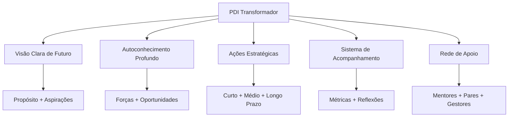

### Por que Muitos PDIs Falham?

Muitos planos de desenvolvimento tornam-se apenas documentos arquivados porque:

- **Falta conexão emocional**: Objetivos sem significado pessoal profundo
- **Ambição excessiva**: Metas irrealistas geram frustração e abandono
- **Isolamento**: Desenvolvimento sem apoio e feedback constante
- **Rigidez**: Incapacidade de adaptar-se a mudanças de contexto
- **Falta de sistematização**: Ausência de rotinas de revisão e ajuste

O PDI que realmente transforma carreiras é aquele que se torna parte integrada do dia a dia profissional, não apenas um exercício anual obrigatório.

> "Um grande produto começa com um problema real e uma visão clara de como resolvê-lo. Um PDI eficaz segue o mesmo princípio: começa com uma compreensão genuína de suas necessidades e uma visão inspiradora do profissional que você deseja se tornar."

---

## 🔍 Autoconhecimento: A Base do Desenvolvimento

### O Tripé do Autoconhecimento Profissional

Todo desenvolvimento significativo começa com uma compreensão clara de quem somos, onde estamos e para onde queremos ir. O tripé do autoconhecimento consiste em:

1. **Clareza sobre valores e propósito**
2. **Consciência de pontos fortes e áreas de desenvolvimento**
3. **Entendimento do impacto de nosso comportamento em diferentes contextos**

### Ferramentas Avançadas de Autodiagnóstico

#### 📊 Matriz SOAR vs. SWOT

A matriz SOAR (Strengths, Opportunities, Aspirations, Results) representa uma evolução da tradicional análise SWOT, com foco em elementos positivos e orientados ao futuro:

|SOAR|Foco|Exemplo Prático|
|---|---|---|
|**S**trengths (Forças)|O que fazemos excepcionalmente bem|"Minha capacidade de sintetizar dados complexos em narrativas claras"|
|**O**pportunities (Oportunidades)|Possibilidades no ambiente externo|"Crescente demanda por interpretação de dados na minha indústria"|
|**A**spirations (Aspirações)|O que queremos ser e alcançar|"Tornar-me referência em data storytelling em 2 anos"|
|**R**esults (Resultados)|Como o sucesso será mensurado|"Liderar projetos de análise estratégica com impacto mensurável"|

**Exercício Prático: Sua Matriz SOAR**

Dedique 20 minutos para completar sua matriz SOAR pessoal, buscando exemplos específicos e mensuráveis para cada quadrante.

#### 🔄 O Poder do Feedback Multidimensional

O feedback 360° estruturado oferece perspectivas valiosas sobre pontos cegos em nosso comportamento e performance. Para maximizar seu valor:

- **Diversifique as fontes**: Inclua gestores, pares, subordinados e até clientes
- **Estruture as perguntas**: Utilize questões específicas sobre comportamentos observáveis
- **Triangule os dados**: Busque padrões recorrentes mencionados por múltiplas fontes
- **Separe observação de interpretação**: Diferencie comportamentos relatados de suas possíveis causas

**Caso Ilustrativo:**

> Marina, gerente de produto, implementou um sistema trimestral de feedback 360° e descobriu que, embora fosse admirada por sua visão estratégica, sua comunicação era percebida como excessivamente técnica para stakeholders não-técnicos. Este insight a levou a desenvolver métodos de comunicação adaptados a diferentes audiências, resultando em maior alinhamento e engajamento das equipes cross-funcionais.

#### 🧠 Além dos Testes: Autoconhecimento Experiencial

Os testes comportamentais são ferramentas úteis, mas o verdadeiro autoconhecimento vem da experiência reflexiva:

- **Diário de situações críticas**: Registre detalhadamente situações desafiadoras, suas reações e resultados
- **Práticas contemplativas**: Meditação mindfulness para observação de padrões mentais
- **Experimentos comportamentais**: Teste conscientemente novas abordagens em situações controladas
- **Mentoria reversa**: Aprenda sobre si mesmo ao orientar outros com perspectivas diferentes

### Mapeamento de Competências: Abordagem Sistêmica

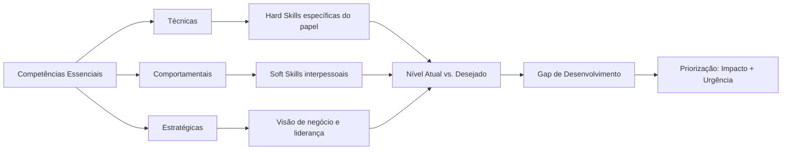

> "Os melhores desenvolvedores sabem que entender o problema é mais importante que conhecer a solução. Da mesma forma, no desenvolvimento pessoal, compreender profundamente a si mesmo precede qualquer plano de ação eficaz."

---

## 🎯 Objetivos que Inspiram e Transformam

### Além do SMART: Objetivos que Realmente Movem

Embora os objetivos SMART (Específicos, Mensuráveis, Atingíveis, Relevantes, Temporais) forneçam uma estrutura útil, objetivos verdadeiramente transformadores possuem elementos adicionais:

#### 🔥 A Abordagem HARD

|Elemento|Descrição|Exemplo|
|---|---|---|
|**H**eartfelt (Significativo)|Conexão emocional profunda|"Este objetivo ressoa com meus valores mais profundos"|
|**A**nimated (Vívido)|Visualização clara e detalhada|"Posso visualizar detalhadamente como será alcançá-lo"|
|**R**equired (Necessário)|Senso de urgência e importância|"Isto é fundamental para onde quero chegar"|
|**D**ifficult (Desafiador)|Esforço que exige crescimento|"Este objetivo me fará evoluir além da zona de conforto"|

#### 💫 Objetivos Transformacionais vs. Transacionais

|Objetivos Transacionais|Objetivos Transformacionais|
|---|---|
|Foco em métricas externas|Foco em transformação interna|
|"Concluir certificação X"|"Dominar conceitos que mudarão minha perspectiva"|
|"Obter promoção ao cargo Y"|"Desenvolver liderança que inspira outros"|
|Orientados a ações|Orientados a transformações de mindset|

### A Hierarquia de Objetivos: Alinhamento Vertical

Para maximizar impacto e consistência, seus objetivos devem seguir uma hierarquia clara:

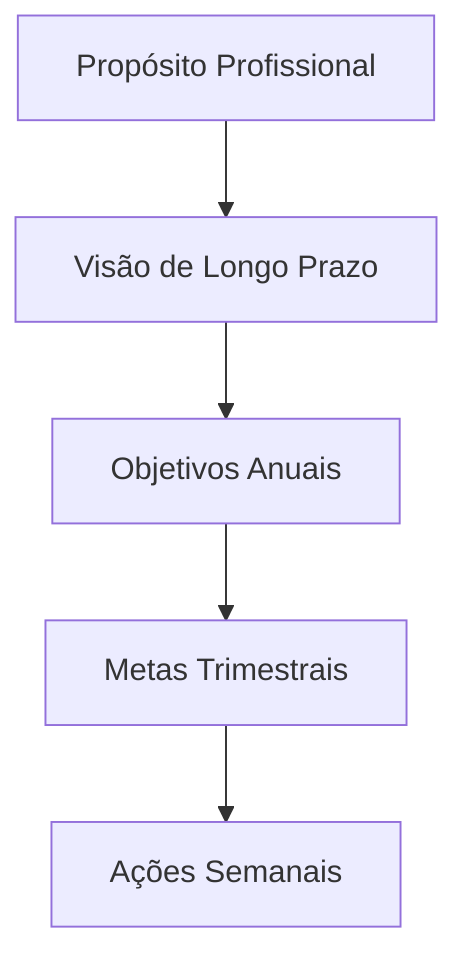

**Exercício de Alinhamento:**

1. Defina seu propósito profissional em uma frase
2. Visualize onde quer estar em 3-5 anos (seja específico)
3. Estabeleça 2-3 objetivos anuais que contribuam diretamente para essa visão
4. Decomponha cada objetivo anual em metas trimestrais tangíveis
5. Traduza a meta trimestral atual em ações semanais concretas

### O Poder dos Anti-Objetivos

Tão importante quanto definir o que queremos alcançar é clarificar o que deliberadamente escolhemos NÃO fazer:

**Exemplo:**

|Objetivo|Anti-Objetivo|
|---|---|
|Desenvolver liderança estratégica|NÃO buscarei dominar todos os detalhes técnicos|
|Aprofundar expertise em área específica|NÃO tentarei abraçar múltiplos domínios simultaneamente|
|Construir relações significativas|NÃO focarei em expandir rede de contatos quantitativamente|

> "As melhores visões de produto não apenas definem o que incluir, mas fazem escolhas corajosas sobre o que deixar de fora. Da mesma forma, um PDI excepcional requer foco e renúncias estratégicas."

---

## 🧩 Estratégias de Planejamento para Resultados Extraordinários

### Modelos Integrados de Desenvolvimento

#### 📋 O Framework CEP+R Aprofundado

O modelo CEP+R (Conteúdo, Experiência, Pessoas e Redes) oferece uma abordagem holística para desenvolvimento profissional:

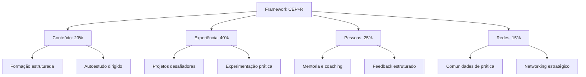

**Exemplo de Aplicação Prática**

Para o objetivo "Tornar-se um líder de produto centrado no cliente":

|Componente|Proporção|Atividades Específicas|
|---|---|---|
|**Conteúdo**|20%|• Curso "Product Leadership" na universidade corporativa • Leitura de 1 livro mensal sobre design thinking e comportamento do cliente • Assinatura de newsletters especializadas|
|**Experiência**|40%|• Liderar um projeto de discovery com usuários reais • Implementar sistema de feedback contínuo de clientes • Conduzir 5 entrevistas mensais com usuários|
|**Pessoas**|25%|• Sessões mensais com mentor sênior em UX • Shadowing com líderes de produto em outras equipes • Feedback quinzenal sobre decisões de produto|
|**Redes**|15%|• Participação ativa em comunidade de product managers • Apresentações em meetups internos • Contribuições em fóruns especializados|

#### 🔄 Modelo 70/20/10 Reimaginado

O clássico modelo 70/20/10 pode ser adaptado para o contexto atual de trabalho híbrido e aprendizado contínuo:

|Dimensão|Abordagem Tradicional|Abordagem Contemporânea|
|---|---|---|
|**70%** Experiência|Aprendizado no trabalho diário|Projetos intencionais desafiadores + Experimentação protegida|
|**20%** Social|Feedback informal e observação|Coaching estruturado + Comunidades de prática|
|**10%** Formal|Cursos e treinamentos|Microlearning contínuo + Aprendizado adaptativo|

### Planejamento Sistemático: Além do 5W2H

O framework 5W2H (O quê, Por quê, Onde, Quando, Quem, Como, Quanto) fornece uma base sólida que pode ser aprimorada com elementos adicionais:

#### 📊 Framework 5W2H+I+R

|Elemento|Questão-chave|Exemplo Aplicado|
|---|---|---|
|**What** (O quê)|O que preciso desenvolver?|Habilidades de facilitação para reuniões complexas|
|**Why** (Por quê)|Por que isso é importante?|Para aumentar produtividade e engajamento em decisões críticas|
|**Where** (Onde)|Em quais contextos aplicarei?|Reuniões interdepartamentais e workshops de cocriação|
|**When** (Quando)|Qual o cronograma de desenvolvimento?|Próximos 4 meses, com marcos mensais de progresso|
|**Who** (Quem)|Quem pode apoiar este desenvolvimento?|Mentor especialista em facilitação + coach de comunicação|
|**How** (Como)|Quais métodos específicos utilizarei?|Curso de facilitação + prática gradual em contextos reais|
|**How much** (Quanto)|Qual investimento necessário?|5h semanais + R$X em recursos + energia emocional para errar e aprender|
|**Impact** (Impacto)|Qual transformação esperada?|Decisões 30% mais rápidas e aumento em 40% no engajamento das equipes|
|**Risks** (Riscos)|Quais obstáculos devo antecipar?|Resistência inicial das equipes + sobrecarga do calendário|

> "Assim como o desenvolvimento de software requer sistemas para gerenciar complexidade, o desenvolvimento profissional necessita de frameworks que transformem aspirações abstratas em ações concretas e mensuráveis."

---

## 🛠️ Da Teoria à Prática: Implementação Efetiva

### O Plano de Implementação Estruturado

Um PDI excepcional precisa de um sistema de implementação igualmente robusto:

#### 🗓️ Ritmos de Execução e Revisão

Estabeleça ciclos definidos para diferentes níveis de atividades:

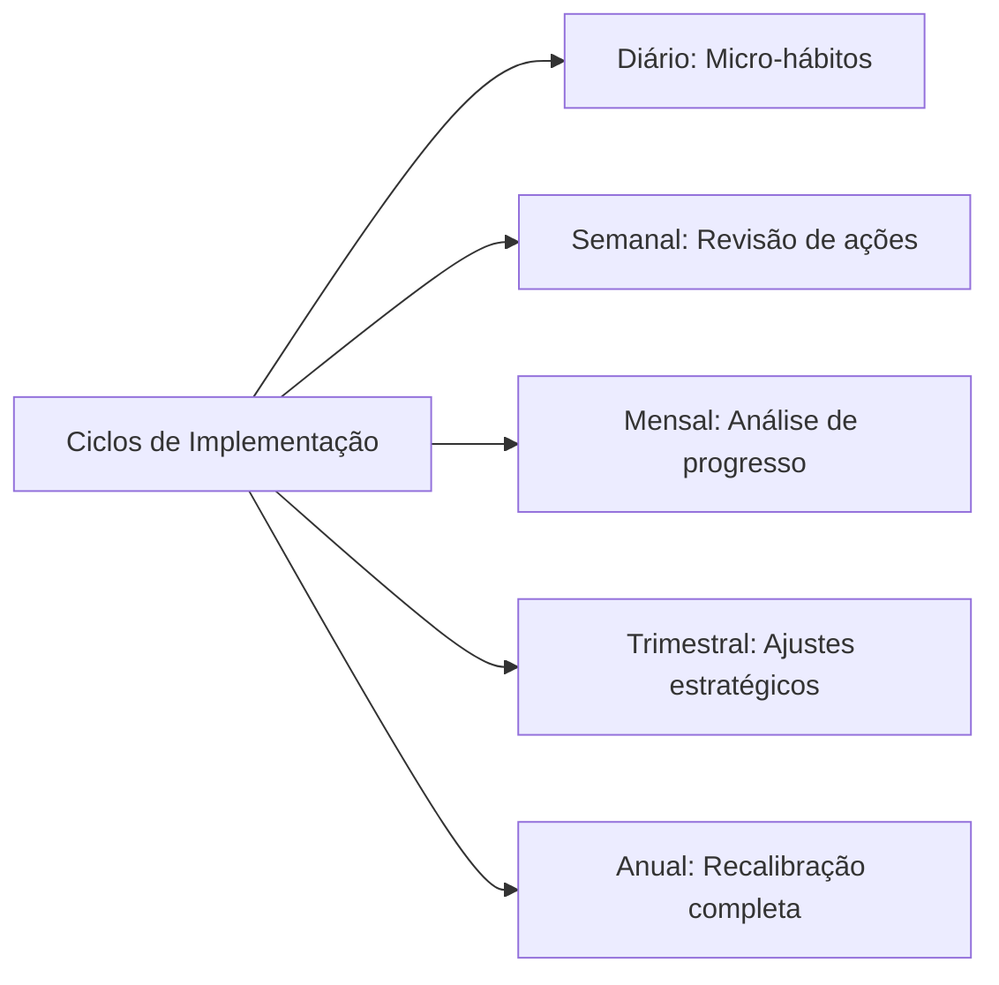

**Sistema de Implementação Diária:**

1. **Ritual matinal** (5-10 min): Revisar prioridades de desenvolvimento do dia
2. **Blocos protegidos** (30-90 min): Tempo dedicado exclusivamente a atividades de desenvolvimento
3. **Micro-momentos** (5-10 min): Oportunidades ao longo do dia para prática deliberada
4. **Reflexão noturna** (5-10 min): Registro de aprendizados e planejamento do dia seguinte

#### 📈 Exemplo de Plano de Implementação Detalhado

Para o objetivo "Desenvolver competências avançadas em storytelling com dados":

|Horizonte|Atividades de Desenvolvimento|Sistema de Acompanhamento|
|---|---|---|
|**Diário**|• 15 min de estudo de visualizações exemplares • Aplicação consciente em pelo menos 1 comunicação|Checklist diário com registro de insights|
|**Semanal**|• 1 hora dedicada a curso online • Análise crítica de 1 dashboard ou apresentação|Revisão de progresso com par de accountability|
|**Mensal**|• Criação de 1 visualização complexa • Sessão de feedback com especialista|Documentação estruturada de evolução com exemplos|
|**Trimestral**|• Projeto aplicado com stakeholders reais • Avaliação formal de competência|Retrospectiva detalhada com mentor|

### Sistemas de Hábitos para Desenvolvimento Sustentável

O desenvolvimento contínuo depende da formação de hábitos consistentes, não apenas de ações pontuais:

#### 🔄 O Loop de Hábitos Profissionais

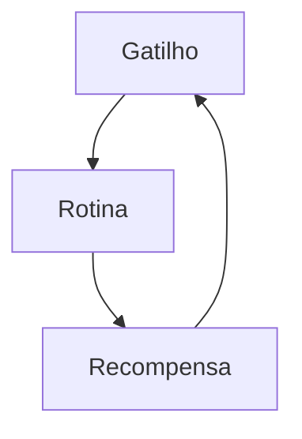

**Aplicação Prática:**

|Componente|Descrição|Exemplo para "Desenvolver Escuta Ativa"|
|---|---|---|
|**Gatilho**|Sinal que inicia o comportamento|Início de cada reunião ou conversa 1:1|
|**Rotina**|Comportamento a ser desenvolvido|Protocolo estruturado: (1) Contato visual, (2) Perguntas abertas, (3) Paráfrase para confirmação|
|**Recompensa**|Benefício imediato percebido|Auto-reconhecimento + registro de insights valiosos obtidos|

#### 🏗️ Scaffolding: Suporte Progressivo para Novos Comportamentos

Desenvolva sistemas de suporte que podem ser gradualmente removidos:

1. **Suporte máximo**: Usar checklists detalhados + acompanhamento direto
2. **Suporte moderado**: Lembretes estratégicos + revisão periódica
3. **Suporte mínimo**: Gatilhos ambientais sutis
4. **Autonomia**: Comportamento integrado ao seu modo natural de operação

> "O melhor código é aquele que funciona não apenas no ambiente de desenvolvimento, mas no mundo real, sob condições variáveis. Da mesma forma, o melhor PDI é aquele que sobrevive ao contato com a realidade caótica do dia a dia profissional."

---

## 📊 Mensuração de Progresso: Além dos Números

### Métricas Multidimensionais de Desenvolvimento

A mensuração efetiva de desenvolvimento profissional transcende indicadores simplistas:

#### 🎯 Framework de Indicadores Balanceados

|Tipo de Métrica|Descrição|Exemplos|
|---|---|---|
|**Métricas de Esforço**|Quantificam a dedicação ao desenvolvimento|• Horas investidas • Consistência de práticas • Quantidade de iterações|
|**Métricas de Progresso**|Avaliam evolução em competências específicas|• Avaliações estruturadas • Feedback comparativo • Auto-avaliações calibradas|
|**Métricas de Aplicação**|Medem a transferência para contextos reais|• Frequência de aplicação • Qualidade de implementação • Adaptabilidade contextual|
|**Métricas de Resultado**|Avaliam o impacto nos objetivos finais|• KPIs de performance • Feedback de stakeholders • Novas oportunidades geradas|

#### 📉 Curvas de Aprendizado: Expectativas Realistas

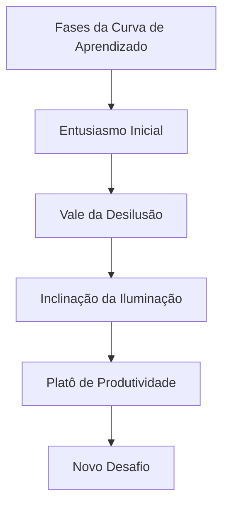

**Estratégias para Cada Fase:**

|Fase|Características|Abordagens Recomendadas|
|---|---|---|
|**Entusiasmo Inicial**|Alta motivação, resultados rápidos|Celebrar pequenas vitórias, estabelecer fundamentos|
|**Vale da Desilusão**|Frustração, percepção de estagnação|Suporte intensificado, recordar propósito maior|
|**Inclinação da Iluminação**|Padrões começam a emergir|Buscar aplicações mais complexas, conectar conceitos|
|**Platô de Produtividade**|Competência estabilizada|Ensinar outros, identificar refinamentos sutis|
|**Novo Desafio**|Risco de estagnação|Estabelecer próximo nível de maestria ou nova competência|

### Documentação Reflexiva de Jornada

Para além de métricas, o desenvolvimento profissional beneficia-se de práticas reflexivas estruturadas:

#### 📓 Protocolo de Reflexão Estruturada

**Template para Reflexão Periódica:**

1. **Realizações significativas**: O que realizei que representa progresso?
2. **Insights transformadores**: Quais descobertas mudaram minha perspectiva?
3. **Padrões observados**: Que comportamentos recorrentes identifiquei?
4. **Obstáculos enfrentados**: Quais desafios encontrei e como respondi?
5. **Ajustes necessários**: O que preciso modificar em minha abordagem?
6. **Próximos passos**: Quais ações específicas decorrentes desta reflexão?

> "As melhores métricas não apenas medem resultados, mas iluminam o caminho à frente. No desenvolvimento profissional, as medições mais valiosas são aquelas que geram insights acionáveis para o próximo ciclo de crescimento."

---

## 🔄 A Cultura de Feedback Contínuo

### Além do Feedback Tradicional

O feedback eficaz para desenvolvimento vai muito além de avaliações formais:

#### 🔍 Níveis de Profundidade do Feedback

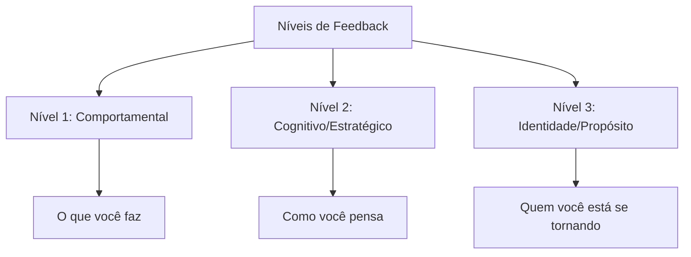

**Exemplos Práticos:**

|Nível|Exemplo de Feedback|Valor para Desenvolvimento|
|---|---|---|
|**Comportamental**|"Observei que você interrompe frequentemente em reuniões"|Identifica padrões concretos para ajustes imediatos|
|**Cognitivo**|"Percebo que você prioriza eficiência sobre construção de consenso"|Revela modelos mentais e vieses subjacentes|
|**Identidade**|"Suas ações refletem alguém comprometido com excelência, mas talvez às custas de colaboração"|Conecta comportamentos a valores e aspirações profundas|

#### 📝 Protocolo de Feedback para Desenvolvimento

Para maximizar o valor do feedback no contexto de PDI:

1. **Preparação contextual**: "Estou desenvolvendo X competência e valorizo feedback específico"
2. **Solicitação direcionada**: "Pode observar especificamente como eu [comportamento específico]?"
3. **Escuta ativa**: Foco total na perspectiva do outro, sem defesa ou justificativa
4. **Exploração de nuances**: "Pode me dar um exemplo específico?" ou "Como isso impacta Y?"
5. **Conexão com PDI**: "Como isso se relaciona com meu objetivo de desenvolvimento X?"
6. **Ação imediata**: Compromisso com um experimento específico baseado no feedback

### Criando Ciclos Virtuosos de Desenvolvimento

#### 🔄 O Loop de Feedback Integrado ao Cotidiano

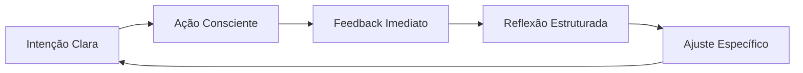

**Exemplos de Implementação:**

|Estágio|Prática Concreta|Ferramenta de Suporte|
|---|---|---|
|**Intenção Clara**|Definir foco de desenvolvimento para a semana|Template de planejamento semanal|
|**Ação Consciente**|Aplicar deliberadamente em situações específicas|Lembretes contextuais estratégicos|
|**Feedback Imediato**|Solicitar micro-feedbacks após interações-chave|Perguntas padronizadas de 1 minuto|
|**Reflexão Estruturada**|Documentar padrões e insights regularmente|Diário de aprendizado digital|
|**Ajuste Específico**|Implementar mudança pontual baseada em insights|Experimentos comportamentais de 7 dias|

> "O feedback é como um espelho necessário para nosso desenvolvimento. Sem ele, estamos navegando às cegas, baseados apenas em nossas próprias percepções limitadas. Um PDI excepcional incorpora mecanismos robustos para capturar e integrar múltiplas perspectivas."

---

## 💻 PDI na Era Digital: Ferramentas e Recursos

### Ecossistema Digital para Desenvolvimento Profissional

O avanço tecnológico democratizou o acesso a ferramentas poderosas para apoiar cada fase do PDI:

#### 🧰 Stack Tecnológico para PDI Integrado

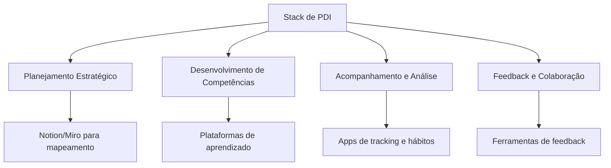

**Recomendações de Ferramentas por Categoria:**

|Categoria|Ferramentas Recomendadas|Aplicação no PDI|
|---|---|---|
|**Planejamento**|• Notion • Miro • Trello/Asana|Estruturação visual do plano, OKRs de desenvolvimento|
|**Aprendizado**|• LinkedIn Learning • Coursera • Mentorly|Desenvolvimento estruturado de competências técnicas e comportamentais|
|**Hábitos e Tracking**|• Habitica • Loop Habit Tracker • Todoist|Consistência em práticas diárias de desenvolvimento|
|**Reflexão e Documentação**|• Day One • Roam Research • Evernote|Diários de aprendizado e conexão de insights|
|**Feedback**|• 15Five • Matter • Culture Amp|Captura sistemática de perspectivas externas|

#### 🤖 IA como Parceira de Desenvolvimento

Inteligência artificial oferece novas possibilidades para potencializar seu PDI:

|Aplicação de IA|Descrição|Exemplos de Uso|
|---|---|---|
|**Assistentes de Reflexão**|IAs que facilitam processos reflexivos estruturados|Sessões de debriefing após experiências importantes|
|**Curadoria de Conteúdo**|Sistemas que personalizam recursos de aprendizado|Recomendações adaptativas baseadas em objetivos|
|**Análise de Padrões**|Identificação de tendências em comportamentos e resultados|Insights sobre eficácia de diferentes abordagens|
|**Simulação de Cenários**|Ambientes virtuais para prática segura|Treinamento de conversas difíceis ou apresentações|

### Integração Tecnológica Humanizada

Em meio a tantas possibilidades tecnológicas, mantenha princípios fundamentais:

1. **Foco no propósito, não nas ferramentas**: Tecnologia como meio, não como fim
2. **Simplicidade sustentável**: Prefira sistemas que você manterá consistentemente
3. **Conexão humana**: Complemente, não substitua interações pessoais significativas
4. **Experimentação iterativa**: Teste novas abordagens em ciclos curtos de aprendizado

> "A tecnologia é mais valiosa quando amplifica nossas capacidades humanas fundamentais. No contexto do PDI, as melhores ferramentas são aquelas que nos ajudam a pensar com mais clareza, agir com mais intencionalidade e aprender com mais profundidade."

---

## 📚 Casos de Sucesso: Histórias Inspiradoras

### Transformações Reais Através de PDIs Eficazes

#### 📊 Caso 1: A Jornada de Liderança de Ana

**Contexto Inicial:** Ana, uma especialista técnica excepcional, foi promovida a líder de equipe, mas enfrentava desafios significativos na transição de contribuidora individual para gestora de pessoas.

**Abordagem de PDI:** Ana implementou um plano focado em três pilares: comunicação empática, feedback eficaz e delegação estratégica.

**Elementos-chave do PDI:**

- Mentoria quinzenal com líder sênior
- Curso formal de liderança com prática supervisionada
- "Laboratório de liderança": experimentação de técnicas em projetos controlados
- Feedback 360° trimestral para ajustes de abordagem

**Resultados em 12 meses:**

- Aumento de 40% no engajamento da equipe
- Redução de 25% em retrabalho através de delegação mais eficaz
- Promoção para posição de gerência sênior
- Desenvolvimento de framework interno de transição para liderança

**Lições aprendidas:**

> "Meu maior aprendizado foi entender que liderança eficaz não se trata de ter todas as respostas, mas de fazer as perguntas certas e criar um ambiente onde a equipe possa prosperar. O PDI me forneceu estrutura para transformar essa compreensão em práticas diárias concretas." - Ana

#### 📈 Caso 2: A Reinvenção Profissional de Carlos

**Contexto Inicial:** Carlos, após 15 anos em marketing tradicional, percebeu a necessidade de se reinventar em um mercado cada vez mais digital e orientado a dados.

**Abordagem de PDI:** Carlos desenvolveu um plano de transição de dois anos para se tornar um profissional de marketing orientado a dados sem abandonar sua experiência estratégica.

**Elementos-chave do PDI:**

- Imersão técnica: cursos formais de análise de dados e automação de marketing
- Projetos paralelos: aplicações práticas em iniciativas de menor escala
- Comunidade: participação ativa em grupos de marketing digital
- Mentoria reversa: troca de conhecimentos com profissionais digitais juniores

**Resultados:**

- Transição bem-sucedida para função de estrategista de marketing digital
- Desenvolvimento de metodologia híbrida combinando abordagens tradicionais e digitais
- Aumento de 35% em remuneração
- Estabelecimento como palestrante em eventos do setor

**Lições aprendidas:**

> "O PDI me permitiu transformar o que poderia ser uma crise de meia-carreira em uma oportunidade de crescimento. A chave foi manter minha essência estratégica enquanto desenvolvia novas competências técnicas relevantes, sempre com cronograma e metas realistas." - Carlos

### Padrões Comuns em PDIs Transformadores

Analisando múltiplos casos de sucesso, emergem padrões consistentes:

|Elemento|Descrição|Exemplos Práticos|
|---|---|---|
|**Diagnóstico Honesto**|Avaliação realista do ponto de partida|Análise de competências com feedback externo|
|**Visão Inspiradora**|Objetivo claro e emocionalmente significativo|Definição de "história de sucesso" pessoal|
|**Plano Estruturado**|Estratégia detalhada mas adaptável|Roadmap de desenvolvimento com marcos claros|
|**Apoio Multidimensional**|Rede de suporte diversificada|Combinação de mentores, pares e recursos formais|
|**Prática Deliberada**|Aplicação consciente e reflexiva|Experimentos regulares com feedback imediato|
|**Celebração de Progresso**|Reconhecimento de avanços incrementais|Rituais pessoais de celebração de marcos|

> "Os produtos mais revolucionários não emergem de ideia súbitas, mas de processos deliberados de desenvolvimento com experimentação contínua. O mesmo princípio aplica-se ao desenvolvimento profissional excepcional."

---

## 👥 PDI para Líderes: Desenvolvendo Pessoas

### A Dupla Responsabilidade dos Líderes

Líderes eficazes assumem responsabilidade tanto por seu próprio desenvolvimento quanto por cultivar o crescimento de suas equipes:

#### 🌱 O Modelo de Liderança para Desenvolvimento

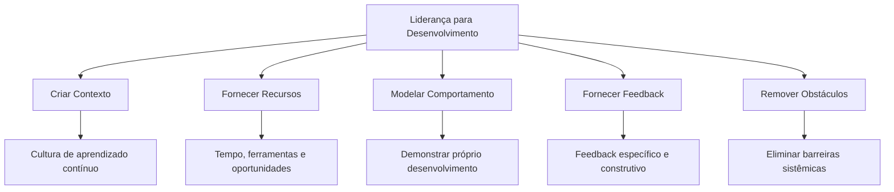

### Práticas Concretas para Líderes-Desenvolvedores

|Prática|Descrição|Implementação|
|---|---|---|
|**Conversas de Desenvolvimento**|Diálogos estruturados focados em crescimento|Sessões mensais dedicadas exclusivamente a desenvolvimento, separadas de discussões de performance|
|**Design de Experiências**|Criação intencional de oportunidades de aprendizado|Atribuição de projetos progressivamente desafiadores alinhados com objetivos de desenvolvimento|
|**Coaching Situacional**|Adaptação do estilo de liderança ao nível de desenvolvimento|Ajuste consciente entre direcionamento, coaching, suporte e delegação baseado nas necessidades específicas|
|**Feedback Baseado em Forças**|Foco em potencializar pontos fortes|Identificação sistemática e ampliação de talentos naturais, complementada por estratégias para gerenciar limitações|

#### 📝 Roteiro para Conversas de Desenvolvimento

**Estrutura recomendada para líderes:**

1. **Conexão pessoal** (5-10 min)
    
    - "Como você está se sentindo sobre seu desenvolvimento recentemente?"
    - "O que tem sido mais energizante no seu trabalho?"
2. **Reflexão sobre progresso** (10-15 min)
    
    - "Quais avanços você percebe desde nossa última conversa?"
    - "Que insights surgiram das experiências recentes?"
3. **Exploração de desafios** (10-15 min)
    
    - "Onde você está encontrando obstáculos?"
    - "Que recursos ou apoio seriam úteis?"
4. **Alinhamento com aspirações** (10-15 min)
    
    - "Como as experiências atuais conectam-se com suas aspirações de longo prazo?"
    - "Que oportunidades você gostaria de explorar nos próximos meses?"
5. **Compromissos mútuos** (5-10 min)
    
    - "Quais serão seus próximos passos específicos?"
    - "Como posso apoiar você de forma mais eficaz?"

### Cultura Organizacional de Desenvolvimento

O impacto de líderes é amplificado quando suas práticas se integram à cultura organizacional:

|Elemento Cultural|Descrição|Práticas de Sustentação|
|---|---|---|
|**Tempo Protegido**|Dedicação formal de tempo para desenvolvimento|20% do tempo para aprendizado e experimentação|
|**Aprendizado Público**|Normalização de compartilhar jornadas de desenvolvimento|Sessões regulares de "lições aprendidas"|
|**Feedback Abundante**|Sistemas para feedback frequente e multidirecional|Ferramentas digitais + práticas presenciais|
|**Experimentação Segura**|Tolerância a erros como parte do processo de aprendizado|"Zonas seguras" para testar novas abordagens|

> "Os melhores líderes entendem que seu legado mais duradouro não está nos resultados de curto prazo, mas nas pessoas que ajudaram a se desenvolver. Eles tratam o desenvolvimento de talentos não como uma responsabilidade secundária, mas como sua contribuição mais fundamental."

---

## 🚀 O Futuro do Desenvolvimento Profissional

### Tendências Emergentes e Implicações

O futuro do desenvolvimento profissional está sendo moldado por forças transformadoras:

#### 🔮 Forças Disruptivas e Oportunidades

|Tendência|Descrição|Implicações para PDIs|
|---|---|---|
|**IA e Automação**|Transformação radical de funções e competências|Foco em habilidades distintivamente humanas + colaboração com sistemas inteligentes|
|**Trabalho Distribuído**|Normalização de equipes globais e remotas|Desenvolvimento de colaboração assíncrona e presença digital|
|**Carreiras Não-Lineares**|Substituição de trajetórias verticais por percursos multidirecionais|PDIs focados em portfolios de competências transferíveis|
|**Aprendizado Contínuo**|Necessidade de atualização constante de conhecimentos|Sistemas de microaprendizado integrados ao fluxo de trabalho|

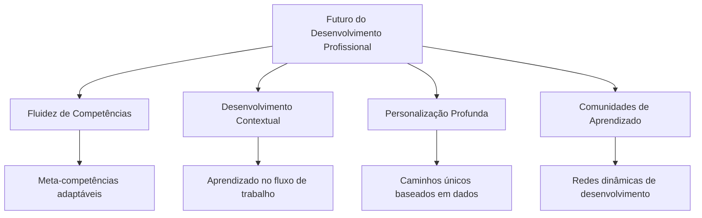

### A Evolução do PDI: Da Ferramenta ao Sistema

O PDI do futuro transcenderá documentos estáticos, transformando-se em sistemas adaptativos de desenvolvimento:

|PDI Tradicional|PDI do Futuro|
|---|---|
|Documento estático revisado anualmente|Sistema dinâmico com ajustes contínuos|
|Foco em competências específicas|Ênfase em adaptabilidade e meta-aprendizado|
|Desenvolvido principalmente com gestor|Co-criado com rede diversificada de stakeholders|
|Baseado em papéis predefinidos|Orientado por propósito e impacto desejado|
|Avaliação periódica de progresso|Feedback contínuo em tempo real|

#### 🧠 Meta-Competências para um Futuro Incerto

O desenvolvimento mais valioso focará em meta-competências que permitam adaptação constante:

|Meta-Competência|Descrição|Práticas de Desenvolvimento|
|---|---|---|
|**Aprender a Aprender**|Capacidade de adquirir rapidamente novos conhecimentos|Experimentação com diferentes métodos de aprendizado|
|**Adaptabilidade Contextual**|Flexibilidade para operar em ambientes variados|Exposição deliberada a contextos diversos|
|**Pensamento Sistêmico**|Compreensão de interconexões complexas|Mapeamento de sistemas e análise de efeitos em rede|
|**Inteligência Emocional Avançada**|Navegação sofisticada de dinâmicas humanas|Práticas contemplativas e feedback interpessoal|
|**Colaboração Humano-IA**|Capacidade de trabalhar efetivamente com sistemas inteligentes|Experimentação contínua com ferramentas emergentes|

> "O verdadeiro teste de um PDI não é o quão bem ele funciona nas condições atuais, mas o quão bem ele o prepara para um futuro que ainda não podemos prever completamente."

---

## 🔄 Autoavaliação e Próximos Passos

### Diagnóstico: Seu PDI Atual

Antes de avançar, avalie a maturidade de sua abordagem atual:

#### 📊 Avaliação de Maturidade do PDI

|Dimensão|Nível 1: Básico|Nível 2: Estruturado|Nível 3: Estratégico|Nível 4: Transformador|
|---|---|---|---|---|
|**Clareza de Propósito**|Objetivos vagos|Metas específicas|Alinhamento com visão pessoal|Propósito inspirador integrado|
|**Abrangência**|Foco em lacunas técnicas|Equilíbrio técnico-comportamental|Desenvolvimento holístico|Sistema integrado de evolução|
|**Planejamento**|Ações informais|Plano estruturado|Estratégia adaptativa|Sistema dinâmico de desenvolvimento|
|**Mensuração**|Sem métricas claras|KPIs definidos|Métricas multidimensionais|Sistema de feedback contínuo|
|**Implementação**|Esporádica|Consistente|Integrada ao cotidiano|Incorporada como segunda natureza|

**Exercício:** Avalie honestamente seu nível atual em cada dimensão e identifique uma área prioritária para evolução.

### Seu Roteiro Personalizado

Independente de seu ponto de partida, estes são os próximos passos recomendados:

#### 🗺️ Jornada de Implementação em 30-60-90 Dias

|Horizonte|Ações Específicas|Resultados Esperados|
|---|---|---|
|**Primeiros 30 dias**|• Diagnóstico abrangente (SOAR) • Entrevistas com 3-5 stakeholders • Definição de visão e objetivos iniciais|Clareza de direção e compreensão de ponto de partida|
|**60 dias**|• Implementação de sistema de tracking • Estabelecimento de rituais semanais • Início de prática deliberada em 1-2 áreas-chave|Primeiros sinais de mudança comportamental e feedback inicial|
|**90 dias**|• Primeira revisão formal de progresso • Ajustes baseados em feedback acumulado • Elaboração de plano para próximo trimestre|Evidências mensuráveis de crescimento e sistema sustentável|

### Compromisso e Ação

O PDI mais sofisticado nada vale sem implementação consistente. Para maximizar suas chances de sucesso:

1. **Declare sua intenção**: Compartilhe seu compromisso com pessoas que o apoiarão
2. **Crie contexto favorável**: Reestruture seu ambiente para facilitar novos comportamentos
3. **Estabeleça accountability**: Defina parceiros ou grupos para revisões regulares
4. **Comece pequeno**: Foque inicialmente em 1-2 mudanças de alto impacto
5. **Celebre progresso**: Reconheça e comemore avanços, por menores que sejam

> "O desenvolvimento profissional excepcional não é resultado de grandes gestos ocasionais, mas de pequenas ações consistentes alinhadas a uma visão clara. Comece onde você está, use o que você tem, e dê o primeiro passo hoje."

---

## 📚 Recursos Adicionais

### Leituras Recomendadas

- "Mindset: A Nova Psicologia do Sucesso" - Carol Dweck
- "Atomic Habits" - James Clear
- "Deep Work" - Cal Newport
- "Designing Your Life" - Bill Burnett e Dave Evans
- "The Coaching Habit" - Michael Bungay Stanier

### Ferramentas e Templates

- [Template de PDI Abrangente (Notion)](https://www.notion.so/)
- [Workbook de Autodiagnóstico SOAR](https://www.example.com/)
- [Sistema de Tracking de Desenvolvimento (Airtable)](https://www.airtable.com/)
- [Framework para Feedback 360° (Google Forms)](https://forms.google.com/)

### Comunidades de Aprendizado

- [Comunidade de Desenvolvimento Profissional](https://www.example.com/)
- [Grupo de Accountability para PDI](https://www.example.com/)

---

## 🙏 Agradecimentos

Obrigado por investir tempo neste guia transformador de PDI. Lembre-se de que o desenvolvimento profissional é uma jornada, não um destino. Cada passo que você dá em direção ao seu melhor eu profissional não apenas transforma sua carreira, mas também impacta positivamente todos ao seu redor.

Desejamos a você uma jornada de desenvolvimento inspiradora e transformadora!

---

© 2025 | PDI Transformador: Guia Definitivo para Desenvolvimento Profissional e Pessoal