# 📘 PDI TRANSFORMADOR: O Guia Definitivo para Líderes Técnicos

> _"O desenvolvimento profissional não é um destino, mas uma jornada contínua. Na era da transformação digital acelerada, quem não evolui deliberadamente, involuntariamente retrocede."_

---

## 📋 Sumário

1. [Introdução: A Jornada de Transformação](https://claude.ai/chat/6341fcb9-1eaa-4d92-b448-7c68122bb3ba#introdu%C3%A7%C3%A3o-a-jornada-de-transforma%C3%A7%C3%A3o)
2. [PDI: Muito Além de um Documento](https://claude.ai/chat/6341fcb9-1eaa-4d92-b448-7c68122bb3ba#pdi-muito-al%C3%A9m-de-um-documento)
3. [Autoconhecimento: A Base do Desenvolvimento](https://claude.ai/chat/6341fcb9-1eaa-4d92-b448-7c68122bb3ba#autoconhecimento-a-base-do-desenvolvimento)
4. [O Paradoxo do Líder Técnico](https://claude.ai/chat/6341fcb9-1eaa-4d92-b448-7c68122bb3ba#o-paradoxo-do-l%C3%ADder-t%C3%A9cnico)
5. [Objetivos que Inspiram e Transformam](https://claude.ai/chat/6341fcb9-1eaa-4d92-b448-7c68122bb3ba#objetivos-que-inspiram-e-transformam)
6. [PDI Centrado em Impacto](https://claude.ai/chat/6341fcb9-1eaa-4d92-b448-7c68122bb3ba#pdi-centrado-em-impacto)
7. [Estratégias de Planejamento para Resultados Extraordinários](https://claude.ai/chat/6341fcb9-1eaa-4d92-b448-7c68122bb3ba#estrat%C3%A9gias-de-planejamento-para-resultados-extraordin%C3%A1rios)
8. [Da Teoria à Prática: Implementação Efetiva](https://claude.ai/chat/6341fcb9-1eaa-4d92-b448-7c68122bb3ba#da-teoria-%C3%A0-pr%C3%A1tica-implementa%C3%A7%C3%A3o-efetiva)
9. [Implementação Ágil do PDI](https://claude.ai/chat/6341fcb9-1eaa-4d92-b448-7c68122bb3ba#implementa%C3%A7%C3%A3o-%C3%A1gil-do-pdi)
10. [Mensuração de Progresso: Além dos Números](https://claude.ai/chat/6341fcb9-1eaa-4d92-b448-7c68122bb3ba#mensura%C3%A7%C3%A3o-de-progresso-al%C3%A9m-dos-n%C3%BAmeros)
11. [A Cultura de Feedback Contínuo](https://claude.ai/chat/6341fcb9-1eaa-4d92-b448-7c68122bb3ba#a-cultura-de-feedback-cont%C3%ADnuo)
12. [PDI para Diferentes Momentos de Carreira](https://claude.ai/chat/6341fcb9-1eaa-4d92-b448-7c68122bb3ba#pdi-para-diferentes-momentos-de-carreira)
13. [Neurociência do Aprendizado para PDIs Excepcionais](https://claude.ai/chat/6341fcb9-1eaa-4d92-b448-7c68122bb3ba#neuroci%C3%AAncia-do-aprendizado-para-pdis-excepcionais)
14. [PDI na Era da Fragmentação da Atenção](https://claude.ai/chat/6341fcb9-1eaa-4d92-b448-7c68122bb3ba#pdi-na-era-da-fragmenta%C3%A7%C3%A3o-da-aten%C3%A7%C3%A3o)
15. [O Novo Contexto Tecnológico: Desafios e Oportunidades](https://claude.ai/chat/6341fcb9-1eaa-4d92-b448-7c68122bb3ba#o-novo-contexto-tecnol%C3%B3gico-desafios-e-oportunidades)
16. [Microaprendizado Estratégico](https://claude.ai/chat/6341fcb9-1eaa-4d92-b448-7c68122bb3ba#microaprendizado-estrat%C3%A9gico)
17. [PDI no Ambiente Híbrido/Remoto](https://claude.ai/chat/6341fcb9-1eaa-4d92-b448-7c68122bb3ba#pdi-no-ambiente-h%C3%ADbridoremoto)
18. [Desenvolvimento Imersivo: RV, RA e Simulações](https://claude.ai/chat/6341fcb9-1eaa-4d92-b448-7c68122bb3ba#desenvolvimento-imersivo-rv-ra-e-simula%C3%A7%C3%B5es)
19. [Gamificação e Narrativa no Desenvolvimento Profissional](https://claude.ai/chat/6341fcb9-1eaa-4d92-b448-7c68122bb3ba#gamifica%C3%A7%C3%A3o-e-narrativa-no-desenvolvimento-profissional)
20. [Sinergia entre IA e Desenvolvimento Humano](https://claude.ai/chat/6341fcb9-1eaa-4d92-b448-7c68122bb3ba#sinergia-entre-ia-e-desenvolvimento-humano)
21. [PDI Baseado em Dados: Abordagem Analítica](https://claude.ai/chat/6341fcb9-1eaa-4d92-b448-7c68122bb3ba#pdi-baseado-em-dados-abordagem-anal%C3%ADtica)
22. [Desenvolvimento para Neurodiversidade e Inclusão](https://claude.ai/chat/6341fcb9-1eaa-4d92-b448-7c68122bb3ba#desenvolvimento-para-neurodiversidade-e-inclus%C3%A3o)
23. [Micro-credentials e Aprendizado Modular](https://claude.ai/chat/6341fcb9-1eaa-4d92-b448-7c68122bb3ba#micro-credentials-e-aprendizado-modular)
24. [Comunidades de Prática Potencializadas](https://claude.ai/chat/6341fcb9-1eaa-4d92-b448-7c68122bb3ba#comunidades-de-pr%C3%A1tica-potencializadas)
25. [O Framework ELITE para Líderes Técnicos](https://claude.ai/chat/6341fcb9-1eaa-4d92-b448-7c68122bb3ba#o-framework-elite-para-l%C3%ADderes-t%C3%A9cnicos)
26. [O PDI Integrado: Bem-estar e Performance](https://claude.ai/chat/6341fcb9-1eaa-4d92-b448-7c68122bb3ba#o-pdi-integrado-bem-estar-e-performance)
27. [Biohacking para Performance Cognitiva](https://claude.ai/chat/6341fcb9-1eaa-4d92-b448-7c68122bb3ba#biohacking-para-performance-cognitiva)
28. [PDI para Líderes: Desenvolvendo Pessoas](https://claude.ai/chat/6341fcb9-1eaa-4d92-b448-7c68122bb3ba#pdi-para-l%C3%ADderes-desenvolvendo-pessoas)
29. [Casos de Transformação no Setor Tech](https://claude.ai/chat/6341fcb9-1eaa-4d92-b448-7c68122bb3ba#casos-de-transforma%C3%A7%C3%A3o-no-setor-tech)
30. [O Futuro do Desenvolvimento Profissional](https://claude.ai/chat/6341fcb9-1eaa-4d92-b448-7c68122bb3ba#o-futuro-do-desenvolvimento-profissional)
31. [Ferramentas e Recursos Práticos](https://claude.ai/chat/6341fcb9-1eaa-4d92-b448-7c68122bb3ba#ferramentas-e-recursos-pr%C3%A1ticos)
32. [Autoavaliação e Próximos Passos](https://claude.ai/chat/6341fcb9-1eaa-4d92-b448-7c68122bb3ba#autoavalia%C3%A7%C3%A3o-e-pr%C3%B3ximos-passos)

---

## 🌟 Introdução: A Jornada de Transformação

> "O desenvolvimento pessoal é um processo, não um destino. É a jornada que nos transforma." - Carol Dweck, autora de "Mindset: A Nova Psicologia do Sucesso"

Se existe algo que permanece constante no mundo da tecnologia, é a mudança acelerada. E se você é um líder técnico em 2025, sabe exatamente do que estou falando. Enquanto finalizava este guia, três novas versões de frameworks que usamos diariamente foram lançadas, duas linguagens de programação importantes receberam atualizações significativas, e os modelos de IA avançaram mais um degrau na escada infinita da evolução tecnológica.

Você já se perguntou por que algumas pessoas parecem evoluir constantemente em suas carreiras, enquanto outras, igualmente talentosas, acabam estagnadas? A resposta, na maioria das vezes, está em uma abordagem intencional e estruturada para o desenvolvimento.

Bem-vindo à jornada do PDI Transformador – não apenas um documento, mas uma filosofia que pode revolucionar sua trajetória profissional. Este guia nasceu da minha experiência acompanhando centenas de profissionais em suas jornadas de desenvolvimento, combinando insights práticos com as mais recentes descobertas científicas sobre como realmente evoluímos.

Em um mundo onde as competências necessárias mudam a cada 2-3 anos, como afirma o Fórum Econômico Mundial, possuir um sistema para adquirir novas habilidades deixou de ser uma vantagem para se tornar uma necessidade de sobrevivência. Como diz Josh Bersin, especialista em desenvolvimento de talentos: "Num mundo de mudanças constantes, a capacidade de aprender continuamente é a habilidade mais valiosa que podemos desenvolver."

Neste guia, vamos explorar desde os fundamentos essenciais até as abordagens mais inovadoras e disruptivas para o desenvolvimento profissional. Você encontrará técnicas práticas, frameworks testados e histórias inspiradoras que ajudarão a criar um plano que realmente transforme suas capacidades e perspectivas.

O PDI para líderes técnicos em 2025 precisa ser reimaginado como um sistema operacional vivo, não um documento estático. Precisa funcionar mais como o Linux do que como o Windows 95 — adaptável, atualizável em tempo real, respondendo continuamente às mudanças do ambiente e das necessidades.

Afinal, como podemos planejar nosso desenvolvimento quando as próprias competências que precisaremos em 12 meses podem ainda não existir hoje?

Estou aqui para te guiar nessa jornada, mas lembre-se: seu desenvolvimento é algo profundamente pessoal. Sinta-se à vontade para adaptar, experimentar e descobrir os métodos que mais ressoam com seu contexto único. Afinal, a maior prova de um PDI bem-sucedido não está na perfeição do planejamento, mas na transformação real que ele possibilita.

Vamos começar?

---

## 🚀 PDI: Muito Além de um Documento

### O Que Realmente Define um PDI

Quando falamos de Plano de Desenvolvimento Individual, muitas pessoas imaginam imediatamente uma planilha preenchida uma vez por ano, frequentemente esquecida em alguma pasta digital. Mas um PDI verdadeiramente eficaz transcende essa visão limitada – é um organismo vivo, uma bússola que orienta decisões diárias e uma plataforma para conversas significativas sobre carreira e evolução.

Na sua essência mais poderosa, um PDI é:

- Uma **bússola estratégica** que orienta escolhas profissionais quando você está na encruzilhada de decisões importantes
- Um **contrato de compromisso** consigo mesmo, que reflete seus valores mais profundos e aspirações
- Um **catalisador de diálogos transformadores** sobre carreira e crescimento
- Uma **ferramenta viva** que evolui organicamente conforme você acumula experiências e insights

### A Anatomia de um PDI Transformador

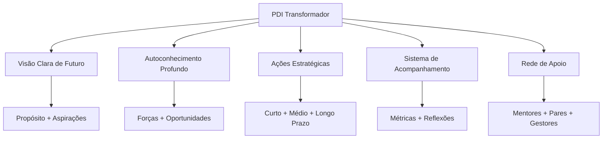

Analisando esse diagrama, percebe-se que um PDI transformador combina elementos de autoconhecimento com visão de futuro, traduzidos em ações concretas e suportados por um sistema eficaz de acompanhamento e uma rede sólida de apoio.

### Por que Muitos PDIs Falham?

Se você já teve a experiência de criar um plano de desenvolvimento que acabou abandonado, não está sozinho. Na minha experiência trabalhando com profissionais de todos os níveis, identifiquei padrões recorrentes que levam planos bem-intencionados ao fracasso:

- **Desconexão emocional**: Objetivos que soam bem no papel mas não ressoam com seus valores e motivações mais profundos
- **Ambição excessiva**: Metas irrealistas que geram frustração e abandono logo nos primeiros obstáculos
- **Isolamento**: Desenvolvimento sem apoio e feedback contínuo, tornando-se uma jornada solitária e desanimadora
- **Rigidez**: Incapacidade de adaptar-se às mudanças inevitáveis de contexto e prioridades
- **Falta de ritmo**: Ausência de rotinas e rituais que mantenham o desenvolvimento vivo no dia a dia
- **Abordagem cascata**: Longos ciclos de planejamento, execução linear e avaliação apenas ao final, sem adaptação contínua

Como diz Kent Beck, "o problema com os planos não é que eles eventualmente falham, mas que nos dão a ilusão de controle". Para superar esses obstáculos, precisamos repensar fundamentalmente como abordamos o desenvolvimento profissional. O PDI que realmente transforma carreiras é aquele que se torna parte integrada da sua vida profissional diária, não apenas um exercício anual obrigatório.

> "Um grande produto começa com um problema real e uma visão clara de como resolvê-lo. Um PDI eficaz segue o mesmo princípio: começa com uma compreensão genuína de suas necessidades e uma visão inspiradora do profissional que você deseja se tornar."

Vamos agora explorar o primeiro e mais fundamental elemento de um PDI excepcional: o autoconhecimento profundo.

---

## 🔍 Autoconhecimento: A Base do Desenvolvimento

### O Tripé do Autoconhecimento Profissional

Já parou para pensar que somos como icebergs? A maior parte do que determina nosso desempenho profissional está abaixo da superfície – nossos valores fundamentais, crenças limitantes, talentos naturais e motivações inconscientes. Daniel Goleman, pioneiro da inteligência emocional, resume bem: "Sem autoconhecimento, ficamos pilotando no escuro".

O desenvolvimento significativo só começa quando temos clareza sobre quem somos de verdade, o que nos move e como impactamos o mundo ao nosso redor. O tripé do autoconhecimento que utilizo com profissionais consiste em:

1. **Clareza sobre valores e propósito** – Viktor Frankl, em seus estudos sobre sentido, descobriu que pessoas com propósito claro demonstram maior resiliência diante de desafios. Quando você conhece seus "porquês", consegue suportar quase qualquer "como".
    
2. **Consciência de pontos fortes e áreas de desenvolvimento** – A psicologia positiva, liderada por Martin Seligman, demonstra consistentemente que focar em potencializar talentos naturais traz resultados superiores a apenas tentar corrigir fraquezas. Como você definiria seus "superpoderes" profissionais?
    
3. **Entendimento do impacto de seu comportamento em diferentes contextos** – Tasha Eurich, pesquisadora de autoconsciência, distingue entre autoconsciência interna (como nos vemos) e externa (como os outros nos percebem). O alinhamento entre essas dimensões é fundamental para a eficácia profissional.
    

### Ferramentas Avançadas de Autodiagnóstico

#### 📊 Matriz SOAR vs. SWOT

A tradicional análise SWOT (Forças, Fraquezas, Oportunidades, Ameaças) deu lugar a uma abordagem mais positiva e orientada ao futuro: a matriz SOAR, desenvolvida por Jacqueline Stavros e Gina Hinrichs.

|SOAR|Foco|Exemplo Prático|
|---|---|---|
|**S**trengths (Forças)|O que você faz excepcionalmente bem|"Minha capacidade de sintetizar dados complexos em narrativas claras"|
|**O**pportunities (Oportunidades)|Possibilidades no ambiente externo|"Crescente demanda por interpretação de dados na minha indústria"|
|**A**spirations (Aspirações)|O que você quer ser e alcançar|"Tornar-me referência em data storytelling em 2 anos"|
|**R**esults (Resultados)|Como o sucesso será mensurado|"Liderar projetos de análise estratégica com impacto mensurável"|

**Exercício Prático: Sua Matriz SOAR**

Reserve 20 minutos agora para completar sua matriz SOAR pessoal. Na minha experiência facilitando este exercício com centenas de executivos, percebo que aqueles que chegam a exemplos concretos (não genéricos) conseguem insights muito mais valiosos.

#### 🔄 O Poder do Feedback Multidimensional

O feedback 360° estruturado, técnica popularizada por Marshall Goldsmith, oferece perspectivas valiosas sobre nossos pontos cegos comportamentais. Para maximizar seu valor:

- **Diversifique as fontes**: Inclua gestores, pares, subordinados e até clientes – cada grupo enxerga facetas diferentes do seu comportamento
    
- **Estruture as perguntas**: Craig Chappelow do Center for Creative Leadership recomenda utilizar questões específicas sobre comportamentos observáveis, não traços de personalidade ("Como esta pessoa lida com situações de conflito?" em vez de "Esta pessoa é paciente?")
    
- **Triangule os dados**: Jim Collins, autor de "Good to Great", sugere buscar padrões mencionados por múltiplas fontes para identificar tendências reais versus opiniões isoladas
    
- **Separe observação de interpretação**: Técnica fundamental da Comunicação Não-Violenta de Marshall Rosenberg, distinguindo "o que aconteceu" de "o que penso sobre o que aconteceu"
    

**Caso Ilustrativo:**

> Marina, gerente de produto que acompanhei, implementou um sistema trimestral de feedback 360° inspirado nas práticas do Google. Descobriu que, embora fosse admirada por sua visão estratégica, sua comunicação era percebida como excessivamente técnica para stakeholders não-técnicos. Este insight a levou a desenvolver métodos de comunicação adaptados a diferentes audiências, resultando em maior alinhamento e engajamento das equipes cross-funcionais.

#### 🧠 Além dos Testes: Autoconhecimento Experiencial

Quantas vezes você já "soube" algo intelectualmente, mas não conseguiu incorporar esse conhecimento em seu comportamento? David Kolb, em sua Teoria da Aprendizagem Experiencial, explica que o verdadeiro autoconhecimento vem da experiência reflexiva:

- **Diário de situações críticas**: Técnica utilizada por líderes como Bill Gates e Oprah Winfrey, registrando detalhadamente situações desafiadoras, suas reações e resultados
    
- **Práticas contemplativas**: Jon Kabat-Zinn demonstrou como a meditação mindfulness desenvolve nossa capacidade de observação imparcial de padrões mentais
    
- **Experimentos comportamentais**: Inspirados na metodologia "Test and Learn" de Eric Ries, teste conscientemente novas abordagens em situações controladas
    
- **Mentoria reversa**: Prática adotada por executivos da General Electric, onde você aprende sobre si mesmo ao orientar outros com perspectivas diferentes
    

### Mapeamento de Competências: Abordagem Sistêmica

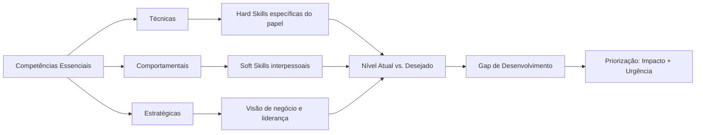

Este mapeamento sistêmico permite visualizar não apenas o estado atual e desejado de suas competências, mas também as interdependências entre diferentes áreas. Como Kent Beck, criador do Extreme Programming e TDD, afirma: "Os melhores desenvolvedores sabem que entender o problema é mais importante que conhecer a solução. No desenvolvimento pessoal, compreender profundamente a si mesmo precede qualquer plano de ação eficaz."

Com um alicerce sólido de autoconhecimento, estamos prontos para explorar um desafio específico que todo líder técnico enfrenta: o paradoxo entre profundidade técnica e amplitude de liderança.

---

## 🔍 O Paradoxo do Líder Técnico

### A Tensão Fundamental

Todo líder técnico eventualmente enfrenta um paradoxo existencial: o mesmo domínio técnico que os elevou à liderança gradualmente se torna insuficiente (e às vezes até obstáculo) para seu sucesso contínuo.

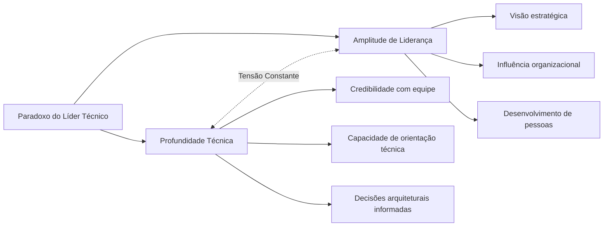

Em seu livro "The Manager's Path", Camille Fournier descreve este dilema: "À medida que você sobe na hierarquia de liderança técnica, sua esfera de influência aumenta, mas sua capacidade de manter-se atualizado em todos os detalhes técnicos diminui inevitavelmente."

### Dados de Carreira Reveladores

Uma análise da trajetória de CIOs e CTOs de empresas da Fortune 500 revela padrões interessantes:

- Os líderes técnicos mais bem-sucedidos mantêm uma proporção de aproximadamente 30/70 entre atividades técnicas hands-on e responsabilidades de liderança mais amplas
    
- 84% dos CTOs de empresas de alto crescimento relatam manter "áreas técnicas de especialidade" específicas, em vez de tentar acompanhar todas as tecnologias
    
- O tempo médio até que um líder técnico experimente sua primeira "crise de obsolescência" (percepção de que suas habilidades técnicas estão desatualizadas) é de 18 meses após assumir um papel de liderança
    

### Resolução via PDI Dicotômico

O PDI eficaz para líderes técnicos deve explicitamente abordar esta tensão, não como problema a ser eliminado, mas como polaridade a ser gerenciada continuamente. Uma abordagem dicotômica reconhece que não existe "equilíbrio perfeito", mas sim movimentos conscientes entre os dois polos quando apropriado.

|Desenvolvimento de Profundidade Técnica|Desenvolvimento de Amplitude de Liderança|
|---|---|
|Área técnica de especialidade escolhida estrategicamente|Meta-habilidades de liderança técnica transferíveis|
|Prática deliberada em contextos controlados|Experiências transformadoras em contextos desafiadores|
|Comunidades externas de prática técnica|Redes internas de influência organizacional|
|Rituais de atualização técnica consistentes|Sistemas para amplificação de impacto via outros|

O engenheiro Zach Lloyd, ex-Google e fundador da Warp, implementa um sistema que ele chama de "T-shape dinâmico":

1. A haste vertical do T (profundidade) muda periodicamente entre diferentes áreas técnicas, mantendo-se profundo em pelo menos uma área relevante
2. A barra horizontal (amplitude) expande-se continuamente à medida que a carreira evolui
3. A escolha da área de profundidade é guiada por uma "heurística de alavancagem": onde o conhecimento técnico profundo gerará o maior impacto multiplicador para a equipe/organização?

> "Não estou tentando ser o melhor programador da equipe. Estou tentando ser um programador bom o suficiente para ter credibilidade técnica, enquanto desenvolvo as habilidades únicas que apenas um líder técnico pode oferecer." - Líder de Engenharia, empresa de pagamentos digitais

Com esta compreensão do paradoxo do líder técnico, podemos agora explorar como definir objetivos que realmente inspirem e transformem nossa trajetória profissional.

---

## 🎯 Objetivos que Inspiram e Transformam

### Além do SMART: Objetivos que Realmente Movem

Quem não conhece o acrônimo SMART (Específicos, Mensuráveis, Atingíveis, Relevantes, Temporais) para definição de objetivos? Esse framework tem seu valor, mas objetivos verdadeiramente transformadores possuem qualidades adicionais que transcendem essa fórmula padrão.

#### 🔥 A Abordagem HARD

Desenvolvida por Mark Murphy, autor de "HARD Goals", esta metodologia complementa a abordagem SMART adicionando dimensões de significado pessoal e desafio:

|Elemento|Descrição|Exemplo|
|---|---|---|
|**H**eartfelt (Significativo)|Conexão emocional profunda|"Este objetivo ressoa com meus valores mais profundos de criatividade e impacto"|
|**A**nimated (Vívido)|Visualização clara e detalhada|"Posso visualizar detalhadamente como será liderar aquela equipe inovadora"|
|**R**equired (Necessário)|Senso de urgência e importância|"Esta transformação é fundamental para onde quero chegar em minha carreira"|
|**D**ifficult (Desafiador)|Esforço que exige crescimento|"Este objetivo me forçará a desenvolver capacidades que ainda não possuo"|

Quando você define objetivos que combinam as qualidades SMART com os elementos HARD, cria metas que não apenas direcionam ações, mas energizam e inspiram. São objetivos que você persegue não porque "deve", mas porque genuinamente "quer".

#### 💫 Objetivos Transformacionais vs. Transacionais

Há uma diferença fundamental entre objetivos que buscam uma transação externa e aqueles que visam uma transformação interna:

|Objetivos Transacionais|Objetivos Transformacionais|
|---|---|
|Foco em métricas externas|Foco em transformação interna|
|"Concluir certificação X"|"Dominar conceitos que mudarão minha perspectiva sobre o mercado"|
|"Obter promoção ao cargo Y"|"Desenvolver liderança que inspira e potencializa a equipe"|
|Orientados a marcos|Orientados a desenvolvimento de mindset|

Os objetivos transacionais têm seu lugar, mas são os transformacionais que realmente impulsionam mudanças profundas e duradouras em sua carreira. Como Teresa Amabile, professora de Harvard, descobriu em sua pesquisa sobre progresso e motivação, o sentimento de desenvolvimento pessoal é um dos maiores impulsionadores da satisfação profissional.

### A Hierarquia de Objetivos: Alinhamento Vertical

Para maximizar impacto e consistência, seus objetivos devem seguir uma hierarquia clara, onde cada nível suporta e alimenta o próximo:

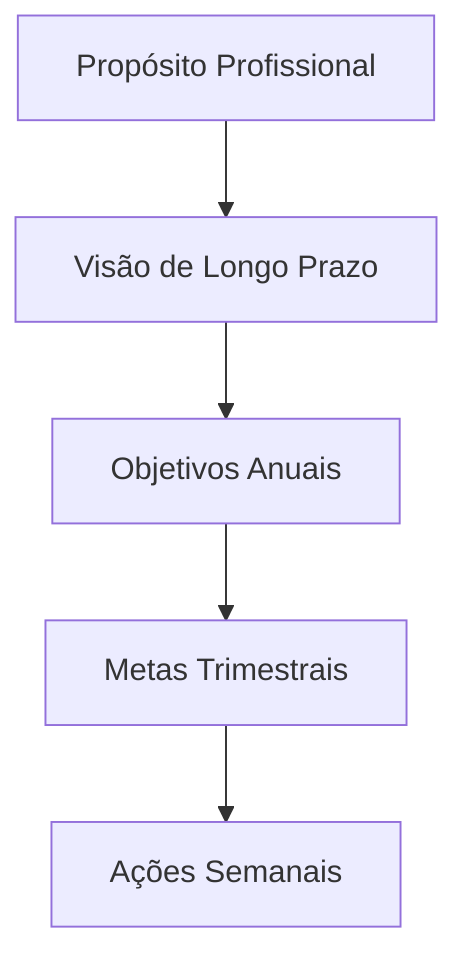

**Exercício de Alinhamento:**

1. Defina seu propósito profissional em uma frase clara e inspiradora
2. Visualize onde quer estar em 3-5 anos (sendo específico sobre funções, realizações, impacto)
3. Estabeleça 2-3 objetivos anuais que contribuam diretamente para essa visão
4. Decomponha cada objetivo anual em metas trimestrais tangíveis
5. Traduza a meta trimestral atual em ações semanais concretas

Quando seus objetivos estão verdadeiramente alinhados dessa forma, até mesmo as pequenas ações diárias ganham significado maior, conectando-se a seu propósito mais amplo. Como o arquiteto Bjarke Ingels diz: "O poder está em poder traçar uma linha direta entre o que você faz diariamente e a diferença que você quer fazer no mundo."

### O Poder dos Anti-Objetivos

Tão importante quanto definir o que queremos alcançar é clarificar o que deliberadamente escolhemos NÃO fazer. Anti-objetivos são declarações explícitas do que você está disposto a deixar de lado para focar no que realmente importa.

**Exemplo:**

|Objetivo|Anti-Objetivo|
|---|---|
|Desenvolver liderança estratégica|NÃO buscarei dominar todos os detalhes técnicos|
|Aprofundar expertise em área específica|NÃO tentarei abraçar múltiplos domínios simultaneamente|
|Construir relações significativas|NÃO focarei em expandir rede de contatos quantitativamente|

Como Greg McKeown, autor de "Essencialismo", enfatiza: "Se não priorizamos nossa vida, alguém fará isso por nós." Os anti-objetivos tornam explícitas suas escolhas de priorização, protegendo seu foco e energia do que não está alinhado com sua visão maior.

> "As melhores visões de produto não apenas definem o que incluir, mas fazem escolhas corajosas sobre o que deixar de fora. Da mesma forma, um PDI excepcional requer foco e renúncias estratégicas."

Com objetivos claros e inspiradores estabelecidos, vamos aprofundar na abordagem centrada em impacto, que revoluciona a forma como pensamos sobre desenvolvimento profissional.

---

## 🎯 PDI Centrado em Impacto

### Do "Desenvolvimento pelo Desenvolvimento" ao "Desenvolvimento por Impacto"

Um erro comum nos PDIs para líderes técnicos é o foco em desenvolvimento de habilidades como um fim em si mesmo. Uma abordagem mais poderosa é começar pelo impacto desejado e trabalhar retroativamente para identificar as competências necessárias.

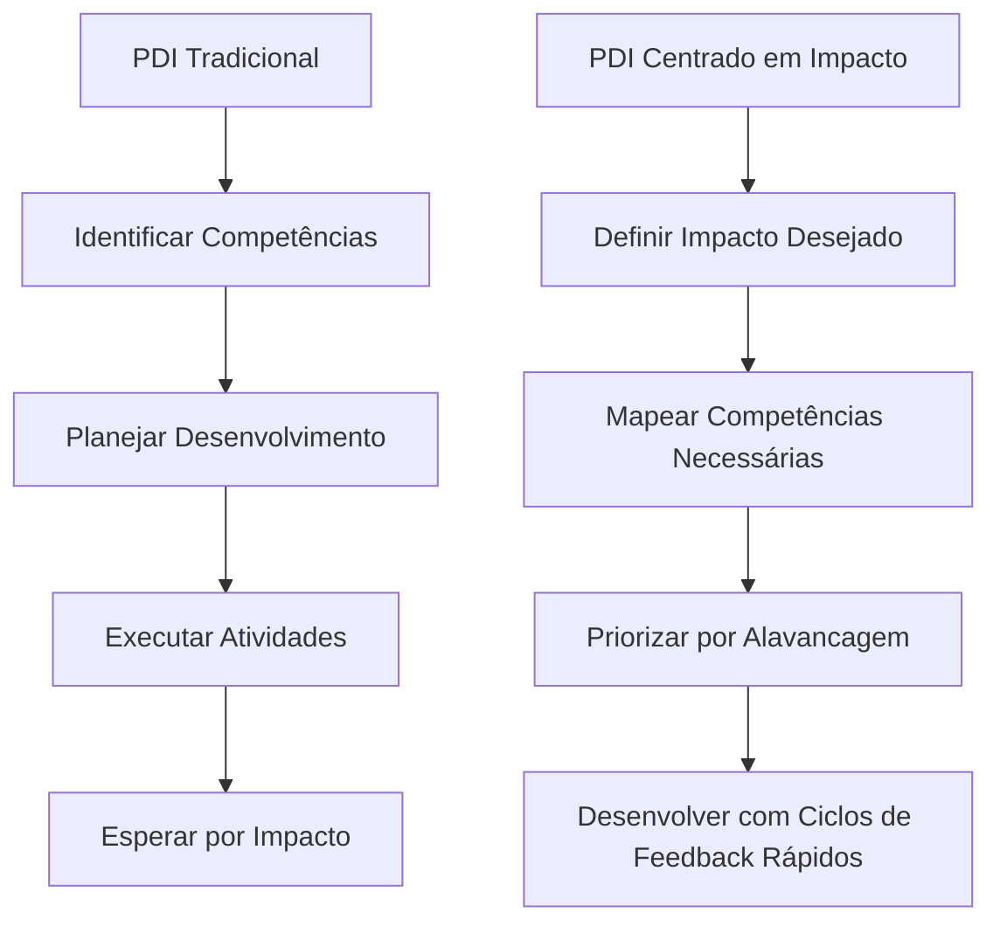

### O Framework de Impacto em Camadas

Líderes técnicos operam em múltiplas camadas de impacto simultaneamente. Um PDI eficaz deve abordar todas essas dimensões:

|Camada de Impacto|Descrição|Exemplo de Objetivo|Competências Relacionadas|
|---|---|---|---|
|**Organizacional**|Contribuição para direção e resultados da empresa|Reduzir time-to-market em 40% através de transformação na plataforma de desenvolvimento|Visão técnica, influência, alinhamento negócio-tecnologia|
|**Ecossistema Técnico**|Melhoria na arquitetura, práticas e capacidades técnicas|Estabelecer arquitetura modular que permita times autonomamente entregarem recursos sem dependências|Modelagem de domínio, design de sistemas, governança técnica|
|**Equipe**|Amplificação das capacidades coletivas|Desenvolver capacidade da equipe para resolução autônoma de incidentes de produção|Coaching técnico, design de sistemas de aprendizado, feedback eficaz|
|**Individual**|Contribuições técnicas diretas|Implementar sistema de feature flags que reduza risco de releases em 60%|Competências técnicas específicas, execução pragmática|

### O Impacto como Bússola para Priorização

Com demandas infinitas competindo por tempo finito, líderes técnicos precisam de mecanismos claros para priorizar seu desenvolvimento. O "Quociente de Alavancagem de Impacto" (QAI) oferece uma abordagem quantitativa:

**QAI = (Impacto Potencial × Probabilidade de Sucesso) ÷ (Tempo de Desenvolvimento × Complexidade)**

Por exemplo, considere duas opções de desenvolvimento:

1. **Aprofundar conhecimento em Kubernetes**:
    
    - Impacto Potencial: 7/10 (beneficiará principalmente decisões de infraestrutura)
    - Probabilidade de Sucesso: 9/10 (altamente factível dadas experiências anteriores)
    - Tempo: 6/10 (requer investimento substancial)
    - Complexidade: 7/10 (conceitos avançados desafiadores)
    - QAI = (7×9)÷(6×7) = 1.5
2. **Desenvolver habilidade de facilitar decisões técnicas complexas**:
    
    - Impacto Potencial: 9/10 (afeta todas as iniciativas importantes)
    - Probabilidade de Sucesso: 7/10 (desafiador mas viável)
    - Tempo: 4/10 (pode ser desenvolvido incrementalmente)
    - Complexidade: 6/10 (envolve aspectos técnicos e interpessoais)
    - QAI = (9×7)÷(4×6) = 2.63

Neste exemplo, a segunda opção oferece quase o dobro de retorno esperado sobre o investimento de desenvolvimento, apesar de à primeira vista poder parecer menos "técnica".

> "Os melhores líderes técnicos que conheço são obcecados com impacto, não com tecnologia. A tecnologia é apenas o meio, não o fim." - CTO, empresa de cybersegurança

Com essa perspectiva centrada em impacto, podemos agora abordar estratégias eficazes de planejamento que transformam intenções em resultados.

---

## 🧩 Estratégias de Planejamento para Resultados Extraordinários

### Modelos Integrados de Desenvolvimento

#### 📋 O Framework CEP+R Aprofundado

O modelo CEP+R (Conteúdo, Experiência, Pessoas e Redes) oferece uma abordagem holística para desenvolvimento profissional, reconhecendo que o aprendizado efetivo acontece através de múltiplos canais:

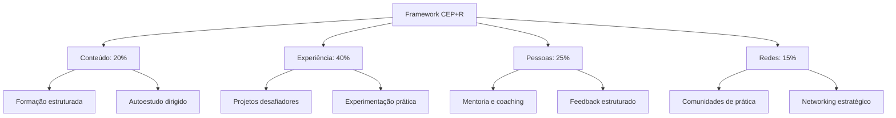

**Exemplo de Aplicação Prática**

Para o objetivo "Tornar-se um líder de produto centrado no cliente":

|Componente|Proporção|Atividades Específicas|
|---|---|---|
|**Conteúdo**|20%|• Curso "Product Leadership" na universidade corporativa • Leitura de 1 livro mensal sobre design thinking e comportamento do cliente • Assinatura de newsletters especializadas|
|**Experiência**|40%|• Liderar um projeto de discovery com usuários reais • Implementar sistema de feedback contínuo de clientes • Conduzir 5 entrevistas mensais com usuários|
|**Pessoas**|25%|• Sessões mensais com mentor sênior em UX • Shadowing com líderes de produto em outras equipes • Feedback quinzenal sobre decisões de produto|
|**Redes**|15%|• Participação ativa em comunidade de product managers • Apresentações em meetups internos • Contribuições em fóruns especializados|

Esta abordagem equilibrada reconhece que apenas o estudo formal (Conteúdo) é insuficiente para desenvolvimento profundo. O verdadeiro aprendizado acontece na aplicação prática (Experiência), na interação com mentores e modelos (Pessoas) e na participação em comunidades relevantes (Redes).

#### 🔄 Modelo 70/20/10 Reimaginado

Originalmente desenvolvido pelo Center for Creative Leadership, o modelo 70/20/10 sugere que o desenvolvimento ocorre predominantemente através da experiência prática (70%), seguido por interações sociais (20%) e apenas 10% via educação formal. Esta abordagem clássica pode ser adaptada para o contexto atual de trabalho híbrido e aprendizado contínuo:

|Dimensão|Abordagem Tradicional|Abordagem Contemporânea|
|---|---|---|
|**70%** Experiência|Aprendizado no trabalho diário|Projetos intencionais desafiadores + Experimentação protegida|
|**20%** Social|Feedback informal e observação|Coaching estruturado + Comunidades de prática virtuais|
|**10%** Formal|Cursos e treinamentos presenciais|Microlearning contínuo + Aprendizado adaptativo personalizado|

A versão contemporânea desse modelo enfatiza a intencionalidade e a estrutura. Em vez de simplesmente "aprender fazendo", você desenha experiências específicas que desenvolvem as competências desejadas. O componente social transcende o feedback casual, incorporando relacionamentos de desenvolvimento estruturados. E o aprendizado formal é distribuído em pequenas doses frequentes, em vez de concentrado em eventos isolados.

### Planejamento Sistemático: Além do 5W2H

O framework 5W2H (O quê, Por quê, Onde, Quando, Quem, Como, Quanto) oferece uma base sólida para planejamento, mas pode ser aprimorado com elementos adicionais que aumentam significativamente sua eficácia:

#### 📊 Framework 5W2H+I+R

|Elemento|Questão-chave|Exemplo Aplicado|
|---|---|---|
|**What** (O quê)|O que preciso desenvolver?|Habilidades de facilitação para reuniões complexas e decisões em grupo|
|**Why** (Por quê)|Por que isso é importante?|Para aumentar produtividade e engajamento em decisões críticas do time|
|**Where** (Onde)|Em quais contextos aplicarei?|Reuniões interdepartamentais e workshops de cocriação|
|**When** (Quando)|Qual o cronograma de desenvolvimento?|Próximos 4 meses, com marcos mensais de progresso|
|**Who** (Quem)|Quem pode apoiar este desenvolvimento?|Mentor especialista em facilitação + coach de comunicação|
|**How** (Como)|Quais métodos específicos utilizarei?|Curso de facilitação + prática gradual em contextos reais|
|**How much** (Quanto)|Qual investimento necessário?|5h semanais + R$X em recursos + energia emocional para errar e aprender|
|**Impact** (Impacto)|Qual transformação esperada?|Decisões 30% mais rápidas e aumento em 40% no engajamento das equipes|
|**Risks** (Riscos)|Quais obstáculos devo antecipar?|Resistência inicial das equipes + sobrecarga do calendário|

Os elementos adicionais de Impacto e Riscos são particularmente valiosos: o primeiro clarifica os benefícios esperados, fortalecendo a motivação; o segundo antecipa possíveis obstáculos, permitindo a criação de estratégias preventivas.

> "Assim como o desenvolvimento de software requer sistemas para gerenciar complexidade, o desenvolvimento profissional necessita de frameworks que transformem aspirações abstratas em ações concretas e mensuráveis."

Com estratégias de planejamento bem definidas, o próximo desafio é traduzi-las em implementação consistente e sustentável.

---

## 🛠️ Da Teoria à Prática: Implementação Efetiva

### O Plano de Implementação Estruturado

Um PDI excepcional precisa de um sistema de implementação igualmente robusto. Como diz o especialista em hábitos James Clear: "Você não cresce até o nível das suas metas; você cai para o nível dos seus sistemas."

#### 🗓️ Ritmos de Execução e Revisão

Estabeleça ciclos definidos para diferentes níveis de atividades:

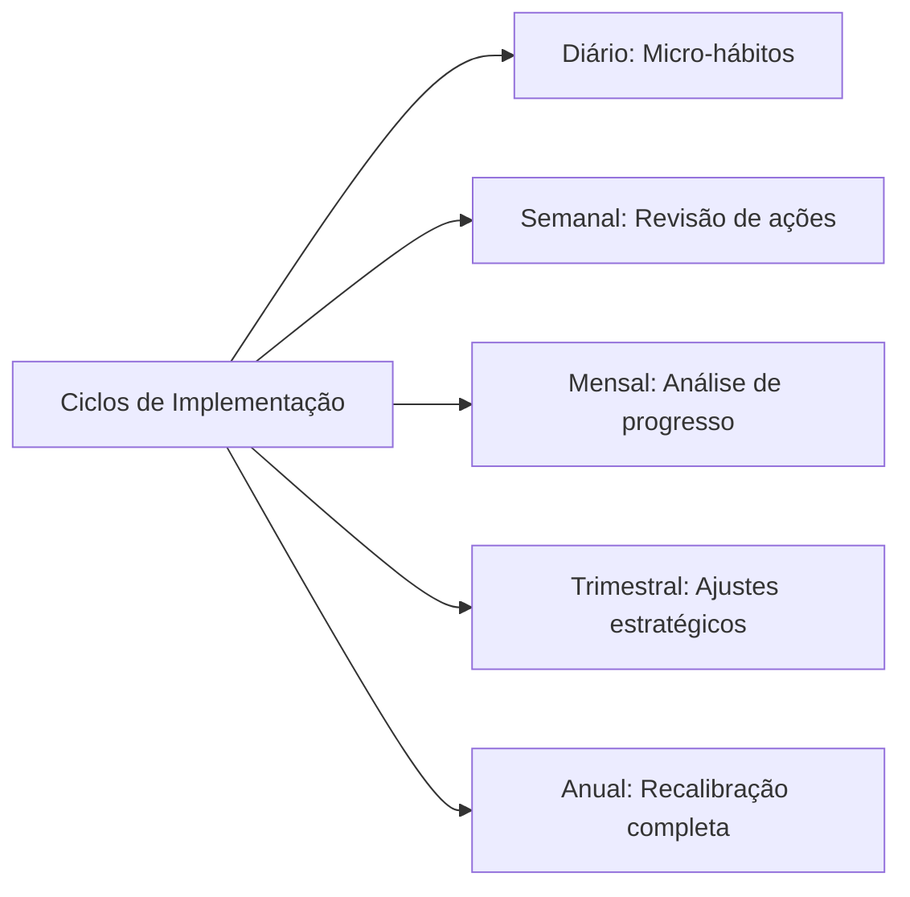

**Sistema de Implementação Diária:**

1. **Ritual matinal** (5-10 min): Reserve um momento no início do dia para revisar suas prioridades de desenvolvimento, conectando-as às atividades planejadas
    
2. **Blocos protegidos** (30-90 min): Defina períodos específicos em seu calendário exclusivamente dedicados a atividades de desenvolvimento, tratando-os com o mesmo respeito que reuniões importantes
    
3. **Micro-momentos** (5-10 min): Identifique pequenas oportunidades ao longo do dia para prática deliberada de novas habilidades
    
4. **Reflexão noturna** (5-10 min): Dedique alguns minutos no final do dia para registrar aprendizados e planejar ações de desenvolvimento para o dia seguinte
    

#### 📈 Exemplo de Plano de Implementação Detalhado

Para o objetivo "Desenvolver competências avançadas em storytelling com dados":

|Horizonte|Atividades de Desenvolvimento|Sistema de Acompanhamento|
|---|---|---|
|**Diário**|• 15 min de estudo de visualizações exemplares • Aplicação consciente em pelo menos 1 comunicação|Checklist diário com registro de insights|
|**Semanal**|• 1 hora dedicada a curso online • Análise crítica de 1 dashboard ou apresentação|Revisão de progresso com par de accountability|
|**Mensal**|• Criação de 1 visualização complexa • Sessão de feedback com especialista|Documentação estruturada de evolução com exemplos|
|**Trimestral**|• Projeto aplicado com stakeholders reais • Avaliação formal de competência|Retrospectiva detalhada com mentor|

O poder deste sistema está em criar múltiplos ciclos de feedback, permitindo ajustes frequentes e celebrações de pequenas vitórias ao longo do percurso.

### Sistemas de Hábitos para Desenvolvimento Sustentável

O desenvolvimento contínuo depende fundamentalmente da formação de hábitos consistentes, não apenas de ações pontuais.

#### 🔄 O Loop de Hábitos Profissionais

Charles Duhigg, autor de "O Poder do Hábito", popularizou o modelo do loop de hábitos, que pode ser adaptado para desenvolvimento profissional:

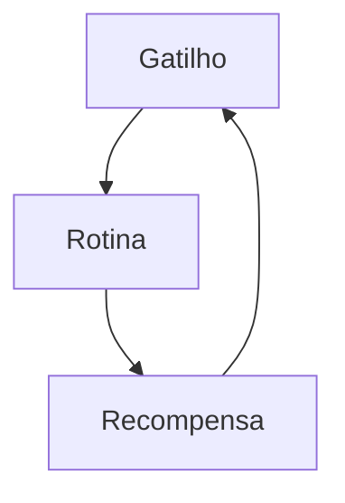

**Aplicação Prática:**

|Componente|Descrição|Exemplo para "Desenvolver Escuta Ativa"|
|---|---|---|
|**Gatilho**|Sinal que inicia o comportamento|Início de cada reunião ou conversa 1:1|
|**Rotina**|Comportamento a ser desenvolvido|Protocolo estruturado: (1) Contato visual, (2) Perguntas abertas, (3) Paráfrase para confirmação|
|**Recompensa**|Benefício imediato percebido|Auto-reconhecimento + registro de insight valioso obtido|

A chave para criar hábitos duradouros é tornar os gatilhos óbvios, as rotinas atrativas e as recompensas satisfatórias. Com o tempo, o que antes exigia esforço consciente torna-se automático, liberando capacidade mental para novos desafios.

#### 🏗️ Scaffolding: Suporte Progressivo para Novos Comportamentos

Inspirado no conceito educacional de "andaimes", o scaffolding para desenvolvimento profissional envolve criar sistemas de suporte que podem ser gradualmente removidos à medida que a competência aumenta:

1. **Suporte máximo**: No início, use checklists detalhados e busque acompanhamento direto de mentores para cada aplicação da nova habilidade
    
2. **Suporte moderado**: À medida que ganha confiança, passe a utilizar lembretes estratégicos e revisão periódica
    
3. **Suporte mínimo**: Posteriormente, implemente gatilhos ambientais sutis que mantêm a consciência da habilidade
    
4. **Autonomia**: Finalmente, o comportamento se integra ao seu modo natural de operação, não exigindo suporte externo
    

Esta abordagem gradual reconhece que o desenvolvimento de novas competências raramente acontece de uma vez. Como observa a especialista em aprendizado adulto Ellen Langer: "A maioria das pessoas precisa de estrutura para desenvolver autonomia."

> "O melhor código é aquele que funciona não apenas no ambiente de desenvolvimento, mas no mundo real, sob condições variáveis. Da mesma forma, o melhor PDI é aquele que sobrevive ao contato com a realidade caótica do dia a dia profissional."

Agora que temos estruturas de implementação robustas, vamos explorar como adotar uma abordagem mais ágil para nosso desenvolvimento.

---

## 🚀 Implementação Ágil do PDI

### Da Abordagem Cascata ao PDI Ágil

A implementação tradicional de PDIs segue frequentemente um modelo "cascata": longos ciclos de planejamento, execução linear e avaliação apenas ao final. Esta abordagem torna-se cada vez mais inadequada em um ambiente caracterizado por rápida mudança e alta incerteza.

A implementação ágil do PDI aplica princípios do desenvolvimento ágil ao próprio desenvolvimento profissional:

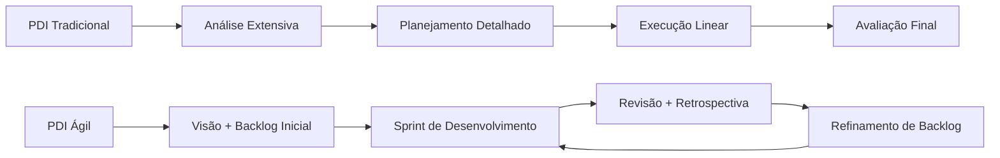

### Estruturas Flexíveis para Desenvolvimento Adaptável

#### O Framework Scrum PDI

Adaptado do Scrum para desenvolvimento de software, este framework oferece estrutura sem rigidez excessiva:

|Elemento|Descrição|Benefício|
|---|---|---|
|**Backlog de Desenvolvimento**|Lista priorizada e evolutiva de competências, experiências e resultados desejados|Visibilidade clara de prioridades com flexibilidade para adaptação contínua|
|**Sprints de Desenvolvimento**|Ciclos curtos (2-4 semanas) com foco específico|Progresso tangível e feedback frequente|
|**Daily Development**|Micro-check diário (2-3 min) sobre progresso e bloqueios|Consciência contínua e adaptação rápida|
|**Sprint Review**|Avaliação objetiva de resultados ao final de cada sprint|Validação regular de progresso real vs. atividades|
|**Sprint Retrospective**|Reflexão sobre o processo de desenvolvimento em si|Melhoria contínua da própria abordagem ao desenvolvimento|

#### Desenvolvimento Orientado a Experimentos

Inspirado nas metodologias Lean Startup e Design Thinking, esta abordagem enquadra o desenvolvimento profissional como série de experimentos:

1. **Hipótese de Desenvolvimento**: Afirmação testável sobre competência específica e impacto esperado _"Se eu desenvolver capacidade X, então conseguirei resultado Y"_
    
2. **Experimento Mínimo Viável**: Menor intervenção possível para validar a hipótese _"A menor iniciativa que permitirá determinar se esta direção de desenvolvimento é valiosa"_
    
3. **Métricas de Validação**: Indicadores específicos que confirmarão ou refutarão a hipótese _"Como saberei objetivamente se o desenvolvimento está gerando o impacto esperado?"_
    
4. **Ciclo de Ajuste**: Processo estruturado para pivotar ou perseverar com base nos resultados _"Com base nos dados deste experimento, como devo ajustar minha abordagem?"_
    

### Ritmos para Desenvolvimento Sustentável

O PDI ágil implementa um sistema de ritmos aninhados que criam previsibilidade e sustentabilidade:

|Cadência|Foco|Atividade Típica|
|---|---|---|
|**Diária**|Consistência e consciência|3 min de reflexão estruturada sobre atividades de desenvolvimento|
|**Semanal**|Progresso incremental|30 min de revisão de sprint parcial e ajustes táticos|
|**Bi-semanal/Mensal**|Avaliação e adaptação|1-2 horas de revisão completa de sprint e planejamento do próximo ciclo|
|**Trimestral**|Direção estratégica|4 horas de reavaliação de backlog completo e alinhamento estratégico|
|**Anual**|Transformação e visão|1 dia de reflexão profunda e redefinição de visão de longo prazo|

### Estudo de Caso: Sistema de Desenvolvimento Ágil de Eduardo

Eduardo, líder técnico numa empresa de tecnologia financeira, implementou um sistema que ele chama de "PDI Lean-Agile":

**Visão de Produto Pessoal**

Eduardo criou uma "Visão de Produto" para si mesmo como líder técnico, definindo claramente o tipo de impacto que deseja ter e as capacidades que precisará desenvolver, sem prescrever caminhos específicos.

**Backlog de Desenvolvimento**

Mantém um backlog estruturado de competências a desenvolver, organizado em:

- "Épicos" (grandes áreas de desenvolvimento como "Liderança Técnica Distribuída")
- "Features" (competências específicas como "Facilitação de Decisões Arquiteturais em Equipes Remotas")
- "Histórias" (experiências concretas de aprendizado)

**Sprints de Duas Semanas**

Cada sprint tem:

- Tema específico alinhado à visão mais ampla
- 2-3 histórias de desenvolvimento concretas
- Resultados esperados claramente definidos

**Quadro Kanban de Desenvolvimento**

Utiliza um quadro digital com colunas:

- Backlog
- Planejado para Sprint
- Em Progresso
- Aguardando Feedback
- Concluído
- Validado pelo Impacto

**Cerimônias Adaptadas**

- Stand-up pessoal diário (3 min)
- Review semanal com par de accountability (30 min)
- Retrospectiva e planejamento bi-semanal (1 hora)
- Revisão estratégica trimestral com mentor (2 horas)

O resultado mais notável dessa abordagem foi a capacidade de Eduardo de adaptar rapidamente seu desenvolvimento às mudanças organizacionais e tecnológicas, mantendo progresso constante mesmo em períodos de alta turbulência.

> "Passei a ver meu desenvolvimento como um produto que estou construindo, com versões incrementais constantes, não como um plano rígido a ser seguido." - Diretora de Engenharia, empresa de mobilidade

Com uma abordagem ágil para implementação, precisamos agora considerar como medir efetivamente o progresso, indo além de métricas simplistas.

---

## 📊 Mensuração de Progresso: Além dos Números

### Métricas Multidimensionais de Desenvolvimento

A mensuração efetiva de desenvolvimento profissional transcende indicadores simplistas como "completou/não completou" ou avaliações numéricas isoladas.

#### 🎯 Framework de Indicadores Balanceados

|Tipo de Métrica|Descrição|Exemplos|
|---|---|---|
|**Métricas de Esforço**|Quantificam a dedicação ao desenvolvimento|• Horas investidas • Consistência de práticas • Quantidade de iterações|
|**Métricas de Progresso**|Avaliam evolução em competências específicas|• Avaliações estruturadas • Feedback comparativo • Auto-avaliações calibradas|
|**Métricas de Aplicação**|Medem a transferência para contextos reais|• Frequência de aplicação • Qualidade de implementação • Adaptabilidade contextual|
|**Métricas de Resultado**|Avaliam o impacto nos objetivos finais|• KPIs de performance • Feedback de stakeholders • Novas oportunidades geradas|

Este framework multidimensional oferece uma visão muito mais rica e completa do desenvolvimento profissional. As métricas de esforço reconhecem a dedicação, enquanto as métricas de progresso capturam a evolução de competências específicas. As métricas de aplicação monitoram como o aprendizado se transfere para situações reais, e as métricas de resultado medem o impacto tangível.

#### 📉 Curvas de Aprendizado: Expectativas Realistas

O desenvolvimento raramente segue uma progressão linear. Compreender as fases típicas de uma curva de aprendizado permite estabelecer expectativas realistas e implementar estratégias apropriadas para cada momento:

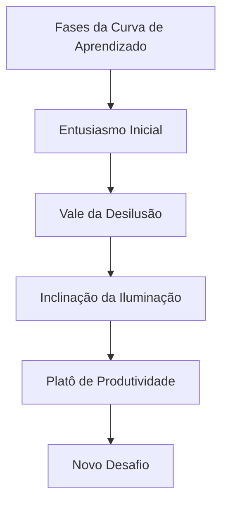

**Estratégias para Cada Fase:**

|Fase|Características|Abordagens Recomendadas|
|---|---|---|
|**Entusiasmo Inicial**|Alta motivação, resultados rápidos|Celebrar pequenas vitórias, estabelecer fundamentos|
|**Vale da Desilusão**|Frustração, percepção de estagnação|Suporte intensificado, recordar propósito maior|
|**Inclinação da Iluminação**|Padrões começam a emergir|Buscar aplicações mais complexas, conectar conceitos|
|**Platô de Produtividade**|Competência estabilizada|Ensinar outros, identificar refinamentos sutis|
|**Novo Desafio**|Risco de estagnação|Estabelecer próximo nível de maestria ou nova competência|

Reconhecer que o "Vale da Desilusão" é uma fase normal e temporária ajuda a perseverar quando a motivação inicial diminui. Como explica Seth Godin em seu livro "The Dip": "Os vencedores não desistem no fundo; eles encontram uma maneira de permanecer engajados com o trabalho para superar o ponto mais baixo."

### Documentação Reflexiva de Jornada

Para além de métricas quantitativas, o desenvolvimento profissional significativo beneficia-se de práticas reflexivas estruturadas que capturem nuances qualitativas da jornada.

#### 📓 Protocolo de Reflexão Estruturada

**Template para Reflexão Periódica:**

1. **Realizações significativas**: O que realizei no último período que representa progresso real em meu desenvolvimento?
    
2. **Insights transformadores**: Quais descobertas ou compreensões mudaram minha perspectiva sobre esta área?
    
3. **Padrões observados**: Que comportamentos recorrentes identifiquei que facilitam ou dificultam meu desenvolvimento?
    
4. **Obstáculos enfrentados**: Quais desafios específicos encontrei e como respondi a eles?
    
5. **Ajustes necessários**: Com base nessas observações, o que preciso modificar em minha abordagem?
    
6. **Próximos passos**: Quais ações específicas decorrentes desta reflexão implementarei no próximo ciclo?
    

Esta reflexão regular não é apenas um registro histórico, mas uma ferramenta ativa de desenvolvimento que acelera o aprendizado através da extração consciente de insights. Como John Dewey, pioneiro da educação experiencial, observou: "Não aprendemos com a experiência. Aprendemos refletindo sobre a experiência."

> "As melhores métricas não apenas medem resultados, mas iluminam o caminho à frente. No desenvolvimento profissional, as medições mais valiosas são aquelas que geram insights acionáveis para o próximo ciclo de crescimento."

A mensuração eficaz de progresso alimenta naturalmente outro componente crucial do desenvolvimento: o feedback contínuo.

---

## 🔄 A Cultura de Feedback Contínuo

### Além do Feedback Tradicional

O feedback eficaz para desenvolvimento vai muito além de avaliações anuais ou comentários genéricos. Quando bem estruturado, torna-se uma fonte contínua de insights que aceleram significativamente o desenvolvimento.

#### 🔍 Níveis de Profundidade do Feedback

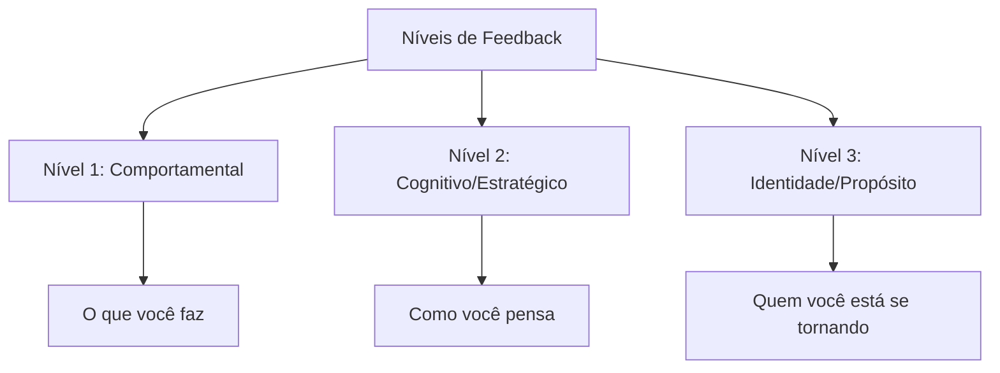

**Exemplos Práticos:**

|Nível|Exemplo de Feedback|Valor para Desenvolvimento|
|---|---|---|
|**Comportamental**|"Observei que você interrompe com frequência durante as reuniões de planejamento"|Identifica padrões concretos para ajustes imediatos|
|**Cognitivo**|"Percebo que você prioriza eficiência técnica sobre construção de consenso nas decisões de arquitetura"|Revela modelos mentais e vieses subjacentes|
|**Identidade**|"Suas ações refletem alguém comprometido com excelência técnica, mas talvez às custas de mentoria e desenvolvimento da equipe"|Conecta comportamentos a valores e aspirações profundas|

O feedback realmente transformador atinge todos os três níveis. O nível comportamental oferece ajustes imediatos, o nível cognitivo revela padrões de pensamento, e o nível de identidade conecta ações com aspirações mais profundas.

#### 📝 Protocolo de Feedback para Desenvolvimento

Para maximizar o valor do feedback no contexto de PDI:

1. **Preparação contextual**: Antes de solicitar feedback, esclareça: "Estou desenvolvendo X competência e valorizo feedback específico nesta área"
    
2. **Solicitação direcionada**: Seja preciso: "Pode observar especificamente como eu [comportamento específico] durante [situação específica]?"
    
3. **Escuta ativa**: Ao receber feedback, mantenha foco total na perspectiva do outro, sem defesa ou justificativa
    
4. **Exploração de nuances**: Aprofunde com perguntas como "Pode me dar um exemplo específico?" ou "Como isso impacta Y?"
    
5. **Conexão com PDI**: Explicite a relevância: "Como isso se relaciona com meu objetivo de desenvolvimento X?"
    
6. **Ação imediata**: Comprometa-se com um experimento específico baseado no feedback: "Baseado nisso, na próxima reunião vou testar..."
    

Este protocolo estruturado transforma feedback de algo potencialmente ameaçador em uma ferramenta poderosa de desenvolvimento. Como observa o especialista em liderança David Rock, "o feedback bem administrado ativa a curiosidade em vez da ameaça, criando um estado cerebral ideal para aprendizado."

### Criando Ciclos Virtuosos de Desenvolvimento

#### 🔄 O Loop de Feedback Integrado ao Cotidiano

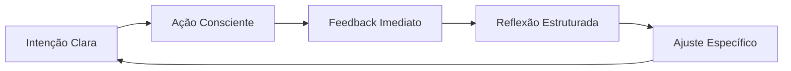

**Exemplos de Implementação:**

|Estágio|Prática Concreta|Ferramenta de Suporte|
|---|---|---|
|**Intenção Clara**|Definir foco de desenvolvimento para a semana|Template de planejamento semanal|
|**Ação Consciente**|Aplicar deliberadamente em situações específicas|Lembretes contextuais estratégicos|
|**Feedback Imediato**|Solicitar micro-feedbacks após interações-chave|Perguntas padronizadas de 1 minuto|
|**Reflexão Estruturada**|Documentar padrões e insights regularmente|Diário de aprendizado digital|
|**Ajuste Específico**|Implementar mudança pontual baseada em insights|Experimentos comportamentais de 7 dias|

Este sistema cria um fluxo contínuo de aprendizado e ajuste, significativamente mais eficaz que os ciclos anuais tradicionais de feedback. A rápida iteração permite ajustes frequentes, mantendo seu desenvolvimento constantemente alinhado às necessidades emergentes.

> "O feedback é como um espelho necessário para nosso desenvolvimento. Sem ele, estamos navegando às cegas, baseados apenas em nossas próprias percepções limitadas. Um PDI excepcional incorpora mecanismos robustos para capturar e integrar múltiplas perspectivas."

Tendo explorado os elementos fundamentais de um PDI eficaz, vamos agora examinar como adaptar esta abordagem para diferentes momentos da trajetória profissional.

---

## 🔄 PDI para Diferentes Momentos de Carreira

O desenvolvimento profissional não é um processo uniforme - ele evolui conforme avançamos em nossa jornada. Como observa Jennifer Petriglieri em "Casais que Trabalham": "As transições de carreira não são apenas mudanças no que fazemos, mas transformações em quem somos."

### Fase Inicial de Carreira (0-5 anos)

**Desafios Típicos:**

- Identificação de forças e paixões genuínas
- Desenvolvimento de competências técnicas fundamentais
- Construção de confiança e credibilidade profissional
- Adaptação à cultura organizacional

**Abordagens Recomendadas:**

- **Experimentação Ampla**: Como defende Reid Hoffman em "The Start-up of You", experimente diferentes funções e projetos para descobrir onde sua energia naturalmente flui
- **Mentorias Estruturadas**: Programa de rotação entre diferentes mentores a cada 3-4 meses
- **Aprendizado Técnico Intensivo**: Blocos dedicados para desenvolvimento de hard skills (método de imersão técnica da Shopify)
- **Feedback de Alto Volume**: Sistema de mini-feedbacks após cada entrega significativa

**Exemplo Prático:**

> Julia, desenvolvedora júnior, criou um PDI focado no método "T-shaped professional" de Tim Brown (IDEO): profundidade em uma competência técnica (desenvolvimento back-end) combinada com amplitude em habilidades complementares (UX, comunicação com stakeholders). Ela estabeleceu um sistema de projetos paralelos mensais para explorar diferentes especialidades, mantendo um "diário de energia" para identificar quais atividades a deixavam mais engajada.

### Meio de Carreira (5-15 anos)

**Desafios Típicos:**

- Transição de contribuidor individual para gestor (quando aplicável)
- Superação de plateaus de desenvolvimento
- Balanceamento entre especialização e versatilidade
- Reavaliação de propósito e alinhamento com valores

**Abordagens Recomendadas:**

- **Desenvolvimento em Profundidade vs. Amplitude**: Metodologia de "escalada T" proposta por Kelley & Kelley da d.school de Stanford
- **Projetos de Alto Impacto**: Liderança de iniciativas estratégicas cross-funcionais
- **Troca de Contextos Deliberada**: Rotação entre departamentos ou funções para ampliar perspectiva
- **Mentoria Reversa**: Orientação de profissionais mais jovens para atualização em tendências emergentes

**Exemplo Prático:**

> Ricardo, gerente de marketing com 8 anos de experiência, aplicou o framework de "desenvolvimento adaptativo" de Robert Kegan para superar um plateau de crescimento. Ele identificou seu "sistema operacional mental" atual (Kegan nível 3: foco em aprovação externa) e trabalhou com um coach para evoluir para o nível 4 (autogerado). Seu PDI incluía "experimentos de contorno", onde deliberadamente assumia posições impopulares mas bem fundamentadas em discussões estratégicas para desenvolver autonomia intelectual.

### Fase Avançada de Carreira (15+ anos)

**Desafios Típicos:**

- Manutenção de relevância em ambiente em rápida mudança
- Desenvolvimento de liderança estratégica e visionária
- Construção de legado e impacto duradouro
- Rejuvenescimento profissional e prevenção de estagnação

**Abordagens Recomendadas:**

- **Conselho Estratégico**: Participação em boards e comitês consultivos
- **Síntese de Sabedoria Prática**: Documentação e compartilhamento de conhecimento tácito acumulado
- **Desenvolvimento de Sucessores**: Programas estruturados de mentoria para próxima geração
- **Renovação Significativa**: Imersão em novas disciplinas ou tendências disruptivas

**Exemplo Prático:**

> Helena, diretora executiva com 22 anos de experiência, aplicou o conceito de "ikigai profissional" para reorientar sua carreira. Seu PDI focou na intersecção entre suas habilidades consolidadas em gestão estratégica e seu interesse emergente em sustentabilidade corporativa. Ela estabeleceu uma prática de "aprendizado em trindade": para cada área nova, combinava estudo formal, mentoria com especialista, e projeto prático aplicado. Isso levou à criação de uma nova vertical de negócios sustentáveis em sua organização.

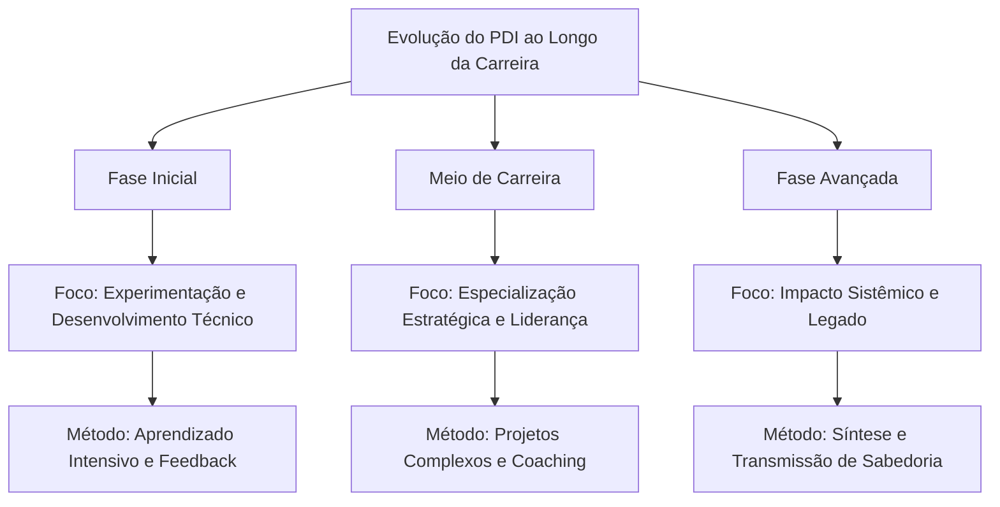

Com este entendimento de como o PDI evolui ao longo da carreira, vamos agora explorar como otimizar nosso desenvolvimento com base em descobertas recentes da neurociência.

---

## 🧠 Neurociência do Aprendizado para PDIs Excepcionais

O entendimento atual de como o cérebro aprende e se desenvolve oferece insights valiosos para otimizar o desenvolvimento profissional. Como destaca Andrew Huberman, neurocientista de Stanford: "A neuroplasticidade não é um evento, mas um processo que requer condições específicas para ocorrer de forma eficaz."

### Janelas de Neuroplasticidade

**Princípios Fundamentais:**

- O cérebro adulto mantém capacidade significativa de mudança (pesquisas de Michael Merzenich)
- A neuroplasticidade é dependente de atenção focada e estado neurológico específico
- Períodos de intensidade seguidos por recuperação otimizam a consolidação neural

**Aplicações Práticas para seu PDI:**

1. **Técnica de Aprendizado Espaçado**: Baseada nos estudos de Hermann Ebbinghaus e refinada por pesquisas recentes em neurociência, esta abordagem utiliza intervalos estratégicos:
    
    - Prática inicial intensiva (60-90 minutos)
    - Revisão após 24 horas
    - Reforço após 1 semana
    - Consolidação após 1 mês
2. **Protocolo de Estado Ótimo**: Desenvolvido com base nas pesquisas de Mihaly Csikszentmihalyi sobre "flow" e estudos de EEG:
    
    - 10-15 minutos de preparação (respiração controlada 5-7-5 para ativar estado parassimpático)
    - 25-45 minutos de prática focada ("janela de atenção produtiva" identificada por K. Anders Ericsson)
    - Breve recuperação (micropausa não-digital de 5 minutos)
    - Repetir 2-3 ciclos em uma sessão
3. **Técnica de Encoding Multisensorial**: Baseada nas pesquisas sobre memória de Richard Atkinson e consolidação de memória de James McGaugh:
    
    - Engajar múltiplos sentidos ao aprender nova habilidade
    - Verbalizar conceitos enquanto pratica (ativação simultânea de áreas motoras e verbais)
    - Ensinar conceito a outra pessoa dentro de 24-48 horas (técnica Feynman neuroaprimorada)

### Ciclos Otimizados de Desafio/Recuperação

A pesquisa sobre plasticidade cerebral de Bruce McEwen e os estudos sobre adaptação de Anders Ericsson revelam que o desenvolvimento ideal ocorre em um ritmo biologicamente alinhado:

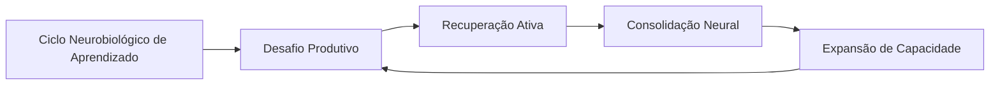

**Protocolo Prático para PDI:**

1. **Identificação da "Dificuldade Desejável"**: Como definido por Robert Bjork, trabalhe em tarefas que sejam aproximadamente 15-20% acima de sua capacidade atual
    
2. **Prática Deliberada Intercalada**: Alterne entre diferentes subhabilidades relacionadas, criando interferência produtiva (pesquisa de Elizabeth Bjork sobre aprendizado intercalado)
    
3. **Recuperação Neurocognitiva**: Após sessões intensas, utilize:
    
    - Caminhada de baixa intensidade (15-20 min) para estimular BDNF (Fator Neurotrófico Derivado do Cérebro)
    - Sono de qualidade priorizado nas 24h seguintes (fundamental para consolidação via ondas delta)
    - Reflexão estruturada para reforçar circuitos neurais (técnica de Barbara Oakley)

### Gatilhos Neurobiológicos de Motivação

As pesquisas de Wolfram Schultz sobre dopamina e Robert Sapolsky sobre estresse nos oferecem insights valiosos sobre como otimizar a motivação sustentável:

1. **Arquitetura de Recompensas Variáveis**: Baseada nos estudos de B.F. Skinner refinados pela neurociência moderna:
    
    - Pequenas celebrações após conclusão de tarefas (liberação de dopamina)
    - Recompensas intermitentes não-previsíveis para manter engajamento
    - Sistema de marcos com significado pessoal (não apenas marcos arbitrários)
2. **Gerenciamento de Estados Neuroquímicos**:
    
    - Prática de alta intensidade pela manhã (aproveitando cortisol elevado)
    - Tarefas criativas durante "depressão pós-almoço" (estado cerebral difuso favorece conexões não-óbvias)
    - Ritual de fechamento para ativação de sistema parassimpático (redução de cortisol)

> "Entender a neurobiologia do aprendizado não diminui a magia do desenvolvimento humano - apenas nos permite criar condições ideais para que essa magia aconteça de forma mais consistente." - Andrew Huberman, neurocientista de Stanford

Com estes insights da neurociência, estamos melhor equipados para enfrentar um dos maiores desafios do desenvolvimento profissional contemporâneo: a fragmentação da atenção.

---

## 🧠 PDI na Era da Fragmentação da Atenção

### O Desafio Contemporâneo do Desenvolvimento Profissional

Vivemos na era da economia da atenção. Como observa o neurocientista Adam Gazzaley: "Nossa capacidade atencional não evoluiu na mesma velocidade que nossa tecnologia". A realidade atual para muitos profissionais é uma constante batalha entre as exigências de desenvolvimento profissional e um ambiente repleto de distrações digitais e cognitivas.

Estudos da Universidade da Califórnia mostram que levamos, em média, 23 minutos para recuperar o foco completo após uma interrupção. Considerando que o profissional médio enfrenta interrupções a cada 3-5 minutos, o panorama para desenvolvimento consistente parece desafiador.

Neste contexto, um PDI eficaz precisa ir além de simplesmente definir "o que" desenvolver, para incluir estratégias sobre "como" proteger a capacidade cognitiva necessária para esse desenvolvimento.

### 🛡️ Arquitetura de Proteção Cognitiva para Desenvolvimento

#### Fundamentos de Ecologia Atencional

O conceito de "ecologia atencional", desenvolvido pelo psicólogo Matthew Crawford, sugere que nossa atenção é um recurso ambiental que precisamos deliberadamente proteger e cultivar. Aplicado ao desenvolvimento profissional, isto requer uma abordagem sistêmica:

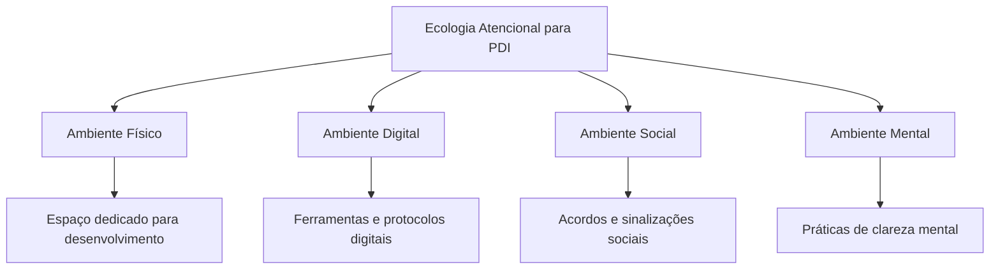

#### Protocolo de Deep Work para Desenvolvimento Profissional

Cal Newport, professor de ciência da computação e autor de "Deep Work", oferece um framework que pode ser adaptado especificamente para PDI:

**Rituais de Profundidade:**

1. **Preparação Espacial**:
    
    - Crie uma "estação de desenvolvimento" com todos os recursos necessários
    - Utilize sinais visuais que ativem o modo de aprendizado profundo
    - Elimine distrações previsíveis do ambiente
2. **Preparação Temporal**:
    
    - Bloqueie períodos específicos no calendário (idealmente 90-120 minutos)
    - Defina horários alinhados com seu ritmo circadiano pessoal
    - Comunique claramente períodos de indisponibilidade
3. **Preparação Mental**:
    
    - Ritual de transição de 5 minutos (respiração, revisão de objetivos)
    - Definição ultra-específica do resultado da sessão
    - "Warm-up" cognitivo com exercício de complexidade moderada
4. **Manutenção do Estado**:
    
    - Técnica de "pergunta adiada" para ideias não relacionadas
    - Micro-intervalos estruturados (52 minutos de foco, 17 de recuperação)
    - Sistema de tracking do estado atencional

**Os Quatro Paradigmas de Trabalho Profundo (Adaptados para PDI):**

|Abordagem|Descrição|Ideal para|
|---|---|---|
|**Monástica**|Blocos extensos (dias/semanas) dedicados exclusivamente a desenvolvimento|Transições profissionais, capacitações complexas, projetos transformadores|
|**Bimodal**|Alternância entre períodos intensivos (ex: 1-2 dias) e rotina normal|Desenvolvimento contínuo com marcos periódicos, equilibrado com responsabilidades atuais|
|**Rítmica**|Horários consistentes dedicados diariamente (ex: 5:30-7:30am)|Desenvolvimento incremental de longo prazo, formação de hábitos fundamentais|
|**Jornalística**|Oportunista - aproveitar quaisquer momentos disponíveis|Complementar a outras abordagens, não recomendado como estratégia primária|

**Caso Aplicado: Clara, Gerente de Marketing**

> Clara implementou o paradigma "Rítmico" para seu desenvolvimento em Analytics. Estabeleceu o período das 7:30-9:00 todas as manhãs, utilizando sinalizadores claros para sua equipe (banner digital de "Modo Desenvolvimento" ativo, status específico no Slack). Ela criou uma sequência de ativação: café específico, playlist instrumental, revisão de 2 minutos do objetivo da sessão. Seu progresso acelerou dramaticamente comparado às tentativas anteriores de estudar "quando sobrasse tempo".

### Estratégias de Gestão de Atenção Fragmentada

Para muitos profissionais, blocos extensos de concentração profunda são um luxo raro. Nestes casos, técnicas específicas para maximizar aprendizado em atenção fragmentada se tornam essenciais:

**1. Micro-Aprendizado Estruturado:**

Baseado nas pesquisas de Hermann Ebbinghaus sobre curva de esquecimento e trabalhos mais recentes sobre aprendizado espaçado:

|Componente|Descrição|Implementação|
|---|---|---|
|**Fragmentação Intencional**|Dividir conteúdo em micro-unidades de 3-7 minutos|Mapear competência em "átomos de aprendizado" que fazem sentido independentemente|
|**Distribuição Estratégica**|Espaçar exposições de forma otimizada|Sistema de repetição espaçada com intervalos crescentes (1 dia, 3 dias, 7 dias, etc.)|
|**Multimodalidade**|Utilizar diferentes formatos para o mesmo conteúdo|Alternar entre texto, áudio, prática, ensino a outros|
|**Contexto Variado**|Estudar o mesmo conceito em diferentes ambientes|Praticar durante deslocamento, em diferentes espaços de trabalho, etc.|

Agora, vamos examinar o contexto tecnológico específico que os líderes técnicos enfrentam hoje e como isso molda suas necessidades de desenvolvimento.

---

## 💻 O Novo Contexto Tecnológico: Desafios e Oportunidades

### A Tempestade Perfeita de Transformações

O contexto atual para líderes técnicos é caracterizado por uma convergência inédita de múltiplas transformações:

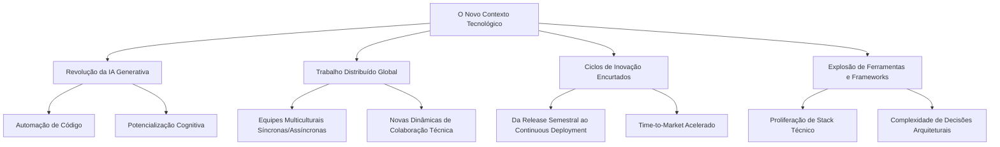

Cada uma dessas transformações traz desafios e oportunidades específicas. A IA generativa, por exemplo, está simultaneamente automatizando aspectos da codificação enquanto cria demanda por novas competências de prompt engineering e orquestração de sistemas inteligentes. O trabalho distribuído eliminou barreiras geográficas enquanto exige novas abordagens para construção de cultura técnica e transmissão de conhecimento tácito.

### Dados Reveladores

Pesquisas recentes da Stack Overflow e GitHub ilustram a magnitude dessas transformações:

- **79%** dos desenvolvedores já utilizam ferramentas de IA generativa regularmente, mas apenas **31%** dos líderes técnicos se sentem preparados para orientar suas equipes sobre o uso ético e eficaz dessas ferramentas
    
- As stacks tecnológicas das empresas cresceram em média **47%** em complexidade nos últimos 3 anos, enquanto o tempo médio de onboarding de novos engenheiros aumentou apenas **12%**
    
- **62%** dos erros críticos em produção são atribuídos a problemas de integração entre sistemas, não a bugs em componentes individuais
    
- Em equipes distribuídas, a transferência eficaz de conhecimento técnico é **40%** mais lenta que em equipes co-localizadas, apesar do aumento de documentação
    

Estes dados pintam um quadro desafiador, mas também revelam oportunidades críticas para líderes técnicos que desenvolvam competências específicas para este novo contexto.

### O Mapa de Competências em Evolução

Para navegar esse cenário, os líderes técnicos precisam desenvolver um conjunto de competências fundamentalmente diferente:

|Competência Histórica|Competência Emergente|Implicações para o PDI|
|---|---|---|
|**Domínio de uma stack específica**|**Agilidade técnica e adaptabilidade**|Focar em princípios e padrões transferíveis vs. sintaxe específica|
|**Planejamento técnico detalhado**|**Navegação ágil em ambiente incerto**|Desenvolver habilidade de estabelecer direção sem prescrever caminhos rígidos|
|**Execução direta de código crítico**|**Amplificação técnica via equipe e IA**|Cultivar capacidade de orquestrar múltiplas fontes de contribuição técnica|
|**Gestão local de pequena equipe**|**Liderança distribuída de ecossistemas**|Priorizar criação de sistemas sobre supervisão direta|

O grande desafio para o PDI do líder técnico em 2025 é que, ao contrário de eras anteriores onde a progressão era relativamente linear e previsível, agora estamos em um ambiente onde o próprio norte magnético do desenvolvimento profissional está em constante movimento.

> "Estamos tentando navegar mares desconhecidos com mapas antigos. E pior, o próprio oceano muda de composição enquanto o atravessamos." - Diretor de Engenharia, empresa unicórnio SaaS

Dada esta complexidade, vamos explorar uma abordagem específica para maximizar o desenvolvimento em um ambiente de alta fragmentação: o microaprendizado estratégico.

---

## ⚡ Microaprendizado Estratégico

### A Fragmentação Necessária do Desenvolvimento

O contexto atual de líderes técnicos é caracterizado por responsabilidades fragmentadas, alta demanda cognitiva e interrupções constantes. Um estudo da Microsoft descobriu que gerentes técnicos são interrompidos em média a cada 4 minutos e levam 23 minutos para recuperar foco profundo.

Neste cenário, a abordagem tradicional de desenvolvimento em grandes blocos contínuos torna-se cada vez menos viável. O microaprendizado estratégico oferece uma alternativa que transforma essa fragmentação de obstáculo em vantagem.

### O Sistema de Microaprendizado em Ação

O microaprendizado não é simplesmente "aprendizado em pedaços pequenos" - é um sistema sofisticado que alinha com os princípios da ciência cognitiva e se adapta ao contexto fragmentado:

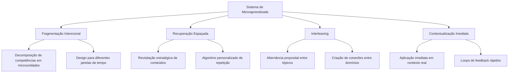

#### Taxonomia de Janelas de Micro-Desenvolvimento

O sistema eficaz reconhece diferentes tipos de janelas de tempo disponíveis e otimiza atividades para cada uma:

|Janela de Tempo|Características|Atividades Otimizadas|
|---|---|---|
|**Micro (1-5 min)**|Alta frequência, alta fragmentação|• Flashcards técnicos • Revisão de conceito-chave • Reflexão estruturada • Consumo de snippet técnico|
|**Mini (5-20 min)**|Média frequência, fragmentação moderada|• Prática deliberada em sub-habilidade • Leitura focada com extração • Tutorial técnico curto • Análise de código específico|
|**Módulo (20-50 min)**|Baixa frequência, baixa fragmentação|• Projeto técnico compacto • Pair programming direcionado • Sessão de design • Experimentação estruturada|

### Encadeamento de Micro-Momentos para Macro-Impacto

O verdadeiro poder do microaprendizado vem da criação de um sistema coerente onde cada fragmento se conecta com os outros para construir competências complexas:

1. **Mapeamento de Cascata**: Decomposição estruturada de competências complexas em componentes granulares que podem ser desenvolvidos individualmente
    
2. **Sequenciamento Estratégico**: Organização dos micro-momentos em sequências lógicas que constroem compreensão progressiva
    
3. **Scaffolding Digital**: Utilização de ferramentas digitais para oferecer suporte contextual que conecta micro-aprendizados a estruturas maiores
    
4. **Revisão Integrada**: Sessões periódicas para conectar explicitamente micro-momentos em compreensão holística
    

### Estudo de Caso: O Sistema LEGO de Desenvolvimento Técnico

Rafael, líder técnico em uma empresa de e-commerce, implementou o que ele chama de "Sistema LEGO" para seu desenvolvimento contínuo:

1. **Biblioteca de Micro-Aprendizados**: Criou uma coleção pessoal de módulos curtos (1-15 minutos) sobre diferentes aspectos de arquitetura de microsserviços, organizados por tema e complexidade
    
2. **Calendário Adaptativo**: Integrou essas micro-unidades em seu calendário com base em diferentes tipos de disponibilidade:
    
    - Micromomentos (espera, transições): revisões rápidas e flashcards
    - Mini-blocos (início da manhã, antes/depois de reuniões): tutoriais curtos
    - Blocos médios (1-2 por semana): projeto prático contínuo
3. **Projeto de Aplicação Contínua**: Manteve um projeto pessoal onde implementa progressivamente os conceitos aprendidos, avançando em pequenos incrementos
    
4. **Ritual de Integração**: Semanalmente, dedica 30 minutos para revisar e conectar explicitamente os micro-aprendizados da semana em um mapa mental evolutivo
    

Os resultados foram significativos: mesmo com uma agenda extremamente fragmentada de líder técnico, Rafael conseguiu dominar uma nova arquitetura complexa em 4 meses, aplicando o conhecimento em uma iniciativa crítica de modernização.

> "A fragmentação não é mais minha inimiga - é simplesmente o terreno em que opero. O microaprendizado me permitiu transformar pequenos momentos em progresso constante." - Líder de Engenharia, empresa fintech

Agora que compreendemos como estruturar o aprendizado em um ambiente fragmentado, vamos explorar estratégias específicas para o desenvolvimento em ambientes híbridos e remotos.

---

## 🌐 PDI no Ambiente Híbrido/Remoto

### A Nova Realidade Distribuída

O trabalho remoto e híbrido não é mais uma adaptação temporária, mas a nova realidade permanente para a maioria dos líderes técnicos. Um estudo da Stack Overflow descobriu que 76% dos desenvolvedores trabalham remotamente pelo menos parte do tempo, com 38% em regime totalmente remoto.

Esta nova configuração apresenta desafios únicos para o desenvolvimento profissional:

- Perda de aprendizado orgânico e osmótico que ocorria naturalmente em ambientes co-localizados
- Redução de oportunidades casuais de coaching e feedback
- Dificuldade em demonstrar e observar comportamentos de liderança
- Barreiras para construção de relacionamentos profundos e capital social

### Estratégias de PDI para o Mundo Distribuído

#### Visibilidade Intencional

No ambiente remoto, a visibilidade das contribuições técnicas e de liderança precisa ser deliberadamente projetada, não deixada ao acaso:

- **Documentação como Produto**: Transformar o processo de documentação de pensamento técnico de obrigação em oportunidade de influência
- **Narração do Trabalho**: Compartilhar regularmente não apenas resultados, mas processo de pensamento e decisões
- **Artefatos Persistentes**: Criar conteúdo técnico de alto valor que persista e circule na organização (arquitetura decisão docs, guias técnicos, postmortems educativos)

#### Aprendizado Assíncrono Estruturado

Diferentemente dos ambientes presenciais que favoreciam interações síncronas, o desenvolvimento remoto eficaz exige sistemas bem projetados para aprendizado assíncrono:

- **Bibliotecas de Conhecimento Pessoal**: Curadoria sistemática de recursos de aprendizado de alta qualidade
- **Experimentação Documentada**: Prática de "aprender em público" através do registro de experimentos técnicos
- **Comunidades de Prática Híbridas**: Grupos de aprendizado que combinam elementos síncronos e assíncronos

#### Rituais de Desenvolvimento Distribuídos

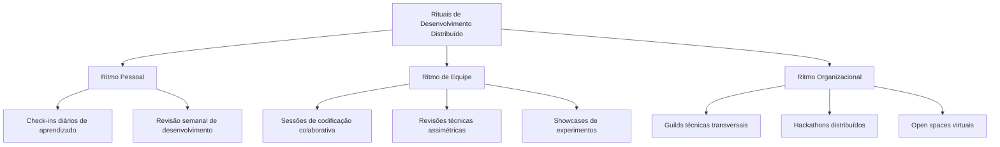

#### Caso Ilustrativo: Sistema STAR de uma Líder Técnica Remota

Marina, líder técnica em uma fintech totalmente distribuída, implementou o seguinte sistema para seu desenvolvimento contínuo:

- **S**haring: Cada semana, publica um documento conciso compartilhando um aprendizado técnico relevante
- **T**eaching: Mensalmente, conduz uma sessão de aprendizado para a equipe ou organização mais ampla
- **A**pplying: Mantém um "projeto de aprendizado" contínuo onde aplica novas tecnologias e conceitos
- **R**ituais: Blocos inegociáveis no calendário para desenvolvimento profissional e reflexão

O componente mais inovador de sua abordagem é o conceito de "pair learning" remoto: ela estabelece parcerias de aprendizado com outros líderes técnicos onde compartilham objetivos de desenvolvimento, trocam recursos e mantêm check-ins regulares sobre progresso.

