# 📘 PDI

## Guia Definitivo para Desenvolvimento Profissional e Pessoal

---

## 📋 Sumário

1. [Introdução: A Jornada de Transformação](https://claude.ai/chat/e2befb35-d131-47ca-88aa-5d3afea337bd#introdu%C3%A7%C3%A3o-a-jornada-de-transforma%C3%A7%C3%A3o)
2. [PDI: Muito Além de um Documento](https://claude.ai/chat/e2befb35-d131-47ca-88aa-5d3afea337bd#pdi-muito-al%C3%A9m-de-um-documento)
3. [Autoconhecimento: A Base do Desenvolvimento](https://claude.ai/chat/e2befb35-d131-47ca-88aa-5d3afea337bd#autoconhecimento-a-base-do-desenvolvimento)
4. [Objetivos que Inspiram e Transformam](https://claude.ai/chat/e2befb35-d131-47ca-88aa-5d3afea337bd#objetivos-que-inspiram-e-transformam)
5. [Estratégias de Planejamento para Resultados Extraordinários](https://claude.ai/chat/e2befb35-d131-47ca-88aa-5d3afea337bd#estrat%C3%A9gias-de-planejamento-para-resultados-extraordin%C3%A1rios)
6. [Da Teoria à Prática: Implementação Efetiva](https://claude.ai/chat/e2befb35-d131-47ca-88aa-5d3afea337bd#da-teoria-%C3%A0-pr%C3%A1tica-implementa%C3%A7%C3%A3o-efetiva)
7. [Mensuração de Progresso: Além dos Números](https://claude.ai/chat/e2befb35-d131-47ca-88aa-5d3afea337bd#mensura%C3%A7%C3%A3o-de-progresso-al%C3%A9m-dos-n%C3%BAmeros)
8. [A Cultura de Feedback Contínuo](https://claude.ai/chat/e2befb35-d131-47ca-88aa-5d3afea337bd#a-cultura-de-feedback-cont%C3%ADnuo)
9. [PDI para Diferentes Momentos de Carreira](https://claude.ai/chat/e2befb35-d131-47ca-88aa-5d3afea337bd#pdi-para-diferentes-momentos-de-carreira)
10. [Neurociência do Aprendizado para PDIs Excepcionais](https://claude.ai/chat/e2befb35-d131-47ca-88aa-5d3afea337bd#neuroci%C3%AAncia-do-aprendizado-para-pdis-excepcionais)
11. [PDI na Era da Fragmentação da Atenção](https://claude.ai/chat/e2befb35-d131-47ca-88aa-5d3afea337bd#pdi-na-era-da-fragmenta%C3%A7%C3%A3o-da-aten%C3%A7%C3%A3o)
12. [Desenvolvimento Imersivo: RV, RA e Simulações](https://claude.ai/chat/e2befb35-d131-47ca-88aa-5d3afea337bd#desenvolvimento-imersivo-rv-ra-e-simula%C3%A7%C3%B5es)
13. [Gamificação e Narrativa no Desenvolvimento Profissional](https://claude.ai/chat/e2befb35-d131-47ca-88aa-5d3afea337bd#gamifica%C3%A7%C3%A3o-e-narrativa-no-desenvolvimento-profissional)
14. [PDI Baseado em Dados: Abordagem Analítica](https://claude.ai/chat/e2befb35-d131-47ca-88aa-5d3afea337bd#pdi-baseado-em-dados-abordagem-anal%C3%ADtica)
15. [Desenvolvimento para Neurodiversidade e Inclusão](https://claude.ai/chat/e2befb35-d131-47ca-88aa-5d3afea337bd#desenvolvimento-para-neurodiversidade-e-inclus%C3%A3o)
16. [Micro-credentials e Aprendizado Modular](https://claude.ai/chat/e2befb35-d131-47ca-88aa-5d3afea337bd#micro-credentials-e-aprendizado-modular)
17. [Comunidades de Prática Potencializadas](https://claude.ai/chat/e2befb35-d131-47ca-88aa-5d3afea337bd#comunidades-de-pr%C3%A1tica-potencializadas)
18. [Biohacking para Performance Cognitiva](https://claude.ai/chat/e2befb35-d131-47ca-88aa-5d3afea337bd#biohacking-para-performance-cognitiva)
19. [PDI para Líderes: Desenvolvendo Pessoas](https://claude.ai/chat/e2befb35-d131-47ca-88aa-5d3afea337bd#pdi-para-l%C3%ADderes-desenvolvendo-pessoas)
20. [O Futuro do Desenvolvimento Profissional](https://claude.ai/chat/e2befb35-d131-47ca-88aa-5d3afea337bd#o-futuro-do-desenvolvimento-profissional)
21. [Autoavaliação e Próximos Passos](https://claude.ai/chat/e2befb35-d131-47ca-88aa-5d3afea337bd#autoavalia%C3%A7%C3%A3o-e-pr%C3%B3ximos-passos)
22. [Recursos e Referências Essenciais](https://claude.ai/chat/e2befb35-d131-47ca-88aa-5d3afea337bd#recursos-e-refer%C3%AAncias-essenciais)

---

## 🌟 Introdução: A Jornada de Transformação

> "O desenvolvimento pessoal é um processo, não um destino. É a jornada que nos transforma." - Carol Dweck, autora de "Mindset: A Nova Psicologia do Sucesso"

Você já se perguntou por que algumas pessoas parecem evoluir constantemente em suas carreiras, enquanto outras, igualmente talentosas, acabam estagnadas? A resposta, na maioria das vezes, está em uma abordagem intencional e estruturada para o desenvolvimento.

Bem-vindo à jornada do PDI Transformador – não apenas um documento, mas uma filosofia que pode revolucionar sua trajetória profissional. Este guia nasceu da minha experiência acompanhando centenas de profissionais em suas jornadas de desenvolvimento, combinando insights práticos com as mais recentes descobertas científicas sobre como realmente evoluímos.

Em um mundo onde as competências necessárias mudam a cada 2-3 anos, como afirma o Fórum Econômico Mundial, possuir um sistema para adquirir novas habilidades deixou de ser uma vantagem para se tornar uma necessidade de sobrevivência. Como diz Josh Bersin, especialista em desenvolvimento de talentos: "Num mundo de mudanças constantes, a capacidade de aprender continuamente é a habilidade mais valiosa que podemos desenvolver."

Neste guia, vamos explorar desde os fundamentos essenciais até as abordagens mais inovadoras e disruptivas para o desenvolvimento profissional. Você encontrará técnicas práticas, frameworks testados e histórias inspiradoras que ajudarão a criar um plano que realmente transforme suas capacidades e perspectivas.

Estou aqui para te guiar nessa jornada, mas lembre-se: seu desenvolvimento é algo profundamente pessoal. Sinta-se à vontade para adaptar, experimentar e descobrir os métodos que mais ressoam com seu contexto único. Afinal, a maior prova de um PDI bem-sucedido não está na perfeição do planejamento, mas na transformação real que ele possibilita.

Vamos começar?

---

## 🚀 PDI: Muito Além de um Documento

### O Que Realmente Define um PDI

Quando falamos de Plano de Desenvolvimento Individual, muitas pessoas imaginam imediatamente uma planilha preenchida uma vez por ano, frequentemente esquecida em alguma pasta digital. Mas um PDI verdadeiramente eficaz transcende essa visão limitada – é um organismo vivo, uma bússola que orienta decisões diárias e uma plataforma para conversas significativas sobre carreira e evolução.

Na sua essência mais poderosa, um PDI é:

- Uma **bússola estratégica** que orienta escolhas profissionais quando você está na encruzilhada de decisões importantes
- Um **contrato de compromisso** consigo mesmo, que reflete seus valores mais profundos e aspirações
- Um **catalisador de diálogos transformadores** sobre carreira e crescimento
- Uma **ferramenta viva** que evolui organicamente conforme você acumula experiências e insights

### A Anatomia de um PDI Transformador

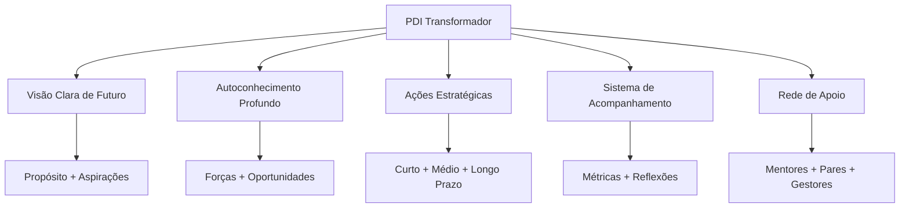

Analisando esse diagrama, percebe-se que um PDI transformador combina elementos de autoconhecimento com visão de futuro, traduzidos em ações concretas e suportados por um sistema eficaz de acompanhamento e uma rede sólida de apoio.

### Por que Muitos PDIs Falham?

Se você já teve a experiência de criar um plano de desenvolvimento que acabou abandonado, não está sozinho. Na minha experiência trabalhando com profissionais de todos os níveis, identifiquei padrões recorrentes que levam planos bem-intencionados ao fracasso:

- **Desconexão emocional**: Objetivos que soam bem no papel mas não ressoam com seus valores e motivações mais profundos
- **Ambição excessiva**: Metas irrealistas que geram frustração e abandono logo nos primeiros obstáculos
- **Isolamento**: Desenvolvimento sem apoio e feedback contínuo, tornando-se uma jornada solitária e desanimadora
- **Rigidez**: Incapacidade de adaptar-se às mudanças inevitáveis de contexto e prioridades
- **Falta de ritmo**: Ausência de rotinas e rituais que mantenham o desenvolvimento vivo no dia a dia

Para superar esses obstáculos, precisamos repensar fundamentalmente como abordamos o desenvolvimento profissional. O PDI que realmente transforma carreiras é aquele que se torna parte integrada da sua vida profissional diária, não apenas um exercício anual obrigatório.

> "Um grande produto começa com um problema real e uma visão clara de como resolvê-lo. Um PDI eficaz segue o mesmo princípio: começa com uma compreensão genuína de suas necessidades e uma visão inspiradora do profissional que você deseja se tornar."

Vamos agora explorar o primeiro e mais fundamental elemento de um PDI excepcional: o autoconhecimento profundo.

---

## 🔍 Autoconhecimento: A Base do Desenvolvimento

### O Tripé do Autoconhecimento Profissional

Já parou para pensar que somos como icebergs? A maior parte do que determina nosso desempenho profissional está abaixo da superfície – nossos valores fundamentais, crenças limitantes, talentos naturais e motivações inconscientes. Daniel Goleman, pioneiro da inteligência emocional, resume bem: "Sem autoconhecimento, ficamos pilotando no escuro".

O desenvolvimento significativo só começa quando temos clareza sobre quem somos de verdade, o que nos move e como impactamos o mundo ao nosso redor. O tripé do autoconhecimento que utilizo com profissionais consiste em:

1. **Clareza sobre valores e propósito** – Viktor Frankl, em seus estudos sobre sentido, descobriu que pessoas com propósito claro demonstram maior resiliência diante de desafios. Quando você conhece seus "porquês", consegue suportar quase qualquer "como".
    
2. **Consciência de pontos fortes e áreas de desenvolvimento** – A psicologia positiva, liderada por Martin Seligman, demonstra consistentemente que focar em potencializar talentos naturais traz resultados superiores a apenas tentar corrigir fraquezas. Como você definiria seus "superpoderes" profissionais?
    
3. **Entendimento do impacto de seu comportamento em diferentes contextos** – Tasha Eurich, pesquisadora de autoconsciência, distingue entre autoconsciência interna (como nos vemos) e externa (como os outros nos percebem). O alinhamento entre essas dimensões é fundamental para a eficácia profissional.
    

### Ferramentas Avançadas de Autodiagnóstico

#### 📊 Matriz SOAR vs. SWOT

A tradicional análise SWOT (Forças, Fraquezas, Oportunidades, Ameaças) deu lugar a uma abordagem mais positiva e orientada ao futuro: a matriz SOAR, desenvolvida por Jacqueline Stavros e Gina Hinrichs.

|SOAR|Foco|Exemplo Prático|
|---|---|---|
|**S**trengths (Forças)|O que você faz excepcionalmente bem|"Minha capacidade de sintetizar dados complexos em narrativas claras"|
|**O**pportunities (Oportunidades)|Possibilidades no ambiente externo|"Crescente demanda por interpretação de dados na minha indústria"|
|**A**spirations (Aspirações)|O que você quer ser e alcançar|"Tornar-me referência em data storytelling em 2 anos"|
|**R**esults (Resultados)|Como o sucesso será mensurado|"Liderar projetos de análise estratégica com impacto mensurável"|

**Exercício Prático: Sua Matriz SOAR**

Reserve 20 minutos agora para completar sua matriz SOAR pessoal. Na minha experiência facilitando este exercício com centenas de executivos, percebo que aqueles que chegam a exemplos concretos (não genéricos) conseguem insights muito mais valiosos.

#### 🔄 O Poder do Feedback Multidimensional

O feedback 360° estruturado, técnica popularizada por Marshall Goldsmith, oferece perspectivas valiosas sobre nossos pontos cegos comportamentais. Para maximizar seu valor:

- **Diversifique as fontes**: Inclua gestores, pares, subordinados e até clientes – cada grupo enxerga facetas diferentes do seu comportamento
    
- **Estruture as perguntas**: Craig Chappelow do Center for Creative Leadership recomenda utilizar questões específicas sobre comportamentos observáveis, não traços de personalidade ("Como esta pessoa lida com situações de conflito?" em vez de "Esta pessoa é paciente?")
    
- **Triangule os dados**: Jim Collins, autor de "Good to Great", sugere buscar padrões mencionados por múltiplas fontes para identificar tendências reais versus opiniões isoladas
    
- **Separe observação de interpretação**: Técnica fundamental da Comunicação Não-Violenta de Marshall Rosenberg, distinguindo "o que aconteceu" de "o que penso sobre o que aconteceu"
    

**Caso Ilustrativo:**

> Marina, gerente de produto que acompanhei, implementou um sistema trimestral de feedback 360° inspirado nas práticas do Google. Descobriu que, embora fosse admirada por sua visão estratégica, sua comunicação era percebida como excessivamente técnica para stakeholders não-técnicos. Este insight a levou a desenvolver métodos de comunicação adaptados a diferentes audiências, resultando em maior alinhamento e engajamento das equipes cross-funcionais.

#### 🧠 Além dos Testes: Autoconhecimento Experiencial

Quantas vezes você já "soube" algo intelectualmente, mas não conseguiu incorporar esse conhecimento em seu comportamento? David Kolb, em sua Teoria da Aprendizagem Experiencial, explica que o verdadeiro autoconhecimento vem da experiência reflexiva:

- **Diário de situações críticas**: Técnica utilizada por líderes como Bill Gates e Oprah Winfrey, registrando detalhadamente situações desafiadoras, suas reações e resultados
    
- **Práticas contemplativas**: Jon Kabat-Zinn demonstrou como a meditação mindfulness desenvolve nossa capacidade de observação imparcial de padrões mentais
    
- **Experimentos comportamentais**: Inspirados na metodologia "Test and Learn" de Eric Ries, teste conscientemente novas abordagens em situações controladas
    
- **Mentoria reversa**: Prática adotada por executivos da General Electric, onde você aprende sobre si mesmo ao orientar outros com perspectivas diferentes
    

### Mapeamento de Competências: Abordagem Sistêmica

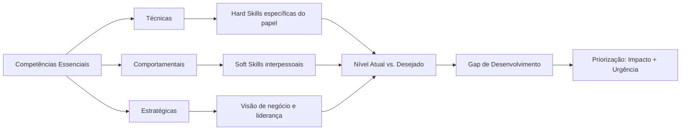

Este mapeamento sistêmico permite visualizar não apenas o estado atual e desejado de suas competências, mas também as interdependências entre diferentes áreas. Como Kent Beck, criador do Extreme Programming e TDD, afirma: "Os melhores desenvolvedores sabem que entender o problema é mais importante que conhecer a solução. No desenvolvimento pessoal, compreender profundamente a si mesmo precede qualquer plano de ação eficaz."

Com um alicerce sólido de autoconhecimento, estamos prontos para o próximo passo: definir objetivos que verdadeiramente inspirem e transformem.

---

## 🎯 Objetivos que Inspiram e Transformam

### Além do SMART: Objetivos que Realmente Movem

Quem não conhece o acrônimo SMART (Específicos, Mensuráveis, Atingíveis, Relevantes, Temporais) para definição de objetivos? Esse framework tem seu valor, mas objetivos verdadeiramente transformadores possuem qualidades adicionais que transcendem essa fórmula padrão.

#### 🔥 A Abordagem HARD

Desenvolvida por Mark Murphy, autor de "HARD Goals", esta metodologia complementa a abordagem SMART adicionando dimensões de significado pessoal e desafio:

|Elemento|Descrição|Exemplo|
|---|---|---|
|**H**eartfelt (Significativo)|Conexão emocional profunda|"Este objetivo ressoa com meus valores mais profundos de criatividade e impacto"|
|**A**nimated (Vívido)|Visualização clara e detalhada|"Posso visualizar detalhadamente como será liderar aquela equipe inovadora"|
|**R**equired (Necessário)|Senso de urgência e importância|"Esta transformação é fundamental para onde quero chegar em minha carreira"|
|**D**ifficult (Desafiador)|Esforço que exige crescimento|"Este objetivo me forçará a desenvolver capacidades que ainda não possuo"|

Quando você define objetivos que combinam as qualidades SMART com os elementos HARD, cria metas que não apenas direcionam ações, mas energizam e inspiram. São objetivos que você persegue não porque "deve", mas porque genuinamente "quer".

#### 💫 Objetivos Transformacionais vs. Transacionais

Há uma diferença fundamental entre objetivos que buscam uma transação externa e aqueles que visam uma transformação interna:

|Objetivos Transacionais|Objetivos Transformacionais|
|---|---|
|Foco em métricas externas|Foco em transformação interna|
|"Concluir certificação X"|"Dominar conceitos que mudarão minha perspectiva sobre o mercado"|
|"Obter promoção ao cargo Y"|"Desenvolver liderança que inspira e potencializa a equipe"|
|Orientados a marcos|Orientados a desenvolvimento de mindset|

Os objetivos transacionais têm seu lugar, mas são os transformacionais que realmente impulsionam mudanças profundas e duradouras em sua carreira. Como Teresa Amabile, professora de Harvard, descobriu em sua pesquisa sobre progresso e motivação, o sentimento de desenvolvimento pessoal é um dos maiores impulsionadores da satisfação profissional.

### A Hierarquia de Objetivos: Alinhamento Vertical

Para maximizar impacto e consistência, seus objetivos devem seguir uma hierarquia clara, onde cada nível suporta e alimenta o próximo:

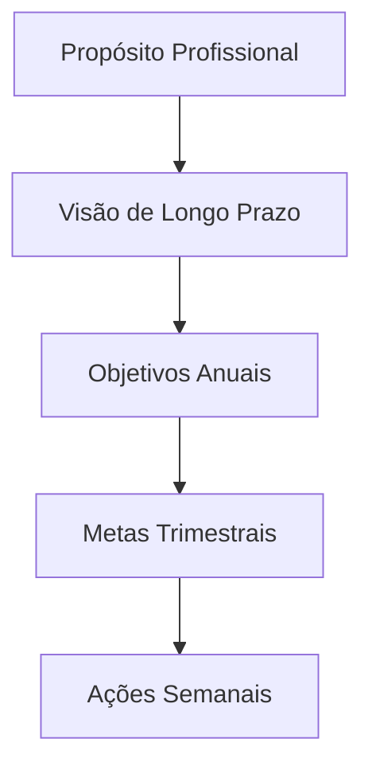

**Exercício de Alinhamento:**

1. Defina seu propósito profissional em uma frase clara e inspiradora
2. Visualize onde quer estar em 3-5 anos (sendo específico sobre funções, realizações, impacto)
3. Estabeleça 2-3 objetivos anuais que contribuam diretamente para essa visão
4. Decomponha cada objetivo anual em metas trimestrais tangíveis
5. Traduza a meta trimestral atual em ações semanais concretas

Quando seus objetivos estão verdadeiramente alinhados dessa forma, até mesmo as pequenas ações diárias ganham significado maior, conectando-se a seu propósito mais amplo. Como o arquiteto Bjarke Ingels diz: "O poder está em poder traçar uma linha direta entre o que você faz diariamente e a diferença que você quer fazer no mundo."

### O Poder dos Anti-Objetivos

Tão importante quanto definir o que queremos alcançar é clarificar o que deliberadamente escolhemos NÃO fazer. Anti-objetivos são declarações explícitas do que você está disposto a deixar de lado para focar no que realmente importa.

**Exemplo:**

|Objetivo|Anti-Objetivo|
|---|---|
|Desenvolver liderança estratégica|NÃO buscarei dominar todos os detalhes técnicos|
|Aprofundar expertise em área específica|NÃO tentarei abraçar múltiplos domínios simultaneamente|
|Construir relações significativas|NÃO focarei em expandir rede de contatos quantitativamente|

Como Greg McKeown, autor de "Essencialismo", enfatiza: "Se não priorizamos nossa vida, alguém fará isso por nós." Os anti-objetivos tornam explícitas suas escolhas de priorização, protegendo seu foco e energia do que não está alinhado com sua visão maior.

> "As melhores visões de produto não apenas definem o que incluir, mas fazem escolhas corajosas sobre o que deixar de fora. Da mesma forma, um PDI excepcional requer foco e renúncias estratégicas."

Com objetivos claros e inspiradores estabelecidos, precisamos agora de estratégias eficazes para transformá-los em realidade.

---

## 🧩 Estratégias de Planejamento para Resultados Extraordinários

### Modelos Integrados de Desenvolvimento

#### 📋 O Framework CEP+R Aprofundado

O modelo CEP+R (Conteúdo, Experiência, Pessoas e Redes) oferece uma abordagem holística para desenvolvimento profissional, reconhecendo que o aprendizado efetivo acontece através de múltiplos canais:

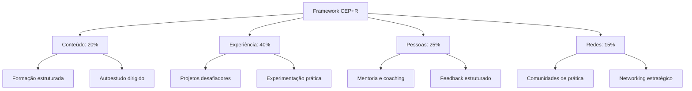

**Exemplo de Aplicação Prática**

Para o objetivo "Tornar-se um líder de produto centrado no cliente":

|Componente|Proporção|Atividades Específicas|
|---|---|---|
|**Conteúdo**|20%|• Curso "Product Leadership" na universidade corporativa • Leitura de 1 livro mensal sobre design thinking e comportamento do cliente • Assinatura de newsletters especializadas|
|**Experiência**|40%|• Liderar um projeto de discovery com usuários reais • Implementar sistema de feedback contínuo de clientes • Conduzir 5 entrevistas mensais com usuários|
|**Pessoas**|25%|• Sessões mensais com mentor sênior em UX • Shadowing com líderes de produto em outras equipes • Feedback quinzenal sobre decisões de produto|
|**Redes**|15%|• Participação ativa em comunidade de product managers • Apresentações em meetups internos • Contribuições em fóruns especializados|

Esta abordagem equilibrada reconhece que apenas o estudo formal (Conteúdo) é insuficiente para desenvolvimento profundo. O verdadeiro aprendizado acontece na aplicação prática (Experiência), na interação com mentores e modelos (Pessoas) e na participação em comunidades relevantes (Redes).

#### 🔄 Modelo 70/20/10 Reimaginado

Originalmente desenvolvido pelo Center for Creative Leadership, o modelo 70/20/10 sugere que o desenvolvimento ocorre predominantemente através da experiência prática (70%), seguido por interações sociais (20%) e apenas 10% via educação formal. Esta abordagem clássica pode ser adaptada para o contexto atual de trabalho híbrido e aprendizado contínuo:

|Dimensão|Abordagem Tradicional|Abordagem Contemporânea|
|---|---|---|
|**70%** Experiência|Aprendizado no trabalho diário|Projetos intencionais desafiadores + Experimentação protegida|
|**20%** Social|Feedback informal e observação|Coaching estruturado + Comunidades de prática virtuais|
|**10%** Formal|Cursos e treinamentos presenciais|Microlearning contínuo + Aprendizado adaptativo personalizado|

A versão contemporânea desse modelo enfatiza a intencionalidade e a estrutura. Em vez de simplesmente "aprender fazendo", você desenha experiências específicas que desenvolvem as competências desejadas. O componente social transcende o feedback casual, incorporando relacionamentos de desenvolvimento estruturados. E o aprendizado formal é distribuído em pequenas doses frequentes, em vez de concentrado em eventos isolados.

### Planejamento Sistemático: Além do 5W2H

O framework 5W2H (O quê, Por quê, Onde, Quando, Quem, Como, Quanto) oferece uma base sólida para planejamento, mas pode ser aprimorado com elementos adicionais que aumentam significativamente sua eficácia:

#### 📊 Framework 5W2H+I+R

|Elemento|Questão-chave|Exemplo Aplicado|
|---|---|---|
|**What** (O quê)|O que preciso desenvolver?|Habilidades de facilitação para reuniões complexas e decisões em grupo|
|**Why** (Por quê)|Por que isso é importante?|Para aumentar produtividade e engajamento em decisões críticas do time|
|**Where** (Onde)|Em quais contextos aplicarei?|Reuniões interdepartamentais e workshops de cocriação|
|**When** (Quando)|Qual o cronograma de desenvolvimento?|Próximos 4 meses, com marcos mensais de progresso|
|**Who** (Quem)|Quem pode apoiar este desenvolvimento?|Mentor especialista em facilitação + coach de comunicação|
|**How** (Como)|Quais métodos específicos utilizarei?|Curso de facilitação + prática gradual em contextos reais|
|**How much** (Quanto)|Qual investimento necessário?|5h semanais + R$X em recursos + energia emocional para errar e aprender|
|**Impact** (Impacto)|Qual transformação esperada?|Decisões 30% mais rápidas e aumento em 40% no engajamento das equipes|
|**Risks** (Riscos)|Quais obstáculos devo antecipar?|Resistência inicial das equipes + sobrecarga do calendário|

Os elementos adicionais de Impacto e Riscos são particularmente valiosos: o primeiro clarifica os benefícios esperados, fortalecendo a motivação; o segundo antecipa possíveis obstáculos, permitindo a criação de estratégias preventivas.

> "Assim como o desenvolvimento de software requer sistemas para gerenciar complexidade, o desenvolvimento profissional necessita de frameworks que transformem aspirações abstratas em ações concretas e mensuráveis."

Com estratégias de planejamento bem definidas, o próximo desafio é traduzi-las em implementação consistente e sustentável.

---

## 🛠️ Da Teoria à Prática: Implementação Efetiva

### O Plano de Implementação Estruturado

Um PDI excepcional precisa de um sistema de implementação igualmente robusto. Como diz o especialista em hábitos James Clear: "Você não cresce até o nível das suas metas; você cai para o nível dos seus sistemas."

#### 🗓️ Ritmos de Execução e Revisão

Estabeleça ciclos definidos para diferentes níveis de atividades:

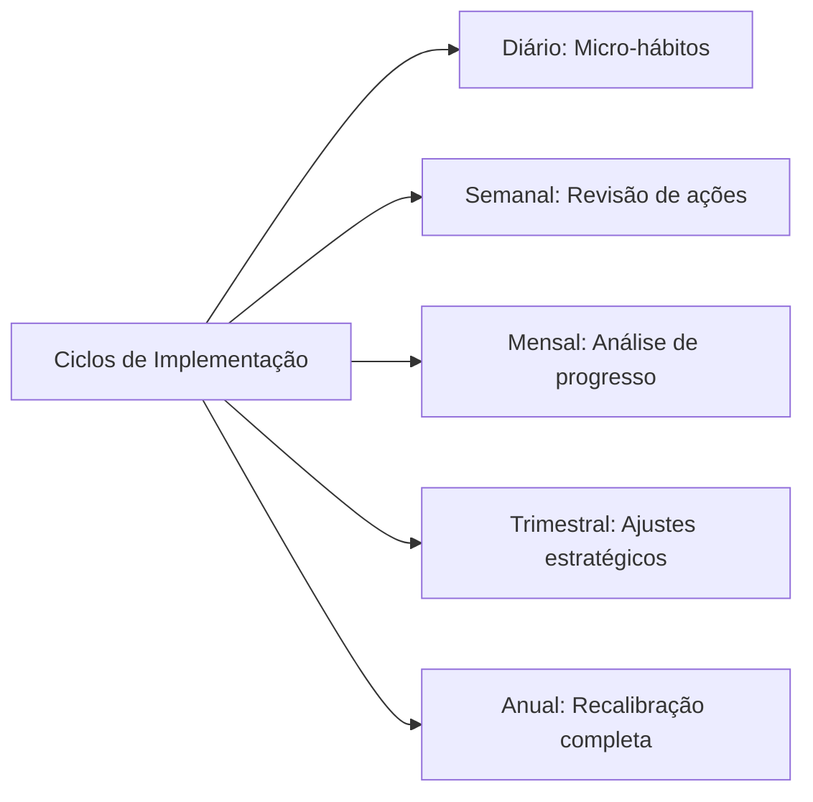

**Sistema de Implementação Diária:**

1. **Ritual matinal** (5-10 min): Reserve um momento no início do dia para revisar suas prioridades de desenvolvimento, conectando-as às atividades planejadas
    
2. **Blocos protegidos** (30-90 min): Defina períodos específicos em seu calendário exclusivamente dedicados a atividades de desenvolvimento, tratando-os com o mesmo respeito que reuniões importantes
    
3. **Micro-momentos** (5-10 min): Identifique pequenas oportunidades ao longo do dia para prática deliberada de novas habilidades
    
4. **Reflexão noturna** (5-10 min): Dedique alguns minutos no final do dia para registrar aprendizados e planejar ações de desenvolvimento para o dia seguinte
    

#### 📈 Exemplo de Plano de Implementação Detalhado

Para o objetivo "Desenvolver competências avançadas em storytelling com dados":

|Horizonte|Atividades de Desenvolvimento|Sistema de Acompanhamento|
|---|---|---|
|**Diário**|• 15 min de estudo de visualizações exemplares • Aplicação consciente em pelo menos 1 comunicação|Checklist diário com registro de insights|
|**Semanal**|• 1 hora dedicada a curso online • Análise crítica de 1 dashboard ou apresentação|Revisão de progresso com par de accountability|
|**Mensal**|• Criação de 1 visualização complexa • Sessão de feedback com especialista|Documentação estruturada de evolução com exemplos|
|**Trimestral**|• Projeto aplicado com stakeholders reais • Avaliação formal de competência|Retrospectiva detalhada com mentor|

O poder deste sistema está em criar múltiplos ciclos de feedback, permitindo ajustes frequentes e celebrações de pequenas vitórias ao longo do percurso.

### Sistemas de Hábitos para Desenvolvimento Sustentável

O desenvolvimento contínuo depende fundamentalmente da formação de hábitos consistentes, não apenas de ações pontuais.

#### 🔄 O Loop de Hábitos Profissionais

Charles Duhigg, autor de "O Poder do Hábito", popularizou o modelo do loop de hábitos, que pode ser adaptado para desenvolvimento profissional:

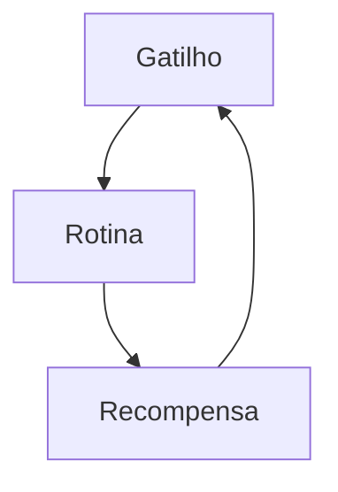

**Aplicação Prática:**

|Componente|Descrição|Exemplo para "Desenvolver Escuta Ativa"|
|---|---|---|
|**Gatilho**|Sinal que inicia o comportamento|Início de cada reunião ou conversa 1:1|
|**Rotina**|Comportamento a ser desenvolvido|Protocolo estruturado: (1) Contato visual, (2) Perguntas abertas, (3) Paráfrase para confirmação|
|**Recompensa**|Benefício imediato percebido|Auto-reconhecimento + registro de insight valioso obtido|

A chave para criar hábitos duradouros é tornar os gatilhos óbvios, as rotinas atrativas e as recompensas satisfatórias. Com o tempo, o que antes exigia esforço consciente torna-se automático, liberando capacidade mental para novos desafios.

#### 🏗️ Scaffolding: Suporte Progressivo para Novos Comportamentos

Inspirado no conceito educacional de "andaimes", o scaffolding para desenvolvimento profissional envolve criar sistemas de suporte que podem ser gradualmente removidos à medida que a competência aumenta:

1. **Suporte máximo**: No início, use checklists detalhados e busque acompanhamento direto de mentores para cada aplicação da nova habilidade
    
2. **Suporte moderado**: À medida que ganha confiança, passe a utilizar lembretes estratégicos e revisão periódica
    
3. **Suporte mínimo**: Posteriormente, implemente gatilhos ambientais sutis que mantêm a consciência da habilidade
    
4. **Autonomia**: Finalmente, o comportamento se integra ao seu modo natural de operação, não exigindo suporte externo
    

Esta abordagem gradual reconhece que o desenvolvimento de novas competências raramente acontece de uma vez. Como observa a especialista em aprendizado adulto Ellen Langer: "A maioria das pessoas precisa de estrutura para desenvolver autonomia."

> "O melhor código é aquele que funciona não apenas no ambiente de desenvolvimento, mas no mundo real, sob condições variáveis. Da mesma forma, o melhor PDI é aquele que sobrevive ao contato com a realidade caótica do dia a dia profissional."

Com sistemas de implementação robustos, precisamos agora considerar como medir efetivamente o progresso, indo além de métricas simplistas.

---

## 📊 Mensuração de Progresso: Além dos Números

### Métricas Multidimensionais de Desenvolvimento

A mensuração efetiva de desenvolvimento profissional transcende indicadores simplistas como "completou/não completou" ou avaliações numéricas isoladas.

#### 🎯 Framework de Indicadores Balanceados

|Tipo de Métrica|Descrição|Exemplos|
|---|---|---|
|**Métricas de Esforço**|Quantificam a dedicação ao desenvolvimento|• Horas investidas • Consistência de práticas • Quantidade de iterações|
|**Métricas de Progresso**|Avaliam evolução em competências específicas|• Avaliações estruturadas • Feedback comparativo • Auto-avaliações calibradas|
|**Métricas de Aplicação**|Medem a transferência para contextos reais|• Frequência de aplicação • Qualidade de implementação • Adaptabilidade contextual|
|**Métricas de Resultado**|Avaliam o impacto nos objetivos finais|• KPIs de performance • Feedback de stakeholders • Novas oportunidades geradas|

Este framework multidimensional oferece uma visão muito mais rica e completa do desenvolvimento profissional. As métricas de esforço reconhecem a dedicação, enquanto as métricas de progresso capturam a evolução de competências específicas. As métricas de aplicação monitoram como o aprendizado se transfere para situações reais, e as métricas de resultado medem o impacto tangível.

#### 📉 Curvas de Aprendizado: Expectativas Realistas

O desenvolvimento raramente segue uma progressão linear. Compreender as fases típicas de uma curva de aprendizado permite estabelecer expectativas realistas e implementar estratégias apropriadas para cada momento:

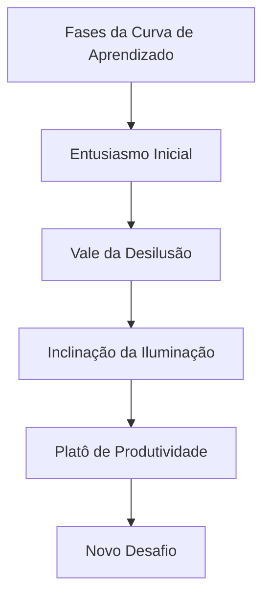

**Estratégias para Cada Fase:**

|Fase|Características|Abordagens Recomendadas|
|---|---|---|
|**Entusiasmo Inicial**|Alta motivação, resultados rápidos|Celebrar pequenas vitórias, estabelecer fundamentos|
|**Vale da Desilusão**|Frustração, percepção de estagnação|Suporte intensificado, recordar propósito maior|
|**Inclinação da Iluminação**|Padrões começam a emergir|Buscar aplicações mais complexas, conectar conceitos|
|**Platô de Produtividade**|Competência estabilizada|Ensinar outros, identificar refinamentos sutis|
|**Novo Desafio**|Risco de estagnação|Estabelecer próximo nível de maestria ou nova competência|

Reconhecer que o "Vale da Desilusão" é uma fase normal e temporária ajuda a perseverar quando a motivação inicial diminui. Como explica Seth Godin em seu livro "The Dip": "Os vencedores não desistem no fundo; eles encontram uma maneira de permanecer engajados com o trabalho para superar o ponto mais baixo."

### Documentação Reflexiva de Jornada

Para além de métricas quantitativas, o desenvolvimento profissional significativo beneficia-se de práticas reflexivas estruturadas que capturem nuances qualitativas da jornada.

#### 📓 Protocolo de Reflexão Estruturada

**Template para Reflexão Periódica:**

1. **Realizações significativas**: O que realizei no último período que representa progresso real em meu desenvolvimento?
    
2. **Insights transformadores**: Quais descobertas ou compreensões mudaram minha perspectiva sobre esta área?
    
3. **Padrões observados**: Que comportamentos recorrentes identifiquei que facilitam ou dificultam meu desenvolvimento?
    
4. **Obstáculos enfrentados**: Quais desafios específicos encontrei e como respondi a eles?
    
5. **Ajustes necessários**: Com base nessas observações, o que preciso modificar em minha abordagem?
    
6. **Próximos passos**: Quais ações específicas decorrentes desta reflexão implementarei no próximo ciclo?
    

Esta reflexão regular não é apenas um registro histórico, mas uma ferramenta ativa de desenvolvimento que acelera o aprendizado através da extração consciente de insights. Como John Dewey, pioneiro da educação experiencial, observou: "Não aprendemos com a experiência. Aprendemos refletindo sobre a experiência."

> "As melhores métricas não apenas medem resultados, mas iluminam o caminho à frente. No desenvolvimento profissional, as medições mais valiosas são aquelas que geram insights acionáveis para o próximo ciclo de crescimento."

A mensuração eficaz de progresso alimenta naturalmente outro componente crucial do desenvolvimento: o feedback contínuo.

---

## 🔄 A Cultura de Feedback Contínuo

### Além do Feedback Tradicional

O feedback eficaz para desenvolvimento vai muito além de avaliações anuais ou comentários genéricos. Quando bem estruturado, torna-se uma fonte contínua de insights que aceleram significativamente o desenvolvimento.

#### 🔍 Níveis de Profundidade do Feedback

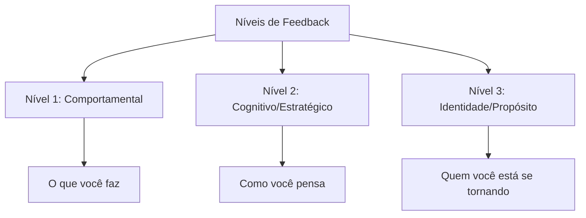

**Exemplos Práticos:**

|Nível|Exemplo de Feedback|Valor para Desenvolvimento|
|---|---|---|
|**Comportamental**|"Observei que você interrompe com frequência durante as reuniões de planejamento"|Identifica padrões concretos para ajustes imediatos|
|**Cognitivo**|"Percebo que você prioriza eficiência técnica sobre construção de consenso nas decisões de arquitetura"|Revela modelos mentais e vieses subjacentes|
|**Identidade**|"Suas ações refletem alguém comprometido com excelência técnica, mas talvez às custas de mentoria e desenvolvimento da equipe"|Conecta comportamentos a valores e aspirações profundas|

O feedback realmente transformador atinge todos os três níveis. O nível comportamental oferece ajustes imediatos, o nível cognitivo revela padrões de pensamento, e o nível de identidade conecta ações com aspirações mais profundas.

#### 📝 Protocolo de Feedback para Desenvolvimento

Para maximizar o valor do feedback no contexto de PDI:

1. **Preparação contextual**: Antes de solicitar feedback, esclareça: "Estou desenvolvendo X competência e valorizo feedback específico nesta área"
    
2. **Solicitação direcionada**: Seja preciso: "Pode observar especificamente como eu [comportamento específico] durante [situação específica]?"
    
3. **Escuta ativa**: Ao receber feedback, mantenha foco total na perspectiva do outro, sem defesa ou justificativa
    
4. **Exploração de nuances**: Aprofunde com perguntas como "Pode me dar um exemplo específico?" ou "Como isso impacta Y?"
    
5. **Conexão com PDI**: Explicite a relevância: "Como isso se relaciona com meu objetivo de desenvolvimento X?"
    
6. **Ação imediata**: Comprometa-se com um experimento específico baseado no feedback: "Baseado nisso, na próxima reunião vou testar..."
    

Este protocolo estruturado transforma feedback de algo potencialmente ameaçador em uma ferramenta poderosa de desenvolvimento. Como observa o especialista em liderança David Rock, "o feedback bem administrado ativa a curiosidade em vez da ameaça, criando um estado cerebral ideal para aprendizado."

### Criando Ciclos Virtuosos de Desenvolvimento

#### 🔄 O Loop de Feedback Integrado ao Cotidiano

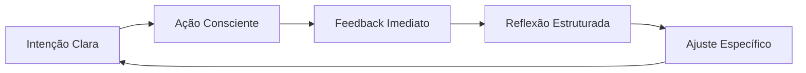

**Exemplos de Implementação:**

|Estágio|Prática Concreta|Ferramenta de Suporte|
|---|---|---|
|**Intenção Clara**|Definir foco de desenvolvimento para a semana|Template de planejamento semanal|
|**Ação Consciente**|Aplicar deliberadamente em situações específicas|Lembretes contextuais estratégicos|
|**Feedback Imediato**|Solicitar micro-feedbacks após interações-chave|Perguntas padronizadas de 1 minuto|
|**Reflexão Estruturada**|Documentar padrões e insights regularmente|Diário de aprendizado digital|
|**Ajuste Específico**|Implementar mudança pontual baseada em insights|Experimentos comportamentais de 7 dias|

Este sistema cria um fluxo contínuo de aprendizado e ajuste, significativamente mais eficaz que os ciclos anuais tradicionais de feedback. A rápida iteração permite ajustes frequentes, mantendo seu desenvolvimento constantemente alinhado às necessidades emergentes.

> "O feedback é como um espelho necessário para nosso desenvolvimento. Sem ele, estamos navegando às cegas, baseados apenas em nossas próprias percepções limitadas. Um PDI excepcional incorpora mecanismos robustos para capturar e integrar múltiplas perspectivas."

Tendo explorado os elementos fundamentais de um PDI eficaz, vamos agora examinar como adaptar esta abordagem para diferentes momentos da trajetória profissional.

---

## 🔄 PDI para Diferentes Momentos de Carreira

O desenvolvimento profissional não é um processo uniforme - ele evolui conforme avançamos em nossa jornada. Como observa Jennifer Petriglieri em "Casais que Trabalham": "As transições de carreira não são apenas mudanças no que fazemos, mas transformações em quem somos."

### Fase Inicial de Carreira (0-5 anos)

**Desafios Típicos:**

- Identificação de forças e paixões genuínas
- Desenvolvimento de competências técnicas fundamentais
- Construção de confiança e credibilidade profissional
- Adaptação à cultura organizacional

**Abordagens Recomendadas:**

- **Experimentação Ampla**: Como defende Reid Hoffman em "The Start-up of You", experimente diferentes funções e projetos para descobrir onde sua energia naturalmente flui
- **Mentorias Estruturadas**: Programa de rotação entre diferentes mentores a cada 3-4 meses
- **Aprendizado Técnico Intensivo**: Blocos dedicados para desenvolvimento de hard skills (método de imersão técnica da Shopify)
- **Feedback de Alto Volume**: Sistema de mini-feedbacks após cada entrega significativa

**Exemplo Prático:**

> Julia, desenvolvedora júnior, criou um PDI focado no método "T-shaped professional" de Tim Brown (IDEO): profundidade em uma competência técnica (desenvolvimento back-end) combinada com amplitude em habilidades complementares (UX, comunicação com stakeholders). Ela estabeleceu um sistema de projetos paralelos mensais para explorar diferentes especialidades, mantendo um "diário de energia" para identificar quais atividades a deixavam mais engajada.

### Meio de Carreira (5-15 anos)

**Desafios Típicos:**

- Transição de contribuidor individual para gestor (quando aplicável)
- Superação de plateaus de desenvolvimento
- Balanceamento entre especialização e versatilidade
- Reavaliação de propósito e alinhamento com valores

**Abordagens Recomendadas:**

- **Desenvolvimento em Profundidade vs. Amplitude**: Metodologia de "escalada T" proposta por Kelley & Kelley da d.school de Stanford
- **Projetos de Alto Impacto**: Liderança de iniciativas estratégicas cross-funcionais
- **Troca de Contextos Deliberada**: Rotação entre departamentos ou funções para ampliar perspectiva
- **Mentoria Reversa**: Orientação de profissionais mais jovens para atualização em tendências emergentes

**Exemplo Prático:**

> Ricardo, gerente de marketing com 8 anos de experiência, aplicou o framework de "desenvolvimento adaptativo" de Robert Kegan para superar um plateau de crescimento. Ele identificou seu "sistema operacional mental" atual (Kegan nível 3: foco em aprovação externa) e trabalhou com um coach para evoluir para o nível 4 (autogerado). Seu PDI incluía "experimentos de contorno", onde deliberadamente assumia posições impopulares mas bem fundamentadas em discussões estratégicas para desenvolver autonomia intelectual.

### Fase Avançada de Carreira (15+ anos)

**Desafios Típicos:**

- Manutenção de relevância em ambiente em rápida mudança
- Desenvolvimento de liderança estratégica e visionária
- Construção de legado e impacto duradouro
- Rejuvenescimento profissional e prevenção de estagnação

**Abordagens Recomendadas:**

- **Conselho Estratégico**: Participação em boards e comitês consultivos
- **Síntese de Sabedoria Prática**: Documentação e compartilhamento de conhecimento tácito acumulado
- **Desenvolvimento de Sucessores**: Programas estruturados de mentoria para próxima geração
- **Renovação Significativa**: Imersão em novas disciplinas ou tendências disruptivas

**Exemplo Prático:**

> Helena, diretora executiva com 22 anos de experiência, aplicou o conceito de "ikigai profissional" para reorientar sua carreira. Seu PDI focou na intersecção entre suas habilidades consolidadas em gestão estratégica e seu interesse emergente em sustentabilidade corporativa. Ela estabeleceu uma prática de "aprendizado em trindade": para cada área nova, combinava estudo formal, mentoria com especialista, e projeto prático aplicado. Isso levou à criação de uma nova vertical de negócios sustentáveis em sua organização.

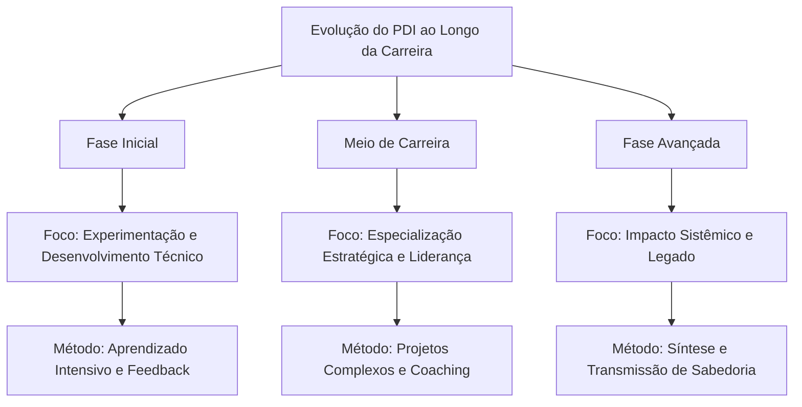

---

## 🧠 Neurociência do Aprendizado para PDIs Excepcionais

O entendimento atual de como o cérebro aprende e se desenvolve oferece insights valiosos para otimizar o desenvolvimento profissional. Como destaca Andrew Huberman, neurocientista de Stanford: "A neuroplasticidade não é um evento, mas um processo que requer condições específicas para ocorrer de forma eficaz."

### Janelas de Neuroplasticidade

**Princípios Fundamentais:**

- O cérebro adulto mantém capacidade significativa de mudança (pesquisas de Michael Merzenich)
- A neuroplasticidade é dependente de atenção focada e estado neurológico específico
- Períodos de intensidade seguidos por recuperação otimizam a consolidação neural

**Aplicações Práticas para seu PDI:**

1. **Técnica de Aprendizado Espaçado**: Baseada nos estudos de Hermann Ebbinghaus e refinada por pesquisas recentes em neurociência, esta abordagem utiliza intervalos estratégicos:
    
    - Prática inicial intensiva (60-90 minutos)
    - Revisão após 24 horas
    - Reforço após 1 semana
    - Consolidação após 1 mês
2. **Protocolo de Estado Ótimo**: Desenvolvido com base nas pesquisas de Mihaly Csikszentmihalyi sobre "flow" e estudos de EEG:
    
    - 10-15 minutos de preparação (respiração controlada 5-7-5 para ativar estado parassimpático)
    - 25-45 minutos de prática focada ("janela de atenção produtiva" identificada por K. Anders Ericsson)
    - Breve recuperação (micropausa não-digital de 5 minutos)
    - Repetir 2-3 ciclos em uma sessão
3. **Técnica de Encoding Multisensorial**: Baseada nas pesquisas sobre memória de Richard Atkinson e consolidação de memória de James McGaugh:
    
    - Engajar múltiplos sentidos ao aprender nova habilidade
    - Verbalizar conceitos enquanto pratica (ativação simultânea de áreas motoras e verbais)
    - Ensinar conceito a outra pessoa dentro de 24-48 horas (técnica Feynman neuroaprimorada)

### Ciclos Otimizados de Desafio/Recuperação

A pesquisa sobre plasticidade cerebral de Bruce McEwen e os estudos sobre adaptação de Anders Ericsson revelam que o desenvolvimento ideal ocorre em um ritmo biologicamente alinhado:

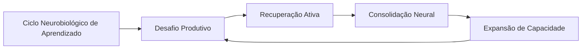

**Protocolo Prático para PDI:**

1. **Identificação da "Dificuldade Desejável"**: Como definido por Robert Bjork, trabalhe em tarefas que sejam aproximadamente 15-20% acima de sua capacidade atual
    
2. **Prática Deliberada Intercalada**: Alterne entre diferentes subhabilidades relacionadas, criando interferência produtiva (pesquisa de Elizabeth Bjork sobre aprendizado intercalado)
    
3. **Recuperação Neurocognitiva**: Após sessões intensas, utilize:
    
    - Caminhada de baixa intensidade (15-20 min) para estimular BDNF (Fator Neurotrófico Derivado do Cérebro)
    - Sono de qualidade priorizado nas 24h seguintes (fundamental para consolidação via ondas delta)
    - Reflexão estruturada para reforçar circuitos neurais (técnica de Barbara Oakley)

### Gatilhos Neurobiológicos de Motivação

As pesquisas de Wolfram Schultz sobre dopamina e Robert Sapolsky sobre estresse nos oferecem insights valiosos sobre como otimizar a motivação sustentável:

1. **Arquitetura de Recompensas Variáveis**: Baseada nos estudos de B.F. Skinner refinados pela neurociência moderna:
    
    - Pequenas celebrações após conclusão de tarefas (liberação de dopamina)
    - Recompensas intermitentes não-previsíveis para manter engajamento
    - Sistema de marcos com significado pessoal (não apenas marcos arbitrários)
2. **Gerenciamento de Estados Neuroquímicos**:
    
    - Prática de alta intensidade pela manhã (aproveitando cortisol elevado)
    - Tarefas criativas durante "depressão pós-almoço" (estado cerebral difuso favorece conexões não-óbvias)
    - Ritual de fechamento para ativação de sistema parassimpático (redução de cortisol)

> "Entender a neurobiologia do aprendizado não diminui a magia do desenvolvimento humano - apenas nos permite criar condições ideais para que essa magia aconteça de forma mais consistente." - Andrew Huberman, neurocientista de Stanford

---

## 🧠 PDI na Era da Fragmentação da Atenção

### O Desafio Contemporâneo do Desenvolvimento Profissional

Vivemos na era da economia da atenção. Como observa o neurocientista Adam Gazzaley: "Nossa capacidade atencional não evoluiu na mesma velocidade que nossa tecnologia". A realidade atual para muitos profissionais é uma constante batalha entre as exigências de desenvolvimento profissional e um ambiente repleto de distrações digitais e cognitivas.

Estudos da Universidade da Califórnia mostram que levamos, em média, 23 minutos para recuperar o foco completo após uma interrupção. Considerando que o profissional médio enfrenta interrupções a cada 3-5 minutos, o panorama para desenvolvimento consistente parece desafiador.

Neste contexto, um PDI eficaz precisa ir além de simplesmente definir "o que" desenvolver, para incluir estratégias sobre "como" proteger a capacidade cognitiva necessária para esse desenvolvimento.

### 🛡️ Arquitetura de Proteção Cognitiva para Desenvolvimento

#### Fundamentos de Ecologia Atencional

O conceito de "ecologia atencional", desenvolvido pelo psicólogo Matthew Crawford, sugere que nossa atenção é um recurso ambiental que precisamos deliberadamente proteger e cultivar. Aplicado ao desenvolvimento profissional, isto requer uma abordagem sistêmica:

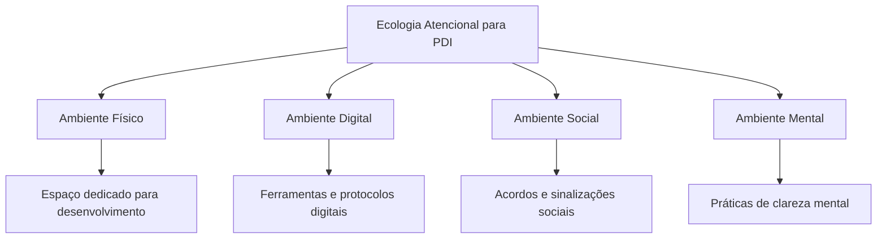

#### Protocolo de Deep Work para Desenvolvimento Profissional

Cal Newport, professor de ciência da computação e autor de "Deep Work", oferece um framework que pode ser adaptado especificamente para PDI:

**Rituais de Profundidade:**

1. **Preparação Espacial**:
    
    - Crie uma "estação de desenvolvimento" com todos os recursos necessários
    - Utilize sinais visuais que ativem o modo de aprendizado profundo
    - Elimine distrações previsíveis do ambiente
2. **Preparação Temporal**:
    
    - Bloqueie períodos específicos no calendário (idealmente 90-120 minutos)
    - Defina horários alinhados com seu ritmo circadiano pessoal
    - Comunique claramente períodos de indisponibilidade
3. **Preparação Mental**:
    
    - Ritual de transição de 5 minutos (respiração, revisão de objetivos)
    - Definição ultra-específica do resultado da sessão
    - "Warm-up" cognitivo com exercício de complexidade moderada
4. **Manutenção do Estado**:
    
    - Técnica de "pergunta adiada" para ideias não relacionadas
    - Micro-intervalos estruturados (52 minutos de foco, 17 de recuperação)
    - Sistema de tracking do estado atencional

**Os Quatro Paradigmas de Trabalho Profundo (Adaptados para PDI):**

|Abordagem|Descrição|Ideal para|
|---|---|---|
|**Monástica**|Blocos extensos (dias/semanas) dedicados exclusivamente a desenvolvimento|Transições profissionais, capacitações complexas, projetos transformadores|
|**Bimodal**|Alternância entre períodos intensivos (ex: 1-2 dias) e rotina normal|Desenvolvimento contínuo com marcos periódicos, equilibrado com responsabilidades atuais|
|**Rítmica**|Horários consistentes dedicados diariamente (ex: 5:30-7:30am)|Desenvolvimento incremental de longo prazo, formação de hábitos fundamentais|
|**Jornalística**|Oportunista - aproveitar quaisquer momentos disponíveis|Complementar a outras abordagens, não recomendado como estratégia primária|

**Caso Aplicado: Clara, Gerente de Marketing**

> Clara implementou o paradigma "Rítmico" para seu desenvolvimento em Analytics. Estabeleceu o período das 7:30-9:00 todas as manhãs, utilizando sinalizadores claros para sua equipe (banner digital de "Modo Desenvolvimento" ativo, status específico no Slack). Ela criou uma sequência de ativação: café específico, playlist instrumental, revisão de 2 minutos do objetivo da sessão. Seu progresso acelerou dramaticamente comparado às tentativas anteriores de estudar "quando sobrasse tempo".

### Estratégias de Gestão de Atenção Fragmentada

Para muitos profissionais, blocos extensos de concentração profunda são um luxo raro. Nestes casos, técnicas específicas para maximizar aprendizado em atenção fragmentada se tornam essenciais:

**1. Micro-Aprendizado Estruturado:**

Baseado nas pesquisas de Hermann Ebbinghaus sobre curva de esquecimento e trabalhos mais recentes sobre aprendizado espaçado:

|Componente|Descrição|Implementação|
|---|---|---|
|**Fragmentação Intencional**|Dividir conteúdo em micro-unidades de 3-7 minutos|Mapear competência em "átomos de aprendizado" que fazem sentido independentemente|
|**Distribuição Estratégica**|Espaçar exposições de forma otimizada|Sistema de repetição espaçada com intervalos crescentes (1 dia, 3 dias, 7 dias, etc.)|
|**Multimodalidade**|Utilizar diferentes formatos para o mesmo conteúdo|Alternar entre texto, áudio, prática, ensino a outros|
|**Contexto Variado**|Estudar o mesmo conceito em diferentes ambientes|Praticar durante deslocamento, em diferentes espaços de trabalho, etc.|

---

## 📊 Desenvolvimento Imersivo: RV, RA e Simulações

A aprendizagem imersiva está revolucionando o desenvolvimento profissional, criando experiências multissensoriais que aumentam significativamente a retenção e aplicação prática de novas habilidades.

### A Revolução da Aprendizagem Experiencial

Enquanto métodos tradicionais de desenvolvimento frequentemente falham em transferir conhecimento para situações reais, ambientes imersivos permitem prática contextualizada e emocionalmente engajante. Como explica Jeremy Bailenson, diretor do Laboratório de Interação Humana Virtual de Stanford: "A aprendizagem imersiva coloca o aprendiz no centro do processo, permitindo experimentar situações que seriam impossíveis, perigosas ou caras demais para reproduzir em treinamentos convencionais."

### Abordagens Práticas de Desenvolvimento Imersivo

#### Realidade Virtual para Competências Complexas

A realidade virtual (RV) oferece um ambiente completamente imersivo onde você pode praticar habilidades complexas em contextos simulados, mas realistas. Aplicações potentes para desenvolvimento profissional incluem:

- **Simulações de Apresentações e Discursos**: Praticar apresentações para plateias virtuais que reagem em tempo real, permitindo superar a ansiedade de falar em público em ambiente seguro
    
- **Treinamento de Negociação e Influência**: Engajar-se em cenários de negociação com avatares programados para demonstrar diferentes estilos e táticas
    
- **Gestão de Conflitos**: Experimentar diversas abordagens para mediar conflitos entre equipes, com feedback imediato sobre linguagem corporal e tom
    

#### Realidade Aumentada para Aprendizado Contextual

A realidade aumentada (RA) sobrepõe informações digitais ao mundo real, criando oportunidades para aprendizado contextualizado:

- **Coaching em Tempo Real**: Óculos de RA podem fornecer dicas discretas durante reuniões ou apresentações, como lembretes para fazer contato visual ou sugestões de linguagem corporal
    
- **Visualização de Dados Contextual**: Acesso a métricas e informações relevantes exatamente quando necessárias durante interações profissionais
    
- **Aprendizado Técnico Sobreposto**: Instruções passo-a-passo sobrepostas a equipamentos ou processos reais, facilitando o desenvolvimento de habilidades técnicas complexas
    

#### Simulações Multiplayer para Competências Colaborativas

Ambientes virtuais multi-usuário permitem o desenvolvimento de habilidades interpessoais complexas:

- **Gestão de Equipes Virtuais**: Simulações onde você lidera equipes diversas em projetos complexos com restrições realistas de tempo e recursos
    
- **Tomada de Decisão Colaborativa**: Cenários que exigem coordenação com múltiplos stakeholders para resolver problemas complexos
    
- **Liderança em Crise**: Simulações de situações de emergência que testam capacidade de liderança sob pressão
    

### Pesquisas e Evidências

Estudos conduzidos pela Universidade de Stanford demonstraram que o treinamento em ambientes virtuais imersivos pode aumentar a retenção em até 75% quando comparado a métodos tradicionais. Além disso, a prática em ambientes simulados gera transferência significativa para contextos reais, especialmente em habilidades que envolvem componentes emocionais e interpessoais complexos.

Uma pesquisa da PwC revelou que profissionais treinados em RV completaram programas 40% mais rápido do que aqueles em salas de aula tradicionais e demonstraram 275% mais confiança em aplicar o que aprenderam.

### Implementação em Seu PDI

Para incorporar desenvolvimento imersivo em seu PDI:

1. **Identifique Competências de Alto Impacto**: Priorize habilidades que são difíceis de praticar no dia a dia ou que envolvem riscos significativos
    
2. **Selecione a Tecnologia Apropriada**: Determine qual modalidade (RV, RA ou simulação) melhor atende suas necessidades específicas
    
3. **Desenhe Cenários Progressivos**: Crie uma sequência de situações com dificuldade crescente, começando com cenários básicos e avançando para contextos mais complexos
    
4. **Integre Feedback Multidimensional**: Combine métricas objetivas com feedback qualitativo para uma visão completa do desempenho
    
5. **Pratique Transferência Deliberada**: Estabeleça conexões explícitas entre aprendizados do ambiente virtual e aplicações no mundo real
    

> "A verdadeira magia dos ambientes imersivos não está na tecnologia em si, mas na capacidade de criar contextos de prática seguros e realistas que aceleram drasticamente a curva de aprendizado para competências complexas."

---

## 🎮 Gamificação e Narrativa no Desenvolvimento Profissional

### Introdução: O Poder dos Jogos no Desenvolvimento

Você já se perguntou por que conseguimos passar horas jogando, superando desafios cada vez mais difíceis, enquanto frequentemente lutamos para manter consistência em nosso desenvolvimento profissional? Como observa Jane McGonigal, designer de jogos e pesquisadora: "Os jogos nos dão propósito claro e feedback imediato – exatamente o que falta em muitos contextos profissionais."

A gamificação não é apenas sobre pontos e distintivos – é uma abordagem fundamentada em psicologia comportamental e design motivacional que pode transformar radicalmente seu PDI. Quando aplicada com inteligência, torna o desenvolvimento mais envolvente, mensurável e sustentável.

### 🎯 A Ciência da Motivação Através de Elementos de Jogos

#### O Framework Octalysis: Além da Gamificação Superficial

Yu-kai Chou, um dos principais especialistas em gamificação, desenvolveu o framework Octalysis após analisar milhares de jogos bem-sucedidos. Este modelo identifica oito núcleos motivacionais que podem ser adaptados para desenvolvimento profissional:

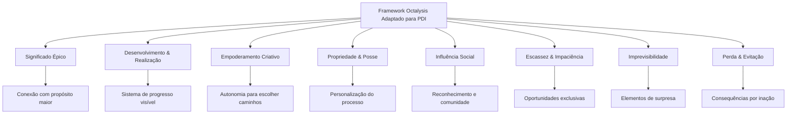

**Aplicação Prática para PDI:**

|Núcleo Motivacional|Implementação no PDI|Exemplo Concreto|
|---|---|---|
|**Significado Épico**|Conecte seu desenvolvimento a um propósito maior|"Minha jornada de desenvolvimento em liderança não é apenas sobre promoção, mas para impactar positivamente as 50 pessoas do meu time"|
|**Desenvolvimento & Realização**|Sistema visível de progressão com marcos claros|Mapa visual de habilidades com níveis específicos e "missões" para avançar|
|**Empoderamento Criativo**|Autonomia para personalizar abordagens|Menu de diferentes métodos para desenvolver cada competência, permitindo escolha|
|**Propriedade & Posse**|Criação de identidade de desenvolvimento|"Avatar profissional" com visualização de atributos que evoluem|
|**Influência Social**|Engajamento de comunidade no processo|Check-ins semanais com "guilda" de desenvolvimento e celebrações coletivas|
|**Escassez & Impaciência**|Oportunidades limitadas e desafios temporários|"Desafios especiais" mensais com benefícios exclusivos para completar|
|**Imprevisibilidade**|Elementos de descoberta e surpresa|"Baús de recompensa" aleatórios após completar certos marcos|
|**Perda & Evitação**|Consequências estruturadas por inação|Sistema de "vidas" ou "energia" que diminui sem ação consistente|

### Exemplo de Sistema Gamificado para Desenvolvimento de Habilidades de Comunicação:

**"A Jornada do Comunicador Magistral"**

1. **Mapa de Progresso Visível:**
    
    - Caminho visual com 5 níveis: Aprendiz → Praticante → Especialista → Mestre → Magistral
    - Cada nível com 3 "regiões" de habilidade: Comunicação Escrita, Verbal e Não-verbal
    - Marcos específicos em cada região (ex: "Dominador de Apresentações", "Mestre do Feedback")
2. **Sistema de Missões e Desafios:**
    
    - Missões principais: Projetos estruturados com critérios claros ("Lidere uma reunião de stakeholders complexa")
    - Missões secundárias: Pequenas práticas diárias ("Faça uma pergunta poderosa em cada conversa hoje")
    - Desafios especiais: Oportunidades temporárias de alto valor ("Apresentação para liderança sênior")
3. **Mecânicas de Feedback e Recompensa:**
    
    - XP (Pontos de Experiência): Acumulados por prática consistente
    - Distintivos: Reconhecimento por domínio de habilidades específicas
    - Desbloqueios: Acesso a novos recursos ou oportunidades
    - "Power-ups": Benefícios temporários (ex: mentoria especial por tempo limitado)
4. **Elementos Sociais:**
    
    - "Guilda de Comunicadores": Grupo de apoio com check-ins regulares
    - Tabuleiro de líderes: Reconhecimento (opcional) de progresso
    - Desafios em equipe: Colaboração para superar obstáculos complexos
    - Celebrações coletivas: Ritual para reconhecer marcos importantes

> "Transformei meu PDI de uma lista de verificação estática para uma jornada épica com desafios progressivos. A diferença foi extraordinária - de uma obrigação ocasional para uma prática que busco diariamente." - Elena Martins, gerente de produto que implementou princípios de gamificação em seu desenvolvimento

### 📖 Narrativa Pessoal: A Arte de Transformar Desenvolvimento em História

O poder das histórias em moldar nosso comportamento está profundamente enraizado na psicologia humana. Como destaca o psicólogo Dan McAdams em suas pesquisas sobre identidade narrativa: "Somos as histórias que contamos a nós mesmos sobre nós mesmos."

#### Técnicas de Storytelling Aplicadas ao Desenvolvimento

**1. A Jornada do Herói para PDI:**

Joseph Campbell identificou padrões universais em histórias míticas que ressoam profundamente. Esta estrutura pode ser adaptada para desenvolvimento profissional:

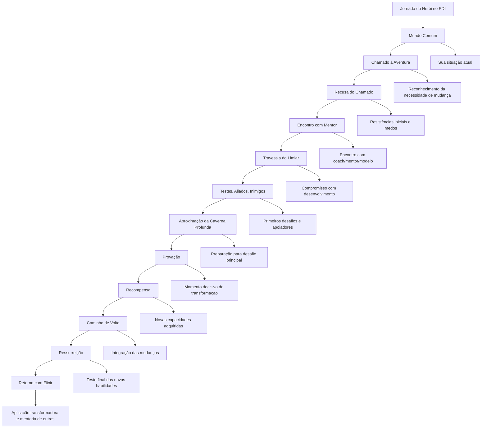

---

## 📊 PDI Baseado em Dados: Abordagem Analítica

### Introdução: A Revolução dos Dados no Desenvolvimento Profissional

Estamos vivendo a era dos dados. Como observa Thomas Davenport em "Competing on Analytics": "O que não pode ser medido, não pode ser gerenciado – e o que não está sendo gerenciado ativamente, raramente melhora." Esta máxima, embora tradicionalmente aplicada a negócios, é igualmente poderosa quando aplicada ao desenvolvimento profissional.

A maioria dos PDIs tradicionais baseia-se em impressões subjetivas, avaliações qualitativas e intuição. Embora esses elementos tenham seu valor, a ausência de uma abordagem baseada em dados frequentemente resulta em:

- Foco em áreas de desenvolvimento com baixo impacto real
- Progresso inconsistente e difícil de verificar
- Decisões baseadas em vieses e percepções limitadas
- Dificuldade em ajustar estratégias de forma ágil

PDIs baseados em dados transformam desenvolvimento profissional de arte abstrata em ciência aplicada, permitindo decisões mais precisas, ajustes mais rápidos e resultados verificáveis.

### 🔍 Diagnóstico Quantitativo: Além da Intuição

#### Baseline Multidimensional: Medindo o Ponto de Partida

Um PDI efetivamente orientado por dados começa com um diagnóstico abrangente e quantificável:

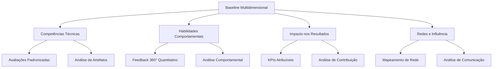

**Métodos Avançados de Coleta de Dados:**

|Dimensão|Métodos Tradicionais|Abordagens Avançadas|
|---|---|---|
|**Competências Técnicas**|Autoavaliação, feedback do gestor|Avaliações cegas por pares, análise de código/documentos, testes padronizados específicos da indústria|
|**Habilidades Comportamentais**|Feedback informal, impressões|Análise comportamental baseada em linguística, feedback 360° estruturado com métricas comparativas|
|**Impacto nos Resultados**|Avaliações anuais, objetivos gerais|KPIs específicos vinculados a contribuições individuais, análise de atribuição|
|**Redes e Influência**|Percepção subjetiva|Análise de redes organizacionais (ONA), métricas de comunicação e colaboração|

**Caso Prático: Diagnóstico Aprimorado da Microsoft**

A Microsoft desenvolveu uma abordagem chamada "Performance Fingerprint" que combina:

- Análise de padrões de comunicação via metadados (sem violar privacidade)
- Métricas de contribuição em repositórios e ferramentas colaborativas
- Avaliações técnicas estruturadas com múltiplos avaliadores cegos
- Dados de impacto em resultados com ajustes para fatores externos

Este diagnóstico multidimensional revelou que engenheiros anteriormente classificados similarmente através de métodos tradicionais apresentavam perfis de competência e impacto radicalmente diferentes quando analisados com ferramentas mais precisas.

### Framework IMPACT para Métricas de Desenvolvimento

Um desafio comum em PDIs é a definição de métricas que sejam simultaneamente relevantes, mensuráveis e acionáveis. O framework IMPACT oferece uma estrutura:

|Dimensão|Descrição|Exemplos de Métricas|
|---|---|---|
|**I**ndicadores Diretos|Métricas que medem diretamente a competência|Avaliações padronizadas, certificações, tempo para completar tarefas específicas|
|**M**étricas de Aplicação|Como a competência é utilizada em contexto real|Frequência de aplicação, qualidade de implementação, adaptabilidade contextual|
|**P**ercepções Quantificadas|Feedback estruturado de stakeholders|Scores de avaliação 360°, NPS de colaboração, avaliações cegas por pares|
|**A**tributos Comportamentais|Comportamentos observáveis associados|Frequência de comportamentos específicos, análise de padrões de comunicação|
|**C**ontribuições Mensuráveis|Impacto em resultados tangíveis|KPIs de negócio influenciados, tempo economizado, qualidade aprimorada|
|**T**endências ao Longo do Tempo|Evolução em períodos definidos|Taxa de melhoria, consistência de aplicação, adaptação a novos contextos|

---

## 🧩 Desenvolvimento para Neurodiversidade e Inclusão

### Reconhecendo e Valorizando Diferentes Perfis Cognitivos

Cada cérebro é único. A neurodiversidade reconhece que variações neurológicas como autismo, TDAH, dislexia e outras representam diferenças naturais no funcionamento cognitivo humano, não deficiências. Como destaca Thomas Armstrong, autor de "Neurodiversidade no Local de Trabalho": "A neurodiversidade pode ser tão crucial para o futuro dos negócios quanto a biodiversidade é para a sobrevivência do planeta."

Para muitos profissionais neurodiversos, os PDIs tradicionais podem apresentar barreiras significativas. Entretanto, quando adaptados para diferentes padrões de processamento cognitivo, podem se tornar ferramentas excepcionalmente poderosas de desenvolvimento.

### Abordagens Personalizadas para Diferentes Estilos Cognitivos

#### Avaliação de Perfil Neurocognitivo

O primeiro passo é compreender profundamente seu perfil cognitivo único:

- **Mapeamento de Estilos de Processamento**: Ferramentas como o MAIA (Mapeamento Avançado de Inclinações de Aprendizado) identificam padrões individuais de processamento de informação, preferências sensoriais e estilos organizacionais
    
- **Reconhecimento de Forças Cognitivas**: Avaliações como a VIA Character Strengths ou Gallup CliftonStrengths podem revelar capacidades únicas frequentemente não captadas em avaliações tradicionais
    
- **Identificação de Gatilhos de Sobrecarga**: Análise estruturada de contextos que causam desconforto, sobrecarga ou subestimulação sensorial, permitindo ajustes ambientais
    

#### PDIs Multimodais

Desenvolvimento eficaz para neurodiversidade exige múltiplos caminhos para o mesmo objetivo:

|Abordagem|Descrição|Aplicação Prática|
|---|---|---|
|**Adaptação de Canais Sensoriais**|Oferecer conteúdos em múltiplos formatos|Disponibilizar recursos em texto, áudio, visual e kinestésico para acomodar diferentes preferências|
|**Ajuste de Estrutura/Flexibilidade**|Equilibrar orientação clara e espaço para exploração|Criar frameworks adaptativos que permitem diferentes níveis de estrutura|
|**Abordagem de Processamento**|Respeitar diferentes velocidades e estilos|Permitir tempo apropriado e abordagens lineares/não-lineares conforme necessidade|

#### Ambientes de Desenvolvimento Adaptáveis

O contexto físico e digital para desenvolvimento deve ser personalizado para otimizar desempenho cognitivo:

- **Espaços Físicos Flexíveis**: Áreas que podem ser ajustadas para diferentes necessidades sensoriais (iluminação, acústica, privacidade)
    
- **Ferramentas Digitais Personalizáveis**: Interfaces que permitem ajustes de contraste, fontes, organização visual e gerenciamento de notificações
    
- **Protocolos de Comunicação Inclusivos**: Sistemas que acomodam preferências por comunicação assíncrona vs. síncrona, escrita vs. verbal
    

### Caso de Estudo: Programa de Desenvolvimento Neuroinclusivo da IBM

A IBM implementou um programa chamado "Neurodiversidade no Trabalho" que incluiu uma abordagem radicalmente nova para PDIs:

- **Diagnóstico Multissensorial**: Ao invés de formulários tradicionais, utilizaram jogos interativos, entrevistas visuais e simulações práticas para mapear pontos fortes e desafios
    
- **Metas Personalizadas por Estilo Cognitivo**: Objetivos idênticos com caminhos radicalmente diferentes baseados em perfis neurocognitivos
    
- **Sistema de Suporte Adaptativo**: Mentores treinados em neurodiversidade, ferramentas personalizadas e ajustes ambientais específicos
    

Os resultados foram impressionantes: participantes neurodiversos superaram seus pares em inovação em 52% e em resolução de problemas complexos em 48%, enquanto reportaram níveis significativamente maiores de engajamento e satisfação profissional.

### Aplicação em Seu PDI

Para criar um PDI neuroinclulsivo:

1. **Compreenda Sua Neurologia**: Investigue como seu cérebro único processa informação, se motiva e aprende mais eficientemente
    
2. **Desenhe Múltiplos Caminhos**: Para cada objetivo, crie pelo menos três abordagens diferentes que acomodem diferentes estilos cognitivos
    
3. **Personalize Seu Ambiente**: Identifique e implemente os ajustes ambientais que otimizam seu funcionamento cognitivo
    
4. **Priorize Forças Naturais**: Estruture seu desenvolvimento para maximizar talentos inatos enquanto desenvolve estratégias adaptativas para desafios
    

> "A verdadeira inclusão não é sobre tratar todos igualmente, mas sobre reconhecer e valorizar diferenças fundamentais. Um PDI neuroinclulsivo não é apenas melhor para indivíduos neurodiversos - é melhor para todos." - Dr. Judy Singer, socióloga que cunhou o termo "neurodiversidade"

---

## 📚 Micro-credentials e Aprendizado Modular

### A Transformação do Desenvolvimento Profissional

O modelo tradicional de desenvolvimento baseado em grandes certificações e cursos extensos está rapidamente sendo substituído por uma abordagem mais granular, flexível e personalizada. Como observa Matthew Sigelman, CEO do Burning Glass Technologies: "O mercado está se movendo para um modelo onde as habilidades específicas, não os diplomas, são a moeda corrente."

Micro-credentials são certificações digitais verificáveis que representam competências específicas, alcançadas através de experiências de aprendizado modulares. Seu valor está na precisão, relevância imediata e adaptabilidade em um mundo onde as habilidades evoluem constantemente.

### O Poder do Desenvolvimento Modular

#### Benefícios do Aprendizado em Módulos Discretos

|Benefício|Descrição|Impacto no PDI|
|---|---|---|
|**Precisão**|Foco em habilidades específicas sem componentes desnecessários|Desenvolvimento direcionado às necessidades reais|
|**Agilidade**|Capacidade de adquirir novas competências rapidamente|Adaptação rápida às mudanças de mercado e requisitos|
|**Personalização**|Caminho de desenvolvimento único baseado em necessidades individuais|PDI verdadeiramente alinhado ao seu contexto e aspirações|
|**Evidência Verificável**|Demonstração concreta de competências adquiridas|Transição de "o que você sabe" para "o que você pode fazer"|

#### Roadmap de Micro-habilidades

O desenvolvimento modular começa decompondo competências complexas em componentes menores e gerenciáveis:

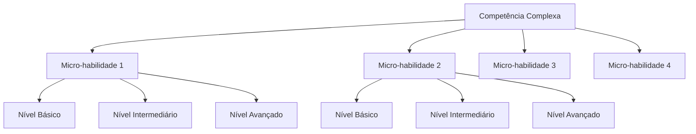

**Exemplo Prático: Liderança de Equipes Remotas**

Em vez de um curso genérico sobre liderança, um desenvolvimento modular decomporia esta competência em micro-habilidades específicas:

1. **Comunicação Assíncrona Eficaz**
    
    - Básico: Protocolo claro para e-mails e mensagens
    - Intermediário: Documentação colaborativa estruturada
    - Avançado: Sistemas adaptativos de comunicação por contexto
2. **Facilitação Virtual**
    
    - Básico: Gestão básica de reuniões online
    - Intermediário: Técnicas de engajamento em videoconferências
    - Avançado: Design de workshops virtuais transformadores
3. **Construção de Confiança Distribuída**
    
    - Básico: Check-ins consistentes e previsíveis
    - Intermediário: Feedback estruturado à distância
    - Avançado: Criação de rituais de equipe significativos
4. **Coordenação Multicultural e Multi-fuso**
    
    - Básico: Protocolos inclusivos de agendamento
    - Intermediário: Adaptação de comunicação para diferentes contextos culturais
    - Avançado: Otimização de colaboração assíncrona global

### Sistema de Badges Digitais

Os badges digitais são representações visuais verificáveis de conquistas, habilidades e competências. Mais do que simples imagens, contêm metadados que incluem critérios de emissão, evidências e verificação.

#### Anatomia de um Sistema de Badges Eficaz

1. **Badges Fundacionais**: Representam competências básicas que servem como blocos de construção
    
2. **Badges de Especialização**: Certificam domínio em áreas específicas de conhecimento ou conjuntos de habilidades
    
3. **Badges de Mestria**: Reconhecem capacidade de aplicar competências em contextos complexos e ensinar outros
    
4. **Meta-badges**: Concedidos pela integração bem-sucedida de múltiplas competências em contextos desafiadores
    

#### Implementação em Seu PDI

Para integrar micro-credentials e badges em seu desenvolvimento:

1. **Mapeamento de Competências Granular**: Decomponha suas metas de desenvolvimento em componentes específicos e verificáveis
    
2. **Identificação de Provedores Relevantes**: Plataformas como Coursera, edX, LinkedIn Learning e associações profissionais específicas do seu setor
    
3. **Criação de Portfólio Digital**: Ferramentas como Credly, Badgr ou Open Badge Passport para armazenar e compartilhar suas conquistas
    
4. **Alinhamento com Objetivos de Carreira**: Conexão explícita entre micro-credentials e oportunidades específicas de carreira
    

### Aprendizado Adaptativo Baseado em Dados

Os sistemas modernos podem personalizar continuamente o percurso de desenvolvimento com base em desempenho e necessidades:

- **Avaliações Dinâmicas**: Testes adaptativos que ajustam a dificuldade em tempo real para identificar precisamente seu nível
    
- **Recomendações Personalizadas**: Algoritmos que sugerem próximos passos baseados em padrões de aprendizado e objetivos
    
- **Feedback de Alta Granularidade**: Sistemas que identificam padrões específicos de erro e áreas de melhoria
    

> "O futuro do desenvolvimento profissional não está em currículos fixos, mas em jornadas de aprendizado personalizadas compostas de módulos precisos e relevantes que se adaptam continuamente às necessidades em evolução." - David Blake, fundador da Degreed

---

## 👥 Comunidades de Prática Potencializadas

### A Evolução do Aprendizado Social

O desenvolvimento profissional não acontece no vácuo. Desde os primórdios, aprendemos observando, interagindo e colaborando com outros. As Comunidades de Prática (CoPs), conceito desenvolvido por Etienne Wenger, representam grupos de pessoas que compartilham uma paixão ou preocupação e aprendem a fazê-lo melhor através de interação regular.

Com o advento de novas tecnologias de colaboração e inteligência artificial, as CoPs estão evoluindo para ecossistemas de aprendizado coletivo mais dinâmicos, personalizados e impactantes.

### Comunidades Potencializadas por Tecnologia e IA

#### Matching Inteligente de Mentores e Pares

Algoritmos sofisticados agora podem identificar conexões ideais entre profissionais:

- **Compatibilidade Multidimensional**: Pareamento baseado em objetivos de desenvolvimento, experiências complementares, estilos de aprendizado e disponibilidade
    
- **Recomendações Dinâmicas**: Sugestões que evoluem à medida que suas necessidades e objetivos mudam
    
- **Análise de Gaps de Conhecimento**: Identificação precisa de áreas onde você mais se beneficiaria de orientação específica
    

**Exemplo Prático:**

> O programa "Constellation" da Unilever utiliza IA para analisar perfis profissionais e criar conexões de mentoria altamente específicas. O sistema identifica não apenas experts em determinadas á