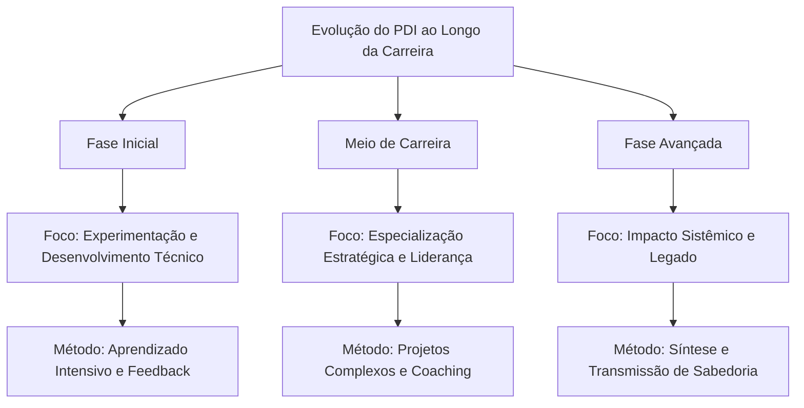
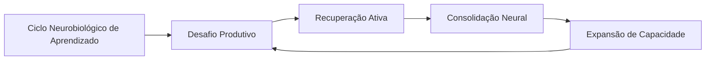
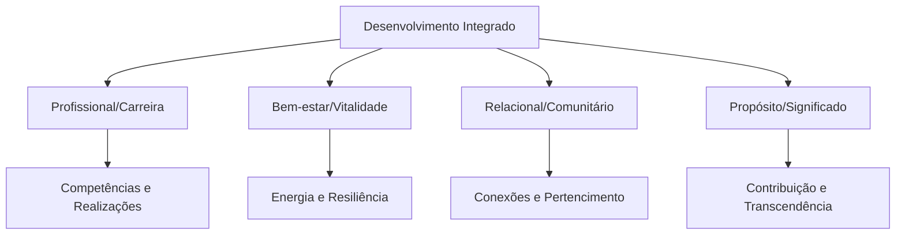
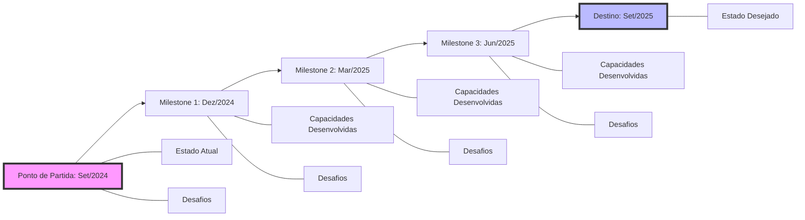
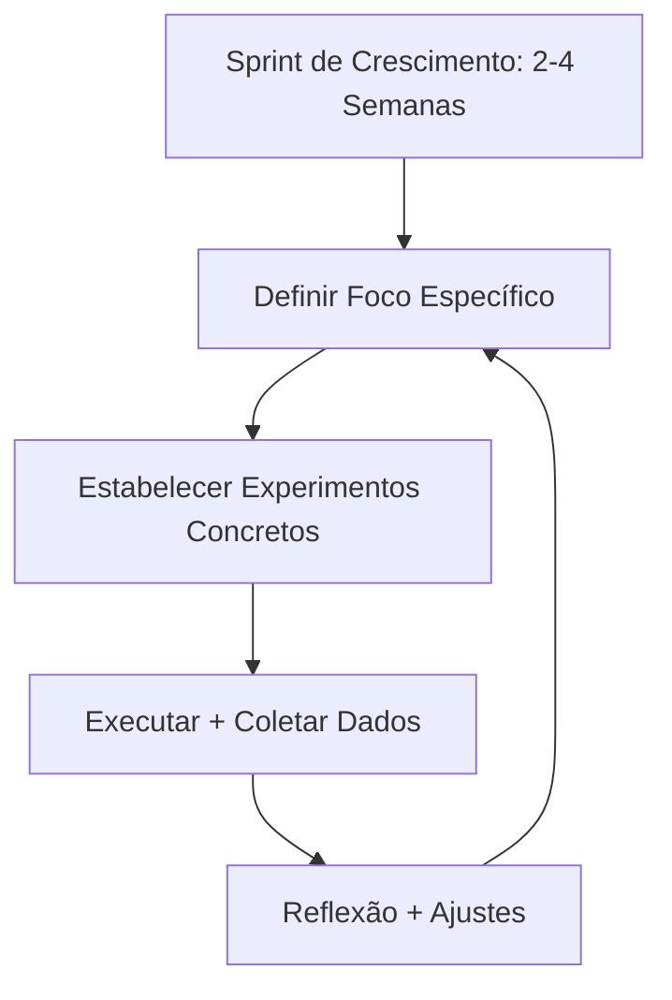
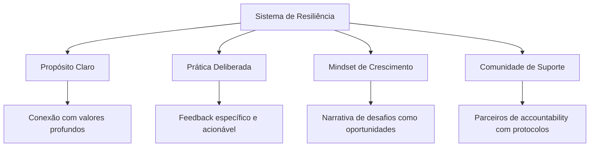
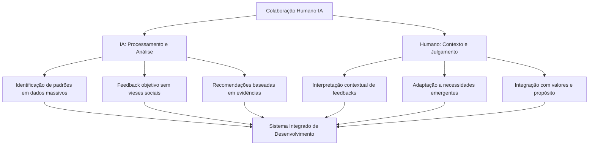

# 📊 PDI TRANSFORMADOR: NOVAS DIMENSÕES

## 🔄 PDI para Diferentes Momentos de Carreira

O desenvolvimento profissional não é um processo uniforme - ele evolui conforme avançamos em nossa jornada. Como observa Jennifer Petriglieri em "Casais que Trabalham": "As transições de carreira não são apenas mudanças no que fazemos, mas transformações em quem somos".

### Fase Inicial de Carreira (0-5 anos)

**Desafios Típicos:**

- Identificação de forças e paixões genuínas
- Desenvolvimento de competências técnicas fundamentais
- Construção de confiança e credibilidade profissional
- Adaptação à cultura organizacional

**Abordagens Recomendadas:**

- **Experimentação Ampla**: Como defende Reid Hoffman em "The Start-up of You", experimente diferentes funções e projetos para descobrir onde sua energia naturalmente flui
- **Mentorias Estruturadas**: Programa de rotação entre diferentes mentores a cada 3-4 meses
- **Aprendizado Técnico Intensivo**: Blocos dedicados para desenvolvimento de hard skills (método de imersão técnica da Shopify)
- **Feedback de Alto Volume**: Sistema de mini-feedbacks após cada entrega significativa

**Exemplo Prático:**

> Julia, desenvolvedora júnior, criou um PDI focado no método "T-shaped professional" de Tim Brown (IDEO): profundidade em uma competência técnica (desenvolvimento back-end) combinada com amplitude em habilidades complementares (UX, comunicação com stakeholders). Ela estabeleceu um sistema de projetos paralelos mensais para explorar diferentes especialidades, mantendo um "diário de energia" para identificar quais atividades a deixavam mais engajada.

### Meio de Carreira (5-15 anos)

**Desafios Típicos:**

- Transição de contribuidor individual para gestor (quando aplicável)
- Superação de plateaus de desenvolvimento
- Balanceamento entre especialização e versatilidade
- Reavaliação de propósito e alinhamento com valores

**Abordagens Recomendadas:**

- **Desenvolvimento em Profundidade vs. Amplitude**: Metodologia de "escalada T" proposta por Kelley & Kelley da d.school de Stanford
- **Projetos de Alto Impacto**: Liderança de iniciativas estratégicas cross-funcionais
- **Troca de Contextos Deliberada**: Rotação entre departamentos ou funções para ampliar perspectiva
- **Mentoria Reversa**: Orientação de profissionais mais jovens para atualização em tendências emergentes

**Exemplo Prático:**

> Ricardo, gerente de marketing com 8 anos de experiência, aplicou o framework de "desenvolvimento adaptativo" de Robert Kegan para superar um plateau de crescimento. Ele identificou seu "sistema operacional mental" atual (Kegan nível 3: foco em aprovação externa) e trabalhou com um coach para evoluir para o nível 4 (autogerado). Seu PDI incluía "experimentos de contorno", onde deliberadamente assumia posições impopulares mas bem fundamentadas em discussões estratégicas para desenvolver autonomia intelectual.

### Fase Avançada de Carreira (15+ anos)

**Desafios Típicos:**

- Manutenção de relevância em ambiente em rápida mudança
- Desenvolvimento de liderança estratégica e visionária
- Construção de legado e impacto duradouro
- Rejuvenescimento profissional e prevenção de estagnação

**Abordagens Recomendadas:**

- **Conselho Estratégico**: Participação em boards e comitês consultivos
- **Síntese de Sabedoria Prática**: Documentação e compartilhamento de conhecimento tácito acumulado
- **Desenvolvimento de Sucessores**: Programas estruturados de mentoria para próxima geração
- **Renovação Significativa**: Imersão em novas disciplinas ou tendências disruptivas

**Exemplo Prático:**

> Helena, diretora executiva com 22 anos de experiência, aplicou o conceito de "ikigai profissional" para reorientar sua carreira. Seu PDI focou na intersecção entre suas habilidades consolidadas em gestão estratégica e seu interesse emergente em sustentabilidade corporativa. Ela estabeleceu uma prática de "aprendizado em trindade": para cada área nova, combinava estudo formal, mentoria com especialista, e projeto prático aplicado. Isso levou à criação de uma nova vertical de negócios sustentáveis em sua organização.

## 🧠 Neurociência do Aprendizado para PDIs Excepcionais

O entendimento atual de como o cérebro aprende e se desenvolve oferece insights valiosos para otimizar o desenvolvimento profissional. Como destaca Andrew Huberman, neurocientista de Stanford: "A neuroplasticidade não é um evento, mas um processo que requer condições específicas para ocorrer de forma eficaz."

### Janelas de Neuroplasticidade

**Princípios Fundamentais:**

- O cérebro adulto mantém capacidade significativa de mudança (pesquisas de Michael Merzenich)
- A neuroplasticidade é dependente de atenção focada e estado neurológico específico
- Períodos de intensidade seguidos por recuperação otimizam a consolidação neural

**Aplicações Práticas para seu PDI:**

1. **Técnica de Aprendizado Espaçado**: Baseada nos estudos de Hermann Ebbinghaus e refinada por pesquisas recentes em neurociência, esta abordagem utiliza intervalos estratégicos:
    
    - Prática inicial intensiva (60-90 minutos)
    - Revisão após 24 horas
    - Reforço após 1 semana
    - Consolidação após 1 mês
2. **Protocolo de Estado Ótimo**: Desenvolvido com base nas pesquisas de Mihaly Csikszentmihalyi sobre "flow" e estudos de EEG:
    
    - 10-15 minutos de preparação (respiração controlada 5-7-5 para ativar estado parassimpático)
    - 25-45 minutos de prática focada ("janela de atenção produtiva" identificada por K. Anders Ericsson)
    - Breve recuperação (micropausa não-digital de 5 minutos)
    - Repetir 2-3 ciclos em uma sessão
3. **Técnica de Encoding Multisensorial**: Baseada nas pesquisas sobre memória de Richard Atkinson e consolidação de memória de James McGaugh:
    
    - Engajar múltiplos sentidos ao aprender nova habilidade
    - Verbalizar conceitos enquanto pratica (ativação simultânea de áreas motoras e verbais)
    - Ensinar conceito a outra pessoa dentro de 24-48 horas (técnica Feynman neuroaprimorada)

### Ciclos Otimizados de Desafio/Recuperação

A pesquisa sobre plasticidade cerebral de Bruce McEwen e os estudos sobre adaptação de Anders Ericsson revelam que o desenvolvimento ideal ocorre em um ritmo biologicamente alinhado:

**Protocolo Prático para PDI:**

1. **Identificação da "Dificuldade Desejável"**: Como definido por Robert Bjork, trabalhe em tarefas que sejam aproximadamente 15-20% acima de sua capacidade atual
    
2. **Prática Deliberada Intercalada**: Alterne entre diferentes subhabilidades relacionadas, criando interferência produtiva (pesquisa de Elizabeth Bjork sobre aprendizado intercalado)
    
3. **Recuperação Neurocognitiva**: Após sessões intensas, utilize:
    
    - Caminhada de baixa intensidade (15-20 min) para estimular BDNF (Fator Neurotrófico Derivado do Cérebro)
    - Sono de qualidade priorizado nas 24h seguintes (fundamental para consolidação via ondas delta)
    - Reflexão estruturada para reforçar circuitos neurais (técnica de Barbara Oakley)

### Gatilhos Neurobiológicos de Motivação

As pesquisas de Wolfram Schultz sobre dopamina e Robert Sapolsky sobre estresse nos oferecem insights valiosos sobre como otimizar a motivação sustentável:

1. **Arquitetura de Recompensas Variáveis**: Baseada nos estudos de B.F. Skinner refinados pela neurociência moderna:
    
    - Pequenas celebrações após conclusão de tarefas (liberação de dopamina)
    - Recompensas intermitentes não-previsíveis para manter engajamento
    - Sistema de marcos com significado pessoal (não apenas marcos arbitrários)
2. **Gerenciamento de Estados Neuroquímicos**:
    
    - Prática de alta intensidade pela manhã (aproveitando cortisol elevado)
    - Tarefas criativas durante "depressão pós-almoço" (estado cerebral difuso favorece conexões não-óbvias)
    - Ritual de fechamento para ativação de sistema parassimpático (redução de cortisol)

> "Entender a neurobiologia do aprendizado não diminui a magia do desenvolvimento humano - apenas nos permite criar condições ideais para que essa magia aconteça de forma mais consistente." - Andrew Huberman, neurocientista de Stanford

## 🌟 Framework de Desenvolvimento Integrado: Além da Carreira

Os PDIs mais impactantes reconhecem que o desenvolvimento profissional não existe isoladamente, mas como parte de um sistema de vida mais amplo. Como observa Frederic Laloux em "Reinventando as Organizações": "O desenvolvimento humano genuíno integra todas as dimensões do ser".

### O Modelo de Desenvolvimento em Camadas

Inspirado no trabalho de Ken Wilber sobre desenvolvimento integral e nas pesquisas de Richard Barrett sobre valores:

### Framework IKIGAI Adaptado ao Contexto Profissional

O conceito japonês de Ikigai (razão de ser) pode ser adaptado como poderosa lente para desenvolvimento integrado:

**Os Quatro Círculos do Ikigai Profissional:**

1. **O que você ama** - Paixão e engajamento intrínseco
2. **O que você faz bem** - Talentos e habilidades naturais
3. **O que o mundo precisa** - Contribuição significativa
4. **O que pode sustentá-lo** - Viabilidade econômica e prática

**Exercício Prático: Mapeamento de Ikigai Profissional**

Para cada área, liste 5-7 elementos específicos e busque temas comuns na intersecção:

|Dimensão|Perguntas Reflexivas|Exemplo|
|---|---|---|
|**Paixão**|Em quais atividades você perde a noção do tempo?|Análise de dados para descobrir padrões não-óbvios|
|**Talento**|O que os outros sempre elogiam em você?|Capacidade de traduzir conceitos complexos em visuais simples|
|**Impacto**|Que problemas do mundo ressoam com você?|Democratização da educação de qualidade|
|**Sustentabilidade**|Que necessidades práticas/financeiras precisa atender?|Flexibilidade para equilibrar família e trabalho|

**Integração com PDI Tradicional:**

Para cada objetivo profissional em seu PDI, considere:

1. **Alinhamento com Vitalidade**: Como este objetivo apoia (ou drena) sua saúde física e mental?
2. **Dimensão Relacional**: Como este desenvolvimento impacta seus relacionamentos-chave?
3. **Conexão com Propósito**: Como este objetivo conecta-se com sua visão de contribuição significativa?

### O Modelo Espiral de Desenvolvimento

Baseado nas pesquisas de Clare Graves e expandido por Don Beck e Christopher Cowan, o modelo espiral reconhece que o desenvolvimento profissional ocorre em estágios qualitativamente distintos:

**Estágios Relevantes para Desenvolvimento Profissional:**

|Estágio|Características|Necessidades de Desenvolvimento|
|---|---|---|
|**Especialista**|Busca domínio técnico e reconhecimento por competência|Aprendizado estruturado, credenciais, feedback específico|
|**Conquistador**|Foco em resultados e sucesso tangível|Desafios ambiciosos, reconhecimento de conquistas, competição saudável|
|**Pluralista**|Valoriza cooperação e harmonia relacional|Trabalho em equipe, feedback 360°, desenvolvimento de inteligência emocional|
|**Estrategista**|Pensamento sistêmico e visão de longo prazo|Complexidade, autonomia, impacto estratégico, mentorias avançadas|
|**Sinergista**|Integração de perspectivas múltiplas|Desafios adaptativos, inovação cultural, desenvolvimento de outros|

**Aplicação Prática:**

1. **Avaliação de Estágio Atual**: Através de um assessment baseado no trabalho de Susanne Cook-Greuter e William Torbert
2. **Necessidades de Desenvolvimento Específicas**: Diferentes estágios requerem abordagens distintas
3. **Desafios Ótimos**: Atividades levemente além do estágio atual para catalisar evolução

> "O desenvolvimento profissional mais poderoso ocorre quando deixamos de ver nossa carreira como separada de quem somos como seres humanos completos." - Bill George, ex-CEO da Medtronic e professor de Liderança em Harvard

## 📝 Templates de Documentação Visual de PDI

A visualização eficaz de seu plano de desenvolvimento transforma um documento estático em uma ferramenta viva de transformação. Como destaca Dan Roam em "The Back of the Napkin": "A visualização ajuda a tornar concreto o que de outra forma seria demasiado abstrato."

### Mapa Visual de Jornada de Desenvolvimento

Inspirado nas técnicas de Design Thinking da IDEO e nos mapas de experiência do usuário:

**Elementos Essenciais do Mapa Visual:**

1. **Linha do Tempo**: Representação clara da progressão temporal
2. **Marcos Concretos**: Pontos de verificação mensuráveis
3. **Estados**: Descrição vívida do antes e depois (competências, mindset, comportamentos)
4. **Barreiras Previstas**: Antecipação de desafios em cada estágio
5. **Recursos Necessários**: Suporte, ferramentas e conhecimentos requeridos

### Canvas de PDI Visual (Inspirado no Business Model Canvas)

Um template de uma página que captura todos os elementos essenciais:

|Propósito e Visão|Gaps & Oportunidades|Forças Fundamentais|
|---|---|---|
|[Seu "por quê" e visão de longo prazo]|[Competências a desenvolver e por quê]|[Talentos a potencializar]|

|Ações de Curto Prazo (Próximos 30 dias)|Ações de Médio Prazo (90 dias)|Ações de Longo Prazo (1 ano)|
|---|---|---|
|[Ações específicas com datas]|[Projetos e experiências]|[Iniciativas maiores]|

|Aprendizados & Recursos|Sistema de Feedback|Apoio & Parcerias|
|---|---|---|
|[Cursos, livros, mentores]|[Como medirá progresso]|[Quem o apoiará]|

**Ferramentas Digitais Recomendadas:**

1. **Miro/Mural**: Templates colaborativos para visualização de PDI
    
    - Funcionalidade: Colaboração em tempo real, integração com outras ferramentas
    - Método: Utilize o template "Career Roadmap" no Miro com adaptações para PDI
2. **Notion**: Sistema completo de gestão de PDI
    
    - Funcionalidade: Combina visualização, tracking e documentação
    - Método: Template "PDI Dashboard" com visão Kanban + Linha do Tempo
3. **Figma**: Para designs personalizados de alta qualidade
    
    - Funcionalidade: Ferramentas avançadas de design visual
    - Método: Comece com templates de "User Journey" e adapte para desenvolvimento

### Sistema de Codificação Visual para PDI

Desenvolva um sistema visual consistente para seu PDI, inspirado nos princípios de David McCandless em "Information is Beautiful":

**Elementos Visuais Recomendados:**

1. **Códigos de Cores Significativos**:
    
    - Áreas de competência (técnicas vs. comportamentais)
    - Nível de prioridade ou impacto
    - Estado de progresso
2. **Ícones Consistentes**:
    
    - Tipos de atividades de desenvolvimento
    - Recursos necessários
    - Indicadores de progresso
3. **Layout de Informação Estratégica**:
    
    - Hierarquia visual clara para comunicar prioridades
    - Agrupamento espacial de elementos relacionados
    - Uso de tamanho para comunicar importância relativa

> "Visualizar seu desenvolvimento não é apenas uma questão estética - é uma ferramenta cognitiva que permite ver padrões, lacunas e oportunidades que de outra forma permaneceriam invisíveis." - David Sibbet, especialista em visualização e facilitação

## 🏃‍♂️ Micro-PDIs e Experimentação Rápida

Em um mundo de mudanças aceleradas, o modelo tradicional de PDI anual tornou-se insuficiente. Como defende Jeff Sutherland, co-criador do Scrum: "O planejamento preditivo de longo prazo em ambientes complexos é fundamentalmente falho."

### Micro-Ciclos de Desenvolvimento (Sprints de Crescimento)

Inspirado nos princípios Agile e adaptado para desenvolvimento pessoal:

**Framework para Sprint de Crescimento:**

1. **Definição de Foco Ultra-Específico**:
    
    - Uma competência ou comportamento claramente definido
    - Razão específica para desenvolvimento neste momento
    - Definição concreta de "sucesso" ao final do sprint
2. **Design de Experimentos Comportamentais**:
    
    - 2-3 experimentos práticos para testar em contexto real
    - Variação deliberada de abordagens (não apenas uma técnica)
    - Baixo risco de falha, alto potencial de aprendizado
3. **Sistema de Rastreamento Leve**:
    
    - Métricas simples coletadas diariamente (2 minutos)
    - Registro de observações qualitativas (formato estruturado)
    - Check-in semanal com par de accountability
4. **Retrospectiva Estruturada**:
    
    - Protocolo de 30 minutos ao final do sprint
    - Documentação de insights-chave
    - Decisão deliberada sobre próximo sprint

**Exemplo Prático:**

> Marcos, gerente de produto, implementou um sistema de sprints de crescimento de 3 semanas. Seu primeiro sprint focou exclusivamente em "facilitação eficaz de reuniões de produto". Ele desenhou três experimentos: (1) preparação estruturada usando um novo template, (2) técnica de facilitação baseada em perguntas e (3) método de documentação durante a reunião. Após cada reunião, coletava feedback específico usando um formulário de 3 perguntas. Na retrospectiva, identificou que o template de preparação teve impacto limitado, mas a técnica de facilitação resultou em 40% mais engajamento. Seu próximo sprint focou em refinar especificamente esta técnica.

### Método "Tiny Habits" Aplicado ao Desenvolvimento Profissional

Baseado na pesquisa de BJ Fogg de Stanford:

1. **Identificação de Micro-Comportamentos**:
    
    - Versão mínima da habilidade desejada (prática de 30-60 segundos)
    - Clara ancoragem em rotina existente (gatilho comportamental)
    - Celebração imediata após execução (reforço positivo)
2. **Escalonamento Gradual**:
    
    - Ampliação sistemática após automatização
    - Documentação de cadeia de micro-hábitos
    - Manutenção de taxa de sucesso acima de 80%

**Exemplo Aplicado:**

|Semana|Micro-Hábito|Gatilho|Celebração|
|---|---|---|---|
|1|Ler 1 parágrafo sobre liderança|Após verificar e-mail matinal|"Excelente investimento em mim mesmo!"|
|2|Ler 1 parágrafo + fazer 1 anotação|Após verificar e-mail matinal|Movimento de "vitória" com braços|
|3|Ler 1 parágrafo + fazer 1 anotação + identificar 1 aplicação para o dia|Após verificar e-mail matinal|Mensagem para parceiro de accountability|

### Sistema de Mínimo Produto Viável (MVP) para Competências

Adaptado das metodologias Lean Startup de Eric Ries para desenvolvimento profissional:

1. **Decomposição de Competências Complexas**:
    
    - Identificação da "versão mínima funcional" da competência
    - Mapeamento de subcomponentes essenciais vs. opcionais
    - Sequenciamento lógico de desenvolvimento
2. **Ciclos Rápidos de Validação**:
    
    - Definição clara de hipótese de aprendizado
    - Teste em contexto real (não simulado)
    - Critérios objetivos para validação
3. **Pivô Estratégico ou Perseverança**:
    
    - Framework de decisão para continuar ou ajustar
    - Documentação sistemática de aprendizados
    - Comemoração de "falhas produtivas"

> "Desenvolvimento profissional não é sobre grandes saltos ocasionais, mas sobre muitos pequenos experimentos consistentes que geram dados para seu próximo passo." - Teresa Torres, autora de "Continuous Discovery Habits"

## 💼 Estudos de Caso em Múltiplos Setores

Diferentes contextos profissionais exigem abordagens adaptadas para desenvolvimento. Como destaca Amy Edmondson de Harvard: "O ambiente molda profundamente o que e como aprendemos."

### Setor de Saúde: Desenvolvimento em Ambientes de Alta Pressão

**Contexto:** Ambientes médicos caracterizados por altos níveis de estresse, necessidade de precisão e evolução constante do conhecimento.

**Caso: Departamento de Emergência do Hospital Regional**

Desafio: Médicos e enfermeiros sofrendo com burnout enquanto tentavam se manter atualizados com novos protocolos e tecnologias.

Solução: Implementação do modelo "Micro-Learning Integration" desenvolvido pela Mayo Clinic:

1. **Sessões de Aprendizado Ultrabreves**:
    
    - Rounds de 7 minutos focados em uma técnica específica
    - Prática imediata supervisionada
    - Feedback estruturado em tempo real
2. **Comunidades de Prática Especializadas**:
    
    - Grupos voluntários por área de interesse
    - Encontros quinzenais de 30 minutos em formato híbrido
    - Sistema de curadoria compartilhada de conteúdo
3. **Simulações Contextualizadas**:
    
    - Cenários específicos do departamento
    - Gravação para revisão posterior
    - Framework de debriefing psicologicamente seguro

**Resultados:**

- Redução de 37% em erros de procedimentos
- Aumento de 42% na adesão a novos protocolos
- Melhoria significativa em medidas de satisfação profissional

**Aprendizados Adaptáveis:**

- A integração de desenvolvimento no fluxo de trabalho é crucial em ambientes de alta pressão
- Ciclos de feedback rápidos são mais eficazes que sessões extensas de treinamento
- Comunidades de prática criam resiliência e suporte emocional além do desenvolvimento técnico

### Setor de Tecnologia: Desenvolvimento Acelerado em Startups

**Contexto:** Ambiente caracterizado por mudança rápida, ambiguidade, recursos limitados e necessidade de inovação constante.

**Caso: Equipe de Produto da Fintech NovoPay**

Desafio: Necessidade de desenvolver múltiplas competências simultaneamente em contexto de crescimento acelerado (equipe passou de 8 para 35 membros em 10 meses).

Solução: Sistema "Growth Multiplier" inspirado nas práticas da Spotify e Atlassian:

1. **Mapa de Competências Colaborativo**:
    
    - Visualização digital das competências do time
    - Auto-avaliação e validação por pares
    - Identificação de mentores internos para cada competência
2. **Sistema de Guilds Transversais**:
    
    - Comunidades voluntárias por domínio de conhecimento
    - Responsabilidade por criar conteúdo interno
    - Sessões quinzenais de Problem-Based Learning
3. **Projeto-Desafio Trimestral**:
    
    - Uma semana dedicada a projeto fora da função atual
    - Emparelhamento estratégico com experts
    - Apresentação pública de resultados e aprendizados

**Resultados:**

- Redução de 58% na dependência de contratações externas para novas competências
- Aumento de 64% na velocidade de onboarding de novos membros
- Melhoria significativa em indicadores de inovação interna

**Aprendizados Adaptáveis:**

- Documentação visual de competências cria clareza em ambientes ambíguos
- Desenvolvimento peer-to-peer é escalável em organizações em crescimento acelerado
- Projetos-desafio criam aprendizado multidisciplinar quando bem estruturados

### Setor Industrial: Transformação Digital e Upskilling

**Contexto:** Setor com força de trabalho experimentando transformação digital, automação e necessidade de novas competências.

**Caso: Planta Manufatureira BetaSteel**

Desafio: Necessidade de requalificação de 2.000 colaboradores para adoção de Industry 4.0, com média de idade de 47 anos e baixa familiaridade digital.

Solução: Programa "Future-Ready Skills" baseado nas melhores práticas da Siemens:

1. **Avaliação de Prontidão Tecnológica**:
    
    - Assessment personalizado de competências digitais
    - Mapeamento de transferência de competências existentes
    - Identificação de "digital natives" como auxiliares de aprendizado
2. **Jornadas de Aprendizado Personalizadas**:
    
    - Micro-módulos adaptados por perfil
    - Estações de prática no ambiente de trabalho
    - Gamificação do processo de qualificação
3. **Laboratórios de Aplicação Prática**:
    
    - Espaços dedicados para experimentação segura
    - Desafios reais da planta como projetos de aprendizado
    - Mecanismo formal de sugestão de melhorias

**Resultados:**

- Taxa de requalificação bem-sucedida de 91% (contra média do setor de 62%)
- Redução de 34% no tempo de adaptação a novos sistemas
- Aumento de 28% em sugestões de inovação vindas da linha de produção

**Aprendizados Adaptáveis:**

- Reconhecimento explícito de competências existentes cria engajamento com novas tecnologias
- Aprendizado incorporado no ambiente de trabalho tem maior transferência
- Conexão clara entre desenvolvimento e resultados concretos aumenta motivação

> "O contexto não é apenas um detalhe na equação do desenvolvimento - é o multiplicador que determina o impacto real das iniciativas de aprendizado." - Amy Edmondson, professora da Harvard Business School

## 🔧 Troubleshooting: Superando Bloqueios em seu PDI

O desenvolvimento profissional raramente segue uma trajetória linear. Como destaca Robert Kegan em seu trabalho sobre "imunidade à mudança": "Para cada objetivo de desenvolvimento, existe um compromisso oculto igualmente poderoso para permanecer o mesmo."

### Diagnóstico de Padrões de Estagnação

**Framework para Identificação de Bloqueios:**

|Tipo de Bloqueio|Sinais de Alerta|Possíveis Causas Subjacentes|
|---|---|---|
|**Técnico**|Plano sem progresso mensurável Consistência irregular Sensação constante de sobrecarga|Metas irrealistas Falta de recursos adequados Ausência de sistema de acompanhamento|
|**Psicológico**|Auto-sabotagem recorrente Procrastinação seletiva Síndrome do impostor persistente|Crenças limitantes inconscientes Medo de falha ou sucesso Conflito de identidade profissional|
|**Sistêmico**|Falta de suporte organizacional Conflito com outras prioridades Ausência de ambiente para praticar|Cultura organizacional não-alinhada Estrutura de incentivos contraditória Liderança que não modela desenvolvimento|

### Técnicas de Desbloqueio Baseadas em Evidências

#### 1. Protocolo de Imunidade à Mudança (Robert Kegan & Lisa Lahey)

Processo estruturado para identificar e superar resistências inconscientes:

**Passo 1: Compromisso visível**

- Identifique seu objetivo de desenvolvimento genuíno
- Articule por que é importante para você
- Estabeleça como seria o sucesso concreto

**Passo 2: Ações sabotadoras**

- Liste comportamentos que você faz ou deixa de fazer que impedem o objetivo
- Seja brutalmente honesto e específico
- Identifique padrões recorrentes

**Passo 3: Compromissos concorrentes**

- Para cada comportamento sabotador, pergunte: "O que eu temo que aconteceria se eu parasse de fazer isso?"
- Identifique os compromissos ocultos que você tem com o status quo
- Articule as premissas assumidas por trás desses compromissos

**Passo 4: Testes de premissas**

- Desenhe pequenos experimentos para testar suas premissas
- Comece com baixo risco e aumente gradualmente
- Documente cuidadosamente os resultados

**Exemplo Aplicado:**

> Luísa, gerente de marketing, estava comprometida em "delegar mais estrategicamente", mas continuava assumindo todas as decisões. Ao aplicar o protocolo, descobriu que seu comportamento sabotador (microgerenciamento) estava ligado a um compromisso oculto com "manter minha reputação de especialista técnica perfeita". A premissa subjacente era: "Se a equipe cometer erros sob minha liderança, perderei credibilidade e valor". Ela desenhou um pequeno experimento: delegar um projeto de menor visibilidade completamente, com check-ins estruturados. O resultado mostrou que a equipe superou suas expectativas e ela recebeu reconhecimento por desenvolver talentos - desafiando sua premissa original.

#### 2. Técnica de Contratos Comportamentais (BJ Fogg)

Método estruturado para superar a inconsistência na implementação:

1. **Identificação do Fator de Ativação**:
    
    - Determine qual elemento está faltando: Motivação, Habilidade ou Gatilho
    - Adapte a intervenção especificamente para este fator
2. **Contrato Comportamental Escalonado**:
    
    - Comece com versão "ridiculamente fácil" do comportamento desejado
    - Estabeleça consequências positivas e negativas específicas
    - Envolva um parceiro de accountability com protocolos claros
3. **Sistema de Recompensas Variáveis**:
    
    - Estabeleça camadas de recompensas (imediatas, intermediárias, longo prazo)
    - Incorpore elemento de surpresa em algumas recompensas
    - Conecte recompensas com valores pessoais profundos

#### 3. Estruturação de Ambiente para Sucesso (James Clear)

Baseado nos princípios de "Atomic Habits" adaptados para desenvolvimento profissional:

1. **Arquitetura de Escolha Otimizada**:
    
    - Redesenhe seu ambiente físico e digital para facilitar comportamentos desejados
    - Elimine ou aumente fricção para comportamentos concorrentes
    - Estabeleça sinais visuais estrategicamente posicionados
2. **Modelo 2-Minutos para Iniciar**:
    
    - Reduza cada ação de desenvolvimento à sua versão de 2 minutos
    - Foco em iniciar consistentemente, não em completar
    - Documentação visual de sequências de comportamento
3. **Stack de Hábitos Estratégico**:
    
    - Ancore novos comportamentos em hábitos existentes sólidos
    - Crie cadeias de comportamentos com momentum natural
    - Estabeleça rotinas específicas para diferentes contextos

### Framework de Resiliência para Desenvolvimento

Em seu trabalho sobre grit (perseverança), Angela Duckworth identificou elementos-chave que podem ser adaptados para manter desenvolvimento consistente mesmo diante de obstáculos:

> "O verdadeiro obstáculo ao desenvolvimento não é falta de conhecimento sobre o que fazer, mas a existência de sistemas psicológicos de proteção que precisamos entender e transformar." - Robert Kegan, professor de Harvard e pesquisador de desenvolvimento adulto

## 🤖 Ferramentas de IA para Potencializar seu PDI

A inteligência artificial está transformando fundamentalmente como podemos abordar o desenvolvimento profissional. Como observa David Autor do MIT: "A IA não substituirá profissionais, mas profissionais que usam IA substituirão aqueles que não usam."

### IA como Parceira de Desenvolvimento

#### 1. Assistentes de Aprendizado Personalizado

**Ferramentas Avançadas:**

- **Sistemas Adaptivos de Recomendação**: Plataformas como Degreed e EdCast utilizam IA para criar percursos de aprendizado personalizados
    
    - Funcionalidade: Análise de padrões de consumo de conteúdo para recomendações precisas
    - Aplicação no PDI: Criação de roadmap de desenvolvimento otimizado com base em objetivos e comportamentos
- **Coaches Virtuais**: Soluções como BetterUp e CoachHub integram IA com coaching humano
    
    - Funcionalidade: Sistema de check-ins personalizados e análise de padrões de progresso
    - Aplicação no PDI: Acompanhamento consistente entre sessões de coaching humano
- **Curadores de Conteúdo**: Ferramentas como Anders Pink e Feedly com algoritmos de relevância
    
    - Funcionalidade: Filtro inteligente de conteúdo relevante para objetivos específicos
    - Aplicação no PDI: Atualização constante com recursos de ponta em áreas de desenvolvimento

**Estratégia de Implementação:**

1. **Entrada de Dados Estratégica**:
    
    - Forneça informações detalhadas sobre objetivos e preferências
    - Calibre feedback sobre recomendações para refinar algoritmos
    - Combine com avaliações humanas para validação
2. **Utilização Híbrida**:
    
    - Combine insights de IA com julgamento humano
    - Use IA para tarefas repetitivas e humanos para contexto
    - Estabeleça ciclos regulares de revisão e ajuste

#### 2. Sistemas de Feedback Aumentado

**Ferramentas Inovadoras:**

- **Análise Linguística**: Plataformas como Quantified Communications e Rhetorical
    
    - Funcionalidade: Análise de padrões de comunicação verbal e escrita
    - Aplicação no PDI: Feedback objetivo sobre clareza, engajamento e eficácia comunicativa
- **Reconhecimento de Padrões Comportamentais**: Sistemas como Humanyze e Microsoft Workplace Analytics
    
    - Funcionalidade: Análise de padrões de colaboração, comunicação e produtividade
    - Aplicação no PDI: Identificação de hábitos de trabalho e oportunidades de otimização
- **Simuladores com Feedback em Tempo Real**: Ferramentas como VirtualSpeech e Presenter Coach
    
    - Funcionalidade: Análise em tempo real de apresentações e interações
    - Aplicação no PDI: Prática segura de habilidades interpessoais com feedback imediato

**Protocolo de Maximização:**

1. **Triangulação de Feedback**:
    
    - Compare análise de IA com feedback humano
    - Identifique padrões consistentes versus anomalias
    - Foque em tendências ao longo do tempo, não instâncias isoladas
2. **Experimentação Estruturada**:
    
    - Teste comportamentos alternativos em ambiente seguro
    - Meça impacto de pequenas mudanças incrementais
    - Documente correlações entre ajustes e resultados

#### 3. Ambientes Simulados para Prática Avançada

**Aplicações Emergentes:**

- **Cenários de Liderança em VR**: Plataformas como Talespin e Strivr
    
    - Funcionalidade: Simulações imersivas de situações desafiadoras de liderança
    - Aplicação no PDI: Prática de conversas difíceis e tomada de decisão sob pressão
- **Gêmeos Digitais para Experimentação**: Tecnologia adaptada de contextos industriais
    
    - Funcionalidade: Criação de modelos virtuais de ambientes organizacionais
    - Aplicação no PDI: Teste de diferentes abordagens e visualização de resultados potenciais
- **Simuladores Baseados em Agentes**: Sistemas inspirados em tecnologias de gaming
    
    - Funcionalidade: Personagens virtuais que respondem de forma realista a diferentes inputs
    - Aplicação no PDI: Prática de negociação, gestão de conflitos e influência

**Implementação Estratégica:**

1. **Progressão de Dificuldade**:
    
    - Comece com cenários básicos e avance gradualmente
    - Incorpore elementos do ambiente real do usuário
    - Aumente complexidade das interações baseado em desempenho
2. **Debriefing Estruturado**:
    
    - Revisão sistemática de desempenho após cada sessão
    - Identificação de padrões recorrentes
    - Planejamento específico para próxima iteração

### Framework de Colaboração Humano-IA para Desenvolvimento

**Princípios de Implementação Ética:**

1. **Transparência Algorítmica**:
    
    - Compreenda como a IA chega a conclusões
    - Reconheça limitações e potenciais vieses
    - Mantenha decisões críticas sob supervisão humana
2. **Propriedade de Dados**:
    
    - Estabeleça limites claros sobre uso de dados pessoais
    - Prefira soluções com armazenamento local quando possível
    - Revise periodicamente configurações de privacidade
3. **Autonomia Aumentada (não Substituída)**:
    
    - Use IA para expandir escolhas, não para limitar opções
    - Cultive discernimento sobre quando confiar em recomendações
    - Desenvolva metacognição sobre sua interação com sistemas

> "A verdadeira revolução da IA no desenvolvimento profissional não está em automatizar o aprendizado, mas em criar sistemas de suporte que amplificam nossa capacidade humana de crescer e nos adaptar." - Ethan Mollick, professor da Wharton e pesquisador sobre IA no ambiente de trabalho