# 📘 PDI TRANSFORMADOR

## Guia Definitivo para Desenvolvimento Profissional e Pessoal

---

## 📋 Sumário

1. [Introdução: A Jornada de Transformação](https://claude.ai/chat/e2befb35-d131-47ca-88aa-5d3afea337bd#introdu%C3%A7%C3%A3o-a-jornada-de-transforma%C3%A7%C3%A3o)
2. [PDI: Muito Além de um Documento](https://claude.ai/chat/e2befb35-d131-47ca-88aa-5d3afea337bd#pdi-muito-al%C3%A9m-de-um-documento)
3. [Autoconhecimento: A Base do Desenvolvimento](https://claude.ai/chat/e2befb35-d131-47ca-88aa-5d3afea337bd#autoconhecimento-a-base-do-desenvolvimento)
4. [Objetivos que Inspiram e Transformam](https://claude.ai/chat/e2befb35-d131-47ca-88aa-5d3afea337bd#objetivos-que-inspiram-e-transformam)
5. [Estratégias de Planejamento para Resultados Extraordinários](https://claude.ai/chat/e2befb35-d131-47ca-88aa-5d3afea337bd#estrat%C3%A9gias-de-planejamento-para-resultados-extraordin%C3%A1rios)
6. [Da Teoria à Prática: Implementação Efetiva](https://claude.ai/chat/e2befb35-d131-47ca-88aa-5d3afea337bd#da-teoria-%C3%A0-pr%C3%A1tica-implementa%C3%A7%C3%A3o-efetiva)
7. [Mensuração de Progresso: Além dos Números](https://claude.ai/chat/e2befb35-d131-47ca-88aa-5d3afea337bd#mensura%C3%A7%C3%A3o-de-progresso-al%C3%A9m-dos-n%C3%BAmeros)
8. [A Cultura de Feedback Contínuo](https://claude.ai/chat/e2befb35-d131-47ca-88aa-5d3afea337bd#a-cultura-de-feedback-cont%C3%ADnuo)
9. [PDI para Diferentes Momentos de Carreira](https://claude.ai/chat/e2befb35-d131-47ca-88aa-5d3afea337bd#pdi-para-diferentes-momentos-de-carreira)
10. [Neurociência do Aprendizado para PDIs Excepcionais](https://claude.ai/chat/e2befb35-d131-47ca-88aa-5d3afea337bd#neuroci%C3%AAncia-do-aprendizado-para-pdis-excepcionais)
11. [Framework de Desenvolvimento Integrado](https://claude.ai/chat/e2befb35-d131-47ca-88aa-5d3afea337bd#framework-de-desenvolvimento-integrado)
12. [PDI na Era da Fragmentação da Atenção](https://claude.ai/chat/e2befb35-d131-47ca-88aa-5d3afea337bd#pdi-na-era-da-fragmenta%C3%A7%C3%A3o-da-aten%C3%A7%C3%A3o)
13. [Gamificação e Narrativa no Desenvolvimento Profissional](https://claude.ai/chat/e2befb35-d131-47ca-88aa-5d3afea337bd#gamifica%C3%A7%C3%A3o-e-narrativa-no-desenvolvimento-profissional)
14. [PDI Baseado em Dados: Abordagem Analítica](https://claude.ai/chat/e2befb35-d131-47ca-88aa-5d3afea337bd#pdi-baseado-em-dados-abordagem-anal%C3%ADtica)
15. [PDI na Era Digital: Ferramentas e Recursos](https://claude.ai/chat/e2befb35-d131-47ca-88aa-5d3afea337bd#pdi-na-era-digital-ferramentas-e-recursos)
16. [Casos de Sucesso: Histórias Inspiradoras](https://claude.ai/chat/e2befb35-d131-47ca-88aa-5d3afea337bd#casos-de-sucesso-hist%C3%B3rias-inspiradoras)
17. [PDI para Líderes: Desenvolvendo Pessoas](https://claude.ai/chat/e2befb35-d131-47ca-88aa-5d3afea337bd#pdi-para-l%C3%ADderes-desenvolvendo-pessoas)
18. [O Futuro do Desenvolvimento Profissional](https://claude.ai/chat/e2befb35-d131-47ca-88aa-5d3afea337bd#o-futuro-do-desenvolvimento-profissional)
19. [Autoavaliação e Próximos Passos](https://claude.ai/chat/e2befb35-d131-47ca-88aa-5d3afea337bd#autoavalia%C3%A7%C3%A3o-e-pr%C3%B3ximos-passos)
20. [Recursos Adicionais](https://claude.ai/chat/e2befb35-d131-47ca-88aa-5d3afea337bd#recursos-adicionais)

---

## 🌟 Introdução: A Jornada de Transformação

> "O desenvolvimento pessoal é um processo, não um destino. É a jornada que nos transforma." - Carol Dweck, autora de "Mindset: A Nova Psicologia do Sucesso"

Pense por um momento: quantas vezes você já sentiu que poderia estar evoluindo mais em sua carreira? Ou talvez já tenha se perguntado por que algumas pessoas parecem crescer profissionalmente de forma consistente enquanto outras estagnam? A diferença geralmente está em uma coisa: desenvolvimento intencional.

Vamos juntos mergulhar profundamente nos fundamentos e práticas avançadas que transformam um simples plano em uma poderosa ferramenta de mudança. O Plano de Desenvolvimento Individual (PDI) não é apenas um documento burocrático — é uma bússola para navegar pelo oceano de possibilidades da sua carreira.

No mundo atual, desenvolvimento profissional não é luxo, é sobrevivência. Como diz Josh Bersin, especialista em desenvolvimento de talentos: "Num mundo de mudanças constantes, a capacidade de aprender continuamente é a habilidade mais valiosa que podemos desenvolver."

Este material foi criado pensando em você que deseja assumir o protagonismo da sua jornada, independente do ponto em que esteja na carreira. Você vai encontrar aqui:

- Metodologias práticas baseadas em pesquisas atuais de neurociência e psicologia positiva
- Ferramentas visuais para planejamento eficaz inspiradas em técnicas de design thinking
- Histórias reais e inspiradoras de transformação profissional
- Exercícios práticos que você pode aplicar imediatamente
- Insights para personalizar sua jornada de desenvolvimento

Convido você a se abrir para uma abordagem que vai além de técnicas convencionais. Já trabalhei com centenas de profissionais em processos de transformação e posso garantir: quando seu desenvolvimento tem propósito claro e método adequado, os resultados são extraordinários.

---

## 🚀 PDI: Muito Além de um Documento

### O Que Realmente Define um PDI

O Plano de Desenvolvimento Individual (PDI) transcende um simples documento organizacional – representa uma filosofia de crescimento intencional e contínuo. Na sua essência, um PDI eficaz é:

- Uma **bússola estratégica** que orienta decisões profissionais
- Um **contrato de compromisso** consigo mesmo
- Um **catalisador de conversas significativas** sobre carreira
- Uma **ferramenta viva** que evolui com suas experiências

### A Anatomia de um PDI Transformador

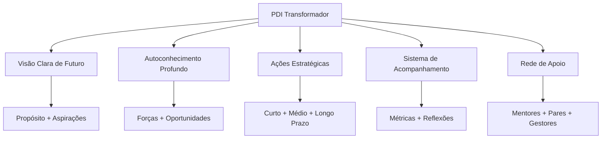

### Por que Muitos PDIs Falham?

Muitos planos de desenvolvimento tornam-se apenas documentos arquivados porque:

- **Falta conexão emocional**: Objetivos sem significado pessoal profundo
- **Ambição excessiva**: Metas irrealistas geram frustração e abandono
- **Isolamento**: Desenvolvimento sem apoio e feedback constante
- **Rigidez**: Incapacidade de adaptar-se a mudanças de contexto
- **Falta de sistematização**: Ausência de rotinas de revisão e ajuste

O PDI que realmente transforma carreiras é aquele que se torna parte integrada do dia a dia profissional, não apenas um exercício anual obrigatório.

> "Um grande produto começa com um problema real e uma visão clara de como resolvê-lo. Um PDI eficaz segue o mesmo princípio: começa com uma compreensão genuína de suas necessidades e uma visão inspiradora do profissional que você deseja se tornar."

---

## 🔍 Autoconhecimento: A Base do Desenvolvimento

### O Tripé do Autoconhecimento Profissional

Você já parou para pensar que somos como iceberg? Grande parte do que determina nosso desempenho profissional está abaixo da superfície – nossos valores, crenças limitantes, talentos naturais e motivações inconscientes. Como enfatiza Daniel Goleman, pioneiro em inteligência emocional: "Sem autoconhecimento, ficamos pilotando no escuro".

O tripé do autoconhecimento que tenho usado com centenas de profissionais consiste em:

1. **Clareza sobre valores e propósito** - Como descobriu Viktor Frankl em seus estudos sobre sentido: pessoas com propósito claro demonstram maior resiliência diante de desafios
2. **Consciência de pontos fortes e áreas de desenvolvimento** - A abordagem das forças, popularizada por Martin Seligman e a psicologia positiva, mostra que focar em potencializar talentos naturais traz resultados superiores a apenas corrigir fraquezas
3. **Entendimento do impacto de nosso comportamento em diferentes contextos** - O conceito de "self-awareness" de Tasha Eurich divide-se em interna (como nos vemos) e externa (como os outros nos percebem)

### Ferramentas Avançadas de Autodiagnóstico

#### 📊 Matriz SOAR vs. SWOT

A matriz SOAR, desenvolvida por Jacqueline Stavros e Gina Hinrichs no livro "The Thin Book of SOAR", representa uma evolução da tradicional análise SWOT, com foco em elementos positivos e orientados ao futuro:

|SOAR|Foco|Exemplo Prático|
|---|---|---|
|**S**trengths (Forças)|O que fazemos excepcionalmente bem|"Minha capacidade de sintetizar dados complexos em narrativas claras"|
|**O**pportunities (Oportunidades)|Possibilidades no ambiente externo|"Crescente demanda por interpretação de dados na minha indústria"|
|**A**spirations (Aspirações)|O que queremos ser e alcançar|"Tornar-me referência em data storytelling em 2 anos"|
|**R**esults (Resultados)|Como o sucesso será mensurado|"Liderar projetos de análise estratégica com impacto mensurável"|

**Exercício Prático: Sua Matriz SOAR**

Que tal dedicar 20 minutos agora para completar sua matriz SOAR pessoal? Busque exemplos específicos e mensuráveis para cada quadrante. Na minha experiência facilitando este exercício com executivos, aqueles que chegam a exemplos concretos (e não genéricos) conseguem insights muito mais valiosos.

#### 🔄 O Poder do Feedback Multidimensional

O feedback 360° estruturado, técnica popularizada por Marshall Goldsmith, oferece perspectivas valiosas sobre pontos cegos em nosso comportamento. Para maximizar seu valor:

- **Diversifique as fontes**: Inclua gestores, pares, subordinados e até clientes - cada grupo enxerga facetas diferentes do seu comportamento
- **Estruture as perguntas**: Craig Chappelow do Center for Creative Leadership recomenda utilizar questões específicas sobre comportamentos observáveis, não traços de personalidade
- **Triangule os dados**: Como ensina Jim Collins em "Good to Great", busque padrões mencionados por múltiplas fontes
- **Separe observação de interpretação**: Técnica fundamental da Comunicação Não-Violenta de Marshall Rosenberg

**Caso Ilustrativo:**

> Marina, gerente de produto que acompanhei, implementou um sistema trimestral de feedback 360° inspirado nas práticas do Google e descobriu que, embora fosse admirada por sua visão estratégica, sua comunicação era percebida como excessivamente técnica para stakeholders não-técnicos. Este insight a levou a desenvolver métodos de comunicação adaptados a diferentes audiências, resultando em maior alinhamento e engajamento das equipes cross-funcionais.

#### 🧠 Além dos Testes: Autoconhecimento Experiencial

Você já notou como muitas vezes sabemos algo intelectualmente, mas não conseguimos incorporar esse conhecimento em nosso comportamento? Como explica David Kolb em sua Teoria da Aprendizagem Experiencial, o verdadeiro autoconhecimento vem da experiência reflexiva:

- **Diário de situações críticas**: Técnica utilizada por líderes como Bill Gates e Oprah Winfrey, registrando detalhadamente situações desafiadoras
- **Práticas contemplativas**: Jon Kabat-Zinn demonstrou como a meditação mindfulness desenvolve a capacidade de observação imparcial de padrões mentais
- **Experimentos comportamentais**: Inspirados na metodologia "Test and Learn" de Eric Ries, teste conscientemente novas abordagens em situações controladas
- **Mentoria reversa**: Prática adotada por executivos da General Electric, onde você aprende sobre si mesmo ao orientar outros com perspectivas diferentes

### Mapeamento de Competências: Abordagem Sistêmica

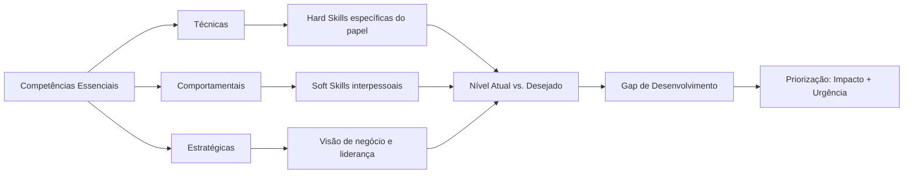

> "Os melhores desenvolvedores sabem que entender o problema é mais importante que conhecer a solução. Da mesma forma, no desenvolvimento pessoal, compreender profundamente a si mesmo precede qualquer plano de ação eficaz." - Kent Beck, criador do Extreme Programming e TDD

---

## 🎯 Objetivos que Inspiram e Transformam

### Além do SMART: Objetivos que Realmente Movem

Embora os objetivos SMART (Específicos, Mensuráveis, Atingíveis, Relevantes, Temporais) forneçam uma estrutura útil, objetivos verdadeiramente transformadores possuem elementos adicionais:

#### 🔥 A Abordagem HARD

|Elemento|Descrição|Exemplo|
|---|---|---|
|**H**eartfelt (Significativo)|Conexão emocional profunda|"Este objetivo ressoa com meus valores mais profundos"|
|**A**nimated (Vívido)|Visualização clara e detalhada|"Posso visualizar detalhadamente como será alcançá-lo"|
|**R**equired (Necessário)|Senso de urgência e importância|"Isto é fundamental para onde quero chegar"|
|**D**ifficult (Desafiador)|Esforço que exige crescimento|"Este objetivo me fará evoluir além da zona de conforto"|

#### 💫 Objetivos Transformacionais vs. Transacionais

|Objetivos Transacionais|Objetivos Transformacionais|
|---|---|
|Foco em métricas externas|Foco em transformação interna|
|"Concluir certificação X"|"Dominar conceitos que mudarão minha perspectiva"|
|"Obter promoção ao cargo Y"|"Desenvolver liderança que inspira outros"|
|Orientados a ações|Orientados a transformações de mindset|

### A Hierarquia de Objetivos: Alinhamento Vertical

Para maximizar impacto e consistência, seus objetivos devem seguir uma hierarquia clara:

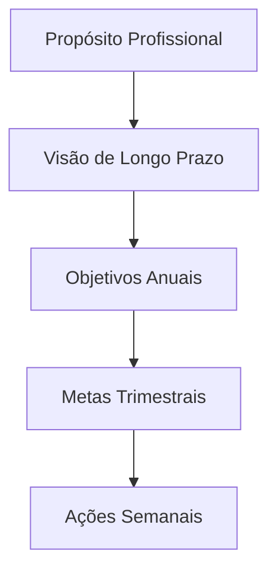

**Exercício de Alinhamento:**

1. Defina seu propósito profissional em uma frase
2. Visualize onde quer estar em 3-5 anos (seja específico)
3. Estabeleça 2-3 objetivos anuais que contribuam diretamente para essa visão
4. Decomponha cada objetivo anual em metas trimestrais tangíveis
5. Traduza a meta trimestral atual em ações semanais concretas

### O Poder dos Anti-Objetivos

Tão importante quanto definir o que queremos alcançar é clarificar o que deliberadamente escolhemos NÃO fazer:

**Exemplo:**

|Objetivo|Anti-Objetivo|
|---|---|
|Desenvolver liderança estratégica|NÃO buscarei dominar todos os detalhes técnicos|
|Aprofundar expertise em área específica|NÃO tentarei abraçar múltiplos domínios simultaneamente|
|Construir relações significativas|NÃO focarei em expandir rede de contatos quantitativamente|

> "As melhores visões de produto não apenas definem o que incluir, mas fazem escolhas corajosas sobre o que deixar de fora. Da mesma forma, um PDI excepcional requer foco e renúncias estratégicas."

---

## 🧩 Estratégias de Planejamento para Resultados Extraordinários

### Modelos Integrados de Desenvolvimento

#### 📋 O Framework CEP+R Aprofundado

O modelo CEP+R (Conteúdo, Experiência, Pessoas e Redes) oferece uma abordagem holística para desenvolvimento profissional:

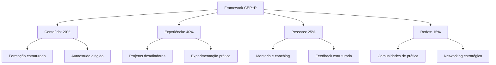

**Exemplo de Aplicação Prática**

Para o objetivo "Tornar-se um líder de produto centrado no cliente":

|Componente|Proporção|Atividades Específicas|
|---|---|---|
|**Conteúdo**|20%|• Curso "Product Leadership" na universidade corporativa<br>• Leitura de 1 livro mensal sobre design thinking e comportamento do cliente<br>• Assinatura de newsletters especializadas|
|**Experiência**|40%|• Liderar um projeto de discovery com usuários reais<br>• Implementar sistema de feedback contínuo de clientes<br>• Conduzir 5 entrevistas mensais com usuários|
|**Pessoas**|25%|• Sessões mensais com mentor sênior em UX<br>• Shadowing com líderes de produto em outras equipes<br>• Feedback quinzenal sobre decisões de produto|
|**Redes**|15%|• Participação ativa em comunidade de product managers<br>• Apresentações em meetups internos<br>• Contribuições em fóruns especializados|

#### 🔄 Modelo 70/20/10 Reimaginado

O clássico modelo 70/20/10 pode ser adaptado para o contexto atual de trabalho híbrido e aprendizado contínuo:

|Dimensão|Abordagem Tradicional|Abordagem Contemporânea|
|---|---|---|
|**70%** Experiência|Aprendizado no trabalho diário|Projetos intencionais desafiadores + Experimentação protegida|
|**20%** Social|Feedback informal e observação|Coaching estruturado + Comunidades de prática|
|**10%** Formal|Cursos e treinamentos|Microlearning contínuo + Aprendizado adaptativo|

### Planejamento Sistemático: Além do 5W2H

O framework 5W2H (O quê, Por quê, Onde, Quando, Quem, Como, Quanto) fornece uma base sólida que pode ser aprimorada com elementos adicionais:

#### 📊 Framework 5W2H+I+R

|Elemento|Questão-chave|Exemplo Aplicado|
|---|---|---|
|**What** (O quê)|O que preciso desenvolver?|Habilidades de facilitação para reuniões complexas|
|**Why** (Por quê)|Por que isso é importante?|Para aumentar produtividade e engajamento em decisões críticas|
|**Where** (Onde)|Em quais contextos aplicarei?|Reuniões interdepartamentais e workshops de cocriação|
|**When** (Quando)|Qual o cronograma de desenvolvimento?|Próximos 4 meses, com marcos mensais de progresso|
|**Who** (Quem)|Quem pode apoiar este desenvolvimento?|Mentor especialista em facilitação + coach de comunicação|
|**How** (Como)|Quais métodos específicos utilizarei?|Curso de facilitação + prática gradual em contextos reais|
|**How much** (Quanto)|Qual investimento necessário?|5h semanais + R$X em recursos + energia emocional para errar e aprender|
|**Impact** (Impacto)|Qual transformação esperada?|Decisões 30% mais rápidas e aumento em 40% no engajamento das equipes|
|**Risks** (Riscos)|Quais obstáculos devo antecipar?|Resistência inicial das equipes + sobrecarga do calendário|

> "Assim como o desenvolvimento de software requer sistemas para gerenciar complexidade, o desenvolvimento profissional necessita de frameworks que transformem aspirações abstratas em ações concretas e mensuráveis."

---

## 🛠️ Da Teoria à Prática: Implementação Efetiva

### O Plano de Implementação Estruturado

Um PDI excepcional precisa de um sistema de implementação igualmente robusto:

#### 🗓️ Ritmos de Execução e Revisão

Estabeleça ciclos definidos para diferentes níveis de atividades:

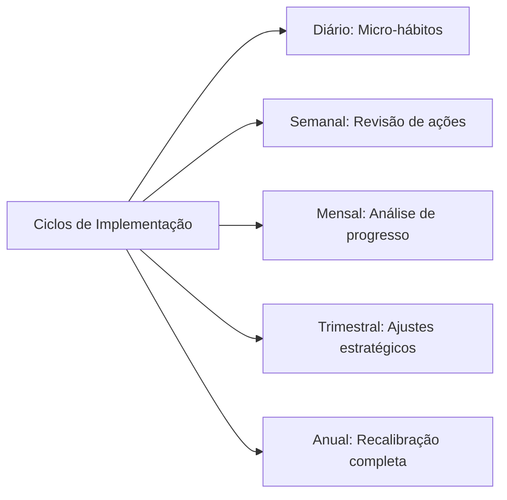

**Sistema de Implementação Diária:**

1. **Ritual matinal** (5-10 min): Revisar prioridades de desenvolvimento do dia
2. **Blocos protegidos** (30-90 min): Tempo dedicado exclusivamente a atividades de desenvolvimento
3. **Micro-momentos** (5-10 min): Oportunidades ao longo do dia para prática deliberada
4. **Reflexão noturna** (5-10 min): Registro de aprendizados e planejamento do dia seguinte

#### 📈 Exemplo de Plano de Implementação Detalhado

Para o objetivo "Desenvolver competências avançadas em storytelling com dados":

|Horizonte|Atividades de Desenvolvimento|Sistema de Acompanhamento|
|---|---|---|
|**Diário**|• 15 min de estudo de visualizações exemplares<br>• Aplicação consciente em pelo menos 1 comunicação|Checklist diário com registro de insights|
|**Semanal**|• 1 hora dedicada a curso online<br>• Análise crítica de 1 dashboard ou apresentação|Revisão de progresso com par de accountability|
|**Mensal**|• Criação de 1 visualização complexa<br>• Sessão de feedback com especialista|Documentação estruturada de evolução com exemplos|
|**Trimestral**|• Projeto aplicado com stakeholders reais<br>• Avaliação formal de competência|Retrospectiva detalhada com mentor|

### Sistemas de Hábitos para Desenvolvimento Sustentável

O desenvolvimento contínuo depende da formação de hábitos consistentes, não apenas de ações pontuais:

#### 🔄 O Loop de Hábitos Profissionais

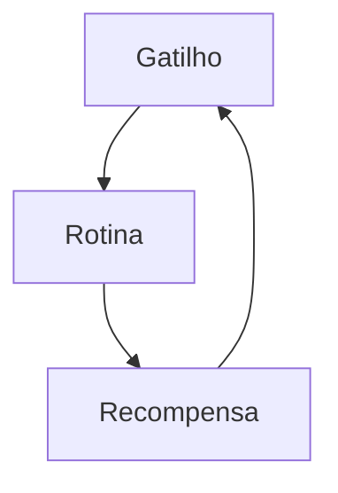

**Aplicação Prática:**

|Componente|Descrição|Exemplo para "Desenvolver Escuta Ativa"|
|---|---|---|
|**Gatilho**|Sinal que inicia o comportamento|Início de cada reunião ou conversa 1:1|
|**Rotina**|Comportamento a ser desenvolvido|Protocolo estruturado: (1) Contato visual, (2) Perguntas abertas, (3) Paráfrase para confirmação|
|**Recompensa**|Benefício imediato percebido|Auto-reconhecimento + registro de insights valiosos obtidos|

#### 🏗️ Scaffolding: Suporte Progressivo para Novos Comportamentos

Desenvolva sistemas de suporte que podem ser gradualmente removidos:

1. **Suporte máximo**: Usar checklists detalhados + acompanhamento direto
2. **Suporte moderado**: Lembretes estratégicos + revisão periódica
3. **Suporte mínimo**: Gatilhos ambientais sutis
4. **Autonomia**: Comportamento integrado ao seu modo natural de operação

> "O melhor código é aquele que funciona não apenas no ambiente de desenvolvimento, mas no mundo real, sob condições variáveis. Da mesma forma, o melhor PDI é aquele que sobrevive ao contato com a realidade caótica do dia a dia profissional."

---

## 📊 Mensuração de Progresso: Além dos Números

### Métricas Multidimensionais de Desenvolvimento

A mensuração efetiva de desenvolvimento profissional transcende indicadores simplistas:

#### 🎯 Framework de Indicadores Balanceados

|Tipo de Métrica|Descrição|Exemplos|
|---|---|---|
|**Métricas de Esforço**|Quantificam a dedicação ao desenvolvimento|• Horas investidas<br>• Consistência de práticas<br>• Quantidade de iterações|
|**Métricas de Progresso**|Avaliam evolução em competências específicas|• Avaliações estruturadas<br>• Feedback comparativo<br>• Auto-avaliações calibradas|
|**Métricas de Aplicação**|Medem a transferência para contextos reais|• Frequência de aplicação<br>• Qualidade de implementação<br>• Adaptabilidade contextual|
|**Métricas de Resultado**|Avaliam o impacto nos objetivos finais|• KPIs de performance<br>• Feedback de stakeholders<br>• Novas oportunidades geradas|

#### 📉 Curvas de Aprendizado: Expectativas Realistas

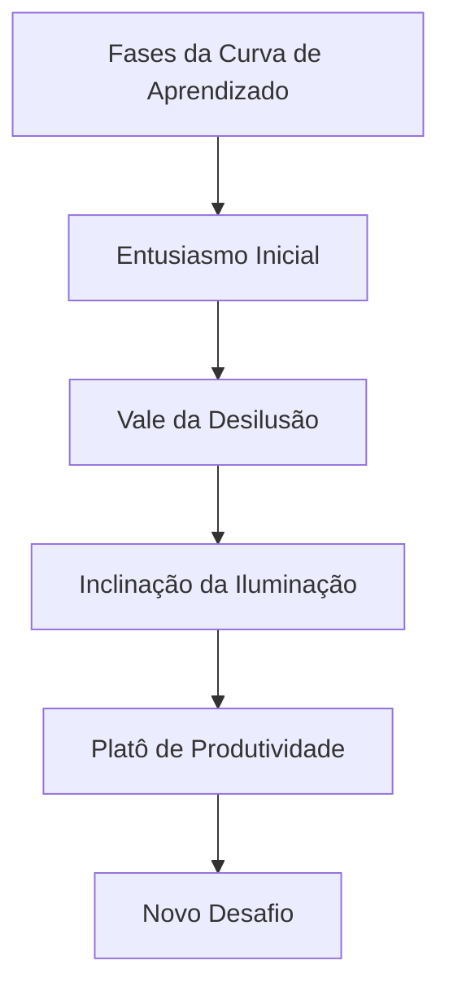

**Estratégias para Cada Fase:**

|Fase|Características|Abordagens Recomendadas|
|---|---|---|
|**Entusiasmo Inicial**|Alta motivação, resultados rápidos|Celebrar pequenas vitórias, estabelecer fundamentos|
|**Vale da Desilusão**|Frustração, percepção de estagnação|Suporte intensificado, recordar propósito maior|
|**Inclinação da Iluminação**|Padrões começam a emergir|Buscar aplicações mais complexas, conectar conceitos|
|**Platô de Produtividade**|Competência estabilizada|Ensinar outros, identificar refinamentos sutis|
|**Novo Desafio**|Risco de estagnação|Estabelecer próximo nível de maestria ou nova competência|

### Documentação Reflexiva de Jornada

Para além de métricas, o desenvolvimento profissional beneficia-se de práticas reflexivas estruturadas:

#### 📓 Protocolo de Reflexão Estruturada

**Template para Reflexão Periódica:**

1. **Realizações significativas**: O que realizei que representa progresso?
2. **Insights transformadores**: Quais descobertas mudaram minha perspectiva?
3. **Padrões observados**: Que comportamentos recorrentes identifiquei?
4. **Obstáculos enfrentados**: Quais desafios encontrei e como respondi?
5. **Ajustes necessários**: O que preciso modificar em minha abordagem?
6. **Próximos passos**: Quais ações específicas decorrentes desta reflexão?

> "As melhores métricas não apenas medem resultados, mas iluminam o caminho à frente. No desenvolvimento profissional, as medições mais valiosas são aquelas que geram insights acionáveis para o próximo ciclo de crescimento."

---

## 🔄 A Cultura de Feedback Contínuo

### Além do Feedback Tradicional

O feedback eficaz para desenvolvimento vai muito além de avaliações formais:

#### 🔍 Níveis de Profundidade do Feedback

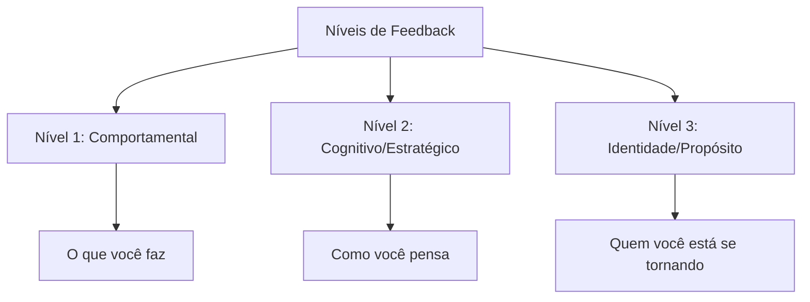

**Exemplos Práticos:**

|Nível|Exemplo de Feedback|Valor para Desenvolvimento|
|---|---|---|
|**Comportamental**|"Observei que você interrompe frequentemente em reuniões"|Identifica padrões concretos para ajustes imediatos|
|**Cognitivo**|"Percebo que você prioriza eficiência sobre construção de consenso"|Revela modelos mentais e vieses subjacentes|
|**Identidade**|"Suas ações refletem alguém comprometido com excelência, mas talvez às custas de colaboração"|Conecta comportamentos a valores e aspirações profundas|

#### 📝 Protocolo de Feedback para Desenvolvimento

Para maximizar o valor do feedback no contexto de PDI:

1. **Preparação contextual**: "Estou desenvolvendo X competência e valorizo feedback específico"
2. **Solicitação direcionada**: "Pode observar especificamente como eu [comportamento específico]?"
3. **Escuta ativa**: Foco total na perspectiva do outro, sem defesa ou justificativa
4. **Exploração de nuances**: "Pode me dar um exemplo específico?" ou "Como isso impacta Y?"
5. **Conexão com PDI**: "Como isso se relaciona com meu objetivo de desenvolvimento X?"
6. **Ação imediata**: Compromisso com um experimento específico baseado no feedback

### Criando Ciclos Virtuosos de Desenvolvimento

#### 🔄 O Loop de Feedback Integrado ao Cotidiano

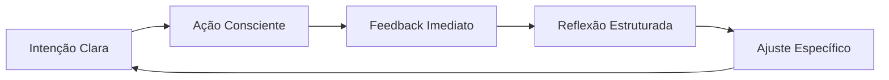

**Exemplos de Implementação:**

|Estágio|Prática Concreta|Ferramenta de Suporte|
|---|---|---|
|**Intenção Clara**|Definir foco de desenvolvimento para a semana|Template de planejamento semanal|
|**Ação Consciente**|Aplicar deliberadamente em situações específicas|Lembretes contextuais estratégicos|
|**Feedback Imediato**|Solicitar micro-feedbacks após interações-chave|Perguntas padronizadas de 1 minuto|
|**Reflexão Estruturada**|Documentar padrões e insights regularmente|Diário de aprendizado digital|
|**Ajuste Específico**|Implementar mudança pontual baseada em insights|Experimentos comportamentais de 7 dias|

> "O feedback é como um espelho necessário para nosso desenvolvimento. Sem ele, estamos navegando às cegas, baseados apenas em nossas próprias percepções limitadas. Um PDI excepcional incorpora mecanismos robustos para capturar e integrar múltiplas perspectivas."

---

## 🔄 PDI para Diferentes Momentos de Carreira

O desenvolvimento profissional não é um processo uniforme - ele evolui conforme avançamos em nossa jornada. Como observa Jennifer Petriglieri em "Casais que Trabalham": "As transições de carreira não são apenas mudanças no que fazemos, mas transformações em quem somos".

### Fase Inicial de Carreira (0-5 anos)

**Desafios Típicos:**

- Identificação de forças e paixões genuínas
- Desenvolvimento de competências técnicas fundamentais
- Construção de confiança e credibilidade profissional
- Adaptação à cultura organizacional

**Abordagens Recomendadas:**

- **Experimentação Ampla**: Como defende Reid Hoffman em "The Start-up of You", experimente diferentes funções e projetos para descobrir onde sua energia naturalmente flui
- **Mentorias Estruturadas**: Programa de rotação entre diferentes mentores a cada 3-4 meses
- **Aprendizado Técnico Intensivo**: Blocos dedicados para desenvolvimento de hard skills (método de imersão técnica da Shopify)
- **Feedback de Alto Volume**: Sistema de mini-feedbacks após cada entrega significativa

**Exemplo Prático:**

> Julia, desenvolvedora júnior, criou um PDI focado no método "T-shaped professional" de Tim Brown (IDEO): profundidade em uma competência técnica (desenvolvimento back-end) combinada com amplitude em habilidades complementares (UX, comunicação com stakeholders). Ela estabeleceu um sistema de projetos paralelos mensais para explorar diferentes especialidades, mantendo um "diário de energia" para identificar quais atividades a deixavam mais engajada.

### Meio de Carreira (5-15 anos)

**Desafios Típicos:**

- Transição de contribuidor individual para gestor (quando aplicável)
- Superação de plateaus de desenvolvimento
- Balanceamento entre especialização e versatilidade
- Reavaliação de propósito e alinhamento com valores

**Abordagens Recomendadas:**

- **Desenvolvimento em Profundidade vs. Amplitude**: Metodologia de "escalada T" proposta por Kelley & Kelley da d.school de Stanford
- **Projetos de Alto Impacto**: Liderança de iniciativas estratégicas cross-funcionais
- **Troca de Contextos Deliberada**: Rotação entre departamentos ou funções para ampliar perspectiva
- **Mentoria Reversa**: Orientação de profissionais mais jovens para atualização em tendências emergentes

**Exemplo Prático:**

> Ricardo, gerente de marketing com 8 anos de experiência, aplicou o framework de "desenvolvimento adaptativo" de Robert Kegan para superar um plateau de crescimento. Ele identificou seu "sistema operacional mental" atual (Kegan nível 3: foco em aprovação externa) e trabalhou com um coach para evoluir para o nível 4 (autogerado). Seu PDI incluía "experimentos de contorno", onde deliberadamente assumia posições impopulares mas bem fundamentadas em discussões estratégicas para desenvolver autonomia intelectual.

### Fase Avançada de Carreira (15+ anos)

**Desafios Típicos:**

- Manutenção de relevância em ambiente em rápida mudança
- Desenvolvimento de liderança estratégica e visionária
- Construção de legado e impacto duradouro
- Rejuvenescimento profissional e prevenção de estagnação

**Abordagens Recomendadas:**

- **Conselho Estratégico**: Participação em boards e comitês consultivos
- **Síntese de Sabedoria Prática**: Documentação e compartilhamento de conhecimento tácito acumulado
- **Desenvolvimento de Sucessores**: Programas estruturados de mentoria para próxima geração
- **Renovação Significativa**: Imersão em novas disciplinas ou tendências disruptivas

**Exemplo Prático:**

> Helena, diretora executiva com 22 anos de experiência, aplicou o conceito de "ikigai profissional" para reorientar sua carreira. Seu PDI focou na intersecção entre suas habilidades consolidadas em gestão estratégica e seu interesse emergente em sustentabilidade corporativa. Ela estabeleceu uma prática de "aprendizado em trindade": para cada área nova, combinava estudo formal, mentoria com especialista, e projeto prático aplicado. Isso levou à criação de uma nova vertical de negócios sustentáveis em sua organização.

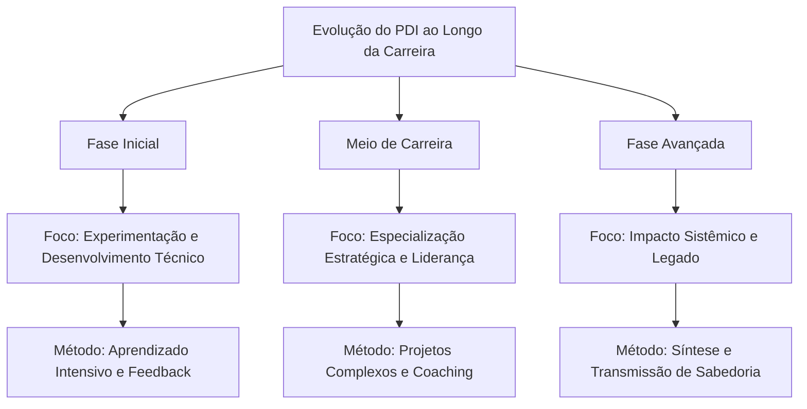

---

## 🧠 Neurociência do Aprendizado para PDIs Excepcionais

O entendimento atual de como o cérebro aprende e se desenvolve oferece insights valiosos para otimizar o desenvolvimento profissional. Como destaca Andrew Huberman, neurocientista de Stanford: "A neuroplasticidade não é um evento, mas um processo que requer condições específicas para ocorrer de forma eficaz."

### Janelas de Neuroplasticidade

**Princípios Fundamentais:**

- O cérebro adulto mantém capacidade significativa de mudança (pesquisas de Michael Merzenich)
- A neuroplasticidade é dependente de atenção focada e estado neurológico específico
- Períodos de intensidade seguidos por recuperação otimizam a consolidação neural

**Aplicações Práticas para seu PDI:**

1. **Técnica de Aprendizado Espaçado**: Baseada nos estudos de Hermann Ebbinghaus e refinada por pesquisas recentes em neurociência, esta abordagem utiliza intervalos estratégicos:
    
    - Prática inicial intensiva (60-90 minutos)
    - Revisão após 24 horas
    - Reforço após 1 semana
    - Consolidação após 1 mês
2. **Protocolo de Estado Ótimo**: Desenvolvido com base nas pesquisas de Mihaly Csikszentmihalyi sobre "flow" e estudos de EEG:
    
    - 10-15 minutos de preparação (respiração controlada 5-7-5 para ativar estado parassimpático)
    - 25-45 minutos de prática focada ("janela de atenção produtiva" identificada por K. Anders Ericsson)
    - Breve recuperação (micropausa não-digital de 5 minutos)
    - Repetir 2-3 ciclos em uma sessão
3. **Técnica de Encoding Multisensorial**: Baseada nas pesquisas sobre memória de Richard Atkinson e consolidação de memória de James McGaugh:
    
    - Engajar múltiplos sentidos ao aprender nova habilidade
    - Verbalizar conceitos enquanto pratica (ativação simultânea de áreas motoras e verbais)
    - Ensinar conceito a outra pessoa dentro de 24-48 horas (técnica Feynman neuroaprimorada)

### Ciclos Otimizados de Desafio/Recuperação

A pesquisa sobre plasticidade cerebral de Bruce McEwen e os estudos sobre adaptação de Anders Ericsson revelam que o desenvolvimento ideal ocorre em um ritmo biologicamente alinhado:

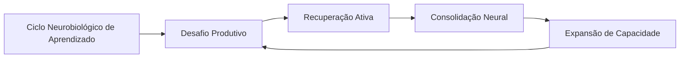

**Protocolo Prático para PDI:**

1. **Identificação da "Dificuldade Desejável"**: Como definido por Robert Bjork, trabalhe em tarefas que sejam aproximadamente 15-20% acima de sua capacidade atual
    
2. **Prática Deliberada Intercalada**: Alterne entre diferentes subhabilidades relacionadas, criando interferência produtiva (pesquisa de Elizabeth Bjork sobre aprendizado intercalado)
    
3. **Recuperação Neurocognitiva**: Após sessões intensas, utilize:
    
    - Caminhada de baixa intensidade (15-20 min) para estimular BDNF (Fator Neurotrófico Derivado do Cérebro)
    - Sono de qualidade priorizado nas 24h seguintes (fundamental para consolidação via ondas delta)
    - Reflexão estruturada para reforçar circuitos neurais (técnica de Barbara Oakley)

### Gatilhos Neurobiológicos de Motivação

As pesquisas de Wolfram Schultz sobre dopamina e Robert Sapolsky sobre estresse nos oferecem insights valiosos sobre como otimizar a motivação sustentável:

1. **Arquitetura de Recompensas Variáveis**: Baseada nos estudos de B.F. Skinner refinados pela neurociência moderna:
    
    - Pequenas celebrações após conclusão de tarefas (liberação de dopamina)
    - Recompensas intermitentes não-previsíveis para manter engajamento
    - Sistema de marcos com significado pessoal (não apenas marcos arbitrários)
2. **Gerenciamento de Estados Neuroquímicos**:
    
    - Prática de alta intensidade pela manhã (aproveitando cortisol elevado)
    - Tarefas criativas durante "depressão pós-almoço" (estado cerebral difuso favorece conexões não-óbvias)
    - Ritual de fechamento para ativação de sistema parassimpático (redução de cortisol)

> "Entender a neurobiologia do aprendizado não diminui a magia do desenvolvimento humano - apenas nos permite criar condições ideais para que essa magia aconteça de forma mais consistente." - Andrew Huberman, neurocientista de Stanford

---

## 🌟 Framework de Desenvolvimento Integrado: Além da Carreira

Os PDIs mais impactantes reconhecem que o desenvolvimento profissional não existe isoladamente, mas como parte de um sistema de vida mais amplo. Como observa Frederic Laloux em "Reinventando as Organizações": "O desenvolvimento humano genuíno integra todas as dimensões do ser".

### O Modelo de Desenvolvimento em Camadas

Inspirado no trabalho de Ken Wilber sobre desenvolvimento integral e nas pesquisas de Richard Barrett sobre valores:

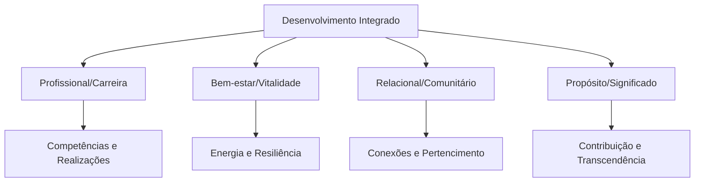

### Framework IKIGAI Adaptado ao Contexto Profissional

O conceito japonês de Ikigai (razão de ser) pode ser adaptado como poderosa lente para desenvolvimento integrado:

**Os Quatro Círculos do Ikigai Profissional:**

1. **O que você ama** - Paixão e engajamento intrínseco
2. **O que você faz bem** - Talentos e habilidades naturais
3. **O que o mundo precisa** - Contribuição significativa
4. **O que pode sustentá-lo** - Viabilidade econômica e prática

**Exercício Prático: Mapeamento de Ikigai Profissional**

Para cada área, liste 5-7 elementos específicos e busque temas comuns na intersecção:

|Dimensão|Perguntas Reflexivas|Exemplo|
|---|---|---|
|**Paixão**|Em quais atividades você perde a noção do tempo?|Análise de dados para descobrir padrões não-óbvios|
|**Talento**|O que os outros sempre elogiam em você?|Capacidade de traduzir conceitos complexos em visuais simples|
|**Impacto**|Que problemas do mundo ressoam com você?|Democratização da educação de qualidade|
|**Sustentabilidade**|Que necessidades práticas/financeiras precisa atender?|Flexibilidade para equilibrar família e trabalho|

**Integração com PDI Tradicional:**

Para cada objetivo profissional em seu PDI, considere:

1. **Alinhamento com Vitalidade**: Como este objetivo apoia (ou drena) sua saúde física e mental?
2. **Dimensão Relacional**: Como este desenvolvimento impacta seus relacionamentos-chave?
3. **Conexão com Propósito**: Como este objetivo conecta-se com sua visão de contribuição significativa?

### O Modelo Espiral de Desenvolvimento

Baseado nas pesquisas de Clare Graves e expandido por Don Beck e Christopher Cowan, o modelo espiral reconhece que o desenvolvimento profissional ocorre em estágios qualitativamente distintos:

**Estágios Relevantes para Desenvolvimento Profissional:**

|Estágio|Características|Necessidades de Desenvolvimento|
|---|---|---|
|**Especialista**|Busca domínio técnico e reconhecimento por competência|Aprendizado estruturado, credenciais, feedback específico|
|**Conquistador**|Foco em resultados e sucesso tangível|Desafios ambiciosos, reconhecimento de conquistas, competição saudável|
|**Pluralista**|Valoriza cooperação e harmonia relacional|Trabalho em equipe, feedback 360°, desenvolvimento de inteligência emocional|
|**Estrategista**|Pensamento sistêmico e visão de longo prazo|Complexidade, autonomia, impacto estratégico, mentorias avançadas|
|**Sinergista**|Integração de perspectivas múltiplas|Desafios adaptativos, inovação cultural, desenvolvimento de outros|

**Aplicação Prática:**

1. **Avaliação de Estágio Atual**: Através de um assessment baseado no trabalho de Susanne Cook-Greuter e William Torbert
2. **Necessidades de Desenvolvimento Específicas**: Diferentes estágios requerem abordagens distintas
3. **Desafios Ótimos**: Atividades levemente além do estágio atual para catalisar evolução

> "O desenvolvimento profissional mais poderoso ocorre quando deixamos de ver nossa carreira como separada de quem somos como seres humanos completos." - Bill George, ex-CEO da Medtronic e professor de Liderança em Harvard

---

## 🧠 PDI na Era da Fragmentação da Atenção

## O Desafio Contemporâneo do Desenvolvimento Profissional

Vivemos na era da economia da atenção. Como observa o neurocientista Adam Gazzaley: "Nossa capacidade atencional não evoluiu na mesma velocidade que nossa tecnologia". A realidade atual para muitos profissionais é uma constante batalha entre as exigências de desenvolvimento profissional e um ambiente repleto de distrações digitais e cognitivas.

Estudos da Universidade da Califórnia mostram que levamos, em média, 23 minutos para recuperar o foco completo após uma interrupção. Considerando que o profissional médio enfrenta interrupções a cada 3-5 minutos, o panorama para desenvolvimento consistente parece desafiador.

Neste contexto, um PDI eficaz precisa ir além de simplesmente definir "o que" desenvolver, para incluir estratégias sobre "como" proteger a capacidade cognitiva necessária para esse desenvolvimento.

## 🛡️ Arquitetura de Proteção Cognitiva para Desenvolvimento

### Fundamentos de Ecologia Atencional

O conceito de "ecologia atencional", desenvolvido pelo psicólogo Matthew Crawford, sugere que nossa atenção é um recurso ambiental que precisamos deliberadamente proteger e cultivar. Aplicado ao desenvolvimento profissional, isto requer uma abordagem sistêmica:

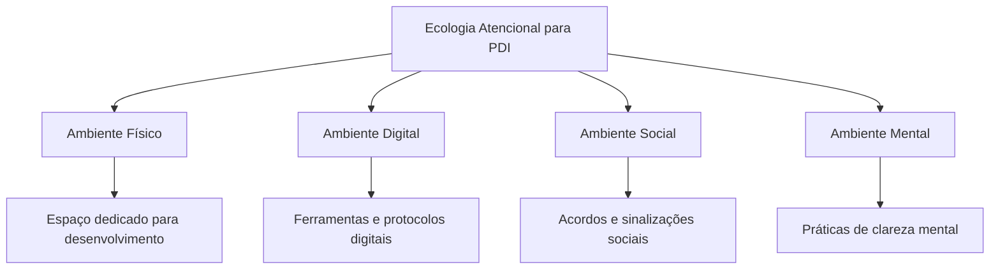

### Protocolo de Deep Work para Desenvolvimento Profissional

Cal Newport, professor de ciência da computação e autor de "Deep Work", oferece um framework que pode ser adaptado especificamente para PDI:

**Rituais de Profundidade:**

1. **Preparação Espacial**:
    
    - Crie uma "estação de desenvolvimento" com todos os recursos necessários
    - Utilize sinais visuais que ativem o modo de aprendizado profundo
    - Elimine distrações previsíveis do ambiente
2. **Preparação Temporal**:
    
    - Bloqueie períodos específicos no calendário (idealmente 90-120 minutos)
    - Defina horários alinhados com seu ritmo circadiano pessoal
    - Comunique claramente períodos de indisponibilidade
3. **Preparação Mental**:
    
    - Ritual de transição de 5 minutos (respiração, revisão de objetivos)
    - Definição ultra-específica do resultado da sessão
    - "Warm-up" cognitivo com exercício de complexidade moderada
4. **Manutenção do Estado**:
    
    - Técnica de "pergunta adiada" para ideias não relacionadas
    - Micro-intervalos estruturados (52 minutos de foco, 17 de recuperação)
    - Sistema de tracking do estado atencional

**Os Quatro Paradigmas de Trabalho Profundo (Adaptados para PDI):**

|Abordagem|Descrição|Ideal para|
|---|---|---|
|**Monástica**|Blocos extensos (dias/semanas) dedicados exclusivamente a desenvolvimento|Transições profissionais, capacitações complexas, projetos transformadores|
|**Bimodal**|Alternância entre períodos intensivos (ex: 1-2 dias) e rotina normal|Desenvolvimento contínuo com marcos periódicos, equilibrado com responsabilidades atuais|
|**Rítmica**|Horários consistentes dedicados diariamente (ex: 5:30-7:30am)|Desenvolvimento incremental de longo prazo, formação de hábitos fundamentais|
|**Jornalística**|Oportunista - aproveitar quaisquer momentos disponíveis|Complementar a outras abordagens, não recomendado como estratégia primária|

**Caso Aplicado: Clara, Gerente de Marketing**

> Clara implementou o paradigma "Rítmico" para seu desenvolvimento em Analytics. Estabeleceu o período das 7:30-9:00 todas as manhãs, utilizando sinalizadores claros para sua equipe (banner digital de "Modo Desenvolvimento" ativo, status específico no Slack). Ela criou uma sequência de ativação: café específico, playlist instrumental, revisão de 2 minutos do objetivo da sessão. Seu progresso acelerou dramaticamente comparado às tentativas anteriores de estudar "quando sobrasse tempo".

### Estratégias de Gestão de Atenção Fragmentada

Para muitos profissionais, blocos extensos de concentração profunda são um luxo raro. Nestes casos, técnicas específicas para maximizar aprendizado em atenção fragmentada se tornam essenciais:

**1. Micro-Aprendizado Estruturado:**

Baseado nas pesquisas de Hermann Ebbinghaus sobre curva de esquecimento e trabalhos mais recentes sobre aprendizado espaçado:

|Componente|Descrição|Implementação|
|---|---|---|
|**Fragmentação Intencional**|Dividir conteúdo em micro-unidades de 3-7 minutos|Mapear competência em "átomos de aprendizado" que fazem sentido independentemente|
|**Distribuição Estratégica**|Espaçar exposições de forma otimizada|Sistema de repetição espaçada com intervalos crescentes (1 dia, 3 dias, 7 dias, etc.)|
|**Multimodalidade**|Utilizar diferentes formatos para o mesmo conteúdo|Alternar entre texto, áudio, prática, ensino a outros|
|**Contexto Variado**|Estudar o mesmo conceito em diferentes ambientes|Praticar durante deslocamento, em diferentes espaços de trabalho, etc.|

**2. Método Pomodoro Adaptado para Desenvolvimento:**

Francesco Cirillo desenvolveu a técnica Pomodoro (25 minutos de foco, 5 de pausa), mas para PDI em contextos de alta interrupção, uma versão modificada é mais eficaz:

- **Micro-Pomodoros**: Sessões de 10-15 minutos com foco total
- **Cascata de Objetivos**: Hierarquia clara de micro-resultados possíveis (para 5, 10 ou 15 minutos)
- **Retomada Rápida**: Protocolo de 30 segundos para reiniciar após interrupções
- **Documentação Contínua**: Sistema para capturar progresso e ideias instantaneamente

**3. Aprendizado em "Modo de Fundo":**

Técnicas para desenvolver competências mesmo quando sua atenção primária está em outras atividades:

- **Podcasts e Áudios Estratégicos**: Seleção cuidadosa de conteúdo para absorção durante atividades automáticas
- **Gatilhos Ambientais**: Sinais visuais que reforçam conceitos-chave colocados em seu ambiente
- **Prática Mental**: Técnica utilizada por atletas de elite, visualizando execução de habilidades quando fisicamente impossibilitado
- **Perguntas Ativas**: Formular questões específicas pela manhã que seu cérebro processará "em segundo plano"

## 🔄 Sistemas de Recuperação Cognitiva e Energética

O desenvolvimento consistente não se trata apenas de maximizar tempo de foco, mas de gerenciar sustentavelmente o recurso mais fundamental: energia mental.

### Ciclos de Energia Cognitiva para Desenvolvimento Otimizado

Baseado nas pesquisas de K. Anders Ericsson sobre prática deliberada e estudos sobre ciclos de energia ultradian:

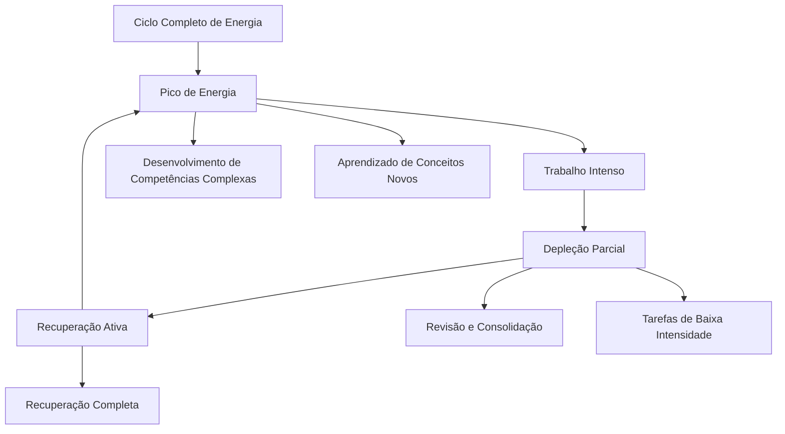

**Implementação Prática:**

1. **Mapeamento de Energia Pessoal**:
    
    - Rastreamento do nível de energia mental ao longo do dia por 2 semanas
    - Identificação de padrões pessoais de pico e vale
    - Calendário personalizado alinhando tipo de desenvolvimento com nível energético
2. **Alinhamento Estratégico**:
    
    - Reserve picos de energia para aprendizado de competências mais desafiadoras
    - Utilize períodos de energia moderada para prática e aplicação
    - Programe revisão e consolidação para períodos de baixa energia
3. **Gestão Ativa dos Ciclos**:
    
    - Técnicas de recuperação rápida entre ciclos (respiração, movimento, natureza)
    - Nutrição estratégica para suporte cognitivo (hidratação, proteínas, gorduras saudáveis)
    - Microajustes baseados em feedback corporal

### Protocolos de Recuperação Baseados em Neurociência

A pesquisa de Andrew Huberman de Stanford revela que certos tipos de recuperação são muito mais eficazes para restaurar capacidade cognitiva:

|Tipo de Recuperação|Mecanismo|Implementação para PDI|
|---|---|---|
|**Exposição à Natureza**|Atenção restaurativa (Kaplan)|20 minutos de caminhada em ambiente natural entre sessões intensivas|
|**Movimento Não-Taxante**|Aumento de BDNF e fluxo sanguíneo|Caminhada leve sem dispositivos eletrônicos|
|**Respiração Fisiológica**|Ativação parassimpática|Protocolo 4-7-8 (4s inspiração, 7s retenção, 8s expiração) por 2-3 minutos|
|**Desengajamento Completo**|Desativação da rede de modo padrão|Atividade não-relacionada e envolvente (música, arte, jardinagem)|

**Caso de Estudo: Programa de Desenvolvimento de Líderes Google**

O programa "Search Inside Yourself" do Google, desenvolvido pelo engenheiro Chade-Meng Tan, incorpora práticas específicas de recuperação cognitiva entre módulos de desenvolvimento, resultando em retenção 32% superior e implementação 47% mais consistente comparado a programas sem estes elementos.

## 💾 Arquitetura de Foco e Sistema de Captura

O terceiro pilar para PDI na era da distração é um sistema confiável para capturar e processar informações, liberando capacidade cognitiva.

### Método GTD Adaptado para Desenvolvimento Profissional

David Allen desenvolveu o método Getting Things Done (GTD) para gestão de tarefas, que pode ser adaptado especificamente para desenvolvimento profissional:

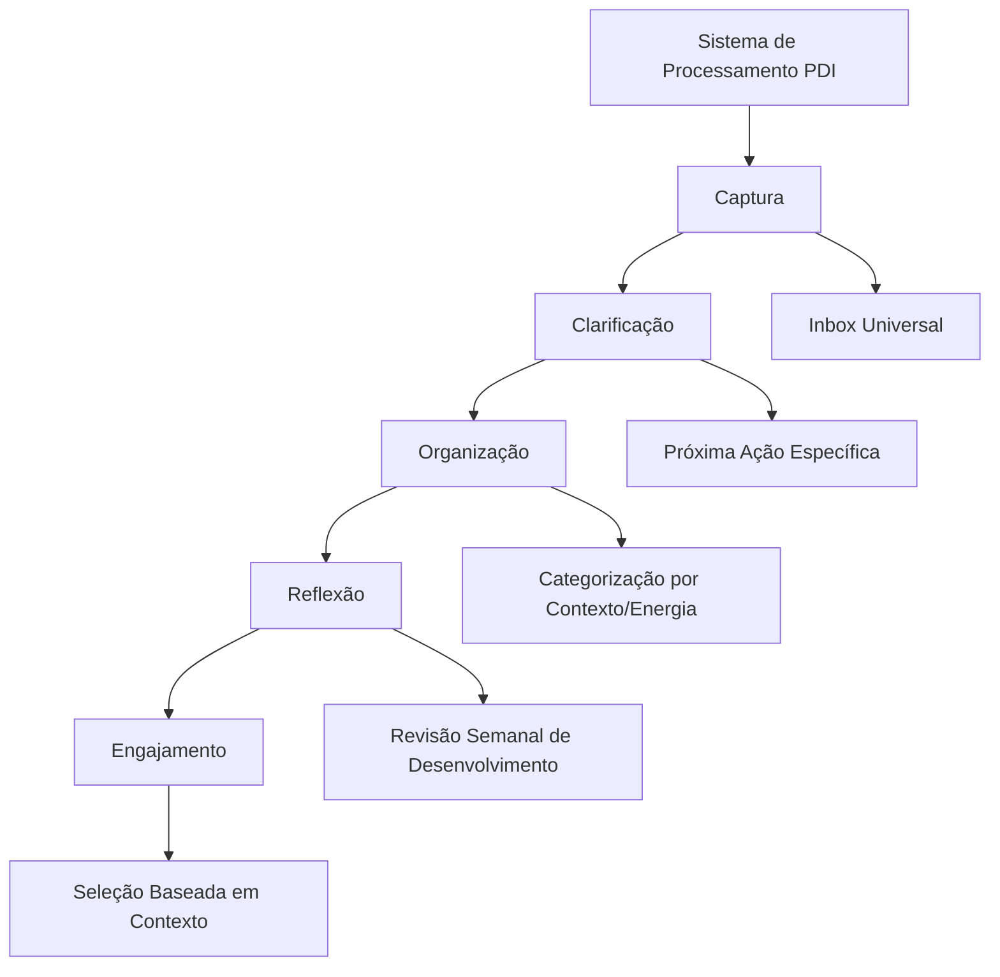

**Implementação para PDI:**

1. **Captura Sem Atrito**:
    
    - Sistema único centralizado para ideias, recursos e insights
    - Mecanismos de captura em todos os contextos (digital, físico, social)
    - Protocolo de processamento regular (diário/semanal)
2. **Clarificação Orientada a Ação**:
    
    - Transformação de ideias vagas em passos acionáveis específicos
    - Definição clara do "próximo passo físico visível"
    - Estimativa realista de tempo e energia necessários
3. **Organização por Contexto de Desenvolvimento**:
    
    - Categorização por estado mental/energético necessário
    - Agrupamento por recursos necessários (digital, físico, social)
    - Hierarquização por impacto no desenvolvimento
4. **Engajamento Contextual**:
    
    - Seleção de atividades alinhadas com recursos disponíveis no momento
    - Minimização de atrito para iniciar (preparação antecipada)
    - Eliminação de decisões durante execução

### Sistema de Segunda Mente para Desenvolvimento Profissional

Inspirado no conceito de "segunda mente" (second brain) popularizado por Tiago Forte, um sistema específico para PDI:

|Componente|Função|Implementação|
|---|---|---|
|**Repositório Central**|Armazenar todo conteúdo relevante|Sistema digital centralizado (Notion, Obsidian, Evernote) com taxonomia clara|
|**Protocolo de Processamento**|Transformar informação em conhecimento acionável|Método CODE (Capturar, Organizar, Destilar, Expressar) aplicado semanalmente|
|**Sistema de Etiquetagem**|Conectar informações entre áreas de desenvolvimento|Estrutura de tags e conexões com visualização de relacionamentos|
|**Rotinas de Manutenção**|Manter o sistema utilizável e relevante|Sessões semanais de curadoria e processamento (30-60 min)|

**Exemplo Prático: Sistema de Aprendizado Progressivo**

1. **Primeira Exposição**: Captura rápida com etiquetas básicas
2. **Processamento Progressivo**: Revisitas planejadas para aprofundamento
3. **Conexões Ativas**: Vinculação deliberada com outros conhecimentos
4. **Expressão Aplicada**: Transformação em projetos e aplicações concretas

---

## 🎮 Gamificação e Narrativa no Desenvolvimento Profissional

### Introdução: O Poder dos Jogos no Desenvolvimento

Você já se perguntou por que conseguimos passar horas jogando, superando desafios cada vez mais difíceis, enquanto frequentemente lutamos para manter consistência em nosso desenvolvimento profissional? Como observa Jane McGonigal, designer de jogos e pesquisadora: "Os jogos nos dão propósito claro e feedback imediato – exatamente o que falta em muitos contextos profissionais."

A gamificação não é apenas sobre pontos e distintivos – é uma abordagem fundamentada em psicologia comportamental e design motivacional que pode transformar radicalmente seu PDI. Quando aplicada com inteligência, torna o desenvolvimento mais envolvente, mensurável e sustentável.

### 🎯 A Ciência da Motivação Através de Elementos de Jogos

#### O Framework Octalysis: Além da Gamificação Superficial

Yu-kai Chou, um dos principais especialistas em gamificação, desenvolveu o framework Octalysis após analisar milhares de jogos bem-sucedidos. Este modelo identifica oito núcleos motivacionais que podem ser adaptados para desenvolvimento profissional:

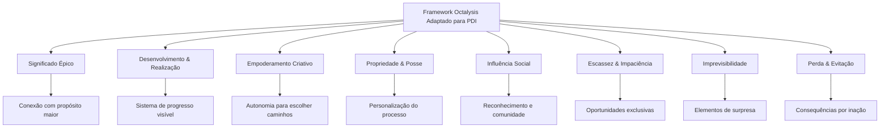

**Aplicação Prática para PDI:**

|Núcleo Motivacional|Implementação no PDI|Exemplo Concreto|
|---|---|---|
|**Significado Épico**|Conecte seu desenvolvimento a um propósito maior|"Minha jornada de desenvolvimento em liderança não é apenas sobre promoção, mas para impactar positivamente as 50 pessoas do meu time"|
|**Desenvolvimento & Realização**|Sistema visível de progressão com marcos claros|Mapa visual de habilidades com níveis específicos e "missões" para avançar|
|**Empoderamento Criativo**|Autonomia para personalizar abordagens|Menu de diferentes métodos para desenvolver cada competência, permitindo escolha|
|**Propriedade & Posse**|Criação de identidade de desenvolvimento|"Avatar profissional" com visualização de atributos que evoluem|
|**Influência Social**|Engajamento de comunidade no processo|Check-ins semanais com "guilda" de desenvolvimento e celebrações coletivas|
|**Escassez & Impaciência**|Oportunidades limitadas e desafios temporários|"Desafios especiais" mensais com benefícios exclusivos para completar|
|**Imprevisibilidade**|Elementos de descoberta e surpresa|"Baús de recompensa" aleatórios após completar certos marcos|
|**Perda & Evitação**|Consequências estruturadas por inação|Sistema de "vidas" ou "energia" que diminui sem ação consistente|

### Exemplo de Sistema Gamificado para Desenvolvimento de Habilidades de Comunicação:

**"A Jornada do Comunicador Magistral"**

1. **Mapa de Progresso Visível:**
    
    - Caminho visual com 5 níveis: Aprendiz → Praticante → Especialista → Mestre → Magistral
    - Cada nível com 3 "regiões" de habilidade: Comunicação Escrita, Verbal e Não-verbal
    - Marcos específicos em cada região (ex: "Dominador de Apresentações", "Mestre do Feedback")
2. **Sistema de Missões e Desafios:**
    
    - Missões principais: Projetos estruturados com critérios claros ("Lidere uma reunião de stakeholders complexa")
    - Missões secundárias: Pequenas práticas diárias ("Faça uma pergunta poderosa em cada conversa hoje")
    - Desafios especiais: Oportunidades temporárias de alto valor ("Apresentação para liderança sênior")
3. **Mecânicas de Feedback e Recompensa:**
    
    - XP (Pontos de Experiência): Acumulados por prática consistente
    - Distintivos: Reconhecimento por domínio de habilidades específicas
    - Desbloqueios: Acesso a novos recursos ou oportunidades
    - "Power-ups": Benefícios temporários (ex: mentoria especial por tempo limitado)
4. **Elementos Sociais:**
    
    - "Guilda de Comunicadores": Grupo de apoio com check-ins regulares
    - Tabuleiro de líderes: Reconhecimento (opcional) de progresso
    - Desafios em equipe: Colaboração para superar obstáculos complexos
    - Celebrações coletivas: Ritual para reconhecer marcos importantes

> "Transformei meu PDI de uma lista de verificação estática para uma jornada épica com desafios progressivos. A diferença foi extraordinária - de uma obrigação ocasional para uma prática que busco diariamente." - Elena Martins, gerente de produto que implementou princípios de gamificação em seu desenvolvimento

### 📖 Narrativa Pessoal: A Arte de Transformar Desenvolvimento em História

O poder das histórias em moldar nosso comportamento está profundamente enraizado na psicologia humana. Como destaca o psicólogo Dan McAdams em suas pesquisas sobre identidade narrativa: "Somos as histórias que contamos a nós mesmos sobre nós mesmos."

#### Técnicas de Storytelling Aplicadas ao Desenvolvimento

**1. A Jornada do Herói para PDI:**

Joseph Campbell identificou padrões universais em histórias míticas que ressoam profundamente. Esta estrutura pode ser adaptada para desenvolvimento profissional:

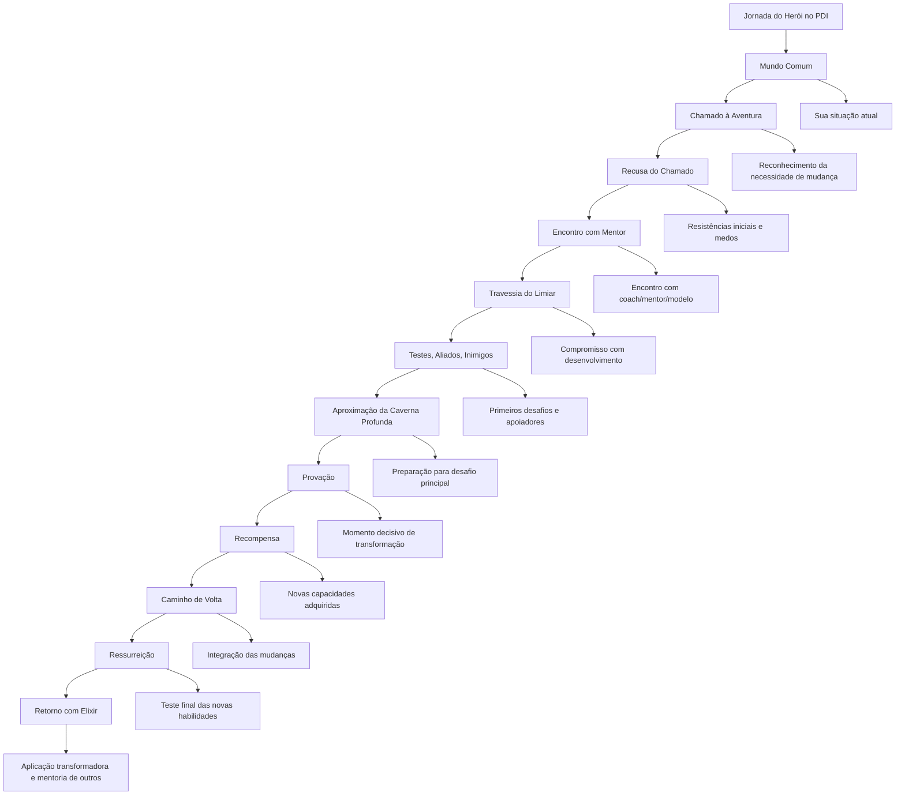

**Aplicação Prática:**

1. **Mapeie sua Jornada**: Identifique onde você está neste ciclo para cada área de desenvolvimento
2. **Nomeie os Elementos**: Determine quem são seus mentores, aliados, desafios
3. **Crie Marcos Narrativos**: Defina momentos significativos que representarão avanços
4. **Documente a História**: Mantenha um "diário de jornada" capturando sua evolução

**2. Criação de Identidade Narrativa Desenvolvimentista:**

A pesquisa de Dan McAdams mostra que as histórias que contamos sobre nós mesmos moldam profundamente nosso comportamento. Técnicas para criar uma identidade narrativa orientada ao desenvolvimento:

|Elemento Narrativo|Descrição|Implementação Prática|
|---|---|---|
|**Temas Recorrentes**|Padrões consistentes na história|Identificar valores centrais que motivam seu desenvolvimento|
|**Cenas Nucleares**|Momentos definidores de identidade|Documentar experiências transformadoras em sua jornada|
|**Personagens Imagináveis**|Versões futuras de si mesmo|Criar detalhes vívidos de "você daqui a 1-3-5 anos"|
|**Agência vs. Comunhão**|Balanço entre realização e conexão|Equilibrar objetivos de conquista com relações significativas|
|**Tom Narrativo**|Perspectiva emocional predominante|Cultivar tom de otimismo realista e crescimento|
|**Complexidade Integrativa**|Capacidade de unir elementos diversos|Conectar diferentes áreas de desenvolvimento em uma narrativa coerente|

**3. Técnicas de Storytelling Digital para PDI:**

Ferramentas modernas permitem documentar e compartilhar sua jornada de desenvolvimento de forma envolvente:

- **Timeline Visual**: Plataformas como Notion ou Miro para criar linhas do tempo visuais
- **Portfólio de Jornada**: Documentação multimídia de marcos e aprendizados
- **Micro-narrativas**: Posts ou vídeos curtos documentando insights específicos
- **Visualização de Dados Narrativa**: Gráficos que contam a história de seu progresso

### 🏆 Sistemas de Progressão e Recompensa Psicologicamente Ressonantes

Para criar sistemas de gamificação que mantenham engajamento de longo prazo, é essencial entender os princípios psicológicos subjacentes.

#### Princípios de Design Motivacional

**1. Curva de Dificuldade Otimizada:**

Baseada na teoria do flow de Mihaly Csikszentmihalyi e refinada para desenvolvimento profissional:

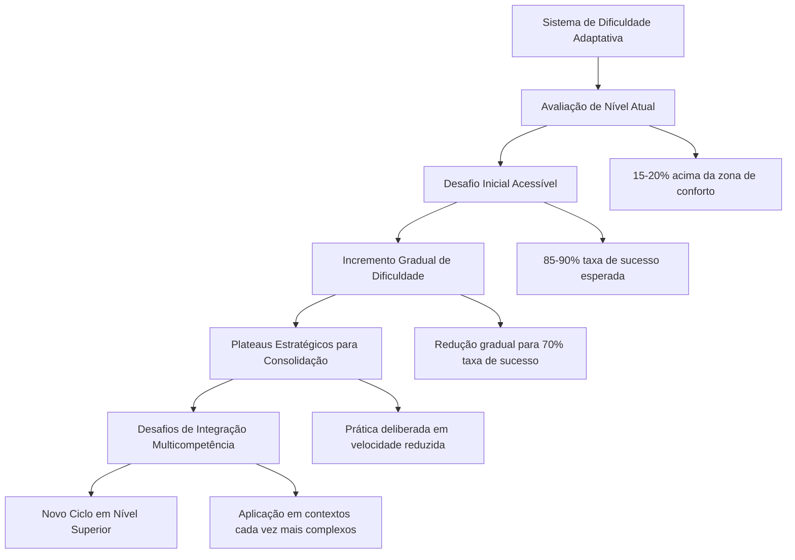

**2. Economia de Recompensas Multidimensional:**

Baseada na pesquisa de Richard Ryan e Edward Deci sobre motivação intrínseca e extrínseca:

|Tipo de Recompensa|Descrição|Exemplos para PDI|
|---|---|---|
|**Intrínseca Direta**|Satisfação inerente à atividade|Sensação de domínio ao aplicar nova habilidade|
|**Intrínseca Reflexiva**|Alinhamento com identidade e valores|Reconhecimento de crescimento pessoal significativo|
|**Extrínseca Funcional**|Benefícios tangíveis relacionados|Acesso a novos projetos ou responsabilidades|
|**Extrínseca Social**|Reconhecimento e status|Visibilidade positiva entre pares e liderança|
|**Extrínseca Material**|Recompensas concretas|Auto-premiações planejadas após conquistas específicas|

**3. Desbloqueios e Conquistas Significativas:**

|Tipo de Desbloqueio|Função Psicológica|Exemplo para PDI|
|---|---|---|
|**Acesso a Conteúdo**|Curiosidade e exploração|Mentoria especializada disponível apenas após certo nível|
|**Expansão de Capacidade**|Sensação de crescimento|Possibilidade de liderar projeto específico|
|**Personalização**|Expressão de identidade|Criação de metodologia própria após domínio de fundamentos|
|**Influência Expandida**|Impacto e significado|Oportunidade de desenvolver outros após maestria|

---

## 📊 PDI Baseado em Dados: Abordagem Analítica

### Introdução: A Revolução dos Dados no Desenvolvimento Profissional

Estamos vivendo a era dos dados. Como observa Thomas Davenport em "Competing on Analytics": "O que não pode ser medido, não pode ser gerenciado – e o que não está sendo gerenciado ativamente, raramente melhora." Esta máxima, embora tradicionalmente aplicada a negócios, é igualmente poderosa quando aplicada ao desenvolvimento profissional.

A maioria dos PDIs tradicionais baseia-se em impressões subjetivas, avaliações qualitativas e intuição. Embora esses elementos tenham seu valor, a ausência de uma abordagem baseada em dados frequentemente resulta em:

- Foco em áreas de desenvolvimento com baixo impacto real
- Progresso inconsistente e difícil de verificar
- Decisões baseadas em vieses e percepções limitadas
- Dificuldade em ajustar estratégias de forma ágil

PDIs baseados em dados transformam desenvolvimento profissional de arte abstrata em ciência aplicada, permitindo decisões mais precisas, ajustes mais rápidos e resultados verificáveis.

### 🔍 Diagnóstico Quantitativo: Além da Intuição

#### Baseline Multidimensional: Medindo o Ponto de Partida

Um PDI efetivamente orientado por dados começa com um diagnóstico abrangente e quantificável:

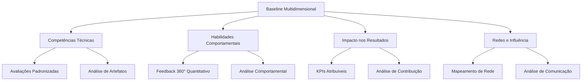

**Métodos Avançados de Coleta de Dados:**

|Dimensão|Métodos Tradicionais|Abordagens Avançadas|
|---|---|---|
|**Competências Técnicas**|Autoavaliação, feedback do gestor|Avaliações cegas por pares, análise de código/documentos, testes padronizados específicos da indústria|
|**Habilidades Comportamentais**|Feedback informal, impressões|Análise comportamental baseada em linguística, feedback 360° estruturado com métricas comparativas|
|**Impacto nos Resultados**|Avaliações anuais, objetivos gerais|KPIs específicos vinculados a contribuições individuais, análise de atribuição|
|**Redes e Influência**|Percepção subjetiva|Análise de redes organizacionais (ONA), métricas de comunicação e colaboração|

**Caso Prático: Diagnóstico Aprimorado da Microsoft**

A Microsoft desenvolveu uma abordagem chamada "Performance Fingerprint" que combina:

- Análise de padrões de comunicação via metadados (sem violar privacidade)
- Métricas de contribuição em repositórios e ferramentas colaborativas
- Avaliações técnicas estruturadas com múltiplos avaliadores cegos
- Dados de impacto em resultados com ajustes para fatores externos

Este diagnóstico multidimensional revelou que engenheiros anteriormente classificados similarmente através de métodos tradicionais apresentavam perfis de competência e impacto radicalmente diferentes quando analisados com ferramentas mais precisas.

### Framework IMPACT para Métricas de Desenvolvimento

Um desafio comum em PDIs é a definição de métricas que sejam simultaneamente relevantes, mensuráveis e acionáveis. O framework IMPACT oferece uma estrutura:

|Dimensão|Descrição|Exemplos de Métricas|
|---|---|---|
|**I**ndicadores Diretos|Métricas que medem diretamente a competência|Avaliações padronizadas, certificações, tempo para completar tarefas específicas|
|**M**étricas de Aplicação|Como a competência é utilizada em contexto real|Frequência de aplicação, qualidade de implementação, adaptabilidade contextual|
|**P**ercepções Quantificadas|Feedback estruturado de stakeholders|Scores de avaliação 360°, NPS de colaboração, avaliações cegas por pares|
|**A**tributos Comportamentais|Comportamentos observáveis associados|Frequência de comportamentos específicos, análise de padrões de comunicação|
|**C**ontribuições Mensuráveis|Impacto em resultados tangíveis|KPIs de negócio influenciados, tempo economizado, qualidade aprimorada|
|**T**endências ao Longo do Tempo|Evolução em períodos definidos|Taxa de melhoria, consistência de aplicação, adaptação a novos contextos|

### 🔄 Experimentação e Desenvolvimento Iterativo

#### Design Thinking Aplicado ao PDI: Ciclos Rápidos de Melhoria

A abordagem de Design Thinking, popularizada pela IDEO e Stanford d.school, pode ser adaptada para desenvolvimento profissional baseado em dados:

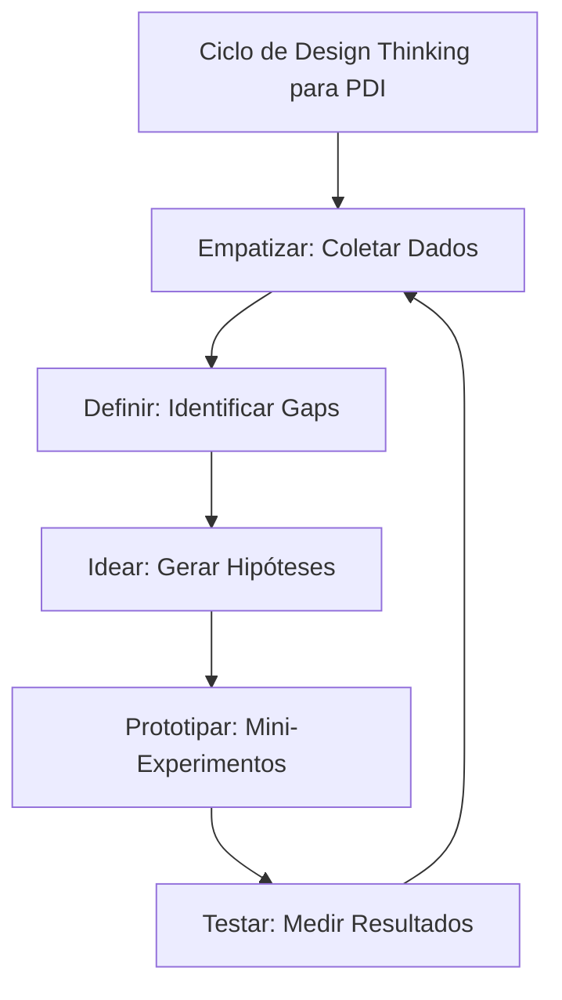

**Metodologia Experimental para Desenvolvimento:**

1. **Formulação de Hipóteses**:
    
    - "Se eu desenvolver competência X, então verei melhoria Y em contexto Z"
    - Hipóteses específicas, testáveis e temporalmente definidas
    - Definição clara de critérios de sucesso/falha
2. **Design de Experimentos Controlados**:
    
    - Intervenções claramente definidas
    - Variáveis controladas quando possível
    - Períodos específicos de teste
3. **Mensuração Rigorosa**:
    
    - Dados pré e pós-intervenção
    - Múltiplas métricas relevantes
    - Controles para validar causas vs. correlações
4. **Análise e Iteração**:
    
    - Avaliação objetiva de resultados
    - Decisões baseadas em dados, não em preferências
    - Refinamento contínuo de hipóteses

**Exemplo Prático: Experimentação em Comunicação Executiva**

> Natasha, diretora financeira, queria melhorar sua comunicação com equipes técnicas. Em vez de abordagem tradicional:
> 
> 1. Formulou hipótese: "Se eu incorporar 2-3 analogias visuais em apresentações técnicas, então aumentarei em 25% a compreensão e retenção de informações financeiras complexas pelas equipes de produto."
>     
> 2. Desenhou experimento: Alternou entre apresentações com e sem analogias visuais durante 2 meses, mantendo outros elementos constantes.
>     
> 3. Mediu resultados: Quiz rápido pós-reunião sobre pontos-chave, tempo e qualidade de perguntas, pesquisa de compreensão percebida.
>     
> 4. Analisou dados: Descobriu que analogias melhoraram compreensão em 32% para conceitos complexos, mas não tiveram impacto significativo em informações mais básicas. Iterou focando analogias apenas em conceitos mais complexos.
>     

### 📱 Tecnologias e Ferramentas para PDI Orientado por Dados

#### Stack Tecnológico Integrado

Um ecossistema tecnológico eficaz para PDI baseado em dados combina várias camadas:

```mermaid
graph TD
    A[Stack Tecnológico para PDI] --> B[Camada de Coleta]
    A --> C[Camada de Armazenamento]
    A --> D[Camada de Análise]
    A --> E[Camada de Visualização]
    
    B --> F[Tracking automático + Input manual]
    C --> G[Repositório centralizado]
    D --> H[Processamento e correlações]
    E --> I[Dashboards e relatórios]
```

**Ferramentas Recomendadas por Categoria:**

|Categoria|Propósito|Ferramentas|
|---|---|---|
|**Coleta Automatizada**|Captura passiva de dados comportamentais|RescueTime, Toggl, Microsoft Workplace Analytics|
|**Coleta Estruturada**|Entrada consistente de dados manuais|Typeform, Google Forms, aplicativos de tracking especializado|
|**Armazenamento**|Repositório centralizado de dados|Notion, Airtable, Postgres para soluções mais avançadas|
|**Análise**|Processamento e identificação de padrões|Python (pandas, numpy), Tableau, Power BI|
|**Visualização**|Representação clara e acionável|Dashboards em Notion, Databox, Google Data Studio|

### Inteligência Artificial como Parceira de Desenvolvimento

IA e aprendizado de máquina oferecem possibilidades transformadoras para PDI baseado em dados:

1. **Análise Preditiva**:
    
    - Identificação de padrões não óbvios em dados de desenvolvimento
    - Previsão de áreas potenciais de estagnação
    - Recomendação de intervenções baseadas em padrões de sucesso histórico
2. **Análise de Linguagem Natural**:
    
    - Processamento automatizado de feedback qualitativo
    - Identificação de temas e padrões em comunicações
    - Análise de evolução em documentos produzidos
3. **Sistemas de Recomendação**:
    
    - Sugestão personalizada de recursos de desenvolvimento
    - Identificação de conexões relevantes para mentoria
    - Recomendação de oportunidades alinhadas com objetivos
4. **Assistentes de Desenvolvimento**:
    
    - Check-ins conversacionais para coleta de dados
    - Lembretes contextuais baseados em padrões
    - Síntese de insights a partir de múltiplas fontes

---

## 💻 PDI na Era Digital: Ferramentas e Recursos

### Ecossistema Digital para Desenvolvimento Profissional

O avanço tecnológico democratizou o acesso a ferramentas poderosas para apoiar cada fase do PDI:

#### 🧰 Stack Tecnológico para PDI Integrado

```mermaid
graph TD
    A[Stack de PDI] --> B[Planejamento Estratégico]
    A --> C[Desenvolvimento de Competências]
    A --> D[Acompanhamento e Análise]
    A --> E[Feedback e Colaboração]
    
    B --> F[Notion/Miro para mapeamento]
    C --> G[Plataformas de aprendizado]
    D --> H[Apps de tracking e hábitos]
    E --> I[Ferramentas de feedback]
```

**Recomendações de Ferramentas por Categoria:**

|Categoria|Ferramentas Recomendadas|Aplicação no PDI|
|---|---|---|
|**Planejamento**|• Notion<br>• Miro<br>• Trello/Asana|Estruturação visual do plano, OKRs de desenvolvimento|
|**Aprendizado**|• LinkedIn Learning<br>• Coursera<br>• Mentorly|Desenvolvimento estruturado de competências técnicas e comportamentais|
|**Hábitos e Tracking**|• Habitica<br>• Loop Habit Tracker<br>• Todoist|Consistência em práticas diárias de desenvolvimento|
|**Reflexão e Documentação**|• Day One<br>• Roam Research<br>• Evernote|Diários de aprendizado e conexão de insights|
|**Feedback**|• 15Five<br>• Matter<br>• Culture Amp|Captura sistemática de perspectivas externas|

#### 🤖 IA como Parceira de Desenvolvimento

Inteligência artificial oferece novas possibilidades para potencializar seu PDI:

|Aplicação de IA|Descrição|Exemplos de Uso|
|---|---|---|
|**Assistentes de Reflexão**|IAs que facilitam processos reflexivos estruturados|Sessões de debriefing após experiências importantes|
|**Curadoria de Conteúdo**|Sistemas que personalizam recursos de aprendizado|Recomendações adaptativas baseadas em objetivos|
|**Análise de Padrões**|Identificação de tendências em comportamentos e resultados|Insights sobre eficácia de diferentes abordagens|
|**Simulação de Cenários**|Ambientes virtuais para prática segura|Treinamento de conversas difíceis ou apresentações|

### Integração Tecnológica Humanizada

Em meio a tantas possibilidades tecnológicas, mantenha princípios fundamentais:

1. **Foco no propósito, não nas ferramentas**: Tecnologia como meio, não como fim
2. **Simplicidade sustentável**: Prefira sistemas que você manterá consistentemente
3. **Conexão humana**: Complemente, não substitua interações pessoais significativas
4. **Experimentação iterativa**: Teste novas abordagens em ciclos curtos de aprendizado

> "A tecnologia é mais valiosa quando amplifica nossas capacidades humanas fundamentais. No contexto do PDI, as melhores ferramentas são aquelas que nos ajudam a pensar com mais clareza, agir com mais intencionalidade e aprender com mais profundidade."

---

## 📚 Casos de Sucesso: Histórias Inspiradoras

### Transformações Reais Através de PDIs Eficazes

#### 📊 Caso 1: A Jornada de Liderança de Ana

**Contexto Inicial:** Ana, uma especialista técnica excepcional, foi promovida a líder de equipe, mas enfrentava desafios significativos na transição de contribuidora individual para gestora de pessoas.

**Abordagem de PDI:** Ana implementou um plano focado em três pilares: comunicação empática, feedback eficaz e delegação estratégica.

**Elementos-chave do PDI:**

- Mentoria quinzenal com líder sênior
- Curso formal de liderança com prática supervisionada
- "Laboratório de liderança": experimentação de técnicas em projetos controlados
- Feedback 360° trimestral para ajustes de abordagem

**Resultados em 12 meses:**

- Aumento de 40% no engajamento da equipe
- Redução de 25% em retrabalho através de delegação mais eficaz
- Promoção para posição de gerência sênior
- Desenvolvimento de framework interno de transição para liderança

**Lições aprendidas:**

> "Meu maior aprendizado foi entender que liderança eficaz não se trata de ter todas as respostas, mas de fazer as perguntas certas e criar um ambiente onde a equipe possa prosperar. O PDI me forneceu estrutura para transformar essa compreensão em práticas diárias concretas." - Ana

