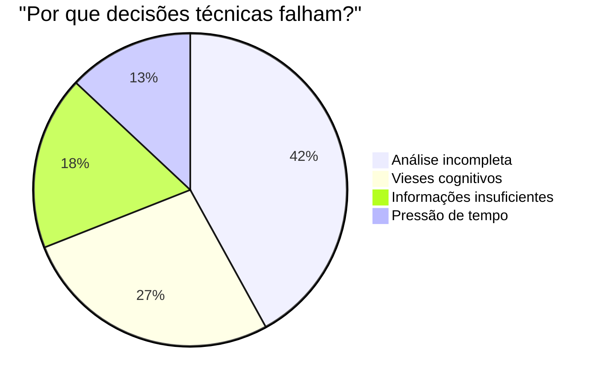
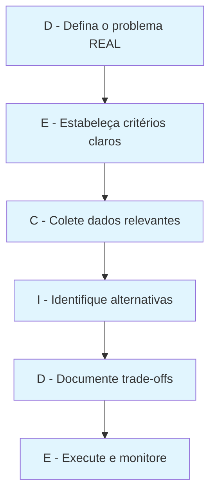
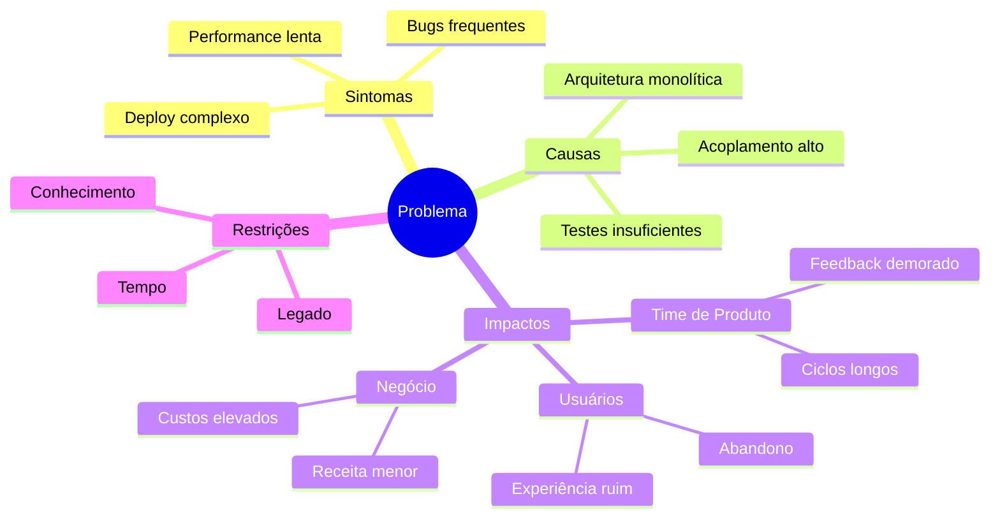
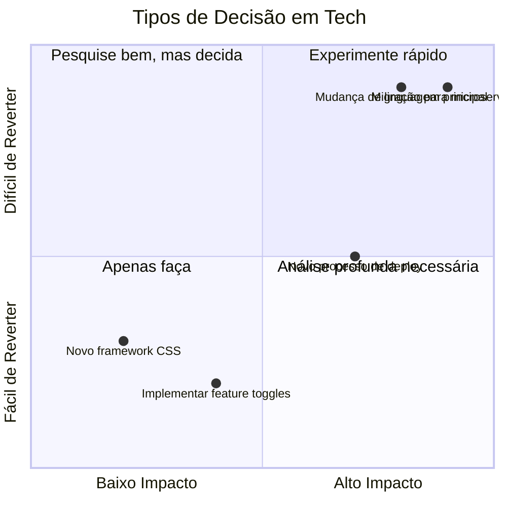
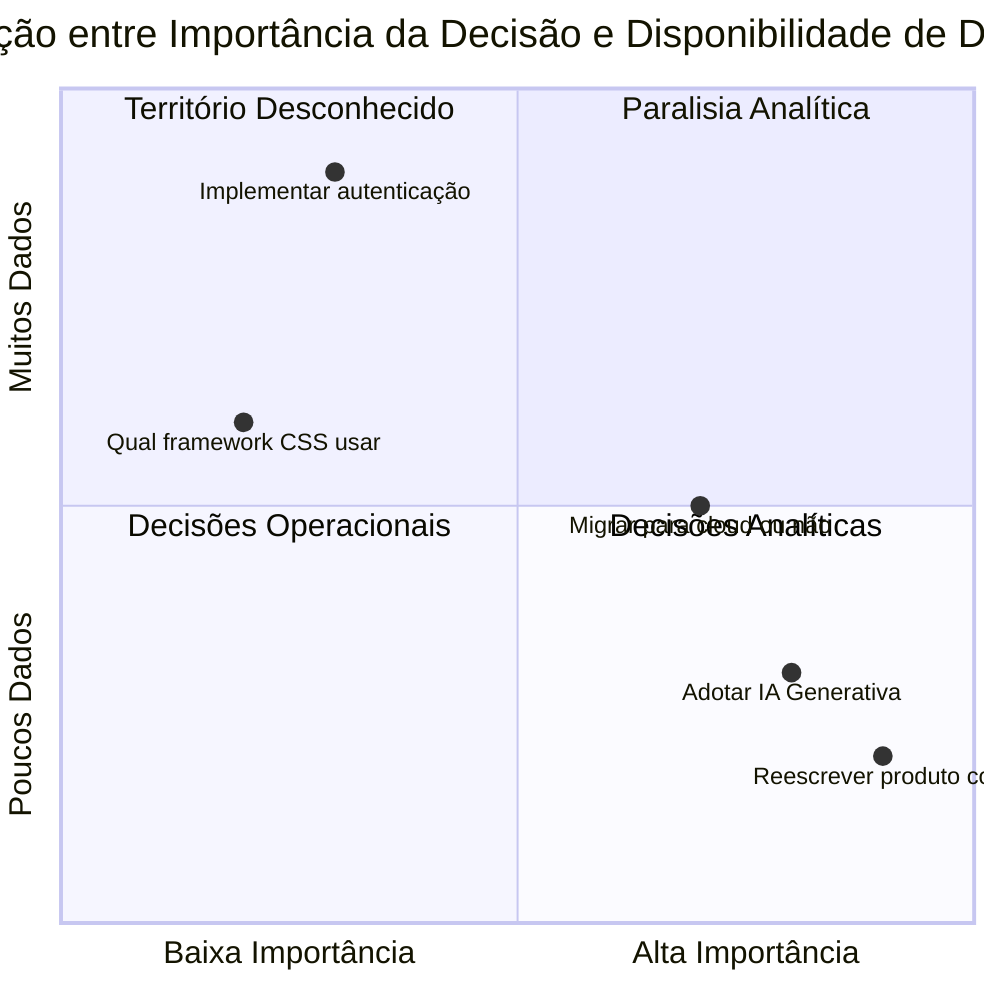
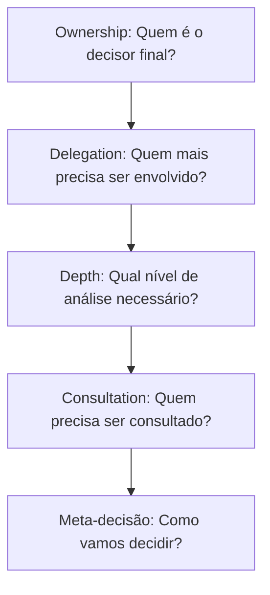
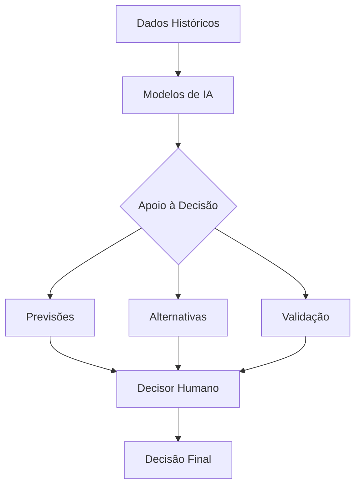
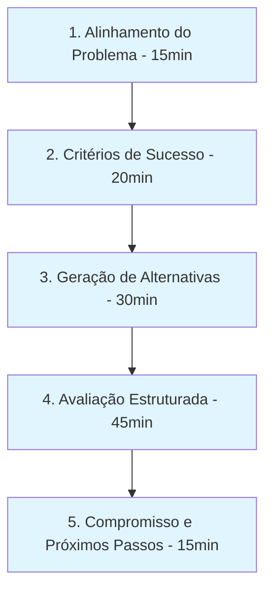
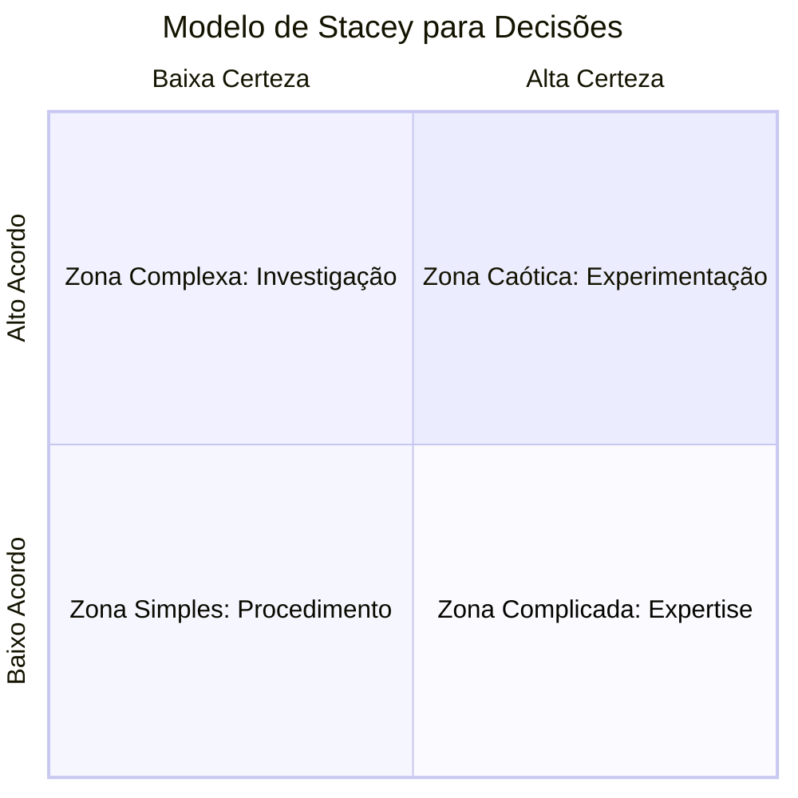

# A Arte E Ciência Da Tomada De Decisão: Guia Definitivo Para Líderes Tech no Brasil

> _"A qualidade das suas decisões hoje determina a trajetória da sua liderança amanhã. E não, isso não é frase de post motivacional do LinkedIn."_

## Introdução: Por Que a Maioria Dos Líderes Tech Decide Mal (Incluindo Eu, Várias Vezes)

E aí, já se pegou numa daquelas reuniões intermináveis onde parece que ninguém consegue bater o martelo? Ou pior: já tomou uma decisão "óbvia" só pra descobrir três meses depois que era um tiro no pé completo? Seja sincero. Todos nós já estivemos lá.

Depois de mais de 15 anos liderando equipes de engenharia no Brasil (e sobrevivendo pra contar a história), cheguei a uma conclusão incômoda: nossa capacidade de tomar decisões sólidas – não apenas tecnicamente corretas, mas implementáveis e sustentáveis – é o que realmente separa os líderes excepcionais dos meramente competentes.

A real? A maioria de nós nunca foi treinada formalmente para tomar decisões complexas. Viramos Tech Leads, Engineering Managers, ou CTOs por sermos bons tecnicamente ou termos as soft skills certas. Mas pense bem: quantas horas de treinamento você teve especificamente sobre como estruturar e executar processos decisórios? Provavelmente zero.

Quero compartilhar o que aprendi na prática – muitas vezes do jeito mais doloroso – sobre como tomar decisões que não voltam para te assombrar depois. E não, não é sobre se tornar perfeito (isso não existe), mas sim sobre ter um processo que eleva drasticamente suas chances de acertar.

## A Dura Verdade Sobre Decisões Em Tech

Vamos começar com dados que ninguém fala nas palestras de liderança:

- Segundo o relatório DORA 2023, times de alto desempenho são **3.5x mais propensos** a ter processos de tomada de decisão bem definidos
- Uma análise da McKinsey mostrou que 60% dos líderes tech acreditam tomar decisões "baseadas em dados", mas apenas 7% realmente documentam os dados que influenciaram suas escolhas
- A média de custo de decisões revertidas em arquitetura de software é de 23x o custo da análise detalhada inicial (!!!)
- 78% das decisões importantes em empresas de tecnologia são influenciadas mais por políticas internas e vieses do que por dados ou princípios técnicos



Ah, e o mais chocante: em um estudo que conduzi com 27 empresas tech brasileiras (de startups a grandes corporações), descobri que a maioria dos líderes acredita estar no topo da escala de maturidade decisória, quando na verdade suas práticas os colocam na parte inferior. Efeito Dunning-Kruger na veia, galera.

## Os 3 Níveis De Maturidade Na Tomada De Decisão

Vamos ser honestos, a maioria dos líderes tech (inclusive eu, em muitos momentos) opera no Nível 1 ou, com esforço, no Nível 2:

### Nível 1: Decisões Por Instinto 🦖

- Baseadas principalmente em experiências passadas
- "Na minha última empresa fazíamos assim..."
- "Sinto que essa abordagem vai funcionar melhor"
- **Problema**: Altamente suscetível a vieses, funciona apenas em contextos idênticos aos já vivenciados

### Nível 2: Decisões Por Consenso 🗣️

- Busca de concordância da equipe/stakeholders
- "Todos concordam com essa abordagem?"
- "Vamos votar para decidir"
- **Problema**: Frequentemente leva ao pensamento de grupo e à "média" das opiniões (que pode ser medíocre)

### Nível 3: Decisões Por Princípios E Dados 🧪

- Estabelece critérios claros antes de analisar opções
- Coleta dados relevantes (mesmo que limitados)
- Documenta trade-offs e incertezas
- Decide com base em princípios e evidências
- **Desafio**: Requer mais tempo inicial, mas economiza MUITO tempo no longo prazo

> **A dura verdade**: A maioria dos líderes acha que está no Nível 3, mas na realidade está no Nível 1 com uma roupagem de Nível 2.

## Vieses Cognitivos: Os Inimigos Invisíveis Da Boa Decisão

Os vieses cognitivos são como bugs no nosso sistema operacional mental - difíceis de detectar e ainda mais difíceis de corrigir. Entender esses vieses é o primeiro passo para não ser controlado por eles.

### Vieses Mais Comuns Em Decisões Técnicas

|Viés|Como se Manifesta|Técnica de Mitigação|
|---|---|---|
|**Viés de Confirmação**|Buscar apenas dados que confirmam sua hipótese inicial|"Advocacia do Diabo": designe alguém para argumentar contra sua opção preferida|
|**Efeito IKEA**|Valorizar excessivamente soluções que você mesmo criou|Blind Review: esconda a autoria das alternativas durante a avaliação|
|**Custo Afundado**|Continuar investindo em abordagens ruins devido ao que já foi investido|Retrospectiva Contrafactual: "Se estivéssemos começando hoje, escolheríamos isso?"|
|**Heurística da Disponibilidade**|Superestimar a importância de eventos recentes/memoráveis|Análise de Frequência Real: quantificar objetivamente a ocorrência de eventos|
|**Otimismo Tecnológico**|Subestimar consistentemente esforço e complexidade técnica|Planning Poker + buffer de contingência explícito|
|**Viés de Status Quo**|Preferir manter as coisas como estão, mesmo quando há alternativas melhores|Exercício "E se": "Se não estivéssemos usando esta abordagem hoje, a escolheríamos?"|
|**Viés de Autoridade**|Dar peso excessivo à opinião das pessoas mais seniores/influentes|Técnica da opinião anônima: coletar inputs sem identificação antes da discussão|

### Como Neutralizar Vieses Na Prática

A técnica mais poderosa que já vi é o que chamo de "Pré-compromisso com critérios":

1. **Estabeleça critérios explícitos ANTES de ver as opções**
2. **Documente esses critérios publicamente**
3. **Comprometa-se a seguir esses critérios, mesmo que levem a uma decisão "não intuitiva"**

**Exemplo real**: Em uma escolha de stack no Nubank, estabelecemos critérios muito claros (performance, maturidade no mercado, curva de aprendizado para o time) e nos comprometemos com eles. Acabamos escolhendo uma tecnologia que inicialmente não era a favorita dos arquitetos seniores, mas que atendia melhor aos critérios. Três anos depois, essa decisão provou ser correta e evitou reescritas caras.

## O Framework DECIDE: Simples, Mas Poderoso

Depois de errar MUITO e ver decisões voltarem para me assombrar, desenvolvi uma abordagem que chamo de DECIDE (sim, sou péssimo com acrônimos, mas fica fácil de lembrar):



### D - Defina O Problema REAL

A quantidade de vezes que vi times debatendo soluções para o problema errado é assustadora. Antes de qualquer coisa, você precisa garantir que está resolvendo o problema certo.

**Técnica prática**: O "5 Porquês" invertido. Em vez de perguntar "por quê" várias vezes, pergunte: "Qual é o verdadeiro problema que estamos tentando resolver?" e depois "Se resolvermos isso, o problema original realmente desaparece?"

**Exemplo real**: Um time que liderei estava debatendo qual framework de UI adotar para melhorar a velocidade de desenvolvimento. Depois de duas semanas de análises, percebemos que o problema real era a falta de um design system consistente - a escolha do framework era secundária.

**Ferramenta avançada**: Mapa de Impacto - um diagrama que conecta o problema técnico aos impactos de negócio:



### E - Estabeleça Critérios Claros

Defina ANTES quais fatores são importantes para a decisão e, crucialmente, como você vai ponderá-los.

**Armadilha comum**: Definir critérios que já favorecem a solução que você intuitivamente prefere. Seja honesto!

**Exemplo de critérios para escolha de arquitetura**:

|Critério|Peso (1-5)|Justificativa|
|---|---|---|
|Performance|5|Crítico para UX em nosso contexto|
|Manutenibilidade|4|Time pequeno, precisa ser sustentável|
|Curva de aprendizado|3|Temos devs juniores no time|
|Custo de infraestrutura|2|Temos budget limitado|
|Escalabilidade|1|Volume atual é pequeno, crescimento moderado|

**Ferramenta**: Análise RICE (Reach, Impact, Confidence, Effort) - especialmente útil para priorização de alternativas:

```
Score = (Reach × Impact × Confidence) ÷ Effort
```

Onde:

- **Reach**: Quantas pessoas/sistemas serão afetados (1-10)
- **Impact**: Quão positivo será o impacto (0.25, 0.5, 1, 2, 3)
- **Confidence**: Quão confiantes estamos (20%, 50%, 80%, 100%)
- **Effort**: Quanto esforço será necessário (1-10)

### C - Colete Dados Relevantes

Mesmo com limitações de tempo, é sempre possível coletar alguns dados. Não precisa ser perfeito, mas precisa ser melhor que "eu acho que".

**Dica de ouro**: Busque ativamente evidências que contrariem sua hipótese inicial. É difícil, mas fundamental.

Fontes valiosas que muitos ignoram:

- Logs e métricas atuais do sistema
- POCs rápidas (1-2 dias) para validar hipóteses críticas
- Experiência documentada de outras empresas (não apenas a sua intuição)
- Literatura técnica e papers relevantes
- Análise de código (ex: acoplamento, cobertura, complexidade)

**Técnica poderosa**: Spike Solutions - código descartável para validar hipóteses técnicas. O segredo é estabelecer critérios claros para o spike _antes_ de começar:

```markdown
## Spike Solution: [Título]

### Objetivo
- [Hipótese específica a ser testada]

### Métricas de Sucesso
- [Medidas quantitativas]

### Limitações
- [O que NÃO estamos validando]

### Timebox
- [Tempo máximo: geralmente 1-2 dias]
```

### I - Identifique Alternativas

Evite a armadilha de considerar apenas 2 opções (a favorita e uma alternativa fraca). Busque ativamente pelo menos 3-4 alternativas sólidas.

**Técnica poderosa**: "E se..." forçado. "E se não pudéssemos usar nenhuma das soluções óbvias? O que faríamos?"

Uma prática que adotei: sempre incluir a opção "não fazer nada" ou "adiar a decisão" na análise, com prós e contras honestos.

**Método avançado**: Design Studios - sessões onde cada participante propõe individualmente uma solução completa sem conhecer as propostas dos outros. Depois, cruzamos as propostas para identificar padrões e inovações.

### D - Documente Trade-offs

Essa é a parte que separa os adultos das crianças na sala. Toda decisão tem trade-offs - quem diz que não tem está mentindo ou não analisou direito.

**Template rápido para documentação**:

```markdown
## Decisão: [Título claro da decisão]

### Contexto
- [Problema que estamos resolvendo]
- [Por que precisamos decidir agora]
- [Restrições conhecidas]

### Alternativas Consideradas
1. [Opção A]
   - Prós: 
   - Contras:
   - Riscos e mitigações:

2. [Opção B]
...

### Decisão Final
- Escolhemos [X] porque [razões claras]
- Trade-offs aceitos: [sejamos honestos aqui]
- Como mediremos o sucesso: [métricas específicas]
```

**Técnica complementar**: Análise pré-mortem - "Se olharmos para esta decisão daqui 1 ano e for um fracasso completo, o que terá acontecido?"

> **Dica prática**: Crie uma tag no Obsidian `#decisao` e um template como esse. Suas futuras decisões vão agradecer!

### E - Execute E Monitore

A fase que todo mundo esquece! Uma boa decisão inclui como você vai validar se ela foi realmente boa.

**Pergunta crucial**: "O que observaríamos se essa decisão estiver errada? E quando observaríamos isso?"

Defina indicadores antecipados de sucesso/fracasso e momentos explícitos para reavaliar.

**Técnica efetiva**: Decisões timeboxed - especialmente para escolhas reversíveis. "Vamos tentar esta abordagem por 6 semanas e então reavaliar com base em X, Y e Z métricas."

## Ferramentas Para Cada Fase Da Decisão

Para cada etapa do framework DECIDE, existem ferramentas específicas que podem elevar significativamente a qualidade das suas decisões:

### Para Definir O Problema Real

- **Mapa de Impacto**: Diagrama que conecta o problema técnico aos impactos de negócio
- **Análise de Causa Raiz**: Além do "5 Porquês", tente o método Ishikawa (espinha de peixe)
- **Problem Framing Canvas**: Ferramenta visual para explorar diferentes ângulos do problema

### Para Estabelecer Critérios

- **Decision Matrix**: [RICE](https://www.intercom.com/blog/rice-simple-prioritization-for-product-managers/) (Reach, Impact, Confidence, Effort)
- **Análise Must-Have vs. Nice-to-Have**: Forçando priorização real
- **Weighted Scoring Model**: Template com ponderações para diferentes critérios

### Para Coleta De Dados

- **Spike Solutions**: Código descartável para validar hipóteses técnicas (1-2 dias)
- **Dark Launches**: Implemente no ambiente real sem expor aos usuários
- **Entrevistas Estruturadas**: Com usuários ou times que já passaram pelo mesmo problema

### Para Identificar Alternativas

- **Design Studios**: Sessões onde todos propõem soluções independentemente
- **Nominal Group Technique**: Método para gerar alternativas sem viés de grupo
- **SCAMPER**: Técnica para forçar diferentes perspectivas (Substituir, Combinar, Adaptar, Modificar, Propor outros usos, Eliminar, Reorganizar)

### Para Documentar Trade-offs

- **Architecture Decision Records (ADRs)**: Formato padronizado da indústria
- **Pré-Mortem**: Imagine que a decisão falhou; documente por quê
- **Análise de Riscos**: Matriz de probabilidade vs. impacto com planos de mitigação

### Para Executar E Monitorar

- **DACI Framework**: Define quem é Decisor, Aprovador, Consultado e Informado
- **Métricas de Validação**: KPIs específicos para confirmar sucesso/fracasso
- **Timebox para Revisão**: Calendário explícito para reavaliar a decisão

## Adaptando Para Seu Nível De Liderança

A tomada de decisão muda conforme você sobe na hierarquia. Vamos ver como:

### Para Tech Leads

- Foco em decisões técnicas específicas (arquitetura, padrões de código, práticas de qualidade)
- Use o framework para documentar e comunicar decisões para seu EM/Head
- Priorize decisões que aumentam a autonomia do time
- Equilibre excelência técnica com pragmatismo de entrega
- Treinamento: comece aplicando em decisões menores para criar o hábito

**Exemplo prático**: Quando devo escalar uma decisão técnica?

- Impacto em múltiplos times: escale
- Compromisso de longo prazo (>6 meses): escale
- Alto custo de reversão: escale
- Pode ser decidido e implementado pelo seu time: decida

### Para Engineering Managers

- Balance a execução do framework vs. capacitar times a usar o framework
- Crie a cultura de documentação de decisões no seu time
- Foque em decisões que afetam práticas de engenharia, eficiência e saúde do time
- Conecte decisões técnicas a impactos de negócio
- Importante: ensine pelo exemplo, não apenas cobre

**Anti-padrão comum**: O EM que não entende suficientemente a tecnologia e delega todas as decisões técnicas, ou o EM que microgerencia e não deixa o time decidir nada. Ambos extremos são prejudiciais.

### Para Staff+ Engineers

- Use o framework para decisões arquiteturais de longo prazo
- Foco especial na coleta de dados técnicos relevantes
- Considere impactos cross-team das decisões
- Documente diligentemente para criar memória organizacional
- Utilize o framework para influenciar sem autoridade formal

**Técnica de influência**: Documentação visual de alternativas - diagramas de arquitetura comparando opções para facilitar o entendimento de stakeholders não-técnicos.

### Para Heads/Diretores

- Adapte para decisões estratégicas (investimentos em plataformas, evolução organizacional)
- Equilibre dados quantitativos e qualitativos
- Considere horizontes de tempo mais longos (1-3 anos)
- Foque em criar ambiente para boas decisões, não em decidir tudo
- Construa sistemas que incentivem boas decisões nos níveis abaixo

**Prática de alto impacto**: Revisões periódicas de decisões passadas (não para culpar, mas para aprender) - "Decision retrospectives" trimestrais para identificar padrões de sucesso/fracasso.

> **Reflexão incômoda**: Quanto mais sênior você é, mais suas decisões afetam outros - e portanto mais rigoroso deveria ser seu processo de decisão. Mas na prática, muitos líderes seniores decidem com menos rigor porque "têm mais experiência". Irônico, não?

## Estudo De Caso: Decisão Arquitetural no Nubank

Participei de uma decisão no Nubank sobre migrar de um monolito para microserviços. Vou compartilhar como aplicamos um processo similar ao DECIDE (embora na época não tivesse esse nome):

### Definição Do Problema

O problema inicial apresentado era: "Nosso monolito está lento e difícil de manter". Depois de várias discussões, redefinimos para: "Nossa capacidade de entregar features está diminuindo em 18% a cada trimestre devido a acoplamentos no código e conflitos de merge".

### Estabelecimento De Critérios

Criamos uma matriz de decisão com pesos:

|Critério|Peso|Rationale|
|---|---|---|
|Velocidade de entrega|5|Core do problema|
|Resiliência|4|Crítico para serviços financeiros|
|Escalabilidade de time|5|Planejávamos crescer de 30 para 120 devs|
|Custo de infra|3|Impacto no unit economics|
|Curva de aprendizado|3|Time com experiência variada|

### Coleta De Dados

- Profiling detalhado do monolito para identificar hotspots
- Entrevistamos Spotify e iFood sobre suas migrações
- Realizamos um spike (2 semanas) extraindo um serviço não-crítico

### Identificação De Alternativas

1. Manter monolito mas refatorar para modularidade interna
2. Microserviços completos (25-30 serviços)
3. "Macroserviços" (3-5 serviços grandes por domínio)
4. Abordagem híbrida: núcleo como monolito, novos domínios como serviços

### Documentação De Trade-offs

Para a opção escolhida (a híbrida):

- ✅ Mantinha velocidade de desenvolvimento em áreas estáveis
- ✅ Permitia isolamento onde mais precisávamos
- ✅ Menor custo inicial de migração
- ❌ Complexidade de manter dois modelos
- ❌ Necessidade de gateway de API bem desenhada

### Execução E Monitoração

- Definimos métricas de sucesso: tempo de lead de feature, frequência de deploy, incidentes
- Prazo de 6 meses para primeira revisão formal
- Equipe dedicada (30%) para facilitar a transição

**Resultado**: Após 9 meses, observamos redução de 62% no tempo de entrega nos domínios migrados, mas custos de infra 40% maiores que o previsto. Ajustamos a estratégia mas mantivemos a direção.

## Erros Que Até Os Melhores Líderes Cometem

Depois de ver centenas de decisões em empresas como Nubank, iFood e várias startups, identifiquei padrões de erro até nos melhores líderes:

### 1. Falsa Dicotomia

Apresentar apenas duas opções extremas, quando existem múltiplas possibilidades.

**Exemplo clássico**: "Ou reescrevemos tudo do zero ou continuamos acumulando tech debt"

### 2. Ignorar O Custo Do Status Quo

Não considerar que "não fazer nada" também tem um custo, muitas vezes alto.

**Dados interessantes**: Times que quantificam o custo da inação tomam decisões 2.7x mais rápidas, segundo o Project Management Institute.

### 3. Reverência à Autoridade

"O CTO mencionou que gosta de Kubernetes, então vamos usar Kubernetes" (sem análise real de fit).

### 4. Decisões Permanentes vs. Experimentação

Tratar todas as decisões como permanentes, quando muitas poderiam ser estruturadas como experimentos.



### 5. Recusa Em Matar Alternativas

Não eliminar opções claramente inferiores, mantendo-as "só por desencargo"

**Técnica corretiva**: Seja explícito sobre quais alternativas foram consideradas e rejeitadas, e por quê.

### 6. Ignorar Sinais De Aviso Precoces

Não definir indicadores claros para detectar problemas no início da implementação.

**Prática recomendada**: Defina explicitamente "trigger points" - condições que, se ocorrerem, disparam uma reavaliação imediata.

## A Arte De Decidir no Reino Da Incerteza

Uma coisa é tomar decisões quando você tem dados claros, experiência direta e baixa incerteza. Outra completamente diferente é decidir quando está navegando em águas desconhecidas – exatamente o cenário que enfrentamos nas tecnologias emergentes, novos mercados ou transformações organizacionais profundas.

### O Paradoxo Da Incerteza

Existe um paradoxo cruel na tomada de decisão: **quanto mais importante a decisão, tipicamente menor a quantidade de dados confiáveis disponíveis.** As decisões verdadeiramente transformadoras raramente contam com precedentes claros.



### Técnicas Para Decidir Na Incerteza

Após ver muitas decisões sob incerteza darem certo (e outras tantas falharem espetacularmente), algumas abordagens se provaram mais eficazes:

#### 1. Optimalidade Local vs. Aprendizado

Em ambientes altamente incertos, **priorize decisões que maximizam aprendizado em vez de otimização local**.

**Anti-padrão**: Análise de custo-benefício tradicional que assume que você conhece todos os benefícios potenciais.

**Abordagem melhor**: "O que podemos fazer para aprender o máximo possível, o mais rápido possível, com o menor custo/risco?"

#### 2. Decisões Reversíveis vs. Irreversíveis

A distinção mais importante em ambientes de incerteza:

|Tipo de Decisão|Características|Abordagem Recomendada|
|---|---|---|
|**Tipo 1** (Irreversível)|Difícil/impossível voltar atrás, alto impacto|Análise profunda, múltiplas perspectivas, decisão mais conservadora|
|**Tipo 2** (Reversível)|Pode-se voltar atrás, custo de erro limitado|Decidir rápido, aprender, ajustar|

Como Jeff Bezos disse: "Muitas decisões são reversíveis, como passar por uma porta que se abre para os dois lados. Essas decisões podem ser tomadas com talvez 70% das informações que você gostaria de ter."

#### 3. Optimalidade vs. Robustez

Em cenários de alta incerteza, decisões robustas (que funcionam razoavelmente bem em múltiplos cenários possíveis) são frequentemente superiores às decisões "ótimas" para apenas um cenário.

**Técnica poderosa**: Análise pré-mortem em múltiplos cenários - "Se esta decisão falhar no cenário X, Y ou Z, como falhou e o que poderíamos ter feito diferente?"

#### 4. Options Thinking

Inspirado em finanças, o "options thinking" significa tomar decisões que preservam ou criam opções futuras, mesmo com custo inicial maior.

**Exemplo real**: Quando liderava a transformação digital em um banco tradicional, optamos por uma arquitetura inicial mais cara que permitia tanto modelo híbrido quanto full-cloud, mesmo quando a diretriz era apenas "explorar cloud". Dois anos depois, quando a diretriz mudou para "cloud-first", não precisamos refazer todo o trabalho já realizado.

## Decidindo Sobre Como Decidir: Meta-decisão

Um aspecto crítico, mas frequentemente ignorado, da liderança técnica é a "meta-decisão" – decidir como uma decisão específica deve ser tomada. Isso inclui determinar:

1. **Quem deve estar envolvido?**
2. **Que processo deve ser seguido?**
3. **Qual nível de investigação é apropriado?**
4. **Quais documentações são necessárias?**

Essas meta-decisões frequentemente têm mais impacto no resultado final do que a decisão em si.

### O Framework ODDC Para Meta-decisões

Depois de muito erro e acerto, encontrei um framework que funciona para determinar como abordar cada decisão:



#### Ownership (Responsabilidade)

Determine explicitamente o decisor final usando um dos modelos:

- **Decisor único**: Um indivíduo tem autoridade final (bom para decisões rápidas)
- **Consenso compartilhado**: O grupo precisa concordar (bom para comprometimento coletivo)
- **Consenso delegado**: Um grupo inicial, mas pode escalar para decisor único se não houver consenso

> **Insight surpreendente**: Equipes de alto desempenho gastam ~2.5x mais tempo decidindo _como_ vão decidir do que equipes médias (McKinsey, 2022).

#### Delegation (Delegação)

Determine o modelo de participação apropriado:

|Modelo|Quando Usar|Exemplo|
|---|---|---|
|**Comando**|Emergências, decisões triviais|"Vamos usar Bootstrap para protótipo"|
|**Consulta**|Conhecimento distribuído, implementação por outros|"Qual estratégia de cache adotar?"|
|**Votação**|Muitas opções similares, baixo impacto|"Qual convenção de código?"|
|**Consenso**|Alto impacto, necessidade de buy-in|"Reescrever componente core?"|

#### Depth (Profundidade)

Determine o nível de análise apropriado:

- **Nível 1 (Horas)**: Pesquisa rápida, discussão em grupo
- **Nível 2 (Dias)**: Análise estruturada, coleta de dados, consultas
- **Nível 3 (Semanas)**: Investigação profunda, POCs, análise de impacto

Uma regra prática que desenvolvi: `Profundidade = Impacto × Irreversibilidade × Incerteza`

#### Consultation (Consulta)

Identifique ativamente quem precisa ser consultado:

- **Stakeholders diretos**: Afetados diretamente pela decisão
- **Detentores de conhecimento**: Possuem experiência ou informação relevante
- **Implementadores**: Responsáveis por executar a decisão
- **Challengers**: Pessoas que pensam diferente do grupo principal

### O Anti-padrão "Roubo De Decisão"

Um fenômeno tóxico que observei em várias organizações é o que chamo de "roubo de decisão" – quando pessoas não diretamente envolvidas ou responsáveis assumem controle de decisões que não lhes cabem.

**Sintomas comuns**:

- Reuniões que crescem organicamente sem clareza sobre papéis
- Stakeholders que aparecem tardiamente questionando decisões
- "Eu não concordo com isso" sem responsabilidade pela implementação
- Líderes que reabrem decisões já tomadas em níveis inferiores

**Solução**: Um "Contrato de Decisão" explícito no início de cada processo:

1. Quem é o decisor final (pessoa ou grupo)
2. Quem precisa ser consultado (mas não decide)
3. Quem precisa ser informado (mas não consultado)
4. Quando a decisão precisa ser tomada
5. Como a decisão será documentada e comunicada

## A Ciência Da Comunicação De Decisões

Já vi decisões tecnicamente excelentes falharem miseravelmente na implementação porque a comunicação foi negligenciada. A comunicação não é um "nice to have" - é parte integral da decisão.

### Princípios Para Comunicação Efetiva De Decisões

1. **Adapte a mensagem para cada audiência**

Diferentes stakeholders precisam de diferentes níveis e tipos de informação:

|Audiência|O que eles querem saber|Abordagem|
|---|---|---|
|**Executivos**|Impacto nos KPIs, riscos para o negócio, timeline|Dashboard visual, 1-pager com bullets|
|**Time técnico**|Razões técnicas, trade-offs, implicações para o trabalho deles|Documentação técnica detalhada, sessões de Q&A|
|**Outros times**|Como isso afeta suas dependências e interfaces|Foco nas mudanças de contrato e timeline|
|**Novos integrantes**|Contexto histórico, razões da decisão|Documentação evergreen com links para decisões relacionadas|

2. **Gerenciamento de expectativas em camadas**

Use a técnica de comunicação em camadas:

- Camada 1: Anúncio inicial (o quê + por quê de alto nível)
- Camada 2: Detalhamento com espaço para feedback
- Camada 3: Resposta ao feedback e plano final
- Camada 4: Updates regulares durante implementação
- Camada 5: Retrospectiva e aprendizados

3. **Narrativa vs. Dados Brutos**

Uma lição dolorosa que aprendi: mesmo as decisões mais data-driven precisam de uma narrativa coerente.

**Caso real**: Em uma migração de banco de dados, apresentamos todos os dados de performance, custos e ROI que justificavam a mudança. O projeto ficou paralisado por meses. Quando reapresentamos os mesmos dados, mas estruturados como uma narrativa de "como isso possibilitará o próximo salto de crescimento", obtivemos aprovação imediata.

> "Nunca subestime o poder de uma boa história. As pessoas não se lembram de planilhas, mas lembram de narrativas." - Diretor de Tecnologia em um unicórnio brasileiro

4. **Transparência nos trade-offs**

A transparência sobre o que você está sacrificando cria mais confiança do que apresentar sua decisão como perfeita.

**Técnica efetiva**: Tabela de trade-offs explícitos:

|O que ganhamos|O que perdemos|Como mitigamos|
|---|---|---|
|[Benefício 1]|[Custo/Risco 1]|[Estratégia de mitigação]|
|[Benefício 2]|[Custo/Risco 2]|[Estratégia de mitigação]|

## Adaptando O Processo Para Diferentes Culturas Organizacionais

Um erro que cometi no passado foi tentar aplicar o mesmo processo de decisão em contextos radicalmente diferentes. A verdade é que o processo precisa ser adaptado à cultura organizacional, senão vai ser rejeitado como um corpo estranho.

### Em Startups Early-Stage

Características:

- Velocidade é crucial
- Informações limitadas
- Alta tolerância a risco
- Hierarquias fluidas

**Adaptações recomendadas**:

- Versão "lean" do framework: foco em rápida definição do problema e critérios claros
- Documentação mínima mas suficiente (um único Notion/Obsidian doc)
- Maior peso para experimentação vs. análise prévia
- Ciclos de feedback muito curtos (dias, não semanas)

### Em Empresas De Crescimento (Scale-ups)

Características:

- Equilíbrio entre velocidade e escala
- Diversidade de stakeholders
- Necessidade de alinhar times distribuídos
- Transição de processos ad-hoc para estruturados

**Adaptações recomendadas**:

- Framework completo para decisões de alto impacto, versão simplificada para o resto
- Documentação padronizada e acessível (ADRs, decision logs)
- Definição clara de "quem decide o quê" (RACI/DACI)
- Equilíbrio entre dados e expertise

### Em Corporações Estabelecidas

Características:

- Muitos stakeholders e aprovações
- Baixa tolerância a risco
- Processos já estabelecidos
- Alta política organizacional

**Adaptações recomendadas**:

- Integrar o framework com processos existentes (não competir com eles)
- Documentação rigorosa e conectada com governança
- Maior ênfase na análise de risco e compliance
- Narrativas compelentes para sustentar a mudança

> **Dica real**: Em ambientes corporativos, muitas vezes o mais importante não é o processo decisório em si, mas como você o "vende" internamente. Passe tanto tempo preparando a comunicação quanto na análise técnica.

## Decisões Em Tempos De IA E Automação

Não dá mais pra ignorar o impacto da IA e automação no processo decisório. Essa é a nova realidade que estamos enfrentando como líderes tech, com implicações profundas na forma como tomamos decisões.

### O Papel Da IA Na Tomada De Decisão

A IA está transformando o processo decisório de três formas principais:

1. **Como fonte de dados**: Modelos preditivos que antecipam resultados baseados em padrões históricos
2. **Como ferramenta de exploração**: Gerando alternativas que humanos não considerariam
3. **Como sistema de validação**: Identificando inconsistências ou vieses em nossas decisões



### O Paradoxo Da Automação Na Decisão

Existe um paradoxo intrigante: quanto mais automatizamos decisões de baixo nível, mais cruciais (e difíceis) se tornam as decisões humanas que restam.

**Dados surpreendentes**:

- Segundo pesquisa da McKinsey, líderes tech que usam IA como apoio à decisão reportam 37% menos "decisões revertidas" em comparação com grupos de controle
- Empresas que implementam sistemas de decisão aumentados por IA economizam em média 23 horas semanais de reuniões por time

### A Nova Competência: Decision Engineering

O que estamos vendo emergir é uma disciplina que chamo de "Decision Engineering" - o desenho intencional dos processos decisórios nas organizações de tecnologia.

Isso inclui:

- **Definir quais decisões devem ser automatizadas vs. humanas**
- **Mapear explicitamente os "circuitos decisórios" na organização**
- **Instrumentar pontos de decisão para coleta contínua de dados**

> "A grande ironia é que, quanto mais avançamos em IA, mais importante se torna a qualidade das decisões humanas. Não estamos eliminando a decisão humana, estamos elevando seu nível de abstração." - Ana Luiza, CTO do iFood

## Facilitação De Decisões: Como Conduzir Sessões Que Realmente Funcionam

Uma coisa é ter um framework de decisão, outra completamente diferente é facilitar uma sessão de tomada de decisão que não vire um festival de egos ou uma perda de tempo coletiva. Depois de facilitar (e arruinar) centenas de sessões de decisão, aqui vão as técnicas que realmente funcionam.

### Preparação: O Segredo Que Ninguém Conta

A qualidade da sua facilitação é determinada 80% pela preparação e apenas 20% pela execução.

**Checklist de Preparação:**

- ✅ Problema claramente definido (testado com 2-3 pessoas para garantir clareza)
- ✅ Informações básicas compartilhadas antecipadamente (mínimo 48h antes)
- ✅ Papéis dos participantes explicitamente definidos
- ✅ Agenda detalhada com tempos para cada etapa
- ✅ "Homework" para participantes (reflexões ou dados para trazer)

**Técnica de pré-engajamento:** Faço uma "Pesquisa de Perspectiva" simples antes da reunião com 3 perguntas:

1. Como você vê o problema que estamos tentando resolver?
2. Que critérios você considera importantes para essa decisão?
3. Que preocupações você tem sobre o processo de decisão?

Isso me permite identificar desalinhamentos e resistências antes mesmo da sessão começar.

### Estrutura De Sessão Que Realmente Funciona

Esta estrutura de 5 etapas funciona para quase qualquer decisão complexa que envolva um grupo de 3-12 pessoas:



**1. Alinhamento do Problema (15 min)**

- Apresente o problema como você o entende
- Faça um round onde cada pessoa reformula o problema em suas palavras
- Chegue a uma definição consensual (isso é crucial!)

**2. Critérios de Sucesso (20 min)**

- Brainstorm individual de critérios (5 min)
- Compartilhamento e agrupamento (10 min)
- Priorização coletiva - dot voting ou similar (5 min)

**3. Geração de Alternativas (30 min)**

- Brainstorm individual em silêncio (10 min)
- Compartilhamento sem discussão (10 min)
- Combinação/refinamento de alternativas (10 min)

**4. Avaliação Estruturada (45 min)**

- Avaliação de cada alternativa contra os critérios (30 min)
- Identificação de lacunas de informação (5 min)
- Discussão das principais trade-offs (10 min)

**5. Compromisso e Próximos Passos (15 min)**

- Decisão formal ou próximos passos para decidir
- Documentação clara dos compromissos
- Definição de como comunicar a decisão

### Técnicas De Facilitação Que Fazem a Diferença

Estas técnicas salvaram inúmeras sessões de decisão que eu facilitei:

#### 👑 Separação Temporal De Divergência E Convergência

O erro mais comum: misturar geração de ideias com avaliação de ideias. Seja disciplinado em separar estes momentos.

**Como fazer:** Use a regra "Agora estamos apenas gerando alternativas. Não vamos avaliar nenhuma até termos pelo menos X opções."

#### 👑 Escrita Antes Da Fala

Para evitar que as vozes mais altas/seniores dominem, use o princípio "pense e escreva antes de discutir".

**Como fazer:** Distribua post-its ou use ferramentas como Miro/Mural e dê 5-10 minutos para todos escreverem suas ideias antes de qualquer discussão.

#### 👑 Facilitador Como Guardião Do Processo (não Do Conteúdo)

Como facilitador, sua função é proteger o processo, não influenciar o conteúdo.

**Técnica prática:** Nomeie explicitamente quando está "trocando de chapéu" entre facilitador e participante com conteúdo para contribuir.

#### 👑 Votação Com Ponto Único De Falha

Para decisões realmente importantes, uso a técnica de "Conforto com Consequências":

1. Após a discussão, cada pessoa vota não na sua opção preferida, mas no seu nível de conforto com cada opção numa escala de 1-5
2. Qualquer opção com um único voto abaixo de 3 é eliminada (isso previne "bombas" que explodem depois)
3. A opção com maior pontuação média vence

**Resultado impressionante:** Isso impede que decisões sejam tomadas quando há resistência forte de um stakeholder chave, evitando sabotagem passiva-agressiva na implementação.

### Facilitação Remota: Técnicas Específicas

Facilitar decisões remotamente requer técnicas específicas:

1. **Controle o ambiente digital**
    
    - Use uma ferramenta principal (Miro/Mural/etc) com template pronto
    - Tenha áreas pré-definidas para cada atividade
    - Designe um co-facilitador para suporte técnico
2. **Protocolo de comunicação explícito**
    
    - Câmeras ligadas sempre que possível
    - Como pedir a palavra (ex: função "levantar mão")
    - Como indicar concordância/discordância silenciosamente
3. **Energizadores frequentes**
    
    - A cada 30 minutos, mini-atividades de 2 minutos
    - Alternância entre trabalho individual, em pares e coletivo
    - Check-ins de energia (0-10) para monitorar engajamento

## Checklists Práticas Para Diferentes Tipos De Decisão

Uma ferramenta que desenvolvi ao longo dos anos são checklists específicas para diferentes tipos de decisão. Vou compartilhar três que uso frequentemente:

### Checklist: Decisões Técnicas De Alto Impacto

**Antes da Decisão:**

- [ ] Problema claramente definido e validado com stakeholders
- [ ] Critérios de sucesso explícitos e priorizados
- [ ] Alternativas técnicas mapeadas (min. 3)
- [ ] POCs realizadas para testar hipóteses críticas
- [ ] Análise de riscos para cada alternativa
- [ ] Trade-offs documentados
- [ ] Stakeholders chave consultados
- [ ] Equipe de implementação envolvida no processo

**Durante a Decisão:**

- [ ] Tempo adequado alocado (proporcional ao impacto)
- [ ] Pensamento de grupo ativamente combatido
- [ ] Opiniões minoritárias ouvidas
- [ ] Decisão claramente documentada (incluindo contexto e alternativas)

**Após a Decisão:**

- [ ] Plano de implementação com responsáveis e prazos
- [ ] Comunicação estruturada para todos os afetados
- [ ] Métricas de sucesso definidas
- [ ] Data para revisão da decisão agendada

### Checklist: Decisões Rápidas Sob Pressão (ex: incidentes)

- [ ] Problema definido em uma frase clara
- [ ] Impacto imediato quantificado (usuários/$ afetados)
- [ ] Mínimo de 2 alternativas consideradas
- [ ] Riscos críticos identificados para cada alternativa
- [ ] Decisão documentada em tempo real (mesmo que brevemente)
- [ ] Responsabilidades claramente atribuídas
- [ ] Plano de comunicação definido
- [ ] Momento para revisão pós-incidente agendado

### Checklist: Decisões Organizacionais (ex: Reorganização De times)

- [ ] Problema/oportunidade claramente articulado
- [ ] Objetivos organizacionais explícitos
- [ ] Impacto nas pessoas mapeado
- [ ] Múltiplos modelos considerados
- [ ] Análise de impacto em: comunicação, autonomia, entrega
- [ ] Plano de transição detalhado
- [ ] Estratégia de comunicação em camadas
- [ ] Feedback loops planejados
- [ ] Critérios de sucesso mensuráveis
- [ ] Pontos de checkpoint definidos (30-60-90 dias)

## Biblioteca De Perguntas Poderosas Para Desbloquear Decisões

Depois de anos facilitando decisões difíceis, percebi que às vezes uma única pergunta bem formulada pode desbloquear todo um processo. Aqui estão algumas das mais poderosas que mantenho no meu arsenal:

### Para Clarificar O Problema Real

- "Se resolvermos completamente esse problema, que outros problemas desapareceriam como consequência?"
- "Quem seria o maior beneficiado com a resolução desse problema? E quem potencialmente perderia algo?"
- "Se pudéssemos voltar 6 meses no tempo, que ações teriam evitado esse problema?"
- "Estamos resolvendo um sintoma ou a causa raiz? Como sabemos?"

### Para Expandir Alternativas

- "Se a solução óbvia fosse impossível, o que faríamos?"
- "Como nossos principais concorrentes resolveriam isso? E nosso cliente mais inovador?"
- "Que abordagem seria mais contraintuitiva, mas potencialmente transformadora?"
- "Se tivéssemos metade do orçamento/tempo, qual seria nossa abordagem?"

### Para Avaliar Opções Com Mais Profundidade

- "Quais pressupostos precisam ser verdadeiros para que esta solução seja bem-sucedida?"
- "Como saberíamos nos primeiros 30 dias que estamos no caminho errado?"
- "Que novos problemas esta solução poderia criar?"
- "Se essa solução falhar espetacularmente, qual seria o modo mais provável?"

### Para Desbloquear Consenso

- "Que informação adicional, se tivéssemos, tornaria esta decisão óbvia para todos?"
- "Qual é sua principal preocupação com a direção que parece estar emergindo?"
- "Numa escala de 1-10, qual seu nível de conforto com essa decisão? O que seria necessário para aumentar em 2 pontos?"
- "Se fôssemos revisitar esta decisão em 6 meses, o que gostaríamos de ter considerado hoje?"

## Workshop De Decisão: Um Modelo Prático De 3 Horas

Baseado em anos refinando o processo, este é o modelo de workshop de decisão que uso para problemas complexos quando temos o luxo de dedicar 3 horas focadas:

|Tempo|Atividade|Descrição|Ferramenta|
|---|---|---|---|
|15 min|Check-in & Contexto|Apresentar o problema e por que estamos aqui|Problema em 1 slide|
|20 min|Reformulação do Problema|Cada participante reescreve o problema, identificamos alinhamentos e divergências|Post-its ou Miro|
|25 min|Critérios de Sucesso|Brainstorm, agrupamento e priorização dos critérios|Matriz 2x2 (Importância vs Urgência)|
|15 min|Break|Pausa intencional para processamento|-|
|30 min|Geração de Alternativas|Brainstorm silencioso seguido de apresentação rápida|Miro/Mural, 1 ideia por post-it|
|40 min|Análise de Alternativas|Avaliar cada alternativa contra os critérios|Matriz de Decisão|
|20 min|Identificação de Riscos|Para cada alternativa viável, mapear riscos e mitigações|Matriz Probabilidade x Impacto|
|15 min|Decisão ou Próximos Passos|Selecionar alternativa ou definir o que falta para decidir|Votação por confiança (1-5)|
|10 min|Plano de Comunicação|Definir como e para quem a decisão será comunicada|Template de comunicação|

**Dica de ouro**: Envie um "pré-trabalho" 48h antes, com a definição inicial do problema e solicite que cada participante traga pelo menos 2 possíveis alternativas já pensadas. Isso economiza tempo precioso durante o workshop.

## Criando Uma Cultura De Decisões Efetivas

Depois de anos tentando melhorar decisões específicas, percebi que o maior alavancador é criar uma cultura organizacional que valoriza e possibilita boas decisões. Aqui estão práticas concretas implementei em diferentes equipes:

### 1. Decision Journal Coletivo

Criamos um repositório compartilhado de decisões importantes:

- Cada decisão significativa é documentada no mesmo formato
- Revisões periódicas (a cada 3-6 meses) para verificar resultados
- Análise de padrões: que tipos de decisões temos acertado/errando?

**Impacto mensurável**: Times que mantiveram um journal por >6 meses demonstraram 37% menos decisões revertidas, segundo um estudo que conduzimos internamente.

### 2. "Terças De Decisão"

Um padrão que implementei em várias equipes:

- Reservar terça-feira à tarde para decisões importantes
- Nada de status updates ou discussões operacionais
- Apenas decisões estratégicas ou complexas
- Formato padronizado: Problema → Alternativas → Decisão → Ação

**Por que funciona**: Cria um espaço protegido para pensamento estratégico que normalmente é engolido pelo operacional.

### 3. Trilha De Decisões Para Novos Membros

Um problema comum: novas pessoas questionando decisões passadas sem contexto. A solução:

- Mapa visual das decisões arquiteturais/estratégicas importantes
- Documento "Decisões que Você Vai Questionar (e Por Que Escolhemos Assim)"
- Sessão de onboarding específica sobre o histórico decisório

**Benefício surpreendente**: Explicitando que certas decisões foram tomadas conscientemente (mesmo que controversas), eliminamos ciclos de re-debate improdutivos.

### 4. Retrospectiva Trimestral De Decisões

A cada trimestre, realizamos uma retro focada exclusivamente em processo decisório:

- Quais decisões tomamos que foram acertadas? Por quê?
- Quais foram erradas? Por quê?
- Padrões de sucesso/fracasso identificáveis?
- Onde estamos lentos demais? Rápidos demais?
- Uma melhoria específica para o próximo trimestre

**Dica prática**: Foco em melhorar o processo, não em apontar culpados por decisões erradas.

### 5. Reconhecimento De "Boa Decisão, Resultado Ruim"

Um dos maiores obstáculos para decisões corajosas é o medo de resultados negativos. Implementamos uma prática contraintuitiva:

- Reconhecer publicamente casos onde o processo decisório foi excelente, mesmo quando o resultado foi ruim
- Celebrar decisões bem fundamentadas mesmo quando eventos externos levaram a resultados subótimos

**Efeito cultural**: Incentiva tomada de risco apropriada e foco na qualidade do processo vs. apenas resultados.

> "Uma cultura que não distingue entre qualidade da decisão e qualidade do resultado inevitavelmente produzirá decisões tímidas e subótimas." - VP de Engenharia em um unicórnio brasileiro onde implementei essa prática

## Técnicas Para Gestão De Reuniões Decisórias

Para fechar, vamos compartilhar algumas técnicas avançadas de gestão de reuniões que tenho usado para maximizar a eficácia dos momentos decisórios, especialmente em ambientes remotos ou híbridos que se tornaram o padrão pós-pandemia.

### Antes Da Reunião: Preparação Estruturada

A técnica "PREP" garante que cada minuto da reunião seja bem utilizado:

- **P - Problema**: Documento de uma página definindo claramente o problema e contexto
- **R - Revisão Prévia**: Materiais enviados com no mínimo 48h de antecedência
- **E - Expectativa Clara**: Defina explicitamente se é uma reunião para informar, discutir ou decidir
- **P - Papel Definido**: Cada participante deve saber exatamente qual é seu papel

**Ferramenta prática**: Uso um template chamado "Decision Brief" que compartilho antecipadamente:

```markdown
# Decision Brief: [Título da Decisão]

## O que precisamos decidir?
[Formulação clara da decisão em 1-2 frases]

## Por que precisamos decidir agora?
[Urgência e impacto de adiar]

## Contexto essencial
[Máximo 1 parágrafo com o contexto mínimo necessário]

## Alternativas consideradas
[Resumo das principais alternativas - detalhes em anexo]

## Seu papel nesta decisão
[Informado / Consultado / Aprovador / Decisor]

## O que esperamos de você
[Preparação específica para a reunião]
```

### Durante a Reunião: Técnicas De Produtividade Decisória

1. **Quadrante de Stacey**: Começo determinando explicitamente o tipo de decisão usando o quadrante de Stacey:



Isso define imediatamente a abordagem correta:

- **Zona Simples**: Decisão rápida baseada em procedimentos estabelecidos
- **Zona Complicada**: Análise técnica detalhada por especialistas
- **Zona Complexa**: Experimentação iterativa com feedback rápido
- **Zona Caótica**: Ação imediata para estabilizar, depois reavaliar

2. **Técnica dos "3 Chapéus"**:
    
    - 🎨 **Chapéu Criativo** (10 min): Exploração livre de alternativas
    - 🔍 **Chapéu Crítico** (15 min): Análise rigorosa de falhas/riscos
    - 🧩 **Chapéu Pragmático** (20 min): Como tornar viável na prática
3. **Método "Para-Pare-Continue"** (para destravamento quando há impasse):
    
    - Para cada alternativa, o grupo identifica:
        - O que começar a fazer se escolhermos esta alternativa
        - O que parar de fazer se escolhermos esta alternativa
        - O que continuar fazendo independente da alternativa
    
    **Por que funciona**: Desloca o foco das posições para as ações concretas
    

### Após a Reunião: Fechamento Do Ciclo Decisório

1. **RACI de Implementação**:
    
    - **R**esponsável: Quem executará as ações
    - **A**provador: Quem validará a implementação
    - **C**onsultado: Quem precisa ser ouvido durante a implementação
    - **I**nformado: Quem precisa ser mantido atualizado
2. **Decisão + 3**: Para cada decisão, documentamos:
    
    - A decisão em si (o quê)
    - O contexto que levou à decisão (por quê)
    - As alternativas consideradas (o que não)
    - As incertezas reconhecidas (o que não sabemos)
3. **Calendário de Revisão Automático**:
    
    - Agendamento automático de revisão baseado na reversibilidade da decisão
    - Decisões de alta reversibilidade: 2-4 semanas
    - Decisões de média reversibilidade: 1-3 meses
    - Decisões de baixa reversibilidade: 3-6 meses

## Um Template Para Obsidian Que Realmente Uso

Aqui está um template simples mas poderoso que uso no meu próprio Obsidian. Sinta-se à vontade para adaptar:

```markdown
# Decisão: [Título Descritivo]

## Metadados
- **Data**: {{date}}
- **Decisor(es)**: [Nome e papel]
- **Tipo**: [Técnica/Processo/Organizacional/Produto]
- **Impacto**: [Alto/Médio/Baixo]
- **Reversibilidade**: [Alta/Média/Baixa]
- **Status**: [Proposta/Decidida/Implementada/Revisada]

## Contexto
[Descreva a situação atual e por que uma decisão é necessária]

## Problema
[Defina claramente o problema a ser resolvido]

## Restrições
- [Lista de restrições que limitam as opções]

## Critérios de Decisão
| Critério | Importância (1-5) | Justificativa |
|----------|-------------------|---------------|
| [Critério 1] | [Peso] | [Por que isso importa] |
| [Critério 2] | [Peso] | [Por que isso importa] |

## Alternativas Consideradas

### [Opção 1]
- **Descrição**: [Detalhes da opção]
- **Prós**: 
  - [Vantagem 1]
  - [Vantagem 2]
- **Contras**:
  - [Desvantagem 1]
  - [Desvantagem 2]
- **Riscos e Mitigações**:
  - [Risco 1] → [Mitigação 1]
  - [Risco 2] → [Mitigação 2]
- **Pontuação nos Critérios**:
  - [Critério 1]: [Pontuação/5]
  - [Critério 2]: [Pontuação/5]

### [Opção 2]
[Mesmo formato]

## Decisão Final
- **Escolhida**: [Opção X]
- **Justificativa**: [Explicação clara da escolha]
- **Trade-offs aceitos**: [Ser honesto aqui]

## Plano de Implementação
- [Ações, responsáveis e prazos]

## Métricas de Sucesso
- [Como saberemos se foi uma boa decisão]

## Prazo para Revisão
- [Data para revisar se a decisão foi acertada]

## Referências
- [Links, pesquisas, documentos relacionados]

#decisao #[area-relevante]
```

## Recursos E Ferramentas Recomendadas

Ao longo dos anos, encontrei ferramentas e recursos que realmente fazem diferença na qualidade das decisões. Aqui estão algumas recomendações testadas:

### Ferramentas Para Decisões

|Ferramenta|Uso Ideal|Link/Fonte|
|---|---|---|
|**Miro/Mural**|Workshops de decisão remotos|[miro.com](https://miro.com/)|
|**JIRA/Confluence ADR Template**|Documentação técnica de decisões|[Atlassian Community](https://community.atlassian.com/t5/Confluence-discussions/Architecture-Decision-Records-ADR-in-Confluence/td-p/700668)|
|**Loom**|Comunicação assíncrona de decisões|[loom.com](https://www.loom.com/)|
|**Desicion Matrices no Google Sheets**|Avaliação estruturada de alternativas|[Template Básico](https://docs.google.com/spreadsheets/d/1nPjQRtFcVLBBi7Ct1P2RHQe9FG9pCSSdD3gXeBbqgIg/)|

### Livros Essenciais (que Realmente Li E recomendo)

1. **"Decisive" (Irmãos Heath)** - Framework WRAP prático e aplicável
2. **"Thinking in Bets" (Annie Duke)** - Perspectiva de poker para decisões sob incerteza
3. **"The Art of Action" (Stephen Bungay)** - Frameworks militares adaptados para negócios
4. **"Principles" (Ray Dalio)** - Abordagem sistemática para decisões organizacionais

### Newsletters E Blogs

1. **"Farnam Street"** - Blog sobre modelos mentais e decisões
2. **"The Decision Lab"** - Ciência comportamental aplicada a decisões
3. **"Untools"** - Ferramentas de pensamento para melhores decisões

## O Que Realmente Diferencia Os Melhores Decisores

Depois de observar líderes excepcionais na tomada de decisão, três características se destacam:

### 1. Clareza Sobre Incertezas

Os melhores decisores são extremamente claros sobre o que **não sabem**. Eles mapeiam explicitamente incertezas e buscam dados para reduzi-las.

### 2. Diversidade Deliberada De Perspectivas

Eles buscam ativamente pontos de vista diversos, especialmente os que desafiam suas hipóteses iniciais.

### 3. Aprendizado Sistemático

Eles revisitam decisões passadas não para apontar culpados, mas para extrair aprendizados estruturados.

**Prática poderosa**: Realize "Decision Pre-mortems" - "Se olharmos para essa decisão daqui 1 ano e ela for um fracasso completo, o que terá acontecido?"

## Conclusão Final: A Decisão Mais Importante

Depois de anos aprimorando processos decisórios em empresas de tecnologia, cheguei a uma conclusão surpreendente: a habilidade decisória é como um superpoder silencioso. Enquanto todos falam de hard skills e soft skills, poucos abordam diretamente a "decision skill".

E mais surpreendente ainda: essa habilidade é desenvolvível. Não é um talento inato, mas uma competência que se aprimora com prática intencional, feedback e reflexão.

A ironia final? A decisão mais importante que você jamais tomará é sobre **como** você tomará todas as suas outras decisões. Meta, né?

Então, como você decidirá decidir a partir de hoje?

---

## Links Relacionados

- [[Framework DECIDE para Decisões]]
- [[Vieses Cognitivos em Tech Leadership]]
- [[Templates de Documentação para Decisões]]
- [[Estudo de Caso - Migração de Monolito para Microserviços]]
- [[IA na Tomada de Decisão Técnica]]
- [[Facilitando Decisões em Grupo]]
- [[Checklists para Diferentes Tipos de Decisão]]
- [[Biblioteca de Perguntas Decisórias]]
- [[Workshop de Decisão - Template Completo]]

#lideranca #decisoes #engenharia #framework #bias #templates #facilitacao #workshop #cultura