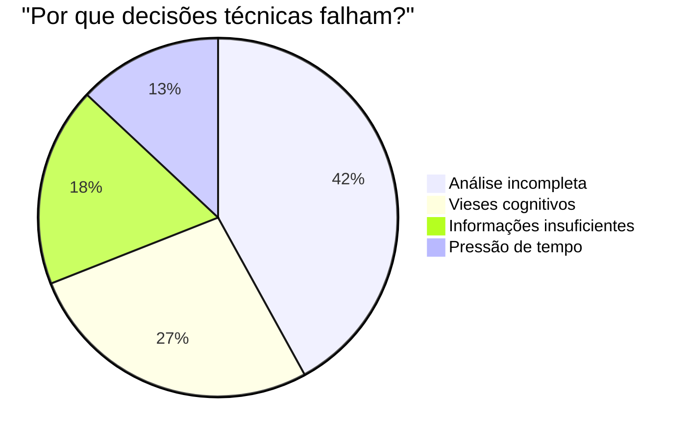
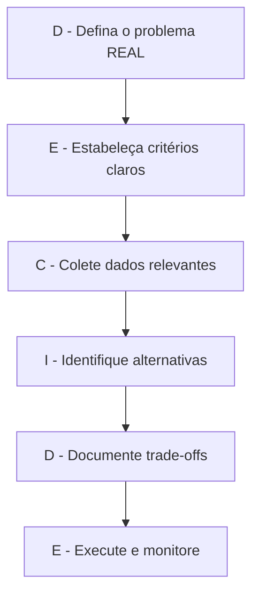
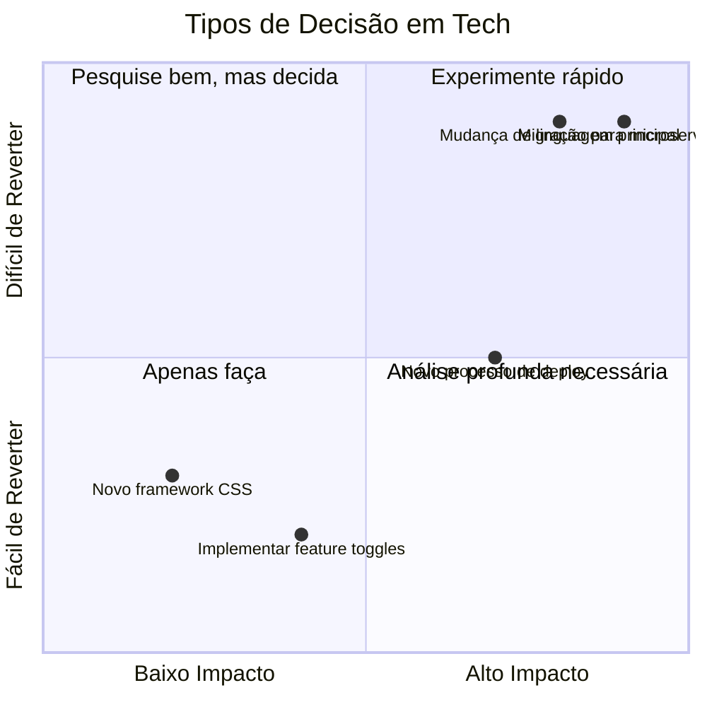
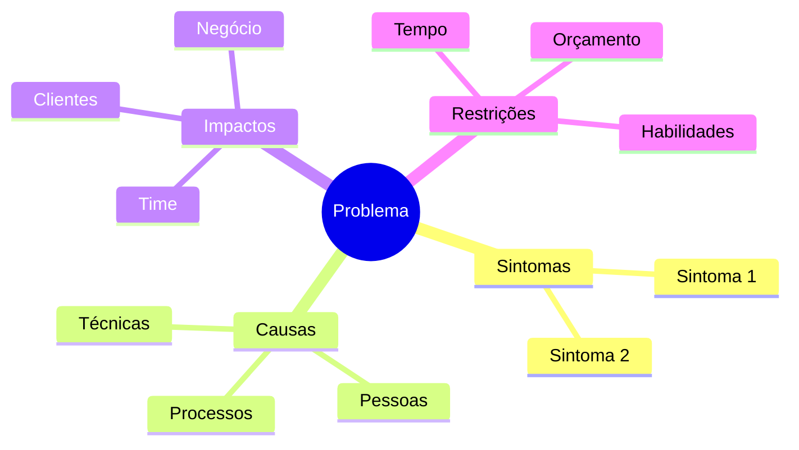
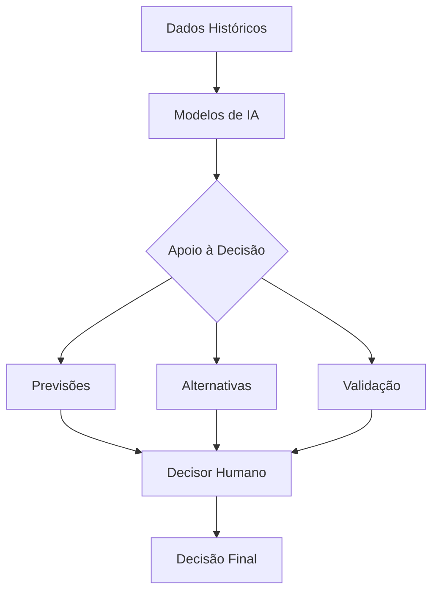

# A Arte (e Ciência) da Tomada de Decisão: Por que a maioria dos líderes tech faz isso errado

> _"A diferença entre um bom e um ótimo líder de tecnologia não está no conhecimento técnico, mas na qualidade das suas decisões e na capacidade de fazer os outros chegarem a boas decisões."_

E aí, já se pegou numa daquelas reuniões intermináveis onde parece que ninguém consegue bater o martelo? Ou pior: já tomou uma decisão "óbvia" só pra descobrir três meses depois que era um tiro no pé completo? Pois é, você não está sozinho.

Depois de mais de 15 anos liderando equipes de engenharia no Brasil (e sobrevivendo pra contar a história), percebi que a nossa capacidade de tomar decisões sólidas é o que realmente separa os líderes excepcionais dos meramente competentes. E não, não estou falando só de Tech Leads - isso vai desde o TL até o CTO.

## O Problema com a Tomada de Decisão na Engenharia

A real é que a maioria dos líderes tech toma decisões de um jeito que daria calafrios em qualquer cientista de dados:

- Viés de confirmação na veia 💉
- Dados ignorados em favor de intuições 🔮
- Pensamento de grupo mascarado como "consenso" 🐑
- Análise superficial disfarçada de "agilidade" ⏩

E o pior? **A gente nem percebe que está fazendo isso.** Como engenheiros, nos orgulhamos de sermos racionais e analíticos, mas quando precisamos escolher entre React ou Vue, centralizar ou descentralizar a arquitetura, investir em observability ou em novos features... aí o emocional bate forte.

## Dados Chocantes Sobre Decisões em Tech 📊

Antes de entrarmos nos frameworks, vamos aos números que ninguém fala:

- Segundo o relatório DORA 2023, times de alto desempenho são **3.5x mais propensos** a ter processos de tomada de decisão bem definidos
- Um estudo da McKinsey mostrou que 60% dos líderes tech acreditam tomar decisões "baseadas em dados", mas apenas 7% realmente documentam os dados que influenciaram suas escolhas
- A média de custo de decisões revertidas em arquitetura de software é de 23x o custo da análise detalhada inicial (!!!)



## Os 3 Níveis de Maturidade na Tomada de Decisão

Vamos ser honestos, a maioria dos líderes tech (inclusive eu, em muitos momentos) opera no Nível 1 ou, com esforço, no Nível 2:

### Nível 1: Decisões por Instinto 🦖

- Baseadas principalmente em experiências passadas
- "Na minha última empresa fazíamos assim..."
- "Sinto que essa abordagem vai funcionar melhor"
- **Problema**: Altamente suscetível a vieses, funciona apenas em contextos idênticos aos já vivenciados

### Nível 2: Decisões por Consenso 🗣️

- Busca de concordância da equipe/stakeholders
- "Todos concordam com essa abordagem?"
- "Vamos votar para decidir"
- **Problema**: Frequentemente leva ao pensamento de grupo e à "média" das opiniões (que pode ser medíocre)

### Nível 3: Decisões por Princípios e Dados 🧪

- Estabelece critérios claros antes de analisar opções
- Coleta dados relevantes (mesmo que limitados)
- Documenta trade-offs e incertezas
- Decide com base em princípios e evidências
- **Desafio**: Requer mais tempo inicial, mas economiza MUITO tempo no longo prazo

> **A dura verdade**: A maioria dos líderes acha que está no Nível 3, mas na realidade está no Nível 1 com uma roupagem de Nível 2.

## Vieses Cognitivos: Os Inimigos Invisíveis da Boa Decisão

Os vieses cognitivos são como bugs no nosso sistema operacional mental - difíceis de detectar e ainda mais difíceis de corrigir. Entender esses vieses é o primeiro passo para não ser controlado por eles.

### Vieses Mais Comuns em Decisões Técnicas

|Viés|Como se Manifesta|Técnica de Mitigação|
|---|---|---|
|**Viés de Confirmação**|Buscar apenas dados que confirmam sua hipótese inicial|"Advocacia do Diabo": designe alguém para argumentar contra sua opção preferida|
|**Efeito IKEA**|Valorizar excessivamente soluções que você mesmo criou|Blind Review: esconda a autoria das alternativas durante a avaliação|
|**Custo Afundado**|Continuar investindo em abordagens ruins devido ao que já foi investido|Retrospectiva Contrafactual: "Se estivéssemos começando hoje, escolheríamos isso?"|
|**Heurística da Disponibilidade**|Superestimar a importância de eventos recentes/memoráveis|Análise de Frequência Real: quantificar objetivamente a ocorrência de eventos|
|**Otimismo Tecnológico**|Subestimar consistentemente esforço e complexidade técnica|Planning Poker + buffer de contingência explícito|

### Como Neutralizar Vieses na Prática

A técnica mais poderosa que já vi é o que chamo de "Pré-compromisso com critérios":

1. **Estabeleça critérios explícitos ANTES de ver as opções**
2. **Documente esses critérios publicamente**
3. **Comprometa-se a seguir esses critérios, mesmo que levem a uma decisão "não intuitiva"**

**Exemplo real**: Em uma escolha de stack no Nubank, estabelecemos critérios muito claros (performance, maturidade no mercado, curva de aprendizado para o time) e nos comprometemos com eles. Acabamos escolhendo uma tecnologia que inicialmente não era a favorita dos arquitetos seniores, mas que atendia melhor aos critérios. Três anos depois, essa decisão provou ser correta e evitou reescritas caras.

## O Framework DECIDE: Simples, mas Poderoso

Depois de errar MUITO e ver decisões voltarem para me assombrar, desenvolvi uma abordagem que chamo de DECIDE (sim, sou péssimo com acrônimos, mas fica fácil de lembrar):



### D - Defina o problema REAL

A quantidade de vezes que vi times debatendo soluções para o problema errado é assustadora. Antes de qualquer coisa, você precisa garantir que está resolvendo o problema certo.

**Técnica prática**: O "5 Porquês" invertido. Em vez de perguntar "por quê" várias vezes, pergunte: "Qual é o verdadeiro problema que estamos tentando resolver?" e depois "Se resolvermos isso, o problema original realmente desaparece?"

**Exemplo real**: Um time que liderei estava debatendo qual framework de UI adotar para melhorar a velocidade de desenvolvimento. Depois de duas semanas de análises, percebemos que o problema real era a falta de um design system consistente - a escolha do framework era secundária.

### E - Estabeleça critérios claros

Defina ANTES quais fatores são importantes para a decisão e, crucialmente, como você vai ponderá-los.

**Armadilha comum**: Definir critérios que já favorecem a solução que você intuitivamente prefere. Seja honesto!

**Exemplo de critérios para escolha de arquitetura**:

|Critério|Peso (1-5)|Justificativa|
|---|---|---|
|Performance|5|Crítico para UX em nosso contexto|
|Manutenibilidade|4|Time pequeno, precisa ser sustentável|
|Curva de aprendizado|3|Temos devs juniores no time|
|Custo de infraestrutura|2|Temos budget limitado|
|Escalabilidade|1|Volume atual é pequeno, crescimento moderado|

### C - Colete dados relevantes

Mesmo com limitações de tempo, é sempre possível coletar alguns dados. Não precisa ser perfeito, mas precisa ser melhor que "eu acho que".

**Dica de ouro**: Busque ativamente evidências que contrariem sua hipótese inicial. É difícil, mas fundamental.

Fontes valiosas que muitos ignoram:

- Logs e métricas atuais do sistema
- POCs rápidas (1-2 dias) para validar hipóteses críticas
- Experiência documentada de outras empresas (não apenas a sua intuição)
- Literatura técnica e papers relevantes

### I - Identifique alternativas

Evite a armadilha de considerar apenas 2 opções (a favorita e uma alternativa fraca). Busque ativamente pelo menos 3-4 alternativas sólidas.

**Técnica poderosa**: "E se..." forçado. "E se não pudéssemos usar nenhuma das soluções óbvias? O que faríamos?"

Uma prática que adotei: sempre incluir a opção "não fazer nada" ou "adiar a decisão" na análise, com prós e contras honestos.

### D - Documente trade-offs

Essa é a parte que separa os adultos das crianças na sala. Toda decisão tem trade-offs - quem diz que não tem está mentindo ou não analisou direito.

**Template rápido para documentação**:

```markdown
## Decisão: [Título claro da decisão]

### Contexto
- [Problema que estamos resolvendo]
- [Por que precisamos decidir agora]
- [Restrições conhecidas]

### Alternativas Consideradas
1. [Opção A]
   - Prós: 
   - Contras:
   - Riscos e mitigações:

2. [Opção B]
...

### Decisão Final
- Escolhemos [X] porque [razões claras]
- Trade-offs aceitos: [sejamos honestos aqui]
- Como mediremos o sucesso: [métricas específicas]
```

> **Dica prática**: Crie uma tag no Obsidian `#decisao` e um template como esse. Suas futuras decisões vão agradecer!

### E - Execute e monitore

A fase que todo mundo esquece! Uma boa decisão inclui como você vai validar se ela foi realmente boa.

**Pergunta crucial**: "O que observaríamos se essa decisão estiver errada? E quando observaríamos isso?"

Defina indicadores antecipados de sucesso/fracasso e momentos explícitos para reavaliar.

## Adaptando Para Seu Nível de Liderança

A tomada de decisão muda conforme você sobre na hierarquia. Vamos ver como:

### Para Tech Leads

- Foco em decisões técnicas específicas (arquitetura, padrões de código, práticas de qualidade)
- Use o framework para documentar e comunicar decisões para seu EM/Head
- Treinamento: comece aplicando em decisões menores para criar o hábito

### Para Engineering Managers

- Balance a execução do framework vs. capacitar times a usar o framework
- Crie a cultura de documentação de decisões no seu time
- Importante: ensine pelo exemplo, não apenas cobre

### Para Staff+ Engineers

- Use o framework para decisões arquiteturais de longo prazo
- Foco especial na coleta de dados técnicos relevantes
- Considere impactos cross-team das decisões

### Para Heads/Diretores

- Adapte para decisões estratégicas (investimentos em plataformas, evolução organizacional)
- Equilibre dados quantitativos e qualitativos
- Considere horizontes de tempo mais longos (1-3 anos)

> **Reflexão incômoda**: Quanto mais sênior você é, mais suas decisões afetam outros - e portanto mais rigoroso deveria ser seu processo de decisão. Mas na prática, muitos líderes seniores decidem com menos rigor porque "têm mais experiência". Irônico, não?

## Erros que Até os Melhores Líderes Cometem

Depois de ver centenas de decisões em empresas como Nubank, iFood e várias startups, identifiquei padrões de erro até nos melhores líderes:

### 1. Falsa Dicotomia

Apresentar apenas duas opções extremas, quando existem múltiplas possibilidades.

**Exemplo clássico**: "Ou reescrevemos tudo do zero ou continuamos acumulando tech debt"

### 2. Ignorar o Custo do Status Quo

Não considerar que "não fazer nada" também tem um custo, muitas vezes alto.

**Dados interessantes**: Times que quantificam o custo da inação tomam decisões 2.7x mais rápidas, segundo o Project Management Institute.

### 3. Reverência à Autoridade

"O CTO mencionou que gosta de Kubernetes, então vamos usar Kubernetes" (sem análise real de fit).

### 4. Decisões Permanentes vs. Experimentação

Tratar todas as decisões como permanentes, quando muitas poderiam ser estruturadas como experimentos.



## O Que Realmente Diferencia os Melhores Decisores

Depois de observar líderes excepcionais na tomada de decisão, três características se destacam:

### 1. Clareza sobre incertezas

Os melhores decisores são extremamente claros sobre o que **não sabem**. Eles mapeiam explicitamente incertezas e buscam dados para reduzi-las.

### 2. Diversidade deliberada de perspectivas

Eles buscam ativamente pontos de vista diversos, especialmente os que desafiam suas hipóteses iniciais.

### 3. Aprendizado sistemático

Eles revisitam decisões passadas não para apontar culpados, mas para extrair aprendizados estruturados.

**Prática poderosa**: Realize "Decision Pre-mortems" - "Se olharmos para essa decisão daqui 1 ano e ela for um fracasso completo, o que terá acontecido?"

## Ferramentas para Cada Fase da Decisão

Para cada etapa do framework DECIDE, existem ferramentas específicas que podem elevar significativamente a qualidade das suas decisões:

### Para Definir o Problema Real

- **Mapa de Impacto**: Diagrama que conecta o problema técnico aos impactos de negócio
- **Análise de Causa Raiz**: Além do "5 Porquês", tente o método Ishikawa (espinha de peixe)
- **Problem Framing Canvas**: Ferramenta visual para explorar diferentes ângulos do problema



### Para Estabelecer Critérios

- **Decision Matrix**: [RICE](https://www.intercom.com/blog/rice-simple-prioritization-for-product-managers/) (Reach, Impact, Confidence, Effort)
- **Análise Must-Have vs. Nice-to-Have**: Forçando priorização real
- **Weighted Scoring Model**: Template com ponderações para diferentes critérios

### Para Coleta de Dados

- **Spike Solutions**: Código descartável para validar hipóteses técnicas (1-2 dias)
- **Dark Launches**: Implemente no ambiente real sem expor aos usuários
- **Entrevistas Estruturadas**: Com usuários ou times que já passaram pelo mesmo problema

### Para Identificar Alternativas

- **Design Studios**: Sessões onde todos propõem soluções independentemente
- **Nominal Group Technique**: Método para gerar alternativas sem viés de grupo
- **SCAMPER**: Técnica para forçar diferentes perspectivas (Substituir, Combinar, Adaptar, Modificar, Propor outros usos, Eliminar, Reorganizar)

### Para Documentar Trade-offs

- **Architecture Decision Records (ADRs)**: Formato padronizado da indústria
- **Pré-Mortem**: Imagine que a decisão falhou; documente por quê
- **Análise de Riscos**: Matriz de probabilidade vs. impacto com planos de mitigação

### Para Executar e Monitorar

- **DACI Framework**: Define quem é Decisor, Aprovador, Consultado e Informado
- **Métricas de Validação**: KPIs específicos para confirmar sucesso/fracasso
- **Timebox para Revisão**: Calendário explícito para reavaliar a decisão

## Estudo de Caso: Decisão Arquitetural no Nubank

Participei de uma decisão no Nubank sobre migrar de um monolito para microserviços. Vou compartilhar como aplicamos um processo similar ao DECIDE (embora na época não tivesse esse nome):

### Definição do Problema

O problema inicial apresentado era: "Nosso monolito está lento e difícil de manter". Depois de várias discussões, redefinimos para: "Nossa capacidade de entregar features está diminuindo em 18% a cada trimestre devido a acoplamentos no código e conflitos de merge".

### Estabelecimento de Critérios

Criamos uma matriz de decisão com pesos:

|Critério|Peso|Rationale|
|---|---|---|
|Velocidade de entrega|5|Core do problema|
|Resiliência|4|Crítico para serviços financeiros|
|Escalabilidade de time|5|Planejávamos crescer de 30 para 120 devs|
|Custo de infra|3|Impacto no unit economics|
|Curva de aprendizado|3|Time com experiência variada|

### Coleta de Dados

- Profiling detalhado do monolito para identificar hotspots
- Entrevistamos Spotify e iFood sobre suas migrações
- Realizamos um spike (2 semanas) extraindo um serviço não-crítico

### Identificação de Alternativas

1. Manter monolito mas refatorar para modularidade interna
2. Microserviços completos (25-30 serviços)
3. "Macroserviços" (3-5 serviços grandes por domínio)
4. Abordagem híbrida: núcleo como monolito, novos domínios como serviços

### Documentação de Trade-offs

Para a opção escolhida (a híbrida):

- ✅ Mantinha velocidade de desenvolvimento em áreas estáveis
- ✅ Permitia isolamento onde mais precisávamos
- ✅ Menor custo inicial de migração
- ❌ Complexidade de manter dois modelos
- ❌ Necessidade de gateway de API bem desenhada

### Execução e Monitoração

- Definimos métricas de sucesso: tempo de lead de feature, frequência de deploy, incidentes
- Prazo de 6 meses para primeira revisão formal
- Equipe dedicada (30%) para facilitar a transição

**Resultado**: Após 9 meses, observamos redução de 62% no tempo de entrega nos domínios migrados, mas custos de infra 40% maiores que o previsto. Ajustamos a estratégia mas mantivemos a direção.

## Colocando em Prática Hoje

Se você quer melhorar sua tomada de decisão (e a do seu time) a partir de amanhã:

1. **Comece pequeno**: Aplique o framework em uma decisão menor esta semana
2. **Crie templates**: Adicione um template de decisão no seu Obsidian (vou compartilhar o meu em breve)
3. **Normalize a documentação**: Comece a documentar decisões mesmo quando parecem "óbvias"
4. **Audite suas últimas decisões**: Pegue as 3 últimas decisões importantes e avalie honestamente - você seguiu um processo estruturado ou foi mais instinto?
5. **Workshop de decisão**: Dedique 1 hora com seu time para revisar uma decisão recente usando o framework

E lembra: o objetivo não é paralisar pela análise ou burocratizar demais. É aumentar a qualidade das decisões importantes com um esforço razoável.

## Decisões em Tempos de IA e Automação

Não dá mais pra ignorar o impacto da IA e automação no processo decisório. Essa é a nova realidade que estamos enfrentando como líderes tech, com implicações profundas na forma como tomamos decisões.

### O Papel da IA na Tomada de Decisão

A IA está transformando o processo decisório de três formas principais:

1. **Como fonte de dados**: Modelos preditivos que antecipam resultados baseados em padrões históricos
2. **Como ferramenta de exploração**: Gerando alternativas que humanos não considerariam
3. **Como sistema de validação**: Identificando inconsistências ou vieses em nossas decisões



### O Paradoxo da Automação na Decisão

Existe um paradoxo intrigante: quanto mais automatizamos decisões de baixo nível, mais cruciais (e difíceis) se tornam as decisões humanas que restam.

**Dados surpreendentes**:

- Segundo pesquisa da McKinsey, líderes tech que usam IA como apoio à decisão reportam 37% menos "decisões revertidas" em comparação com grupos de controle
- Empresas que implementam sistemas de decisão aumentados por IA economizam em média 23 horas semanais de reuniões por time

### A Nova Competência: Decision Engineering

O que estamos vendo emergir é uma disciplina que chamo de "Decision Engineering" - o desenho intencional dos processos decisórios nas organizações de tecnologia.

Isso inclui:

- **Definir quais decisões devem ser automatizadas vs. humanas**
- **Mapear explicitamente os "circuitos decisórios" na organização**
- **Instrumentar pontos de decisão para coleta contínua de dados**

> "A grande ironia é que, quanto mais avançamos em IA, mais importante se torna a qualidade das decisões humanas. Não estamos eliminando a decisão humana, estamos elevando seu nível de abstração." - Ana Luiza, CTO do iFood

## Conclusão: Decisões como Músculos

A capacidade de tomar boas decisões é como um músculo - desenvolve com prática deliberada. Quanto mais você usar um framework consistente, mais natural ele se torna.

E a verdade é que boa parte do respeito que conquistamos como líderes vem não das decisões em si, mas da transparência no processo decisório. Quando o time entende como você chega às decisões (mesmo discordando), a confiança aumenta exponencialmente.

Uma coisa que aprendi depois de mais de uma década liderando times: ninguém espera que você acerte todas as decisões. Mas todos esperam que você tenha um processo sólido e transparente para tomá-las.

Então, qual decisão importante você está enfrentando agora? Como você pode aplicar esse framework para melhorá-la?

---

**Nota para reflexão**: A decisão mais importante que você toma como líder é sobre _como_ você toma decisões. Meta, né? 🤔

---

## Adaptando o Processo para Diferentes Culturas Organizacionais

Um erro que cometi no passado foi tentar aplicar o mesmo processo de decisão em contextos radicalmente diferentes. A verdade é que o processo precisa ser adaptado à cultura organizacional, senão vai ser rejeitado como um corpo estranho.

### Em Startups Early-Stage

Características:

- Velocidade é crucial
- Informações limitadas
- Alta tolerância a risco
- Hierarquias fluidas

**Adaptações recomendadas**:

- Versão "lean" do framework: foco em rápida definição do problema e critérios claros
- Documentação mínima mas suficiente (um único Notion/Obsidian doc)
- Maior peso para experimentação vs. análise prévia
- Ciclos de feedback muito curtos (dias, não semanas)

### Em Empresas de Crescimento (Scale-ups)

Características:

- Equilíbrio entre velocidade e escala
- Diversidade de stakeholders
- Necessidade de alinhar times distribuídos
- Transição de processos ad-hoc para estruturados

**Adaptações recomendadas**:

- Framework completo para decisões de alto impacto, versão simplificada para o resto
- Documentação padronizada e acessível (ADRs, decision logs)
- Definição clara de "quem decide o quê" (RACI/DACI)
- Equilíbrio entre dados e expertise

### Em Corporações Estabelecidas

Características:

- Muitos stakeholders e aprovações
- Baixa tolerância a risco
- Processos já estabelecidos
- Alta política organizacional

**Adaptações recomendadas**:

- Integrar o framework com processos existentes (não competir com eles)
- Documentação rigorosa e conectada com governança
- Maior ênfase na análise de risco e compliance
- Narrativas compelentes para sustentar a mudança

> **Dica real**: Em ambientes corporativos, muitas vezes o mais importante não é o processo decisório em si, mas como você o "vende" internamente. Passe tanto tempo preparando a comunicação quanto na análise técnica.

## Um Template para Obsidian que Realmente Uso

Aqui está um template simples mas poderoso que uso no meu próprio Obsidian. Sinta-se à vontade para adaptar:

```markdown
# Decisão: [Título Descritivo]

## Metadados
- **Data**: {{date}}
- **Decisor(es)**: [Nome e papel]
- **Tipo**: [Técnica/Processo/Organizacional/Produto]
- **Impacto**: [Alto/Médio/Baixo]
- **Reversibilidade**: [Alta/Média/Baixa]
- **Status**: [Proposta/Decidida/Implementada/Revisada]

## Contexto
[Descreva a situação atual e por que uma decisão é necessária]

## Problema
[Defina claramente o problema a ser resolvido]

## Restrições
- [Lista de restrições que limitam as opções]

## Critérios de Decisão
| Critério | Importância (1-5) | Justificativa |
|----------|-------------------|---------------|
| [Critério 1] | [Peso] | [Por que isso importa] |
| [Critério 2] | [Peso] | [Por que isso importa] |

## Alternativas Consideradas

### [Opção 1]
- **Descrição**: [Detalhes da opção]
- **Prós**: 
  - [Vantagem 1]
  - [Vantagem 2]
- **Contras**:
  - [Desvantagem 1]
  - [Desvantagem 2]
- **Riscos e Mitigações**:
  - [Risco 1] → [Mitigação 1]
  - [Risco 2] → [Mitigação 2]
- **Pontuação nos Critérios**:
  - [Critério 1]: [Pontuação/5]
  - [Critério 2]: [Pontuação/5]

### [Opção 2]
[Mesmo formato]

## Decisão Final
- **Escolhida**: [Opção X]
- **Justificativa**: [Explicação clara da escolha]
- **Trade-offs aceitos**: [Ser honesto aqui]

## Plano de Implementação
- [Ações, responsáveis e prazos]

## Métricas de Sucesso
- [Como saberemos se foi uma boa decisão]

## Prazo para Revisão
- [Data para revisar se a decisão foi acertada]

## Referências
- [Links, pesquisas, documentos relacionados]

#decisao #[area-relevante]
```

## Links Relacionados

- [[Framework DECIDE para Decisões]]
- [[Vieses Cognitivos em Tech Leadership]]
- [[Templates de Documentação para Decisões]]
- [[Estudo de Caso - Migração de Monolito para Microserviços]]
- [[IA na Tomada de Decisão Técnica]]
- [[Facilitando Decisões em Grupo]]

#lideranca #decisoes #engenharia #framework #bias #templates