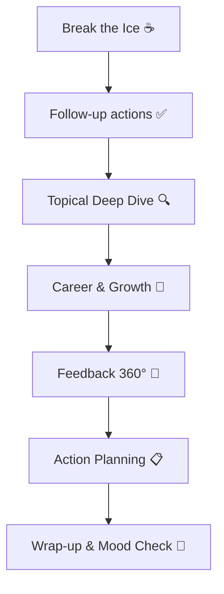
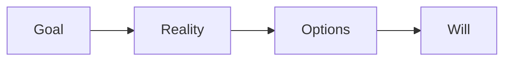

# 🗣️ Guia Definitivo De 1‑on‑1 Para Líderes De Engenharia

> **TL;DR**: 1‑on‑1 é o _CPU affinity_ do people management — deixe o contexto certo rodar no core certo e a performance explode. Este guia cobre **porquê**, **quando** e **como** transformar cada encontro em puro 🔥.

---

## 1. Por Que 1‑on‑1 Importam?

- **Trust**: cria um canal seguro para feedback bilateral.
    
- **Alignment**: garante que objetivos pessoais conectam com OKRs do squad.
    
- **Growth**: oportunidade quinzenal para coaching individual.
    

> "People don’t leave companies, they leave managers that pulam 1‑on‑1." — Alguém sábio no Twitter.

---

## 2. Pré‑requisitos

|Item|Descrição|Ferramentas/Recs|
|---|---|---|
|Cadência|Weekly (30‑45 min) / Bi‑weekly (60 min)|Google Calendar ⏰|
|Agenda Compartilhada|Doc vivo editável pelas duas partes|Notion, Obsidian|
|Psychological Safety|Zero punição por falar verdades|Seu tom de voz|

---

## 3. Preparação

### Você (Líder)

- Revise **objetivos, última retro e action items**.
    
- Traga **dados** (ex: PR throughput, incident records) para embasar.
    

### Liderado(a)

- Reflita sobre **wins 🏆, blockers 🧱, learning goals 📚**.
    
- Adicione itens na agenda até **24 h antes**.
    

---

## 4. Roteiro De 60 Min

|Timebox|Tema|Dicas Ninja|
|---|---|---|
|5 min|Icebreaker|Pergunte sobre algo **não‑trabalho** first.|
|10 min|Follow‑up|Revisite compromissos do último encontro.|
|20 min|Deep Dive|Foco em um tópico XXL (tech debt, soft‑skill, etc.).|
|10 min|Carreira|Conecte aspirações com oportunidades atuais.|
|10 min|Feedback|Use **SBI** (Situation‑Behavior‑Impact).|
|5 min|Wrap|Reforce next steps & ask "Como você sai desta conversa?"|

---

## 5. Perguntas Poderosas 💡

### Alignment

- "Qual é o maior impacto que você quer causar este trimestre?"
    
- "Algo no roadmap que não faz sentido para você?"
    

### Growth

- "Qual skill técnica você quer dominar nos próximos 6 meses?"  
    _Tip_: Combine com budget de cursos ou mentoring interno.
    

### Engagement

- "O que faria sua semana valer 🔟/10?"
    
- "Se pudesse remover um processo do time, qual seria?"
    

> **Hack**: mantenha um banco de 50+ perguntas em markdown para random pick.

---

## 6. Técnicas De Escuta Ativa 🎧

1. **Paraphrase** → "Então o que você sente é…"
    
2. **Silêncio Tático** → conte até 3, deixe espaço.
    
3. **Mirror** → repita a última frase como pergunta.
    
4. **Labeling** → "Parece que isso te frustra."
    

---

## 7. Frameworks Úteis

- **GROW** (Goal‑Reality‑Options‑Will) para coaching.
    
- **SBI** para feedback.
    
- **Start‑Stop‑Continue** para retrospectivas rápidas.
    

---

## 8. Documentação & Follow‑up 📝

- Use um **doc compartilhado**. Cada ação inicia com verbo no infinitivo + owner + due date.
    
- Envie _recap_ em até 24 h.
    
- Revise ações no próximo 1‑on‑1 (sem exceções!).
    

---

## 9. Anti‑padrões 🚫

|🚩|O que é|Como evitar|
|---|---|---|
|Monólogo do líder|Falar >80% do tempo|Regra 70/30 (liderado fala +70%)|
|Virar status report|Só discutir tasks|Use daily/weekly para status, 1‑on‑1 para pessoas|
|Cancelar Recorrente|"Coisas mais importantes"|Proteja na agenda como deploy crítico|

---

## 10. Métricas De Sucesso 📊

- **eNPS** do time ↑
    
- **Retention rate** ↑
    
- **Promoções internas** ↗︎
    
- **Psychological safety survey** ↑
    

---

## 11. 1‑on‑1 Async & Distribuído 🌍

- Combine 15 min síncrono + doc assíncrono.
    
- Grave vídeo Loom curto para recados menos sensíveis.
    

---

## 12. FAQ Rápido

1. **Qual a melhor frequência?** — Weekly quando o ritmo é intenso; quinzenal no mínimo.
    
2. **Posso juntar dois devs?** — Não. 1‑on‑1 ≠ stand‑up.
    
3. **E se a pessoa não fala?** — Perguntas abertas + silence power.
    

---

## 13. Próximos Passos 🚀

1. **Agende** sua próxima rodada no calendário agora.
    
2. **Crie** template de agenda (Notion/Google Doc).
    
3. **Compartilhe** este guia com outros líderes e colete feedback.
    

> 🎉 **Parabéns!** Seus 1‑on‑1s nunca mais serão os mesmos.