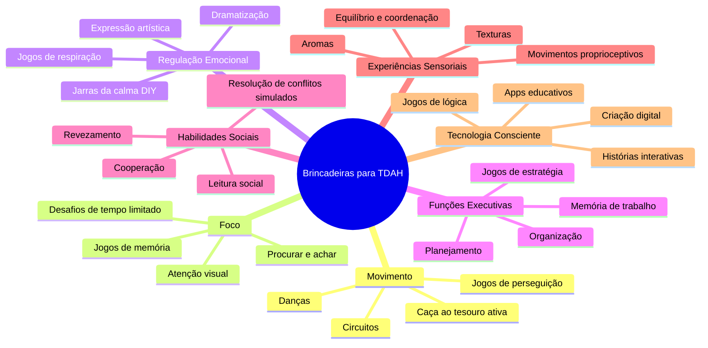

# 🎮 Brincadeiras E Jogos Que Funcionam De Verdade Para Crianças Com TDAH

> "Brincar é o trabalho mais sério da infância. E para nossos pequenos com cérebros que funcionam em alta velocidade, é também terapia, aprendizado e alegria em um só pacote."

## ✨ Por Que Falar Sobre Brincadeiras É Tão Importante?

A gente sabe como é. Entre as consultas médicas, as reuniões na escola, as terapias e as lições de casa intermináveis, às vezes esquecemos o óbvio: **nossos filhos são crianças antes de tudo**. E crianças precisam brincar. Mas não é só isso.

Para crianças com TDAH, o brincar não é apenas diversão – é uma ferramenta poderosa de desenvolvimento, regulação e aprendizado. E a melhor parte? É de graça, está disponível agora mesmo, e seu filho vai adorar (não vai fazer cara feia como faz para os exercícios de fonoaudiologia, hein?).

Quando Felipe, meu filho de 9 anos, foi diagnosticado com TDAH, eu mergulhei de cabeça nos livros, nas pesquisas e nas terapias. Mas foi observando ele brincando que tive meus maiores insights. Vi como certas brincadeiras o ajudavam a se acalmar, como outras estimulavam sua atenção de maneiras que uma mesa de estudos jamais conseguiria, e como brincando ele podia praticar habilidades sociais sem a pressão do julgamento.

## 🧠 O Que a Ciência Diz Sobre Isso?

Vamos entender o que acontece no cérebro da criança com TDAH quando ela brinca:

1. **Dopamina em ação**: O cérebro com TDAH tem uma dinâmica diferente de dopamina (aquele neurotransmissor responsável pela sensação de recompensa e motivação). Durante atividades envolventes e divertidas, há um aumento na liberação de dopamina, o que melhora temporariamente a atenção e o foco. É por isso que seu filho consegue passar horas jogando videogame, mas luta para ficar 10 minutos fazendo lição.
    
2. **Córtex pré-frontal em treinamento**: Esta região cerebral, responsável pelas funções executivas (planejamento, controle de impulsos, memória de trabalho), é menos ativa em crianças com TDAH. As brincadeiras estruturadas, especialmente aquelas com regras claras mas flexíveis, são como uma academia para esta parte do cérebro – fortalecem essas habilidades sem o estresse de um ambiente formal de aprendizado.
    
3. **Regulação emocional na prática**: Estudos mostram que o brincar livre e imaginativo ajuda crianças a processarem suas emoções. Para crianças com TDAH, que muitas vezes têm desafios de desregulação emocional, as brincadeiras oferecem um espaço seguro para experimentar e gerenciar sentimentos fortes.
    
4. **Circuitos de recompensa realinhados**: Brincadeiras bem estruturadas ajudam a treinar o cérebro a encontrar satisfação em completar tarefas, mesmo quando há espera envolvida – algo que geralmente é desafiador para o cérebro com TDAH.
    

Como Dr. Russell Barkley, um dos principais pesquisadores em TDAH, explica: "O brincar não é apenas uma atividade infantil, mas um contexto crucial onde crianças praticam e aperfeiçoam as habilidades executivas que serão necessárias para a vida adulta."

## 🧩 Categorias De Brincadeiras E Seus Benefícios Específicos

### 1. Brincadeiras De Movimento E Energia (Para Quando Parece Que Tem Um Motor ligado)

**Por que funcionam:** A necessidade de movimento não é "falta de educação" – é uma necessidade neurológica real. O movimento ajuda a regular os níveis de neurotransmissores e permite que o cérebro com TDAH funcione melhor.

**Exemplos práticos:**

- **Circuito de obstáculos caseiro** 🏃‍♂️ – Use almofadas, cadeiras, mesas e cordas para criar percursos que exijam rastejar, pular, equilibrar
- **Caça ao tesouro pelo quintal ou apartamento** 🔍 – Esconda objetos e dê pistas que exijam movimento e atenção
- **Dança-congela** 💃 – Dance enquanto a música toca e congele quando parar (ótimo para controle inibitório)
- **Jogos de amarelinha redesenhados** 👣 – Crie versões com instruções adicionais (pule com a língua pra fora, pule falando vogais)

### 2. Jogos De Atenção E Foco (Que Não Parecem Lição De casa)

**Por que funcionam:** Estes jogos engajam naturalmente o sistema de atenção do cérebro, mas com um nível de estimulação e recompensa que trabalhos escolares raramente oferecem.

**Exemplos práticos:**

- **Onde está Wally? versão caseira** 👀 – Crie cenas bagunçadas e peça para encontrar objetos específicos
- **Jogo da memória temático** 🧠 – Use temas do interesse da criança (ex: dinossauros, personagens favoritos)
- **"Eu espio"** 👁️ – Versão brasileira do "I spy", ótima para viagens de carro
- **Simon diz adaptado** 👑 – Com comandos progressivamente mais complexos (toque o nariz com a mão esquerda enquanto pula três vezes)

### 3. Jogos De Regulação Emocional (Para Dias turbulentos)

**Por que funcionam:** Crianças com TDAH frequentemente têm dificuldades com desregulação emocional devido à subatividade em áreas cerebrais que modulam emoções. Estes jogos oferecem prática em um contexto seguro.

**Exemplos práticos:**

- **Dramatização com fantoches** 🎭 – Crie histórias onde os personagens enfrentam frustrações e encontram soluções
- **Semáforo das emoções** 🚦 – Um jogo onde a criança identifica como está se sentindo e escolhe estratégias de regulação
- **Estátua emocional** 😮 – Quando a música para, a criança tem que fazer uma pose que represente a emoção anunciada
- **Respire e desenhe** 🎨 – Respiração controlada enquanto cria arte abstrata que representa sentimentos

### 4. Jogos De Espera E Paciência (Para Treinar O "músculo" Da espera)

**Por que funcionam:** O cérebro com TDAH tem dificuldade com gratificação tardia. Estes jogos treinam essa habilidade de forma divertida, sem a carga negativa que geralmente acompanha a espera.

**Exemplos práticos:**

- **Estátua musical adaptada** 🎵 – Fique imóvel por períodos progressivamente mais longos
- **Desafio do marshmallow adaptado** 🍭 – Jogos de espera com recompensas, começando com tempos curtos
- **"Coelho sai da toca" em câmera lenta** 🐇 – Incentiva movimentos controlados e deliberados
- **Tesouro escondido com timer** ⏱️ – A criança só pode procurar depois que o timer tocar

### 5. Brincadeiras Sensoriais (Para Crianças Que Buscam Input sensorial)

**Por que funcionam:** Muitas crianças com TDAH também têm peculiaridades sensoriais, buscando ativamente certas sensações que ajudam a regular seu sistema nervoso. As experiências sensoriais fornecem input proprioceptivo que pode acalmar e organizar o cérebro.

**Exemplos práticos:**

- **Massinha caseira com aromas** 👃 – Adicione canela, essência de baunilha ou ervas para estimulação olfativa extra
- **Caixa sensorial temática** 📦 – Crie uma caixa com arroz, feijão ou areia onde a criança pode procurar pequenos tesouros escondidos
- **"Pintura" com espuma de barbear** ✋ – Atividade tátil que permite exploração sensorial e limpeza fácil
- **Pista de obstáculos descalço** 👣 – Crie um caminho com diferentes texturas (algodão, lixa suave, geleca, tecidos)

### 6. Jogos Digitais Benéficos (Para Usar a Tecnologia a favor)

**Por que funcionam:** Jogos digitais bem escolhidos oferecem o nível ideal de estímulo visual e recompensas frequentes que o cérebro com TDAH procura, enquanto trabalham habilidades específicas. Não é sobre "deixar no celular", mas usar ferramentas digitais estrategicamente.

**Exemplos práticos:**

- **Minecraft modo criativo** 🏗️ – Estimula planejamento e criatividade com recompensa visual imediata
- **Jogos de quebra-cabeça por etapas** 🧩 – Apps como Monument Valley que trabalham resolução de problemas espaciais
- **Stop Motion Studio** 📱 – Criar pequenos filmes de animação trabalha sequenciamento e persistência
- **Jogos de memória visual digitais** 👁️ – Versões com dificuldade progressiva que mantêm o engajamento

## 📝 Exemplo Prático Detalhado: Circuito De Obstáculos Neurológico

Vamos ver como preparar e executar um circuito que não é só diversão, mas também um powerhouse de desenvolvimento para o cérebro com TDAH:

**Materiais:**

- Almofadas e travesseiros
- Fita adesiva colorida
- Cestos ou baldes
- Bolas de diferentes tamanhos
- Cordas ou lençóis
- Cronômetro (opcional)

**Montagem e Execução:**

1. **Estação de Equilíbrio**: Coloque uma linha de fita no chão – a criança deve andar sobre ela carregando algo na cabeça (trabalha controle motor e atenção)
2. **Túnel Sensorial**: Use cadeiras e lençóis para criar um túnel para rastejar (input sensorial proprioceptivo)
3. **Arremesso de Precisão**: Posicione baldes a diferentes distâncias para arremessar bolas (controle motor fino e planejamento)
4. **Pulo dos Travesseiros**: Organize almofadas onde a criança deve pular de uma para outra sem tocar o chão (planejamento motor e controle inibitório)
5. **Zona de Descanso**: Uma área onde a criança deve ficar parada contando até 20 antes de continuar (autocontrole e respiração)

**Variações para diferentes perfis:**

- Para crianças muito ativas: adicione mais estações de movimento intenso
- Para crianças com hiperfoco: inclua pequenos puzzles ou desafios cognitivos entre estações físicas
- Para dificuldades de transição: use timer visual e aviso sonoro para mudança de estações

**O que acontece no cérebro durante o circuito:** Cada transição entre atividades trabalha a flexibilidade cognitiva; os momentos de equilíbrio e precisão estimulam o cerebelo (área com diferenças estruturais em crianças com TDAH); e a necessidade de seguir a sequência treina a memória de trabalho e o planejamento – tudo isso enquanto a dopamina flui pela diversão!

## 🌪️ Cenários Comuns E Como Lidar

### O Dia De Chuva Interminável

**Situação:** Está chovendo há dois dias. Seu filho com TDAH já subiu e desceu o sofá 157 vezes, desmontou dois brinquedos, e agora anda de um lado para outro reclamando que não tem NADA para fazer (enquanto ignora a montanha de brinquedos no quarto).

**O que está acontecendo no cérebro dele:** O cérebro com TDAH precisa de níveis ótimos de estimulação para funcionar bem. Em dias sem estrutura e com limitação de espaço, os níveis de dopamina caem e a inquietação aumenta – não é "manha", é neuroquímica.

**Estratégia passo-a-passo:**

1. **Reconheça o desconforto real**: "Sei que é difícil ficar dentro de casa tanto tempo. Seu corpo precisa se movimentar, né?"
    
2. **Ofereça escolha estruturada**: "Tenho duas ideias de coisas legais que podemos fazer. Você prefere criar uma cabana de lençóis com lanternas ou fazer uma competição de dança maluca?"
    
3. **Planeje transições**: "Vamos fazer isso por 20 minutos, e depois trocar para outra atividade. Vou colocar o timer visual para nos ajudar a lembrar."
    
4. **Incorpore movimento mesmo em atividades paradas**: Se for assistir TV, pode ser TV ativa com desafios ("Pule toda vez que o personagem disser esta palavra"); se for ler, pode ler enquanto balança na rede.
    
5. **Crie "estações de brincadeira"**: Prepare 3-4 áreas diferentes pela casa com atividades distintas e faça rotação a cada 15-20 minutos.
    

### Encontro Com Outras Crianças (Quando a Interação Social É Desafiadora)

**Situação:** Seu filho foi convidado para brincar na casa de um colega, mas você está apreensivo porque as interações sociais anteriores terminaram em conflitos, com seu filho dominando brincadeiras ou ficando frustrado quando não conseguia o que queria.

**O que está acontecendo no cérebro dele:** A impulsividade e a desregulação emocional do TDAH afetam diretamente as habilidades sociais. O córtex pré-frontal, que ajuda a monitorar e ajustar comportamentos sociais, tem funcionamento diferente no cérebro com TDAH.

**Estratégia passo-a-passo:**

1. **Preparação prévia**: Converse brevemente sobre o que vai acontecer: "Hoje vamos à casa do João. Vocês provavelmente vão jogar videogame e brincar no quintal."
    
2. **Role-play simplificado**: Pratique situações-chave como pedir para entrar na brincadeira ou lidar com uma discordância: "Se você quiser brincar com algo que o João está usando, como você pode pedir?"
    
3. **Estabeleça um código secreto**: Combine um sinal discreto que você pode usar para lembrá-lo quando perceber que ele está ficando sobrecarregado.
    
4. **Ofereça uma saída honrosa**: "Se estiver difícil, pode vir me dizer que precisa ir ao banheiro. Aí a gente tira um tempinho juntos para respirar."
    
5. **Estruture a visita**: "Vamos ficar só uma hora hoje" ou "Depois do lanche, vamos embora" – pré-definir o tempo ajuda a gerenciar expectativas.
    
6. **Valorize os sucessos**: Após a visita, aponte especificamente o que ele fez bem: "Vi como você esperou sua vez no jogo. Isso mostra respeito pelos outros!"
    

## 💡 Dica De Ouro (Acionável Imediatamente)

Crie um "Menu de Brincadeiras" visual para os momentos de transição e tédio. Aqui está como:

**Materiais:**

- Cartolina colorida
- Fotos ou desenhos de atividades
- Velcro adesivo ou ímãs (se usar na geladeira)

**Como montar:**

1. Divida a cartolina em categorias de energia: "Corpo Elétrico" (atividades intensas), "Concentração Divertida" (jogos focados), "Acalmar o Furacão" (atividades reguladoras)
2. Coloque 3-5 opções de brincadeiras em cada categoria com imagens
3. Adicione velcro para que a criança possa remover e escolher a atividade

**Como usar:** Quando seu filho disser "Não sei o que fazer" ou estiver claramente precisando de direcionamento, diga: "Vamos consultar nosso menu de brincadeiras? Você pode escolher uma atividade desta coluna hoje."

Isto funciona porque **oferece escolha dentro de estrutura** – algo que o cérebro com TDAH precisa desesperadamente. Além disso, retira a carga cognitiva de ter que lembrar todas as possibilidades (memória de trabalho) e reduz a paralisia de escolha que frequentemente acompanha o TDAH.

## 🎲 Lista De Jogos De Tabuleiro Que Realmente Funcionam Para TDAH

Estes jogos comerciais são investimentos que valem a pena para dias de chuva e momentos familiares:

1. **Perfil Junior** – Trabalha atenção aos detalhes e oferece recompensas frequentes
2. **Jenga** – Excelente para controle motor fino e gerenciamento da impulsividade
3. **Dobble/Spot it!** – Rápido, engajante e treina atenção visual
4. **UNO** – Clássico que trabalha memória de trabalho e flexibilidade cognitiva
5. **Pula Pirata** – O elemento de surpresa mantém o engajamento alto
6. **Imagem & Ação Junior** – Movimento, criatividade e habilidades sociais
7. **Rush Hour** – Puzzle espacial perfeito para hiperfocantes

### Tabela Comparativa: Qual Jogo Escolher Conforme a Necessidade

|Jogo|Nível de Energia|Funções Executivas Trabalhadas|Melhor para...|Idade Recomendada|
|---|---|---|---|---|
|Perfil Junior|Baixo-Médio|Memória de trabalho, Categorização|Dias calmos, Treinar vocabulário|7+|
|Jenga|Baixo|Planejamento, Controle inibitório|Desenvolver paciência, Controle motor|6+|
|Dobble|Alto|Velocidade de processamento, Atenção seletiva|Momentos de transição, Engajamento rápido|5+|
|UNO|Médio|Memória de trabalho, Flexibilidade|Jogos em família, Trabalhar tomada de turnos|6+|
|Pula Pirata|Médio-Alto|Controle motor, Tolerância à tensão|Trabalhar regulação emocional|4+|
|Imagem & Ação Jr.|Alto|Criatividade, Comunicação|Desenvolvimento social, Expressão|6+|
|Rush Hour|Baixo|Resolução de problemas, Planejamento|Momentos de acalmar, Hiperfoco|8+|

## 🙋‍♀️ Perguntas Para Reflexão Dos Pais

- Como eu diferencio quando meu filho está realmente tentando manipular uma situação versus quando ele está genuinamente precisando de movimento ou estimulação?
- Quais atividades parecem ajudar meu filho a se acalmar versus quais parecem deixá-lo mais agitado?
- Estou conseguindo ver as brincadeiras como ferramentas terapêuticas ou ainda as vejo como "perda de tempo"?
- Como posso adaptar nosso espaço para facilitar brincadeiras que sejam benéficas para o perfil específico do meu filho?
- Quais são os sinais de que meu filho está "supersaturado" durante uma brincadeira e precisa de transição?
- Como posso envolver outros membros da família (avós, tios, irmãos) para que compreendam a importância dessas brincadeiras específicas?
- Quando percebo que uma brincadeira está "funcionando" para meu filho? Quais indicadores de progresso posso observar?
- De que forma posso adaptar as brincadeiras conforme meu filho cresce e suas necessidades mudam?

## ❓ Perguntas Frequentes Dos Pais (FAQ)

**P: Devo interromper quando meu filho está hiperfocado em um jogo ou brincadeira?** R: Depende do contexto. O hiperfoco pode ser uma vantagem do TDAH quando direcionado a atividades benéficas. Se a atividade é saudável e construtiva, considere permitir que continue, mas prepare-o gentilmente para a transição ("Em 10 minutos vamos jantar"). Se o hiperfoco está em algo potencialmente prejudicial (como videogames por horas a fio), então sim, intervenha com uma transição suave.

**P: Como equilibrar tempo de tela com brincadeiras mais ativas?** R: Crie um sistema visual de "fichas" onde atividades físicas "desbloqueiam" tempo de tela. Ou estabeleça uma rotina clara (ex: primeiro brincadeiras ativas, depois tempo limitado de tela). O importante é que o tempo de tela seja consciente e preferencialmente com jogos que trabalham habilidades úteis.

**P: Meu filho se frustra facilmente em jogos. Devo insistir ou mudar de atividade?** R: Essa frustração geralmente reflete dificuldades com regulação emocional típicas do TDAH. Use a técnica do "sanduíche": primeiro valide o sentimento ("Entendo que está difícil"), depois ofereça suporte específico ("E se tentarmos dessa forma?"), e finalmente incentive ("Você conseguiu da última vez, lembra?"). Se a frustração escalar, faça uma pausa breve e retorne depois – persistência é uma habilidade que se constrói aos poucos.

**P: Como encontrar tempo para brincar quando a rotina já está sobrecarregada?** R: Integre momentos de brincadeira às atividades cotidianas. Transforme o caminho para a escola em uma caça visual, faça da arrumação do quarto um desafio cronometrado, aproveite o banho para experimentos com água. Lembre-se: 10 minutos de brincadeira focada podem ter mais impacto que horas de atividades desconectadas.

## 🔬 Recursos Confiáveis Para Aprofundamento

- [[Livro: O Cérebro da Criança, Daniel Siegel]] – Tem um capítulo excelente sobre como brincadeiras integram o cérebro
- [[ADDitude Magazine]] – Frequentemente publica artigos sobre brincadeiras terapêuticas
- [[Canal do YouTube: TDAH e Eu]] – Tem vídeos práticos de atividades para fazer em casa
- [[Artigo Científico: A Importância do Brincar no Desenvolvimento de Funções Executivas]] – Para quem quer entender a base científica mais a fundo
- [[Livro: Brincando de Pensar, Gisele Massi]] – Abordagem brasileira sobre jogos para desenvolvimento cognitivo
- [[Associação Brasileira do Déficit de Atenção (ABDA)]] – Recursos em português adaptados à nossa realidade

## 📊 Adaptações Por Idade: Como Evoluir as Brincadeiras

As necessidades e interesses mudam conforme a criança cresce. Veja como adaptar as atividades para diferentes fases:

### Pré-escolares (3-5 anos)

- **Foco em:** Movimento amplo, experiências sensoriais, imitação
- **Brincadeiras ideais:** Circuitos simples, massinha sensorial, faz-de-conta estruturado
- **Dica de ouro:** Use música para sinalizar transições e mudar o nível de energia

### Escolares Iniciais (6-8 anos)

- **Foco em:** Regras simples, revezamento, controle de impulsos
- **Brincadeiras ideais:** Jogos de tabuleiro simples, caça ao tesouro, brincadeiras com regras crescentes
- **Dica de ouro:** Use histórias e personagens favoritos para ensinar habilidades sociais

### Escolares Intermediários (9-12 anos)

- **Foco em:** Independência, cooperação, resolução de problemas
- **Brincadeiras ideais:** Jogos estratégicos, projetos em etapas, desafios em grupo
- **Dica de ouro:** Permita que a criança modifique regras de jogos existentes para desenvolver autonomia

### Pré-adolescentes/Adolescentes (13+ anos)

- **Foco em:** Identidade, competências, conexão social
- **Brincadeiras ideais:** Projetos criativos, jogos de estratégia complexos, atividades físicas estruturadas
- **Dica de ouro:** Respeite o interesse crescente por atividades com pares, mas mantenha momentos de conexão através de jogos compartilhados

## ⚠️ Um Lembrete Gentil Para Finalizar

As brincadeiras são importantes DEMAIS para serem deixadas ao acaso para crianças com TDAH. São talvez uma das ferramentas mais poderosas e acessíveis que temos como pais. Mas, como tudo na parentalidade atípica, exigem intencionalidade.

Dito isso, não transforme "brincar" em mais uma tarefa estressante na sua lista. O objetivo é encontrar o equilíbrio entre estrutura e espontaneidade. Algumas das melhores intervenções terapêuticas acontecem quando a criança nem percebe que está "trabalhando" em algo.

E lembre-se: quando seu filho está verdadeiramente engajado em uma brincadeira adequada, aquele momento de paz que você observa não é apenas uma trégua para você – é o cérebro dele funcionando em harmonia, construindo conexões que farão diferença por toda a vida.

> **Nota importante:** Se seu filho tem comorbidades como TOD, ansiedade, ou TEA junto com o TDAH, algumas brincadeiras podem precisar de adaptações específicas. Observe atentamente o que funciona e o que causa sobrecarga, e não hesite em personalizar ainda mais as atividades para seu pequeno único.

---

> **Comentário pessoal:** Como mãe de um menino com TDAH combinado, descobri que transformar tarefas diárias em brincadeiras (corrida contra o tempo para vestir-se, "missões especiais" para guardar brinquedos) fez mais pela nossa rotina do que todas as tabelas de recompensa que já tentamos. Às vezes, a solução mais eficaz é também a mais simples – mas exige que baixemos nossa guarda adulta e entremos no mundo deles por um momento.

---

## 💰 Brincadeiras De Baixo Custo: Eficácia Sem Gastar Muito

Nem todas as atividades precisam de materiais especiais ou caros. Aqui estão ideias que usam o que você provavelmente já tem em casa:

1. **Brincadeiras com Papelão**
    
    - Caixa sensorial (corte uma abertura para as mãos e coloque objetos dentro para adivinhar pelo tato)
    - Cidade de papelão (transforme caixas em prédios e carros)
    - Labirinto para bolinhas de gude (com divisórias de papelão)
2. **Brincadeiras com Materiais da Cozinha**
    
    - Transferência com colheres e potes (arroz, feijão)
    - "Pesca" magnética (clipes e ímã)
    - Experiências simples (óleo e água colorida)
3. **Jogos Sem Material Algum**
    
    - "Siga o Mestre" com movimentos cada vez mais complexos
    - "Zip Zap" (jogo de nomes e direções que trabalha atenção)
    - "História Colaborativa" (cada um adiciona uma frase)

> **Dica para famílias com orçamento limitado:** Muitas vezes, a brincadeira mais eficaz é aquela que usa o que já está disponível de forma criativa. Lembre-se que para a criança com TDAH, a novidade e o engajamento são mais importantes que o brinquedo em si.

## Mapa Mental De Brincadeiras Por Objetivo

