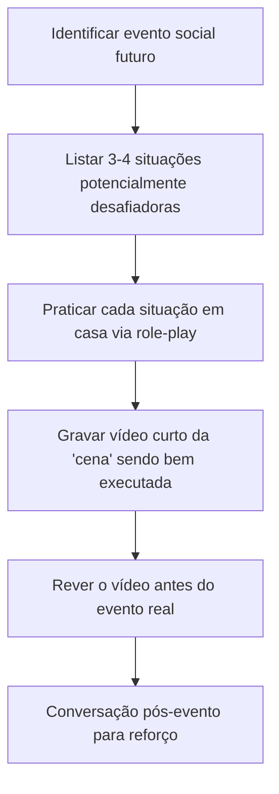

# Navegando O Mundo Social: Guia Para Pais De Crianças Com TDAH

> _"O mundo social é como um jogo sem manual para nossos filhos. Nosso papel é ajudá-los a decifrar as regras não escritas enquanto celebramos a beleza de suas mentes únicas."_

## O Que Você Vai Encontrar Neste Guia

- [[#Por Que as Habilidades Sociais São um Desafio Específico no TDAH]]
- [[#Como o Cérebro TDAH Processa Informações Sociais]]
- [[#Estratégias Práticas que Realmente Funcionam]]
- [[#Momentos Difíceis: Cenários Comuns e Soluções]]
- [[#Construindo Pontes: Estratégias para Diferentes Idades]]
- [[#O Autocuidado dos Pais Nessa Jornada]]
- [[#Recursos que Salvam Vidas (e Sanidades)]]

---

## Por Que as Habilidades Sociais São Um Desafio Específico no TDAH

Se você já se perguntou por que seu filho com TDAH parece ter mais dificuldades com amizades que seus colegas de turma, não é sua imaginação - e com certeza não é falta de tentativa da criança ou de você.

As dificuldades sociais não são apenas um "problema de comportamento" ou "falta de educação" - são parte da **neurobiologia do TDAH**. E entender o porquê muda completamente nossa forma de ajudar.

### O Que a Ciência Diz Sobre Isso? 🔬

O desenvolvimento de habilidades sociais em crianças com TDAH é impactado diretamente por vários aspectos neurobiológicos:

- **Função Executiva Desafiada**: As dificuldades com funções executivas afetam a capacidade de ler e responder a sinais sociais em tempo real. Pense nas funções executivas como o "sistema operacional" do cérebro - elas controlam a inibição de comportamentos, permitem o planejamento, e gerenciam a memória de trabalho.
    
- **Circuitos de Dopamina e Noradrenalina**: Estudos de neuroimagem mostram que a regulação desses neurotransmissores, alterada no TDAH, impacta diretamente a percepção de recompensa social e o tempo de resposta em interações.
    
- **Processamento Temporal Diferente**: Pesquisas recentes da Universidade de São Paulo demonstraram que crianças com TDAH processam informações temporais de maneira diferente, o que significa que podem perder "janelas de oportunidade" em conversas e interações, parecendo interromper ou estar "fora de sincronia".
    

Um estudo do Journal of Child Psychology and Psychiatry mostrou que cerca de 50-60% das crianças com TDAH enfrentam rejeição significativa pelos pares, comparado a 10-15% das crianças neurotípicas. Isso não é por acaso - é resultado direto de como seus cérebros processam informações sociais!

> 💡 **Insight de Ouro**: Quando entendemos que o desafio social vem de diferenças neurobiológicas e não de "preguiça" ou "má educação", mudamos completamente nossa abordagem: passamos do "por que você não consegue?" para "como podemos encontrar caminhos que funcionem para seu cérebro único?"

---

## Como O Cérebro TDAH Processa Informações Sociais

Para ajudarmos nossos filhos, precisamos entender como seus cérebros funcionam nesse universo social complexo. Não é apenas sobre "prestar mais atenção" - é sobre um processamento fundamentalmente diferente.

### Quatro Diferenças Fundamentais

1. **Leitura de Pistas Não-Verbais**: O cérebro com TDAH pode perder até 40% das pistas não-verbais (expressões faciais, tom de voz, postura corporal) em uma conversa. É como assistir um filme com legendas onde toda hora algumas frases desaparecem!
    
2. **Tempo de Processamento**: A informação social precisa passar por mais "filtros" e pode levar 2-3 segundos a mais para ser completamente processada. Numa conversa rápida entre crianças, isso é uma eternidade!
    
3. **Impulsividade nas Respostas**: O córtex pré-frontal, responsável por "frear" respostas impulsivas, funciona de maneira diferente. Seu filho pode saber exatamente o que deveria fazer/dizer, mas na hora H o cérebro não consegue acessar essa informação rápido o suficiente.
    
4. **Hiperfoco ou Desatenção**: Seu filho pode alternar entre prestar atenção demais a um detalhe social específico (ignorando todo o resto) ou perder informações importantes por desatenção.
    

### Exemplo Prático Detalhado

**Cenário**: Três crianças estão brincando no parquinho e decidem mudar as regras da brincadeira.

**Para a criança neurotípica**:

- Percebe a mudança através das expressões faciais e tons de voz
- Processa a nova informação em segundos
- Adapta-se às novas regras quase instantaneamente
- Continua participando sem interrupção

**Para a criança com TDAH**:

1. Pode estar hiperfocada em outro aspecto da brincadeira e nem notar a conversa sobre mudança
2. Quando percebe, leva mais tempo para processar a mudança
3. Enquanto processa, continua seguindo as regras antigas
4. Os outros interpretam como "não está nos ouvindo" ou "não quer seguir as regras"
5. Quando finalmente processa, já pode ser tarde demais - o grupo já formou uma impressão

É como se todos estivessem jogando o mesmo jogo, mas seu filho está sempre um ou dois passos atrás na compreensão das regras que mudam constantemente.

> 🧩 **Conexão Importante**: Essa diferença no processamento social está diretamente ligada aos circuitos frontoestriatais do cérebro. Não é uma escolha, é uma diferença neurobiológica real!

---

## Estratégias Práticas Que Realmente Funcionam

### Dica De Ouro (Acionável Imediatamente) ✨

A estratégia "P.A.R.A." que desenvolvi trabalhando com centenas de famílias:

- **P - Praticar antecipadamente**: Simular situações sociais em casa
- **A - Atenção consciente**: Ensinar técnicas para "checagem" consciente do ambiente social
- **R - Roteiros sociais**: Desenvolver "frases prontas" para situações desafiadoras
- **A - Análise posterior**: Rever interações sociais sem julgamento

Vamos destrinchar cada uma dessas estratégias com exemplos concretos:

### 1. Praticar Antecipadamente (O Poder Da Pré-visualização)

#### Por Que Funciona? 🔬

O cérebro com TDAH se beneficia enormemente da pré-exposição. Quando simulamos situações sociais, criamos caminhos neurais preliminares que facilitam o processamento em tempo real depois. É como se estivéssemos "pré-carregando" o software social!

#### Como Fazer

- **Role-play direcionado**: 10-15 minutos, 2-3 vezes por semana
- **Use bonecos/fantoches** para crianças menores
- **Grave vídeos curtos** onde vocês representam diferentes situações

**Exemplo prático**: Se seu filho vai a uma festa de aniversário no sábado, pratique durante a semana:

1. Como entrar na festa e cumprimentar
2. Como pedir para entrar numa brincadeira em andamento
3. Como lidar se alguém não quiser brincar com ele
4. Como agradecer aos pais do aniversariante



#### Script Que Você Pode Usar

"Vamos brincar de 'festa de aniversário'? Eu vou fingir que sou uma criança na festa e você chega querendo brincar também. Depois a gente troca, eu sou você e você é a outra criança. Não se preocupe em acertar tudo - é só uma brincadeira para nos prepararmos para sábado!"

### 2. Atenção Consciente (Os Check-ins Sociais)

#### Por Que Funciona? 🔬

As crianças com TDAH podem se beneficiar de lembrar conscientemente de verificar pistas sociais que outras crianças processam automaticamente. Criar um "sistema de check-in" transforma uma habilidade implícita em explícita.

#### Como Fazer

- Ensine a técnica dos "3 Olhares": rosto, mãos, postura
- Crie um sinal discreto que você possa usar para lembrá-lo
- Pratique com vídeos de interações sociais no mudo

**Exemplo Com Detalhes**: Técnica F.O.C.A.

1. **F**ace (rosto): "O que a expressão do rosto está me dizendo?"
2. **O**lhos: "Para onde a pessoa está olhando?"
3. **C**orpo: "O que a postura do corpo indica?"
4. **A**mbiente: "O que está acontecendo ao redor que pode me dar dicas?"

Para crianças menores, você pode transformar isso em um jogo de "detetive social", onde elas ganham pontos por notar esses elementos.

#### Lembrete Visual Que Funciona

Crie um pequeno cartão de lembrança que seu filho pode carregar:

```
📌 Meu Lembrete F.O.C.A.
-----------------------
F - Face (expressão)
O - Olhar (direção)
C - Corpo (postura)
A - Ambiente (contexto)
-----------------------
👀 Busque 2 pistas antes de agir!
```

### 3. Roteiros Sociais (As Frases-Âncora)

#### Por Que Funciona? 🔬

O TDAH afeta a fluência verbal sob pressão social. Ter frases pré-formuladas reduz a carga cognitiva e permite que seu filho se concentre na interação em si, não em "o que devo dizer agora?"

#### Como Fazer

- Identifique situações sociais desafiadoras específicas
- Crie 2-3 frases simples e naturais para cada situação
- Pratique até que se tornem quase automáticas

**Exemplos de Roteiros para Diferentes Situações**:

|Situação|Frase-Âncora|Por Que Funciona|
|---|---|---|
|Querer entrar em uma brincadeira|"Esse jogo parece divertido! Posso jogar também?"|Reconhece a atividade atual e faz um pedido claro|
|Quando interromper acidentalmente|"Desculpe, me empolguei. Por favor, continue o que estava falando."|Reconhece o erro e permite continuidade|
|Quando não entender uma regra|"Estou um pouco confuso. Pode explicar essa parte de novo?"|Específico sobre a necessidade sem soar negativo|
|Quando precisar de tempo|"Preciso pensar um pouquinho sobre isso."|Cria pausa sem parecer desinteressado|

### 4. Análise Posterior (Reflexão Sem Julgamento)

#### Por Que Funciona? 🔬

Estudos mostram que crianças com TDAH aprendem melhor quando podem analisar experiências passadas em um ambiente seguro e sem julgamento. Isso fortalece as conexões neurais e ajuda na generalização de habilidades.

#### Como Fazer

- Crie um momento específico (não imediatamente após o evento)
- Use perguntas abertas e uma postura curiosa, não corretiva
- Valorize tanto os sucessos quanto as dificuldades como oportunidades de aprendizado

**Exemplo de Diálogo para Análise**:

_Após uma festa de aniversário:_

**Evite**: "Por que você não brincou com as outras crianças? Notei que ficou sozinho."

**Prefira**: "Me conta um pouco sobre a festa. Quais foram as partes mais legais para você? Teve algum momento que foi mais difícil?"

_Ao discutir um desafio:_

**Evite**: "Da próxima vez você precisa prestar mais atenção quando os outros estão falando."

**Prefira**: "Parece que foi difícil entender quando a brincadeira mudou. O que você acha que poderia ajudar você a perceber essas mudanças mais rápido na próxima vez?"

> 💡 **Insight Poderoso**: Estas conversas não são para "consertar" seu filho, mas para construir autoconsciência. A compreensão dos próprios desafios é o primeiro passo para desenvolver estratégias eficazes!

---

## Momentos Difíceis: Cenários Comuns E Soluções

### Cenário Comum E Como Lidar: A Festa De Aniversário

**Situação**: Seu filho de 8 anos com TDAH foi convidado para uma festa de aniversário. Festas anteriores terminaram em lágrimas ou frustração.

#### Antes Do Evento

1. **Preparação Visual**:
    
    - Crie um "mapa social" da festa com post-its ou desenhos
    - Inclua possíveis atividades e "saídas seguras" para momentos de sobrecarga
2. **Visita Prévia**:
    
    - Se possível, visite o local antes
    - Identifique áreas mais calmas para pausas necessárias
3. **Kit de Regulação Discreta**:
    
    - Monte um pequeno kit na mochila: fone de ouvido, objeto sensorial favorito, cartão de lembrete social
    - Estabeleça um código entre vocês para quando precisar usá-lo

#### Durante O Evento

1. **Check-ins Estratégicos**:
    
    - Combine horários para breves encontros (não para "verificar comportamento", mas para recalibrar)
    - Use perguntas específicas: "Como estão as brincadeiras até agora?" (não "Está se comportando?")
2. **Técnica "Três Antes de Mim"**:
    
    - Ensine seu filho a observar três crianças antes de sua vez em jogos ou atividades
    - Isso dá tempo extra para processar as regras sociais em andamento
3. **Aliado Social**:
    
    - Identifique uma criança mais compatível que possa ser um "parceiro"
    - Conversas com pais de outras crianças neurodivergentes podem criar oportunidades de amizades mais compreensivas

#### Exemplo De Conversa Com a Criança Antes Da Festa

"O aniversário do João vai ter muitas crianças e atividades legais. Também pode ficar barulhento e agitado às vezes. Lembra do nosso plano? Se precisar de um tempinho mais calmo, pode ir até aquele banco no jardim que vimos na foto, ou me fazer nosso sinal combinado. Não é problema nenhum precisar de uma pausa - até eu preciso às vezes! O importante é você se divertir do seu jeito."

### Cenário Comum E Como Lidar: O Conflito no Recreio

**Situação**: Seu filho constantemente se envolve em conflitos durante o recreio por "não seguir as regras" dos jogos.

#### Estratégia De Múltiplas Camadas

1. **Mapeamento do Recreio**:
    
    - Peça à criança para desenhar o pátio e marcar onde acontecem as diferentes brincadeiras
    - Discutam quais atividades têm regras mais claras vs. mais fluidas
2. **Observação Estratégica**:
    
    - Ensine a técnica do "primeiro observar, depois participar"
    - Crie um "roteiro mental" para entrar em brincadeiras em andamento
3. **Parceria com a Escola**:
    
    - Solicite que um educador faça a mediação inicial dos jogos mais estruturados
    - Proponha a implementação de "jogos inclusivos" com regras visualmente expostas

**Script de Simulação em Casa**:

_Você_: "Vamos fingir que eu sou uma criança brincando de pique-bandeira. Como você vai descobrir as regras antes de pedir para entrar?"

_Criança responde_

_Você_: "Ótima ideia observar primeiro! E se você perceber que as regras mudaram no meio da brincadeira, o que poderia fazer?"

_Criança responde_

_Você_: "E se você não tiver certeza se entendeu direito, que pergunta poderia fazer?"

#### Carta Para Professores Que Realmente Funciona

```
Prezado(a) Professor(a),

Estamos trabalhando intensamente com [nome da criança] para desenvolver habilidades sociais. Algumas estratégias específicas que estão funcionando bem em casa:

1. Ele/ela se beneficia de uma "pré-exposição" às regras dos jogos
2. Quando recebe instruções em etapas curtas, processa muito melhor
3. Utiliza a técnica "observar antes de entrar" nas brincadeiras

Seria possível implementar algum apoio nesse sentido durante o recreio? Por exemplo:
- Um quadro visual com as regras dos jogos mais comuns
- Um sistema de "amigo do recreio" com revezamento entre as crianças
- Breve check-in antes do recreio para confirmar entendimento das atividades previstas

Estou disponível para conversarmos mais sobre essas ideias ou outras que possam surgir.

Atenciosamente,
[Seu nome]
```

### Perguntas Para Reflexão Dos Pais 🤔

1. Quais situações sociais específicas são mais desafiadoras para meu filho?
2. Quando observo mais sucesso nas interações sociais dele? O que está diferente nesses momentos?
3. Quais são os pontos fortes sociais do meu filho que posso ajudá-lo a reconhecer e utilizar?
4. Como posso criar mais oportunidades de prática social em ambientes seguros e estruturados?
5. Estou modelando as habilidades sociais que espero ver no meu filho?

---

## Construindo Pontes: Estratégias Para Diferentes Idades

### Pré-Escola (3-5 anos)

Nesta fase, o fundamento das habilidades sociais está sendo construído. Crianças com TDAH frequentemente enfrentam desafios com:

- Compartilhamento e espera da vez
- Brincadeiras paralelas vs. colaborativas
- Regulação emocional durante interações

#### Estratégias Específicas Para Idade

1. **Brincadeiras Estruturadas em Pequenos Grupos**:
    
    - Organize encontros com apenas 1-2 outras crianças
    - Planeje atividades com turnos muito claros
    - Use temporizadores visuais para revezamento
2. **Narração Social em Tempo Real**:
    
    - Durante interações, narre discretamente o que está acontecendo
    - "Olha, o Pedro está mostrando o carrinho dele. Ele parece querer brincar junto."
    - Isto destaca pistas sociais que sua criança pode estar perdendo
3. **Histórias Sociais Personalizadas**:
    
    - Crie livrinhos simples sobre situações sociais específicas
    - Use fotos da própria criança e seus amigos reais
    - Leia regularmente, especialmente antes de eventos sociais

**Exemplo de História Social Personalizada**:

```
👧 Mariana na Escolinha

Mariana gosta de brincar na escolinha.
Às vezes, ela quer o mesmo brinquedo que outra criança.

Quando isso acontece, Mariana pode:
- Esperar sua vez (e brincar com outra coisa enquanto espera)
- Pedir "posso brincar depois de você?"
- Perguntar "quer brincar junto comigo?"

Quando Mariana espera sua vez, os amigos ficam felizes em brincar com ela!
```

### Ensino Fundamental I (6-10 anos)

Nesta fase, as regras sociais tornam-se mais complexas e sutis. A criança com TDAH pode enfrentar:

- Dificuldade em perceber regras sociais não explícitas
- Manejo de amizades mais complexas
- Compreensão de diferentes perspectivas

#### Estratégias Específicas Para Idade

1. **Clube de Habilidades Sociais Caseiro**:
    
    - Sessões semanais de 20-30 minutos
    - Foco em uma habilidade específica por vez (ex: entrar em grupos, resolver conflitos)
    - Use vídeos, jogos e role-plays
2. **Decodificação de Situações Sociais**:
    
    - Use programas de TV pausados estrategicamente
    - Pergunte: "O que você acha que a pessoa está sentindo? Como você sabe?"
    - Discuta explicitamente as "pistas" visuais e verbais
3. **Jogos de Tabuleiro Estratégicos**:
    
    - Utilize jogos que requerem negociação e cooperação
    - Pause o jogo para discutir estratégias sociais
    - Conecte situações do jogo a cenários da vida real

**Atividade Prática: Álbum de "Detetive Social"**

Materiais:

- Caderno pequeno ou aplicativo de notas
- Revistas/jornais/fotos antigas
- Canetas coloridas

Como fazer:

1. Recorte/selecione imagens de pessoas expressando diferentes emoções
2. Peça à criança para identificar:
    - Qual emoção está sendo expressa
    - Quais "pistas" no rosto/corpo mostram isso
    - O que poderia ter causado essa emoção
    - Como responder a alguém que se sente assim

### Pré-Adolescência E Adolescência (11-17 anos)

Esta fase traz complexidades sociais exponenciais. Jovens com TDAH frequentemente lutam com:

- Nuances da comunicação digital
- Pressão de grupo e identidade social
- Relacionamentos românticos iniciais

#### Estratégias Específicas Para Idade

1. **Mentoria Social Estruturada**:
    
    - Identifique um jovem mais velho (primo, vizinho) com boas habilidades sociais
    - Crie oportunidades para observação e interação
    - Sessões de "perguntas e respostas" sobre situações sociais confusas
2. **"Tradução" de Regras Sociais Implícitas**:
    
    - Transforme regras não-ditas em linguagem explícita
    - Discuta os "porquês" por trás das convenções sociais
    - Analise situações confusas sem julgamento
3. **Navegação Digital Consciente**:
    
    - Prática com tempo de resposta em mensagens
    - Decodificação de tom em comunicação escrita
    - Estabelecimento de limites saudáveis online

**Ferramenta Útil: "Decodificador de Mensagens"**

Crie juntos uma tabela para interpretar mensagens em texto:

|O que foi escrito|Possíveis significados|Como responder|O que evitar|
|---|---|---|---|
|"Ok." (ponto final)|Pode indicar irritação ou encerramento|"Está tudo bem? Podemos conversar sobre isso?"|Não bombardear com mais mensagens insistentes|
|"kkkk" vs "😂"|Diferentes níveis de achar algo engraçado|Corresponder ao tom da outra pessoa|Não interpretar "kkkk" como gargalhada intensa|
|Sem resposta por horas|Ocupado OU pensando na resposta OU chateado|Dar espaço, depois: "Ei, só checando se está tudo bem"|Não assumir rejeição imediatamente|

---

## O Autocuidado Dos Pais Nessa Jornada

Apoiar um filho com desafios sociais pode ser emocionalmente exaustivo. Você não está apenas ensinando habilidades - está processando rejeições, gerenciando suas próprias reações emocionais e frequentemente servindo de "tradutor social".

### Por Que É Crucial (Além Do Óbvio) 🔬

Estudos mostram que o estresse parental elevado impacta diretamente:

- Sua capacidade de modelar habilidades sociais de forma eficaz
- Sua habilidade de permanecer responsivo vs. reativo
- A percepção da criança sobre suas próprias habilidades sociais

Um estudo da UNIFESP demonstrou que pais com níveis mais baixos de estresse conseguem implementar intervenções de habilidades sociais com 40% mais consistência e eficácia.

### Práticas Que Realmente Ajudam

1. **Grupo de Apoio de Pais (presencial ou online)**:
    
    - Compartilhe vitórias E desafios
    - Aprenda estratégias testadas por outros
    - Normalize a experiência para reduzir a culpa
2. **Prática de "Desidentificação"**:
    
    - Separe os desafios da criança da sua identidade como pai/mãe
    - Reconheça: "O meu filho está tendo dificuldades", não "Eu estou falhando"
    - Celebre pequenos progressos consistentemente
3. **"Conta Bancária Emocional"**:
    
    - Identifique atividades que "depositam" energia vs. "sacam" energia
    - Programe pequenos "depósitos" diários e maiores semanais
    - Estabeleça parcerias com outros cuidadores para revezamento

**Exercício de Reflexão: Sua Relação com Habilidades Sociais**

Reserve um momento para refletir:

- Quais foram seus próprios desafios sociais na infância?
- Como suas experiências influenciam suas reações aos desafios do seu filho?
- Que expectativas você pode precisar ajustar?
- Quais recursos pessoais você já possui para apoiar seu filho?

> ❤️ **Lembrete Gentil**: Você não precisa ser perfeito para ser exatamente o que seu filho precisa. Sua disposição em aprender e adaptar-se já é um presente imenso para ele.

---

## Recursos Que Salvam Vidas (e Sanidades)

### Livros Essenciais Em Português

- **"O Cérebro da Criança" - Daniel Siegel e Tina Payne Bryson** _Excelente para entender como apoiar o desenvolvimento socioemocional_
    
- **"TDAH: Estratégias Práticas para o Dia a Dia" - Russell A. Barkley** _O capítulo sobre habilidades sociais é particularmente útil_
    
- **"Não me Faça Pensar" - Adaptado para crianças com TDAH por Paulo Mattos** _Abordagem brasileira para desafios sociais específicos_
    

### Recursos Online Confiáveis

- [ABDA - Associação Brasileira do Déficit de Atenção](https://tdah.org.br/) _Artigos e webinars sobre habilidades sociais e TDAH_
    
- [ADDitude Magazine](https://additudemag.com/) (em inglês) _Excelentes artigos sobre amizades e TDAH_
    
- [Canal TDAH e Eu](https://youtube.com/tdaheeu) _Vídeos específicos sobre navegação social para diferentes idades_
    

### Aplicativos E Ferramentas

|Nome|Função|Idade Ideal|Como Ajuda|
|---|---|---|---|
|Zones of Regulation|Identificação emocional|5-12 anos|Ajuda a criança a reconhecer e comunicar estados emocionais|
|Social Skills Builder|Vídeos interativos|6-14 anos|Cenários sociais com opções de resposta|
|Stories About Me|Criação de histórias sociais|Todas|Permite criar histórias personalizadas com fotos próprias|
|Headspace for Kids|Mindfulness|5+|Ajuda com regulação emocional antes de eventos sociais|

---

## Últimas Reflexões: A Revolução Do "Bom O Suficiente"

O desenvolvimento de habilidades sociais para crianças com TDAH não é sobre atingir a "perfeição social" - é sobre encontrar o equilíbrio entre apoiar seu filho e permitir que ele desenvolva sua própria identidade social autêntica.

### Uma Última História Para Refletir

Tenho um paciente, João (nome fictício), que aos 9 anos lutava intensamente com amizades. Seu maior desafio era entender quando os colegas estavam cansados de um assunto. Ele podia falar sobre dinossauros por 30 minutos sem perceber sinais de desinteresse.

Trabalhamos por meses em pequenas estratégias - um cartão de lembretes no bolso, prática com vídeos, simulações em casa. O progresso era lento, com muitos tropeços.

Um dia, sua mãe me contou algo transformador: "João voltou da escola e disse que um colega pediu para ele parar de falar sobre dinossauros. Em vez de ficar chateado, ele disse 'ok, do que você quer falar então?'. Depois ele me contou: 'Mãe, eu vi que ele estava fazendo aquela cara que a gente praticou. Eu queria continuar falando de dinossauros, mas lembrei que amigos conversam sobre coisas que os dois gostam'."

Este não foi um momento de habilidade social "perfeita" - foi um momento de habilidade social "boa o suficiente". E é isso que realmente importa.

Não estamos formando pequenos políticos ou especialistas em etiqueta - estamos criando seres humanos que possam conectar-se autenticamente com outros, enquanto permanecem fiéis a quem são.

### O Que Levar Dessa Jornada

1. **Compaixão Antes da Correção**: Antes de corrigir uma habilidade social, valide o esforço e a intenção por trás dela.
    
2. **Progresso, Não Perfeição**: Celebre pequenos avanços consistentemente.
    
3. **Neurobiologia, Não Moral**: Lembre-se que desafios sociais têm base neurobiológica, não são falhas de caráter.
    
4. **Autenticidade com Adaptação**: O objetivo é ajudar seu filho a encontrar seu próprio estilo social, não forçá-lo a um molde.
    
5. **Você Não Está Sozinho**: Milhares de pais estão nessa mesma jornada, aprendendo e adaptando dia após dia.
    

> 💡 **Reflexão Final**: As habilidades sociais não são destinadas a fazer nossos filhos se encaixarem em um mundo que não foi projetado para eles. São ferramentas para ajudá-los a navegar esse mundo enquanto transformam-no em um lugar que celebra a neurodiversidade.

---

**Conexões com Outras Notas:**

- [[Regulação Emocional e TDAH]]
- [[Advocacia na Escola para Crianças Neurodivergentes]]
- [[Construindo Autoestima Resiliente]]
- [[Comunicação Não-Violenta Adaptada ao TDAH]]

---

✨ _Lembre-se: Você é exatamente o pai ou mãe que seu filho precisa. Sua disposição em aprender, adaptar e crescer é o maior presente que você pode oferecer._