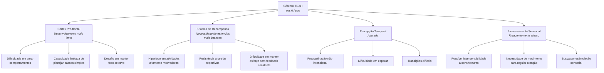

# Navegando o Mundo da Parentalidade TDAH: Guia Especial para Crianças de 6 Anos

> "Criar um filho de 6 anos com TDAH é como tentar ensinar um filhote de cachorro entusiasmado a seguir um percurso de obstáculos enquanto há fogos de artifício acontecendo ao redor – exige amor infinito, paciência extra e muito senso de humor."

![[Pasted image 20250426004059.png]]

Bem-vindo a este guia especial para pais e cuidadores! Como profissionais e pais que vivenciaram essa jornada, reunimos aqui estratégias testadas e baseadas em evidências para apoiar crianças de 6 anos com TDAH. Esta idade é fascinante, cheia de curiosidade e energia, mas também marcada por grandes transições – a entrada no ensino fundamental, novas expectativas sociais e acadêmicas, e o crescente autoconhecimento da criança.

Se você está se perguntando "estou fazendo certo?", "por que é tão difícil?" ou "será que só o meu filho é assim?", queremos que saiba: **você não está sozinho** e, mais importante, **você está no caminho certo** – porque está buscando entender e apoiar seu filho exatamente como ele é.

Este guia foi criado especificamente para crianças de 6 anos com TDAH, considerando as particularidades dessa fase. Vamos além de dicas genéricas – vamos entender o que realmente está acontecendo no cérebro do seu filho e transformar esse conhecimento em estratégias práticas que funcionam no dia a dia.

## 🧠 O Cérebro TDAH aos 6 Anos: O Que Você Precisa Saber

Aos 6 anos, o cérebro está em pleno desenvolvimento, mas no TDAH, há algumas diferenças importantes que precisam ser compreendidas:

### O Que a Ciência Diz Sobre Isso?

As pesquisas mostram que no cérebro com TDAH aos 6 anos:

- **O córtex pré-frontal** (área responsável pela inibição de impulsos, planejamento e foco) tem maturação mais lenta – em média, cerca de 30% de atraso no desenvolvimento
- **A conexão entre o córtex pré-frontal e o sistema límbico** (centro emocional) ainda é frágil, resultando em reações emocionais intensas
- **O sistema de recompensa dopaminérgico** funciona diferentemente, dificultando a motivação para tarefas menos estimulantes
- **A percepção de tempo** é significativamente prejudicada – 5 minutos podem parecer uma eternidade ou passar em um instante

Isso significa que, em termos executivos, seu filho de 6 anos pode estar funcionando como uma criança de 4 anos em algumas áreas – **não por teimosia ou preguiça, mas por uma diferença neurobiológica real**.



### O Momento Especial dos 6 Anos

Os 6 anos marcam uma transição importante do mundo predominantemente lúdico da educação infantil para o ambiente mais estruturado do ensino fundamental. Para crianças com TDAH, essa transição traz desafios específicos:

- Expectativa de permanecer sentado por períodos mais longos
- Necessidade de seguir instruções sequenciais mais complexas
- Primeiros deveres de casa formais
- Maior ênfase em habilidades de alfabetização e numeracia
- Desenvolvimento de amizades mais complexas e regras sociais

Entretanto, também é um momento de grandes oportunidades para intervenção:

- O cérebro está em fase de intensa neuroplasticidade (capacidade de formar novas conexões)
- Hábitos ainda não estão profundamente enraizados
- A autoestima está em formação e pode ser positivamente moldada
- A criança está desenvolvendo sua percepção de si mesma como aprendiz

> 💡 **Dica de Ouro:** Aos 6 anos, seu filho está formando crenças fundamentais sobre si mesmo como estudante, amigo e pessoa. A maneira como interpretamos seus comportamentos para ele nessa fase tem impacto profundo e duradouro.

### Compreendendo o Perfil Sensorial aos 6 Anos

Um aspecto frequentemente negligenciado no TDAH é o processamento sensorial atípico. Aos 6 anos, isto pode se manifestar como:

**Hipersensibilidade:**

- Intolerância a etiquetas em roupas ou certas texturas de tecido
- Irritação extrema com barulhos de fundo que outras crianças nem notam
- Aversão a certos alimentos baseada em textura (não apenas sabor)
- Reação exagerada a luzes fortes ou ambientes visualmente caóticos

**Busca Sensorial:**

- Necessidade de tocar tudo e todos constantemente
- Movimentação incessante (balançar, pular, girar)
- Tendência a fazer ruídos vocais para autorregulação
- Busca por sensações intensas (correr riscos físicos, brincadeiras "brutas")

Entender o perfil sensorial específico do seu filho é crucial para criar ambientes que permitam seu sucesso. Um diário de observações por 2 semanas pode ajudar a identificar padrões sensoriais específicos.

## 🚀 Estratégias Práticas Para o Dia a Dia Com Seu Filho de 6 Anos

### 1. Rotinas Visuais: A Âncora do Dia a Dia

**Por que funciona:** Crianças de 6 anos com TDAH têm memória de trabalho limitada e percepção temporal atípica. Rotinas visuais externalizam a sequência de eventos, reduzindo a carga cognitiva e criando previsibilidade.

**Como implementar para 6 anos:**

- Crie um "Painel do Dia" com imagens coloridas (não apenas palavras):

```markdown
# Meu Dia Especial

## Manhã 🌞
- [Foto da criança na cama] Acordar
- [Imagem de escova de dentes] Escovar dentes
- [Foto das roupas da criança] Vestir
- [Imagem de cereal/café] Tomar café
- [Foto da mochila] Preparar mochila
- [Imagem de carro/ônibus] Ir para escola

## Depois da Escola 🏠
- [Imagem de lanche] Hora do lanche
- [Foto de criança brincando] Tempo livre (30 min)
- [Imagem de livro/caderno] Lição de casa (15 min)
- [Foto de criança brincando] Mais tempo para brincar!
- [Imagem de jantar] Jantar em família
- [Série de 4-5 imagens] Rotina do banho
- [Imagem de livro de história] Hora da história
- [Foto da cama] Dormir
```

- **Adaptações para 6 anos:**
    - Use fotos reais do seu filho realizando as atividades
    - Mantenha sequências curtas (máximo 4-5 passos visíveis por vez)
    - Inclua marcadores temporais simples (usando relógios visuais)
    - Adicione elementos divertidos (personagens favoritos, adesivos)
    - Permita que a criança mova fisicamente um marcador/avatar pelo quadro

**Cenário real: A manhã caótica transformada**

_Antes:_ Miguel, 6 anos, tem manhãs caóticas diariamente. Os pais repetem instrução após instrução ("Escove os dentes!", "Vista-se!", "Coma seu café!"), frequentemente terminando em gritos, atrasos e todos chegando estressados ao trabalho e escola.

_Intervenção:_ Implementaram um painel visual com fotos reais de Miguel realizando cada etapa da rotina matinal. Adicionaram um timer visual para cada bloco de atividade e criaram um pequeno personagem (um dinossauro de brinquedo) que Miguel move entre as etapas.

_Resultado:_ Após duas semanas de consistência, as manhãs se tornaram significativamente mais tranquilas. Miguel ainda precisa de lembretes ocasionais, mas o painel transferiu a responsabilidade do adulto para o suporte visual. O estresse familiar matinal diminuiu cerca de 70%.

_Comentário da mãe:_ "Antes eu repetia as mesmas coisas toda manhã até ficar rouca. Agora só preciso dizer 'Onde está o Sr. Rex no quadro?' e ele se reorienta. Foi uma mudança incrível."

### 2. Tempo de Movimento Estratégico

**Por que funciona:** O cérebro TDAH precisa de movimento para regular-se. Aos 6 anos, a necessidade de movimento é ainda mais intensa, e incorporá-lo estrategicamente melhora significativamente a atenção e o comportamento.

**Como implementar para 6 anos:**

- **Regra dos 20/5:** Após cada 20 minutos de atividade sentada, proporcione 5 minutos de movimento intenso
- **"Recados de Movimento":** Transforme tarefas em desafios físicos ("Pule como sapo até o banheiro para escovar os dentes")
- **Estação de Movimento em Casa:** Crie um canto com:
    - Mini-trampolim (investimento valioso!)
    - Almofadas grandes para pular/rolar
    - Cordas de pular, bolinha fisioball
    - Fitas adesivas no chão formando circuitos
- **Aprendizagem em Movimento:**
    - Pratique contagem pulando em cada número
    - Recite o alfabeto jogando bola de um para outro
    - Use giz no quintal para escrever letras grandes que ele pode "percorrer"

**Estratégias específicas para diferentes ambientes:**

**Em restaurantes:**

- Kit de movimento miniatura na bolsa (massinha, fidgets pequenos)
- "Missões de espionagem" durante a espera ("Conte quantas pessoas estão de azul")
- Revezamento para caminhadas curtas com um dos pais
- Sentar estrategicamente (mesas de canto, longe de muito estímulo)

**Durante compras:**

- Lista com figuras para a criança "caçar" e marcar
- Responsabilidade específica adequada à idade (segurar 1-2 itens)
- Pausas de movimento planejadas (a cada 10 minutos, fazer uma volta rápida)
- Temporizador visual para tornar o tempo concreto

**Em salas de espera:**

- Kit de atividades específico só usado nestas ocasiões (novidade é chave)
- Jogos verbais que não requerem materiais ("Estou pensando em algo...")
- Escalas de inquietação (1-5) para a criança monitorar e comunicar

> 💡 **Dica de Ouro:** Para uma criança de 6 anos com TDAH, ficar sentada por 20 minutos consecutivos pode ser tão desafiador quanto para um adulto ficar sentado por 2 horas em uma reunião tediosa. O movimento não é uma recompensa, mas uma necessidade fisiológica.

**Cenário real: As compras do supermercado**

_Antes:_ Lucas, 6 anos, transformava as compras no supermercado em uma provação. Corria pelos corredores, pegava itens aleatórios, implorava por doces e frequentemente tinha crises quando contrariado, levando a compras apressadas e incompletas.

_Intervenção:_ Os pais criaram um "Jogo de Missão Secreta de Supermercado". Lucas recebeu um pequeno clipboard com lista ilustrada de itens para encontrar, um cronômetro para "missões de velocidade" controladas em corredores específicos, e responsabilidades adequadas (como escolher entre duas marcas pré-aprovadas).

_Resultado:_ As compras, embora ainda não perfeitas, tornaram-se gerenciáveis. Lucas permanece engajado por períodos mais longos, tem senso de propósito, e as explosões diminuíram significativamente. A chave foi transformar a experiência em algo estruturado com movimento incorporado intencionalmente.

_Adaptação para dias difíceis:_ Nos dias em que Lucas está particularmente desregulado, os pais usam a estratégia de "dividir para conquistar" - um pai faz as compras principais enquanto o outro leva Lucas para uma atividade mais adequada ao seu estado naquele dia.

### 3. Comunicação Eficaz com Crianças de 6 Anos

**Por que funciona:** O processamento verbal no TDAH pode ser mais lento, especialmente aos 6 anos. Técnicas de comunicação adaptadas reduzem sobrecarga e melhoram a compreensão.

**Estratégias específicas para 6 anos:**

1. **A Regra dos 6:** Limite instruções a frases de 6 palavras ou menos
    
    - Em vez de: "Pedro, vá para o seu quarto, troque de roupa, escove os dentes e depois desça para o jantar."
    - Use: "Pedro, hora de trocar de roupa." [Pausa e aguarde conclusão] "Agora, vamos escovar os dentes."
2. **Comunicação Visual + Verbal:**
    
    - Use gestos simples junto com palavras
    - Mostre imagens do que você está pedindo
    - Demonstre fisicamente quando possível
3. **Ferramentas de Conexão para 6 anos:**
    
    - **Técnica do "Olhos de Coruja":** Agache-se na altura dela, toque gentilmente o ombro e diga "Preciso dos seus olhos de coruja agora" (estabelece contato visual)
    - **"Eco do Entendimento":** Após instrução importante, peça "Me conta o que vamos fazer agora" (verifica compreensão)
    - **"Código Especial":** Estabeleça uma palavra-código divertida que significa "realmente preciso que você escute agora" (ex: "abracadabra" ou "super-poder")
4. **Scripts Eficazes para Momentos Desafiadores:**
    

|Situação|Frases Ineficazes|Frases Eficazes|
|---|---|---|
|Transição de atividade|"Já falei para parar de brincar agora!"|"5 minutos até guardar. Escolha: guardar tudo ou apenas os carrinhos?"|
|Comportamento impulsivo|"Quantas vezes preciso dizer para não correr na casa?"|"Pés de caminhada dentro. Pés de corrida lá fora."|
|Distração|"Presta atenção! Você nunca escuta!"|"Toque aqui [toque gentil]. Olhos nos meus. Uma coisa importante."|
|Explosão emocional|"Não tem motivo para todo esse choro!"|"Vejo que você está com raiva. Estou aqui quando estiver pronto."|

**Cenário real: A transição para o banho**

_Antes:_ Laura, 6 anos, resistia ferozmente ao momento do banho todas as noites. As tentativas de transição resultavam em protestos dramáticos, negociações intermináveis e frequentemente terminavam em brigas. O processo completo consumia mais de uma hora da rotina noturna.

_Intervenção:_ Os pais implementaram:

1. Aviso visual de transição (timer especial de 5 minutos)
2. Escolha limitada mas significativa ("Banho com espuma verde ou azul hoje?")
3. Sequência visual passo a passo no banheiro
4. Linguagem positiva e concreta ("Hora da missão banho!" em vez de "Você precisa tomar banho agora")
5. Transição pós-banho igualmente estruturada para algo desejável

_Resultado:_ O tempo de resistência diminuiu significativamente. Laura ainda ocasionalmente protesta, mas a estrutura previsível reduziu a ansiedade de transição. O humor durante o banho melhorou, com Laura frequentemente engajando-se em jogos temáticos relacionados.

_Insight-chave:_ A resistência não era ao banho em si, mas à transição abrupta e à sensação de perda de controle. Oferecendo estrutura, previsibilidade e microescolhas dentro de limites definidos, o momento se transformou.

### 4. Gerenciando Crises Emocionais e Meltdowns

**Entendendo os gatilhos comuns aos 6 anos:**

- Transições entre atividades (especialmente interromper algo prazeroso)
- Fadiga executiva após dia escolar
- Fome ou sede (metabolismo acelerado)
- Sobrecarga sensorial (ambientes barulhentos, roupas desconfortáveis)
- Frustração com tarefas difíceis (especialmente alfabetização emergente)
- Injustiça percebida (muito comum nessa idade!)

**Estratégia A.C.A.L.M.A.R. para crianças de 6 anos:**

**A - Avaliar o gatilho**

- Observe padrões: hora do dia, antes/depois de quais atividades?
- Pense como detetive, não como juiz
- Anote gatilhos para identificar padrões

**C - Controle seu próprio estado emocional**

- Lembre-se: comportamento desafiador ≠ criança desafiadora
- Use sua própria técnica de respiração discreta
- Repita mentalmente: "Ele está tendo dificuldade, não causando dificuldade"

**A - Aproxime-se com calma**

- Agache-se ao nível dele (sem intimidar)
- Use voz baixa e calma
- Ofereça proximidade sem demandas imediatas

**L - Linguagem mínima, máximo apoio**

- Reduza comunicação verbal durante o auge
- Frases curtas: "Estou aqui" / "Você está seguro"
- Ofereça objeto de conforto familiar (bicho de pelúcia específico)

**M - Mantenha o espaço seguro**

- Bloqueie estímulos sensoriais (abaixe luzes, reduza sons)
- Para crianças de 6 anos: ofereça "tenda" improvisada com cobertor
- Remova plateia (irmãos, outros adultos) discretamente

**A - Acolha os sentimentos**

- Nomeie a emoção: "Parece que você está muito frustrado"
- Valide sem endossar comportamento: "É difícil parar de jogar quando está divertido"
- Para 6 anos: use metáforas simples ("sua raiva é como um vulcão agora")

**R - Retorno à calma com suporte**

- Ofereça opções simples de regulação: "Abraço apertado ou espaço tranquilo?"
- Use temporizador visual para mostrar "quanto tempo para acalmar"
- Transição gentil após crise: atividade calma e de baixa demanda

**Cenário real: O meltdown no shopping**

_Situação:_ Sofia, 6 anos, teve um colapso completo no shopping após uma série de eventos: longo período sem comer, ambiente barulhento, negação de um brinquedo desejado, e fadiga após dia escolar. A crise escalou rapidamente de choro para gritos, jogar-se no chão e comportamento agressivo.

_Como os pais responderam:_

1. _Avaliação rápida:_ Perceberam múltiplos gatilhos acumulados (fome + sobrecarga sensorial + negação + fadiga)
    
2. _Auto-regulação parental:_ Pai respirou profundamente, ignorou olhares de julgamento, lembrou-se que Sofia não estava "manipulando" mas genuinamente sobrecarregada
    
3. _Aproximação calma:_ Mãe agachou-se ao nível de Sofia, posicionou-se como barreira visual contra curiosos, ofereceu presença sem exigências
    
4. _Comunicação mínima:_ Evitaram sermões ou negociações. Usaram frases curtas: "Estou aqui" e "Vamos encontrar um lugar quieto"
    
5. _Espaço seguro:_ Levaram Sofia para o carro, que era familiar e silencioso. Reduziram estímulos (ar condicionado, música calma)
    
6. _Acolhimento emocional:_ "Sua cabeça está muito barulhenta agora, não está? O shopping tem muitas luzes e sons. É difícil."
    
7. _Recuperação apoiada:_ Ofereceram água e lanche pequeno no carro. Permitiram tempo (cerca de 20 minutos) para regular antes de dirigir para casa.
    

_Aprendizados:_ Os pais identificaram a combinação de gatilhos e agora: 1) levam lanches para saídas, 2) programam visitas ao shopping em momentos de menor movimento, 3) estabelecem duração máxima baseada na observação dos limites de Sofia, 4) têm um "plano de fuga" pré-estabelecido.

_Dica de adaptação:_ Criaram um "kit de regulação" portátil para o carro/bolsa: fones de cancelamento de ruído infantil, lanche proteico não perecível, garrafa d'água, objeto sensorial favorito, lista visual de técnicas de acalmamento.

> 💡 **Dica de Ouro:** Para crianças de 6 anos com TDAH, a recuperação pós-meltdown pode levar até 30-40 minutos. Durante esse tempo, o cérebro está se reorganizando – não é momento para conversar sobre o comportamento ou "lições aprendidas" (isso vem muito depois).

### 5. Estratégias para Desafios na Alimentação

Muitas crianças de 6 anos com TDAH apresentam desafios alimentares, que podem incluir:

- Seletividade extrema (número muito limitado de alimentos aceitos)
- Hiperfoco na textura ou apresentação (não apenas sabor)
- Distração constante durante refeições
- Dificuldade em permanecer sentado pelo tempo necessário
- Hipersensibilidade sensorial a certas texturas/cheiros

**Abordagens eficazes para 6 anos:**

1. **Estrutura sensorial para refeições:**
    
    - Horários consistentes (o cérebro TDAH precisa de previsibilidade)
    - Ambiente com mínimas distrações (TV desligada, mesa limpa)
    - Iluminação adequada (algumas crianças são sensíveis a luzes fluorescentes)
    - Assento estável com bom suporte para pés (balanço e instabilidade aumentam agitação)
    - Utensílios adaptados se necessário (mais pesados para feedback proprioceptivo)
2. **Estratégias de apresentação:**
    
    - Porções pequenas em pratos divididos (menor sobrecarga visual)
    - "Regra do contato neutro" - alimentos novos no prato sem obrigação de provar
    - Degustações microscópicas ("do tamanho de uma formiga") para alimentos novos
    - Participação no preparo (aumenta aceitação)
    - Opções limitadas mas significativas ("Cenoura ou pepino com o almoço?")
3. **Técnicas para manter engajamento:**
    
    - Timer visual para estabelecer expectativa clara de duração
    - "Conversas de jantar" estruturadas (cartões com temas divertidos)
    - Permissão para movimento controlado (levantar após certo número de garfadas)
    - "Missões de sabor" (jogos simples de exploração sensorial)

**Cenário real: Expandindo o repertório alimentar**

_Situação inicial:_ Luiz, 6 anos, restringia-se a apenas 7 alimentos, todos de textura similar (crocantes/secos) e recusava-se violentamente a experimentar qualquer item novo. As refeições tornaram-se campo de batalha, com os pais oscilando entre forçar e desistir.

_Abordagem gradual:_

1. _Descompressão completa:_ Por duas semanas, os pais serviram apenas alimentos seguros, eliminando toda pressão. Estabeleceram atmosfera positiva nas refeições.
    
2. _Exposição sem pressão:_ Começaram a incluir pequeníssimas porções de alimentos-alvo no prato, sem expectativa de consumo. "Você pode olhar, tocar, cheirar ou apenas deixar no prato."
    
3. _Hierarquia sensorial:_ Identificaram que Luiz tolerava melhor: alimentos separados (não misturados), tonalidades amarelas/marrons, e texturas consistentes. Usaram essas preferências para selecionar novos alimentos.
    
4. _Abordagem lúdica:_
    
    - "Cientista de alimentos" (observar, descrever, categorizar)
    - "Escada de coragem" (passos graduais: próximo ao prato → tocar → cheirar → lamber → mordida minúscula)
    - "Teste de super-herói" (avaliar "poderes" de diferentes alimentos)
5. _Consistência sem batalhas:_ Mantiveram exposição consistente sem transformar em conflito. Celebravam qualquer interação positiva com novos alimentos.
    

_Resultados:_ Após 4 meses, o repertório de Luiz expandiu para 15 alimentos. As refeições tornaram-se significativamente menos estressantes. A chave foi remover a pressão enquanto mantinha exposição consistente, respeitando suas sensibilidades sensoriais legítimas.

_Nota importante:_ Questões alimentares graves podem requerer apoio de terapeuta ocupacional especializado em integração sensorial e/ou nutricionista familiarizado com TDAH.

### 6. Estratégias para Desafios do Sono

O sono é frequentemente afetado em crianças com TDAH, com pesquisas mostrando que até 70% experimentam algum tipo de problema de sono. Aos 6 anos, isso pode se manifestar como:

- Dificuldade em "desligar" o cérebro para adormecer
- Resistência à rotina de dormir
- Dificuldade em permanecer na cama
- Despertares noturnos frequentes
- Sono agitado ou inquieto
- Dificuldade para acordar pela manhã

**Abordagem holística do sono para crianças de 6 anos:**

1. **Otimização sensorial:**
    
    - Temperatura ideal (levemente mais fresca)
    - Escuridão adequada (considere cortinas blackout)
    - Ruído branco ou sons calmos consistentes
    - Roupas de cama com peso confortável (considere cobertor levemente pesado)
    - Pijamas de tecido adequado ao perfil sensorial
2. **Rotina de descompressão (60-40 minutos antes):**
    
    - Sequência visual consistente de 5-7 passos
    - Redução gradual de luz (especialmente luz azul)
    - Atividades de "ponte" para o sono: leitura, massagem leve
    - Evitar atividades estimulantes (mesmo que pareçam calmas)
    - Ritual especial de "guardar preocupações"
3. **Estratégias para crianças com mentes "hiperativas" à noite:**
    
    - Meditação guiada específica para crianças pequenas
    - "Máquina do tempo" para falar sobre o dia (limitada a 5-7 minutos)
    - Técnica 5-4-3-2-1 adaptada (5 coisas que vê, 4 que toca, etc.)
    - "Histórias de sucata" (narrativas deliberadamente tediosas)
    - Relaxamento muscular progressivo através de jogo (boneco de pano)

**Cenário real: Transformando a hora de dormir**

_Situação:_ Ana, 6 anos, transformava a hora de dormir em uma maratona de 1,5-2 horas. Pedia água repetidamente, inventava desculpas para sair da cama ("preciso fazer xixi", "esqueci meu outro ursinho"), e quando finalmente adormecia, acordava frequentemente durante a noite.

_Intervenção multifacetada:_

1. _Revisão médica:_ Descartaram problemas respiratórios e outras condições.
    
2. _Análise de padrões:_ Documentaram por 2 semanas e identificaram que:
    
    - Ana demorava mais para dormir em dias de tela à noite
    - Despertava mais frequentemente quando jantava tarde
    - A inquietação aumentava após atividades físicas intensas próximas à hora de dormir
3. _Ajustes ambientais:_
    
    - Criaram "caverna do sono": cortinas blackout + ruído branco + luz noturna muito fraca
    - Adicionaram peso leve extra (cobertor especial próprio para crianças)
    - Temperatura mantida constante em 20-21°C
4. _Rotina reestruturada:_
    
    - Nenhuma tela 90 minutos antes de dormir
    - Jantar finalizado pelo menos 1,5 hora antes
    - Atividade física intensa permitida apenas até o final da tarde
    - Sequência visual de 6 passos criada com Ana e seguida religiosamente
    - "Cesta de necessidades" ao lado da cama (água, lenços, ursinhos extras)
5. _Abordagem às saídas da cama:_
    
    - "Cheque programado": pais voltam a cada 10 minutos brevemente
    - Sem reforço às saídas (retornam Ana à cama calmamente, sem discussão)
    - "Passe de saída" limitado (um por noite, para necessidades genuínas)

_Resultados:_ Após 3 semanas de consistência, o tempo para adormecer reduziu para 20-30 minutos. Os despertares noturnos diminuíram significativamente. A chave foi a consistência absoluta e abordar causas múltiplas simultaneamente.

_Dica importante:_ O sono melhorou gradualmente, não de uma vez. Manter registros ajudou a ver melhorias incrementais que sustentaram a motivação dos pais para manter as mudanças.

### 7. Aprendizado e Tarefas Escolares: Suporte em Casa

Aos 6 anos, as crianças com TDAH enfrentam um aumento significativo nas demandas acadêmicas, muitas vezes expondo as dificuldades de função executiva. Estratégias adequadas podem transformar esse desafio.

**Sistema D.I.C.A.S. para tarefas escolares:**

**D - Dividir e conquistar**

- Fracione qualquer tarefa em componentes menores
- Para 6 anos: máximo de 3-4 passos visíveis por vez
- Use temporizador visual para cada componente
- Celebre cada parte completada antes de seguir

**I - Interesse incorporado**

- Conecte o conteúdo a interesses especiais ("vamos contar quantos dinossauros...")
- Transforme práticas repetitivas em jogos
- Use elementos de narrativa ("você é um detetive procurando...")
- Personalize materiais com temas favoritos

**C - Contexto otimizado**

- Espaço dedicado com mínimas distrações visuais/auditivas
- Todos os materiais necessários já acessíveis
- Opções flexíveis de postura (sentar, ficar em pé, almofada no chão)
- Iluminação adequada (natural quando possível)
- Tempo ideal (geralmente após pausa pós-escola, não imediatamente)

**A - Apoio corporal**

- Permita fidgets apropriados durante o trabalho
- Ofereça intervalo de movimento a cada 10-15 minutos
- Considere almofada de sentar sensorial ou cadeira de balanço
- Lanche proteico antes de iniciar (glicose estável = melhor foco)

**S - Suporte escalonado**

- Comece com maior apoio, reduza gradualmente
- Sequência: faça junto → faça ao lado → supervisione → verifique
- Construa independência em pequenos incrementos
- Valorize esforço consistente, não apenas resultado

**Estratégias específicas para diferentes habilidades aos 6 anos:**

**Para prática de leitura inicial:**

- Técnica de leitura sanduíche (adulto-criança-adulto)
- Textos altamente ilustrados com temas de interesse
- Marcador de linha/janela de leitura para manter foco
- Alternância de turnos (você lê uma página, eu leio outra)
- Sessões curtas e frequentes (5-7 minutos várias vezes)

**Para escrita inicial:**

- Suportes visuais para formação de letras (setas, pontos)
- Superfícies sensoriais (areia, espuma de barbear)
- Ferramentas adaptadas (lápis mais grossos, pegas)
- Ditar histórias para adulto (separa criação de mecânica)
- Tecnologia assistiva quando apropriada (apps de fala-para-texto)

**Para matemática inicial:**

- Manipulativos concretos sempre (objetos físicos antes de símbolos)
- Jogos de dados e cartas para operações básicas
- Movimento incorporado (pular contando, agrupar com corpo)
- Exemplos da vida real (contagem no supermercado, medidas ao cozinhar)
- Aplicações significativas (construir algo usando medições)

**Cenário real: Transformando a lição de casa**

_Situação:_ Mateus, 6 anos, recebe pequenas tarefas para casa desde o início do 1° ano. As tentativas iniciais resultavam em choro, frustração e frequentemente tarefas incompletas, criando ciclo de estresse familiar e feedback negativo da escola.

_Sistema implementado:_

1. _Tempo estratégico:_ Após análise, descobriram que Mateus funcionava melhor após 30 minutos de brincadeira livre pós-escola, seguida de lanche proteico. Nunca tentam lição imediatamente após a escola.
    
2. _Ambiente redesenhado:_
    
    - Criaram "estação de aprendizagem" em canto tranquilo
    - Mesa com altura adequada permitindo ficar em pé ou sentado
    - Caixa transparente com todos os materiais necessários
    - Distante de distrações visuais (TV, brinquedos visíveis)
    - Opções de assento: cadeira regular, bola de yoga pequena, almofada de chão
3. _Estrutura visual:_
    
    - Quadro "Primeiro→Depois" mostrando sequência
    - Timer visual (Time Timer) sempre visível
    - Checklist ilustrada das etapas/itens da lição
    - "Termômetro de frustração" para comunicação não-verbal
4. _Abordagem fracionada:_
    
    - Tempo máximo: 15 minutos efetivos
    - Divisão em blocos de 5 minutos com mini-pausas de movimento
    - Apenas um tipo de tarefa por sessão
    - Projetam "escada de esforço" (começando com item mais fácil)

_Resultados:_ A conclusão das tarefas aumentou de ~30% para ~85%. Mais importante, o estresse associado diminuiu drasticamente. Mateus desenvolveu senso de competência por completar trabalhos regularmente. A chave foi adaptar o ambiente e a abordagem ao seu perfil específico, não tentar forçá-lo a se adaptar a um modelo padrão.

### 8. Desenvolvendo Autoestima Positiva aos 6 Anos

**Por que é crítico:** Aos 6 anos, crianças com TDAH começam a interiorizar mensagens sobre suas capacidades e valor. A comparação com colegas torna-se mais evidente, e os primeiros rótulos começam a surgir.

**Estratégias específicas para 6 anos:**

1. **Linguagem de Processo vs. Pessoa:**

|Evite (Linguagem de Pessoa)|Prefira (Linguagem de Processo)|
|---|---|
|"Você é um menino inteligente!"|"Você resolveu esse problema usando seu cérebro detetive!"|
|"Você está sendo desobediente."|"Está difícil seguir as instruções agora, não está?"|
|"Que menino distraído!"|"Parece que seu cérebro encontrou algo mais interessante!"|

2. **Ritual do "Momento Brilhante":**
    
    - Todas as noites antes de dormir, identifique junto:
        - Uma coisa em que se esforçou (mesmo pequena)
        - Um momento de bondade dele
        - Uma coisa que você admira/ama nele (seja específico!)
    - Para 6 anos: use uma "lanterna mágica" que ilumina enquanto vocês falam dos momentos brilhantes
3. **Álbum das Vitórias:**
    
    - Caderno físico decorado pelo próprio filho
    - A cada vitória (grande ou pequena), adicione:
        - Foto ou desenho da conquista
        - Breve descrição ditada pela criança
        - "Superpoder" usado (persistência, criatividade, coragem, etc.)
    - Para 6 anos: inclua carimbos, adesivos, desenhos coloridos
4. **Histórias Personalizadas:**
    
    - Crie histórias simples onde o protagonista é seu filho
    - Inclua desafios similares aos dele e como são superados
    - Destaque as forças reais da criança na história
    - Para 6 anos: desenhe as histórias juntos ou use fotos reais coladas

**Cenário real: Reescrevendo a narrativa interna**

_Situação:_ Rafael, 6 anos, começou a dizer frases como "Eu sou burro", "Ninguém gosta de mim" e "Sou o pior da sala". Estas declarações surgiram após dificuldades iniciais com leitura e alguns conflitos no recreio.

_Intervenção abrangente:_

1. _Detecção de narrativas negativas:_
    
    - Os pais criaram um "radar de pensamentos" para notar quando narrativas negativas apareciam
    - Documentaram contextos específicos que desencadeavam esses comentários
2. _Ressignificação ativa:_
    
    - Quando Rafael dizia "Sou burro", em vez de negar simplesmente ("Não, você é inteligente!"), os pais respondiam com perguntas específicas:
        - "O que está difícil nesse momento?"
        - "Essa tarefa está desafiando seu cérebro, não é?"
        - "Que parte te deixou frustrado?"
    - Seguido por suporte concreto e validação:
        - "Ler é difícil para muitos cérebros no começo."
        - "Seu cérebro é excelente em perceber detalhes, e está trabalhando para ficar bom nisso também."
3. _Construção de identidade positiva:_
    
    - Criaram "Livro dos Superpoderes de Rafael" com histórias e exemplos reais
    - Estabeleceram linguagem familiar específica: "Momento de crescimento cerebral" vs. "falha"
    - Incluíram histórias de pessoas famosas com TDAH em leituras noturnas
4. _Estratégias preventivas:_
    
    - Estruturaram situações para garantir sucesso incrementalmente crescente
    - Ensinaram explicitamente linguagem de autocompaixão: "Está difícil agora, mas estou aprendendo"
    - Treinaram habilidades sociais específicas para desafios do recreio
5. _Narrativa familiar consistente:_
    
    - Todos os adultos próximos (pais, avós, babá) foram instruídos sobre linguagem a usar/evitar
    - Discussões familiares regulares sobre "como nossos cérebros são diferentes"
    - Celebração explícita de diferenças e valores familiares de diversidade

_Resultados:_ As auto-declarações negativas diminuíram significativamente em 2 meses. Rafael começou a usar frases como "Meu cérebro ainda está aprendendo isso" e "Posso tentar de outro jeito". A intervenção mais valiosa foi ajudá-lo a desenvolver linguagem para distinguir entre desafios específicos e seu valor como pessoa.

_Insight-chave:_ Aos 6 anos, as crianças são extremamente permeáveis às narrativas externas. A forma como falamos sobre seus desafios literalmente se torna sua voz interna. Reescrever essa narrativa não é uma questão de motivação superficial, mas de saúde mental fundamental.

> 💡 **Dica de Ouro:** Aos 6 anos, seu filho ainda não separou completamente seu desempenho de seu valor pessoal. É vital destacar que todos temos áreas fortes e desafios – e que você ama todas as partes dele, não apenas quando se comporta "bem".

### 9. O Poder do Brincar Intencional aos 6 Anos

**Por que funciona:** Através da brincadeira, podemos fortalecer áreas de desenvolvimento cruciais para crianças com TDAH de forma natural e motivadora. Aos 6 anos, o brincar estruturado pode ser terapêutico sem parecer "trabalho".

**Jogos específicos para 6 anos, por função executiva:**

#### Controle Inibitório (Parar, Pensar, Não Agir)

- **"Luz Vermelha, Luz Verde" Turbinado**
    
    - Versão 6 anos: Adicione comandos conflitantes ("Luz verde, mas ande como tartaruga")
    - Material: Apenas círculos coloridos (verde/vermelho)
    - Benefício: Fortalece a capacidade de interromper ações automáticas
- **"Dança e Congela"**
    
    - Versão 6 anos: Use músicas favoritas, congele em posições engraçadas
    - Material: Música, espaço para movimento
    - Benefício: Pratica controle motor e seguir comandos externos
- **"Sussurro e Grito"**
    
    - Versão 6 anos: Varie comandos ("Quando levanto mão, fale alto; quando abaixo, sussurre")
    - Material: Nenhum
    - Benefício: Controle de impulso vocal (difícil para TDAH)

#### Memória de Trabalho

- **"O Que Sumiu?"**
    
    - Versão 6 anos: Comece com 3-4 objetos, aumente gradualmente
    - Material: Pequenos brinquedos/objetos familiares, bandeja, toalha
    - Como jogar: Mostre objetos por 10 segundos, cubra, remova um secretamente, descubra
    - Benefício: Fortalece retenção visual na memória
- **"Missão de Espião"**
    
    - Versão 6 anos: "Leve esta mensagem secreta para a cozinha, traga de volta a colher azul"
    - Benefício: Treina seguir instruções sequenciais de 2-3 passos
- **"Batalha de Categorias"**
    
    - Versão 6 anos: Nomear itens de categoria simples (animais, comidas, cores)
    - Como jogar: Determine categoria; cada pessoa nomeia um item; não pode repetir
    - Benefício: Reforça recuperação de informação e organização mental

#### Flexibilidade Cognitiva

- **"Animal-Vegetal-Mineral"**
    
    - Versão 6 anos: Use imagens/cartões se necessário para apoio
    - Como jogar: Objeto secreto escolhido; perguntas de sim/não para adivinhar
    - Benefício: Desenvolve raciocínio categórico e mudança de estratégia
- **"Classificação Maluquinha"**
    
    - Versão 6 anos: Forneça elementos concretos (blocos, botões, cartas)
    - Como jogar: Classificar objetos de uma forma, depois mudar critério ("agora por cor, agora por tamanho")
    - Benefício: Pratica mudar regras mentais, essencial para adaptabilidade

#### Planejamento e Organização

- **"Caça ao Tesouro em 5 Passos"**
    
    - Versão 6 anos: Dicas visuais, mapa simples desenhado
    - Como jogar: Siga pistas sequenciais para encontrar tesouro escondido
    - Benefício: Prática de seguir sequência planejada
- **"Construtor Desafiado"**
    
    - Versão 6 anos: Use blocos grandes (Lego Duplo, blocos de madeira)
    - Como jogar: Mostre modelo simples por 10 segundos, depois criança reconstrói de memória
    - Benefício: Desenvolve planejamento visual-espacial e memória
- **"Bolsa Surpresa"**
    
    - Versão 6 anos: Use tema para selecionar itens (dia de praia, piquenique)
    - Como jogar: Tema anunciado; criança tem 2 minutos para reunir 5 itens necessários
    - Benefício: Pratica planejamento rápido baseado em categoria

**Cenário real: Circuito de funções executivas em casa**

_Situação:_ Os pais de Enzo, 6 anos, perceberam que atividades puramente sentadas geravam resistência, mas ele adorava desafios físicos. Desenvolveram um "Circuito de Superpoderes" para trabalhar funções executivas de forma divertida.

_Estrutura do circuito:_

1. _Estação "Memória de Ninja"_ (memória de trabalho)
    
    - Mesa com 6-8 objetos pequenos
    - Enzo observa por 20 segundos
    - Objetos são cobertos
    - Ele lista todos que consegue lembrar
    - Após dominar, aumentam para 8-10 objetos
2. _Estação "Congelamento Instantâneo"_ (controle inibitório)
    
    - Percurso simples com obstáculos
    - Enzo segue percurso ao som de música
    - Quando música para: congelar completamente
    - Variação: instruções conflitantes ("pare no verde, vá no vermelho")
3. _Estação "Camaleão"_ (flexibilidade cognitiva)
    
    - Cartões coloridos no chão
    - Enzo pula seguindo padrão (cores, formas ou números)
    - Após 3-4 saltos, regra muda ("agora, não pule em vermelho!" ou "agora, bata palma em azul!")
    - Ajuste de dificuldade: velocidade e complexidade das mudanças
4. _Estação "Arquiteto Mestre"_ (planejamento/organização)
    
    - Modelo de estrutura simples feita com blocos
    - Enzo examina por 30 segundos
    - Modelo é escondido
    - Ele reconstrói de memória com peças similares
    - Tempo para concluir (não competitivo, apenas referência)

_Implementação:_

- Circuito realizado 3 vezes por semana, 20-30 minutos
- Música animada entre estações
- Gráfico visual de progresso em cada estação
- Os pais participam alternadamente como "assistentes" e "participantes"
- Enzo ajuda a criar novas variações regularmente

_Resultados:_ Este formato foi significativamente mais eficaz que abordagens sentadas. Os pais notaram transferência de habilidades para situações cotidianas após 1-2 meses. Enzo usava termos do circuito ("Preciso usar meu poder de Ninja para lembrar") em outros contextos, mostrando metacognição emergente.

_Adaptação para espaços limitados:_ Versão compacta usando tapete divisório, com foco em atividades que exigem menos movimento amplo (controle motor fino, sussurro/silêncio, memória visual).

### 10. Preparando-se para o Sucesso Escolar aos 6 Anos

**Por que é crucial:** Aos 6 anos, as demandas escolares aumentam significativamente, com expectativas acadêmicas e sociais que desafiam as áreas mais frágeis no TDAH.

**Estratégias de parceria escola-casa para 6 anos:**

1. **Comunicação Proativa com a Escola**
    - Agende reunião nas primeiras semanas do ano letivo
    - Crie um "Perfil de Aprendizagem" simples para seu filho:

```markdown
# Perfil de Lucas - 6 anos

## Como Aprendo Melhor:
- Instruções curtas e visuais 📋
- Oportunidades frequentes de movimento 🏃‍♂️
- Feedback imediato e positivo 🌟
- Aprendizagem multissensorial (tocar, ver, ouvir, fazer) 👐

## Meus Superpoderes:
- Criatividade incrível e pensamento "fora da caixa" 🎨
- Excelente memória visual para coisas interessantes 👀
- Energia entusiástica para temas favoritos 🔋
- Grande empatia com amigos que estão tristes ❤️

## Meus Desafios:
- Esperar minha vez pode ser difícil ⏱️
- Às vezes fico "perdido" durante instruções longas 🧭
- Transições entre atividades precisam de aviso 🔄
- Posso ficar sobrecarregado com muito barulho 🔊

## O Que Funciona Para Mim:
- Timer visual para atividades ⏰
- Aviso de "5 minutos para terminar" 🖐️
- Local para movimento permitido quando necessário 🧘‍♂️
- Instruções divididas em passos pequenos 📝
- Parceiro para lembrar tarefas e materiais 👫
```

2. **Preparação Diária Para o Sucesso**
    
    - **Lista Visual de Verificação Matinal (adaptada para 6 anos):**
        - Use ícones/fotos para cada item necessário
        - Plastifique para usar marcador de quadro branco
        - Inclua apenas 5-6 itens para não sobrecarregar
    - **Ritual de "Preparo Mental":**
        - 5 minutos antes de sair: revisão rápida do dia
        - "Hoje é dia de educação física? O que precisamos lembrar?"
        - Para 6 anos: use objeto concreto como "lembrete mágico" para mensagens importantes
3. **Suporte para Lição de Casa aos 6 Anos**
    
    - Estabeleça horário consistente, preferencialmente após período de descanso
    - Duração apropriada: máximo 15-20 minutos por sessão
    - Ambiente otimizado:
        - Espaço livre de distrações visuais
        - Opções de postura: mesa tradicional, almofadão, em pé
        - "Caixa de ferramentas" com todos os materiais necessários
        - Opções de fidgets apropriados (massa de modelar, bolinha macia)
4. **Desenvolvendo Primeiras Habilidades de Autoadvocacia**
    
    - Ensine frases simples que seu filho pode usar:
        - "Preciso de ajuda para começar, por favor."
        - "Posso tentar de um jeito diferente?"
        - "Estou precisando de uma pausa de movimento."
    - Pratique através de role-play com bonecos/fantoches
    - Elogie especificamente quando ele usar essas frases

**Cenário real: A colaboração casa-escola que transformou uma experiência educacional**

_Situação inicial:_ Gabriel, 6 anos, estava lutando com sua adaptação ao 1° ano. Após um mês de aulas, recebia avisos negativos diários sobre comportamento ("não fica sentado", "interrompe", "não termina tarefas"). O estresse estava afetando sua autoestima e criando resistência à escola.

_Abordagem colaborativa:_

1. _Reunião proativa:_ Os pais solicitaram reunião com a professora, trazendo:
    
    - Perfil detalhado das forças e desafios de Gabriel
    - Exemplos específicos de estratégias funcionais em casa
    - Informações sobre TDAH relevantes à idade escolar
    - Mensagem clara: "Queremos ser parceiros, não adversários"
    - Atitude: "Como podemos apoiar seu trabalho na sala de aula?"
2. _Adaptações simples negociadas:_
    
    - Assento estratégico: Próximo à professora, longe de janelas/portas
    - Sistema discreto de sinais não-verbais para redirecionamento
    - Permissão para ficar em pé em períodos específicos (no fundo da sala)
    - Responsabilidades na sala que permitiam movimento legitimado (distribuir materiais, apagar lousa)
    - Timer visual na mesa para atividades estruturadas
3. _Sistema de comunicação bidirecional:_
    
    - Caderno diário com formato específico:
        - "Vitória do dia" (sempre começando com positivo)
        - "Desafio específico" (comportamento específico, não rótulo)
        - "Estratégia para amanhã" (abordagem concreta para tentar)
    - Formato idêntico para comunicação casa-escola e escola-casa
4. _Feedback positivo ampliado:_
    
    - Os pais criaram sistema para que Gabriel ouvisse 5 comentários positivos para cada crítica
    - A professora comprometeu-se a "pegar fazendo certo" e reconhecer específica e imediatamente
    - Estabeleceram código para dias realmente difíceis (sem sermões longos, apenas apoio)

_Resultados:_ A mudança não foi instantânea, mas em 6 semanas a experiência escolar de Gabriel transformou-se significativamente. Pontos-chave:

- A professora sentiu-se apoiada, não julgada
- Gabriel começou a desenvolver estratégias de autorregulação apropriadas
- A comunicação mudou de reativa/negativa para proativa/construtiva
- Gabriel foi identificado como "ajudante confiável" para tarefas específicas, mudando sua identidade na sala

_Insight crítico:_ O elemento mais transformador foi mudar a perspectiva da professora de "criança problemática" para "criança com desafios neurológicos específicos e também forças únicas". Esta mudança de mindset precedeu todas as adaptações práticas.

> 💡 **Dica de Ouro:** Aos 6 anos, seu filho ainda não tem habilidades para auto-representação completa. Você é seu principal advogado, mas pode começar a envolvê-lo gradualmente nas conversas sobre suas necessidades, construindo fundação para sua autodeterminação futura.

### 11. Desenvolvendo Habilidades Sociais aos 6 Anos

**Por que é importante:** Aos 6 anos, as interações sociais tornam-se mais complexas. Crianças com TDAH frequentemente enfrentam rejeição devido à impulsividade, dificuldade em esperar e desafios em ler pistas sociais.

**Estratégias específicas para habilidades sociais aos 6 anos:**

1. **Treinamento de Habilidades Sociais por "Peças"**
    
    - Foque em uma habilidade por vez (2-3 semanas de prática)
    - Sequência recomendada para 6 anos:
        1. Esperar sua vez
        2. Entrar em brincadeiras em andamento
        3. Lidar com "não" de forma apropriada
        4. Expressar frustração com palavras
        5. Perceber espaço pessoal dos outros
2. **Método A.M.I.G.O. para ensinar cada habilidade:**
    
    - **A**presentar a habilidade com história/livro infantil relevante
    - **M**odelar explicitamente (demonstre você mesmo)
    - **I**mitação guiada (pratique juntos em casa)
    - **G**eneralização gradual (pratique em contextos variados)
    - **O**portunidades estruturadas (crie situações de prática com suporte)
3. **Ferramentas visuais de suporte social:**
    
    - **Medidor de Voz:** Visual mostrando níveis de volume apropriados para diferentes situações
    - **Mapa de Distância:** Círculos concêntricos mostrando espaço apropriado para diferentes pessoas
    - **Scripts Sociais Ilustrados:** Cartões com frases e passos para situações comuns:
        - "Como pedir para brincar"
        - "O que fazer quando me sinto frustrado"
        - "Como cumprimentar um amigo"
4. **Encontros planejados de brincadeira:**
    
    - Comece com apenas 1 amigo (idealmente calmo e tolerante)
    - Duração ideal para 6 anos: 1 hora no máximo
    - Estrutura clara:
        - Atividade inicial estruturada (quebra-gelo)
        - Opções limitadas para brincadeira livre (2-3 escolhas)
        - Suporte adulto próximo mas não intrusivo
        - Encerramento claro antes de fadiga

**Cenário real: Desenvolvendo amizades**

_Situação:_ Beatriz, 6 anos, estava tendo dificuldades para fazer e manter amizades. Seu comportamento impulsivo (interromper, pegar brinquedos sem pedir, regras próprias para jogos) afastava colegas, levando a crescente isolamento e comentários tristes como "ninguém quer brincar comigo".

_Intervenção estratégica:_

1. _Ensino explícito inicial:_
    
    - Criaram "Livro das Dicas de Amizade" personalizado com ilustrações
    - Assistiram a trechos específicos de desenhos animados, pausando para analisar interações
    - Usaram bonecos para modelar e praticar cenários sociais específicos
2. _Foco na habilidade "Entrar em brincadeiras":_
    
    - Ensinaram sequência específica:
        1. Observe o que estão brincando
        2. Espere momento adequado (pausa natural)
        3. Aproxime-se calmamente
        4. Faça comentário sobre a brincadeira ("Seu castelo está legal!")
        5. Pergunte de forma específica ("Posso ajudar a construir a torre?")
    - Praticaram com bonecos, depois role-play familiar
    - Criaram cartão visual pequeno com etapas para Beatriz levar no bolso
3. _Encontros de brincadeira estruturados:_
    
    - Identificaram uma colega mais receptiva da turma
    - Planejaram encontro curto (45 min) com atividades onde Beatriz tinha sucesso
    - Estrutura clara: 10 min atividade dirigida → 20 min brincadeira com opções limitadas → 10 min jogo cooperativo → 5 min encerramento
    - Presença discreta dos pais para intervenção precoce se necessário
4. _Feedback de vídeo:_
    
    - Com permissão, gravaram pequenos trechos de interações positivas
    - Revisaram com Beatriz, destacando especificamente o que ela fez bem
    - Criaram "banco de memória" de interações sociais bem-sucedidas
5. _Transição para ambiente escolar:_
    
    - Coordenaram com professora para criar oportunidades estruturadas
    - Implementaram sistema "amigo do dia" em que cada criança tinha turno especial
    - Criaram brincadeiras estruturadas para o recreio que favoreciam habilidades de Beatriz

_Resultados:_ Após 3 meses, Beatriz havia desenvolvido duas amizades estáveis e era mais facilmente incluída em brincadeiras de grupo. As interrupções diminuíram significativamente, embora continuassem em momentos de excitação. A chave foi trabalhar uma habilidade específica até dominá-la antes de seguir para outra.

_Nota importante:_ O progresso foi gradual e não linear. Momentos de cansaço ou estresse ainda resultavam em dificuldades sociais, mas Beatriz desenvolveu crescente capacidade de recuperar-se após pequenos conflitos, em vez de escalar problemas.

## 🛠️ Ferramentas Visuais Essenciais para Crianças de 6 Anos com TDAH

### 1. Sistema de Fichas Simplificado

Para crianças de 6 anos, um sistema de recompensas visual e imediato pode ser extremamente eficaz:

```markdown
# Meu Quadro de Estrelas Especiais

## Missões Diárias:
⭐ Escovar dentes sozinho (manhã e noite)
⭐ Guardar brinquedos no baú
⭐ Vestir-se com ajuda mínima
⭐ Usar "palavras para sentimentos" quando frustrado
⭐ Fazer a lição de casa em "tempo de foco"

## Recompensas:
5 estrelas = 15 minutos de tempo especial com mamãe/papai
10 estrelas = Escolher sobremesa especial
15 estrelas = Programa de fim de semana especial
20 estrelas = Presente pequeno da "caixa de tesouros"
```

**Adaptações para 6 anos:**

- Use estrelas ou adesivos reais (não apenas marcas)
- Ofereça recompensas pequenas e frequentes (diárias/semi-diárias)
- Celebre visualmente (dance, faça soar um sino, tire foto)
- Foque em comportamentos positivos, não em eliminar negativos
- Garanta sucesso: comece com metas que você sabe que ele pode alcançar

### 2. Menu de Regulação Emocional para 6 Anos

Crie um pôster visual com opções para quando as emoções ficam intensas:

```mermaid
graph TD
    A[Como Me Acalmar<br/>Quando Estou...<br/>] --> B[BRAVO 😠]
    A --> C[TRISTE 😢]
    A --> D[EMPOLGADO DEMAIS 🤪]
    A --> E[PREOCUPADO 😨]
    
    B --> B1[Apertar almofada de raiva]
    B --> B2[Contar até 5 e respirar fundo]
    B --> B3[Pular 10 vezes]
    
    C --> C1[Abraçar meu urso especial]
    C --> C2[Ir para cantinho calmo]
    C --> C3[Pedir abraço]
    
    D --> D1[Correr em círculos no quintal]
    D --> D2[Fazer polichinelos]
    D --> D3[Dançar música agitada]
    
    E --> E1[Esconder no "forte" seguro]
    E --> E2[Respirar com bolhas de sabão]
    E --> E3[Segurar mão de adulto]
```

**Como usar:**

- Referir-se ao menu antes que a crise aconteça
- Praticar todas as técnicas em momentos calmos
- Adicionar fotos reais da criança fazendo cada estratégia
- Celebrar quando usar uma estratégia independentemente

### 3. Cronogramas Visuais para Transições Difíceis

Crie sequências visuais para momentos particularmente desafiadores:

**Sequência Visual: Hora do Banho**

1. [Imagem de brinquedos] Escolher 2 brinquedos para o banho
2. [Imagem de roupas limpas] Separar pijama e roupas de baixo
3. [Imagem de criança tirando camiseta] Tirar roupa
4. [Imagem de banheira] Entrar na água (testar temperatura primeiro!)
5. [Imagem de xampu] Lavar cabelo
6. [Imagem de sabonete] Lavar corpo
7. [Imagem de brincadeira] Tempo para brincar (5 minutos)
8. [Imagem de toalha] Secar-se
9. [Imagem de pijama] Vestir pijama
10. [Imagem de escova] Escovar dentes

**Como implementar para 6 anos:**

- Plastifique para usar no banheiro
- Adicione elemento "mágico" de motivação (personagem favorito guiando)
- Use timer visual para partes específicas (especialmente "tempo para brincar")
- Ofereça escolhas dentro da estrutura ("shampoo azul ou verde?")

## 🏫 Comunicação Eficaz com a Escola para Crianças de 6 Anos

### Modelo de E-mail para Professor

```markdown
Assunto: Parceria para apoiar Lucas (6 anos) - Algumas dicas que funcionam bem

Prezada Professora Ana,

Espero que esteja bem! Estou entrando em contato para compartilhar algumas estratégias que têm funcionado bem para o Lucas em casa, e que talvez possam ser úteis em sala de aula.

Como conversamos brevemente, Lucas tem TDAH, o que significa que seu cérebro processa informações e regula a atenção de forma um pouco diferente. Ele é um menino brilhante e entusiasmado, mas algumas adaptações simples fazem uma grande diferença em seu sucesso.

**O que funciona bem para Lucas:**

1. **Instruções visuais:** Quando possível, acompanhar comandos verbais com demonstração visual ou imagens.

2. **Posicionamento na sala:** Ele se concentra melhor sentado mais próximo à professora e longe de distrações como janelas ou portas.

3. **Pausas de movimento:** Pequenas oportunidades para movimento a cada 20-30 minutos ajudam muito sua concentração (como buscar material, apagar a lousa, organizar livros).

4. **Sinal discreto:** Temos um sinal combinado (tocar levemente o ombro) para redirecioná-lo quando ele "desliga" sem chamar atenção dos colegas.

5. **Organização:** Lucas se beneficia de lembretes para verificar se guardou todos os materiais. Uma lista visual de verificação na mesa tem sido útil.

Entendo completamente os desafios de atender às necessidades de uma turma inteira. Qualquer adaptação, mesmo pequena, que seja possível implementar será muito apreciada.

Estou disponível para conversar mais e apoiar de qualquer forma que ajude. Poderíamos marcar uma breve reunião nas próximas semanas para acompanhar como Lucas está se adaptando?

Muito obrigada por seu apoio e dedicação!

Atenciosamente,
[Seu nome]
```

### Lista de Verificação para Reuniões Escolares

Para reuniões com a professora ou equipe escolar, prepare-se com:

- **Antes da Reunião:**
    
    - Lista de 3 principais preocupações (específicas, não genéricas)
    - Lista de 3 pontos fortes do seu filho
    - 2-3 estratégias que funcionam bem em casa
    - Fotos/exemplos do trabalho do seu filho mostrando tanto capacidades quanto desafios
    - Cópias do perfil de aprendizagem do seu filho
- **Durante a Reunião:**
    
    - Comece com positivo: "Agradeço X que você já está fazendo..."
    - Use linguagem colaborativa: "Como podemos juntos..."
    - Faça perguntas específicas: "Como ele responde quando..."
    - Documente acordos e próximos passos
- **Após a Reunião:**
    
    - E-mail de acompanhamento resumindo pontos principais
    - Implemente em casa qualquer estratégia sugerida
    - Marque data para verificação de progresso

> 💡 **Dica de Ouro:** Aos 6 anos, as adaptações mais valiosas geralmente são as mais simples: posicionamento estratégico na sala, instruções visuais, oportunidades de movimento e muito reforço positivo. Foque nestas adaptações de "baixo custo, alto impacto" nas discussões escolares.

## 👨‍👩‍👧‍👦 TDAH, Irmãos e Dinâmica Familiar

### Estratégias para Equilíbrio Familiar com uma Criança de 6 Anos com TDAH

1. **Explicando TDAH para Irmãos (adaptado por idade):**
    
    - **Para irmãos mais novos (2-4 anos):** "O cérebro do João trabalha de um jeito especial. Às vezes ele precisa se mexer muito para pensar."
    - **Para irmãos mais velhos (7-10 anos):** "O TDAH é como ter um carro de corrida super potente mas com freios que ainda estão aprendendo a funcionar."
2. **Sistema de "Tempo Especial" Garantido:**
    
    - 10-15 minutos diários de atenção exclusiva para CADA filho
    - Programado em horário visível para todos
    - Atividade escolhida pela criança
    - Garantido mesmo em dias difíceis (nunca cancelado como punição)
    - Pode ser dividido em 2 blocos de 5-7 minutos se necessário
3. **Regras Claras Sobre Comportamento Fraternal:**
    
    - Estabeleça 3-5 regras familiares não-negociáveis (ex: "Não machucamos o corpo ou os sentimentos")
    - Consequências claras e consistentes para todos os filhos
    - Evite comparações ("Por que não pode ser comportado como sua irmã?")
    - Reconheça diferentes necessidades sem rotular como "injusto"
4. **Ferramentas de Resolução de Conflitos Fraternos:**
    
    - "Cadeira da Conversa" com objeto de "quem fala" (só quem segura o objeto pode falar)
    - Timer visual para garantir tempo igual de fala
    - Formulário simples de "Resolução de Problemas":
        1. Qual é o problema? (cada um desenha/dita sua versão)
        2. Como cada pessoa se sente? (escolher de cartões de emoções)
        3. Ideias para resolver? (listar mesmo as "malucas")
        4. Escolher uma solução para tentar

> 💡 **Dica de Ouro:** Evite posicionar o irmão neurotípico como "ajudante" ou "modelo" para a criança com TDAH. Isso cria ressentimento de ambos os lados. Em vez disso, reconheça as forças e desafios únicos de cada criança.

## 📱 Tecnologia Como Aliada Para Crianças de 6 Anos com TDAH

### Aplicativos Recomendados Para 6 Anos:

**Para Organização e Rotinas:**

- **Choiceworks:** Criação de rotinas visuais, quadros de primero-depois, temporizadores
- **Timers visuais digitais:** Time Timer, Visual Timer
- **Sequencer:** Criação de sequências visuais para tarefas

**Para Desenvolvimento de Funções Executivas:**

- **Shifu Plugo:** Jogos físico-digitais para atenção e controle inibitório
- **Toca Lab/Toca Kitchen:** Jogos de sequenciamento e causa-efeito
- **Bugs and Buttons:** Mini-jogos para foco e precisão

**Para Regulação Emocional:**

- **Breathe, Think, Do with Sesame:** Estratégias de autorregulação com personagens conhecidos
- **Moshi:** Meditações e histórias para acalmar adaptadas para crianças
- **Zones of Regulation:** Identificação e gestão emocional

### Diretrizes para Uso Saudável de Tecnologia aos 6 Anos:

1. **Tempo de Tela Estruturado:**
    
    - Blocos de 20-30 minutos máximo
    - Uso de timer visual concreto (não apenas no próprio dispositivo)
    - Horários consistentes (previsibilidade)
2. **Transições Planejadas:**
    
    - Aviso de 5 minutos antes do fim
    - "Ritual de fechamento" consistente (salvar progresso, agradecer o tempo, guardar em lugar específico)
    - Atividade de transição planejada previamente
3. **Seleção Cuidadosa:**
    
    - Evite jogos com recompensas aleatórias/imprevisíveis (particularmente estimulantes para TDAH)
    - Prefira apps com:
        - Progressão clara de dificuldade
        - Feedback imediato
        - Elementos educativos/desenvolvimento
        - Ausência de propaganda ou compras

> 💡 **Dica de Ouro:** A tecnologia não é inerentemente boa ou má para crianças com TDAH - é uma ferramenta que pode ajudar ou prejudicar dependendo de como é utilizada. Use-a estrategicamente, não como "babá eletrônica" ou recompensa primária.

## 🌟 Celebrando Pequenas Vitórias: O Coração da Parentalidade TDAH

Criar uma criança de 6 anos com TDAH é como correr uma maratona, não uma corrida de 100 metros. A chave para a resiliência parental é reconhecer e celebrar os pequenos passos de progresso ao longo do caminho.

### Mantenha um "Diário de Vitórias"

Em um caderno simples, anote:

- Primeira vez que completou uma rotina com menos lembretes
- Momento em que usou palavras em vez de explosão
- Dia em que a professora deu feedback positivo
- Ocasião em que notou ele usando estratégia por conta própria

Revise este diário nos dias difíceis para manter perspectiva.

### Práticas de Autocuidado Parental

**Micro-pausas regenerativas (1-5 minutos):**

- Respiração profunda consciente por 2 minutos
- Alongamento rápido focando em tensão nos ombros/pescoço
- Hidratação consciente (beber água lentamente, sentindo o líquido)
- Visualização de local tranquilo por 3 respirações completas

**Mantras para momentos desafiadores:**

- "Isto também passará"
- "Estou fazendo o melhor que posso com as ferramentas que tenho"
- "Comportamento difícil = Necessidade não atendida"
- "Não preciso ser perfeito, só preciso ser presente"

**Construa sua rede de apoio:**

- Identifique pelo menos 2-3 pessoas que "entendem" (outros pais de crianças com TDAH, grupos online)
- Compartilhe este guia com seu parceiro/outros cuidadores para consistência
- Considere suporte profissional para você também (não apenas para seu filho)

## 💫 Palavras Finais: A Jornada aos 6 Anos

Seu filho de 6 anos com TDAH não é apenas um conjunto de desafios a serem gerenciados – ele é uma pessoa maravilhosamente complexa com forças únicas que o mundo precisa. O TDAH traz dificuldades reais, mas também pode trazer criatividade extraordinária, empatia profunda, paixão contagiante e maneiras inovadoras de ver o mundo.

Aos 6 anos, você está ajudando a moldar não apenas comportamentos, mas a própria identidade emergente do seu filho. A maneira como você fala sobre e responde ao TDAH agora terá ecos no autoconceito dele por anos.

Lembre-se sempre:

> O maior presente que você pode dar ao seu filho não é perfeitamente gerenciar todos os seus comportamentos, mas amá-lo incondicionalmente exatamente como ele é, enquanto o ajuda a navegar um mundo que nem sempre entende como seu cérebro funciona.

Você não precisa ser perfeito nesta jornada – só precisa ser persistente, adaptável e amoroso. Nos dias mais difíceis, lembre-se de olhar para o rosto do seu filho de 6 anos e ver não apenas os desafios do presente, mas o incrível potencial para o futuro que você está ajudando a nutrir.

Esta fase dos 6 anos é intensa, mas passageira. Com seu apoio amoroso e estratégias adequadas, seu filho não apenas sobreviverá a este período – ele florescerá, desenvolvendo força interior e habilidades que o acompanharão por toda a vida.

---

## 📚 Recursos Especiais para Pais de Crianças de 6 Anos com TDAH

### Livros Recomendados:

- "Cérebro TDAH em Desenvolvimento: Guia para Primeira Infância" - Ana Beatriz B. Silva
- "Disciplina Positiva para Crianças com Déficit de Atenção" - Jane Nelsen e Kelly Pfeiffer
- "O Cérebro da Criança" - Daniel J. Siegel
- "Meu Filho Não Para Quieto! E Agora?" - Luis Rohde e Adriana Barbosa
- "Força Diferente: Como Transformar as Peculiaridades do TDAH em Superpoderes" - Edward Hallowell

### Literatura Infantil para Explicar TDAH (6 anos):

- "Pedro Pestinha" - Kate Gaynor
- "O Cerebrozinho de Dudu" - Daniela Fraga
- "Rodrigo Não Quer Usar Seus Óculos TDAH" - Liana Castello
- "Aí Vem o Zé Distraído" - Maria Almeida

### Materiais Pedagógicos Especiais:

- Dado das Emoções (para trabalhar identificação emocional)
- Relógio Time Timer (versão física do timer visual)
- Almofadas sensoriais para sentar
- "Garrafas da Calma" caseiras
- Quadros magnéticos para rotinas

### Redes de Apoio Online:

- Grupo Facebook "Mães e Pais de Crianças com TDAH - Brasil"
- Fórum ABDA para famílias
- Canal YouTube "TDAH e Desenvolvimento Infantil" - Dra. Paula Rocha
- Instagram @criarcriancascomneurodiversidade

---

**Nota:** Este guia é informativo e baseado em práticas e conhecimentos atuais. Cada criança com TDAH é única, e as estratégias devem ser adaptadas às necessidades individuais. Sempre consulte profissionais de saúde qualificados para diagnóstico e tratamento.

[[Entendendo o Cérebro TDAH aos 6 Anos]] | [[Rotinas Visuais para TDAH]] | [[Gerenciando Crises e Meltdowns]] | [[Comunicação Eficaz com a Escola]] | [[Brincadeiras Terapêuticas para TDAH]]