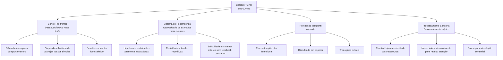

# Navegando O Mundo Da Parentalidade TDAH: Guia Especial Para Crianças De 6 Anos

> "Criar um filho de 6 anos com TDAH é como tentar ensinar um filhote de cachorro entusiasmado a seguir um percurso de obstáculos enquanto há fogos de artifício acontecendo ao redor – exige amor infinito, paciência extra e muito senso de humor."

Oi, aqui é a Carol! Como mãe de um menino com TDAH (agora com 9 anos) e psicopedagoga, passei por essa fase dos 6 anos e sei exatamente os desafios e alegrias que você está vivendo agora. É uma idade fascinante, cheia de curiosidade e energia, mas também marcada por grandes transições – a entrada no ensino fundamental, novas expectativas sociais e acadêmicas, e o crescente autoconhecimento da criança.

Se você está se perguntando "estou fazendo certo?", "por que é tão difícil?" ou "será que só o meu filho é assim?", quero te dizer: **você não está sozinho** e, mais importante, **você está no caminho certo** – porque está buscando entender e apoiar seu filho exatamente como ele é.

Este guia foi criado especificamente para crianças de 6 anos com TDAH, considerando as particularidades dessa fase. Vamos além de dicas genéricas – vamos entender o que realmente está acontecendo no cérebro do seu filho e transformar esse conhecimento em estratégias práticas que funcionam no dia a dia.

## 🧠 O Cérebro TDAH Aos 6 Anos: O Que Você Precisa Saber

Aos 6 anos, o cérebro está em pleno desenvolvimento, mas no TDAH, há algumas diferenças importantes que precisam ser compreendidas:

### O Que a Ciência Diz Sobre Isso?

As pesquisas mostram que no cérebro com TDAH aos 6 anos:

- **O córtex pré-frontal** (área responsável pela inibição de impulsos, planejamento e foco) tem maturação mais lenta – em média, cerca de 30% de atraso no desenvolvimento
- **A conexão entre o córtex pré-frontal e o sistema límbico** (centro emocional) ainda é frágil, resultando em reações emocionais intensas
- **O sistema de recompensa dopaminérgico** funciona diferentemente, dificultando a motivação para tarefas menos estimulantes
- **A percepção de tempo** é significativamente prejudicada – 5 minutos podem parecer uma eternidade ou passar em um instante

Isso significa que, em termos executivos, seu filho de 6 anos pode estar funcionando como uma criança de 4 anos em algumas áreas – **não por teimosia ou preguiça, mas por uma diferença neurobiológica real**.



### O Momento Especial Dos 6 Anos

Os 6 anos marcam uma transição importante do mundo predominantemente lúdico da educação infantil para o ambiente mais estruturado do ensino fundamental. Para crianças com TDAH, essa transição traz desafios específicos:

- Expectativa de permanecer sentado por períodos mais longos
- Necessidade de seguir instruções sequenciais mais complexas
- Primeiros deveres de casa formais
- Maior ênfase em habilidades de alfabetização e numeracia
- Desenvolvimento de amizades mais complexas e regras sociais

Entretanto, também é um momento de grandes oportunidades para intervenção:

- O cérebro está em fase de intensa neuroplasticidade (capacidade de formar novas conexões)
- Hábitos ainda não estão profundamente enraizados
- A autoestima está em formação e pode ser positivamente moldada
- A criança está desenvolvendo sua percepção de si mesma como aprendiz

> 💡 **Dica de Ouro:** Aos 6 anos, seu filho está formando crenças fundamentais sobre si mesmo como estudante, amigo e pessoa. A maneira como interpretamos seus comportamentos para ele nessa fase tem impacto profundo e duradouro.

## 🚀 Estratégias Práticas Para O Dia a Dia Com Seu Filho De 6 Anos

### 1. Rotinas Visuais: A Âncora Do Dia a Dia

**Por que funciona:** Crianças de 6 anos com TDAH têm memória de trabalho limitada e percepção temporal atípica. Rotinas visuais externalizam a sequência de eventos, reduzindo a carga cognitiva e criando previsibilidade.

**Como implementar para 6 anos:**

- Crie um "Painel do Dia" com imagens coloridas (não apenas palavras):

```markdown
# Meu Dia Especial

## Manhã 🌞
- [Foto da criança na cama] Acordar
- [Imagem de escova de dentes] Escovar dentes
- [Foto das roupas da criança] Vestir
- [Imagem de cereal/café] Tomar café
- [Foto da mochila] Preparar mochila
- [Imagem de carro/ônibus] Ir para escola

## Depois da Escola 🏠
- [Imagem de lanche] Hora do lanche
- [Foto de criança brincando] Tempo livre (30 min)
- [Imagem de livro/caderno] Lição de casa (15 min)
- [Foto de criança brincando] Mais tempo para brincar!
- [Imagem de jantar] Jantar em família
- [Série de 4-5 imagens] Rotina do banho
- [Imagem de livro de história] Hora da história
- [Foto da cama] Dormir
```

- **Adaptações para 6 anos:**
    - Use fotos reais do seu filho realizando as atividades
    - Mantenha sequências curtas (máximo 4-5 passos visíveis por vez)
    - Inclua marcadores temporais simples (usando relógios visuais)
    - Adicione elementos divertidos (personagens favoritos, adesivos)
    - Permita que a criança mova fisicamente um marcador/avatar pelo quadro

### 2. Tempo De Movimento Estratégico

**Por que funciona:** O cérebro TDAH precisa de movimento para regular-se. Aos 6 anos, a necessidade de movimento é ainda mais intensa, e incorporá-lo estrategicamente melhora significativamente a atenção e o comportamento.

**Como implementar para 6 anos:**

- **Regra dos 20/5:** Após cada 20 minutos de atividade sentada, proporcione 5 minutos de movimento intenso
- **"Recados de Movimento":** Transforme tarefas em desafios físicos ("Pule como sapo até o banheiro para escovar os dentes")
- **Estação de Movimento em Casa:** Crie um canto com:
    - Mini-trampolim (investimento valioso!)
    - Almofadas grandes para pular/rolar
    - Cordas de pular, bolinha fisioball
    - Fitas adesivas no chão formando circuitos
- **Aprendizagem em Movimento:**
    - Pratique contagem pulando em cada número
    - Recite o alfabeto jogando bola de um para outro
    - Use giz no quintal para escrever letras grandes que ele pode "percorrer"

> 💡 **Dica de Ouro:** Para uma criança de 6 anos com TDAH, ficar sentada por 20 minutos consecutivos pode ser tão desafiador quanto para um adulto ficar sentado por 2 horas em uma reunião tediosa. O movimento não é uma recompensa, mas uma necessidade fisiológica.

### 3. Comunicação Eficaz Com Crianças De 6 Anos

**Por que funciona:** O processamento verbal no TDAH pode ser mais lento, especialmente aos 6 anos. Técnicas de comunicação adaptadas reduzem sobrecarga e melhoram a compreensão.

**Estratégias específicas para 6 anos:**

1. **A Regra dos 6:** Limite instruções a frases de 6 palavras ou menos
    
    - Em vez de: "Pedro, vá para o seu quarto, troque de roupa, escove os dentes e depois desça para o jantar."
    - Use: "Pedro, hora de trocar de roupa." [Pausa e aguarde conclusão] "Agora, vamos escovar os dentes."
2. **Comunicação Visual + Verbal:**
    
    - Use gestos simples junto com palavras
    - Mostre imagens do que você está pedindo
    - Demonstre fisicamente quando possível
3. **Ferramentas de Conexão para 6 anos:**
    
    - **Técnica do "Olhos de Coruja":** Agache-se na altura dela, toque gentilmente o ombro e diga "Preciso dos seus olhos de coruja agora" (estabelece contato visual)
    - **"Eco do Entendimento":** Após instrução importante, peça "Me conta o que vamos fazer agora" (verifica compreensão)
    - **"Código Especial":** Estabeleça uma palavra-código divertida que significa "realmente preciso que você escute agora" (ex: "abracadabra" ou "super-poder")
4. **Scripts Eficazes para Momentos Desafiadores:**
    

|Situação|Frases Ineficazes|Frases Eficazes|
|---|---|---|
|Transição de atividade|"Já falei para parar de brincar agora!"|"5 minutos até guardar. Escolha: guardar tudo ou apenas os carrinhos?"|
|Comportamento impulsivo|"Quantas vezes preciso dizer para não correr na casa?"|"Pés de caminhada dentro. Pés de corrida lá fora."|
|Distração|"Presta atenção! Você nunca escuta!"|"Toque aqui [toque gentil]. Olhos nos meus. Uma coisa importante."|
|Explosão emocional|"Não tem motivo para todo esse choro!"|"Vejo que você está com raiva. Estou aqui quando estiver pronto."|

### 4. Gerenciando Meltdowns Aos 6 Anos

**Entendendo os gatilhos comuns aos 6 anos:**

- Transições entre atividades (especialmente interromper algo prazeroso)
- Fadiga executiva após dia escolar
- Fome ou sede (metabolismo acelerado)
- Sobrecarga sensorial (ambientes barulhentos, roupas desconfortáveis)
- Frustração com tarefas difíceis (especialmente alfabetização emergente)
- Injustiça percebida (muito comum nessa idade!)

**Estratégia A.C.A.L.M.A.R. para crianças de 6 anos:**

**A - Avaliar o gatilho**

- Observe padrões: hora do dia, antes/depois de quais atividades?
- Pense como detetive, não como juiz
- Anote gatilhos para identificar padrões

**C - Controle seu próprio estado emocional**

- Lembre-se: comportamento desafiador ≠ criança desafiadora
- Use sua própria técnica de respiração discreta
- Repita mentalmente: "Ele está tendo dificuldade, não causando dificuldade"

**A - Aproxime-se com calma**

- Agache-se ao nível dele (sem intimidar)
- Use voz baixa e calma
- Ofereça proximidade sem demandas imediatas

**L - Linguagem mínima, máximo apoio**

- Reduza comunicação verbal durante o auge
- Frases curtas: "Estou aqui" / "Você está seguro"
- Ofereça objeto de conforto familiar (bicho de pelúcia específico)

**M - Mantenha o espaço seguro**

- Bloqueie estímulos sensoriais (abaixe luzes, reduza sons)
- Para crianças de 6 anos: ofereça "tenda" improvisada com cobertor
- Remova plateia (irmãos, outros adultos) discretamente

**A - Acolha os sentimentos**

- Nomeie a emoção: "Parece que você está muito frustrado"
- Valide sem endossar comportamento: "É difícil parar de jogar quando está divertido"
- Para 6 anos: use metáforas simples ("sua raiva é como um vulcão agora")

**R - Retorno à calma com suporte**

- Ofereça opções simples de regulação: "Abraço apertado ou espaço tranquilo?"
- Use temporizador visual para mostrar "quanto tempo para acalmar"
- Transição gentil após crise: atividade calma e de baixa demanda

> 💡 **Dica de Ouro:** Para crianças de 6 anos com TDAH, a recuperação pós-meltdown pode levar até 30-40 minutos. Durante esse tempo, o cérebro está se reorganizando – não é momento para conversar sobre o comportamento ou "lições aprendidas" (isso vem muito depois).

### 5. Desenvolvendo Autoestima Positiva Aos 6 Anos

**Por que é crítico:** Aos 6 anos, crianças com TDAH começam a interiorizar mensagens sobre suas capacidades e valor. A comparação com colegas torna-se mais evidente, e os primeiros rótulos começam a surgir.

**Estratégias específicas para 6 anos:**

1. **Linguagem de Processo vs. Pessoa:**

|Evite (Linguagem de Pessoa)|Prefira (Linguagem de Processo)|
|---|---|
|"Você é um menino inteligente!"|"Você resolveu esse problema usando seu cérebro detetive!"|
|"Você está sendo desobediente."|"Está difícil seguir as instruções agora, não está?"|
|"Que menino distraído!"|"Parece que seu cérebro encontrou algo mais interessante!"|

2. **Ritual do "Momento Brilhante":**
    
    - Todas as noites antes de dormir, identifique junto:
        - Uma coisa em que se esforçou (mesmo pequena)
        - Um momento de bondade dele
        - Uma coisa que você admira/ama nele (seja específico!)
    - Para 6 anos: use uma "lanterna mágica" que ilumina enquanto vocês falam dos momentos brilhantes
3. **Álbum das Vitórias:**
    
    - Caderno físico decorado pelo próprio filho
    - A cada vitória (grande ou pequena), adicione:
        - Foto ou desenho da conquista
        - Breve descrição ditada pela criança
        - "Superpoder" usado (persistência, criatividade, coragem, etc.)
    - Para 6 anos: inclua carimbos, adesivos, desenhos coloridos
4. **Histórias Personalizadas:**
    
    - Crie histórias simples onde o protagonista é seu filho
    - Inclua desafios similares aos dele e como são superados
    - Destaque as forças reais da criança na história
    - Para 6 anos: desenhe as histórias juntos ou use fotos reais coladas

> 💡 **Dica de Ouro:** Aos 6 anos, seu filho ainda não separou completamente seu desempenho de seu valor pessoal. É vital destacar que todos temos áreas fortes e desafios – e que você ama todas as partes dele, não apenas quando se comporta "bem".

### 6. O Poder Do Brincar Intencional Aos 6 Anos

**Por que funciona:** Através da brincadeira, podemos fortalecer áreas de desenvolvimento cruciais para crianças com TDAH de forma natural e motivadora.

**Jogos específicos para 6 anos, por função executiva:**

#### Controle Inibitório (Parar, Pensar, Não Agir)

- **"Luz Vermelha, Luz Verde" Turbinado**
    
    - Versão 6 anos: Adicione comandos conflitantes ("Luz verde, mas ande como tartaruga")
    - Material: Apenas círculos coloridos (verde/vermelho)
    - Benefício: Fortalece a capacidade de interromper ações automáticas
- **"Dança e Congela"**
    
    - Versão 6 anos: Use músicas favoritas, congele em posições engraçadas
    - Material: Música, espaço para movimento
    - Benefício: Pratica controle motor e seguir comandos externos
- **"Sussurro e Grito"**
    
    - Versão 6 anos: Varie comandos ("Quando levanto mão, fale alto; quando abaixo, sussurre")
    - Material: Nenhum
    - Benefício: Controle de impulso vocal (difícil para TDAH)

#### Memória De Trabalho

- **"O Que Sumiu?"**
    
    - Versão 6 anos: Comece com 3-4 objetos, aumente gradualmente
    - Material: Pequenos brinquedos/objetos familiares, bandeja, toalha
    - Como jogar: Mostre objetos por 10 segundos, cubra, remova um secretamente, descubra
    - Benefício: Fortalece retenção visual na memória
- **"Missão de Espião"**
    
    - Versão 6 anos: "Leve esta mensagem secreta para a cozinha, traga de volta a colher azul"
    - Benefício: Treina seguir instruções sequenciais de 2-3 passos
- **"Batalha de Categorias"**
    
    - Versão 6 anos: Nomear itens de categoria simples (animais, comidas, cores)
    - Como jogar: Determine categoria; cada pessoa nomeia um item; não pode repetir
    - Benefício: Reforça recuperação de informação e organização mental

#### Flexibilidade Cognitiva

- **"Animal-Vegetal-Mineral"**
    
    - Versão 6 anos: Use imagens/cartões se necessário para apoio
    - Como jogar: Objeto secreto escolhido; perguntas de sim/não para adivinhar
    - Benefício: Desenvolve raciocínio categórico e mudança de estratégia
- **"Classificação Maluquinha"**
    
    - Versão 6 anos: Forneça elementos concretos (blocos, botões, cartas)
    - Como jogar: Classificar objetos de uma forma, depois mudar critério ("agora por cor, agora por tamanho")
    - Benefício: Pratica mudar regras mentais, essencial para adaptabilidade

#### Planejamento E Organização

- **"Caça ao Tesouro em 5 Passos"**
    
    - Versão 6 anos: Dicas visuais, mapa simples desenhado
    - Como jogar: Siga pistas sequenciais para encontrar tesouro escondido
    - Benefício: Prática de seguir sequência planejada
- **"Construtor Desafiado"**
    
    - Versão 6 anos: Use blocos grandes (Lego Duplo, blocos de madeira)
    - Como jogar: Mostre modelo simples por 10 segundos, depois criança reconstrói de memória
    - Benefício: Desenvolve planejamento visual-espacial e memória
- **"Bolsa Surpresa"**
    
    - Versão 6 anos: Use tema para selecionar itens (dia de praia, piquenique)
    - Como jogar: Tema anunciado; criança tem 2 minutos para reunir 5 itens necessários
    - Benefício: Pratica planejamento rápido baseado em categoria

> 💡 **Dica de Ouro:** Para crianças de 6 anos com TDAH, 15-20 minutos diários desses jogos têm mais impacto que sessões longas ocasionais. Incorpore-os em momentos de transição ou como parte da rotina de "descompressão" após a escola.

### 7. Preparando-se Para O Sucesso Escolar Aos 6 Anos

**Por que é crucial:** Aos 6 anos, as demandas escolares aumentam significativamente, com expectativas acadêmicas e sociais que desafiam as áreas mais frágeis no TDAH.

**Estratégias de parceria escola-casa para 6 anos:**

1. **Comunicação Proativa com a Escola**
    - Agende reunião nas primeiras semanas do ano letivo
    - Crie um "Perfil de Aprendizagem" simples para seu filho:

```markdown
# Perfil de Lucas - 6 anos

## Como Aprendo Melhor:
- Instruções curtas e visuais 📋
- Oportunidades frequentes de movimento 🏃‍♂️
- Feedback imediato e positivo 🌟
- Aprendizagem multissensorial (tocar, ver, ouvir, fazer) 👐

## Meus Superpoderes:
- Criatividade incrível e pensamento "fora da caixa" 🎨
- Excelente memória visual para coisas interessantes 👀
- Energia entusiástica para temas favoritos 🔋
- Grande empatia com amigos que estão tristes ❤️

## Meus Desafios:
- Esperar minha vez pode ser difícil ⏱️
- Às vezes fico "perdido" durante instruções longas 🧭
- Transições entre atividades precisam de aviso 🔄
- Posso ficar sobrecarregado com muito barulho 🔊

## O Que Funciona Para Mim:
- Timer visual para atividades ⏰
- Aviso de "5 minutos para terminar" 🖐️
- Local para movimento permitido quando necessário 🧘‍♂️
- Instruções divididas em passos pequenos 📝
- Parceiro para lembrar tarefas e materiais 👫
```

2. **Preparação Diária Para o Sucesso**
    
    - **Lista Visual de Verificação Matinal (adaptada para 6 anos):**
        - Use ícones/fotos para cada item necessário
        - Plastifique para usar marcador de quadro branco
        - Inclua apenas 5-6 itens para não sobrecarregar
    - **Ritual de "Preparo Mental":**
        - 5 minutos antes de sair: revisão rápida do dia
        - "Hoje é dia de educação física? O que precisamos lembrar?"
        - Para 6 anos: use objeto concreto como "lembrete mágico" para mensagens importantes
3. **Suporte para Lição de Casa aos 6 Anos**
    
    - Estabeleça horário consistente, preferencialmente após período de descanso
    - Duração apropriada: máximo 15-20 minutos por sessão
    - Ambiente otimizado:
        - Espaço livre de distrações visuais
        - Opções de postura: mesa tradicional, almofadão, em pé
        - "Caixa de ferramentas" com todos os materiais necessários
        - Opções de fidgets apropriados (massa de modelar, bolinha macia)
4. **Desenvolvendo Primeiras Habilidades de Autoadvocacia**
    
    - Ensine frases simples que seu filho pode usar:
        - "Preciso de ajuda para começar, por favor."
        - "Posso tentar de um jeito diferente?"
        - "Estou precisando de uma pausa de movimento."
    - Pratique através de role-play com bonecos/fantoches
    - Elogie especificamente quando ele usar essas frases

> 💡 **Dica de Ouro:** Aos 6 anos, seu filho ainda não tem habilidades para auto-representação completa. Você é seu principal advogado, mas pode começar a envolvê-lo gradualmente nas conversas sobre suas necessidades, construindo fundação para sua autodeterminação futura.

### 8. Desenvolvendo Habilidades Sociais Aos 6 Anos

**Por que é importante:** Aos 6 anos, as interações sociais tornam-se mais complexas. Crianças com TDAH frequentemente enfrentam rejeição devido à impulsividade, dificuldade em esperar e desafios em ler pistas sociais.

**Estratégias específicas para habilidades sociais aos 6 anos:**

1. **Treinamento de Habilidades Sociais por "Peças"**
    
    - Foque em uma habilidade por vez (2-3 semanas de prática)
    - Sequência recomendada para 6 anos:
        1. Esperar sua vez
        2. Entrar em brincadeiras em andamento
        3. Lidar com "não" de forma apropriada
        4. Expressar frustração com palavras
        5. Perceber espaço pessoal dos outros
2. **Método A.M.I.G.O. para ensinar cada habilidade:**
    
    - **A**presentar a habilidade com história/livro infantil relevante
    - **M**odelar explicitamente (demonstre você mesmo)
    - **I**mitação guiada (pratique juntos em casa)
    - **G**eneralização gradual (pratique em contextos variados)
    - **O**portunidades estruturadas (crie situações de prática com suporte)
3. **Ferramentas visuais de suporte social:**
    
    - **Medidor de Voz:** Visual mostrando níveis de volume apropriados para diferentes situações
    - **Mapa de Distância:** Círculos concêntricos mostrando espaço apropriado para diferentes pessoas
    - **Scripts Sociais Ilustrados:** Cartões com frases e passos para situações comuns:
        - "Como pedir para brincar"
        - "O que fazer quando me sinto frustrado"
        - "Como cumprimentar um amigo"
4. **Encontros planejados de brincadeira:**
    
    - Comece com apenas 1 amigo (idealmente calmo e tolerante)
    - Duração ideal para 6 anos: 1 hora no máximo
    - Estrutura clara:
        - Atividade inicial estruturada (quebra-gelo)
        - Opções limitadas para brincadeira livre (2-3 escolhas)
        - Suporte adulto próximo mas não intrusivo
        - Encerramento claro antes de fadiga

> 💡 **Dica de Ouro:** Muitas crianças com TDAH aos 6 anos se dão melhor com amigos ligeiramente mais novos (que têm expectativas sociais similares) ou ligeiramente mais velhos (que podem ter mais paciência e estruturar brincadeiras). Agende encontros com essas crianças para experiências sociais positivas.

## 🛠️ Ferramentas Visuais Essenciais Para Crianças De 6 Anos Com TDAH

### 1. Sistema De Fichas Simplificado

Para crianças de 6 anos, um sistema de recompensas visual e imediato pode ser extremamente eficaz:

```markdown
# Meu Quadro de Estrelas Especiais

## Missões Diárias:
⭐ Escovar dentes sozinho (manhã e noite)
⭐ Guardar brinquedos no baú
⭐ Vestir-se com ajuda mínima
⭐ Usar "palavras para sentimentos" quando frustrado
⭐ Fazer a lição de casa em "tempo de foco"

## Recompensas:
5 estrelas = 15 minutos de tempo especial com mamãe/papai
10 estrelas = Escolher sobremesa especial
15 estrelas = Programa de fim de semana especial
20 estrelas = Presente pequeno da "caixa de tesouros"
```

**Adaptações para 6 anos:**

- Use estrelas ou adesivos reais (não apenas marcas)
- Ofereça recompensas pequenas e frequentes (diárias/semi-diárias)
- Celebre visualmente (dance, faça soar um sino, tire foto)
- Foque em comportamentos positivos, não em eliminar negativos
- Garanta sucesso: comece com metas que você sabe que ele pode alcançar

### 2. Menu De Regulação Emocional Para 6 Anos

Crie um pôster visual com opções para quando as emoções ficam intensas:

```mermaid
graph TD
    A[Como Me Acalmar<br/>Quando Estou...<br/>] --> B[BRAVO 😠]
    A --> C[TRISTE 😢]
    A --> D[EMPOLGADO DEMAIS 🤪]
    A --> E[PREOCUPADO 😨]
    
    B --> B1[Apertar almofada de raiva]
    B --> B2[Contar até 5 e respirar fundo]
    B --> B3[Pular 10 vezes]
    
    C --> C1[Abraçar meu urso especial]
    C --> C2[Ir para cantinho calmo]
    C --> C3[Pedir abraço]
    
    D --> D1[Correr em círculos no quintal]
    D --> D2[Fazer polichinelos]
    D --> D3[Dançar música agitada]
    
    E --> E1[Esconder no "forte" seguro]
    E --> E2[Respirar com bolhas de sabão]
    E --> E3[Segurar mão de adulto]
```

**Como usar:**

- Referir-se ao menu antes que a crise aconteça
- Praticar todas as técnicas em momentos calmos
- Adicionar fotos reais da criança fazendo cada estratégia
- Celebrar quando usar uma estratégia independentemente

### 3. Cronogramas Visuais Para Transições Difíceis

Crie sequências visuais para momentos particularmente desafiadores:

**Sequência Visual: Hora do Banho**

1. [Imagem de brinquedos] Escolher 2 brinquedos para o banho
2. [Imagem de roupas limpas] Separar pijama e roupas de baixo
3. [Imagem de criança tirando camiseta] Tirar roupa
4. [Imagem de banheira] Entrar na água (testar temperatura primeiro!)
5. [Imagem de xampu] Lavar cabelo
6. [Imagem de sabonete] Lavar corpo
7. [Imagem de brincadeira] Tempo para brincar (5 minutos)
8. [Imagem de toalha] Secar-se
9. [Imagem de pijama] Vestir pijama
10. [Imagem de escova] Escovar dentes

**Como implementar para 6 anos:**

- Plastifique para usar no banheiro
- Adicione elemento "mágico" de motivação (personagem favorito guiando)
- Use timer visual para partes específicas (especialmente "tempo para brincar")
- Ofereça escolhas dentro da estrutura ("shampoo azul ou verde?")

## 🏫 Comunicação Eficaz Com a Escola Para Crianças De 6 Anos

### Modelo De E-mail Para Professor

```markdown
Assunto: Parceria para apoiar Lucas (6 anos) - Algumas dicas que funcionam bem

Prezada Professora Ana,

Espero que esteja bem! Estou entrando em contato para compartilhar algumas estratégias que têm funcionado bem para o Lucas em casa, e que talvez possam ser úteis em sala de aula.

Como conversamos brevemente, Lucas tem TDAH, o que significa que seu cérebro processa informações e regula a atenção de forma um pouco diferente. Ele é um menino brilhante e entusiasmado, mas algumas adaptações simples fazem uma grande diferença em seu sucesso.

**O que funciona bem para Lucas:**

1. **Instruções visuais:** Quando possível, acompanhar comandos verbais com demonstração visual ou imagens.

2. **Posicionamento na sala:** Ele se concentra melhor sentado mais próximo à professora e longe de distrações como janelas ou portas.

3. **Pausas de movimento:** Pequenas oportunidades para movimento a cada 20-30 minutos ajudam muito sua concentração (como buscar material, apagar a lousa, organizar livros).

4. **Sinal discreto:** Temos um sinal combinado (tocar levemente o ombro) para redirecioná-lo quando ele "desliga" sem chamar atenção dos colegas.

5. **Organização:** Lucas se beneficia de lembretes para verificar se guardou todos os materiais. Uma lista visual de verificação na mesa tem sido útil.

Entendo completamente os desafios de atender às necessidades de uma turma inteira. Qualquer adaptação, mesmo pequena, que seja possível implementar será muito apreciada.

Estou disponível para conversar mais e apoiar de qualquer forma que ajude. Poderíamos marcar uma breve reunião nas próximas semanas para acompanhar como Lucas está se adaptando?

Muito obrigada por seu apoio e dedicação!

Atenciosamente,
[Seu nome]
```

### Lista De Verificação Para Reuniões Escolares

Para reuniões com a professora ou equipe escolar, prepare-se com:

- **Antes da Reunião:**
    
    - Lista de 3 principais preocupações (específicas, não genéricas)
    - Lista de 3 pontos fortes do seu filho
    - 2-3 estratégias que funcionam bem em casa
    - Fotos/exemplos do trabalho do seu filho mostrando tanto capacidades quanto desafios
    - Cópias do perfil de aprendizagem do seu filho
- **Durante a Reunião:**
    
    - Comece com positivo: "Agradeço X que você já está fazendo..."
    - Use linguagem colaborativa: "Como podemos juntos..."
    - Faça perguntas específicas: "Como ele responde quando..."
    - Documente acordos e próximos passos
- **Após a Reunião:**
    
    - E-mail de acompanhamento resumindo pontos principais
    - Implemente em casa qualquer estratégia sugerida
    - Marque data para verificação de progresso

> 💡 **Dica de Ouro:** Aos 6 anos, as adaptações mais valiosas geralmente são as mais simples: posicionamento estratégico na sala, instruções visuais, oportunidades de movimento e muito reforço positivo. Foque nestas adaptações de "baixo custo, alto impacto" nas discussões escolares.

## 👨‍👩‍👧‍👦 TDAH, Irmãos E Dinâmica Familiar

### Estratégias Para Equilíbrio Familiar Com Uma Criança De 6 Anos Com TDAH

1. **Explicando TDAH para Irmãos (adaptado por idade):**
    
    - **Para irmãos mais novos (2-4 anos):** "O cérebro do João trabalha de um jeito especial. Às vezes ele precisa se mexer muito para pensar."
    - **Para irmãos mais velhos (7-10 anos):** "O TDAH é como ter um carro de corrida super potente mas com freios que ainda estão aprendendo a funcionar."
2. **Sistema de "Tempo Especial" Garantido:**
    
    - 10-15 minutos diários de atenção exclusiva para CADA filho
    - Programado em horário visível para todos
    - Atividade escolhida pela criança
    - Garantido mesmo em dias difíceis (nunca cancelado como punição)
    - Pode ser dividido em 2 blocos de 5-7 minutos se necessário
3. **Regras Claras Sobre Comportamento Fraternal:**
    
    - Estabeleça 3-5 regras familiares não-negociáveis (ex: "Não machucamos o corpo ou os sentimentos")
    - Consequências claras e consistentes para todos os filhos
    - Evite comparações ("Por que não pode ser comportado como sua irmã?")
    - Reconheça diferentes necessidades sem rotular como "injusto"
4. **Ferramentas de Resolução de Conflitos Fraternos:**
    
    - "Cadeira da Conversa" com objeto de "quem fala" (só quem segura o objeto pode falar)
    - Timer visual para garantir tempo igual de fala
    - Formulário simples de "Resolução de Problemas":
        1. Qual é o problema? (cada um desenha/dita sua versão)
        2. Como cada pessoa se sente? (escolher de cartões de emoções)
        3. Ideias para resolver? (listar mesmo as "malucas")
        4. Escolher uma solução para tentar

> 💡 **Dica de Ouro:** Evite posicionar o irmão neurotípico como "ajudante" ou "modelo" para a criança com TDAH. Isso cria ressentimento de ambos os lados. Em vez disso, reconheça as forças e desafios únicos de cada criança.

## 📱 Tecnologia Como Aliada Para Crianças De 6 Anos Com TDAH

### Aplicativos Recomendados Para 6 Anos

**Para Organização e Rotinas:**

- **Choiceworks:** Criação de rotinas visuais, quadros de primero-depois, temporizadores
- **Timers visuais digitais:** Time Timer, Visual Timer
- **Sequencer:** Criação de sequências visuais para tarefas

**Para Desenvolvimento de Funções Executivas:**

- **Shifu Plugo:** Jogos físico-digitais para atenção e controle inibitório
- **Toca Lab/Toca Kitchen:** Jogos de sequenciamento e causa-efeito
- **Bugs and Buttons:** Mini-jogos para foco e precisão

**Para Regulação Emocional:**

- **Breathe, Think, Do with Sesame:** Estratégias de autorregulação com personagens conhecidos
- **Moshi:** Meditações e histórias para acalmar adaptadas para crianças
- **Zones of Regulation:** Identificação e gestão emocional

### Diretrizes Para Uso Saudável De Tecnologia Aos 6 Anos

1. **Tempo de Tela Estruturado:**
    
    - Blocos de 20-30 minutos máximo
    - Uso de timer visual concreto (não apenas no próprio dispositivo)
    - Horários consistentes (previsibilidade)
2. **Transições Planejadas:**
    
    - Aviso de 5 minutos antes do fim
    - "Ritual de fechamento" consistente (salvar progresso, agradecer o tempo, guardar em lugar específico)
    - Atividade de transição planejada previamente
3. **Seleção Cuidadosa:**
    
    - Evite jogos com recompensas aleatórias/imprevisíveis (particularmente estimulantes para TDAH)
    - Prefira apps com:
        - Progressão clara de dificuldade
        - Feedback imediato
        - Elementos educativos/desenvolvimento
        - Ausência de propaganda ou compras

> 💡 **Dica de Ouro:** A tecnologia não é inerentemente boa ou má para crianças com TDAH - é uma ferramenta que pode ajudar ou prejudicar dependendo de como é utilizada. Use-a estrategicamente, não como "babá eletrônica" ou recompensa primária.

## 🌟 Celebrando Pequenas Vitórias: O Coração Da Parentalidade TDAH

Criar uma criança de 6 anos com TDAH é como correr uma maratona, não uma corrida de 100 metros. A chave para a resiliência parental é reconhecer e celebrar os pequenos passos de progresso ao longo do caminho.

### Mantenha Um "Diário De Vitórias"

Em um caderno simples, anote:

- Primeira vez que completou uma rotina com menos lembretes
- Momento em que usou palavras em vez de explosão
- Dia em que a professora deu feedback positivo
- Ocasião em que notou ele usando estratégia por conta própria

Revise este diário nos dias difíceis para manter perspectiva.

### Práticas De Autocuidado Parental

**Micro-pausas regenerativas (1-5 minutos):**

- Respiração profunda consciente por 2 minutos
- Alongamento rápido focando em tensão nos ombros/pescoço
- Hidratação consciente (beber água lentamente, sentindo o líquido)
- Visualização de local tranquilo por 3 respirações completas

**Mantras para momentos desafiadores:**

- "Isto também passará"
- "Estou fazendo o melhor que posso com as ferramentas que tenho"
- "Comportamento difícil = Necessidade não atendida"
- "Não preciso ser perfeito, só preciso ser presente"

**Construa sua rede de apoio:**

- Identifique pelo menos 2-3 pessoas que "entendem" (outros pais de crianças com TDAH, grupos online)
- Compartilhe este guia com seu parceiro/outros cuidadores para consistência
- Considere suporte profissional para você também (não apenas para seu filho)

## 💫 Palavras Finais: A Jornada Aos 6 Anos

Seu filho de 6 anos com TDAH não é apenas um conjunto de desafios a serem gerenciados – ele é uma pessoa maravilhosamente complexa com forças únicas que o mundo precisa. O TDAH traz dificuldades reais, mas também pode trazer criatividade extraordinária, empatia profunda, paixão contagiante e maneiras inovadoras de ver o mundo.

Aos 6 anos, você está ajudando a moldar não apenas comportamentos, mas a própria identidade emergente do seu filho. A maneira como você fala sobre e responde ao TDAH agora terá ecos no autoconceito dele por anos.

Lembre-se sempre:

> O maior presente que você pode dar ao seu filho não é perfeitamente gerenciar todos os seus comportamentos, mas amá-lo incondicionalmente exatamente como ele é, enquanto o ajuda a navegar um mundo que nem sempre entende como seu cérebro funciona.

Você não precisa ser perfeito nesta jornada – só precisa ser persistente, adaptável e amoroso. Nos dias mais difíceis, lembre-se de olhar para o rosto do seu filho de 6 anos e ver não apenas os desafios do presente, mas o incrível potencial para o futuro que você está ajudando a nutrir.

Esta fase dos 6 anos é intensa, mas passageira. Com seu apoio amoroso e estratégias adequadas, seu filho não apenas sobreviverá a este período – ele florescerá, desenvolvendo força interior e habilidades que o acompanharão por toda a vida.

---

## 📚 Recursos Especiais Para Pais De Crianças De 6 Anos Com TDAH

### Livros Recomendados

- "Cérebro TDAH em Desenvolvimento: Guia para Primeira Infância" - Ana Beatriz B. Silva
- "Disciplina Positiva para Crianças com Déficit de Atenção" - Jane Nelsen e Kelly Pfeiffer
- "O Cérebro da Criança" - Daniel J. Siegel
- "Meu Filho Não Para Quieto! E Agora?" - Luis Rohde e Adriana Barbosa
- "Força Diferente: Como Transformar as Peculiaridades do TDAH em Superpoderes" - Edward Hallowell

### Literatura Infantil Para Explicar TDAH (6 anos)

- "Pedro Pestinha" - Kate Gaynor
- "O Cerebrozinho de Dudu" - Daniela Fraga
- "Rodrigo Não Quer Usar Seus Óculos TDAH" - Liana Castello
- "Aí Vem o Zé Distraído" - Maria Almeida

### Materiais Pedagógicos Especiais

- Dado das Emoções (para trabalhar identificação emocional)
- Relógio Time Timer (versão física do timer visual)
- Almofadas sensoriais para sentar
- "Garrafas da Calma" caseiras
- Quadros magnéticos para rotinas

### Redes De Apoio Online

- Grupo Facebook "Mães e Pais de Crianças com TDAH - Brasil"
- Fórum ABDA para famílias
- Canal YouTube "TDAH e Desenvolvimento Infantil" - Dra. Paula Rocha
- Instagram @criarcriancascomneurodiversidade

---

**Nota:** Este guia é informativo e baseado em práticas e conhecimentos atuais. Cada criança com TDAH é única, e as estratégias devem ser adaptadas às necessidades individuais. Sempre consulte profissionais de saúde qualificados para diagnóstico e tratamento.

[[Entendendo o Cérebro TDAH aos 6 Anos]] | [[Rotinas Visuais para TDAH]] | [[Gerenciando Crises e Meltdowns]] | [[Comunicação Eficaz com a Escola]] | [[Brincadeiras Terapêuticas para TDAH]]