# 🌐 Glossário Definitivo da Era da Inteligência Artificial 2025

> _"O futuro já chegou - ele só não está uniformemente distribuído" - William Gibson_

## 📋 Índice Visual

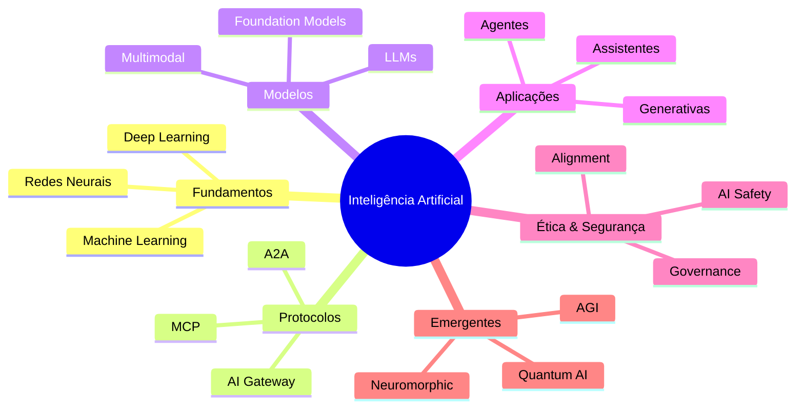

## 🚀 Novidades 2025

### Arquiteturas Emergentes

|Termo|Descrição|
|---|---|
|**Mamba Architecture**|Nova arquitetura que supera transformers em eficiência, mantendo performance superior em sequências extremamente longas.|
|**Mixture of Experts (MoE) 2.0**|Evolução dos modelos MoE com roteamento dinâmico e especialistas heterogêneos para máxima eficiência.|
|**Sparse Activation Networks**|Redes que ativam apenas partes específicas do modelo, reduzindo custos computacionais em até 90%.|
|**Cross-Modal Attention**|Mecanismo de atenção que permite transferência de conhecimento entre diferentes modalidades de dados.|

### Paradigmas de Desenvolvimento

|Termo|Descrição|
|---|---|
|**AI/UX Design**|Disciplina emergente que integra princípios de IA no design de experiência do usuário.|
|**Prompt Engineering 2.0**|Evolução que inclui técnicas avançadas como chain-of-density, structured prompting e meta-prompting.|
|**Adaptive RAG**|RAG que ajusta dinamicamente sua estratégia de recuperação baseada no contexto da consulta.|
|**Continuous Learning Systems**|Sistemas que aprendem continuamente sem necessidade de re-treinamento completo.|

## 🧠 Fundamentos de IA

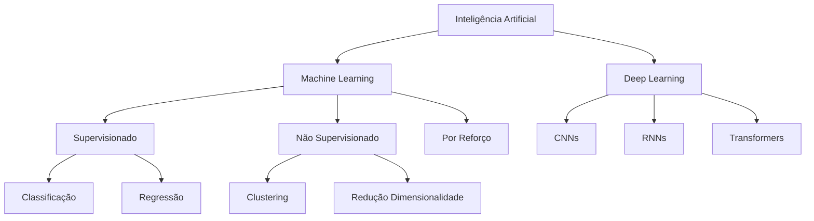

### Conceitos Base

|Termo|Descrição|
|---|---|
|**Aprendizado de Máquina (Machine Learning)**|Algoritmos que identificam padrões em dados e aprendem a fazer previsões ou decisões sem programação explícita.|
|**Redes Neurais**|Sistemas computacionais biomimeticamente inspirados, compostos por camadas de neurônios artificiais interconectados.|
|**Aprendizado Profundo (Deep Learning)**|Subconjunto de ML que utiliza redes neurais com múltiplas camadas (deep) para aprender representações hierárquicas.|
|**Processamento de Linguagem Natural (PLN)**|Campo interdisciplinar que combina linguística e IA para processar e analisar linguagem humana.|
|**Visão Computacional**|Área que desenvolve técnicas para que máquinas interpretem e analisem conteúdo visual do mundo real.|
|**Aprendizado por Reforço**|Paradigma onde agentes aprendem através de interações com ambiente, maximizando recompensas cumulativas.|

### Técnicas de Aprendizado

|Termo|Descrição|
|---|---|
|**Transfer Learning**|Reutilização de conhecimento adquirido em um domínio para acelerar aprendizado em outro relacionado.|
|**Meta-Learning**|"Aprender a aprender" - técnicas que permitem modelos se adaptarem rapidamente a novas tarefas.|
|**Federated Learning**|Treinamento distribuído que mantém dados locais, compartilhando apenas atualizações de modelo.|
|**Self-Supervised Learning**|Aprendizado que cria suas próprias labels a partir da estrutura intrínseca dos dados.|
|**Contrastive Learning**|Técnica que aprende representações distinguindo exemplos similares de dissimilares.|

## 🏗️ Protocolos e Infraestrutura

### Stack Moderno de IA

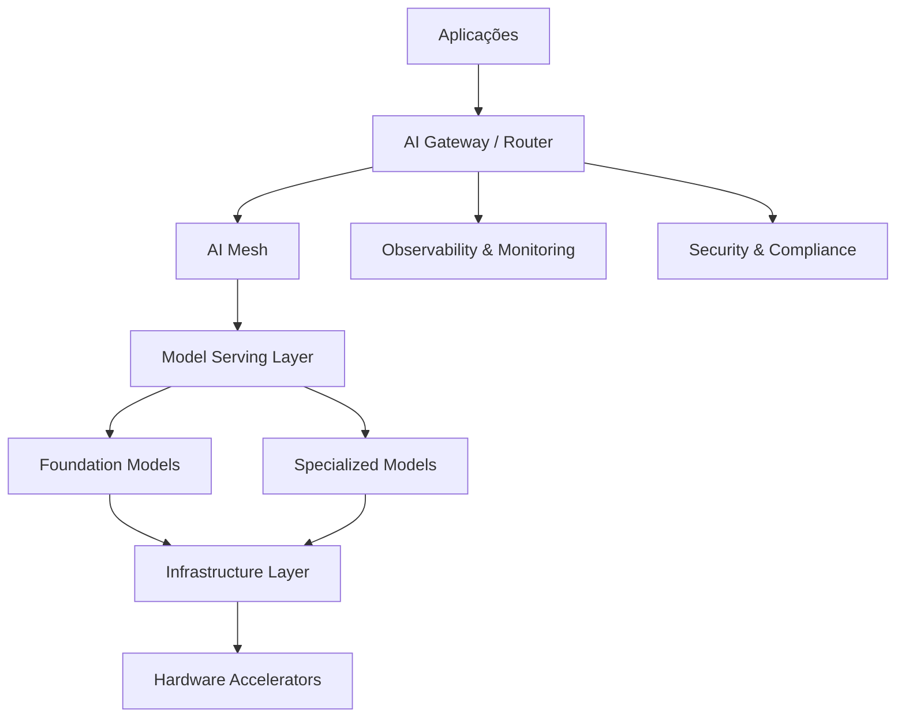

### Protocolos e Padrões

|Termo|Descrição|
|---|---|
|**MCP (Model Context Protocol)**|Padrão aberto que define como aplicações compartilham contexto com modelos de IA.|
|**A2A (Agent-to-Agent)**|Protocolo de comunicação padronizado para colaboração entre agentes autônomos.|
|**AI Gateway**|Camada de abstração que gerencia roteamento, rate limiting e observabilidade para requisições de IA.|
|**AI Mesh**|Arquitetura de rede que conecta serviços de IA distribuídos, similar ao service mesh.|
|**Vector Database**|Banco otimizado para armazenar e consultar embeddings vetoriais com alta eficiência.|
|**LLMOps**|Conjunto de práticas para operacionalizar LLMs em produção, incluindo versionamento e monitoramento.|

### Infraestrutura e Deployment

|Termo|Descrição|
|---|---|
|**Edge AI**|Execução de inferência IA em dispositivos locais, reduzindo latência e dependência de rede.|
|**AI Orchestration**|Plataformas que coordenam workflows complexos envolvendo múltiplos modelos e serviços.|
|**Model Registry**|Sistema centralizado para versionamento, catalogação e governança de modelos ML.|
|**Feature Store**|Repositório centralizado para features ML, garantindo consistência entre treino e produção.|
|**AI Observability**|Práticas e ferramentas para monitorar comportamento, performance e saúde de sistemas IA.|

## 🤖 Modelos e Arquiteturas

### Evolução das Arquiteturas

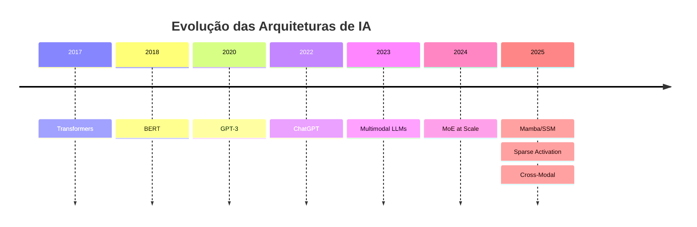

### Arquiteturas Fundamentais

|Termo|Descrição|
|---|---|
|**Transformers**|Arquitetura que revolucionou NLP com mecanismo de self-attention, processando sequências em paralelo.|
|**State Space Models (SSM)**|Alternativa aos transformers com complexidade linear, excelente para sequências longas.|
|**Mamba Architecture**|Implementação eficiente de SSM que compete com transformers em qualidade e supera em eficiência.|
|**Mixture of Experts (MoE)**|Arquitetura que ativa dinamicamente subconjuntos de parâmetros específicos para cada entrada.|

### Tipos de Modelos

|Termo|Descrição|
|---|---|
|**Large Language Models (LLMs)**|Modelos de linguagem massivos treinados em vastos corpora textuais.|
|**Multimodal Models**|Sistemas que processam e geram múltiplas modalidades (texto, imagem, áudio, vídeo).|
|**Foundation Models**|Modelos base pré-treinados que servem como fundação para múltiplas tarefas downstream.|
|**Small Language Models (SLMs)**|Modelos otimizados para eficiência, mantendo capacidades específicas de LLMs.|
|**Domain-Specific Models**|Modelos especializados em domínios específicos (medicina, direito, finanças).|

## 🛠️ Técnicas e Metodologias

### Pipeline de Desenvolvimento IA

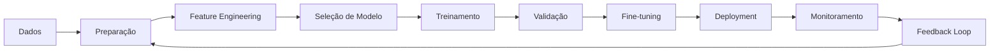

### Técnicas Avançadas

|Termo|Descrição|
|---|---|
|**RAG (Retrieval-Augmented Generation)**|Arquitetura que combina recuperação de informação com geração, fundamentando respostas em conhecimento externo.|
|**RLHF (Reinforcement Learning from Human Feedback)**|Técnica de alinhamento que usa feedback humano para treinar modelos via RL.|
|**Constitutional AI**|Método de treinamento que incorpora princípios éticos diretamente no processo de aprendizado.|
|**Chain-of-Thought Prompting**|Técnica que induz modelos a explicitar raciocínio passo-a-passo.|
|**In-Context Learning**|Capacidade de modelos aprenderem tarefas através de exemplos no prompt, sem fine-tuning.|

### Otimização e Eficiência

|Termo|Descrição|
|---|---|
|**Model Quantization**|Redução da precisão numérica de modelos para melhorar eficiência computacional.|
|**Knowledge Distillation**|Transferência de conhecimento de modelo grande (teacher) para menor (student).|
|**LoRA (Low-Rank Adaptation)**|Técnica eficiente de fine-tuning que adapta apenas uma pequena fração dos parâmetros.|
|**Flash Attention**|Implementação otimizada de attention mechanism que acelera transformers significativamente.|
|**Gradient Checkpointing**|Técnica que troca memória por computação, permitindo treinar modelos maiores.|

## 🎨 Aplicações Generativas

### Ecossistema Generativo

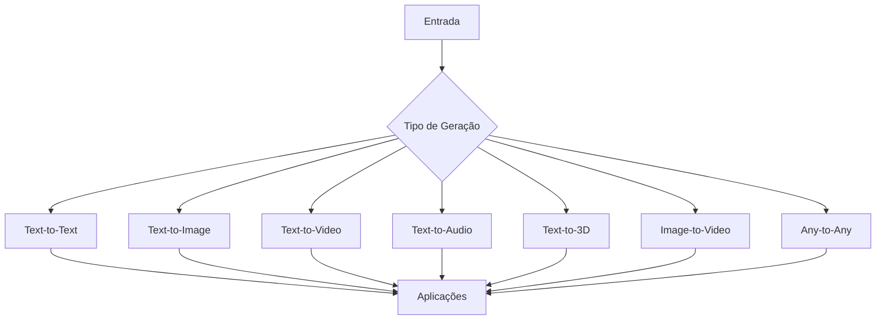

### Modalidades Generativas

|Termo|Descrição|
|---|---|
|**Text-to-Image**|Geração de imagens fotorrealistas ou artísticas a partir de descrições textuais.|
|**Text-to-Video**|Criação de vídeos completos com movimento e coerência temporal a partir de prompts.|
|**Text-to-3D**|Geração de modelos 3D e cenas completas a partir de descrições textuais.|
|**Image-to-Video**|Animação de imagens estáticas criando movimento e narrativa visual.|
|**Text-to-Audio**|Síntese de música, efeitos sonoros e fala a partir de instruções textuais.|
|**Code Generation**|Modelos especializados em gerar, completar e refatorar código em múltiplas linguagens.|

## 🤝 Agentes e Sistemas Autônomos

### Arquitetura de Agentes

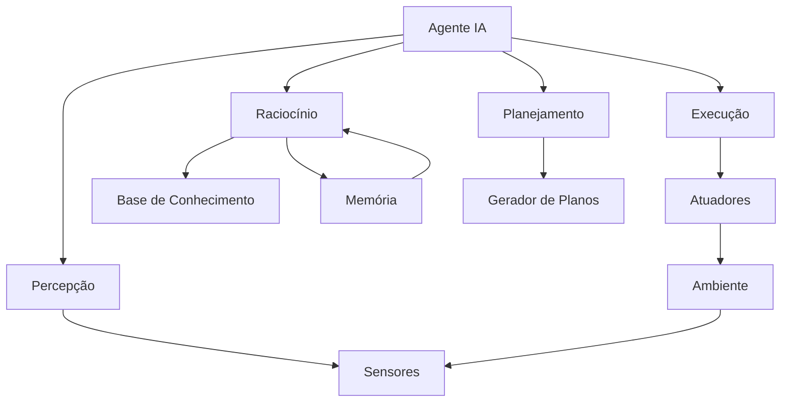

### Tipos de Agentes

| Termo                    | Descrição                                                             |
| ------------------------ | --------------------------------------------------------------------- |
| **Reactive Agents**      | Agentes que respondem diretamente a estímulos sem estado interno.     |
| **Deliberative Agents**  | Agentes com modelo interno do mundo que planejam antes de agir.       |
| **Learning Agents**      | Agentes que melhoram performance através de experiência.              |
| **Collaborative Agents** | Sistemas multi-agente que trabalham juntos para objetivos comuns.     |
| **Autonomous AI Agents** | Agentes com alto grau de autonomia para tomada de decisão e execução. |

### Capacidades e Ferramentas

|Termo|Descrição|
|---|---|
|**Function Calling**|Habilidade de modelos invocarem funções externas dinamicamente.|
|**Tool Use**|Capacidade de utilizar APIs, bases de dados e outras ferramentas externas.|
|**Task Decomposition**|Quebra de tarefas complexas em subtarefas gerenciáveis.|
|**Memory Systems**|Implementações de memória de curto e longo prazo para agentes.|
|**Goal-Oriented Behavior**|Comportamento direcionado por objetivos com planejamento adaptativo.|

## 🛡️ Ética, Segurança e Governança

### Framework de IA Responsável

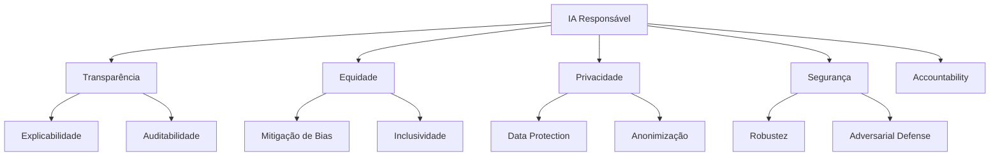

### Princípios e Práticas

|Termo|Descrição|
|---|---|
|**AI Alignment**|Garantir que sistemas IA ajam de acordo com valores e objetivos humanos.|
|**AI Safety**|Campo dedicado a mitigar riscos existenciais e catastróficos da IA avançada.|
|**Explainable AI (XAI)**|Métodos para tornar decisões de IA interpretáveis e compreensíveis para humanos.|
|**Algorithmic Fairness**|Garantir que sistemas IA não discriminem ou perpetuem preconceitos.|
|**Privacy-Preserving AI**|Técnicas que protegem privacidade individual durante treinamento e inferência.|

### Governança e Compliance

|Termo|Descrição|
|---|---|
|**AI Governance Framework**|Estrutura organizacional para supervisionar desenvolvimento e uso de IA.|
|**Model Cards**|Documentação padronizada sobre características, limitações e uso apropriado de modelos.|
|**AI Impact Assessment**|Avaliação sistemática de impactos potenciais de sistemas IA.|
|**Red Teaming**|Teste adversarial para identificar vulnerabilidades e comportamentos indesejados.|
|**AI Audit Trail**|Registro completo de decisões e ações de sistemas IA para accountability.|

## 🔮 Tecnologias Emergentes e Futuro

### Horizonte Tecnológico

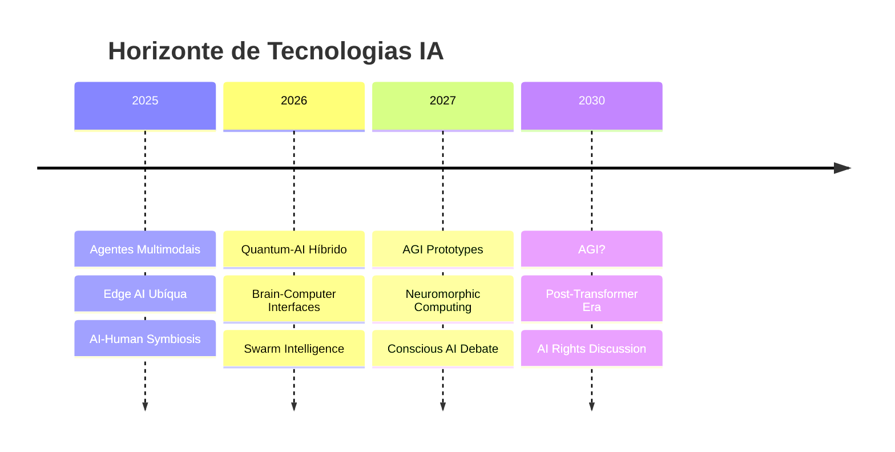

### Fronteiras da IA

|Termo|Descrição|
|---|---|
|**Artificial General Intelligence (AGI)**|IA hipotética com capacidade cognitiva geral equivalente ou superior à humana.|
|**Neuromorphic Computing**|Hardware que emula arquitetura e funcionamento do cérebro biológico.|
|**Quantum AI**|Integração de computação quântica com algoritmos de IA para aceleração exponencial.|
|**Brain-Computer Interfaces**|Interfaces diretas entre cérebro e sistemas computacionais.|
|**Artificial Consciousness**|Questão aberta sobre possibilidade de consciência em sistemas artificiais.|

### Paradigmas Emergentes

|Termo|Descrição|
|---|---|
|**Embodied AI**|IA que interage com mundo físico através de corpos robóticos.|
|**Swarm Intelligence**|Inteligência emergente de colaboração de múltiplos agentes simples.|
|**Hybrid Human-AI Systems**|Sistemas que integram seamlessly capacidades humanas e artificiais.|
|**Bio-Inspired AI**|Arquiteturas inspiradas em sistemas biológicos além de redes neurais.|
|**Collective Intelligence**|Combinação sinérgica de inteligência humana e artificial em escala.|

## 💼 Mercado e Indústria

### Ecossistema de IA

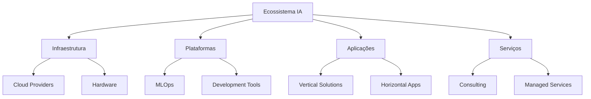

### Modelos de Negócio

|Termo|Descrição|
|---|---|
|**AI-as-a-Service (AIaaS)**|Modelo de entrega de capacidades IA via APIs ou plataformas cloud.|
|**AI-Native Companies**|Empresas construídas desde início com IA como componente central.|
|**Vertical AI Solutions**|Soluções específicas para indústrias (healthcare, legal, finance).|
|**AI Marketplaces**|Plataformas para descoberta e distribuição de modelos e aplicações IA.|
|**AI Infrastructure Providers**|Empresas focadas em hardware e software base para IA.|

### Tendências de Mercado

|Termo|Descrição|
|---|---|
|**Democratização da IA**|Movimento para tornar IA acessível a desenvolvedores e empresas de todos tamanhos.|
|**AI Skills Gap**|Disparidade entre demanda e oferta de profissionais qualificados em IA.|
|**AI Value Chain**|Cadeia completa de valor desde dados até aplicações finais de IA.|
|**ROI de IA**|Métricas e metodologias para medir retorno sobre investimento em IA.|
|**AI Maturity Model**|Framework para avaliar maturidade organizacional em adoção de IA.|

## 🌍 Impacto Social e Transformação

### Dimensões do Impacto

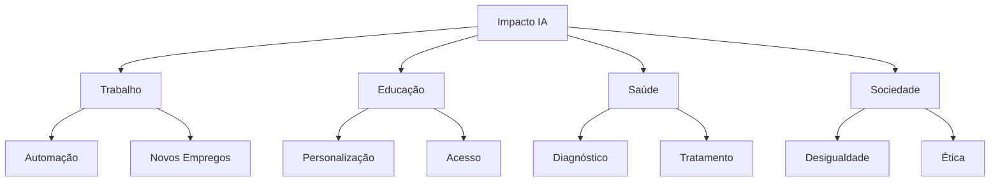

### Transformações Sociais

|Termo|Descrição|
|---|---|
|**AI Literacy**|Competências necessárias para compreender e interagir efetivamente com IA.|
|**Future of Work**|Transformação do trabalho com automação e augmentação humana por IA.|
|**AI Divide**|Disparidade no acesso e benefícios da IA entre diferentes grupos sociais.|
|**Human-AI Collaboration**|Novos modelos de trabalho que combinam forças humanas e artificiais.|
|**AI in Education**|Transformação do ensino com tutores IA e aprendizado personalizado.|

### Desafios e Oportunidades

|Termo|Descrição|
|---|---|
|**Job Displacement**|Potencial substituição de empregos por automação IA.|
|**Skill Augmentation**|Ampliação de capacidades humanas através de ferramentas IA.|
|**Digital Transformation**|Reimaginação completa de processos e modelos de negócio com IA.|
|**Societal Benefits**|Potencial da IA para resolver grandes desafios globais.|
|**Regulatory Challenges**|Necessidade de frameworks regulatórios apropriados para IA.|

## 📚 Recursos e Aprendizado

### Jornada de Aprendizado IA

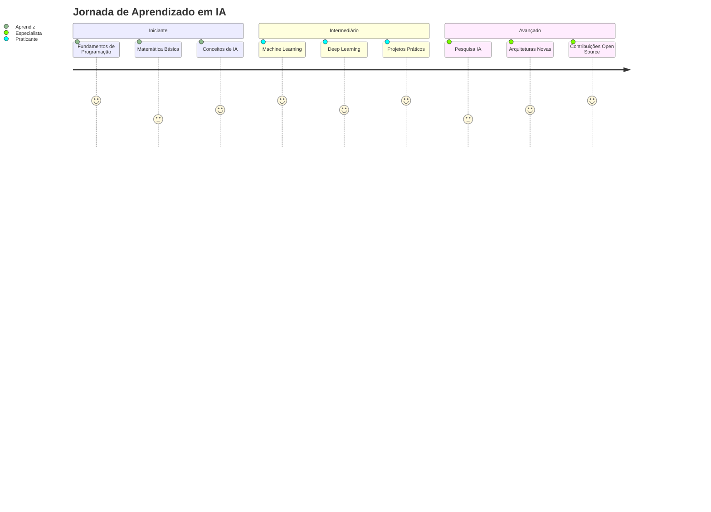

### Caminhos de Carreira

|Papel|Descrição|Skills Necessárias|
|---|---|---|
|**ML Engineer**|Desenvolve e implementa modelos ML em produção|Python, MLOps, Cloud, Engenharia de Software|
|**Data Scientist**|Analisa dados e cria modelos preditivos|Estatística, ML, Visualização, Domínio de Negócio|
|**AI Researcher**|Desenvolve novos algoritmos e arquiteturas|Matemática Avançada, Publicações, Experimentação|
|**AI Product Manager**|Define estratégia e roadmap de produtos IA|Visão de Produto, Técnico, Comunicação|
|**AI Ethics Specialist**|Garante desenvolvimento responsável de IA|Filosofia, Direito, Tecnologia, Análise de Impacto|

## 🔧 Ferramentas e Plataformas

### Stack de Desenvolvimento

|Categoria|Ferramentas Populares|
|---|---|
|**Frameworks ML**|TensorFlow, PyTorch, JAX, Scikit-learn|
|**LLM Frameworks**|LangChain, LlamaIndex, Semantic Kernel|
|**MLOps**|MLflow, Kubeflow, Weights & Biases|
|**Vector DBs**|Pinecone, Weaviate, Qdrant, Milvus|
|**Deployment**|Hugging Face, Replicate, AWS SageMaker|

### Plataformas de Desenvolvimento

|Plataforma|Foco Principal|
|---|---|
|**Google Colab**|Notebooks com GPU gratuita|
|**Kaggle**|Competições e datasets|
|**Hugging Face**|Modelos e datasets open source|
|**GitHub Copilot**|Assistente de código IA|
|**OpenAI Platform**|APIs para GPT e DALL-E|

---

> 📌 **Nota**: Este glossário é um documento vivo, atualizado constantemente conforme a tecnologia evolui. Para a versão mais recente, consulte sempre as fontes oficiais e comunidades de IA.

---

_Última atualização: Maio 2025_ _Versão: 3.0_ _Mantenedor: Comunidade IA Brasil_